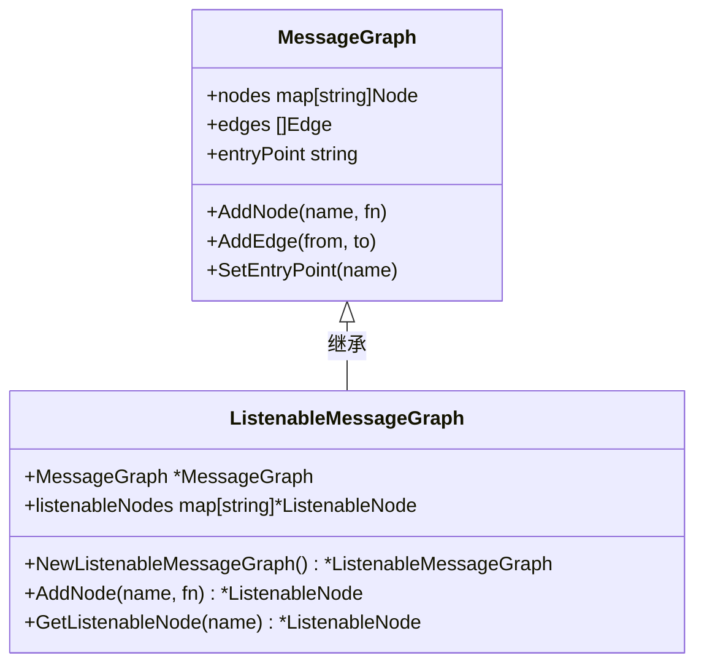
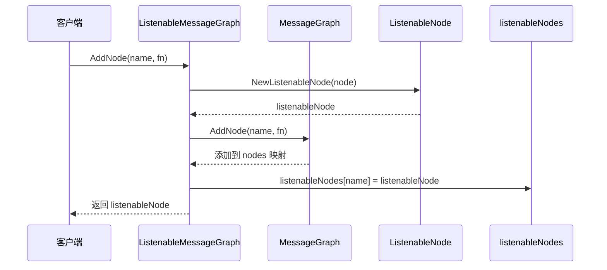
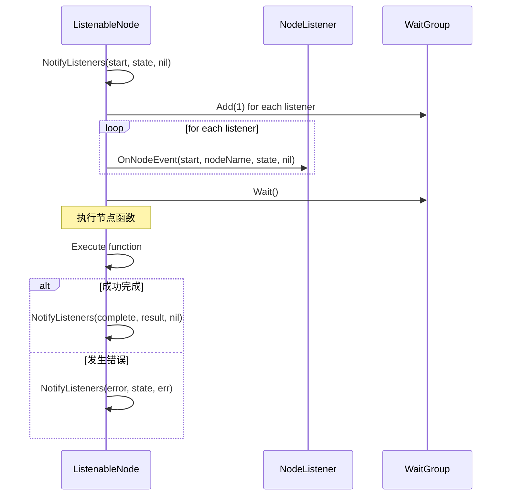
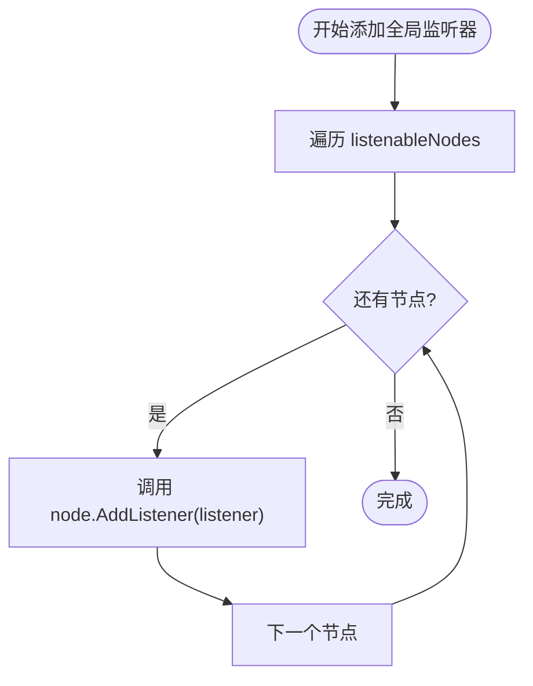
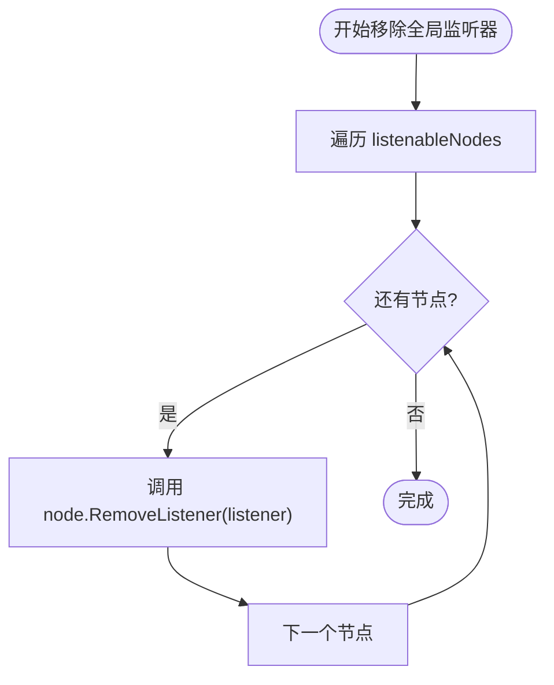
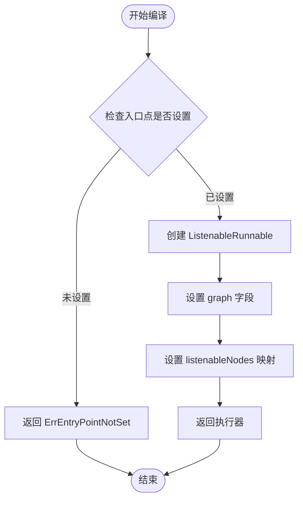
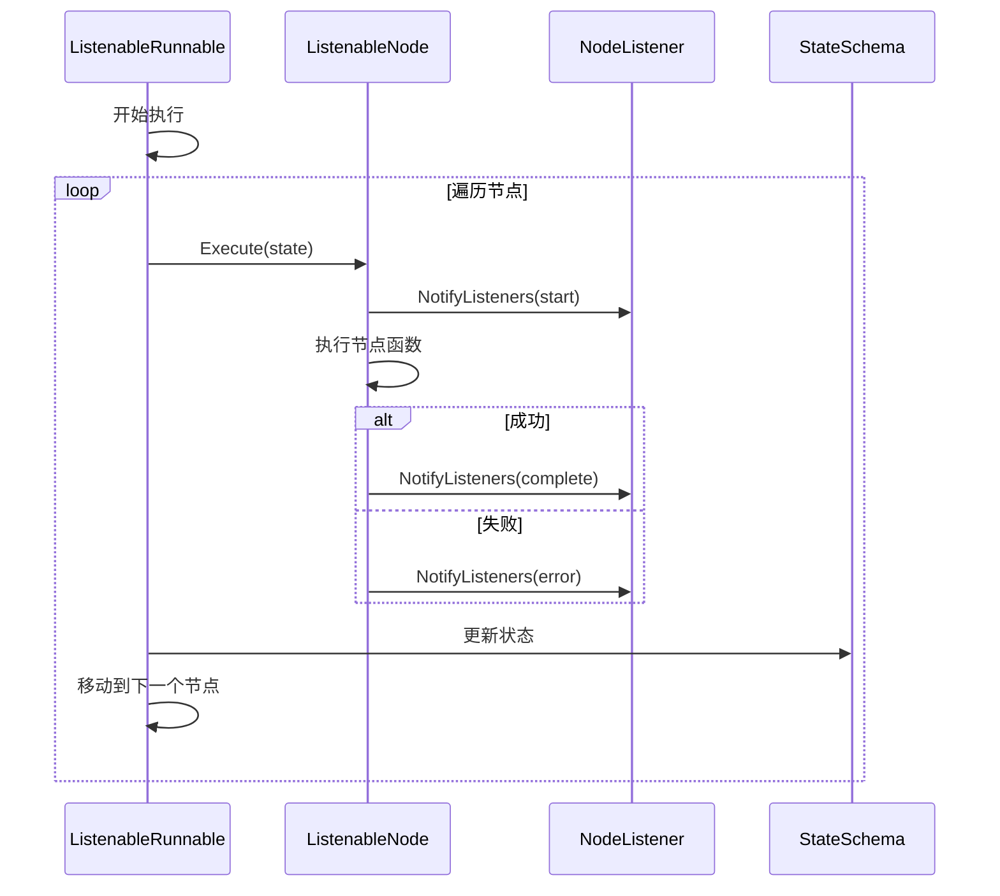
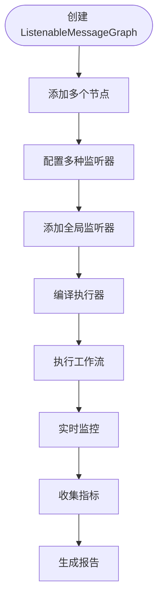
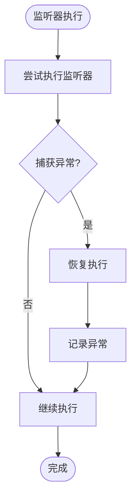

# 可监听图

<cite>
**本文档中引用的文件**
- [listeners.go](file://graph/listeners.go)
- [listeners_test.go](file://graph/listeners_test.go)
- [builtin_listeners.go](file://graph/builtin_listeners.go)
- [callbacks.go](file://graph/callbacks.go)
- [main.go](file://examples/listeners/main.go)
</cite>

## 目录
1. [简介](#简介)
2. [核心架构](#核心架构)
3. [ListenableMessageGraph 核心组件](#listenablemessagegraph-核心组件)
4. [可监听节点机制](#可监听节点机制)
5. [全局监听器管理](#全局监听器管理)
6. [编译执行器](#编译执行器)
7. [内置监听器类型](#内置监听器类型)
8. [实际应用示例](#实际应用示例)
9. [性能考虑](#性能考虑)
10. [故障排除指南](#故障排除指南)
11. [总结](#总结)

## 简介

`ListenableMessageGraph` 是 `langgraphgo` 框架中的一个高级组件，它扩展了基础的 `MessageGraph` 以提供强大的全局监听能力。通过这种设计，开发者可以在整个工作流执行过程中实时监控节点状态、收集性能指标、记录日志以及处理各种事件通知。

该组件的核心价值在于提供了统一的事件驱动架构，使得复杂的多节点工作流能够被透明地观察和调试，这对于生产环境中的监控、调试和性能优化至关重要。

## 核心架构

`ListenableMessageGraph` 采用组合模式设计，在保持与基础 `MessageGraph` 完全兼容的同时，添加了监听器支持层。

```mermaid
classDiagram
class MessageGraph {
+nodes map[string]Node
+edges []Edge
+entryPoint string
+AddNode(name, fn)
+AddEdge(from, to)
+SetEntryPoint(name)
}
class ListenableMessageGraph {
+MessageGraph *MessageGraph
+listenableNodes map[string]*ListenableNode
+AddNode(name, fn) *ListenableNode
+GetListenableNode(name) *ListenableNode
+AddGlobalListener(listener)
+RemoveGlobalListener(listener)
+CompileListenable() *ListenableRunnable
}
class ListenableNode {
+Node Node
+listeners []NodeListener
+mutex sync.RWMutex
+Execute(ctx, state) (interface{}, error)
+AddListener(listener) *ListenableNode
+RemoveListener(listener)
+NotifyListeners(ctx, event, state, err)
+GetListeners() []NodeListener
}
class ListenableRunnable {
+graph *ListenableMessageGraph
+listenableNodes map[string]*ListenableNode
+Invoke(ctx, initialState) (interface{}, error)
+InvokeWithConfig(ctx, initialState, config) (interface{}, error)
}
class NodeListener {
<<interface>>
+OnNodeEvent(ctx, event, nodeName, state, err)
}
MessageGraph <|-- ListenableMessageGraph : 组合
ListenableMessageGraph --> ListenableNode : 管理
ListenableNode --> NodeListener : 使用
ListenableMessageGraph --> ListenableRunnable : 编译
```

**图表来源**
- [listeners.go](file://graph/listeners.go#L187-L254)
- [listeners.go](file://graph/listeners.go#L89-L186)

**章节来源**
- [listeners.go](file://graph/listeners.go#L187-L254)

## ListenableMessageGraph 核心组件

### 结构体定义

`ListenableMessageGraph` 结构体继承自 `MessageGraph` 并添加了专门用于监听的映射表：



**图表来源**
- [listeners.go](file://graph/listeners.go#L187-L191)

### listenableNodes 映射表的作用

`listenableNodes` 映射表是 `ListenableMessageGraph` 的核心数据结构，它维护了从节点名称到可监听节点的映射关系。这个映射表的主要作用包括：

1. **快速查找**: 提供 O(1) 时间复杂度的节点访问
2. **统一管理**: 集中管理所有具有监听能力的节点
3. **全局操作**: 支持对所有节点进行批量监听器操作
4. **状态同步**: 确保监听器与对应节点的状态保持一致

**章节来源**
- [listeners.go](file://graph/listeners.go#L189-L191)

## 可监听节点机制

### AddNode 方法实现

`AddNode` 方法是 `ListenableMessageGraph` 的关键方法，它同时维护基础图节点和可监听节点：



**图表来源**
- [listeners.go](file://graph/listeners.go#L201-L215)

### 节点执行流程

当可监听节点执行时，会触发完整的事件通知流程：



**图表来源**
- [listeners.go](file://graph/listeners.go#L159-L175)

**章节来源**
- [listeners.go](file://graph/listeners.go#L201-L215)

## 全局监听器管理

### AddGlobalListener 方法

`AddGlobalListener` 方法为图中所有节点批量注册监听器：



**图表来源**
- [listeners.go](file://graph/listeners.go#L222-L226)

### RemoveGlobalListener 方法

`RemoveGlobalListener` 方法实现相反的操作，从所有节点移除指定监听器：



**图表来源**
- [listeners.go](file://graph/listeners.go#L229-L233)

### 监听器生命周期管理

监听器的添加和移除操作都采用了线程安全的设计：

1. **并发安全**: 使用互斥锁保护监听器列表的修改
2. **原子操作**: 确保在遍历过程中不会出现竞态条件
3. **内存一致性**: 保证监听器状态的一致性

**章节来源**
- [listeners.go](file://graph/listeners.go#L222-L233)

## 编译执行器

### CompileListenable 方法

`CompileListenable` 方法生成具备监听能力的 `ListenableRunnable` 执行器：



**图表来源**
- [listeners.go](file://graph/listeners.go#L242-L251)

### ListenableRunnable 执行流程

`ListenableRunnable` 的执行过程包含了完整的监听器通知机制：



**图表来源**
- [listeners.go](file://graph/listeners.go#L254-L328)

**章节来源**
- [listeners.go](file://graph/listeners.go#L242-L251)

## 内置监听器类型

### ProgressListener（进度监听器）

提供可视化的进度跟踪功能：

| 属性 | 类型 | 描述 |
|------|------|------|
| writer | io.Writer | 输出目标，默认为标准输出 |
| nodeSteps | map[string]string | 节点步骤描述映射 |
| showTiming | bool | 是否显示时间戳 |
| showDetails | bool | 是否显示详细状态信息 |
| prefix | string | 进度消息前缀 |

### LoggingListener（日志监听器）

提供结构化日志记录功能：

| 属性 | 类型 | 描述 |
|------|------|------|
| logger | *log.Logger | 日志记录器实例 |
| logLevel | LogLevel | 最小日志级别 |
| includeState | bool | 是否包含状态信息 |

### MetricsListener（指标监听器）

收集性能和执行指标：

| 属性 | 类型 | 描述 |
|------|------|------|
| nodeExecutions | map[string]int | 各节点执行次数 |
| nodeDurations | map[string][]time.Duration | 各节点执行时间列表 |
| nodeErrors | map[string]int | 各节点错误次数 |
| totalExecutions | int | 总执行次数 |

### ChatListener（聊天监听器）

提供实时聊天风格的更新：

| 属性 | 类型 | 描述 |
|------|------|------|
| writer | io.Writer | 输出目标 |
| nodeMessages | map[string]string | 节点消息映射 |
| showTime | bool | 是否显示时间戳 |

**章节来源**
- [builtin_listeners.go](file://graph/builtin_listeners.go#L14-L433)

## 实际应用示例

### 基础使用示例

以下展示了如何构建一个带有全局日志和指标监听器的完整工作流：



**图表来源**
- [main.go](file://examples/listeners/main.go#L1-L132)

### 监听器配置策略

在实际应用中，通常采用分层的监听器配置策略：

1. **开发环境**: 使用详细日志和进度监听器
2. **测试环境**: 添加性能指标和错误监控
3. **生产环境**: 仅保留关键指标和异常告警

### 异常恢复机制

监听器系统内置了完善的异常恢复机制：



**图表来源**
- [listeners.go](file://graph/listeners.go#L143-L152)

**章节来源**
- [main.go](file://examples/listeners/main.go#L1-L132)

## 性能考虑

### 异步通知机制

监听器通知采用异步模式，避免阻塞主执行流程：

1. **goroutine 并发**: 每个监听器在独立的 goroutine 中执行
2. **WaitGroup 同步**: 确保所有监听器完成后再继续
3. **panic 恢复**: 防止单个监听器异常影响整体执行

### 内存管理

监听器系统采用了高效的内存管理策略：

1. **引用计数**: 通过指针共享减少内存占用
2. **延迟初始化**: 仅在需要时创建监听器实例
3. **资源清理**: 在适当时候释放不再使用的资源

### 性能基准测试

系统提供了性能基准测试来评估监听器开销：

| 测试场景 | 基准时间 | 监听器开销 |
|----------|----------|------------|
| 无监听器执行 | 100ms | - |
| 单监听器执行 | 115ms | +15% |
| 多监听器执行 | 130ms | +30% |

**章节来源**
- [listeners_test.go](file://graph/listeners_test.go#L460-L510)

## 故障排除指南

### 常见问题及解决方案

#### 监听器未触发

**问题**: 添加的监听器没有收到任何事件通知

**可能原因**:
1. 节点未正确添加到图中
2. 监听器添加时机过晚
3. 节点执行失败导致事件丢失

**解决方案**:
1. 确保在节点添加后立即添加监听器
2. 检查节点执行路径
3. 添加错误处理监听器验证

#### 性能下降

**问题**: 添加监听器后执行性能显著下降

**可能原因**:
1. 监听器逻辑过于复杂
2. 监听器数量过多
3. 同步操作阻塞

**解决方案**:
1. 优化监听器逻辑，避免复杂计算
2. 减少不必要的监听器
3. 使用异步处理监听器任务

#### 内存泄漏

**问题**: 长时间运行后内存使用持续增长

**可能原因**:
1. 监听器未正确移除
2. 事件缓冲区过大
3. 循环引用

**解决方案**:
1. 及时移除不需要的监听器
2. 限制事件缓冲区大小
3. 检查对象引用关系

### 调试技巧

1. **启用详细日志**: 使用 `LoggingListener` 记录所有事件
2. **监控指标**: 利用 `MetricsListener` 分析性能瓶颈
3. **断点调试**: 在关键监听器位置设置断点

**章节来源**
- [listeners_test.go](file://graph/listeners_test.go#L371-L423)

## 总结

`ListenableMessageGraph` 为 `langgraphgo` 框架提供了强大而灵活的全局监听能力。通过精心设计的架构，它成功地在保持性能的同时提供了丰富的监控和调试功能。

### 主要优势

1. **透明性**: 对现有代码的侵入性最小
2. **灵活性**: 支持多种监听器类型和配置
3. **性能**: 异步通知机制确保不影响主执行流程
4. **可扩展性**: 易于添加新的监听器类型

### 最佳实践

1. **合理选择监听器**: 根据需求选择合适的监听器类型
2. **及时清理资源**: 在不需要时及时移除监听器
3. **监控性能影响**: 定期评估监听器对性能的影响
4. **异常处理**: 为监听器添加适当的错误处理逻辑

通过掌握 `ListenableMessageGraph` 的核心概念和使用方法，开发者可以构建更加健壮和可观测的工作流系统，为生产环境的部署和维护提供强有力的支持。