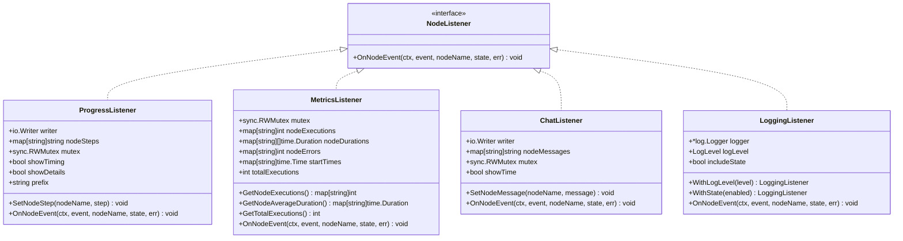

# 可监听节点

<cite>
**本文档中引用的文件**
- [graph/listeners.go](file://graph/listeners.go)
- [examples/listeners/main.go](file://examples/listeners/main.go)
- [graph/builtin_listeners.go](file://graph/builtin_listeners.go)
- [graph/listeners_test.go](file://graph/listeners_test.go)
- [graph/schema.go](file://graph/schema.go)
- [graph/graph.go](file://graph/graph.go)
</cite>

## 目录
1. [简介](#简介)
2. [项目结构](#项目结构)
3. [核心组件](#核心组件)
4. [架构概览](#架构概览)
5. [详细组件分析](#详细组件分析)
6. [依赖关系分析](#依赖关系分析)
7. [性能考虑](#性能考虑)
8. [故障排除指南](#故障排除指南)
9. [结论](#结论)

## 简介

`ListenableNode` 是 LangGraph Go 框架中的一个关键结构体，它扩展了基础的 `Node` 结构体，为其添加了监听器支持能力。该设计模式采用了嵌入式组合的方式，通过在 `ListenableNode` 中嵌入 `Node` 来实现功能扩展，同时维护了良好的代码复用性和接口一致性。

`ListenableNode` 的核心价值在于提供了非阻塞的异步事件广播机制，使得开发者能够轻松地为节点执行过程添加监控、日志记录、性能统计等横切关注点，而不会影响主业务逻辑的执行效率。

## 项目结构

LangGraph Go 的监听器系统采用分层架构设计，主要包含以下核心模块：


**图表来源**
- [graph/listeners.go](file://graph/listeners.go#L89-L94)
- [graph/builtin_listeners.go](file://graph/builtin_listeners.go#L14-L200)

**章节来源**
- [graph/listeners.go](file://graph/listeners.go#L1-L335)
- [graph/graph.go](file://graph/graph.go#L52-L59)

## 核心组件

### ListenableNode 结构体

`ListenableNode` 是整个监听器系统的核心，它通过嵌入基础 `Node` 结构体实现了功能扩展：

```mermaid
classDiagram
class Node {
+string Name
+func Function
+execute(ctx, state) (interface{}, error)
}
class ListenableNode {
+Node embedded
+[]NodeListener listeners
+sync.RWMutex mutex
+AddListener(listener) ListenableNode
+RemoveListener(listener) void
+GetListeners() []NodeListener
+NotifyListeners(ctx, event, state, err) void
+Execute(ctx, state) (interface{}, error)
}
class NodeListener {
<<interface>>
+OnNodeEvent(ctx, event, nodeName, state, err) void
}
Node <|-- ListenableNode : "嵌入扩展"
NodeListener --> ListenableNode : "管理"
```

**图表来源**
- [graph/listeners.go](file://graph/listeners.go#L89-L94)
- [graph/listeners.go](file://graph/listeners.go#L51-L55)

### 事件类型系统

框架定义了一套完整的节点事件类型，用于描述节点执行的不同阶段：

| 事件类型 | 描述 | 触发时机 |
|---------|------|----------|
| `NodeEventStart` | 节点开始执行 | 调用 `Execute` 方法时 |
| `NodeEventProgress` | 节点执行进度 | 执行过程中的任意时刻 |
| `NodeEventComplete` | 节点成功完成 | 正常执行结束时 |
| `NodeEventError` | 节点执行出错 | 执行过程中发生错误时 |
| `EventChainStart` | 图执行开始 | 整个图开始执行时 |
| `EventChainEnd` | 图执行结束 | 整个图正常完成时 |

**章节来源**
- [graph/listeners.go](file://graph/listeners.go#L10-L49)

## 架构概览

`ListenableNode` 的整体架构遵循观察者模式，通过事件驱动的方式实现松耦合的设计：


**图表来源**
- [graph/listeners.go](file://graph/listeners.go#L159-L175)
- [graph/listeners.go](file://graph/listeners.go#L128-L157)

## 详细组件分析

### 嵌入式扩展机制

`ListenableNode` 通过 Go 语言的嵌入式结构体实现了对基础 `Node` 的透明扩展：

```mermaid
classDiagram
class BaseNode {
+string Name
+func Function
+execute(ctx, state) (interface{}, error)
}
class ListenableNode {
+Node embedded
+[]NodeListener listeners
+sync.RWMutex mutex
+AddListener(listener) ListenableNode
+RemoveListener(listener) void
+GetListeners() []NodeListener
+NotifyListeners(ctx, event, state, err) void
+Execute(ctx, state) (interface{}, error)
}
note for ListenableNode "通过嵌入式扩展<br/>继承所有 Node 功能<br/>并添加监听器支持"
```

**图表来源**
- [graph/listeners.go](file://graph/listeners.go#L89-L94)

这种设计的优势包括：
- **功能透明性**：`ListenableNode` 可以直接调用 `Node` 的所有方法
- **代码复用**：避免重复实现相同的功能
- **接口一致性**：保持与基础 `Node` 相同的 API 接口

**章节来源**
- [graph/listeners.go](file://graph/listeners.go#L89-L102)

### 并发安全的监听器管理

`ListenableNode` 使用 `sync.RWMutex` 来确保监听器列表的并发安全性：


**图表来源**
- [graph/listeners.go](file://graph/listeners.go#L105-L125)

#### AddListener 方法实现

添加监听器时的并发安全保障：


**图表来源**
- [graph/listeners.go](file://graph/listeners.go#L105-L111)

#### RemoveListener 方法实现

移除监听器时的精确匹配机制：


**图表来源**
- [graph/listeners.go](file://graph/listeners.go#L114-L125)

**章节来源**
- [graph/listeners.go](file://graph/listeners.go#L105-L125)

### 异步事件广播机制

`NotifyListeners` 方法是 `ListenableNode` 最核心的功能，它实现了非阻塞的异步事件广播：


**图表来源**
- [graph/listeners.go](file://graph/listeners.go#L128-L157)

#### 关键实现细节

1. **读写分离**：使用读锁获取监听器列表，避免写操作阻塞读取
2. **WaitGroup 同步**：确保所有监听器都完成后再继续
3. **panic 恢复**：每个监听器都在独立的 goroutine 中执行，并捕获可能的 panic
4. **非阻塞设计**：主执行流程不会等待监听器完成

**章节来源**
- [graph/listeners.go](file://graph/listeners.go#L128-L157)

### 事件通知与节点执行的集成

`Execute` 方法展示了如何将事件通知与节点执行无缝集成：


**图表来源**
- [graph/listeners.go](file://graph/listeners.go#L159-L175)

这种设计模式的优势：
- **透明性**：用户无需关心事件通知逻辑
- **一致性**：所有节点执行都遵循相同的事件流程
- **灵活性**：可以随时添加或移除监听器

**章节来源**
- [graph/listeners.go](file://graph/listeners.go#L159-L175)

### 内置监听器系统

框架提供了多种内置监听器，满足不同的监控需求：



**图表来源**
- [graph/builtin_listeners.go](file://graph/builtin_listeners.go#L14-L200)

**章节来源**
- [graph/builtin_listeners.go](file://graph/builtin_listeners.go#L14-L433)

## 依赖关系分析

`ListenableNode` 的依赖关系体现了清晰的分层架构：


**图表来源**
- [graph/listeners.go](file://graph/listeners.go#L1-L10)
- [graph/builtin_listeners.go](file://graph/builtin_listeners.go#L1-L15)

**章节来源**
- [graph/listeners.go](file://graph/listeners.go#L1-L10)
- [graph/builtin_listeners.go](file://graph/builtin_listeners.go#L1-L15)

## 性能考虑

### 并发性能优化

1. **读写分离锁**：使用 `sync.RWMutex` 实现读多写少场景下的高性能
2. **非阻塞通知**：通过 goroutine 和 WaitGroup 实现异步事件传播
3. **内存池化**：监听器列表的复制操作避免了频繁的内存分配

### 内存使用优化

1. **延迟初始化**：监听器列表只有在需要时才分配内存
2. **对象复用**：事件对象在不同监听器间共享
3. **垃圾回收友好**：及时释放不再需要的资源

### 扩展性设计

1. **插件化架构**：新的监听器可以轻松集成
2. **配置驱动**：通过配置控制监听器的行为
3. **接口抽象**：基于接口的设计便于测试和模拟

## 故障排除指南

### 常见问题及解决方案

#### 监听器未被调用

**症状**：添加的监听器没有收到任何事件通知

**可能原因**：
1. 监听器添加时机过晚
2. 节点执行过程中发生错误
3. 监听器内部抛出异常

**解决方案**：
- 确保在节点执行前添加监听器
- 检查节点函数的错误处理
- 添加日志记录确认监听器是否被正确添加

#### 性能问题

**症状**：节点执行变慢，怀疑监听器影响性能

**诊断步骤**：
1. 检查监听器数量是否过多
2. 分析监听器的执行时间
3. 考虑使用异步处理

**优化建议**：
- 减少不必要的监听器
- 优化监听器的处理逻辑
- 使用批量处理替代逐个处理

#### 内存泄漏

**症状**：长时间运行后内存使用持续增长

**排查要点**：
1. 检查监听器是否正确移除
2. 确认事件对象的生命周期管理
3. 分析 goroutine 泄漏情况

**预防措施**：
- 及时清理不需要的监听器
- 使用弱引用避免循环依赖
- 监控 goroutine 数量

**章节来源**
- [graph/listeners_test.go](file://graph/listeners_test.go#L371-L423)

## 结论

`ListenableNode` 结构体代表了 LangGraph Go 框架在架构设计上的精妙之处。它通过巧妙的嵌入式扩展、并发安全的监听器管理和非阻塞的事件广播机制，为开发者提供了一个强大而灵活的监控和调试工具。

### 主要优势

1. **透明扩展**：对基础 `Node` 功能的完全透明扩展
2. **并发安全**：完善的并发控制机制确保线程安全
3. **异步处理**：非阻塞的事件传播不影响主业务流程
4. **灵活配置**：丰富的内置监听器满足不同需求
5. **易于使用**：简洁的 API 设计降低学习成本

### 应用场景

- **生产监控**：实时跟踪节点执行状态和性能指标
- **调试辅助**：详细的执行日志帮助定位问题
- **用户体验**：提供进度反馈和状态更新
- **质量保证**：自动化的错误检测和报告

### 最佳实践

1. **合理选择监听器**：根据实际需求选择合适的监听器类型
2. **注意性能影响**：避免在监听器中执行耗时操作
3. **妥善处理错误**：确保监听器内部的错误不会影响主流程
4. **及时清理资源**：在适当的时候移除不需要的监听器

通过深入理解和正确使用 `ListenableNode`，开发者可以构建更加健壮、可监控和可维护的图形执行系统。