# 监听器

<cite>
**本文档中引用的文件**
- [graph/listeners.go](file://graph/listeners.go)
- [graph/listeners_typed.go](file://graph/listeners_typed.go)
- [graph/builtin_listeners.go](file://graph/builtin_listeners.go)
- [graph/streaming.go](file://graph/streaming.go)
- [examples/listeners/main.go](file://examples/listeners/main.go)
- [examples/basic_example/main.go](file://examples/basic_example/main.go)
- [examples/generic_state_graph_listenable/listenable_example.go](file://examples/generic_state_graph_listenable/listenable_example.go)
- [graph/listeners_test.go](file://graph/listeners_test.go)
- [graph/listeners_typed_test.go](file://graph/listeners_typed_test.go)
</cite>

## 更新摘要
**已做更改**
- 更新了核心接口与类型部分，以反映类型化监听器（NodeListenerTyped）的引入
- 新增了类型化监听器（NodeListenerTyped）和类型化可监听节点（ListenableNodeTyped）的说明
- 更新了可监听组件部分，增加了ListenableStateGraphTyped和ListenableRunnableTyped的说明
- 更新了使用示例部分，增加了类型化监听器的使用示例
- 更新了异步执行机制和错误处理策略部分，以反映类型化监听器的实现细节

## 目录
1. [简介](#简介)
2. [核心接口与类型](#核心接口与类型)
3. [内置监听器](#内置监听器)
4. [可监听组件](#可监听组件)
5. [流式处理监听器](#流式处理监听器)
6. [回调处理器系统](#回调处理器系统)
7. [使用示例](#使用示例)
8. [异步执行机制](#异步执行机制)
9. [错误处理策略](#错误处理策略)
10. [最佳实践](#最佳实践)

## 简介

LangGraphGo 的监听器系统是一个强大的事件驱动架构，允许开发者在图执行过程中的各个阶段捕获和响应事件。该系统提供了灵活的扩展机制，支持日志记录、进度追踪、性能监控和自定义业务逻辑的实现。

监听器系统的核心设计理念是：
- **非侵入性**：监听器不会干扰主执行流程
- **异步执行**：监听器通知在独立的 goroutine 中执行
- **类型安全**：强类型的事件系统确保编译时安全性
- **可扩展性**：支持多种内置监听器和自定义实现

## 核心接口与类型

### NodeEvent 事件类型

监听器系统定义了丰富的事件类型来表示图执行的不同阶段：

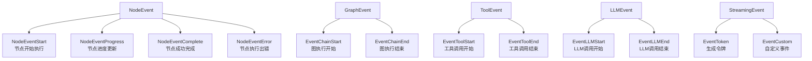

**图表来源**
- [graph/listeners.go](file://graph/listeners.go#L13-L48)

### NodeListener 接口

`NodeListener` 是监听器系统的核心接口，定义了事件处理的标准契约：

```mermaid
classDiagram
class NodeListener {
<<interface>>
+OnNodeEvent(ctx Context, event NodeEvent, nodeName string, state interface{}, err error)
}
class NodeListenerFunc {
+func(ctx Context, event NodeEvent, nodeName string, state interface{}, err error)
}
NodeListenerFunc ..|> NodeListener : 实现
```

**图表来源**
- [graph/listeners.go](file://graph/listeners.go#L51-L63)

### NodeListenerTyped 接口

`NodeListenerTyped` 是类型化监听器的核心接口，提供类型安全的事件处理：

```mermaid
classDiagram
class NodeListenerTyped[S] {
<<interface>>
+OnNodeEvent(ctx Context, event NodeEvent, nodeName string, state S, err error)
}
class NodeListenerTypedFunc[S] {
+func(ctx Context, event NodeEvent, nodeName string, state S, err error)
}
NodeListenerTypedFunc ..|> NodeListenerTyped : 实现
```

**图表来源**
- [graph/listeners_typed.go](file://graph/listeners_typed.go#L10-L13)

### StreamEvent 结构体

`StreamEvent` 提供了详细的事件信息，用于流式处理和事件传递：

| 字段 | 类型 | 描述 |
|------|------|------|
| Timestamp | time.Time | 事件发生的时间戳 |
| NodeName | string | 生成事件的节点名称 |
| Event | NodeEvent | 事件类型标识符 |
| State | interface{} | 当前状态快照 |
| Error | error | 错误信息（如果适用） |
| Metadata | map[string]interface{} | 额外的元数据 |
| Duration | time.Duration | 执行持续时间（仅完成事件） |

**节来源**
- [graph/listeners.go](file://graph/listeners.go#L66-L87)

### StreamEventTyped 结构体

`StreamEventTyped` 是类型化的流式事件结构体，提供类型安全的事件数据：

| 字段 | 类型 | 描述 |
|------|------|------|
| Timestamp | time.Time | 事件发生的时间戳 |
| NodeName | string | 生成事件的节点名称 |
| Event | NodeEvent | 事件类型标识符 |
| State | S | 当前状态快照（类型化） |
| Error | error | 错误信息（如果适用） |
| Metadata | map[string]interface{} | 额外的元数据 |
| Duration | time.Duration | 执行持续时间（仅完成事件） |

**节来源**
- [graph/listeners_typed.go](file://graph/listeners_typed.go#L25-L45)

## 内置监听器

LangGraphGo 提供了多种预构建的监听器，满足常见的监控和调试需求：

### ProgressListener 进度监听器

提供可视化的进度跟踪功能：

```mermaid
classDiagram
class ProgressListener {
-writer io.Writer
-nodeSteps map[string]string
-mutex sync.RWMutex
-showTiming bool
-showDetails bool
-prefix string
+SetNodeStep(nodeName, step string)
+WithTiming(enabled bool) ProgressListener
+WithDetails(enabled bool) ProgressListener
+WithPrefix(prefix string) ProgressListener
}
class NodeListener {
<<interface>>
+OnNodeEvent(ctx Context, event NodeEvent, nodeName string, state interface{}, err error)
}
ProgressListener ..|> NodeListener : 实现
```

**图表来源**
- [graph/builtin_listeners.go](file://graph/builtin_listeners.go#L14-L68)

### LoggingListener 日志监听器

提供结构化的日志记录功能：

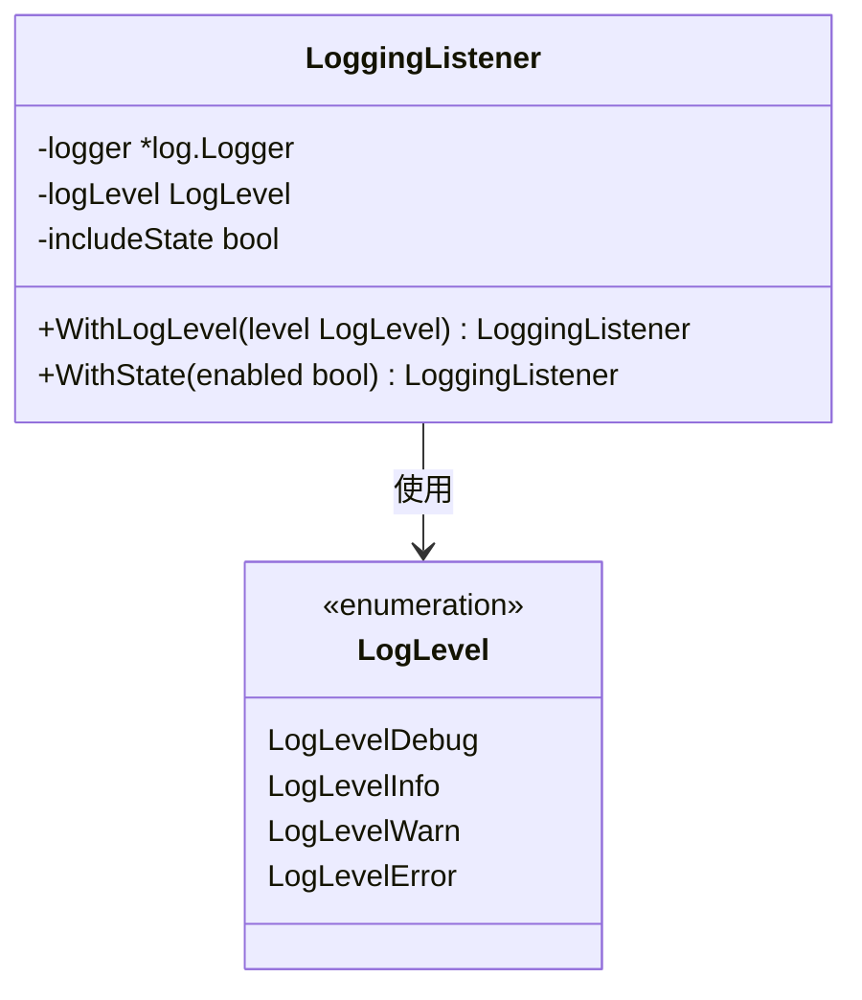

**图表来源**
- [graph/builtin_listeners.go](file://graph/builtin_listeners.go#L118-L200)

### MetricsListener 性能指标监听器

收集详细的性能和执行统计信息：

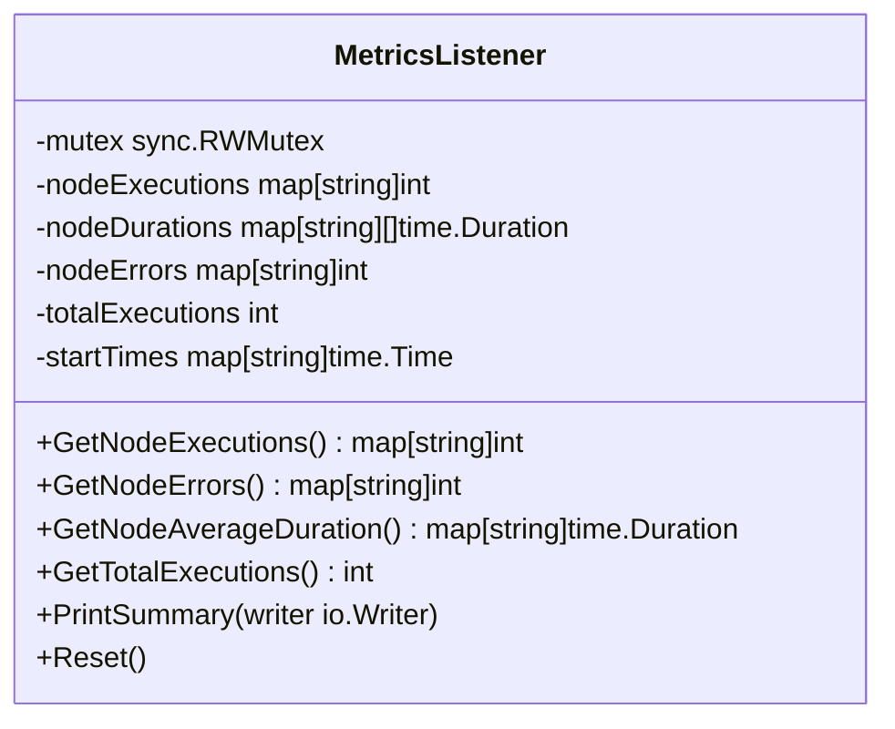

**图表来源**
- [graph/builtin_listeners.go](file://graph/builtin_listeners.go#L202-L351)

### ChatListener 聊天风格监听器

提供实时的聊天式更新体验：

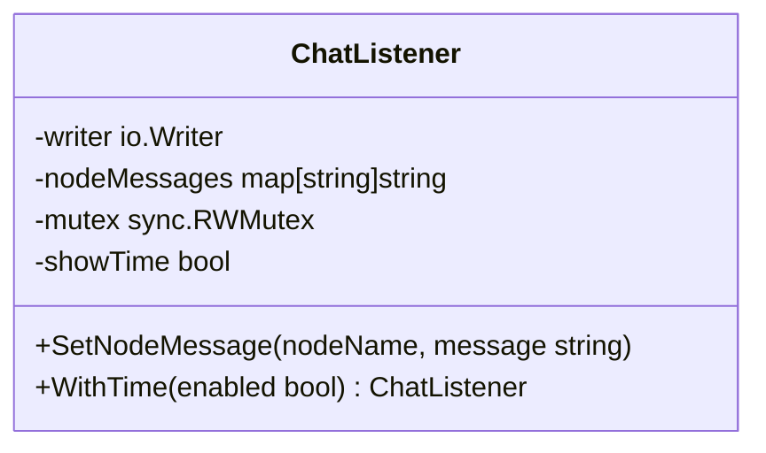

**图表来源**
- [graph/builtin_listeners.go](file://graph/builtin_listeners.go#L353-L432)

**节来源**
- [graph/builtin_listeners.go](file://graph/builtin_listeners.go#L14-L433)

## 可监听组件

### ListenableNode 可监听节点

`ListenableNode` 为单个节点添加监听能力：

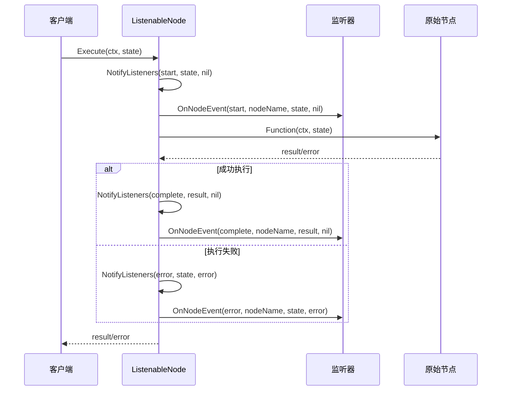

**图表来源**
- [graph/listeners.go](file://graph/listeners.go#L159-L175)

### ListenableNodeTyped 类型化可监听节点

`ListenableNodeTyped` 为类型化节点提供监听能力，确保类型安全：

```mermaid
classDiagram
class ListenableNodeTyped[S] {
+NodeTyped[S]
+listeners []listenerWrapper[S]
+mutex sync.RWMutex
+nextID int64
+AddListener(listener NodeListenerTyped[S]) ListenableNodeTyped[S]
+RemoveListener(listenerID string)
+RemoveListenerByFunc(listener NodeListenerTyped[S])
+NotifyListeners(ctx Context, event NodeEvent, state S, err error)
+Execute(ctx Context, state S) (S, error)
+GetListeners() []NodeListenerTyped[S]
+GetListenerIDs() []string
}
class listenerWrapper[S] {
+id string
+listener NodeListenerTyped[S]
}
ListenableNodeTyped --> listenerWrapper : 包含
```

**图表来源**
- [graph/listeners_typed.go](file://graph/listeners_typed.go#L54-L59)

### ListenableMessageGraph 可监听消息图

扩展整个消息图的监听能力：

```mermaid
classDiagram
class ListenableStateGraph {
+*StateGraph
+listenableNodes map[string]*ListenableNode
+AddNode(name string, fn func) *ListenableNode
+GetListenableNode(name string) *ListenableNode
+AddGlobalListener(listener NodeListener)
+RemoveGlobalListener(listener NodeListener)
}
class ListenableNode {
+Node
+listeners []NodeListener
+mutex sync.RWMutex
+AddListener(listener NodeListener) ListenableNode
+RemoveListener(listener NodeListener)
+NotifyListeners(ctx Context, event NodeEvent, state interface{}, err error)
}
ListenableStateGraph --> ListenableNode : 包含
```

**图表来源**
- [graph/listeners.go](file://graph/listeners.go#L187-L234)

### ListenableStateGraphTyped 类型化可监听状态图

`ListenableStateGraphTyped` 为类型化状态图提供监听能力：

```mermaid
classDiagram
class ListenableStateGraphTyped[S] {
+*StateGraphTyped[S]
+listenableNodes map[string]*ListenableNodeTyped[S]
+AddNode(name string, description string, fn func) *ListenableNodeTyped[S]
+GetListenableNode(name string) *ListenableNodeTyped[S]
+AddGlobalListener(listener NodeListenerTyped[S])
+RemoveGlobalListener(listener NodeListenerTyped[S])
+RemoveGlobalListenerByID(listenerID string)
+CompileListenable() (*ListenableRunnableTyped[S], error)
}
class ListenableNodeTyped[S] {
+NodeTyped[S]
+listeners []listenerWrapper[S]
+mutex sync.RWMutex
+nextID int64
}
ListenableStateGraphTyped --> ListenableNodeTyped : 包含
```

**图表来源**
- [graph/listeners_typed.go](file://graph/listeners_typed.go#L203-L207)

### ListenableRunnable 可监听可运行对象

提供完整的监听器支持的图执行能力：

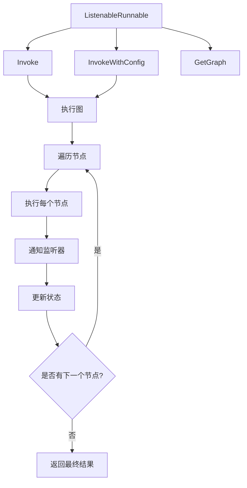

**图表来源**
- [graph/listeners.go](file://graph/listeners.go#L254-L329)

### ListenableRunnableTyped 类型化可监听可运行对象

`ListenableRunnableTyped` 为类型化可运行对象提供监听能力：

```mermaid
classDiagram
class ListenableRunnableTyped[S] {
+graph *ListenableStateGraphTyped[S]
+listenableNodes map[string]*ListenableNodeTyped[S]
+runnable *StateRunnableTyped[S]
+Invoke(ctx Context, initialState S) (S, error)
+InvokeWithConfig(ctx Context, initialState S, config *Config) (S, error)
+Stream(ctx Context, initialState S) <-chan StreamEventTyped[S]
+SetTracer(tracer *Tracer)
+WithTracer(tracer *Tracer) *ListenableRunnableTyped[S]
+GetGraph() *Exporter
}
```

**图表来源**
- [graph/listeners_typed.go](file://graph/listeners_typed.go#L260-L264)

**节来源**
- [graph/listeners.go](file://graph/listeners.go#L89-L335)
- [graph/listeners_typed.go](file://graph/listeners_typed.go#L10-L451)

## 流式处理监听器

### StreamingListener 流式监听器

专门设计用于实时事件流处理的监听器：

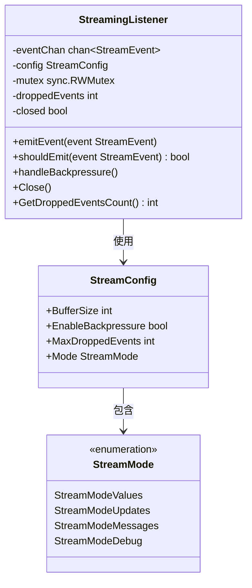

**图表来源**
- [graph/streaming.go](file://graph/streaming.go#L66-L135)

### StreamingListenerTyped 类型化流式监听器

`StreamingListenerTyped` 为类型化流式处理提供支持：

```mermaid
classDiagram
class StreamingListenerTyped[S] {
-eventChan chan<- StreamEventTyped[S]
+OnNodeEvent(ctx Context, event NodeEvent, nodeName string, state S, err error)
}
```

**图表来源**
- [graph/listeners_typed.go](file://graph/listeners_typed.go#L428-L431)

### StreamResult 流式结果

封装流式执行的所有输出通道：

| 字段 | 类型 | 描述 |
|------|------|------|
| Events | <-chan StreamEvent | 实时事件流 |
| Result | <-chan interface{} | 最终执行结果 |
| Errors | <-chan error | 执行过程中发生的错误 |
| Done | <-chan struct{} | 执行完成信号 |
| Cancel | context.CancelFunc | 取消执行的方法 |

### StreamingRunnable 流式可运行对象

提供流式执行能力的包装器：

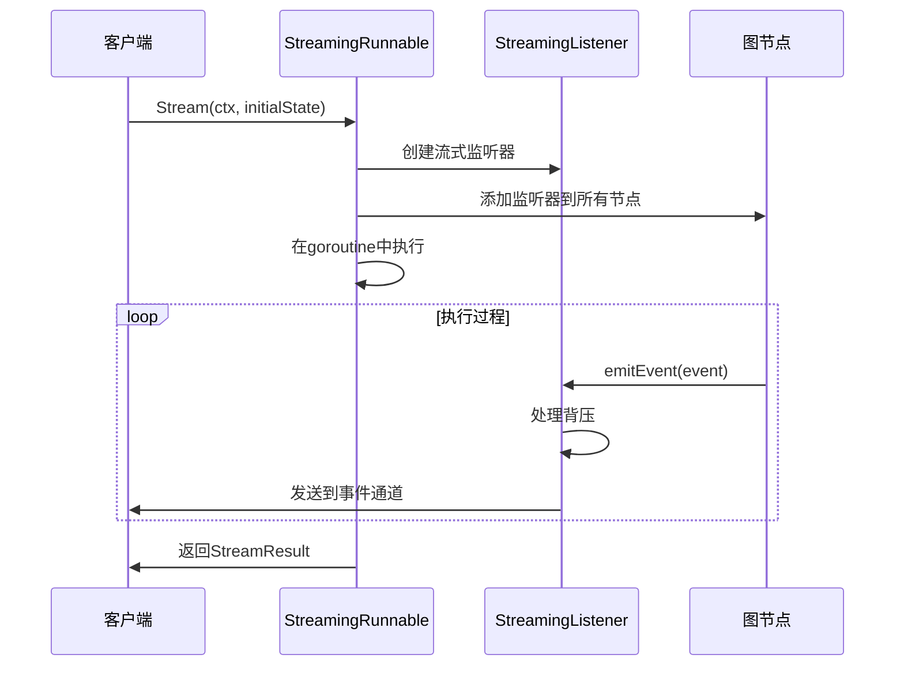

**图表来源**
- [graph/streaming.go](file://graph/streaming.go#L289-L358)

**节来源**
- [graph/streaming.go](file://graph/streaming.go#L66-L476)

## 回调处理器系统

### CallbackHandler 回调处理器

定义了完整的回调处理接口，支持链、LLM、工具和检索器事件：

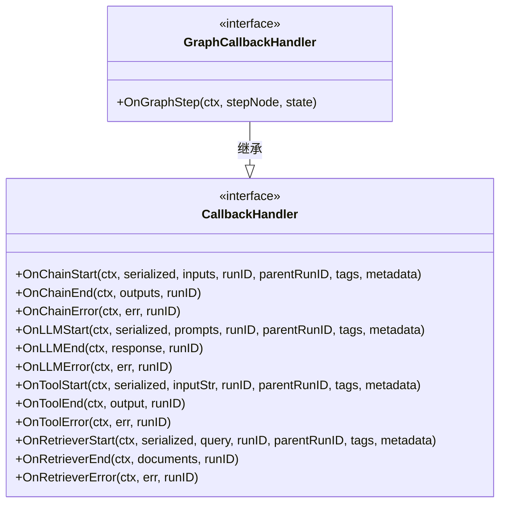

**图表来源**
- [graph/callbacks.go](file://graph/callbacks.go#L8-L37)

### Config 配置结构

提供灵活的执行配置选项：

```mermaid
classDiagram
class Config {
+Callbacks []CallbackHandler
+Metadata map[string]interface{}
+Tags []string
+Configurable map[string]interface{}
+RunName string
+Timeout *time.Duration
+InterruptBefore []string
+InterruptAfter []string
+ResumeFrom []string
+ResumeValue interface{}
}
```

**图表来源**
- [graph/callbacks.go](file://graph/callbacks.go#L39-L71)

**节来源**
- [graph/callbacks.go](file://graph/callbacks.go#L8-L94)

## 使用示例

### 基本监听器使用

以下展示了如何创建和注册不同类型的监听器：

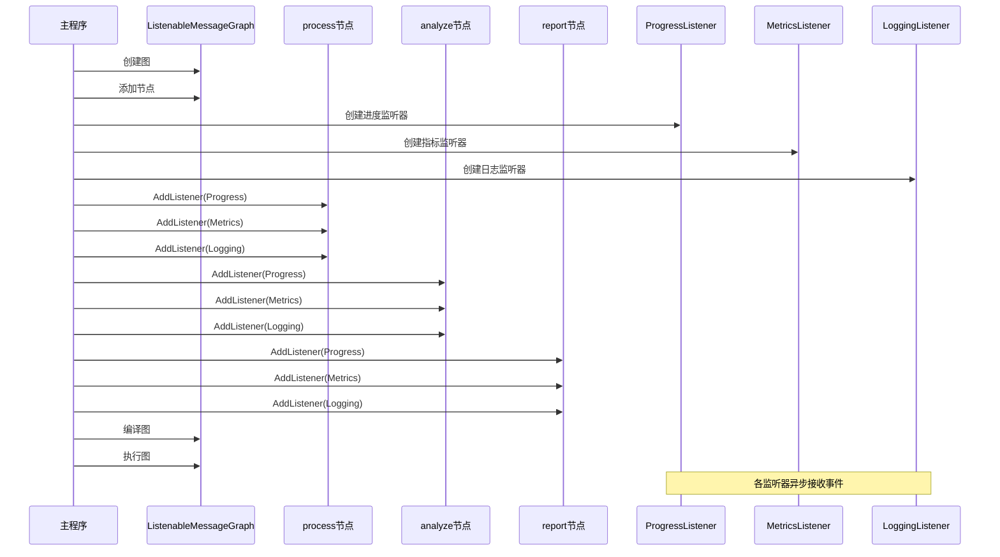

**图表来源**
- [examples/listeners/main.go](file://examples/listeners/main.go#L31-L64)

### 类型化监听器使用

演示如何使用类型化监听器实现类型安全的事件处理：

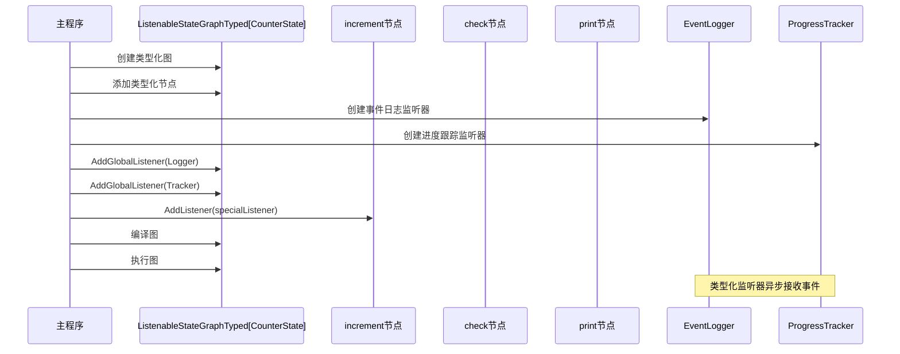

**图表来源**
- [examples/generic_state_graph_listenable/listenable_example.go](file://examples/generic_state_graph_listenable/listenable_example.go#L58-L145)

### 流式处理示例

演示如何使用流式监听器实现实时事件处理：

```mermaid
flowchart TD
A[创建StreamingMessageGraph] --> B[添加节点和边]
B --> C[编译为StreamingRunnable]
C --> D[创建StreamConfig]
D --> E[设置流模式]
E --> F[创建StreamingExecutor]
F --> G[ExecuteWithCallback]
G --> H[事件回调函数]
G --> I[结果回调函数]
H --> J[处理StreamEvent]
I --> K[处理最终结果]
J --> L[实时显示进度]
J --> M[记录性能指标]
J --> N[生成日志]
```

**图表来源**
- [graph/streaming.go](file://graph/streaming.go#L402-L467)

**节来源**
- [examples/listeners/main.go](file://examples/listeners/main.go#L1-132)
- [examples/basic_example/main.go](file://examples/basic_example/main.go#L44-L62)

## 异步执行机制

### 并发模型

监听器系统采用异步并发模型确保主执行流程不受影响：

```mermaid
sequenceDiagram
participant Node as 节点执行
participant LN as ListenableNode
participant WG as WaitGroup
participant Listener1 as 监听器1
participant Listener2 as 监听器2
participant ListenerN as 监听器N
Node->>LN : 执行完成
LN->>LN : NotifyListeners()
LN->>WG : Add(监听器数量)
par 并行通知所有监听器
LN->>Listener1 : OnNodeEvent() (goroutine)
LN->>Listener2 : OnNodeEvent() (goroutine)
LN->>ListenerN : OnNodeEvent() (goroutine)
end
Listener1-->>WG : Done()
Listener2-->>WG : Done()
ListenerN-->>WG : Done()
WG-->>LN : Wait() 所有监听器完成
LN-->>Node : 继续执行
```

**图表来源**
- [graph/listeners.go](file://graph/listeners.go#L127-L157)

### 锁机制

使用读写锁确保线程安全：

```mermaid
classDiagram
class ListenableNode {
+listeners []NodeListener
+mutex sync.RWMutex
+AddListener(listener NodeListener) ListenableNode
+RemoveListener(listener NodeListener)
+GetListeners() []NodeListener
+NotifyListeners(ctx Context, event NodeEvent, state interface{}, err error)
}
note for ListenableNode "读操作使用RWMutex.RLock()\n写操作使用RWMutex.Lock()"
```

**图表来源**
- [graph/listeners.go](file://graph/listeners.go#L92-L94)

**节来源**
- [graph/listeners.go](file://graph/listeners.go#L127-L157)

## 错误处理策略

### 监听器异常恢复

系统实现了完善的错误恢复机制：

```mermaid
flowchart TD
A[监听器通知开始] --> B{监听器是否正常?}
B --> |是| C[执行OnNodeEvent]
B --> |否| D[捕获panic]
C --> E{执行是否成功?}
E --> |是| F[继续下一个监听器]
E --> |否| G[记录错误但不中断]
D --> H[恢复panic]
H --> I[记录警告但不中断]
F --> J{还有监听器?}
G --> J
I --> J
J --> |是| C
J --> |否| K[等待组完成]
K --> L[通知完成]
```

**图表来源**
- [graph/listeners.go](file://graph/listeners.go#L140-L152)

### 流式处理背压管理

流式监听器实现了智能的背压处理：

```mermaid
flowchart TD
A[发送事件] --> B{通道是否满?}
B --> |否| C[直接发送]
B --> |是| D{启用背压处理?}
D --> |否| E[丢弃事件]
D --> |是| F[handleBackpressure]
F --> G[增加droppedEvents计数]
G --> H{超过最大丢弃限制?}
H --> |是| I[记录警告]
H --> |否| J[继续处理]
E --> K[继续发送下一个事件]
I --> K
J --> K
C --> K
```

**图表来源**
- [graph/streaming.go](file://graph/streaming.go#L84-L109)

**节来源**
- [graph/listeners.go](file://graph/listeners.go#L140-L152)
- [graph/streaming.go](file://graph/streaming.go#L252-L261)

## 最佳实践

### 监听器设计原则

1. **轻量级**：监听器应该快速执行，避免长时间阻塞
2. **幂等性**：多次调用同一监听器不应产生副作用
3. **无状态**：尽量保持监听器无状态，便于并发使用
4. **错误隔离**：监听器内部错误不应影响主流程

### 性能优化建议

1. **批量处理**：对于大量事件，考虑批量处理而非逐个处理
2. **缓冲区大小**：合理设置流式处理的缓冲区大小
3. **选择合适的监听器**：根据需求选择最适合的内置监听器
4. **资源清理**：及时移除不再需要的监听器以释放资源

### 调试和监控

1. **使用LoggingListener**：在开发阶段启用详细的日志记录
2. **MetricsListener**：生产环境中收集性能指标
3. **ProgressListener**：提供用户友好的进度反馈
4. **自定义监听器**：根据业务需求实现特定的监控逻辑

### 测试策略

1. **单元测试**：为自定义监听器编写单元测试
2. **集成测试**：测试监听器与图执行的集成
3. **并发测试**：验证监听器在高并发场景下的行为
4. **错误场景测试**：测试监听器异常情况下的系统稳定性

通过遵循这些最佳实践，可以充分发挥LangGraphGo监听器系统的强大功能，构建健壮、可观察的应用程序。