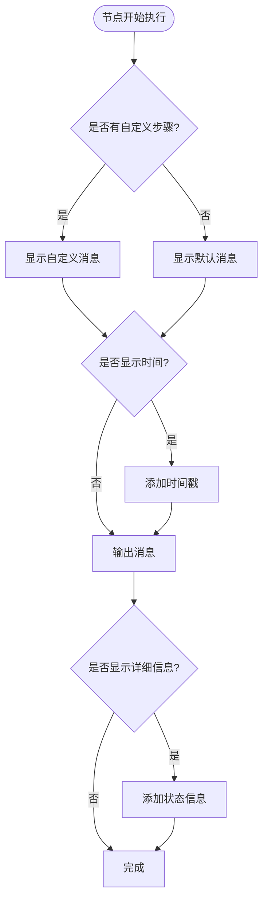
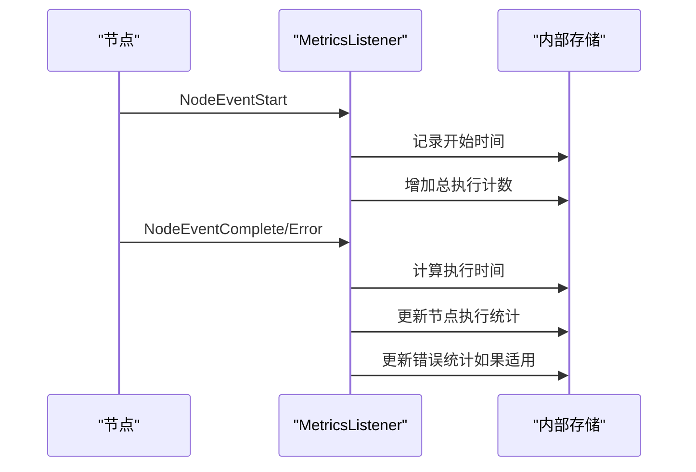
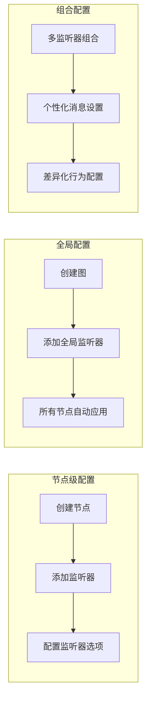
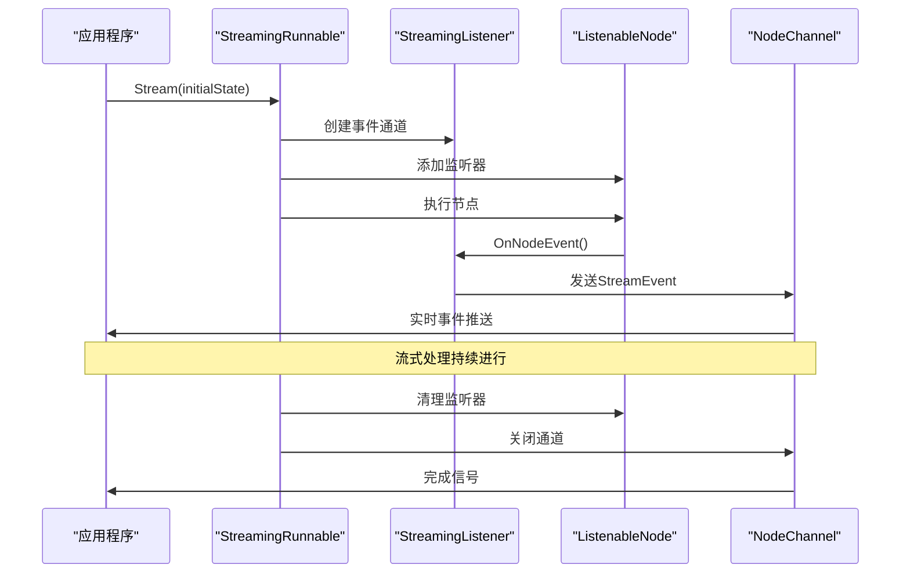
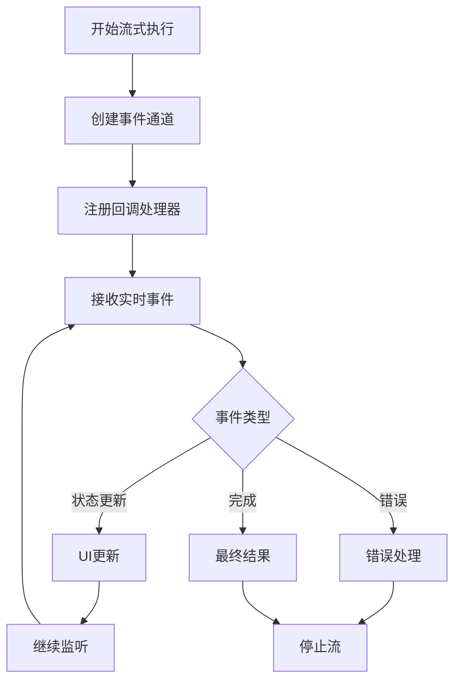
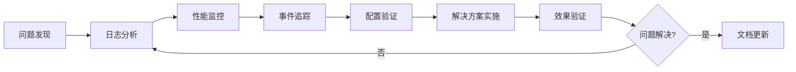

# 监听器使用模式

<cite>
**本文档引用的文件**
- [examples/listeners/main.go](file://examples/listeners/main.go)
- [examples/basic_example/main.go](file://examples/basic_example/main.go)
- [examples/streaming_modes/main.go](file://examples/streaming_modes/main.go)
- [graph/listeners.go](file://graph/listeners.go)
- [graph/builtin_listeners.go](file://graph/builtin_listeners.go)
- [graph/streaming.go](file://graph/streaming.go)
</cite>

## 目录
1. [简介](#简介)
2. [监听器架构概览](#监听器架构概览)
3. [内置监听器类型](#内置监听器类型)
4. [监听器配置与使用](#监听器配置与使用)
5. [流式处理集成](#流式处理集成)
6. [最佳实践](#最佳实践)
7. [故障排除指南](#故障排除指南)
8. [总结](#总结)

## 简介

LangGraphGo 提供了强大的监听器系统，允许开发者在图执行过程中实时捕获和响应各种事件。监听器系统支持多种使用场景，包括日志记录、进度跟踪、性能监控和用户交互反馈。通过监听器，可以实现对图执行过程的全面可观测性，为调试、监控和用户体验优化提供重要支持。

## 监听器架构概览

监听器系统基于观察者模式设计，提供了灵活的事件通知机制。核心组件包括事件类型定义、监听器接口、可监听节点和流式处理支持。

```mermaid
classDiagram
class NodeListener {
<<interface>>
+OnNodeEvent(ctx, event, nodeName, state, err)
}
class ListenableNode {
+Node
+listeners []NodeListener
+mutex sync.RWMutex
+AddListener(listener)
+RemoveListener(listener)
+NotifyListeners(ctx, event, state, err)
+Execute(ctx, state)
}
class StreamEvent {
+Timestamp time.Time
+NodeName string
+Event NodeEvent
+State interface{}
+Error error
+Metadata map[string]interface{}
+Duration time.Duration
}
class ProgressListener {
+writer io.Writer
+nodeSteps map[string]string
+showTiming bool
+showDetails bool
+prefix string
+SetNodeStep(nodeName, step)
+OnNodeEvent(ctx, event, nodeName, state, err)
}
class LoggingListener {
+logger *log.Logger
+logLevel LogLevel
+includeState bool
+WithLogLevel(level)
+WithState(enabled)
+OnNodeEvent(ctx, event, nodeName, state, err)
}
class MetricsListener {
+nodeExecutions map[string]int
+nodeDurations map[string][]time.Duration
+nodeErrors map[string]int
+totalExecutions int
+GetNodeExecutions()
+GetNodeAverageDuration()
+PrintSummary(writer)
}
class ChatListener {
+writer io.Writer
+nodeMessages map[string]string
+showTime bool
+SetNodeMessage(nodeName, message)
+OnNodeEvent(ctx, event, nodeName, state, err)
}
NodeListener <|.. ProgressListener
NodeListener <|.. LoggingListener
NodeListener <|.. MetricsListener
NodeListener <|.. ChatListener
ListenableNode --> NodeListener : "notifies"
ListenableNode --> StreamEvent : "generates"
```

**图表来源**
- [graph/listeners.go](file://graph/listeners.go#L51-L185)
- [graph/builtin_listeners.go](file://graph/builtin_listeners.go#L14-L433)

**章节来源**
- [graph/listeners.go](file://graph/listeners.go#L1-L335)
- [graph/builtin_listeners.go](file://graph/builtin_listeners.go#L1-L433)

## 内置监听器类型

### 进度监听器（ProgressListener）

进度监听器专门用于跟踪图执行的进度，提供可视化的执行状态更新。



**图表来源**
- [graph/builtin_listeners.go](file://graph/builtin_listeners.go#L70-L116)

**关键特性：**
- 支持自定义节点步骤描述
- 可配置的时间显示
- 详细的执行状态跟踪
- 多种输出格式支持

### 日志监听器（LoggingListener）

日志监听器提供结构化的日志记录功能，支持不同级别的日志输出。

**配置选项：**
- `WithLogLevel`: 设置最小日志级别（Debug、Info、Warn、Error）
- `WithState`: 控制是否包含执行状态信息

### 性能监控监听器（MetricsListener）

性能监控监听器收集详细的执行指标，为性能分析和优化提供数据支持。

**收集的指标：**
- 节点执行次数统计
- 平均执行时间计算
- 错误发生频率统计
- 总体执行计数



**图表来源**
- [graph/builtin_listeners.go](file://graph/builtin_listeners.go#L222-L249)

### 用户交互反馈监听器（ChatListener）

聊天风格的监听器提供友好的用户交互体验，模拟机器人对话式的反馈。

**特色功能：**
- 自定义节点消息
- 时间戳显示控制
- 机器人表情符号支持
- 实时状态更新

**章节来源**
- [graph/builtin_listeners.go](file://graph/builtin_listeners.go#L14-L433)

## 监听器配置与使用

### 基本配置模式

监听器可以通过多种方式添加到节点或整个图中：



**图表来源**
- [examples/listeners/main.go](file://examples/listeners/main.go#L50-L64)

### 选项定制

每个监听器都提供了丰富的配置选项：

| 监听器类型 | 关键选项 | 描述 |
|-----------|---------|------|
| ProgressListener | `WithTiming()` | 启用/禁用时间显示 |
| | `WithDetails()` | 启用/禁用详细状态信息 |
| | `WithPrefix()` | 自定义消息前缀 |
| LoggingListener | `WithLogLevel()` | 设置日志级别 |
| | `WithState()` | 控制状态信息包含 |
| MetricsListener | 无配置选项 | 自动收集所有指标 |
| ChatListener | `WithTime()` | 启用/禁用时间戳 |

### 个性化消息配置

通过 `SetNodeMessage` 和 `SetNodeStep` 方法可以为特定节点设置个性化的消息：

**进度监听器步骤配置：**
- `SetNodeStep("process", "Processing input data")`
- `SetNodeStep("analyze", "Analyzing processed data")`

**聊天监听器消息配置：**
- `SetNodeMessage("process", "🤖 Processing your data...")`
- `SetNodeMessage("analyze", "🔍 Analyzing results...")`

**章节来源**
- [examples/listeners/main.go](file://examples/listeners/main.go#L16-L69)

## 流式处理集成

监听器系统与流式处理完美集成，支持实时事件推送和异步处理。

### 流式监听器架构



**图表来源**
- [graph/streaming.go](file://graph/streaming.go#L290-L357)

### 流式配置选项

流式处理支持多种配置模式：

| 配置模式 | 描述 | 使用场景 |
|---------|------|----------|
| `StreamModeUpdates` | 仅发送节点输出更新 | 实时状态同步 |
| `StreamModeValues` | 发送完整状态值 | 数据可视化 |
| `StreamModeMessages` | 发送LLM消息/令牌 | 对话式应用 |
| `StreamModeDebug` | 发送所有事件 | 调试和监控 |

### 实时事件处理

流式处理提供了强大的事件处理能力：



**图表来源**
- [examples/streaming_modes/main.go](file://examples/streaming_modes/main.go#L42-L51)

**章节来源**
- [graph/streaming.go](file://graph/streaming.go#L1-L476)
- [examples/streaming_modes/main.go](file://examples/streaming_modes/main.go#L1-L55)

## 最佳实践

### 性能优化建议

1. **避免在监听器中执行耗时操作**
   - 监听器运行在主执行流程中，应保持轻量级
   - 避免数据库查询、网络请求等阻塞操作
   - 使用异步处理或队列机制处理复杂逻辑

2. **合理选择监听器类型**
   - 根据需求选择合适的监听器组合
   - 不要同时启用多个相似功能的监听器
   - 在生产环境中谨慎使用详细日志

3. **内存管理**
   - 定期重置MetricsListener以避免内存泄漏
   - 监控流式处理的缓冲区大小
   - 实现适当的背压处理机制

### 监听器设计原则

```mermaid
mindmap
root((监听器设计))
性能
轻量级处理
异步操作
缓存策略
可靠性
错误处理
资源清理
超时控制
可维护性
单一职责
接口清晰
文档完整
可扩展性
插件架构
配置灵活
兼容性强
```

### 常见陷阱与解决方案

| 问题 | 解决方案 | 示例代码路径 |
|------|---------|-------------|
| 监听器阻塞主流程 | 使用异步处理 | [graph/listeners.go](file://graph/listeners.go#L137-L156) |
| 内存泄漏 | 定期清理资源 | [graph/builtin_listeners.go](file://graph/builtin_listeners.go#L341-L351) |
| 事件丢失 | 实现背压处理 | [graph/streaming.go](file://graph/streaming.go#L252-L261) |
| 配置混乱 | 统一配置管理 | [examples/listeners/main.go](file://examples/listeners/main.go#L16-L29) |

### 监控和调试技巧

1. **使用MetricsListener进行性能分析**
   - 监控节点执行时间和频率
   - 识别性能瓶颈和异常情况
   - 为优化提供数据支持

2. **结合LoggingListener进行调试**
   - 设置适当的日志级别
   - 包含必要的上下文信息
   - 使用结构化日志格式

3. **实时监控流式事件**
   - 实现事件过滤和聚合
   - 设置告警阈值
   - 记录关键事件轨迹

**章节来源**
- [graph/builtin_listeners.go](file://graph/builtin_listeners.go#L202-L351)
- [graph/streaming.go](file://graph/streaming.go#L84-L109)

## 故障排除指南

### 常见问题诊断

1. **监听器不触发**
   - 检查监听器是否正确添加到节点
   - 验证事件类型是否匹配
   - 确认监听器配置是否正确

2. **性能问题**
   - 分析监听器执行时间
   - 检查是否存在阻塞操作
   - 优化事件处理逻辑

3. **内存泄漏**
   - 监控MetricsListener的数据增长
   - 检查流式处理的资源清理
   - 实现定期清理机制

### 调试工具和技术



### 监控指标参考

| 指标类型 | 监控目标 | 正常范围 | 异常处理 |
|---------|---------|---------|---------|
| 执行时间 | 节点平均执行时间 | < 100ms | 性能分析 |
| 错误率 | 节点错误发生率 | < 1% | 错误处理 |
| 事件频率 | 事件发送速率 | 稳定 | 背压处理 |
| 内存使用 | 监听器内存占用 | < 100MB | 资源清理 |

**章节来源**
- [graph/builtin_listeners_test.go](file://graph/builtin_listeners_test.go#L182-L268)

## 总结

LangGraphGo 的监听器系统提供了强大而灵活的可观测性支持。通过合理使用内置监听器类型，结合流式处理能力，可以构建出具有实时反馈和全面监控的应用程序。

**核心优势：**
- 多样化的监听器类型满足不同需求
- 流式处理支持实现实时事件推送
- 灵活的配置选项适应各种使用场景
- 良好的性能设计避免影响主流程

**推荐使用场景：**
- 开发阶段的调试和测试
- 生产环境的监控和告警
- 用户界面的状态反馈
- 性能分析和优化

通过遵循最佳实践和合理配置，监听器系统能够显著提升应用程序的可观测性和用户体验，为构建高质量的图执行应用提供重要保障。