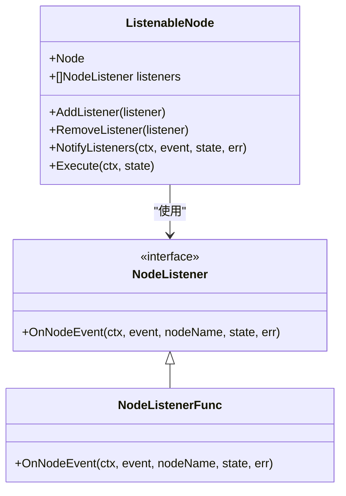
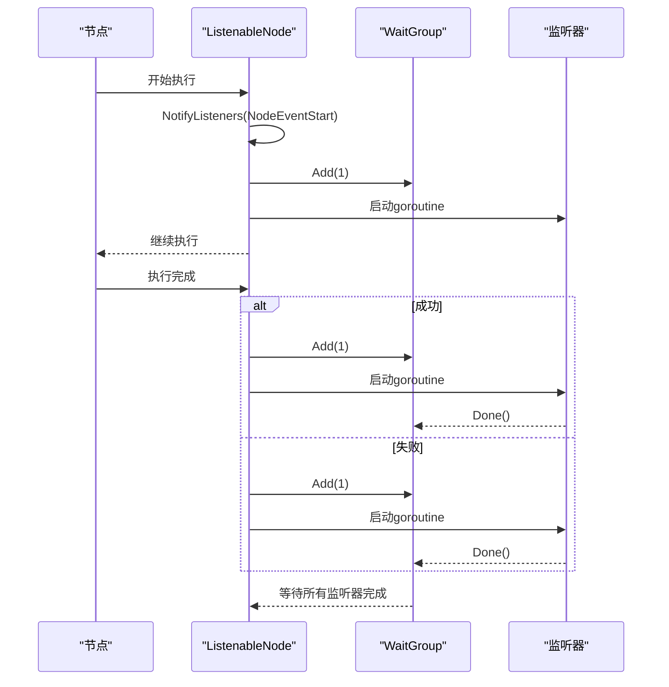
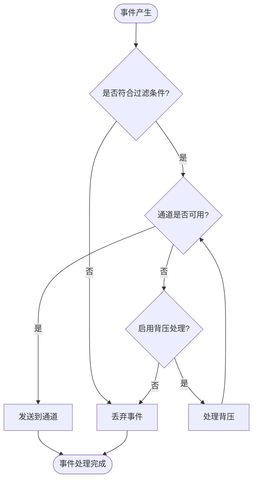
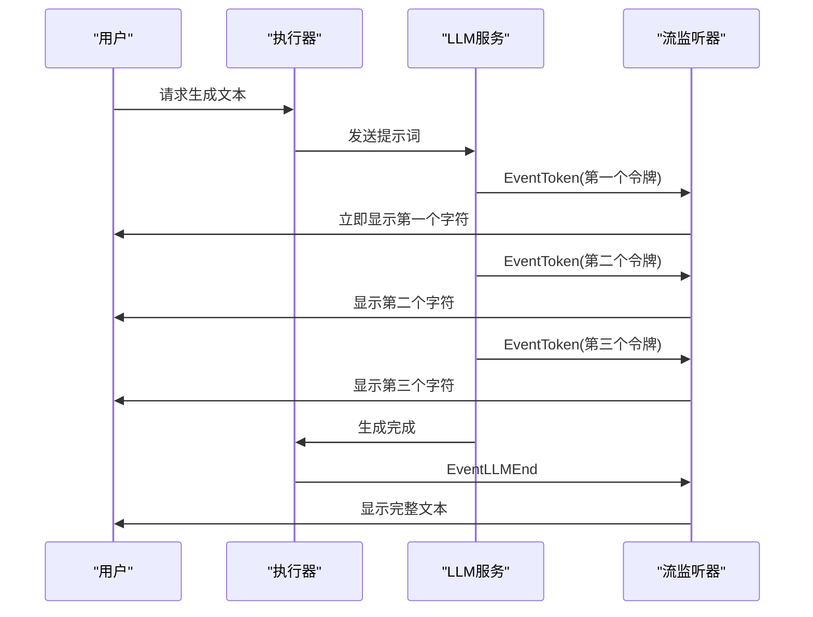
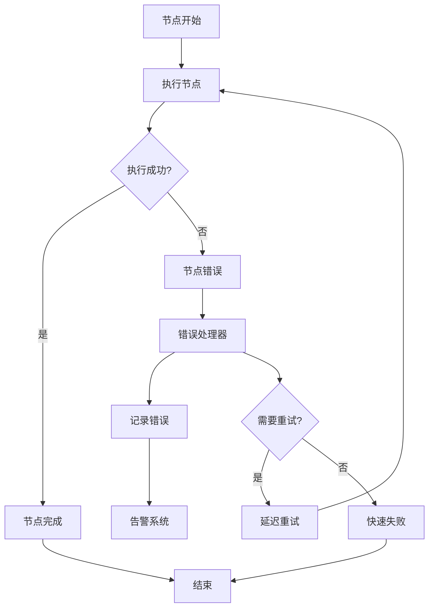
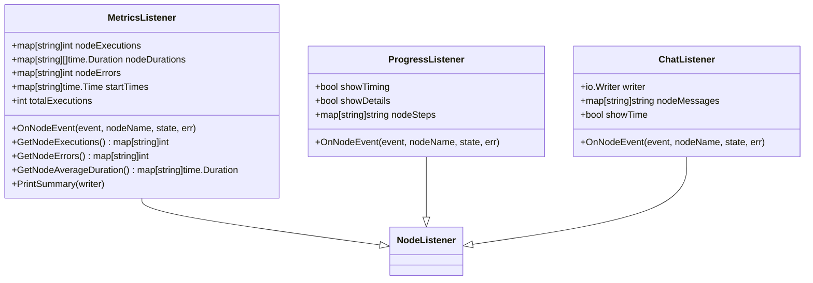
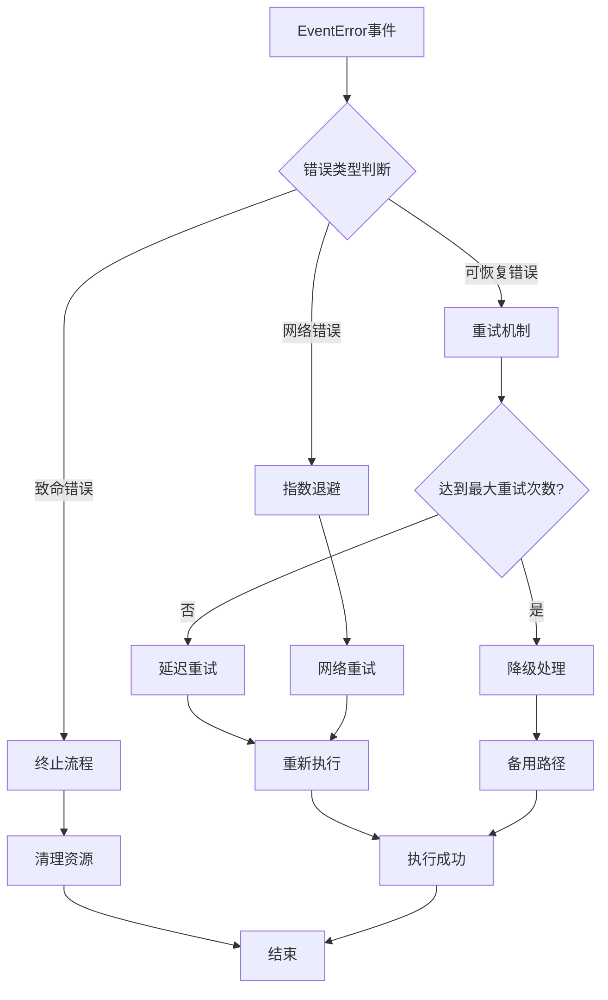
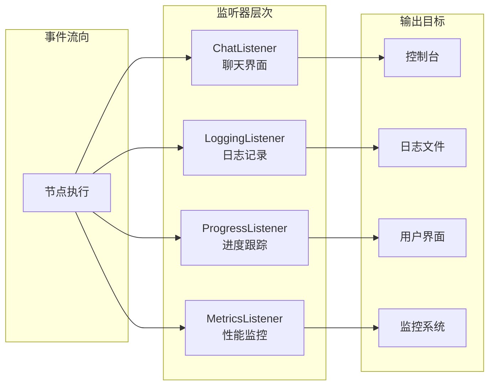

# 节点事件类型

<cite>
**本文档中引用的文件**
- [listeners.go](file://graph/listeners.go)
- [streaming.go](file://graph/streaming.go)
- [builtin_listeners.go](file://graph/builtin_listeners.go)
- [listeners_test.go](file://graph/listeners_test.go)
- [builtin_listeners_test.go](file://graph/builtin_listeners_test.go)
- [tool_node.go](file://prebuilt/tool_node.go)
- [main.go](file://examples/streaming_pipeline/main.go)
- [main.go](file://examples/basic_example/main.go)
- [main.go](file://examples/listeners/main.go)
</cite>

## 目录
1. [简介](#简介)
2. [NodeEvent 枚举类型](#nodeevent-枚举类型)
3. [StreamEvent 结构体](#streamevent-结构体)
4. [事件类型详解](#事件类型详解)
5. [事件处理机制](#事件处理机制)
6. [实际应用场景](#实际应用场景)
7. [最佳实践](#最佳实践)
8. [总结](#总结)

## 简介

LangGraphGo 提供了一套完整的事件驱动架构，通过 `NodeEvent` 枚举类型和 `StreamEvent` 结构体，为工作流执行过程中的各个阶段提供了丰富的事件通知机制。这些事件不仅能够帮助开发者监控执行状态，还能实现流式输出、错误处理、性能监控等高级功能。

## NodeEvent 枚举类型

`NodeEvent` 是一个字符串类型的枚举，定义了工作流执行过程中可能触发的各种事件类型：

```mermaid
classDiagram
class NodeEvent {
<<enumeration>>
+NodeEventStart
+NodeEventProgress
+NodeEventComplete
+NodeEventError
+EventChainStart
+EventChainEnd
+EventToolStart
+EventToolEnd
+EventLLMStart
+EventLLMEnd
+EventToken
+EventCustom
}
class StreamEvent {
+time.Time Timestamp
+string NodeName
+NodeEvent Event
+interface{} State
+error Error
+map[string]interface{} Metadata
+time.Duration Duration
}
NodeEvent --> StreamEvent : "用于创建"
```

**图表来源**
- [listeners.go](file://graph/listeners.go#L10-L48)

**节来源**
- [listeners.go](file://graph/listeners.go#L10-L48)

## StreamEvent 结构体

`StreamEvent` 结构体封装了事件的完整元数据，为事件处理提供了丰富的上下文信息：

| 字段名 | 类型 | 描述 |
|--------|------|------|
| Timestamp | time.Time | 事件发生的时间戳 |
| NodeName | string | 生成事件的节点名称 |
| Event | NodeEvent | 事件类型标识符 |
| State | interface{} | 当前状态快照 |
| Error | error | 错误信息（仅当事件为 NodeEventError 时有效） |
| Metadata | map[string]interface{} | 额外的事件特定数据 |
| Duration | time.Duration | 节点执行时间（仅对完成事件有效） |

**节来源**
- [listeners.go](file://graph/listeners.go#L65-L86)

## 事件类型详解

### 核心节点事件

#### NodeEventStart
- **触发时机**: 节点开始执行时
- **语义**: 表示某个节点开始处理输入数据
- **用途**: 可用于初始化操作、状态重置、性能计时器启动等
- **示例场景**: 数据验证开始、计算任务启动

#### NodeEventProgress
- **触发时机**: 节点执行过程中
- **语义**: 表示节点正在处理数据，但尚未完成
- **用途**: 可用于报告处理进度、更新UI状态、记录中间结果
- **示例场景**: 文件上传进度、复杂计算的阶段性完成

#### NodeEventComplete
- **触发时机**: 节点成功完成执行时
- **语义**: 表示节点已完成所有处理并返回结果
- **用途**: 可用于清理资源、记录完成时间、触发后续处理
- **示例场景**: 数据处理完成、文件转换结束

#### NodeEventError
- **触发时机**: 节点执行过程中发生错误时
- **语义**: 表示节点执行失败，包含具体的错误信息
- **用途**: 可用于错误恢复、日志记录、告警通知
- **示例场景**: 网络连接超时、文件读取失败

### 工作流控制事件

#### EventChainStart
- **触发时机**: 整个工作流开始执行时
- **语义**: 表示整个图的执行流程启动
- **用途**: 可用于全局状态初始化、审计日志记录
- **示例场景**: 批处理作业开始、数据分析管道启动

#### EventChainEnd
- **触发时机**: 整个工作流完成执行时
- **语义**: 表示整个图的执行流程结束
- **用途**: 可用于资源清理、结果汇总、性能统计
- **示例场景**: 数据导入完成、报表生成结束

### 工具调用事件

#### EventToolStart
- **触发时机**: 工具调用开始时
- **语义**: 表示开始执行外部工具或函数
- **用途**: 可用于工具参数验证、权限检查
- **示例场景**: 文件系统操作开始、API调用启动

#### EventToolEnd
- **触发时机**: 工具调用完成时
- **语义**: 表示外部工具或函数执行完成
- **用途**: 可用于结果验证、资源释放
- **示例场景**: 文件下载完成、数据库查询结束

### LLM交互事件

#### EventLLMStart
- **触发时机**: LLM调用开始时
- **语义**: 表示开始与语言模型进行交互
- **用途**: 可用于提示词验证、上下文管理
- **示例场景**: 文本生成开始、对话系统启动

#### EventLLMEnd
- **触发时机**: LLM调用完成时
- **语义**: 表示与语言模型的交互完成
- **用途**: 可用于响应验证、缓存存储
- **示例场景**: 文本生成完成、问答系统响应

### 流式处理事件

#### EventToken
- **触发时机**: 生成单个令牌时（用于流式输出）
- **语义**: 表示生成了一个新的输出令牌
- **用途**: 实现真正的流式输出，如打字机效果
- **示例场景**: 实时文本生成、语音转文字

#### EventCustom
- **触发时机**: 用户自定义事件
- **语义**: 表示用户定义的特殊事件
- **用途**: 提供扩展性，支持特定业务需求
- **示例场景**: 自定义业务指标、特殊状态通知

**节来源**
- [listeners.go](file://graph/listeners.go#L14-L48)

## 事件处理机制

### 事件监听器接口



**图表来源**
- [listeners.go](file://graph/listeners.go#L51-L63)
- [listeners.go](file://graph/listeners.go#L89-L101)

### 异步事件通知

事件通知采用异步机制，避免阻塞主执行流程：



**图表来源**
- [listeners.go](file://graph/listeners.go#L127-L156)
- [listeners.go](file://graph/listeners.go#L159-L174)

### 流式事件处理



**图表来源**
- [streaming.go](file://graph/streaming.go#L84-L109)

**节来源**
- [listeners.go](file://graph/listeners.go#L127-L174)
- [streaming.go](file://graph/streaming.go#L84-L133)

## 实际应用场景

### 流式输出实现

通过 `EventToken` 事件可以实现实时的流式输出：



**图表来源**
- [streaming.go](file://graph/streaming.go#L175-L189)

### 错误监控和恢复



**图表来源**
- [builtin_listeners.go](file://graph/builtin_listeners.go#L238-L249)

### 性能监控



**图表来源**
- [builtin_listeners.go](file://graph/builtin_listeners.go#L238-L339)
- [builtin_listeners.go](file://graph/builtin_listeners.go#L354-L432)

**节来源**
- [main.go](file://examples/streaming_pipeline/main.go#L50-L70)
- [main.go](file://examples/listeners/main.go#L15-L42)

## 最佳实践

### 事件过滤策略

根据不同的使用场景选择合适的事件过滤模式：

| 模式 | 适用场景 | 事件类型 | 性能影响 |
|------|----------|----------|----------|
| StreamModeDebug | 开发调试 | 所有事件 | 较高 |
| StreamModeValues | 状态监控 | graph_step | 中等 |
| StreamModeUpdates | 进度跟踪 | ToolEnd, ChainEnd, NodeEventComplete | 较低 |
| StreamModeMessages | LLM交互 | EventLLMStart, EventLLMEnd | 低 |

### 错误处理模式



### 监听器组合使用



**图表来源**
- [main.go](file://examples/listeners/main.go#L15-L42)

## 总结

LangGraphGo 的 `NodeEvent` 枚举类型和 `StreamEvent` 结构体提供了一个强大而灵活的事件驱动架构。通过合理使用这些事件类型，开发者可以构建出具有以下特性的高质量应用：

1. **实时反馈**: 通过流式事件实现即时的状态更新和进度报告
2. **错误恢复**: 基于错误事件的智能重试和降级机制
3. **性能监控**: 全面的执行时间和资源使用统计
4. **调试支持**: 详细的执行轨迹和状态快照
5. **扩展性**: 自定义事件类型满足特殊业务需求

正确理解和运用这些事件机制，将显著提升应用程序的可观测性、可靠性和用户体验。