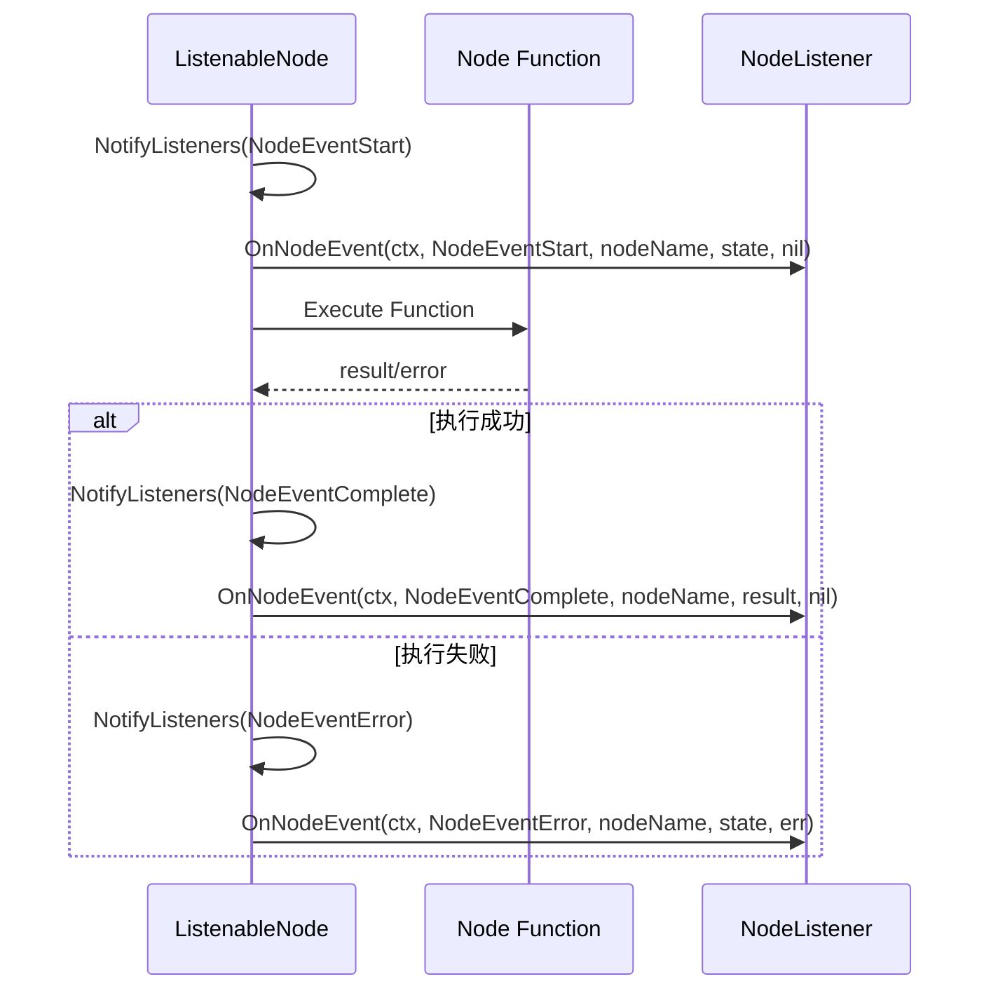
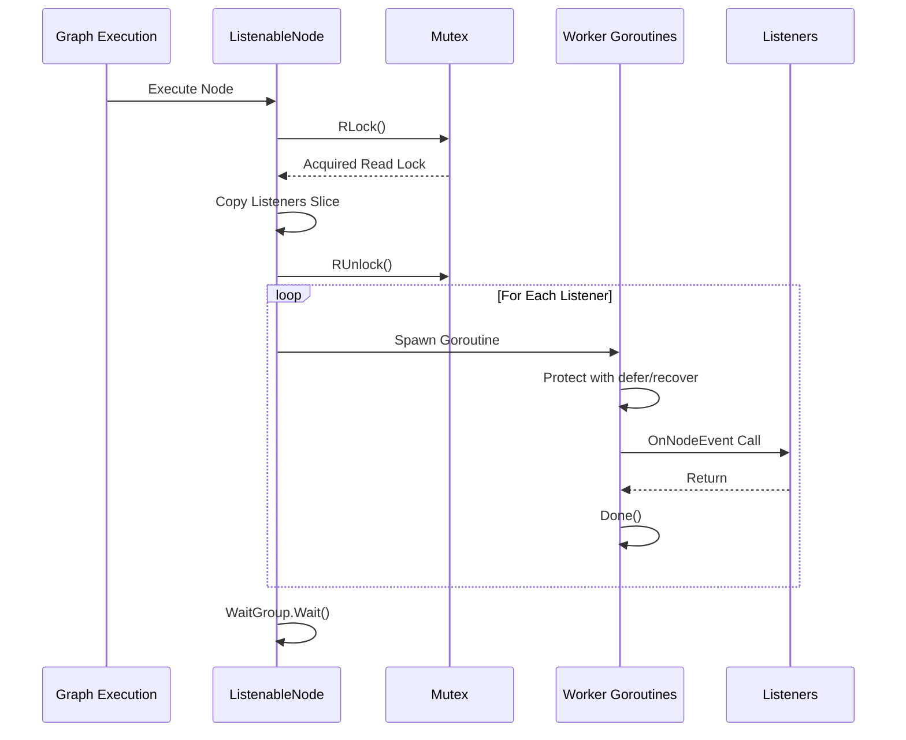

# 节点监听器接口

<cite>
**本文档中引用的文件**
- [listeners.go](file://graph/listeners.go)
- [builtin_listeners.go](file://graph/builtin_listeners.go)
- [listeners_test.go](file://graph/listeners_test.go)
- [examples/listeners/main.go](file://examples/listeners/main.go)
</cite>

## 目录
1. [简介](#简介)
2. [NodeListener 接口设计](#nodelistener-接口设计)
3. [OnNodeEvent 方法详解](#onnodeevent-方法详解)
4. [NodeListenerFunc 适配器](#nodelistenerfunc-适配器)
5. [内置监听器实现](#内置监听器实现)
6. [并发安全性和异步执行](#并发安全性性和异步执行)
7. [实际应用示例](#实际应用示例)
8. [最佳实践](#最佳实践)
9. [总结](#总结)

## 简介

`NodeListener` 接口是 LangGraphGo 框架中的核心扩展点，它提供了一种灵活的方式来监控和响应图中节点的执行事件。通过实现这个接口，开发者可以轻松地添加自定义的事件处理逻辑，如日志记录、性能监控、错误处理等，而无需修改底层的节点执行逻辑。

该接口采用观察者模式设计，允许在不侵入业务逻辑的情况下，为系统添加各种横切关注点。这种设计使得框架具有高度的可扩展性，同时保持了良好的解耦性。

## NodeListener 接口设计

`NodeListener` 接口是整个监听器系统的核心抽象，它定义了统一的事件处理契约：

```mermaid
classDiagram
class NodeListener {
<<interface>>
+OnNodeEvent(ctx Context, event NodeEvent, nodeName string, state interface{}, err error) void
}
class NodeListenerFunc {
+OnNodeEvent(ctx Context, event NodeEvent, nodeName string, state interface{}, err error) void
}
class ProgressListener {
+OnNodeEvent(ctx Context, event NodeEvent, nodeName string, state interface{}, err error) void
+SetNodeStep(nodeName string, step string) void
+WithTiming(enabled bool) ProgressListener
}
class LoggingListener {
+OnNodeEvent(ctx Context, event NodeEvent, nodeName string, state interface{}, err error) void
+WithLogLevel(level LogLevel) LoggingListener
+WithState(enabled bool) LoggingListener
}
class MetricsListener {
+OnNodeEvent(ctx Context, event NodeEvent, nodeName string, state interface{}, err error) void
+GetNodeExecutions() map[string]int
+GetNodeAverageDuration() map[string]time.Duration
}
class ChatListener {
+OnNodeEvent(ctx Context, event NodeEvent, nodeName string, state interface{}, err error) void
+SetNodeMessage(nodeName string, message string) void
}
NodeListener <|-- NodeListenerFunc : 实现
NodeListener <|-- ProgressListener : 实现
NodeListener <|-- LoggingListener : 实现
NodeListener <|-- MetricsListener : 实现
NodeListener <|-- ChatListener : 实现
```

**图表来源**
- [listeners.go](file://graph/listeners.go#L51-L55)
- [builtin_listeners.go](file://graph/builtin_listeners.go#L13-L433)

**章节来源**
- [listeners.go](file://graph/listeners.go#L51-L55)

## OnNodeEvent 方法详解

`OnNodeEvent` 方法是 `NodeListener` 接口的核心方法，它定义了监听器接收事件时的处理逻辑。该方法的签名包含了丰富的上下文信息，使监听器能够做出智能的响应。

### 方法签名分析

```go
OnNodeEvent(ctx context.Context, event NodeEvent, nodeName string, state interface{}, err error)
```

### 参数详解

#### ctx (context.Context)
- **类型**: `context.Context`
- **作用**: 提供请求范围的上下文信息，包括取消信号、超时设置和请求范围的数据传递
- **使用场景**: 
  - 检查是否需要提前终止操作
  - 传递追踪标识符用于分布式链路追踪
  - 获取截止时间限制

#### event (NodeEvent)
- **类型**: `NodeEvent` (字符串常量)
- **作用**: 表示当前发生的节点事件类型
- **可能值**:
  - `NodeEventStart`: 节点开始执行
  - `NodeEventComplete`: 节点成功完成
  - `NodeEventError`: 节点执行过程中发生错误
  - `NodeEventProgress`: 节点执行过程中的进度更新
  - 其他事件类型：链式调用、工具执行、LLM调用等

#### nodeName (string)
- **类型**: `string`
- **作用**: 标识触发事件的具体节点名称
- **重要性**: 帮助监听器区分不同节点的事件，实现针对特定节点的定制化处理

#### state (interface{})
- **类型**: `interface{}`
- **作用**: 当前的状态数据，表示节点执行时的输入或中间状态
- **使用场景**:
  - 记录节点的输入参数
  - 监控状态变化
  - 实现基于状态的条件处理逻辑

#### err (error)
- **类型**: `error`
- **作用**: 如果事件类型为 `NodeEventError`，则包含具体的错误信息
- **重要性**: 错误处理的关键信息，帮助监听器识别和处理异常情况

### 调用时机

`OnNodeEvent` 方法在以下情况下被调用：



**图表来源**
- [listeners.go](file://graph/listeners.go#L159-L175)

**章节来源**
- [listeners.go](file://graph/listeners.go#L51-L55)

## NodeListenerFunc 适配器

为了简化监听器的实现，框架提供了 `NodeListenerFunc` 类型作为适配器，允许将普通的函数直接转换为符合 `NodeListener` 接口的实例。

### 适配器设计原理

```mermaid
classDiagram
class NodeListenerFunc {
+func(ctx Context, event NodeEvent, nodeName string, state interface{}, err error)
}
class NodeListener {
<<interface>>
+OnNodeEvent(ctx Context, event NodeEvent, nodeName string, state interface{}, err error) void
}
NodeListenerFunc --|> NodeListener : 实现
```

**图表来源**
- [listeners.go](file://graph/listeners.go#L57-L63)

### 使用方式

`NodeListenerFunc` 的主要优势在于其简洁性：

1. **函数式编程风格**: 可以直接使用匿名函数或普通函数
2. **零样板代码**: 不需要定义新的结构体和方法
3. **易于测试**: 函数可以直接进行单元测试

### 实现机制

适配器通过实现 `NodeListener` 接口的方法来工作：

```go
func (f NodeListenerFunc) OnNodeEvent(ctx context.Context, event NodeEvent, nodeName string, state interface{}, err error) {
    f(ctx, event, nodeName, state, err)
}
```

这种设计利用了 Go 语言的函数类型特性，使得任何接受相同参数列表的函数都可以自动成为 `NodeListener` 的实例。

**章节来源**
- [listeners.go](file://graph/listeners.go#L57-L63)

## 内置监听器实现

框架提供了多种内置监听器，每种都针对特定的使用场景进行了优化：

### ProgressListener - 进度监听器

进度监听器专门用于提供用户友好的进度跟踪功能：

```mermaid
classDiagram
class ProgressListener {
-writer io.Writer
-nodeSteps map[string]string
-mutex sync.RWMutex
-showTiming bool
-showDetails bool
-prefix string
+OnNodeEvent(ctx Context, event NodeEvent, nodeName string, state interface{}, err error) void
+SetNodeStep(nodeName string, step string) void
+WithTiming(enabled bool) ProgressListener
+WithDetails(enabled bool) ProgressListener
+WithPrefix(prefix string) ProgressListener
}
```

**图表来源**
- [builtin_listeners.go](file://graph/builtin_listeners.go#L13-L116)

#### 主要功能：
- **自定义步骤消息**: 为每个节点设置人类可读的执行描述
- **时间戳显示**: 可选的时间标记功能
- **详细输出**: 可配置的状态信息显示
- **多格式输出**: 支持自定义输出目标

### LoggingListener - 日志监听器

日志监听器提供结构化的日志记录功能：

```mermaid
classDiagram
class LoggingListener {
-logger *log.Logger
-logLevel LogLevel
-includeState bool
+OnNodeEvent(ctx Context, event NodeEvent, nodeName string, state interface{}, err error) void
+WithLogLevel(level LogLevel) LoggingListener
+WithState(enabled bool) LoggingListener
}
class LogLevel {
<<enumeration>>
LogLevelDebug
LogLevelInfo
LogLevelWarn
LogLevelError
}
LoggingListener --> LogLevel : 使用
```

**图表来源**
- [builtin_listeners.go](file://graph/builtin_listeners.go#L118-L200)

#### 特性：
- **分级日志**: 支持不同的日志级别过滤
- **状态包含**: 可选择是否记录状态信息
- **自定义日志器**: 支持注入自定义的日志记录器
- **结构化输出**: 自动生成格式化的日志消息

### MetricsListener - 性能指标监听器

性能指标监听器专注于收集和分析执行统计数据：

```mermaid
classDiagram
class MetricsListener {
-mutex sync.RWMutex
-nodeExecutions map[string]int
-nodeDurations map[string][]time.Duration
-nodeErrors map[string]int
-totalExecutions int
-startTimes map[string]time.Time
+OnNodeEvent(ctx Context, event NodeEvent, nodeName string, state interface{}, err error) void
+GetNodeExecutions() map[string]int
+GetNodeErrors() map[string]int
+GetNodeAverageDuration() map[string]time.Duration
+GetTotalExecutions() int
+PrintSummary(writer io.Writer) void
+Reset() void
}
```

**图表来源**
- [builtin_listeners.go](file://graph/builtin_listeners.go#L202-L351)

#### 数据收集能力：
- **执行计数**: 统计每个节点的执行次数
- **执行时间**: 记录每次执行的持续时间
- **错误统计**: 跟踪节点执行失败的情况
- **平均性能**: 计算节点的平均执行时间
- **实时指标**: 提供实时的性能监控数据

### ChatListener - 聊天风格监听器

聊天风格监听器提供类似聊天机器人的交互体验：

#### 特色功能：
- **机器人表情**: 自动添加表情符号增强用户体验
- **自定义消息**: 为每个节点设置个性化的消息内容
- **时间戳**: 可选的时间标记
- **实时反馈**: 即时的执行状态通知

**章节来源**
- [builtin_listeners.go](file://graph/builtin_listeners.go#L13-L433)

## 并发安全性和异步执行

监听器系统在设计时充分考虑了并发安全性和性能优化：

### 并发安全保障



**图表来源**
- [listeners.go](file://graph/listeners.go#L127-L157)

### 关键设计特点

#### 1. 读写锁保护
- **读锁**: 在访问监听器列表时使用读锁，允许多个并发读取
- **写锁**: 在修改监听器列表时使用写锁，确保线程安全
- **无锁复制**: 读取时先复制监听器列表，避免阻塞执行流程

#### 2. 异步执行模型
- **goroutine 隔离**: 每个监听器在独立的 goroutine 中执行
- **WaitGroup 同步**: 等待所有监听器完成后再继续主流程
- **panic 恢复**: 自动捕获并恢复监听器中的 panic，防止影响主流程

#### 3. 死锁预防
- **非阻塞设计**: 监听器不会阻塞节点的正常执行
- **超时控制**: 通过 context 提供的超时机制控制监听器执行时间
- **资源隔离**: 监听器的资源使用不会影响节点的执行资源

### 使用注意事项

#### 1. 监听器性能
- **避免重计算**: 监听器应该快速返回，避免影响主流程性能
- **异步处理**: 对于耗时的操作，应该在监听器内部启动新的 goroutine
- **内存管理**: 注意监听器内部的内存使用，避免内存泄漏

#### 2. 上下文传播
- **超时处理**: 监听器应该检查 context 的取消信号
- **追踪支持**: 利用 context 传递追踪信息
- **资源清理**: 在 context 取消时及时清理资源

**章节来源**
- [listeners.go](file://graph/listeners.go#L127-L157)

## 实际应用示例

### 示例 1：简单日志监听器实现

以下是一个简单的自定义日志监听器的实现示例：

```go
// 自定义日志监听器实现
type CustomLogger struct {
    prefix string
}

func NewCustomLogger(prefix string) *CustomLogger {
    return &CustomLogger{prefix: prefix}
}

func (l *CustomLogger) OnNodeEvent(ctx context.Context, event graph.NodeEvent, 
                                   nodeName string, state interface{}, err error) {
    msg := fmt.Sprintf("[%s] Node '%s' %s", l.prefix, nodeName, event)
    
    if err != nil {
        fmt.Printf("%s: ERROR - %v\n", msg, err)
    } else {
        fmt.Printf("%s: %s\n", msg, state)
    }
}
```

### 示例 2：复杂监控系统集成

```go
// 监控系统集成示例
type MonitoringListener struct {
    metricsCollector *MetricsCollector
    tracer           *Tracer
    errorHandler     ErrorHandler
}

func (l *MonitoringListener) OnNodeEvent(ctx context.Context, event graph.NodeEvent, 
                                        nodeName string, state interface{}, err error) {
    // 记录指标
    l.metricsCollector.RecordNodeEvent(nodeName, event, err)
    
    // 分布式追踪
    span := l.tracer.StartSpan(ctx, "node_event", map[string]interface{}{
        "node.name": nodeName,
        "event.type": string(event),
    })
    defer span.End()
    
    // 错误处理
    if err != nil {
        l.errorHandler.HandleError(span.Context(), err, map[string]interface{}{
            "node": nodeName,
            "state": state,
        })
    }
}
```

### 示例 3：Webhook 通知系统

```go
// Webhook 通知监听器
type WebhookListener struct {
    webhookURL string
    httpClient *http.Client
}

func (l *WebhookListener) OnNodeEvent(ctx context.Context, event graph.NodeEvent, 
                                     nodeName string, state interface{}, err error) {
    payload := map[string]interface{}{
        "timestamp": time.Now().UTC(),
        "node": nodeName,
        "event": event,
        "status": "success",
    }
    
    if err != nil {
        payload["status"] = "error"
        payload["error"] = err.Error()
    }
    
    // 异步发送 webhook
    go func() {
        jsonPayload, _ := json.Marshal(payload)
        req, _ := http.NewRequest("POST", l.webhookURL, bytes.NewBuffer(jsonPayload))
        req.Header.Set("Content-Type", "application/json")
        
        l.httpClient.Do(req)
    }()
}
```

**章节来源**
- [examples/listeners/main.go](file://examples/listeners/main.go#L1-132)

## 最佳实践

### 1. 监听器设计原则

#### 单一职责原则
每个监听器应该只负责一种类型的事件处理，避免在一个监听器中处理多种不相关的功能。

#### 快速返回原则
监听器应该尽快完成处理并返回，避免阻塞主执行流程。对于耗时操作，应该在监听器内部启动新的 goroutine。

#### 错误隔离原则
监听器中的错误不应该影响主流程的执行。应该使用 defer/recover 来捕获和处理监听器中的异常。

### 2. 性能优化建议

#### 1. 批量处理
对于频繁的事件，可以考虑批量处理而不是逐个处理：

```go
type BatchListener struct {
    batch chan *StreamEvent
    flushInterval time.Duration
}

func (l *BatchListener) OnNodeEvent(ctx context.Context, event graph.NodeEvent, 
                                   nodeName string, state interface{}, err error) {
    select {
    case l.batch <- &graph.StreamEvent{
        Timestamp: time.Now(),
        NodeName:  nodeName,
        Event:     event,
        State:     state,
        Error:     err,
    }:
    default:
        // Channel full, process immediately
        l.processBatch()
    }
}
```

#### 2. 缓存策略
对于重复的计算或查询，应该使用适当的缓存机制：

```go
type CachedListener struct {
    cache map[string]string
    mu    sync.RWMutex
}

func (l *CachedListener) OnNodeEvent(ctx context.Context, event graph.NodeEvent, 
                                   nodeName string, state interface{}, err error) {
    l.mu.RLock()
    cachedMsg, exists := l.cache[nodeName]
    l.mu.RUnlock()
    
    if !exists {
        // Expensive computation
        computedMsg := l.computeMessage(nodeName)
        
        l.mu.Lock()
        l.cache[nodeName] = computedMsg
        l.mu.Unlock()
        
        cachedMsg = computedMsg
    }
    
    // Use cached message
}
```

### 3. 测试策略

#### 1. 单元测试
为监听器编写专门的单元测试：

```go
func TestCustomListener_OnNodeEvent(t *testing.T) {
    listener := NewCustomLogger("TEST")
    
    // Test successful execution
    var buf bytes.Buffer
    listener.logger = log.New(&buf, "", 0)
    
    listener.OnNodeEvent(context.Background(), graph.NodeEventComplete, "test_node", "test_state", nil)
    
    if !strings.Contains(buf.String(), "SUCCESS") {
        t.Error("Expected SUCCESS in log output")
    }
}
```

#### 2. 集成测试
测试监听器与整个系统的集成：

```go
func TestListenerIntegration(t *testing.T) {
    // Setup graph with listener
    g := graph.NewListenableMessageGraph()
    listener := NewCustomListener()
    
    node := g.AddNode("test", func(ctx context.Context, state interface{}) (interface{}, error) {
        return state, nil
    })
    node.AddListener(listener)
    
    // Execute and verify
    result, err := g.CompileListenable().Invoke(context.Background(), "test_input")
    assert.NoError(t, err)
    assert.Equal(t, "test_input", result)
}
```

### 4. 部署和运维

#### 1. 配置管理
提供灵活的配置选项：

```go
type ConfigurableListener struct {
    minLogLevel graph.LogLevel
    maxBatchSize int
    timeout time.Duration
}

func (l *ConfigurableListener) Configure(options ...Option) {
    for _, option := range options {
        option(l)
    }
}

type Option func(*ConfigurableListener)

func WithMinLogLevel(level graph.LogLevel) Option {
    return func(l *ConfigurableListener) {
        l.minLogLevel = level
    }
}
```

#### 2. 健康检查
实现监听器的健康检查机制：

```go
type HealthCheckableListener struct {
    healthStatus chan error
}

func (l *HealthCheckableListener) HealthCheck() error {
    select {
    case err := <-l.healthStatus:
        return err
    case <-time.After(5 * time.Second):
        return errors.New("health check timeout")
    }
}
```

## 总结

`NodeListener` 接口及其相关组件构成了 LangGraphGo 框架中强大而灵活的事件监听系统。通过这个系统，开发者可以：

### 核心优势

1. **高度可扩展性**: 通过实现 `NodeListener` 接口，可以轻松添加自定义的事件处理逻辑
2. **零侵入性**: 不需要修改现有的节点代码即可添加监控和日志功能
3. **并发安全**: 内置的并发安全保障机制确保系统稳定运行
4. **异步执行**: 监听器的异步执行不会影响主流程的性能
5. **丰富内置功能**: 提供了多种开箱即用的监听器实现

### 应用场景

- **监控和告警**: 实时监控系统状态和性能指标
- **日志记录**: 结构化和分层的日志记录系统
- **调试和诊断**: 详细的执行跟踪和问题诊断
- **用户反馈**: 为用户提供友好的执行进度反馈
- **集成第三方服务**: 与外部监控系统、日志系统等集成

### 设计哲学

该接口的设计体现了现代软件架构中的几个重要原则：

- **关注点分离**: 将业务逻辑与监控、日志等功能分离
- **开放封闭原则**: 对扩展开放，对修改封闭
- **依赖倒置**: 依赖抽象接口而非具体实现
- **单一职责**: 每个监听器专注于特定的功能领域

通过深入理解和正确使用 `NodeListener` 接口，开发者可以构建出更加健壮、可观测和用户友好的应用程序。