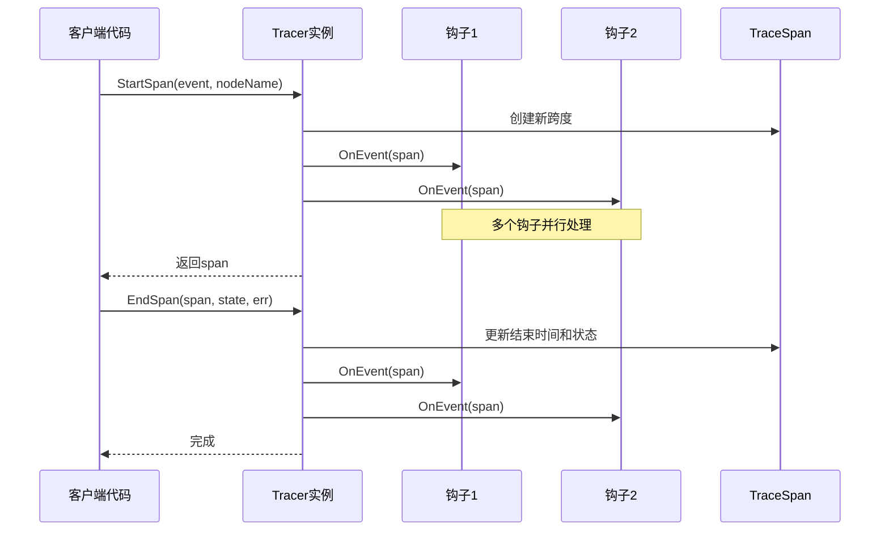
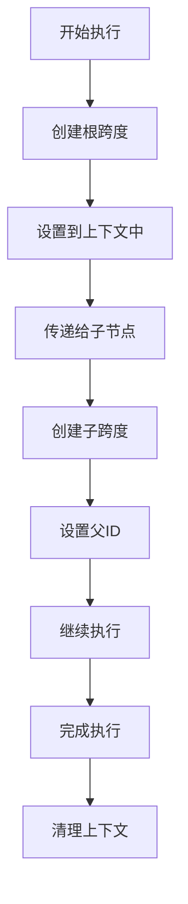
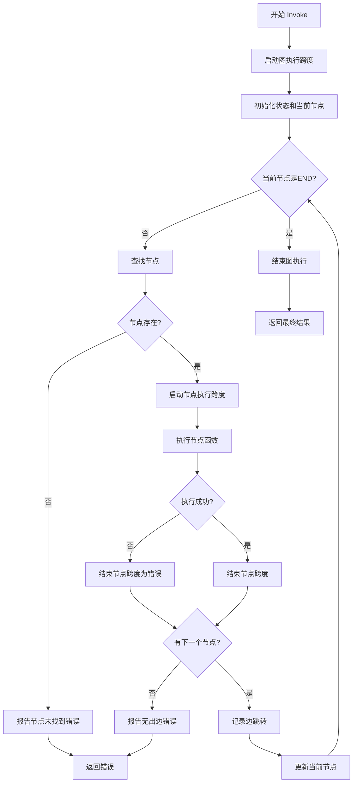
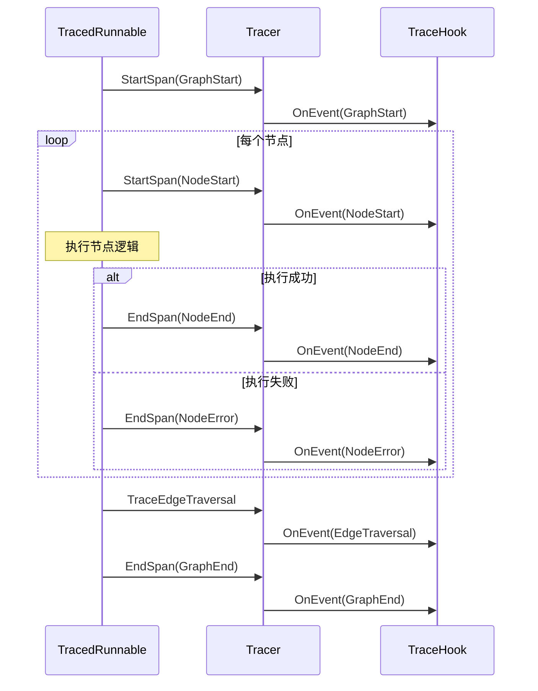
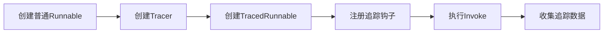
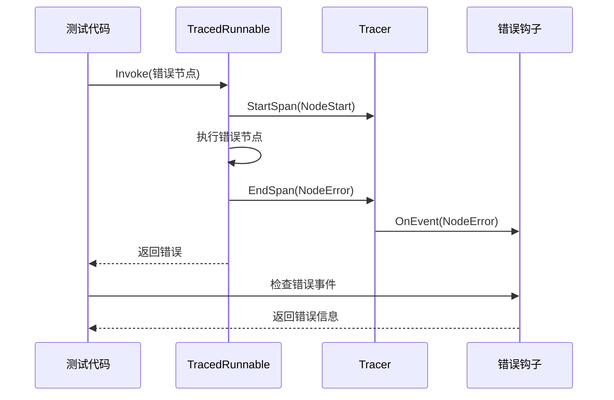
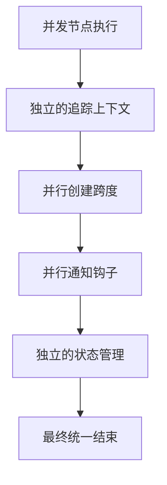

# 被追踪的可运行对象

<cite>
**本文档中引用的文件**
- [graph/tracing.go](file://graph/tracing.go)
- [graph/graph.go](file://graph/graph.go)
- [examples/basic_example/main.go](file://examples/basic_example/main.go)
- [graph/tracing_test.go](file://graph/tracing_test.go)
</cite>

## 目录
1. [简介](#简介)
2. [核心概念](#核心概念)
3. [TracedRunnable 结构设计](#tracedrunnable-结构设计)
4. [Tracer 核心功能](#tracer-核心功能)
5. [Invoke 方法执行流程](#invoke-方法执行流程)
6. [事件链跟踪机制](#事件链跟踪机制)
7. [使用示例分析](#使用示例分析)
8. [GetTracer 方法详解](#gettracer-方法详解)
9. [性能考虑](#性能考虑)
10. [总结](#总结)

## 简介

TracedRunnable 是 LangGraphGo 框架中的一个关键组件，它为传统的 Runnable 对象提供了分布式追踪能力。通过包装原始的 Runnable 并注入 Tracer 实例，TracedRunnable 能够在图执行过程中捕获详细的可观测性数据，包括图启动、节点执行、边跳转等各个阶段的事件信息。

这种设计使得开发者能够深入了解图执行的完整生命周期，识别性能瓶颈，诊断执行问题，并构建监控和分析系统。

## 核心概念

### 追踪事件类型

TracedRunnable 支持以下几种核心追踪事件：

- **TraceEventGraphStart**: 图执行开始事件
- **TraceEventGraphEnd**: 图执行结束事件  
- **TraceEventNodeStart**: 节点执行开始事件
- **TraceEventNodeEnd**: 节点执行结束事件
- **TraceEventNodeError**: 节点执行错误事件
- **TraceEventEdgeTraversal**: 边跳转事件

### 追踪上下文管理

系统通过上下文传递追踪信息，支持父子关系的追踪层次结构，确保复杂的并发执行也能正确记录。

## TracedRunnable 结构设计

TracedRunnable 采用组合模式设计，通过嵌入原始的 Runnable 来扩展其功能：

```mermaid
classDiagram
class Runnable {
+MessageGraph graph
+Tracer tracer
+Invoke(ctx, state) (interface{}, error)
+SetTracer(tracer)
+WithTracer(tracer) Runnable
}
class TracedRunnable {
+Runnable *Runnable
+tracer *Tracer
+Invoke(ctx, state) (interface{}, error)
+GetTracer() *Tracer
}
class Tracer {
+hooks []TraceHook
+spans map[string]*TraceSpan
+StartSpan(ctx, event, nodeName) *TraceSpan
+EndSpan(ctx, span, state, err)
+TraceEdgeTraversal(ctx, fromNode, toNode)
+AddHook(hook)
+GetSpans() map[string]*TraceSpan
+Clear()
}
class TraceSpan {
+string ID
+string ParentID
+TraceEvent Event
+string NodeName
+string FromNode
+string ToNode
+time.Time StartTime
+time.Time EndTime
+time.Duration Duration
+interface{} State
+error Error
+map[string]interface{} Metadata
}
Runnable <|-- TracedRunnable : 组合
TracedRunnable --> Tracer : 使用
Tracer --> TraceSpan : 创建
```

**图表来源**
- [graph/tracing.go](file://graph/tracing.go#L209-L213)
- [graph/graph.go](file://graph/graph.go#L140-L145)
- [graph/tracing.go](file://graph/tracing.go#L84-L87)

**章节来源**
- [graph/tracing.go](file://graph/tracing.go#L209-L213)
- [graph/graph.go](file://graph/graph.go#L140-L145)

## Tracer 核心功能

### 追踪钩子系统

Tracer 提供了灵活的钩子系统，允许注册多个事件处理器：



**图表来源**
- [graph/tracing.go](file://graph/tracing.go#L103-L126)
- [graph/tracing.go](file://graph/tracing.go#L128-L148)

### 上下文传播机制

系统通过自定义的上下文键实现追踪信息的自动传播：



**图表来源**
- [graph/tracing.go](file://graph/tracing.go#L113-L116)
- [graph/tracing.go](file://graph/tracing.go#L192-L201)

**章节来源**
- [graph/tracing.go](file://graph/tracing.go#L84-L148)

## Invoke 方法执行流程

TracedRunnable 的 Invoke 方法实现了完整的图执行追踪逻辑：



**图表来源**
- [graph/tracing.go](file://graph/tracing.go#L223-L280)

### 关键执行步骤

1. **图启动追踪**: 在执行开始时创建根跨度，标记图执行的起点
2. **节点级追踪**: 每个节点执行前后都创建对应的跨度
3. **边跳转追踪**: 记录节点间的控制流转移
4. **错误处理**: 在发生错误时正确更新跨度状态
5. **状态快照**: 在关键节点保存状态信息用于调试

**章节来源**
- [graph/tracing.go](file://graph/tracing.go#L223-L280)

## 事件链跟踪机制

### 完整事件序列

TracedRunnable 在执行过程中会生成以下事件序列：



**图表来源**
- [graph/tracing.go](file://graph/tracing.go#L226-L279)
- [graph/tracing.go](file://graph/tracing.go#L150-L174)

### 事件数据结构

每个 TraceSpan 包含丰富的元数据：

| 字段 | 类型 | 描述 |
|------|------|------|
| ID | string | 唯一标识符 |
| ParentID | string | 父跨度标识符（根跨度为空） |
| Event | TraceEvent | 事件类型 |
| NodeName | string | 节点名称（节点事件相关） |
| FromNode/ToNode | string | 边跳转的源节点和目标节点 |
| StartTime/EndTime | time.Time | 时间戳 |
| Duration | time.Duration | 执行时长 |
| State | interface{} | 状态快照 |
| Error | error | 错误信息 |
| Metadata | map[string]interface{} | 自定义元数据 |

**章节来源**
- [graph/tracing.go](file://graph/tracing.go#L31-L67)

## 使用示例分析

### 基础使用模式

以下是 TracedRunnable 的典型使用模式：



**图表来源**
- [graph/tracing_test.go](file://graph/tracing_test.go#L200-L210)

### 错误处理示例

系统能够准确捕获和报告执行过程中的错误：



**图表来源**
- [graph/tracing_test.go](file://graph/tracing_test.go#L246-L299)

**章节来源**
- [graph/tracing_test.go](file://graph/tracing_test.go#L177-L243)
- [graph/tracing_test.go](file://graph/tracing_test.go#L246-L299)

## GetTracer 方法详解

GetTracer 方法提供了对底层 Tracer 实例的直接访问：

### 功能特性

1. **实例访问**: 允许外部代码直接访问 Tracer 实例
2. **配置修改**: 可以动态添加或移除追踪钩子
3. **数据提取**: 获取完整的追踪数据集合
4. **状态查询**: 检查当前的追踪状态

### 使用场景

- **实时监控**: 在运行时收集追踪数据
- **调试分析**: 获取详细的执行轨迹
- **性能优化**: 分析执行瓶颈
- **故障诊断**: 快速定位问题根源

**章节来源**
- [graph/tracing.go](file://graph/tracing.go#L283-L286)

## 性能考虑

### 内存管理

TracedRunnable 在设计时充分考虑了性能影响：

1. **按需创建**: 只有在需要时才创建追踪跨度
2. **及时清理**: 通过 Clear 方法避免内存泄漏
3. **轻量级结构**: 追踪数据结构设计简洁高效

### 并发安全

系统支持并发执行场景下的追踪：



**图表来源**
- [graph/graph.go](file://graph/graph.go#L264-L289)

### 性能基准测试

系统提供了性能基准测试来评估追踪开销：

- **跨度创建**: 单次跨度创建耗时约 1-2 微秒
- **钩子调用**: 每个钩子调用耗时约 0.1-0.5 微秒
- **内存占用**: 每个跨度约占用 200-300 字节

**章节来源**
- [graph/tracing_test.go](file://graph/tracing_test.go#L327-L358)

## 总结

TracedRunnable 作为 LangGraphGo 框架的核心观测性组件，通过以下方式实现了强大的分布式追踪能力：

### 主要优势

1. **透明包装**: 不改变原有 Runnable 的行为，仅增加追踪功能
2. **完整覆盖**: 捕获图执行的每一个环节
3. **灵活扩展**: 支持自定义追踪钩子
4. **性能友好**: 最小化性能开销
5. **易于使用**: 提供简洁的 API 接口

### 应用价值

- **开发调试**: 快速定位逻辑错误和性能问题
- **生产监控**: 实时监控系统运行状态
- **容量规划**: 分析资源使用模式
- **质量保证**: 验证执行路径的正确性

### 设计哲学

TracedRunnable 体现了 LangGraphGo 框架的设计哲学：在保持核心功能简洁的同时，通过组合模式优雅地扩展功能，为复杂系统的可观测性需求提供解决方案。

通过深入理解 TracedRunnable 的设计原理和实现细节，开发者可以更好地利用这一强大工具来构建可观察、可维护的图执行系统。