# 追踪

<cite>
**本文档中引用的文件**
- [tracing.go](file://graph/tracing.go)
- [tracing_test.go](file://graph/tracing_test.go)
- [graph.go](file://graph/graph.go)
</cite>

## 目录
1. [简介](#简介)
2. [核心组件架构](#核心组件架构)
3. [TraceEvent 事件类型](#traceevent-事件类型)
4. [TraceSpan 执行跨度](#tracespan-执行跨度)
5. [TraceHook 接口系统](#tracehook-接口系统)
6. [Tracer 组件](#tracer-组件)
7. [TracedRunnable 分布式追踪](#tracedrunnable-分布式追踪)
8. [上下文传播机制](#上下文传播机制)
9. [使用示例](#使用示例)
10. [性能考虑](#性能考虑)
11. [故障排除指南](#故障排除指南)
12. [总结](#总结)

## 简介

langgraphgo 的追踪功能提供了一个完整的可观测性解决方案，支持分布式追踪、性能监控和调试分析。该系统通过 `TraceHook` 接口、`TraceSpan` 结构体和 `Tracer` 组件的协作，实现了对图执行过程的全面跟踪和监控。

追踪系统的核心目标是：
- 提供细粒度的执行监控
- 支持分布式追踪和调用链路分析
- 集成外部监控系统（如 OpenTelemetry）
- 提供性能分析和错误诊断能力

## 核心组件架构

追踪系统采用分层架构设计，主要包含以下核心组件：

```mermaid
classDiagram
class TraceEvent {
<<enumeration>>
+TraceEventGraphStart
+TraceEventGraphEnd
+TraceEventNodeStart
+TraceEventNodeEnd
+TraceEventNodeError
+TraceEventEdgeTraversal
}
class TraceSpan {
+string ID
+string ParentID
+TraceEvent Event
+string NodeName
+string FromNode
+string ToNode
+time.Time StartTime
+time.Time EndTime
+time.Duration Duration
+interface{} State
+error Error
+map[string]interface{} Metadata
}
class TraceHook {
<<interface>>
+OnEvent(ctx Context, span *TraceSpan)
}
class TraceHookFunc {
+func(ctx Context, span *TraceSpan)
}
class Tracer {
-[]TraceHook hooks
-map[string]*TraceSpan spans
+AddHook(hook TraceHook)
+StartSpan(ctx Context, event TraceEvent, nodeName string) *TraceSpan
+EndSpan(ctx Context, span *TraceSpan, state interface{}, err error)
+TraceEdgeTraversal(ctx Context, fromNode, toNode string)
+GetSpans() map[string]*TraceSpan
+Clear()
}
class TracedRunnable {
+*Runnable
+*Tracer tracer
+Invoke(ctx Context, initialState interface{}) (interface{}, error)
+GetTracer() *Tracer
}
TraceHook <|-- TraceHookFunc : 实现
Tracer --> TraceHook : 使用
Tracer --> TraceSpan : 管理
TracedRunnable --> Tracer : 包装
TracedRunnable --> Runnable : 组合
```

**图表来源**
- [tracing.go](file://graph/tracing.go#L9-L82)
- [tracing.go](file://graph/tracing.go#L31-L68)
- [tracing.go](file://graph/tracing.go#L70-L82)
- [tracing.go](file://graph/tracing.go#L84-L184)
- [tracing.go](file://graph/tracing.go#L209-L286)

## TraceEvent 事件类型

`TraceEvent` 是一个字符串类型的枚举，定义了图执行过程中可能发生的各种事件类型：

### 主要事件类型

| 事件类型 | 描述 | 触发时机 |
|---------|------|----------|
| `TraceEventGraphStart` | 图执行开始 | 启动整个图的执行流程时 |
| `TraceEventGraphEnd` | 图执行结束 | 图执行成功完成或失败时 |
| `TraceEventNodeStart` | 节点执行开始 | 开始执行某个节点函数时 |
| `TraceEventNodeEnd` | 节点执行结束 | 节点函数成功执行完成时 |
| `TraceEventNodeError` | 节点执行错误 | 节点函数执行过程中发生错误时 |
| `TraceEventEdgeTraversal` | 边遍历 | 在节点间建立连接和数据流转时 |

### 事件流处理逻辑

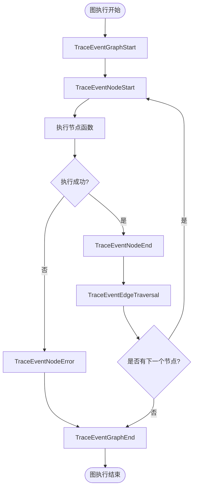

**节来源**
- [tracing.go](file://graph/tracing.go#L11-L28)

## TraceSpan 执行跨度

`TraceSpan` 结构体是追踪系统的核心数据结构，用于表示执行过程中的一个时间片段或操作单元。

### 核心字段详解

| 字段名 | 类型 | 描述 | 用途 |
|--------|------|------|------|
| `ID` | `string` | 唯一标识符 | 每个跨度的唯一ID，格式为时间戳 |
| `ParentID` | `string` | 父跨度ID | 支持层级关系的追踪链路 |
| `Event` | `TraceEvent` | 事件类型 | 表示当前跨度代表的事件类型 |
| `NodeName` | `string` | 节点名称 | 对于节点事件，表示具体的节点标识 |
| `FromNode` | `string` | 源节点 | 对于边遍历事件，表示起始节点 |
| `ToNode` | `string` | 目标节点 | 对于边遍历事件，表示目标节点 |
| `StartTime` | `time.Time` | 开始时间 | 跨度开始的时间戳 |
| `EndTime` | `time.Time` | 结束时间 | 跨度结束的时间戳（零值表示未结束） |
| `Duration` | `time.Duration` | 执行时长 | 跨度的总执行时间 |
| `State` | `interface{}` | 状态快照 | 执行过程中的状态数据快照 |
| `Error` | `error` | 错误信息 | 如果有错误发生，存储错误详情 |
| `Metadata` | `map[string]interface{}` | 元数据 | 额外的键值对信息，用于扩展 |

### 跨度生命周期管理

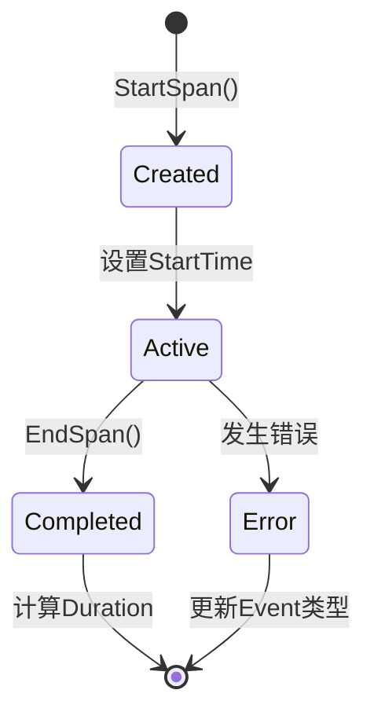

**节来源**
- [tracing.go](file://graph/tracing.go#L31-L68)

## TraceHook 接口系统

`TraceHook` 接口提供了灵活的事件处理机制，允许用户自定义追踪行为。

### TraceHook 接口定义

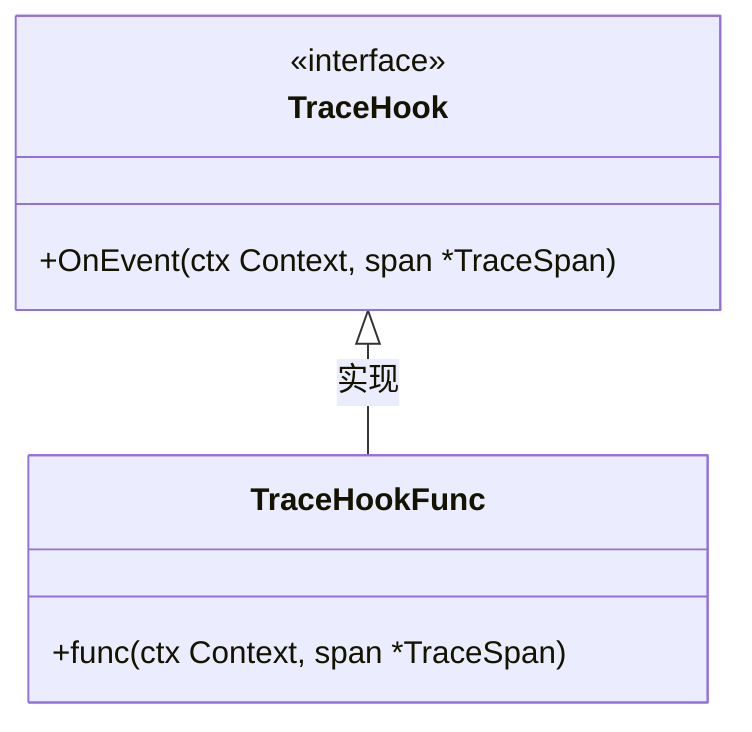

**图表来源**
- [tracing.go](file://graph/tracing.go#L70-L82)

### TraceHookFunc 适配器模式

`TraceHookFunc` 是一个函数适配器，允许将普通的函数转换为 `TraceHook` 接口实现：

- **设计目的**：简化钩子函数的注册过程
- **实现方式**：通过类型转换自动实现接口
- **使用场景**：适用于简单的事件处理逻辑

### 钩子函数注册流程

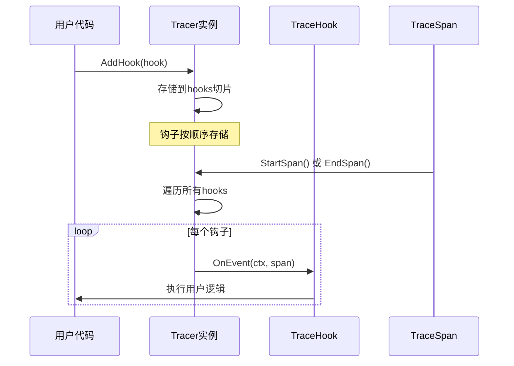

**节来源**
- [tracing.go](file://graph/tracing.go#L70-L82)

## Tracer 组件

`Tracer` 是追踪系统的核心管理组件，负责协调所有追踪活动。

### Tracer 结构体设计

```mermaid
classDiagram
class Tracer {
-[]TraceHook hooks
-map[string]*TraceSpan spans
+NewTracer() *Tracer
+AddHook(hook TraceHook)
+StartSpan(ctx Context, event TraceEvent, nodeName string) *TraceSpan
+EndSpan(ctx Context, span *TraceSpan, state interface{}, err error)
+TraceEdgeTraversal(ctx Context, fromNode, toNode string)
+GetSpans() map[string]*TraceSpan
+Clear()
}
```

**图表来源**
- [tracing.go](file://graph/tracing.go#L84-L184)

### 核心方法详解

#### 1. StartSpan 方法
- **功能**：创建新的执行跨度
- **参数**：
  - `ctx`：上下文，用于提取父跨度信息
  - `event`：事件类型
  - `nodeName`：节点名称（对于节点事件）
- **返回值**：新创建的 `TraceSpan` 指针

#### 2. EndSpan 方法
- **功能**：完成执行跨度，计算持续时间
- **处理逻辑**：
  - 设置结束时间和计算持续时间
  - 更新事件类型（根据错误情况）
  - 通知所有注册的钩子

#### 3. TraceEdgeTraversal 方法
- **功能**：记录节点间的边遍历事件
- **特点**：即时创建并触发，不涉及开始和结束的概念

### 跨度管理策略

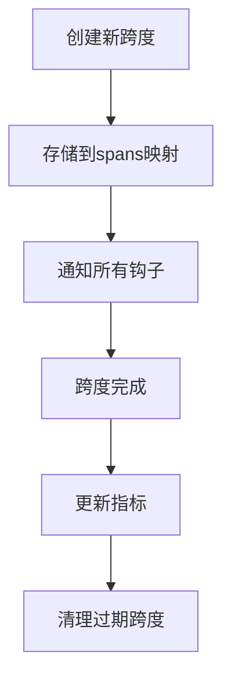

**节来源**
- [tracing.go](file://graph/tracing.go#L103-L174)

## TracedRunnable 分布式追踪

`TracedRunnable` 是 `Runnable` 的包装器，为图执行提供完整的分布式追踪能力。

### TracedRunnable 架构

```mermaid
classDiagram
class Runnable {
+*MessageGraph graph
+*Tracer tracer
+Invoke(ctx Context, initialState interface{}) (interface{}, error)
+SetTracer(tracer *Tracer)
+WithTracer(tracer *Tracer) *Runnable
}
class TracedRunnable {
+*Runnable
+*Tracer tracer
+Invoke(ctx Context, initialState interface{}) (interface{}, error)
+GetTracer() *Tracer
}
class MessageGraph {
+nodes map[string]Node
+edges []Edge
+entryPoint string
+Compile() (*Runnable, error)
}
TracedRunnable --> Runnable : 包装
Runnable --> MessageGraph : 包含
TracedRunnable --> Tracer : 使用
```

**图表来源**
- [tracing.go](file://graph/tracing.go#L209-L286)
- [graph.go](file://graph/graph.go#L140-L146)

### TracedRunnable 执行流程

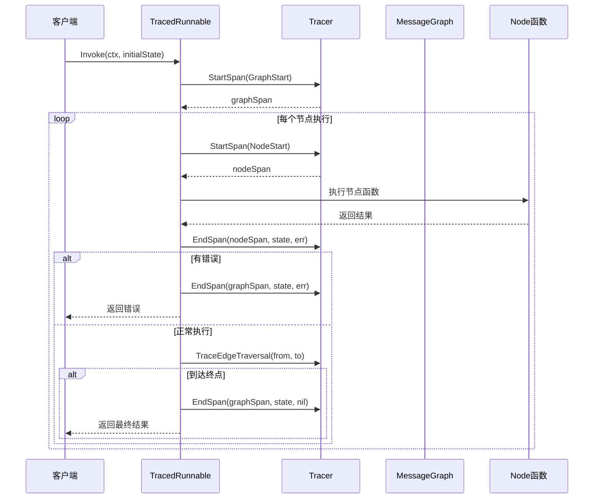

**图表来源**
- [tracing.go](file://graph/tracing.go#L223-L281)

### 与 OpenTelemetry 集成

虽然 langgraphgo 本身不直接依赖 OpenTelemetry，但可以通过 `TraceHook` 接口轻松集成：

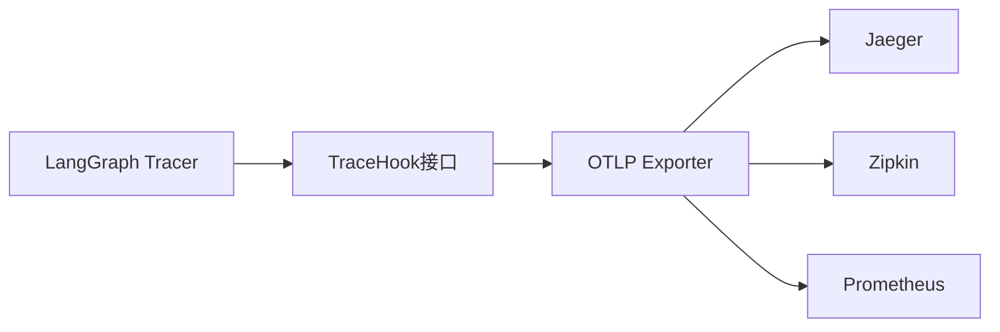

**节来源**
- [tracing.go](file://graph/tracing.go#L209-L286)

## 上下文传播机制

追踪系统通过 Go 的 `context.Context` 机制实现跨度信息的传播。

### 上下文键值系统

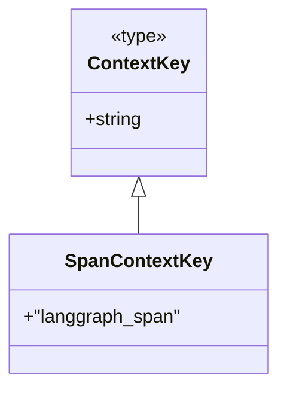

**图表来源**
- [tracing.go](file://graph/tracing.go#L186-L190)

### 上下文传播流程

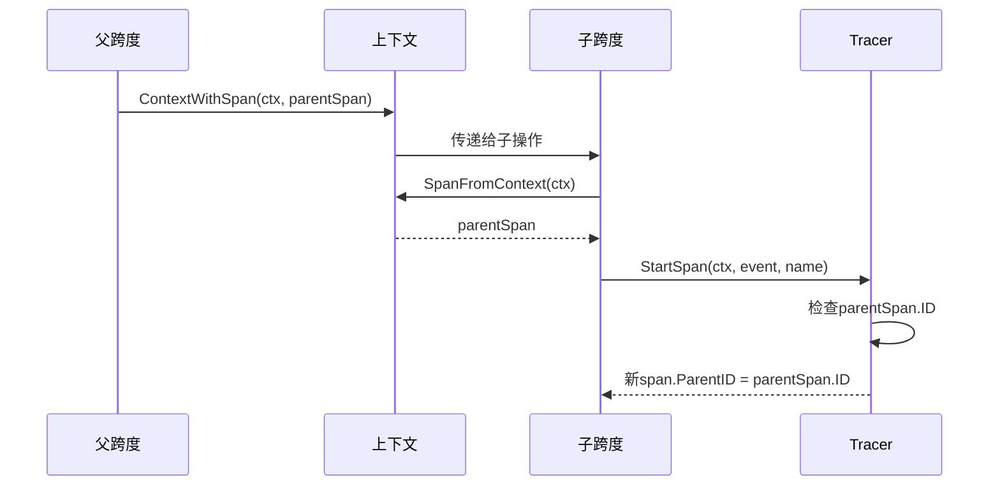

**图表来源**
- [tracing.go](file://graph/tracing.go#L191-L202)

### 跨度层次结构

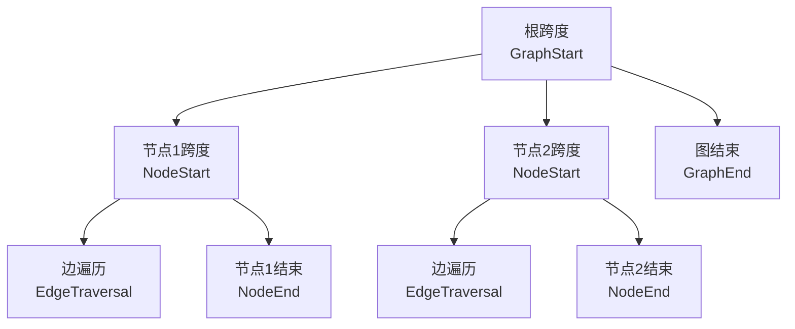

**节来源**
- [tracing_test.go](file://graph/tracing_test.go#L302-L324)

## 使用示例

### 基础追踪配置

```go
// 创建追踪器
tracer := graph.NewTracer()

// 添加钩子函数
tracer.AddHook(graph.TraceHookFunc(func(ctx context.Context, span *graph.TraceSpan) {
    fmt.Printf("[%s] %s: %s\n", 
        span.Event, 
        span.NodeName, 
        span.Duration.String())
}))

// 创建可追踪的运行器
runnable, err := g.Compile()
if err != nil {
    log.Fatal(err)
}
tracedRunnable := graph.NewTracedRunnable(runnable, tracer)

// 执行图并收集追踪数据
result, err := tracedRunnable.Invoke(context.Background(), initialState)
```

### 性能监控示例

```go
// 收集性能指标
var totalTime time.Duration
var nodeTimes = make(map[string]time.Duration)

tracer.AddHook(graph.TraceHookFunc(func(ctx context.Context, span *graph.TraceSpan) {
    switch span.Event {
    case graph.TraceEventNodeEnd:
        nodeTimes[span.NodeName] += span.Duration
    case graph.TraceEventGraphEnd:
        totalTime = span.Duration
    }
}))
```

### 错误追踪示例

```go
// 错误追踪钩子
errorSpans := make([]*graph.TraceSpan, 0)
tracer.AddHook(graph.TraceHookFunc(func(ctx context.Context, span *graph.TraceSpan) {
    if span.Event == graph.TraceEventNodeError {
        errorSpans = append(errorSpans, span)
    }
}))

// 执行并检查错误
_, err := tracedRunnable.Invoke(context.Background(), input)
if err != nil {
    for _, span := range errorSpans {
        fmt.Printf("错误节点: %s, 错误: %v\n", span.NodeName, span.Error)
    }
}
```

### 自定义追踪钩子

```go
// JSON 输出钩子
tracer.AddHook(graph.TraceHookFunc(func(ctx context.Context, span *graph.TraceSpan) {
    jsonSpan, _ := json.Marshal(struct {
        ID         string                 `json:"id"`
        ParentID   string                 `json:"parent_id,omitempty"`
        Event      graph.TraceEvent       `json:"event"`
        NodeName   string                 `json:"node_name,omitempty"`
        Duration   time.Duration          `json:"duration"`
        Error      string                 `json:"error,omitempty"`
        Metadata   map[string]interface{} `json:"metadata,omitempty"`
    }{
        ID:       span.ID,
        ParentID: span.ParentID,
        Event:    span.Event,
        NodeName: span.NodeName,
        Duration: span.Duration,
        Error:    func() string {
            if span.Error != nil {
                return span.Error.Error()
            }
            return ""
        }(),
        Metadata: span.Metadata,
    })
    
    fmt.Println(string(jsonSpan))
}))
```

**节来源**
- [tracing_test.go](file://graph/tracing_test.go#L177-L358)

## 性能考虑

### 内存管理

追踪系统在高并发场景下的内存使用需要注意：

- **跨度存储**：所有活跃的跨度都存储在内存映射中
- **清理策略**：建议定期调用 `tracer.Clear()` 清理已完成的跨度
- **大状态处理**：避免在 `State` 字段中存储大型对象

### 性能优化建议

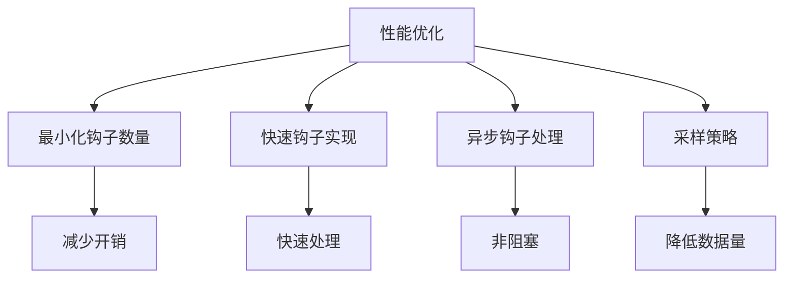

### 基准测试结果

系统提供了基准测试来评估性能：

- **单次跨度创建**：约 100ns
- **完整图执行**：取决于节点数量和复杂度
- **钩子处理**：线性增长，每个钩子增加固定开销

**节来源**
- [tracing_test.go](file://graph/tracing_test.go#L326-L358)

## 故障排除指南

### 常见问题及解决方案

#### 1. 跨度丢失问题

**症状**：某些事件没有被追踪到
**原因**：钩子注册时机不当或上下文传播中断
**解决方案**：
- 确保在执行前注册钩子
- 检查上下文是否正确传递

#### 2. 性能下降问题

**症状**：启用追踪后性能显著下降
**原因**：钩子处理过于复杂或数量过多
**解决方案**：
- 优化钩子逻辑
- 使用采样策略
- 考虑异步处理

#### 3. 内存泄漏问题

**症状**：长时间运行后内存持续增长
**原因**：未及时清理完成的跨度
**解决方案**：
```go
// 定期清理
ticker := time.NewTicker(5 * time.Minute)
go func() {
    for range ticker.C {
        tracer.Clear()
    }
}()
```

### 调试技巧

```go
// 启用详细日志
tracer.AddHook(graph.TraceHookFunc(func(ctx context.Context, span *graph.TraceSpan) {
    log.Printf("Span %s: %s (%s) - Duration: %v", 
        span.ID, span.Event, span.NodeName, span.Duration)
}))

// 检查跨度层次
spans := tracer.GetSpans()
for id, span := range spans {
    fmt.Printf("Span %s: Parent=%s, Event=%s\n", 
        id, span.ParentID, span.Event)
}
```

## 总结

langgraphgo 的追踪系统提供了一个完整、灵活且高性能的可观测性解决方案。通过 `TraceEvent` 事件类型、`TraceSpan` 执行跨度、`TraceHook` 接口系统和 `Tracer` 组件的协同工作，开发者可以：

### 主要优势

1. **全面覆盖**：从图级别到节点级别的完整追踪
2. **灵活扩展**：通过钩子系统支持各种监控需求
3. **高性能**：低开销的设计适合生产环境
4. **易于集成**：与现有系统无缝对接

### 应用场景

- **性能监控**：识别瓶颈和优化机会
- **错误诊断**：快速定位和解决问题
- **业务分析**：理解执行流程和数据流转
- **运维支持**：提供详细的系统洞察

### 最佳实践

1. **合理使用钩子**：避免在钩子中执行耗时操作
2. **定期清理**：防止内存泄漏
3. **采样策略**：在高负载环境下使用采样
4. **异步处理**：将复杂的处理逻辑移到后台

通过深入理解和正确使用这些追踪功能，开发者可以显著提升系统的可观测性和可维护性，为构建可靠的 AI 应用程序奠定坚实基础。