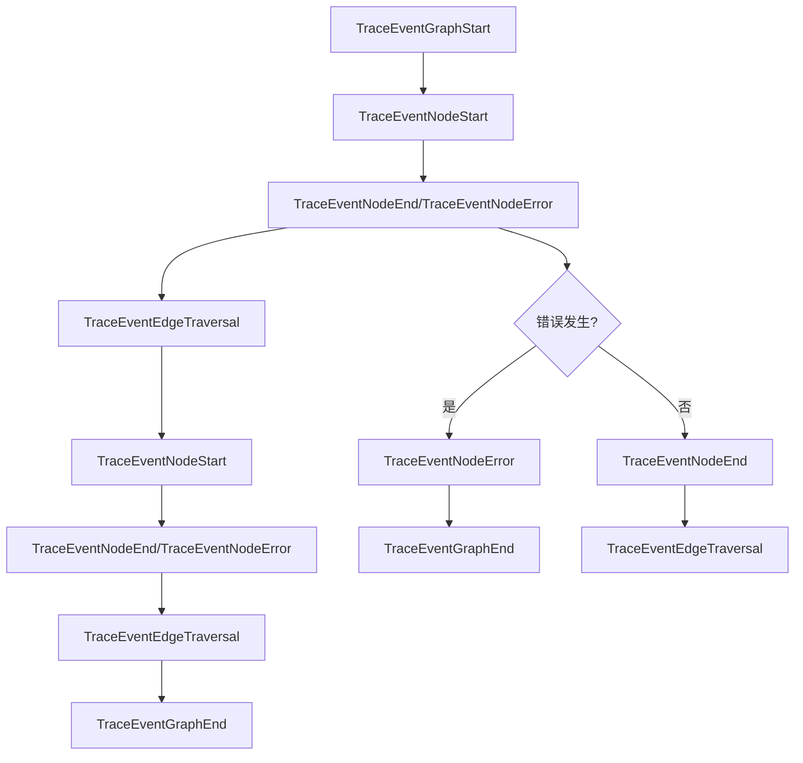
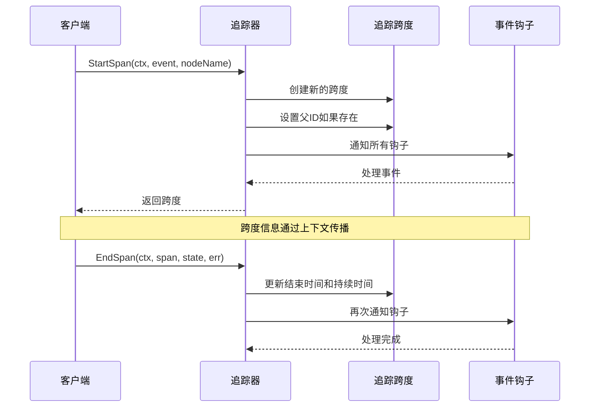
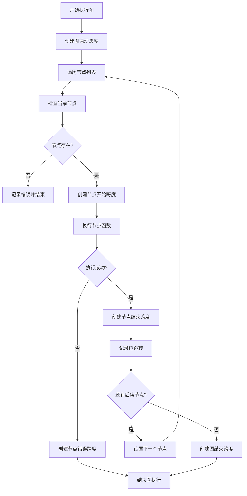
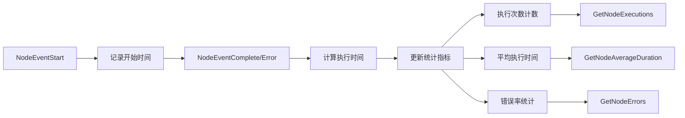

# 追踪事件类型

<cite>
**本文档中引用的文件**
- [tracing.go](file://graph/tracing.go)
- [tracing_test.go](file://graph/tracing_test.go)
- [builtin_listeners.go](file://graph/builtin_listeners.go)
- [builtin_listeners_test.go](file://graph/builtin_listeners_test.go)
- [listeners.go](file://graph/listeners.go)
- [listeners_test.go](file://graph/listeners_test.go)
- [graph.go](file://graph/graph.go)
- [main.go](file://examples\basic_example\main.go)
- [main.go](file://examples\listeners\main.go)
</cite>

## 目录
1. [简介](#简介)
2. [追踪事件类型概述](#追踪事件类型概述)
3. [核心追踪事件详解](#核心追踪事件详解)
4. [追踪架构设计](#追踪架构设计)
5. [实际应用场景](#实际应用场景)
6. [性能监控与分析](#性能监控与分析)
7. [最佳实践指南](#最佳实践指南)
8. [总结](#总结)

## 简介

LangGraphGo 提供了一套完整的追踪事件系统，用于监控和分析图结构工作流的执行过程。该系统通过定义六种核心追踪事件类型，为开发者提供了全面的可观测性支持，包括图的启动与结束、节点的执行生命周期、错误处理以及边的跳转等关键环节。

## 追踪事件类型概述

LangGraphGo 定义了以下六种主要的追踪事件类型：



**图表来源**
- [tracing.go](file://graph/tracing.go#L12-L27)

## 核心追踪事件详解

### TraceEventGraphStart - 图启动事件

**触发时机：** 当图结构开始执行时触发

**语义含义：** 表示整个图结构的工作流开始执行，这是图执行生命周期的第一个事件

**关键属性：**
- `Event`: 始终为 `"graph_start"`
- `NodeName`: 空字符串，因为这是全局级别的事件
- 包含图执行的起始时间戳

**代码示例路径：** [`TracedRunnable.Invoke`](file://graph/tracing.go#L224-L227)

### TraceEventGraphEnd - 图结束事件

**触发时机：** 当图结构成功完成所有节点执行或遇到不可恢复错误时触发

**语义含义：** 标记整个图结构工作流的结束，无论是正常完成还是因错误终止

**关键属性：**
- `Event`: 被自动更新为 `"graph_end"`
- `EndTime`: 记录图执行的结束时间
- `Duration`: 计算整个图执行的总耗时
- `State`: 最终的状态快照
- `Error`: 如果有错误发生，则包含错误信息

**代码示例路径：** [`Tracer.EndSpan`](file://graph/tracing.go#L140-L142)

### TraceEventNodeStart - 节点开始事件

**触发时机：** 在每个节点开始执行前触发

**语义含义：** 标记特定节点开始执行的时刻，为节点执行提供基准时间点

**关键属性：**
- `Event`: 始终为 `"node_start"`
- `NodeName`: 执行的节点名称
- `StartTime`: 节点开始执行的时间
- `State`: 执行前的状态快照（可选）

**代码示例路径：** [`TracedRunnable.Invoke`](file://graph/tracing.go#L245-L247)

### TraceEventNodeEnd - 节点完成事件

**触发时机：** 在节点成功执行完成后触发

**语义含义：** 标记节点执行成功完成，计算节点执行时间和最终状态

**关键属性：**
- `Event`: 被自动更新为 `"node_end"`
- `EndTime`: 节点执行完成的时间
- `Duration`: 节点执行的总耗时
- `State`: 节点执行后的状态快照
- `Error`: 为空，表示没有错误

**代码示例路径：** [`Tracer.EndSpan`](file://graph/tracing.go#L138-L139)

### TraceEventNodeError - 节点错误事件

**触发时机：** 在节点执行过程中发生错误时触发

**语义含义：** 捕获节点执行失败的情况，提供详细的错误信息和上下文

**关键属性：**
- `Event`: 被自动更新为 `"node_error"`
- `Error`: 包含具体的错误信息
- `State`: 错误发生时的状态快照
- 可能包含部分执行结果

**代码示例路径：** [`Tracer.EndSpan`](file://graph/tracing.go#L136-L137)

### TraceEventEdgeTraversal - 边跳转事件

**触发时机：** 在从一个节点跳转到下一个节点时触发

**语义含义：** 记录图结构中节点间的控制流转移，即使没有实际的计算发生

**关键属性：**
- `Event`: 始终为 `"edge_traversal"`
- `FromNode`: 起始节点名称
- `ToNode`: 目标节点名称
- `StartTime` 和 `EndTime`: 相同时间戳，表示瞬时事件
- `Duration`: 通常为 0

**代码示例路径：** [`Tracer.TraceEdgeTraversal`](file://graph/tracing.go#L151-L152)

**节来源**
- [tracing.go](file://graph/tracing.go#L12-L27)

## 追踪架构设计

### 追踪器核心组件

```mermaid
classDiagram
class Tracer {
+[]TraceHook hooks
+map~string,*TraceSpan~ spans
+AddHook(hook TraceHook)
+StartSpan(ctx, event, nodeName) *TraceSpan
+EndSpan(ctx, span, state, err)
+TraceEdgeTraversal(ctx, fromNode, toNode)
+GetSpans() map[string]*TraceSpan
+Clear()
}
class TraceSpan {
+string ID
+string ParentID
+TraceEvent Event
+string NodeName
+string FromNode
+string ToNode
+time.Time StartTime
+time.Time EndTime
+time.Duration Duration
+interface{} State
+error Error
+map~string,interface{}~ Metadata
}
class TraceHook {
<<interface>>
+OnEvent(ctx, span)
}
class TracedRunnable {
+*Runnable Runnable
+*Tracer tracer
+Invoke(ctx, initialState) (interface{}, error)
+GetTracer() *Tracer
}
Tracer --> TraceSpan : "管理"
Tracer --> TraceHook : "通知"
TracedRunnable --> Tracer : "使用"
```

**图表来源**
- [tracing.go](file://graph/tracing.go#L31-L287)

### 上下文传播机制

追踪系统通过 Go 的 context 包实现跨调用链的追踪信息传播：



**图表来源**
- [tracing.go](file://graph/tracing.go#L103-L148)

**节来源**
- [tracing.go](file://graph/tracing.go#L31-L287)

## 实际应用场景

### 基本追踪示例

以下是典型的图执行追踪流程：



**图表来源**
- [tracing.go](file://graph/tracing.go#L223-L281)

### 监听器集成模式

LangGraphGo 提供了多种内置监听器，它们都基于相同的追踪事件系统：

| 监听器类型 | 主要用途 | 关注的事件 |
|-----------|---------|-----------|
| ProgressListener | 进度跟踪 | NodeEventStart, NodeEventComplete, NodeEventError |
| LoggingListener | 结构化日志 | NodeEventStart, NodeEventComplete, NodeEventError |
| MetricsListener | 性能指标收集 | NodeEventStart, NodeEventComplete, NodeEventError |
| ChatListener | 实时聊天风格输出 | NodeEventStart, NodeEventComplete, NodeEventError |

**节来源**
- [builtin_listeners.go](file://graph/builtin_listeners.go#L14-L433)

## 性能监控与分析

### 内置指标收集

MetricsListener 提供了丰富的性能分析能力：



**图表来源**
- [builtin_listeners.go](file://graph/builtin_listeners.go#L202-L351)

### 监控数据结构

追踪系统提供了完整的监控数据结构：

| 字段名 | 类型 | 描述 |
|-------|------|------|
| ID | string | 唯一的跨度标识符 |
| ParentID | string | 父跨度标识符（根跨度为空） |
| Event | TraceEvent | 事件类型枚举值 |
| NodeName | string | 节点名称（适用于节点相关事件） |
| FromNode/ToNode | string | 边跳转的源节点和目标节点 |
| StartTime/EndTime | time.Time | 事件的开始和结束时间 |
| Duration | time.Duration | 事件的持续时间 |
| State | interface{} | 状态快照（可选） |
| Error | error | 错误信息（可选） |
| Metadata | map[string]interface{} | 自定义元数据 |

**节来源**
- [tracing.go](file://graph/tracing.go#L31-L68)

## 最佳实践指南

### 1. 合理使用追踪事件

- **避免过度追踪：** 对于高频执行的节点，考虑使用采样策略
- **选择合适的监听器：** 根据需求选择不同的内置监听器
- **自定义钩子：** 实现 TraceHook 接口以满足特殊监控需求

### 2. 性能优化建议

- **异步处理：** 使用异步钩子处理大量追踪数据
- **内存管理：** 定期清理追踪跨度以避免内存泄漏
- **上下文传递：** 正确使用 ContextWithSpan 和 SpanFromContext

### 3. 错误处理策略

- **优雅降级：** 在追踪系统出现故障时不影响主业务逻辑
- **错误隔离：** 确保追踪错误不会影响图执行
- **调试支持：** 利用追踪事件进行问题诊断和调试

### 4. 监控集成

- **指标导出：** 将追踪数据导出到 Prometheus、Grafana 等监控系统
- **日志关联：** 将追踪 ID 与应用日志关联以便问题定位
- **告警配置：** 基于追踪事件配置智能告警

**节来源**
- [tracing_test.go](file://graph/tracing_test.go#L83-L115)
- [builtin_listeners_test.go](file://graph/builtin_listeners_test.go#L100-L183)

## 总结

LangGraphGo 的追踪事件系统提供了一个完整而灵活的可观测性解决方案。通过六种核心事件类型，开发者可以全面监控图结构工作流的执行过程，从整体的图执行到细粒度的节点操作。系统的模块化设计使得它可以轻松集成到现有的监控体系中，为生产环境中的性能分析、错误诊断和运维监控提供了强大的支持。

该追踪系统不仅支持基本的日志记录功能，还提供了丰富的性能指标收集能力，使开发者能够深入了解工作流的执行特征，识别性能瓶颈，并优化系统性能。通过合理的使用和扩展，这个追踪系统可以成为维护和优化复杂图结构应用的重要工具。