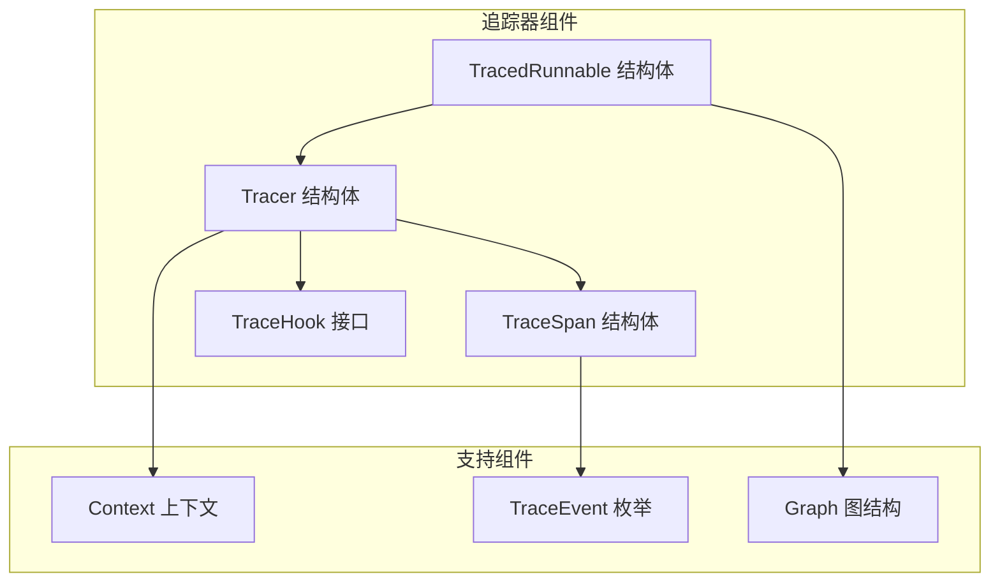
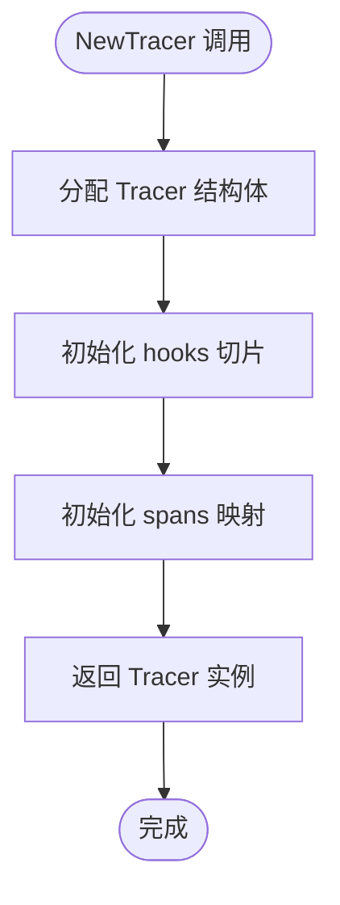
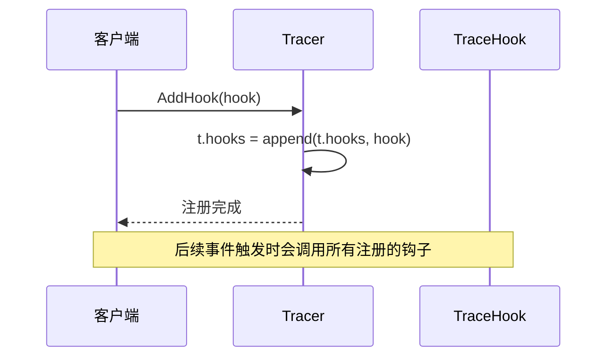
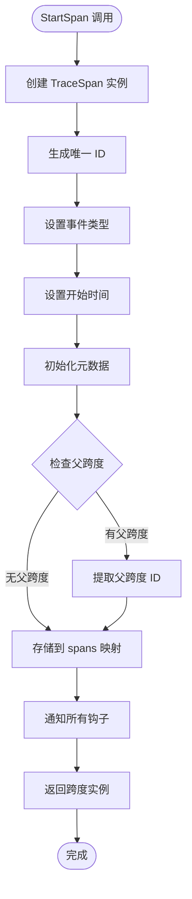
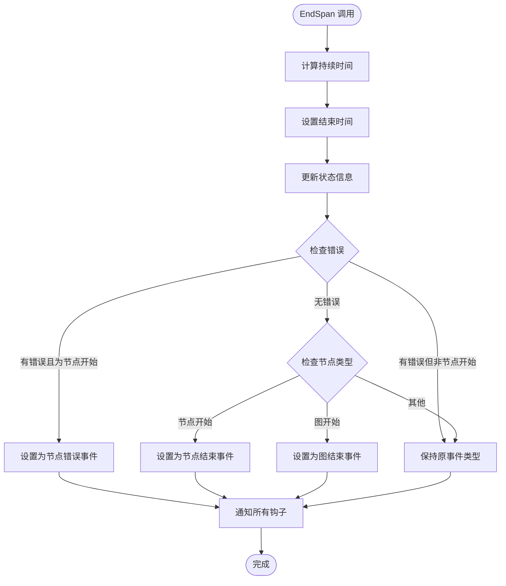
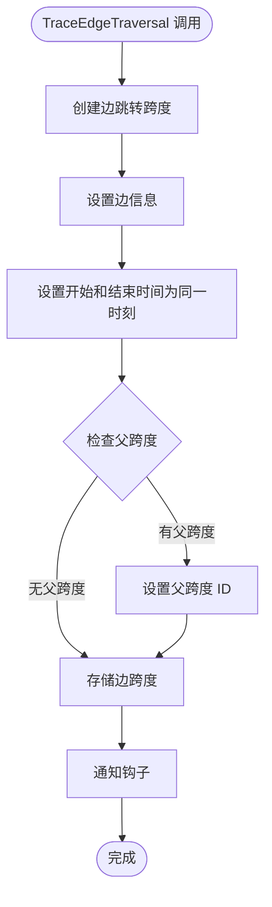
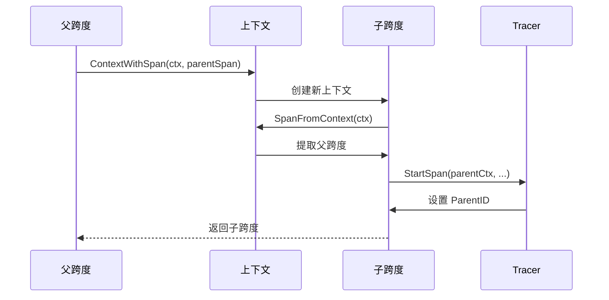
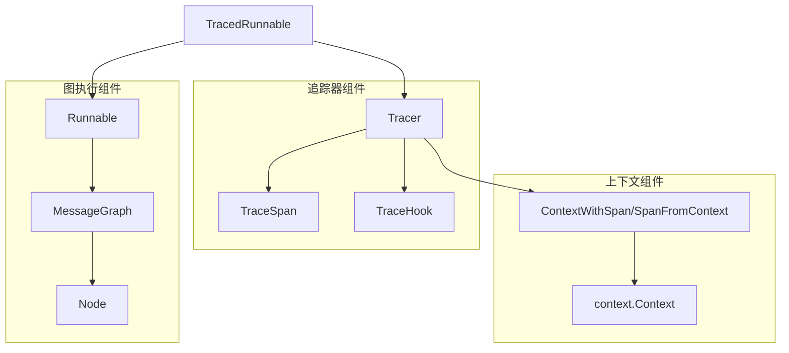

# 追踪器组件

<cite>
**本文档中引用的文件**
- [tracing.go](file://graph/tracing.go)
- [tracing_test.go](file://graph/tracing_test.go)
- [graph.go](file://graph/graph.go)
- [context.go](file://graph/context.go)
</cite>

## 目录
1. [简介](#简介)
2. [项目结构](#项目结构)
3. [核心组件](#核心组件)
4. [架构概览](#架构概览)
5. [详细组件分析](#详细组件分析)
6. [依赖关系分析](#依赖关系分析)
7. [性能考虑](#性能考虑)
8. [故障排除指南](#故障排除指南)
9. [结论](#结论)

## 简介

追踪器组件是 LangGraphGo 框架中的核心可观测性模块，负责捕获和管理图执行过程中的所有跟踪数据。该组件提供了完整的生命周期管理，包括跨度（Span）的创建、更新、销毁以及事件钩子的注册和通知机制。

追踪器组件的主要功能包括：
- **执行跨度管理**：跟踪图执行过程中的各个阶段
- **事件钩子系统**：提供可扩展的事件处理机制  
- **边跳转记录**：专门处理节点间跳转的特殊事件
- **上下文传递**：通过 Go 的 context 包实现跨度的层次关系
- **数据获取与清理**：提供完整的数据访问和内存管理功能

## 项目结构

追踪器组件位于 `graph` 包中，与其他核心组件紧密集成：



**图表来源**
- [tracing.go](file://graph/tracing.go#L84-L287)
- [graph.go](file://graph/graph.go#L140-L172)

**章节来源**
- [tracing.go](file://graph/tracing.go#L1-L287)
- [graph.go](file://graph/graph.go#L1-L200)

## 核心组件

### Tracer 结构体

Tracer 是追踪器的核心结构体，包含两个主要字段：

| 字段 | 类型 | 描述 |
|------|------|------|
| hooks | []TraceHook | 追踪钩子列表，用于事件通知 |
| spans | map[string]*TraceSpan | 跨度存储映射，按 ID 索引 |

### TraceSpan 结构体

TraceSpan 表示一个执行跨度，包含完整的执行上下文信息：

| 字段 | 类型 | 描述 |
|------|------|------|
| ID | string | 跨度唯一标识符 |
| ParentID | string | 父跨度标识符（根跨度为空） |
| Event | TraceEvent | 事件类型标识 |
| NodeName | string | 节点名称（节点相关事件） |
| FromNode | string | 边跳转源节点 |
| ToNode | string | 边跳转目标节点 |
| StartTime | time.Time | 跨度开始时间 |
| EndTime | time.Time | 跨度结束时间 |
| Duration | time.Duration | 执行持续时间 |
| State | interface{} | 状态快照 |
| Error | error | 错误信息 |
| Metadata | map[string]interface{} | 元数据键值对 |

### TraceEvent 枚举

定义了追踪系统中的各种事件类型：

| 事件常量 | 值 | 描述 |
|----------|-----|------|
| TraceEventGraphStart | "graph_start" | 图执行开始 |
| TraceEventGraphEnd | "graph_end" | 图执行结束 |
| TraceEventNodeStart | "node_start" | 节点执行开始 |
| TraceEventNodeEnd | "node_end" | 节点执行结束 |
| TraceEventNodeError | "node_error" | 节点执行错误 |
| TraceEventEdgeTraversal | "edge_traversal" | 边跳转事件 |

**章节来源**
- [tracing.go](file://graph/tracing.go#L8-L83)

## 架构概览

追踪器组件采用分层架构设计，从底层的数据结构到高层的执行包装器：

```mermaid
graph TD
subgraph "用户接口层"
TracedRunnable[TracedRunnable]
NewTracedRunnable[NewTracedRunnable]
end
subgraph "追踪管理层"
Tracer[Tracer]
StartSpan[StartSpan]
EndSpan[EndSpan]
TraceEdgeTraversal[TraceEdgeTraversal]
end
subgraph "数据存储层"
SpansMap[spans map]
HooksList[hooks []TraceHook]
end
subgraph "上下文管理层"
ContextOps[ContextWithSpan/SpanFromContext]
SpanHierarchy[跨度层次关系]
end
TracedRunnable --> Tracer
Tracer --> StartSpan
Tracer --> EndSpan
Tracer --> TraceEdgeTraversal
Tracer --> SpansMap
Tracer --> HooksList
Tracer --> ContextOps
ContextOps --> SpanHierarchy
```

**图表来源**
- [tracing.go](file://graph/tracing.go#L210-L287)
- [tracing.go](file://graph/tracing.go#L84-L184)

## 详细组件分析

### NewTracer 初始化逻辑

NewTracer 函数负责创建新的追踪器实例，初始化必要的数据结构：



**图表来源**
- [tracing.go](file://graph/tracing.go#L90-L96)

初始化过程确保：
- hooks 切片预分配空容量，避免频繁扩容
- spans 映射预分配空映射，准备存储跨度数据

**章节来源**
- [tracing.go](file://graph/tracing.go#L90-L96)

### AddHook 注册机制

AddHook 方法实现了追踪钩子的动态注册：



**图表来源**
- [tracing.go](file://graph/tracing.go#L98-L101)

注册机制的特点：
- 支持多个钩子同时注册
- 钩子按注册顺序依次调用
- 使用 TraceHookFunc 适配器简化函数式钩子的使用

**章节来源**
- [tracing.go](file://graph/tracing.go#L98-L101)

### StartSpan 生命周期管理

StartSpan 方法负责创建新的执行跨度，管理跨度的完整生命周期：



**图表来源**
- [tracing.go](file://graph/tracing.go#L103-L126)

StartSpan 的关键特性：
- 自动生成唯一跨度 ID（基于时间戳）
- 自动检测并建立父子关系
- 支持上下文中的跨度传递
- 即时通知所有注册的钩子

**章节来源**
- [tracing.go](file://graph/tracing.go#L103-L126)

### EndSpan 执行完成处理

EndSpan 方法处理跨度的结束操作，计算持续时间并更新事件类型：



**图表来源**
- [tracing.go](file://graph/tracing.go#L128-L148)

EndSpan 的智能事件类型更新：
- 节点执行失败时自动升级为错误事件
- 正常节点执行完成后标记为结束事件
- 图执行完成后标记为结束事件

**章节来源**
- [tracing.go](file://graph/tracing.go#L128-L148)

### TraceEdgeTraversal 边跳转记录

TraceEdgeTraversal 方法专门处理节点间的跳转事件，创建瞬时跨度：



**图表来源**
- [tracing.go](file://graph/tracing.go#L150-L174)

边跳转跨度的特点：
- 创建时即完成，Duration 为 0
- 包含明确的 FromNode 和 ToNode 信息
- 支持父子关系继承
- 用于记录控制流的转移

**章节来源**
- [tracing.go](file://graph/tracing.go#L150-L174)

### GetSpans 和 Clear 数据管理

这两个方法提供了完整的数据访问和内存管理功能：

| 方法 | 功能 | 返回类型 | 内存管理 |
|------|------|----------|----------|
| GetSpans | 获取所有收集的跨度 | map[string]*TraceSpan | 返回内部映射的副本 |
| Clear | 清除所有收集的跨度 | void | 重新初始化映射 |

Clear 方法的实现确保内存的有效回收，避免长期运行时的内存泄漏。

**章节来源**
- [tracing.go](file://graph/tracing.go#L176-L184)

### 上下文传递机制

追踪器组件通过 Go 的 context 包实现跨度的层次关系传递：



**图表来源**
- [tracing.go](file://graph/tracing.go#L191-L202)

上下文传递的关键功能：
- ContextWithSpan 存储跨度到上下文中
- SpanFromContext 从上下文中提取跨度
- 自动建立父子关系
- 支持嵌套的跨度层次结构

**章节来源**
- [tracing.go](file://graph/tracing.go#L191-L202)

### TracedRunnable 执行包装器

TracedRunnable 结构体为普通的 Runnable 提供了完整的追踪能力：

```mermaid
classDiagram
class TracedRunnable {
+Runnable *Runnable
+tracer *Tracer
+Invoke(ctx, state) (interface{}, error)
+GetTracer() *Tracer
}
class Runnable {
+graph *MessageGraph
+tracer *Tracer
+Invoke(ctx, state) (interface{}, error)
+SetTracer(tracer *Tracer)
}
TracedRunnable --> Runnable : 包装
TracedRunnable --> Tracer : 使用
```

**图表来源**
- [tracing.go](file://graph/tracing.go#L210-L287)

TracedRunnable 的执行流程：
1. 开始图执行跨度
2. 遍历节点执行
3. 记录每个节点的开始和结束事件
4. 记录节点间的边跳转
5. 结束图执行跨度

**章节来源**
- [tracing.go](file://graph/tracing.go#L210-L287)

## 依赖关系分析

追踪器组件与框架其他部分的依赖关系：



**图表来源**
- [tracing.go](file://graph/tracing.go#L1-L287)
- [graph.go](file://graph/graph.go#L140-L172)

主要依赖关系：
- Tracer 依赖 context 包进行跨度传递
- TracedRunnable 依赖 Runnable 进行图执行
- 所有组件都依赖 TraceEvent 枚举进行事件分类

**章节来源**
- [tracing.go](file://graph/tracing.go#L1-L287)
- [graph.go](file://graph/graph.go#L140-L172)

## 性能考虑

追踪器组件在设计时充分考虑了性能优化：

### 内存管理
- spans 映射使用字符串 ID 作为键，提供 O(1) 查找性能
- hooks 切片按需增长，避免不必要的内存分配
- Clear 方法主动释放内存，防止长期运行时的内存泄漏

### 并发安全
- Tracer 结构体本身不是并发安全的，建议在单个 goroutine 中使用
- 如果需要并发使用，应在外层添加同步机制

### 性能基准测试
测试显示：
- StartSpan 和 EndSpan 操作在微秒级别
- TraceEdgeTraversal 操作更加轻量级
- 大规模追踪场景下的内存使用可控

## 故障排除指南

### 常见问题及解决方案

#### 跨度丢失问题
**症状**：某些事件没有被追踪到
**原因**：钩子未正确注册或上下文传递中断
**解决方案**：
- 确保在 StartSpan 之前注册所有钩子
- 检查上下文是否正确传递
- 验证钩子函数是否正确实现

#### 内存泄漏问题
**症状**：长时间运行后内存使用持续增长
**原因**：未及时调用 Clear 方法
**解决方案**：
- 在适当的时候调用 Clear 清理数据
- 对于长期运行的应用，定期清理旧的追踪数据

#### 父子关系错误
**症状**：跨度层次关系不正确
**原因**：上下文传递错误或手动修改 ParentID
**解决方案**：
- 确保使用 ContextWithSpan 和 SpanFromContext
- 避免手动修改跨度的 ParentID 字段

**章节来源**
- [tracing_test.go](file://graph/tracing_test.go#L302-L324)

## 结论

追踪器组件是 LangGraphGo 框架中不可或缺的可观测性基础设施，提供了完整而灵活的跟踪解决方案。其设计特点包括：

### 主要优势
- **完整的生命周期管理**：从跨度创建到销毁的全流程覆盖
- **灵活的钩子系统**：支持多种事件处理模式
- **高效的内存管理**：优化的存储结构和清理机制
- **良好的上下文集成**：无缝集成 Go 的标准库
- **强大的执行包装**：简化复杂图执行的追踪

### 应用场景
- **调试和诊断**：帮助开发者理解执行流程
- **性能监控**：识别执行瓶颈和优化机会
- **业务分析**：理解用户行为和系统交互
- **故障排查**：快速定位和解决问题

### 最佳实践
- 在应用启动时初始化 Tracer 实例
- 合理选择钩子的数量和类型
- 及时清理不需要的追踪数据
- 在生产环境中考虑性能影响
- 结合具体的业务需求定制钩子逻辑

追踪器组件的设计体现了现代软件工程的最佳实践，为构建可观测的分布式系统提供了坚实的基础。通过深入理解和正确使用这个组件，开发者可以显著提升系统的可维护性和可观察性。