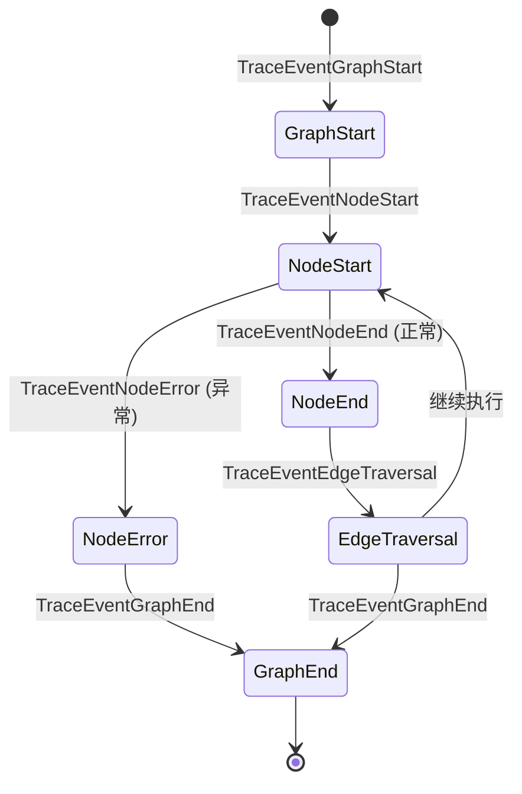
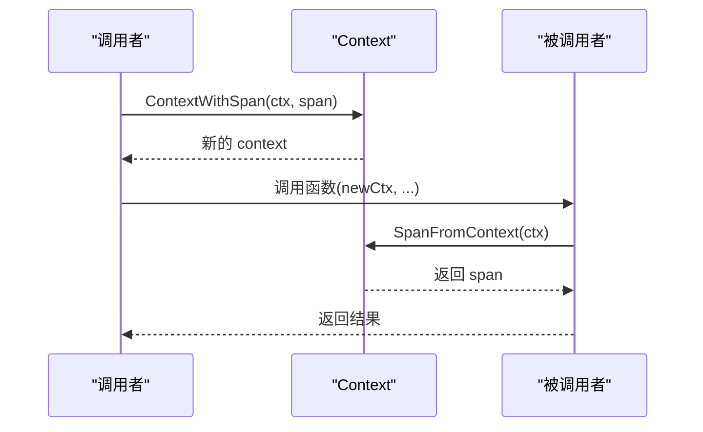
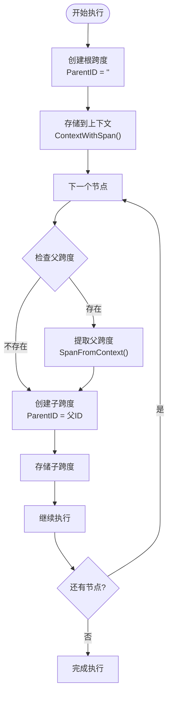
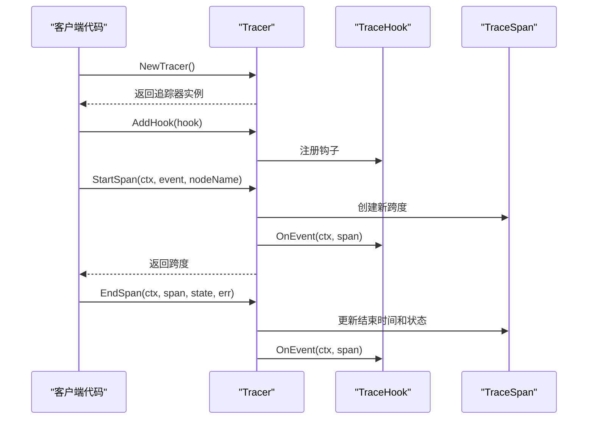
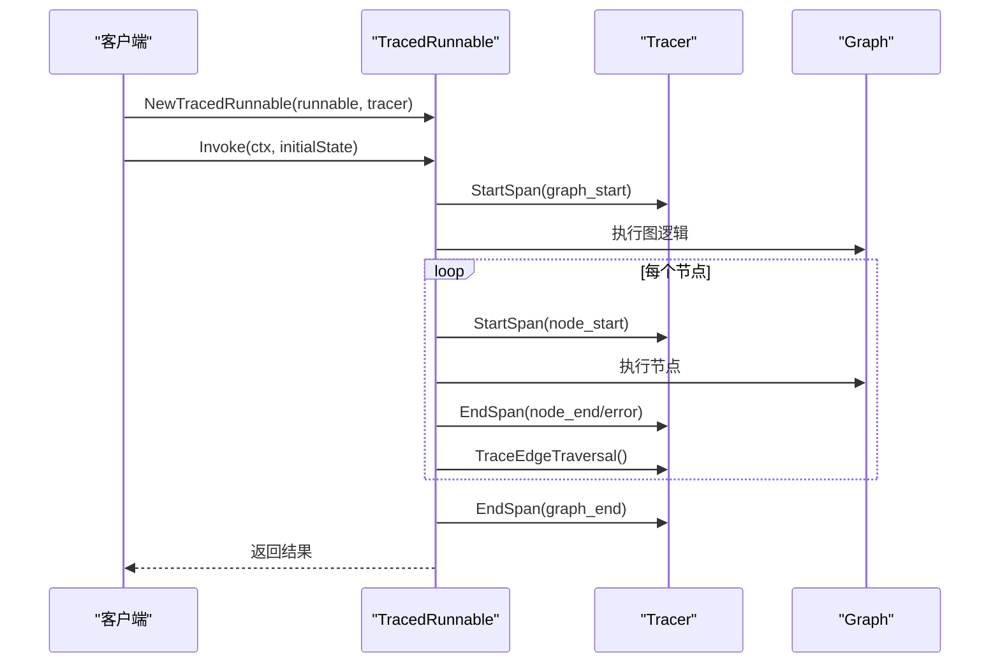
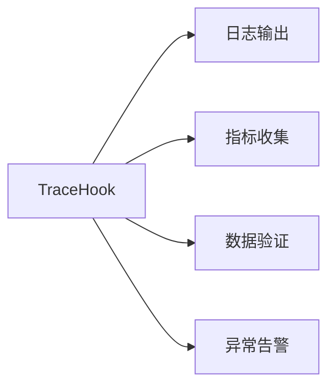

# 追踪跨度模型

<cite>
**本文档中引用的文件**
- [tracing.go](file://graph/tracing.go)
- [tracing_test.go](file://graph/tracing_test.go)
- [context.go](file://graph/context.go)
- [schema.go](file://graph/schema.go)
- [main.go](file://examples/basic_example/main.go)
</cite>

## 目录
1. [简介](#简介)
2. [TraceSpan 结构体概述](#tracespan-结构体概述)
3. [核心字段详解](#核心字段详解)
4. [追踪事件类型](#追踪事件类型)
5. [上下文传递机制](#上下文传递机制)
6. [调用层级关系构建](#调用层级关系构建)
7. [实际使用示例](#实际使用示例)
8. [性能考虑](#性能考虑)
9. [故障排除指南](#故障排除指南)
10. [总结](#总结)

## 简介

TraceSpan 是 LangGraphGo 框架中的核心追踪组件，用于记录和监控图执行过程中的各种操作。它提供了一个完整的执行上下文和时间信息记录机制，支持分布式追踪、性能分析和调试功能。通过 TraceSpan，开发者可以深入了解图执行的每个步骤，包括节点执行、边跳转、错误处理等关键操作。

## TraceSpan 结构体概述

TraceSpan 结构体是追踪系统的核心数据结构，它封装了一次执行操作的所有相关信息。该结构体设计精巧，包含了从基本标识到详细状态信息的完整追踪数据。

```mermaid
classDiagram
class TraceSpan {
+string ID
+string ParentID
+TraceEvent Event
+string NodeName
+string FromNode
+string ToNode
+time.Time StartTime
+time.Time EndTime
+time.Duration Duration
+interface{} State
+error Error
+map[string]interface{} Metadata
}
class TraceEvent {
<<enumeration>>
graph_start
graph_end
node_start
node_end
node_error
edge_traversal
}
class Tracer {
+[]TraceHook hooks
+map[string]*TraceSpan spans
+StartSpan(ctx, event, nodeName) *TraceSpan
+EndSpan(ctx, span, state, err)
+TraceEdgeTraversal(ctx, fromNode, toNode)
+AddHook(hook)
+GetSpans() map[string]*TraceSpan
+Clear()
}
class TraceHook {
<<interface>>
+OnEvent(ctx, span)
}
TraceSpan --> TraceEvent : "使用"
Tracer --> TraceSpan : "管理"
Tracer --> TraceHook : "通知"
```

**图表来源**
- [tracing.go](file://graph/tracing.go#L31-L67)
- [tracing.go](file://graph/tracing.go#L84-L102)

**章节来源**
- [tracing.go](file://graph/tracing.go#L31-L67)

## 核心字段详解

### 唯一标识字段

#### ID（唯一标识）
- **类型**: `string`
- **用途**: 为每个追踪跨度分配唯一的标识符
- **生成方式**: 使用时间戳格式化生成，确保高并发环境下的唯一性
- **特点**: 时间戳格式为 `"20060102150405.000000"`，精确到微秒级别

#### ParentID（父跨度ID）
- **类型**: `string`
- **用途**: 建立父子跨度关系，支持追踪树状结构
- **默认值**: 空字符串（根跨度）
- **作用**: 实现调用层级关系，便于分析执行流程

### 事件类型字段

#### Event（事件类型）
- **类型**: `TraceEvent`（字符串类型别名）
- **用途**: 标识当前跨度代表的执行阶段
- **取值**: 见[追踪事件类型](#追踪事件类型)章节

#### NodeName（节点名称）
- **类型**: `string`
- **用途**: 记录执行的节点名称
- **适用场景**: 节点开始、结束和错误事件
- **特殊值**: 图执行时为空字符串

#### FromNode/ToNode（边跳转源/目标）
- **类型**: `string`
- **用途**: 记录节点间跳转的源节点和目标节点
- **适用场景**: 边遍历事件
- **特点**: 仅在 `TraceEventEdgeTraversal` 类型中有效

### 时间度量字段

#### StartTime/EndTime（开始/结束时间）
- **类型**: `time.Time`
- **用途**: 记录跨度的开始和结束时间
- **精度**: 纳秒级
- **注意**: 结束时间在跨度创建时即设置为零值

#### Duration（持续时间）
- **类型**: `time.Duration`
- **用途**: 计算跨度的总执行时间
- **计算时机**: 在 `EndSpan` 方法中自动计算
- **公式**: `Duration = EndTime - StartTime`

### 状态和错误字段

#### State（状态快照）
- **类型**: `interface{}`
- **用途**: 存储执行过程中的状态快照
- **灵活性**: 支持任意类型的对象
- **应用场景**: 调试和状态分析

#### Error（执行错误）
- **类型**: `error`
- **用途**: 记录执行过程中发生的错误
- **自动更新**: 在 `EndSpan` 方法中根据错误情况自动设置事件类型

### 元数据字段

#### Metadata（元数据）
- **类型**: `map[string]interface{}`
- **用途**: 存储额外的键值对信息
- **灵活性**: 支持任意类型的键值对
- **应用场景**: 性能指标、自定义标签等

**章节来源**
- [tracing.go](file://graph/tracing.go#L31-L67)

## 追踪事件类型

LangGraphGo 定义了六种主要的追踪事件类型，每种类型对应图执行过程中的特定阶段：

| 事件类型 | 常量值 | 描述 | 使用场景 |
|---------|--------|------|----------|
| `TraceEventGraphStart` | `"graph_start"` | 图执行开始 | 整个图的生命周期起点 |
| `TraceEventGraphEnd` | `"graph_end"` | 图执行结束 | 整个图的生命周期终点 |
| `TraceEventNodeStart` | `"node_start"` | 节点执行开始 | 单个节点的执行起点 |
| `TraceEventNodeEnd` | `"node_end"` | 节点执行结束 | 正常完成的节点执行终点 |
| `TraceEventNodeError` | `"node_error"` | 节点执行错误 | 发生错误的节点执行终点 |
| `TraceEventEdgeTraversal` | `"edge_traversal"` | 边遍历 | 节点间的跳转过程 |



**图表来源**
- [tracing.go](file://graph/tracing.go#L8-L28)

**章节来源**
- [tracing.go](file://graph/tracing.go#L8-L28)

## 上下文传递机制

LangGraphGo 提供了完整的上下文传递机制，支持在函数调用链中传递追踪跨度信息。

### ContextWithSpan 函数

该函数将 TraceSpan 存储到 context 中，实现跨函数调用的跨度传递：



**图表来源**
- [tracing.go](file://graph/tracing.go#L191-L202)

### SpanFromContext 函数

该函数从 context 中提取 TraceSpan，支持上下文中的跨度访问：

- **参数**: `ctx context.Context` - 包含跨度信息的上下文
- **返回值**: `*TraceSpan` - 提取的跨度指针，未找到时返回 nil
- **实现原理**: 使用类型断言检查 context.Value 的类型

### 内部实现机制

上下文传递基于 Go 的标准 context 包，使用自定义的 contextKey：

- **键类型**: `contextKey`（字符串类型别名）
- **键值**: `"langgraph_span"`
- **存储方式**: `context.WithValue(ctx, spanContextKey, span)`
- **检索方式**: `ctx.Value(spanContextKey).(*TraceSpan)`

**章节来源**
- [tracing.go](file://graph/tracing.go#L186-L202)

## 调用层级关系构建

TraceSpan 系统通过 ParentID 字段和上下文传递机制，自动构建复杂的调用层级关系。

### 层级关系建立流程



**图表来源**
- [tracing.go](file://graph/tracing.go#L104-L125)
- [tracing_test.go](file://graph/tracing_test.go#L302-L324)

### 测试验证

测试用例验证了正确的层级关系构建：

- **根跨度**: ParentID 为空字符串
- **子跨度**: ParentID 等于父跨度的 ID
- **传递机制**: 通过上下文正确传递跨度信息

**章节来源**
- [tracing_test.go](file://graph/tracing_test.go#L302-L324)

## 实际使用示例

### 基本追踪使用

以下展示了如何使用 Tracer 和 TraceSpan 进行基本的追踪操作：

#### 创建和管理追踪器



**图表来源**
- [tracing.go](file://graph/tracing.go#L90-L102)
- [tracing.go](file://graph/tracing.go#L103-L125)

#### 错误处理追踪

当节点执行发生错误时，追踪系统会自动更新事件类型：

- **正常结束**: `TraceEventNodeStart` → `TraceEventNodeEnd`
- **发生错误**: `TraceEventNodeStart` → `TraceEventNodeError`

#### 边遍历追踪

边遍历事件专门用于记录节点间的跳转过程：

- **触发时机**: 每次节点执行完成后寻找下一个节点时
- **包含信息**: 源节点、目标节点、执行时间
- **特点**: 开始时间和结束时间相同，持续时间为零

### TracedRunnable 高级使用

TracedRunnable 是内置的可追踪运行器，提供了完整的图执行追踪功能：



**图表来源**
- [tracing.go](file://graph/tracing.go#L210-L286)

**章节来源**
- [tracing.go](file://graph/tracing.go#L90-L102)
- [tracing.go](file://graph/tracing.go#L210-L286)
- [tracing_test.go](file://graph/tracing_test.go#L177-L243)

## 性能考虑

### 内存管理

- **跨度存储**: 使用 map 存储所有跨度，需要定期清理避免内存泄漏
- **元数据优化**: 元数据 map 在创建时初始化，避免频繁分配
- **状态快照**: State 字段使用 interface{}，支持任意类型但可能影响 GC

### 时间性能

- **ID 生成**: 使用时间戳生成算法，性能开销极小
- **上下文传递**: 基于标准 context 包，性能良好
- **钩子通知**: 同步通知所有注册的钩子，可根据需要异步化

### 并发安全

- **线程安全**: Tracer 结构体本身不是线程安全的
- **建议**: 每个 goroutine 使用独立的 Tracer 实例
- **清理策略**: 并发执行时需要适当的清理机制

**章节来源**
- [tracing.go](file://graph/tracing.go#L84-L102)
- [tracing_test.go](file://graph/tracing_test.go#L337-L358)

## 故障排除指南

### 常见问题及解决方案

#### 跨度丢失问题

**症状**: 跟踪不到某些节点或事件
**原因**: 
- 上下文传递中断
- 跨度未正确存储到上下文
- 钩子注册失败

**解决方案**:
1. 检查 `ContextWithSpan` 的调用位置
2. 验证 `SpanFromContext` 的正确使用
3. 确认钩子已正确注册

#### 层级关系错误

**症状**: 父子关系不正确
**原因**:
- 父跨度未正确传递
- 上下文污染
- 并发访问冲突

**解决方案**:
1. 确保每个子节点都从正确的上下文获取父跨度
2. 使用独立的 Tracer 实例
3. 检查并发访问模式

#### 性能问题

**症状**: 追踪导致性能下降
**原因**:
- 钩子处理耗时过长
- 跨度数量过多
- 元数据过大

**解决方案**:
1. 优化钩子处理逻辑
2. 定期清理不需要的跨度
3. 控制元数据的大小和复杂度

### 调试技巧

#### 使用钩子进行调试



#### 跨度数据分析

- **时间分析**: 分析各节点的执行时间分布
- **错误分析**: 统计错误发生的频率和模式
- **路径分析**: 分析图执行的典型路径

**章节来源**
- [tracing_test.go](file://graph/tracing_test.go#L83-L115)
- [tracing_test.go](file://graph/tracing_test.go#L246-L299)

## 总结

TraceSpan 结构体是 LangGraphGo 追踪系统的核心组件，它提供了完整的执行上下文和时间信息记录能力。通过精心设计的字段组合和灵活的上下文传递机制，TraceSpan 能够准确记录图执行的每个细节。

### 主要优势

1. **完整性**: 包含执行所需的所有基本信息
2. **灵活性**: 支持任意类型的元数据和状态
3. **可扩展性**: 通过钩子机制支持自定义处理逻辑
4. **易用性**: 提供简洁的 API 和完善的测试覆盖

### 最佳实践

1. **合理使用元数据**: 只存储必要的追踪信息
2. **及时清理**: 避免长时间累积大量跨度数据
3. **并发安全**: 在并发环境中使用独立的 Tracer 实例
4. **错误处理**: 正确处理追踪过程中的异常情况

TraceSpan 系统为 LangGraphGo 提供了强大的可观测性基础，帮助开发者深入理解图执行过程，优化系统性能，并快速定位和解决问题。