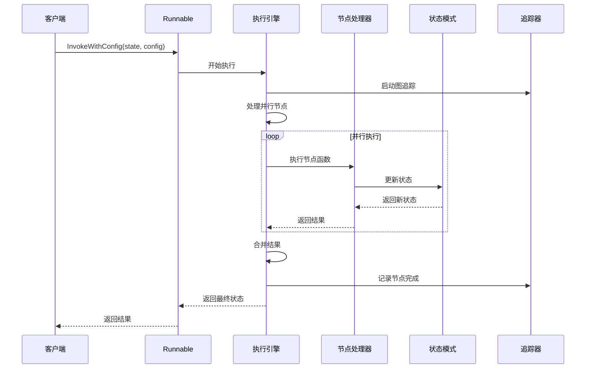
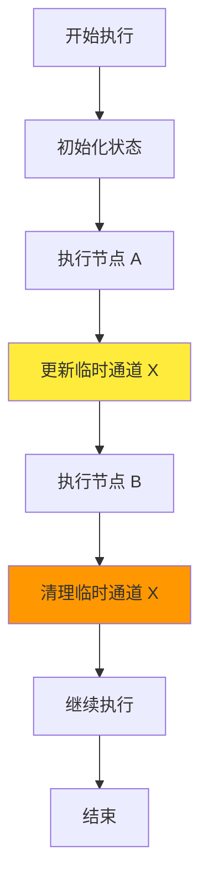
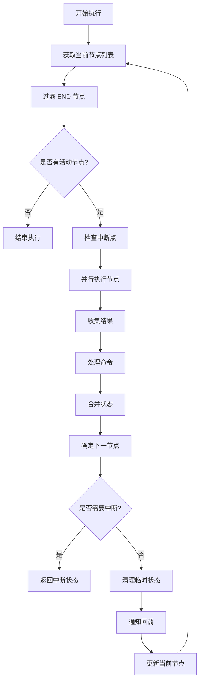
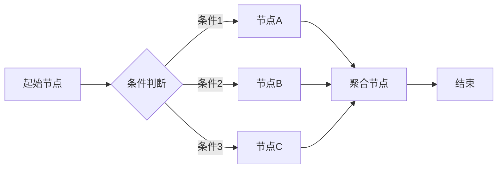
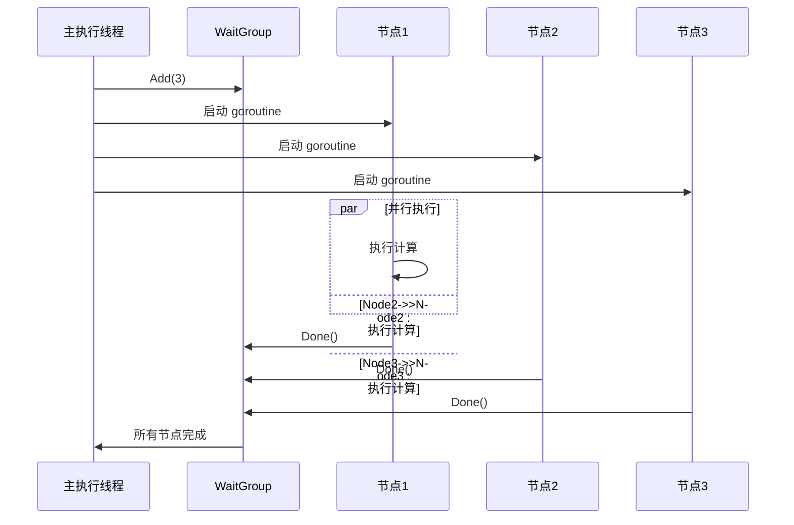
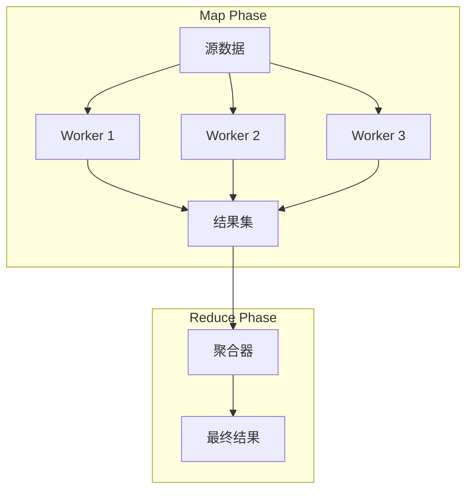
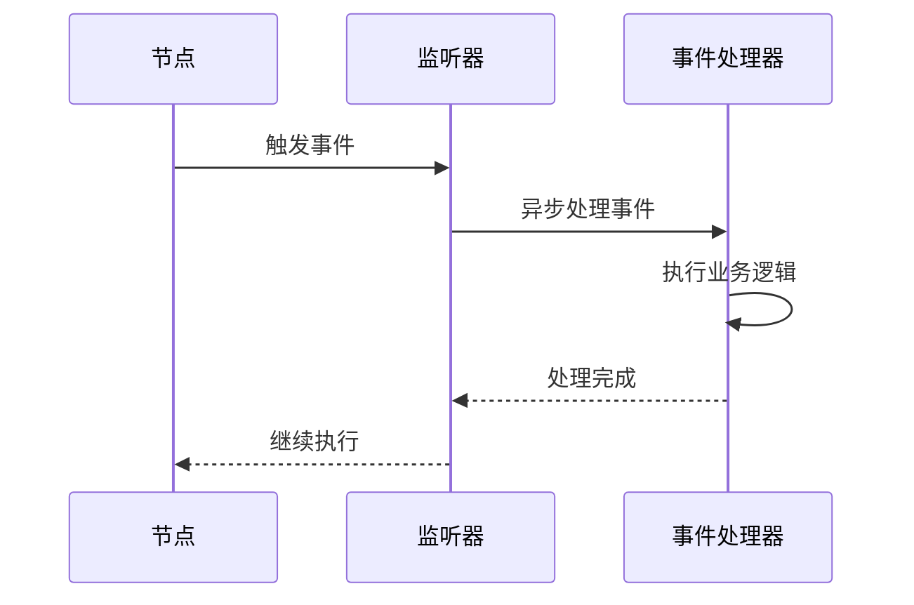
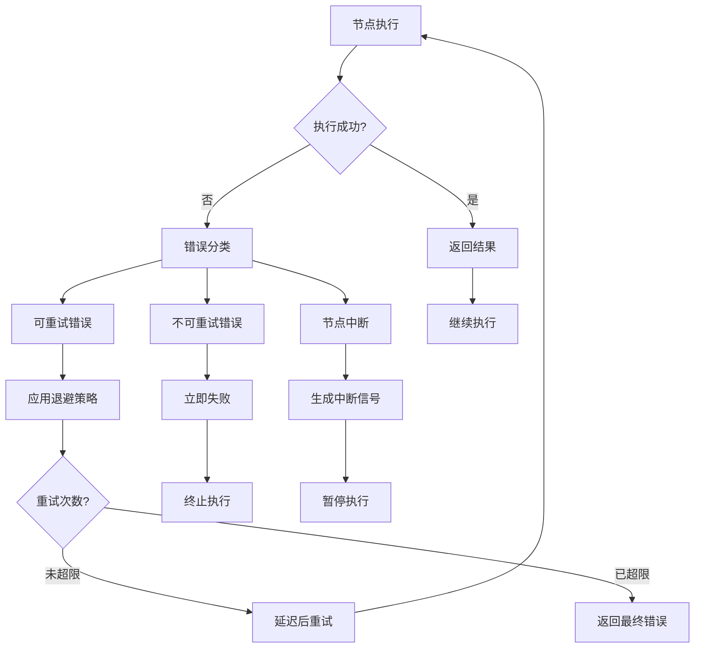
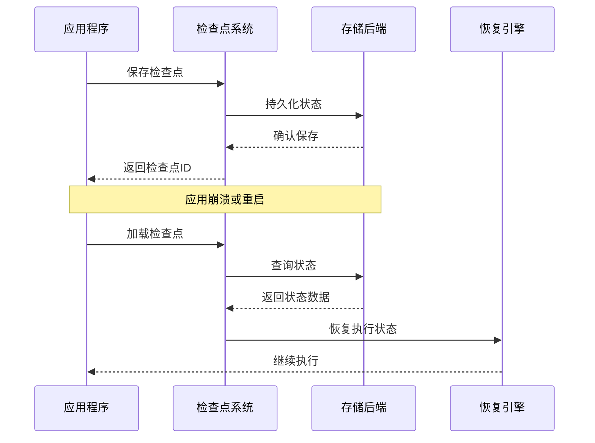
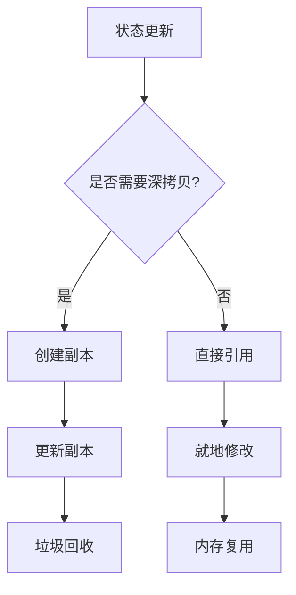

# 架构与设计

<cite>
**本文档中引用的文件**
- [README.md](file://README.md)
- [go.mod](file://go.mod)
- [graph/graph.go](file://graph/graph.go)
- [graph/state_graph.go](file://graph/state_graph.go)
- [graph/schema.go](file://graph/schema.go)
- [graph/checkpointing.go](file://graph/checkpointing.go)
- [graph/listeners.go](file://graph/listeners.go)
- [graph/tracing.go](file://graph/tracing.go)
- [graph/parallel.go](file://graph/parallel.go)
- [examples/state_schema/main.go](file://examples/state_schema/main.go)
- [examples/parallel_execution/main.go](file://examples/parallel_execution/main.go)
- [examples/checkpointing/main.go](file://examples/checkpointing/main.go)
- [examples/listeners/main.go](file://examples/listeners/main.go)
- [examples/streaming_modes/main.go](file://examples/streaming_modes/main.go)
</cite>

## 目录
1. [引言](#引言)
2. [项目结构概览](#项目结构概览)
3. [核心架构设计](#核心架构设计)
4. [状态管理系统](#状态管理系统)
5. [执行引擎](#执行引擎)
6. [并发与并行处理](#并发与并行处理)
7. [扩展性与插件化](#扩展性与插件化)
8. [可观测性系统](#可观测性系统)
9. [错误处理与恢复](#错误处理与恢复)
10. [性能优化策略](#性能优化策略)
11. [总结](#总结)

## 引言

langgraphgo 是一个功能强大的状态机驱动的工作流引擎，专为构建复杂的 AI 应用程序而设计。它采用了函数式编程范式和状态机模式，提供了高度可扩展的架构，支持并行执行、持久化、可观测性和人类在环（HITL）等高级特性。

该系统的核心设计理念是将工作流抽象为有向无环图（DAG），其中节点代表处理步骤，边定义执行顺序。这种设计使得复杂的应用逻辑能够以模块化、可测试的方式构建和维护。

## 项目结构概览

langgraphgo 采用模块化的项目结构，主要分为以下几个核心模块：

```mermaid
graph TB
subgraph "核心模块"
A[graph/] -- 核心引擎
B[checkpoint/] -- 持久化存储
C[prebuilt/] -- 预构建组件
D[tool/] -- 工具集成
end
subgraph "示例模块"
E[examples/] -- 使用示例
F[showcases/] -- 展示案例
end
A --> B
A --> C
A --> D
E --> A
F --> A
```

**图表来源**
- [graph/graph.go](file://graph/graph.go#L1-L50)
- [checkpoint/sqlite/sqlite.go](file://checkpoint/sqlite/sqlite.go)
- [prebuilt/react_agent.go](file://prebuilt/react_agent.go)

**章节来源**
- [README.md](file://README.md#L1-L184)
- [go.mod](file://go.mod#L1-L78)

## 核心架构设计

### 状态机模式与函数式编程

langgraphgo 采用状态机模式作为其核心架构基础，每个工作流都可以被建模为有限状态自动机。系统的设计哲学体现了函数式编程的核心原则：

```mermaid
classDiagram
class MessageGraph {
+nodes map[string]Node
+edges []Edge
+conditionalEdges map[string]func
+entryPoint string
+stateMerger StateMerger
+Schema StateSchema
+AddNode(name, fn)
+AddEdge(from, to)
+SetEntryPoint(name)
+Compile() Runnable
}
class Node {
+Name string
+Function func(ctx, state) (interface{}, error)
}
class Runnable {
+graph *MessageGraph
+tracer *Tracer
+Invoke(ctx, state) (interface{}, error)
+InvokeWithConfig(ctx, state, config) (interface{}, error)
}
class StateSchema {
<<interface>>
+Init() interface{}
+Update(current, new) (interface{}, error)
}
MessageGraph --> Node : contains
MessageGraph --> Runnable : compiles to
Runnable --> StateSchema : uses
```

**图表来源**
- [graph/graph.go](file://graph/graph.go#L52-L93)
- [graph/graph.go](file://graph/graph.go#L140-L172)
- [graph/schema.go](file://graph/schema.go#L12-L19)

### 图引擎架构

图引擎是系统的核心组件，负责协调整个执行流程：



**图表来源**
- [graph/graph.go](file://graph/graph.go#L174-L491)
- [graph/tracing.go](file://graph/tracing.go#L210-L286)

**章节来源**
- [graph/graph.go](file://graph/graph.go#L1-L492)
- [graph/state_graph.go](file://graph/state_graph.go#L1-L458)

## 状态管理系统

### Channels 和 Reducers 架构

langgraphgo 的状态管理基于 Channels 和 Reducers 的组合模式，这是系统状态管理的核心机制：

```mermaid
classDiagram
class StateSchema {
<<interface>>
+Init() interface{}
+Update(current, new) (interface{}, error)
}
class MapSchema {
+Reducers map[string]Reducer
+EphemeralKeys map[string]bool
+RegisterReducer(key, reducer)
+RegisterChannel(key, reducer, isEphemeral)
+Update(current, new) (interface{}, error)
+Cleanup(state) interface{}
}
class Reducer {
<<function>>
+func(current, new) (interface{}, error)
}
class CleaningStateSchema {
<<interface>>
+Cleanup(state) interface{}
}
StateSchema <|-- MapSchema
CleaningStateSchema --|> StateSchema
MapSchema --> Reducer : uses
```

**图表来源**
- [graph/schema.go](file://graph/schema.go#L12-L27)
- [graph/schema.go](file://graph/schema.go#L29-L102)

### 内置 Reducers 实现

系统提供了多种内置的 Reducer 函数，用于处理不同类型的状态更新：

| Reducer 类型 | 功能描述 | 使用场景 |
|-------------|----------|----------|
| `OverwriteReducer` | 替换旧值为新值 | 简单覆盖操作 |
| `AppendReducer` | 将新值追加到现有列表 | 日志记录、消息累积 |
| 自定义 Reducer | 用户定义的合并逻辑 | 特殊业务需求 |

### 临时通道（Ephemeral Channels）

临时通道允许在特定执行周期内保持某些状态值，然后自动清理：



**图表来源**
- [graph/schema.go](file://graph/schema.go#L102-L136)

**章节来源**
- [graph/schema.go](file://graph/schema.go#L1-L186)

## 执行引擎

### 核心执行循环

执行引擎实现了高效的并行执行循环，支持动态条件路由和命令式控制流：



**图表来源**
- [graph/graph.go](file://graph/graph.go#L224-L475)

### 条件边与动态路由

系统支持基于运行时状态的动态条件路由：



**图表来源**
- [graph/graph.go](file://graph/graph.go#L119-L123)

**章节来源**
- [graph/graph.go](file://graph/graph.go#L174-L491)

## 并发与并行处理

### 并行执行模型

langgraphgo 采用 Go 语言的 goroutine 原生支持，实现高效的并行执行：



**图表来源**
- [graph/graph.go](file://graph/graph.go#L250-L316)
- [graph/parallel.go](file://graph/parallel.go#L23-L82)

### Map-Reduce 模式

系统提供了完整的 Map-Reduce 执行模式支持：



**图表来源**
- [graph/parallel.go](file://graph/parallel.go#L101-L131)

**章节来源**
- [graph/parallel.go](file://graph/parallel.go#L1-L178)

## 扩展性与插件化

### 插件化架构

系统采用插件化设计，支持多种扩展点：

```mermaid
classDiagram
class CheckpointStore {
<<interface>>
+Save(ctx, checkpoint) error
+Load(ctx, id) (*Checkpoint, error)
+List(ctx, execID) ([]*Checkpoint, error)
+Delete(ctx, id) error
}
class NodeListener {
<<interface>>
+OnNodeEvent(ctx, event, name, state, err)
}
class TraceHook {
<<interface>>
+OnEvent(ctx, span)
}
class StateMerger {
+func(ctx, current, states) (interface{}, error)
}
class RetryPolicy {
+MaxRetries int
+BackoffStrategy BackoffStrategy
+RetryableErrors []string
}
```

**图表来源**
- [graph/checkpointing.go](file://graph/checkpointing.go#L22-L38)
- [graph/listeners.go](file://graph/listeners.go#L51-L55)
- [graph/tracing.go](file://graph/tracing.go#L70-L74)

### 数据存储后端

系统支持多种持久化存储后端：

| 存储类型 | 实现类 | 特点 | 适用场景 |
|---------|--------|------|----------|
| 内存存储 | `MemoryCheckpointStore` | 高性能，易配置 | 开发测试 |
| 文件存储 | `FileCheckpointStore` | 简单持久化 | 单机部署 |
| Redis | `RedisCheckpointStore` | 分布式，高性能 | 生产环境 |
| PostgreSQL | `PostgresCheckpointStore` | 关系型数据库，事务支持 | 企业级应用 |
| SQLite | `SqliteCheckpointStore` | 轻量级，嵌入式 | 边缘计算 |

**章节来源**
- [graph/checkpointing.go](file://graph/checkpointing.go#L1-L560)

## 可观测性系统

### 追踪与监控

系统内置了完整的可观测性框架：

```mermaid
classDiagram
class Tracer {
+hooks []TraceHook
+spans map[string]*TraceSpan
+AddHook(hook)
+StartSpan(ctx, event, nodeName) *TraceSpan
+EndSpan(ctx, span, state, err)
+TraceEdgeTraversal(ctx, from, to)
+GetSpans() map[string]*TraceSpan
}
class TraceSpan {
+ID string
+ParentID string
+Event TraceEvent
+NodeName string
+StartTime time.Time
+EndTime time.Time
+Duration time.Duration
+State interface{}
+Error error
+Metadata map[string]interface{}
}
class TraceHook {
<<interface>>
+OnEvent(ctx, span)
}
Tracer --> TraceSpan : creates
Tracer --> TraceHook : notifies
```

**图表来源**
- [graph/tracing.go](file://graph/tracing.go#L84-L102)
- [graph/tracing.go](file://graph/tracing.go#L31-L68)

### 事件监听系统

系统提供了灵活的事件监听机制：



**图表来源**
- [graph/listeners.go](file://graph/listeners.go#L128-L156)

**章节来源**
- [graph/tracing.go](file://graph/tracing.go#L1-L287)
- [graph/listeners.go](file://graph/listeners.go#L1-L335)

## 错误处理与恢复

### 分层错误处理

系统采用分层的错误处理策略：



**图表来源**
- [graph/state_graph.go](file://graph/state_graph.go#L299-L395)

### 检查点恢复机制

系统提供了完整的状态恢复机制：



**图表来源**
- [graph/checkpointing.go](file://graph/checkpointing.go#L230-L295)

**章节来源**
- [graph/state_graph.go](file://graph/state_graph.go#L299-L395)
- [graph/checkpointing.go](file://graph/checkpointing.go#L230-L295)

## 性能优化策略

### 并发优化

系统在多个层面实现了性能优化：

| 优化策略 | 实现方式 | 性能提升 |
|---------|----------|----------|
| Goroutine 并发 | 原生 goroutine 并行执行 | 显著提升吞吐量 |
| 状态合并优化 | 批量状态更新 | 减少内存分配 |
| 缓存机制 | 内存缓存常用数据 | 降低 I/O 开销 |
| 异步处理 | 异步事件通知 | 提升响应速度 |

### 内存管理

系统采用多种内存管理策略：



**章节来源**
- [graph/graph.go](file://graph/graph.go#L250-L316)
- [graph/schema.go](file://graph/schema.go#L62-L99)

## 总结

langgraphgo 通过其精心设计的架构，成功地将函数式编程范式与状态机模式相结合，构建了一个既强大又灵活的工作流引擎。其主要优势包括：

### 设计优势

1. **模块化架构**：清晰的职责分离，便于维护和扩展
2. **函数式编程**：纯函数设计，易于测试和推理
3. **状态管理**：灵活的 Channels 和 Reducers 模式
4. **并发支持**：原生 goroutine 支持，高效并行处理
5. **可观测性**：内置追踪、监听和监控能力
6. **可扩展性**：丰富的插件接口和扩展点

### 技术创新

- **状态机驱动**：将复杂业务逻辑抽象为状态转换
- **命令式控制流**：支持动态控制执行路径
- **持久化机制**：完整的检查点和恢复系统
- **人类在环**：支持人工干预和调试

### 应用价值

langgraphgo 为构建复杂的 AI 应用程序提供了坚实的基础，特别适用于：
- 多步骤的 AI 工作流
- 需要状态持久化的应用场景
- 对性能和可靠性要求较高的生产环境
- 需要实时监控和调试的开发场景

该架构不仅体现了现代软件工程的最佳实践，也为未来的功能扩展和技术演进奠定了良好的基础。