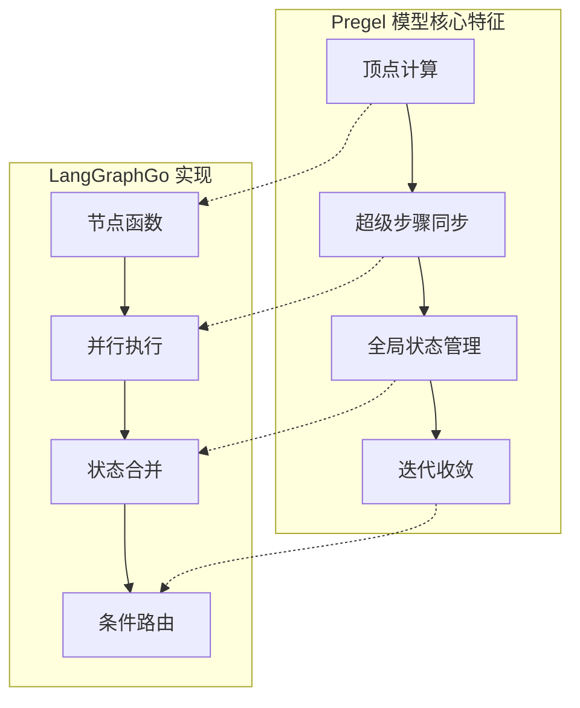
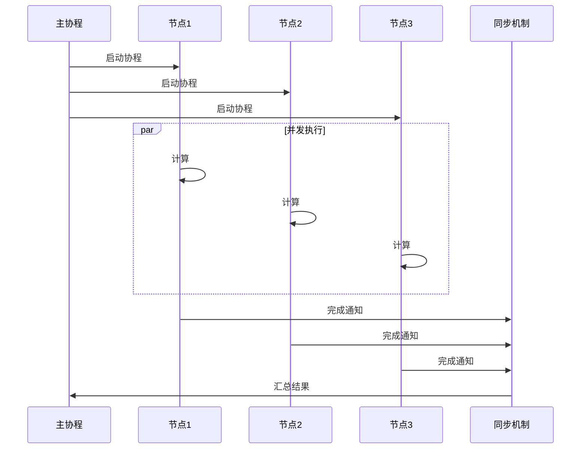
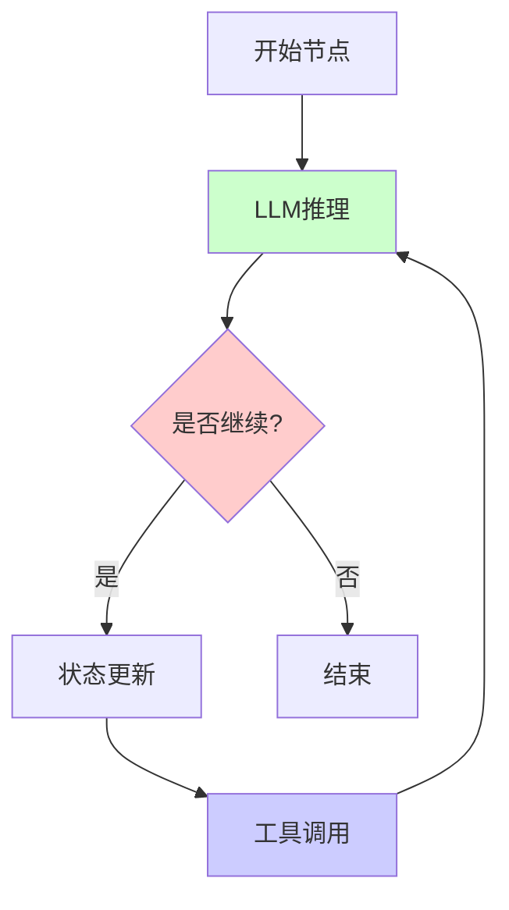
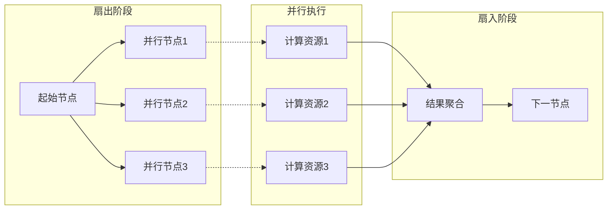
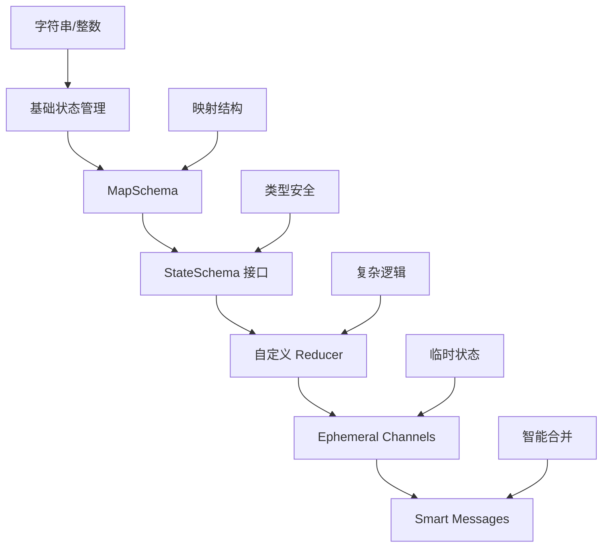
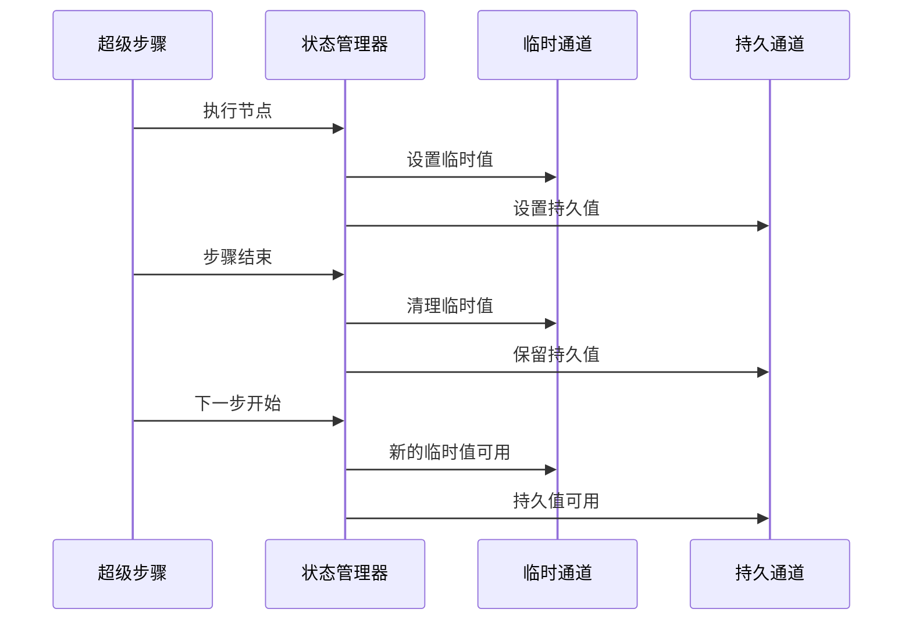
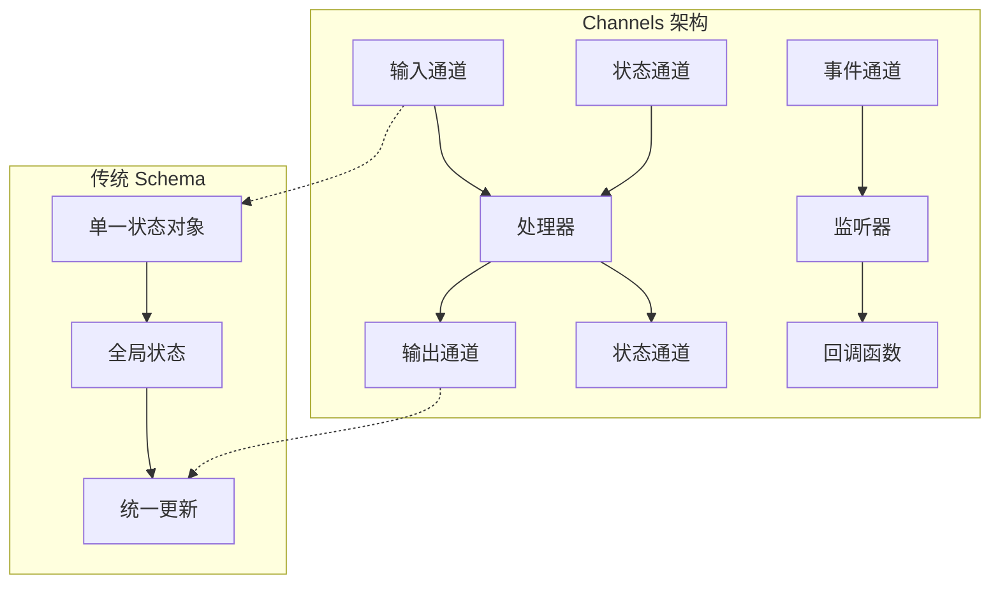
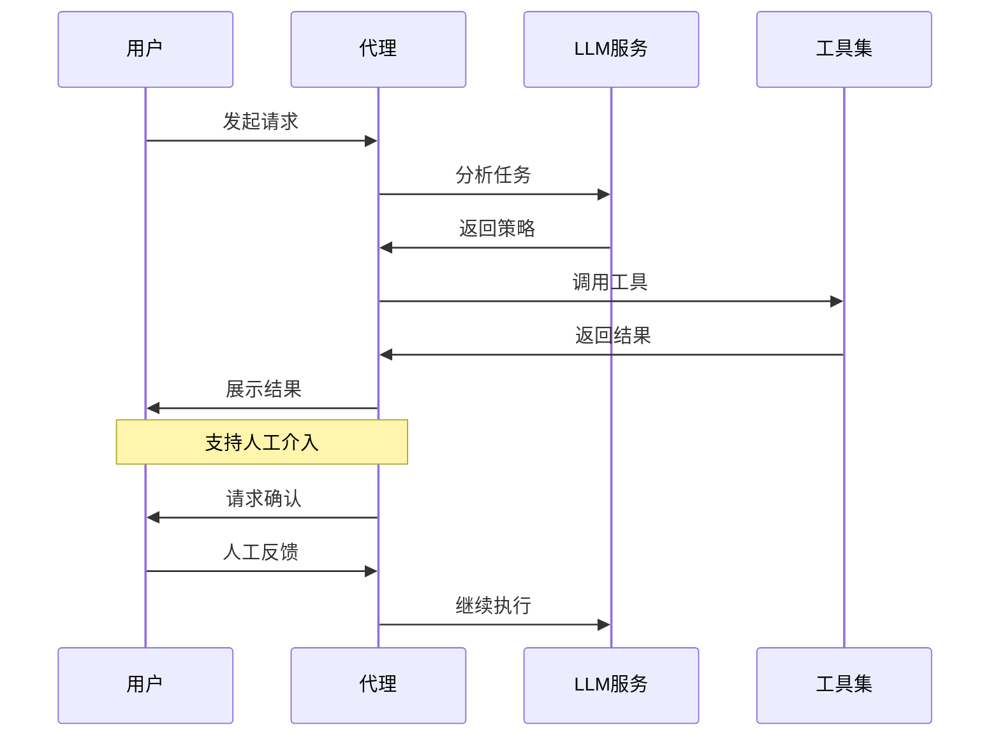

# 架构权衡与决策

<cite>
**本文档引用的文件**
- [README.md](file://README.md)
- [graph/graph.go](file://graph/graph.go)
- [graph/state_graph.go](file://graph/state_graph.go)
- [graph/schema.go](file://graph/schema.go)
- [graph/parallel.go](file://graph/parallel.go)
- [graph/context.go](file://graph/context.go)
- [graph/listeners.go](file://graph/listeners.go)
- [examples/basic_example/main.go](file://examples/basic_example/main.go)
- [examples/parallel_execution/main.go](file://examples/parallel_execution/main.go)
- [examples/README.md](file://examples/README.md)
- [examples/basic_llm/main.go](file://examples/basic_llm/main.go)
- [examples/rag_pipeline/main.go](file://examples/rag_pipeline/main.go)
- [CHANGELOG_CN.md](file://CHANGELOG_CN.md)
</cite>

## 目录
1. [引言](#引言)
2. [核心技术选型](#核心技术选型)
3. [Pregel 模型的架构优势](#pregel-模型的架构优势)
4. [并发执行模型分析](#并发执行模型分析)
5. [状态管理演进历程](#状态管理演进历程)
6. [Channels 架构的必要性](#channels-架构的必要性)
7. [与其他工作流引擎的对比](#与其他工作流引擎的对比)
8. [LLM 应用场景的独特定位](#llm-应用场景的独特定位)
9. [性能考量与优化策略](#性能考量与优化策略)
10. [总结](#总结)

## 引言

LangGraphGo 是一个专为大型语言模型（LLM）应用设计的工作流编排框架，其核心架构体现了在复杂分布式系统中平衡性能、可扩展性和易用性的深刻思考。本文档深入分析了该项目在关键技术选型背后的权衡决策，重点关注 Pregel 模型作为核心执行范式的合理性，以及从基础状态管理向 Channels 架构演进的技术演进路径。

## 核心技术选型

### Pregel 模型的选择

LangGraphGo 选择 Pregel 模型作为核心执行范式，这一决策体现了对现代分布式计算模式的深度理解和技术创新。



**图表来源**
- [graph/graph.go](file://graph/graph.go#L174-L492)
- [graph/state_graph.go](file://graph/state_graph.go#L115-L296)

#### 选择 Pregel 模型的优势

1. **循环图处理能力**
   - Pregel 模型天然支持循环依赖和反馈回路
   - 在 LLM 应用中，这种能力对于多轮对话和迭代推理至关重要

2. **状态一致性保证**
   - 通过超级步骤同步确保状态的一致性
   - 避免了传统消息队列中的竞态条件问题

3. **可扩展性设计**
   - 模块化的顶点设计便于水平扩展
   - 分布式执行的天然支持

#### 面临的挑战

1. **死锁检测**
   - 循环依赖可能导致无限执行
   - 需要智能的超时和中断机制

2. **状态膨胀**
   - 多步骤执行可能产生大量中间状态
   - 需要有效的状态清理和持久化策略

**章节来源**
- [graph/graph.go](file://graph/graph.go#L174-L296)
- [graph/state_graph.go](file://graph/state_graph.go#L115-L296)

### Go 协程并发模型

LangGraphGo 采用 Go 协程作为并发执行的基础，这一选择体现了对现代并发编程范式的深度理解。



**图表来源**
- [graph/graph.go](file://graph/graph.go#L249-L317)
- [graph/parallel.go](file://graph/parallel.go#L24-L82)

#### 性能特征分析

1. **轻量级并发**
   - Go 协程相比操作系统线程更加轻量
   - 初始栈大小小，按需增长

2. **高并发吞吐**
   - 支持数百万并发协程
   - 适合大规模并行工作负载

3. **通信开销低**
   - 使用通道进行协程间通信
   - 避免共享内存的竞争条件

#### 资源消耗考量

1. **内存占用**
   - 每个协程初始栈 2KB
   - 动态增长可能导致内存碎片

2. **调度开销**
   - Go 运行时需要维护协程调度表
   - 大量协程可能增加调度复杂度

**章节来源**
- [graph/graph.go](file://graph/graph.go#L249-L317)
- [graph/parallel.go](file://graph/parallel.go#L24-L82)

## Pregel 模型的架构优势

### 处理循环图的能力

Pregel 模型的核心优势在于其对循环图的天然支持，这在 LLM 应用中具有重要意义。



**图表来源**
- [examples/basic_llm/main.go](file://examples/basic_llm/main.go#L22-L36)
- [examples/rag_pipeline/main.go](file://examples/rag_pipeline/main.go#L32-L49)

#### 状态一致性保障

1. **超级步骤同步**
   - 每个超级步骤结束后进行状态合并
   - 确保所有节点看到一致的状态视图

2. **原子性操作**
   - 状态更新在单个步骤内完成
   - 避免部分更新导致的数据不一致

3. **错误恢复**
   - 失败节点可以重新执行而不影响其他节点
   - 支持增量计算和状态回滚

### 并发执行的挑战

尽管 Pregel 模型提供了强大的并发能力，但也带来了若干挑战：

1. **竞态条件**
   - 多个节点同时访问同一状态资源
   - 需要适当的同步机制

2. **死锁风险**
   - 循环依赖可能导致执行停滞
   - 需要超时和中断机制

3. **状态膨胀**
   - 多步骤执行产生大量中间状态
   - 需要有效的清理策略

**章节来源**
- [graph/graph.go](file://graph/graph.go#L249-L317)
- [graph/state_graph.go](file://graph/state_graph.go#L143-L166)

## 并发执行模型分析

### Go 协程的性能特征

LangGraphGo 的并发执行模型基于 Go 协程，这一选择体现了对现代并发编程范式的深度理解。

#### 线程安全的状态合并

```mermaid
classDiagram
class StateMerger {
+Merge(states []interface{}) interface{}
+validateState(state interface{}) error
+applyReducer(key string, current, new interface{}) interface{}
}
class MapSchema {
+Reducers map[string]Reducer
+EphemeralKeys map[string]bool
+Update(current, new interface{}) interface{}
+Cleanup(state interface{}) interface{}
}
class ParallelNode {
+nodes []Node
+Execute(ctx, state) interface{}
+collectResults(results chan) []interface{}
+handleErrors(errors []error) error
}
StateMerger --> MapSchema : uses
ParallelNode --> StateMerger : coordinates
```

**图表来源**
- [graph/schema.go](file://graph/schema.go#L8-L27)
- [graph/parallel.go](file://graph/parallel.go#L9-L21)

#### 同步机制设计

1. **WaitGroup 协调**
   - 确保所有并行节点完成后才继续
   - 防止数据竞争和未完成状态

2. **通道通信**
   - 使用带缓冲的通道传递结果
   - 支持异步结果收集

3. **错误传播**
   - 统一的错误处理机制
   - 支持部分失败和优雅降级

#### 竞态条件的缓解

1. **不可变状态**
   - 尽量使用不可变数据结构
   - 减少共享状态的修改

2. **读写分离**
   - 区分只读和写入操作
   - 使用互斥锁保护关键资源

3. **乐观并发控制**
   - 使用 CAS 操作处理冲突
   - 支持无锁的数据结构

**章节来源**
- [graph/graph.go](file://graph/graph.go#L249-L317)
- [graph/parallel.go](file://graph/parallel.go#L24-L82)

### 并发执行的性能优化

#### 扇出/扇入模式

LangGraphGo 实现了高效的扇出/扇入执行模式，支持多个节点并行执行后统一合并。



**图表来源**
- [examples/parallel_execution/main.go](file://examples/parallel_execution/main.go#L30-L49)
- [graph/parallel.go](file://graph/parallel.go#L155-L177)

#### 性能监控与调优

1. **执行时间统计**
   - 记录每个节点的执行时间
   - 识别性能瓶颈

2. **资源使用监控**
   - 监控内存和 CPU 使用情况
   - 动态调整并发度

3. **负载均衡**
   - 根据节点复杂度分配资源
   - 避免热点节点阻塞整个流程

**章节来源**
- [examples/parallel_execution/main.go](file://examples/parallel_execution/main.go#L1-L97)
- [graph/parallel.go](file://graph/parallel.go#L155-L177)

## 状态管理演进历程

### 从基础状态到 Schema 架构

LangGraphGo 的状态管理经历了从简单键值对到复杂 Schema 架构的演进过程。



**图表来源**
- [graph/schema.go](file://graph/schema.go#L29-L186)
- [examples/state_schema/README.md](file://examples/state_schema/README.md)

#### StateSchema 设计理念

1. **类型安全**
   - 明确的状态结构定义
   - 编译时类型检查

2. **灵活性**
   - 可插拔的 Reducer 系统
   - 支持复杂的状态更新逻辑

3. **可扩展性**
   - 渐进式增强
   - 向后兼容

#### Reducer 系统

LangGraphGo 提供了丰富的内置 Reducer 和灵活的自定义机制：

| Reducer 类型 | 用途 | 特点 |
|-------------|------|------|
| OverwriteReducer | 覆盖旧值 | 最简单直接 |
| AppendReducer | 追加元素 | 支持切片操作 |
| AddMessages | 智能消息合并 | 基于 ID 的 upsert |

**章节来源**
- [graph/schema.go](file://graph/schema.go#L140-L186)
- [examples/state_schema/README.md](file://examples/state_schema/README.md)

### Ephemeral Channels 的引入

临时通道（Ephemeral Channels）是 LangGraphGo 架构演进的重要里程碑。

#### 设计动机

1. **状态生命周期管理**
   - 区分持久状态和临时状态
   - 自动清理机制

2. **性能优化**
   - 减少不必要的状态持久化
   - 降低存储开销

3. **语义清晰**
   - 明确的状态用途划分
   - 减少状态污染

#### 实现机制



**图表来源**
- [graph/schema.go](file://graph/schema.go#L102-L137)
- [examples/ephemeral_channels/README.md](file://examples/ephemeral_channels/README.md)

**章节来源**
- [graph/schema.go](file://graph/schema.go#L102-L137)
- [examples/ephemeral_channels/README.md](file://examples/ephemeral_channels/README.md)

## Channels 架构的必要性

### 从 Schema 到 Channels 的演进

Channels 架构代表了 LangGraphGo 在状态管理方面的重大演进，为复杂的代理工作流提供了必要的基础设施。

#### 演进驱动力

1. **复杂状态建模需求**
   - 多个独立状态流的需求
   - 不同状态之间的隔离

2. **并发访问控制**
   - 多个节点同时访问不同状态
   - 避免状态竞争

3. **流式处理支持**
   - 实时数据流处理
   - 边缘触发的响应

#### Channels 架构特点



**图表来源**
- [examples/state_schema/README.md](file://examples/state_schema/README.md)
- [examples/ephemeral_channels/README.md](file://examples/ephemeral_channels/README.md)

### 对 API 兼容性的影响

#### 向后兼容策略

1. **渐进式迁移**
   - 新功能向后兼容旧 API
   - 渐进式采用新特性

2. **平滑过渡**
   - 提供迁移指南
   - 保持核心概念一致性

#### 学习曲线分析

1. **初学者友好**
   - 简单场景使用原有 API
   - 渐进式学习复杂特性

2. **专家级功能**
   - 高级用户可利用新特性
   - 灵活的架构定制

**章节来源**
- [examples/state_schema/README.md](file://examples/state_schema/README.md)
- [examples/ephemeral_channels/README.md](file://examples/ephemeral_channels/README.md)

## 与其他工作流引擎的对比

### 与 Temporal 的对比

| 特性 | LangGraphGo | Temporal |
|------|-------------|----------|
| 核心模型 | Pregel 模型 | 基于活动的工作流 |
| 并发模型 | Go 协程 | 线程池 |
| 状态管理 | Channels/Schemas | 原子操作 |
| 错误处理 | 节点级中断 | 工作流级补偿 |
| LLM 集成 | 原生支持 | 第三方集成 |

#### 设计差异分析

1. **执行模型**
   - LangGraphGo 更适合循环图和迭代推理
   - Temporal 更适合长时间运行的业务流程

2. **状态管理**
   - LangGraphGo 提供细粒度的状态控制
   - Temporal 提供事务级别的状态保证

3. **并发处理**
   - LangGraphGo 利用 Go 协程的轻量级并发
   - Temporal 使用传统的线程模型

### 与 Cadence 的对比

Cadence 是 Uber 开发的工作流引擎，与 LangGraphGo 在某些方面有相似之处：

1. **相似点**
   - 都支持长时间运行的工作流
   - 都提供可靠的状态持久化
   - 都支持复杂的错误处理

2. **差异点**
   - LangGraphGo 更专注于 LLM 应用
   - Cadence 更通用的工作流平台
   - LangGraphGo 提供更简洁的 API

**章节来源**
- [examples/README.md](file://examples/README.md)

## LLM 应用场景的独特定位

### LangGraphGo 在 LLM 生态中的角色

LangGraphGo 专门为 LLM 应用场景设计，在以下几个方面具有独特优势：

#### 人机协作工作流



**图表来源**
- [examples/human_in_the_loop/README.md](file://examples/human_in_the_loop/README.md)
- [examples/time_travel/README.md](file://examples/time_travel/README.md)

#### 多模态处理能力

1. **文本处理**
   - 对话管理
   - 文档生成
   - 代码编写

2. **多媒体支持**
   - 图像理解
   - 音频处理
   - 视频分析

3. **工具集成**
   - 搜索引擎
   - 数据库查询
   - API 调用

#### 实时交互支持

1. **流式响应**
   - 实时进度更新
   - 逐步结果展示
   - 动态内容生成

2. **状态感知**
   - 上下文保持
   - 会话管理
   - 上下文压缩

**章节来源**
- [examples/basic_llm/main.go](file://examples/basic_llm/main.go#L1-L59)
- [examples/rag_pipeline/main.go](file://examples/rag_pipeline/main.go#L1-L50)

### 与其他 LLM 工作流框架的比较

| 框架 | 优势 | 适用场景 | LangGraphGo 定位 |
|------|------|----------|------------------|
| LangGraph | Python 生态完善 | 研究和原型开发 | Go 生态高性能 |
| LlamaIndex | 文档处理专长 | RAG 应用 | 通用工作流编排 |
| AutoGen | 多代理协作 | 团队协作场景 | 企业级工作流 |
| LangGraphGo | 并发性能优异 | 高并发 LLM 应用 | 生产级 LLM 工作流 |

**章节来源**
- [examples/README.md](file://examples/README.md)

## 性能考量与优化策略

### 并发执行的性能优化

#### Go 协程池管理

1. **动态调整**
   - 根据负载动态调整协程数量
   - 避免资源浪费和过度竞争

2. **优先级调度**
   - 重要节点优先执行
   - 关键路径加速

3. **资源限制**
   - 设置最大并发度
   - 防止系统过载

#### 状态访问优化

1. **读写分离**
   - 读多写少场景优化
   - 使用读写锁

2. **缓存策略**
   - 热点数据缓存
   - 智能预取

3. **批量操作**
   - 批量状态更新
   - 减少同步开销

### 内存管理优化

#### 垃圾回收优化

1. **对象池化**
   - 重用频繁创建的对象
   - 减少 GC 压力

2. **内存预分配**
   - 预估内存需求
   - 减少动态分配

3. **及时释放**
   - 及时释放不需要的资源
   - 避免内存泄漏

#### 状态持久化优化

1. **增量保存**
   - 只保存变化的部分
   - 减少 I/O 开销

2. **压缩存储**
   - 压缩状态数据
   - 节省存储空间

3. **异步写入**
   - 异步状态持久化
   - 提高响应速度

**章节来源**
- [graph/graph.go](file://graph/graph.go#L249-L317)
- [examples/parallel_execution/main.go](file://examples/parallel_execution/main.go#L1-L97)

## 总结

LangGraphGo 的架构设计体现了在复杂分布式系统中平衡性能、可扩展性和易用性的深刻思考。通过选择 Pregel 模型作为核心执行范式，LangGraphGo 成功解决了循环图处理和状态一致性等关键挑战。Go 协程并发模型的采用进一步提升了系统的性能表现，而从基础状态管理到 Channels 架构的演进则为复杂的 LLM 应用提供了必要的基础设施。

与其他工作流引擎相比，LangGraphGo 在 LLM 应用场景下具有独特的优势，特别是在人机协作、实时交互和多模态处理方面。虽然在 API 兼容性和学习曲线方面存在一定的挑战，但其提供的强大功能和优秀的性能表现使其成为生产级 LLM 工作流的理想选择。

未来的发展方向包括：
1. 进一步优化并发执行性能
2. 增强对复杂状态管理的支持
3. 扩展多模态处理能力
4. 提升开发体验和工具链

LangGraphGo 的成功证明了在特定应用场景下，精心设计的架构能够带来显著的性能提升和用户体验改善，为类似系统的设计提供了宝贵的参考经验。