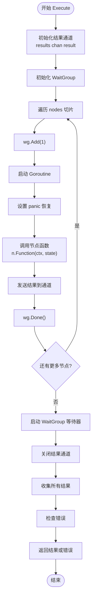

# 协程管理

<cite>
**本文档中引用的文件**
- [parallel.go](file://graph/parallel.go)
- [parallel_test.go](file://graph/parallel_test.go)
- [main.go](file://examples/parallel_execution/main.go)
- [parallel_execution_test.go](file://graph/parallel_execution_test.go)
- [retry.go](file://graph/retry.go)
- [context.go](file://graph/context.go)
</cite>

## 目录
1. [简介](#简介)
2. [核心架构概述](#核心架构概述)
3. [ParallelNode 结构与设计](#parallelnode-结构与设计)
4. [AddParallelNodes 方法详解](#addparallelnodes-方法详解)
5. [FanOutFanIn 模式实现](#fanoutfanin-模式实现)
6. [ParallelNode.Execute 协程管理](#parallelnodeexecute-协程管理)
7. [sync.WaitGroup 协调机制](#syncwaitgroup-协调机制)
8. [带缓冲通道的结果收集](#带缓冲通道的结果收集)
9. [panic 恢复机制](#panic-恢复机制)
10. [上下文取消与超时处理](#上下文取消与超时处理)
11. [性能优化与最佳实践](#性能优化与最佳实践)
12. [故障排除指南](#故障排除指南)
13. [总结](#总结)

## 简介

langgraphgo 的并发执行模型是其核心特性之一，通过精心设计的 Go 协程管理系统，实现了高效、可靠的并行节点执行。该系统基于 Go 语言的并发原语，提供了完整的错误处理、资源管理和生命周期控制机制。

本文档深入分析了 langgraphgo 中的协程管理机制，重点解释 `AddParallelNodes` 和 `FanOutFanIn` 方法如何创建并行节点组，以及 `ParallelNode.Execute` 方法如何为每个节点函数启动独立的 Go 协程。同时详细说明了 `sync.WaitGroup` 在协调多个协程生命周期中的关键作用，以及如何通过带缓冲的 channel (`results`) 安全地收集所有协程的执行结果。

## 核心架构概述

langgraphgo 的并发执行模型采用分层架构设计，主要包含以下核心组件：


**图表来源**
- [parallel.go](file://graph/parallel.go#L9-L13)
- [parallel.go](file://graph/parallel.go#L23-L82)

## ParallelNode 结构与设计

`ParallelNode` 是 langgraphgo 并发执行的核心数据结构，它封装了一组可以并行执行的节点：

```mermaid
classDiagram
class ParallelNode {
+[]Node nodes
+string name
+Execute(ctx, state) (interface{}, error)
}
class Node {
+string Name
+Function func(context.Context, interface{}) (interface{}, error)
}
class MessageGraph {
+AddParallelNodes(groupName, nodes)
+FanOutFanIn(source, collector, workerFuncs, collectFunc)
+AddNode(name, function)
}
ParallelNode --> Node : "包含多个"
MessageGraph --> ParallelNode : "创建并添加"
```

**图表来源**
- [parallel.go](file://graph/parallel.go#L9-L13)
- [parallel.go](file://graph/parallel.go#L15-L21)

**节来源**
- [parallel.go](file://graph/parallel.go#L9-L21)

## AddParallelNodes 方法详解

`AddParallelNodes` 方法是创建并行节点组的主要入口点，它将一组独立的节点函数转换为一个可并行执行的 `ParallelNode` 实例：

### 方法流程分析


**图表来源**
- [parallel.go](file://graph/parallel.go#L85-L98)

### 关键实现细节

该方法的核心逻辑包括：

1. **节点映射转换**：将 `map[string]func` 转换为 `[]Node` 数组
2. **ParallelNode 创建**：使用 `NewParallelNode` 构造函数初始化实例
3. **图集成**：通过 `AddNode` 方法将并行节点注册到消息图中

**节来源**
- [parallel.go](file://graph/parallel.go#L85-L98)

## FanOutFanIn 模式实现

`FanOutFanIn` 方法实现了经典的扇出-扇入并行处理模式，它将一个源节点的输入分发给多个工作节点，然后将结果聚合到收集器节点：

### 执行流程图


**图表来源**
- [parallel.go](file://graph/parallel.go#L154-L176)

### 实现特点

1. **自动并行化**：源节点到工作节点组的连接自动触发并行执行
2. **结果聚合**：收集器节点负责将并行结果合并
3. **类型安全**：通过泛型约束确保状态类型的一致性

**节来源**
- [parallel.go](file://graph/parallel.go#L154-L176)

## ParallelNode.Execute 协程管理

`ParallelNode.Execute` 方法是并发执行的核心实现，它为每个节点函数启动独立的 Go 协程，并协调它们的生命周期：

### 协程启动流程



**图表来源**
- [parallel.go](file://graph/parallel.go#L23-L82)

### 关键实现机制

1. **协程隔离**：每个节点在独立的 goroutine 中执行
2. **资源计数**：使用 `sync.WaitGroup` 精确跟踪活跃协程数量
3. **结果收集**：通过带缓冲通道安全收集所有执行结果

**节来源**
- [parallel.go](file://graph/parallel.go#L23-L82)

## sync.WaitGroup 协调机制

`sync.WaitGroup` 在 langgraphgo 的并发执行模型中扮演着至关重要的角色，它提供了精确的协程生命周期管理：

### WaitGroup 使用模式

```mermaid
graph LR
subgraph "WaitGroup 生命周期"
Init[初始化 WaitGroup]
Add[Add(n) 增加计数器]
Done[Done() 减少计数器]
Wait[Wait() 阻塞等待]
end
subgraph "在 ParallelNode 中的应用"
PN_Init[PN.Execute 开始]
PN_Add[为每个节点 wg.Add(1)]
PN_Done[节点完成 wg.Done]
PN_Wait[启动后台 WaitGroup 等待]
end
Init --> PN_Init
Add --> PN_Add
Done --> PN_Done
Wait --> PN_Wait
```

**图表来源**
- [parallel.go](file://graph/parallel.go#L32-L63)

### 协调机制详解

1. **计数器管理**：每个启动的 goroutine 都会增加 WaitGroup 计数器
2. **同步屏障**：主 goroutine 可以通过 `wg.Wait()` 等待所有子协程完成
3. **非阻塞检查**：WaitGroup 提供了精确的完成状态检查能力

**节来源**
- [parallel.go](file://graph/parallel.go#L32-L63)

## 带缓冲通道的结果收集

langgraphgo 使用带缓冲的通道来安全地收集并行协程的执行结果，这种设计提供了良好的性能和可靠性保证：

### 通道设计模式

```mermaid
graph TB
subgraph "结果通道设计"
Buffer[带缓冲通道<br/>results chan result]
Size[缓冲区大小 = 节点数量]
Type[result 结构体]
end
subgraph "result 结构体"
Index[int index]
Value[interface{} value]
Error[error err]
end
subgraph "收集机制"
Sender[发送者 goroutine]
Receiver[接收者主 goroutine]
Order[保持执行顺序]
end
Buffer --> Size
Buffer --> Type
Type --> Index
Type --> Value
Type --> Error
Buffer --> Sender
Buffer --> Receiver
Receiver --> Order
```

**图表来源**
- [parallel.go](file://graph/parallel.go#L25-L30)
- [parallel.go](file://graph/parallel.go#L31-L31)

### 通道优势分析

1. **背压保护**：缓冲区防止快速执行的节点阻塞慢速节点
2. **顺序保持**：通过索引字段维护原始执行顺序
3. **内存效率**：缓冲区大小等于节点数量，避免过度分配

**节来源**
- [parallel.go](file://graph/parallel.go#L25-L31)

## panic 恢复机制

langgraphgo 实现了完善的 panic 恢复机制，确保单个节点的崩溃不会导致整个图执行中断：

### Panic 恢复流程


**图表来源**
- [parallel.go](file://graph/parallel.go#L38-L48)

### 恢复策略详解

1. **延迟恢复**：使用 `defer` 确保 panic 捕获的可靠性
2. **错误包装**：将 panic 包装为标准错误格式
3. **信息保留**：保留原始 panic 值用于调试
4. **优雅降级**：即使发生 panic，其他节点仍能正常执行

**节来源**
- [parallel.go](file://graph/parallel.go#L38-L48)

## 上下文取消与超时处理

langgraphgo 的并发执行模型完全支持 Go 语言的上下文取消机制，提供了细粒度的执行控制：

### 上下文传播机制


**图表来源**
- [parallel_test.go](file://graph/parallel_test.go#L214-L263)

### 取消处理策略

1. **选择性检查**：在关键位置检查 `ctx.Done()`
2. **优雅退出**：检测到取消后立即返回，不进行额外计算
3. **资源清理**：通过 defer 确保资源正确释放

**节来源**
- [parallel_test.go](file://graph/parallel_test.go#L214-L263)

## 性能优化与最佳实践

基于对 langgraphgo 并发执行模型的深入分析，以下是推荐的最佳实践：

### 性能优化策略

| 优化方面 | 推荐做法 | 原因 |
|---------|---------|------|
| 协程数量控制 | 避免创建过多并行节点 | 过多协程会导致调度开销增加 |
| 通道缓冲区大小 | 设置合理的缓冲区大小 | 平衡内存使用和性能 |
| 错误处理优化 | 使用批量错误检查 | 减少循环中的错误判断次数 |
| 上下文传播 | 及时检查上下文状态 | 确保及时响应取消信号 |

### 内存管理建议

1. **结果缓存**：合理使用带缓冲通道避免频繁的内存分配
2. **panic 防护**：始终使用 recover 机制防止内存泄漏
3. **资源清理**：确保所有资源在协程退出时正确释放

### 调试和监控

1. **日志记录**：在关键节点添加详细的执行日志
2. **性能指标**：监控协程启动和完成时间
3. **错误统计**：跟踪 panic 和超时发生的频率

## 故障排除指南

### 常见问题及解决方案

| 问题类型 | 症状 | 解决方案 |
|---------|------|---------|
| 协程泄漏 | 内存持续增长 | 检查 WaitGroup 是否正确使用 |
| 死锁 | 程序卡死 | 分析通道阻塞和上下文取消逻辑 |
| 结果丢失 | 部分节点未执行 | 验证通道缓冲区大小和超时设置 |
| panic 异常 | 程序崩溃 | 检查节点函数的错误处理逻辑 |

### 调试技巧

1. **启用详细日志**：在测试环境中开启详细的执行日志
2. **使用测试工具**：利用 Go 的 race detector 检测并发问题
3. **压力测试**：通过基准测试验证并发性能

**节来源**
- [parallel_test.go](file://graph/parallel_test.go#L1-L361)

## 总结

langgraphgo 的并发执行模型展现了 Go 语言并发编程的最佳实践。通过巧妙地结合 `sync.WaitGroup`、带缓冲通道和 panic 恢复机制，该系统实现了：

1. **高并发性能**：支持大量并行节点的同时执行
2. **强健的错误处理**：单个节点失败不影响整体执行
3. **灵活的控制机制**：完整的上下文取消和超时支持
4. **优雅的资源管理**：精确的协程生命周期控制

这种设计不仅保证了系统的可靠性和性能，还为开发者提供了简洁而强大的并行编程接口。理解这些底层机制对于有效使用 langgraphgo 进行复杂的工作流编排至关重要。