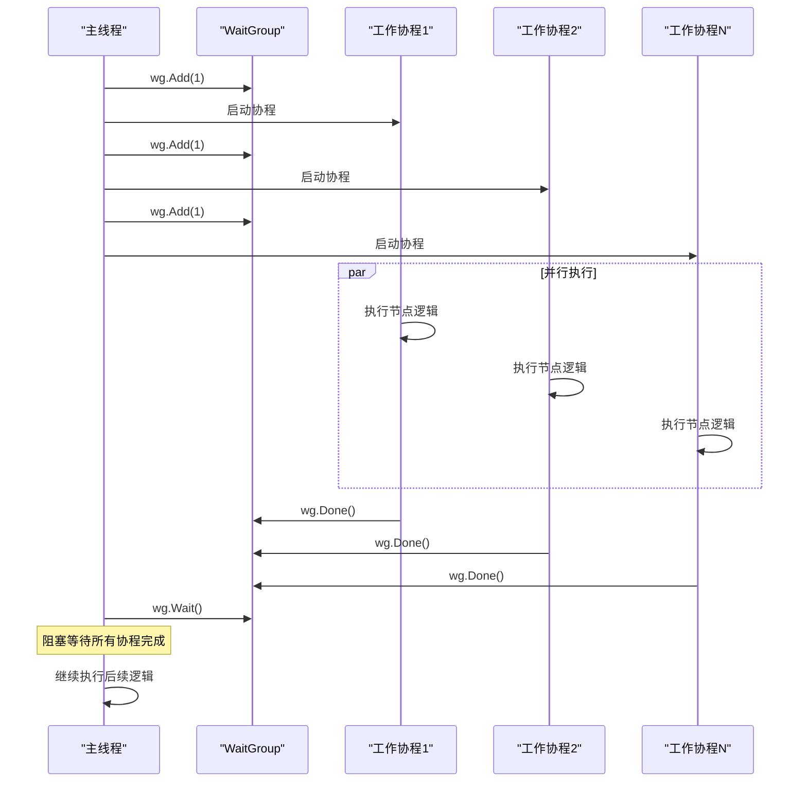
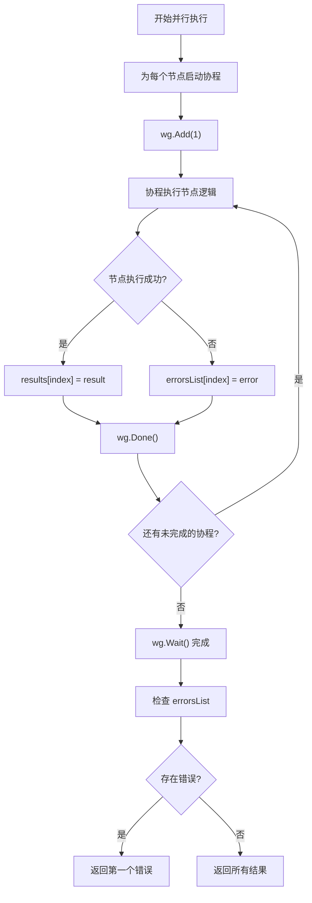
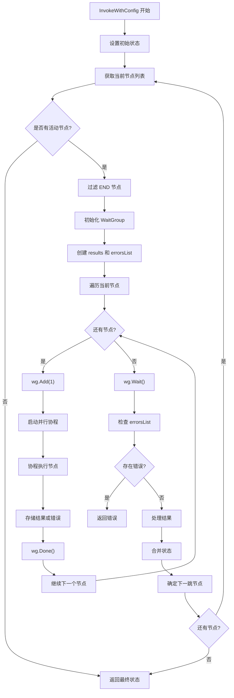
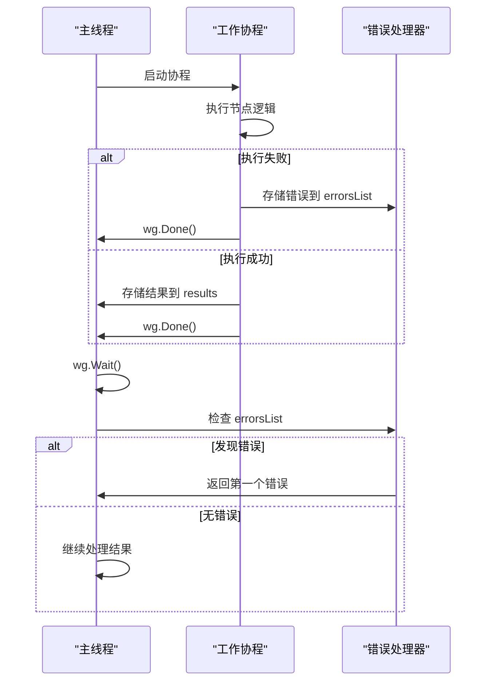

# 同步机制

<cite>
**本文档引用的文件**
- [state_graph.go](file://graph/state_graph.go)
- [graph.go](file://graph/graph.go)
- [parallel.go](file://graph/parallel.go)
- [parallel_test.go](file://graph/parallel_test.go)
- [parallel_execution_test.go](file://graph/parallel_execution_test.go)
- [state_graph_test.go](file://graph/state_graph_test.go)
</cite>

## 目录
1. [简介](#简介)
2. [核心同步组件](#核心同步组件)
3. [WaitGroup 在并发执行中的应用](#waitgroup-在并发执行中的应用)
4. [共享数据结构设计](#共享数据结构设计)
5. [详细执行流程分析](#详细执行流程分析)
6. [错误处理机制](#错误处理机制)
7. [性能优化考虑](#性能优化考虑)
8. [最佳实践指南](#最佳实践指南)
9. [故障排除](#故障排除)
10. [总结](#总结)

## 简介

langgraphgo 是一个基于 Go 语言的图式执行引擎，其并发执行机制的核心在于使用 `sync.WaitGroup` 来协调并行节点的执行。本文档深入分析了在 `graph.InvokeWithConfig` 和 `StateRunnable.InvokeWithConfig` 方法中，如何通过 `sync.WaitGroup` 实现高效的并行任务同步，确保所有并行任务完成后再继续执行后续逻辑。

## 核心同步组件

### WaitGroup 的作用域

在 langgraphgo 中，`sync.WaitGroup` 主要用于以下场景：

1. **并行节点执行同步**：确保所有并行节点完成后再继续
2. **资源管理**：跟踪正在运行的协程数量
3. **阻塞等待**：主线程等待所有子协程完成

### 数据结构组织

```mermaid
classDiagram
class StateRunnable {
+graph *StateGraph
+InvokeWithConfig(ctx, state, config) (interface{}, error)
+executeNodeWithRetry(ctx, node, state) (interface{}, error)
}
class Runnable {
+graph *MessageGraph
+tracer *Tracer
+InvokeWithConfig(ctx, state, config) (interface{}, error)
}
class ParallelNode {
+nodes []Node
+name string
+Execute(ctx, state) (interface{}, error)
}
StateRunnable --> StateGraph : "使用"
Runnable --> MessageGraph : "使用"
ParallelNode --> Node : "包含"
note for StateRunnable "在 InvokeWithConfig 中使用 WaitGroup<br/>同步并行节点执行"
note for Runnable "在 InvokeWithConfig 中使用 WaitGroup<br/>同步并行节点执行"
note for ParallelNode "独立的并行执行单元<br/>使用 WaitGroup 管理协程"
```

**图表来源**
- [state_graph.go](file://graph/state_graph.go#L115-L296)
- [graph.go](file://graph/graph.go#L181-L490)
- [parallel.go](file://graph/parallel.go#L23-L82)

## WaitGroup 在并发执行中的应用

### 基本使用模式

在 langgraphgo 的核心方法中，WaitGroup 的使用遵循以下标准模式：



**图表来源**
- [state_graph.go](file://graph/state_graph.go#L143-L167)
- [graph.go](file://graph/graph.go#L249-L317)

### 具体实现分析

#### StateRunnable.InvokeWithConfig 中的 WaitGroup 使用

在 `StateRunnable.InvokeWithConfig` 方法中，WaitGroup 的使用位置如下：

1. **初始化阶段**：
   ```go
   var wg sync.WaitGroup
   results := make([]interface{}, len(currentNodes))
   errorsList := make([]error, len(currentNodes))
   ```

2. **启动并行协程**：
   ```go
   wg.Add(1)
   go func(index int, n Node, name string) {
       defer wg.Done()
       // 节点执行逻辑
   }(i, node, nodeName)
   ```

3. **等待所有协程完成**：
   ```go
   wg.Wait()
   ```

#### Runnable.InvokeWithConfig 中的 WaitGroup 使用

在 `Runnable.InvokeWithConfig` 方法中，WaitGroup 的使用模式相同，但包含了额外的追踪和回调功能。

**章节来源**
- [state_graph.go](file://graph/state_graph.go#L143-L167)
- [graph.go](file://graph/graph.go#L249-L317)

## 共享数据结构设计

### 结果收集机制

langgraphgo 使用两个关键切片作为共享数据结构：

#### results 切片
- **用途**：存储每个并行节点的执行结果
- **类型**：`[]interface{}`
- **索引对应**：与 `currentNodes` 数组的索引一一对应
- **线程安全**：通过协程索引保证访问安全性

#### errorsList 切片  
- **用途**：存储每个并行节点的错误信息
- **类型**：`[]error`
- **索引对应**：与 `currentNodes` 数组的索引一一对应
- **错误聚合**：所有错误在 `wg.Wait()` 后统一检查

### 数据流图



**图表来源**
- [state_graph.go](file://graph/state_graph.go#L144-L175)
- [graph.go](file://graph/graph.go#L250-L318)

**章节来源**
- [state_graph.go](file://graph/state_graph.go#L144-L175)
- [graph.go](file://graph/graph.go#L250-L318)

## 详细执行流程分析

### StateRunnable 执行流程



**图表来源**
- [state_graph.go](file://graph/state_graph.go#L120-L296)

### Runnable 执行流程

Runnable 的执行流程与 StateRunnable 类似，但增加了更多的追踪和回调功能：

1. **配置注入**：将配置信息注入到上下文中
2. **回调通知**：在关键节点调用回调函数
3. **追踪记录**：记录每个节点的执行时间和状态
4. **中断处理**：支持在特定节点前或后中断执行

**章节来源**
- [state_graph.go](file://graph/state_graph.go#L120-L296)
- [graph.go](file://graph/graph.go#L181-L490)

## 错误处理机制

### 错误收集策略

langgraphgo 实现了多层次的错误处理机制：

#### 协程级错误处理
```go
// 在协程内部捕获错误
res, err := r.executeNodeWithRetry(ctx, n, state)
if err != nil {
    errorsList[index] = fmt.Errorf("error in node %s: %w", name, err)
    return
}
results[index] = res
```

#### 主线程错误检查
```go
// 检查所有错误
for _, err := range errorsList {
    if err != nil {
        return nil, err
    }
}
```

### 错误传播机制



**图表来源**
- [state_graph.go](file://graph/state_graph.go#L160-L174)
- [graph.go](file://graph/graph.go#L291-L340)

**章节来源**
- [state_graph.go](file://graph/state_graph.go#L160-L174)
- [graph.go](file://graph/graph.go#L291-L340)

## 性能优化考虑

### 协程池 vs 独立协程

langgraphgo 采用独立协程模式而非协程池模式，这种设计的优势包括：

1. **简单性**：无需复杂的协程池管理逻辑
2. **可预测性**：每个节点都有独立的执行环境
3. **资源隔离**：单个节点的失败不会影响其他节点

### 内存使用优化

1. **切片预分配**：预先分配 `results` 和 `errorsList` 切片，避免动态扩容
2. **零拷贝传递**：直接传递接口值，减少内存复制
3. **及时清理**：在协程完成后立即释放相关资源

### 并发度控制

虽然当前实现没有显式的并发度限制，但在实际应用中可以通过以下方式控制：

```go
// 示例：限制并发度的包装器
func limitedParallelExec(nodes []Node, maxConcurrency int) {
    sem := make(chan struct{}, maxConcurrency)
    var wg sync.WaitGroup
    
    for _, node := range nodes {
        wg.Add(1)
        sem <- struct{}{} // 获取信号量
        go func(n Node) {
            defer wg.Done()
            defer func() { <-sem }() // 释放信号量
            // 执行节点逻辑
        }(node)
    }
    
    wg.Wait()
}
```

## 最佳实践指南

### 使用建议

1. **合理设置并发度**：
   - 根据系统资源调整并行节点数量
   - 避免过度并发导致资源竞争

2. **错误处理策略**：
   - 及时检查 `errorsList` 中的错误
   - 考虑实现部分失败继续执行的逻辑

3. **资源管理**：
   - 确保每个协程都能正确调用 `wg.Done()`
   - 避免协程泄漏导致的死锁

4. **监控和调试**：
   - 使用追踪功能监控执行过程
   - 记录关键节点的执行时间

### 代码示例模式

```go
// 推荐的并行执行模式
func parallelExecute(nodes []Node) ([]interface{}, error) {
    var wg sync.WaitGroup
    results := make([]interface{}, len(nodes))
    errorsList := make([]error, len(nodes))
    
    for i, node := range nodes {
        wg.Add(1)
        go func(index int, n Node) {
            defer wg.Done()
            result, err := executeNode(n)
            if err != nil {
                errorsList[index] = err
                return
            }
            results[index] = result
        }(i, node)
    }
    
    wg.Wait()
    
    // 检查错误
    for _, err := range errorsList {
        if err != nil {
            return nil, err
        }
    }
    
    return results, nil
}
```

## 故障排除

### 常见问题及解决方案

#### 死锁问题
**症状**：程序卡在 `wg.Wait()` 处
**原因**：某些协程未能调用 `wg.Done()`
**解决方案**：
1. 检查所有退出路径都包含 `defer wg.Done()`
2. 添加超时机制防止无限等待

#### 内存泄漏
**症状**：长时间运行后内存持续增长
**原因**：协程泄漏或大对象未及时释放
**解决方案**：
1. 确保每个协程都有明确的退出条件
2. 使用上下文取消机制

#### 性能问题
**症状**：并行执行比串行更慢
**原因**：过多的协程竞争或系统资源不足
**解决方案**：
1. 减少并发节点数量
2. 优化节点执行逻辑
3. 使用资源监控工具

### 调试技巧

1. **添加日志记录**：
   ```go
   log.Printf("Starting node %s, total nodes: %d", name, len(currentNodes))
   ```

2. **使用上下文超时**：
   ```go
   ctx, cancel := context.WithTimeout(context.Background(), 30*time.Second)
   defer cancel()
   ```

3. **监控 WaitGroup 状态**：
   ```go
   log.Printf("WaitGroup pending: %d", wg.pending)
   ```

## 总结

langgraphgo 的并发执行同步机制通过巧妙地使用 `sync.WaitGroup` 实现了高效、可靠的并行处理能力。其核心特点包括：

1. **简洁的设计**：使用标准的 WaitGroup 模式，易于理解和维护
2. **强大的错误处理**：多层次的错误收集和传播机制
3. **灵活的数据结构**：通过切片实现高效的并行结果收集
4. **良好的扩展性**：支持各种并行执行模式（fan-out/fan-in、map-reduce等）

这种设计不仅保证了系统的可靠性，还为开发者提供了清晰的并发编程模型，使得复杂的工作流能够以高效的方式并行执行。通过深入理解这些同步机制，开发者可以更好地利用 langgraphgo 构建高性能的业务流程处理系统。