# 并发执行

<cite>
**本文档中引用的文件**
- [graph/parallel.go](file://graph/parallel.go)
- [graph/graph.go](file://graph/graph.go)
- [graph/state_graph.go](file://graph/state_graph.go)
- [graph/schema.go](file://graph/schema.go)
- [examples/parallel_execution/main.go](file://examples/parallel_execution/main.go)
- [graph/parallel_execution_test.go](file://graph/parallel_execution_test.go)
- [graph/parallel_test.go](file://graph/parallel_test.go)
</cite>

## 目录
1. [简介](#简介)
2. [核心并发模型](#核心并发模型)
3. [WaitGroup 协调机制](#waitgroup-协调机制)
4. [结果收集与错误处理](#结果收集与错误处理)
5. [扇出结构实现](#扇出结构实现)
6. [状态合并策略](#状态合并策略)
7. [线程安全保证](#线程安全保证)
8. [性能优化考虑](#性能优化考虑)
9. [最佳实践](#最佳实践)
10. [总结](#总结)

## 简介

langgraphgo 的并发执行模型是其核心特性之一，通过精心设计的 Go 协程和同步原语，实现了高效、可靠的并行节点执行。该模型基于 `sync.WaitGroup` 提供的协调机制，结合通道通信和状态合并策略，为复杂的图状工作流提供了强大的并发支持。

## 核心并发模型

langgraphgo 的并发执行模型围绕三个主要组件构建：并行节点执行器、WaitGroup 协调器和状态合并器。

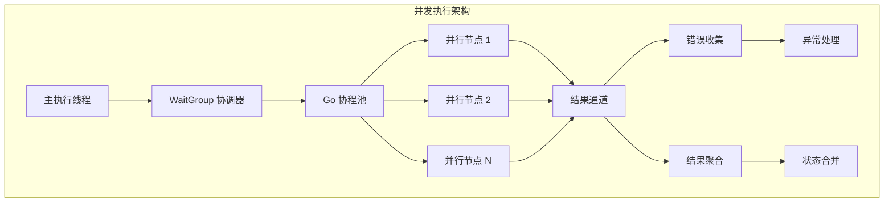

**图表来源**
- [graph/parallel.go](file://graph/parallel.go#L24-L82)
- [graph/graph.go](file://graph/graph.go#L249-L318)

**章节来源**
- [graph/parallel.go](file://graph/parallel.go#L1-L82)
- [graph/graph.go](file://graph/graph.go#L249-L318)

## WaitGroup 协调机制

`sync.WaitGroup` 是 langgraphgo 并发执行的核心协调工具，它确保所有并行节点完成后再进行下一步操作。

### WaitGroup 使用模式

在消息图执行中，WaitGroup 的使用遵循以下模式：

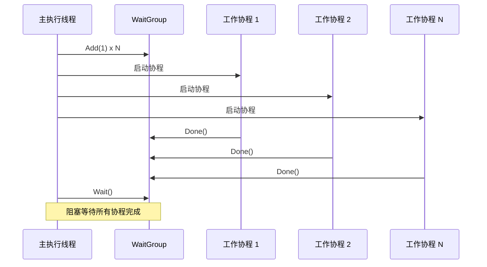

**图表来源**
- [graph/graph.go](file://graph/graph.go#L249-L318)
- [graph/parallel.go](file://graph/parallel.go#L32-L64)

### WaitGroup 在不同场景中的应用

#### 1. 基础并行执行
在基础的消息图执行中，WaitGroup 负责协调多个节点的并行执行：

```mermaid
flowchart TD
A[开始执行] --> B[初始化 WaitGroup]
B --> C[为每个节点 Add(1)]
C --> D[启动并行协程]
D --> E[各协程执行节点逻辑]
E --> F[执行 Done()]
F --> G[WaitGroup 等待]
G --> H[收集结果]
H --> I[继续执行]
```

**图表来源**
- [graph/graph.go](file://graph/graph.go#L249-L318)

#### 2. 并行节点执行
在专门的并行节点执行中，WaitGroup 确保所有子节点完成：

```mermaid
flowchart TD
A[ParallelNode.Execute] --> B[创建结果通道]
B --> C[初始化 WaitGroup]
C --> D[遍历节点列表]
D --> E[为每个节点 Add(1)]
E --> F[启动并行协程]
F --> G[执行节点函数]
G --> H[发送结果到通道]
H --> I[协程执行 Done]
I --> J[后台 goroutine Wait]
J --> K[关闭结果通道]
K --> L[收集所有结果]
```

**图表来源**
- [graph/parallel.go](file://graph/parallel.go#L24-L82)

**章节来源**
- [graph/parallel.go](file://graph/parallel.go#L32-L64)
- [graph/graph.go](file://graph/graph.go#L249-L318)

## 结果收集与错误处理

langgraphgo 使用类型化的结构体和通道来安全地收集并行执行的结果和错误信息。

### 结果数据结构

系统定义了一个专门的 `result` 类型来封装执行结果：

```mermaid
classDiagram
class Result {
+int index
+interface{} value
+error err
}
class ParallelNode {
+[]Node nodes
+string name
+Execute(ctx, state) (interface{}, error)
}
class MessageGraph {
+map[string]Node nodes
+[]Edge edges
+Invoke(ctx, state) (interface{}, error)
}
ParallelNode --> Result : "产生"
MessageGraph --> Result : "收集"
```

**图表来源**
- [graph/parallel.go](file://graph/parallel.go#L26-L30)

### 错误处理策略

系统采用多层次的错误处理策略：

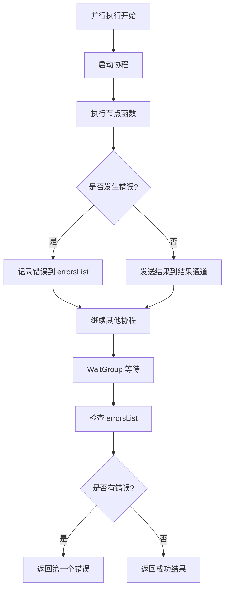

**图表来源**
- [graph/graph.go](file://graph/graph.go#L320-L341)
- [graph/parallel.go](file://graph/parallel.go#L70-L79)

### Panic 恢复机制

为了防止协程崩溃影响整个执行流程，系统实现了完善的 panic 恢复机制：

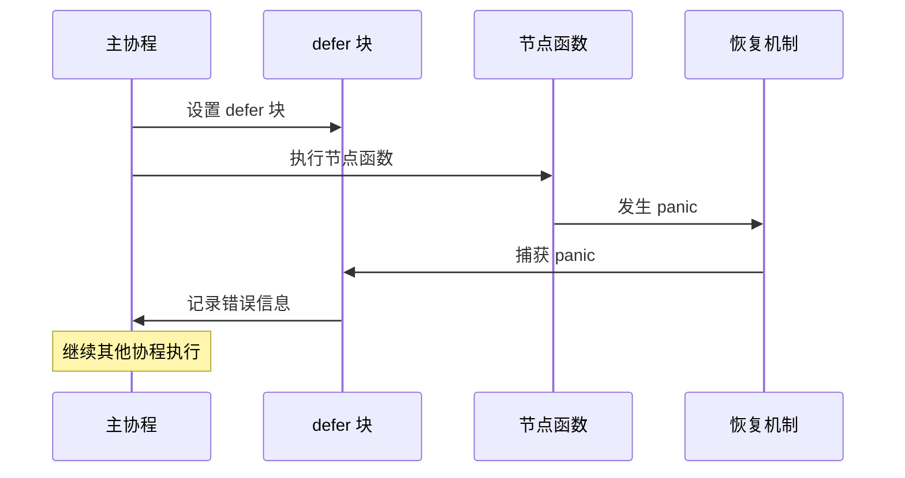

**图表来源**
- [graph/parallel.go](file://graph/parallel.go#L41-L48)

**章节来源**
- [graph/parallel.go](file://graph/parallel.go#L26-L82)
- [graph/graph.go](file://graph/graph.go#L250-L341)

## 扇出结构实现

扇出（Fan-out）是 langgraphgo 并发执行的核心模式，允许单个节点触发多个并行执行路径。

### AddEdge 方法的作用

`AddEdge` 方法在扇出结构中扮演关键角色，它创建了从源节点到多个目标节点的连接：

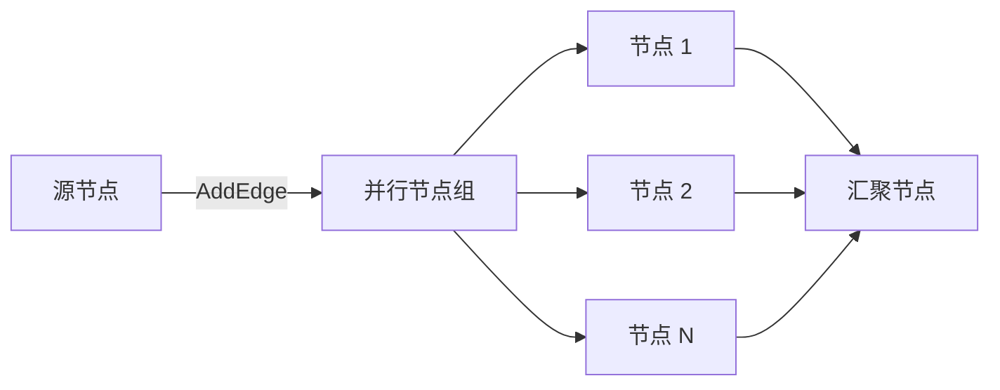

**图表来源**
- [graph/parallel.go](file://graph/parallel.go#L161-L177)

### Fan-Out/Fan-In 模式

系统提供了完整的扇出/扇入模式实现：

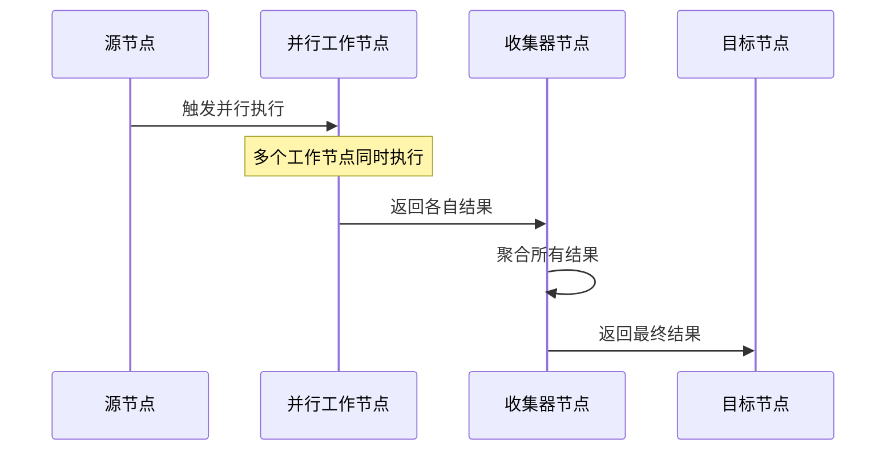

**图表来源**
- [graph/parallel.go](file://graph/parallel.go#L154-L177)

### 并行节点组管理

系统通过 `AddParallelNodes` 方法创建并行节点组：

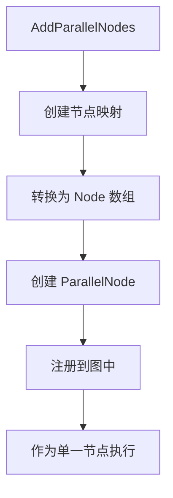

**图表来源**
- [graph/parallel.go](file://graph/parallel.go#L85-L99)

**章节来源**
- [graph/parallel.go](file://graph/parallel.go#L161-L177)
- [graph/parallel.go](file://graph/parallel.go#L85-L99)

## 状态合并策略

langgraphgo 提供了多种状态合并策略，以适应不同的并发执行需求。

### StateMerger 接口

`StateMerger` 是状态合并的核心接口：

```mermaid
classDiagram
class StateMerger {
<<interface>>
+func(ctx Context, currentState, newStates []interface{}) (interface{}, error)
}
class MessageGraph {
+StateMerger stateMerger
+StateSchema Schema
}
class MapSchema {
+map[string]Reducer Reducers
+map[string]bool EphemeralKeys
+Update(current, new) (interface{}, error)
}
MessageGraph --> StateMerger : "使用"
MapSchema ..|> StateSchema : "实现"
```

**图表来源**
- [graph/graph.go](file://graph/graph.go#L71-L72)
- [graph/schema.go](file://graph/schema.go#L12-L19)

### 状态合并流程

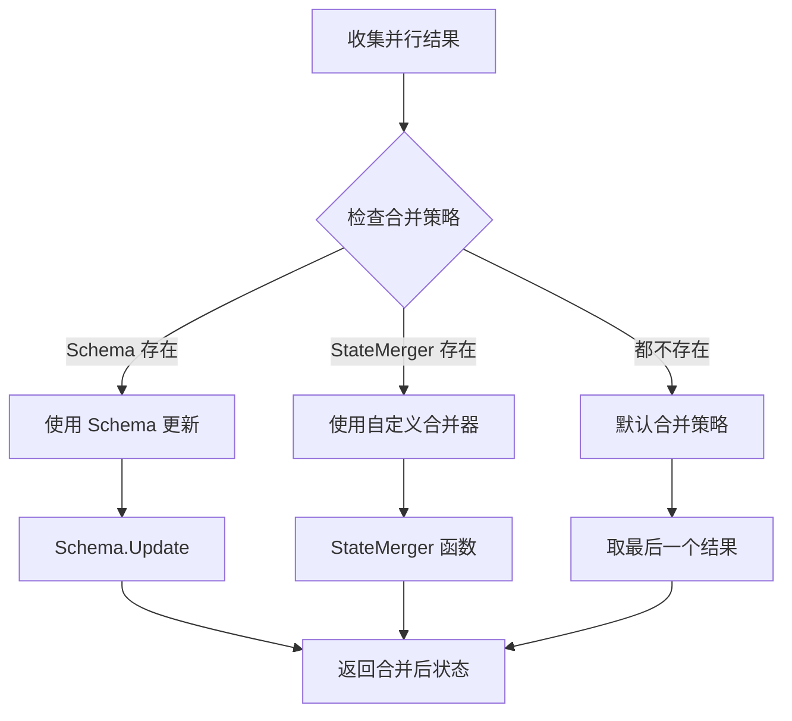

**图表来源**
- [graph/graph.go](file://graph/graph.go#L367-L388)
- [graph/state_graph.go](file://graph/state_graph.go#L200-L216)

### MapSchema 实现

`MapSchema` 提供了灵活的状态合并能力：

```mermaid
classDiagram
class MapSchema {
+map[string]Reducer Reducers
+map[string]bool EphemeralKeys
+Init() interface{}
+Update(current, new) (interface{}, error)
+Cleanup(state) interface{}
}
class Reducer {
<<function>>
+func(current, new interface{}) (interface{}, error)
}
MapSchema --> Reducer : "使用"
```

**图表来源**
- [graph/schema.go](file://graph/schema.go#L29-L100)

**章节来源**
- [graph/graph.go](file://graph/graph.go#L71-L93)
- [graph/schema.go](file://graph/schema.go#L12-L100)

## 线程安全保证

langgraphgo 通过多种机制确保并发执行的线程安全性。

### 协程隔离

每个并行节点在独立的协程中执行，避免了直接的竞争条件：

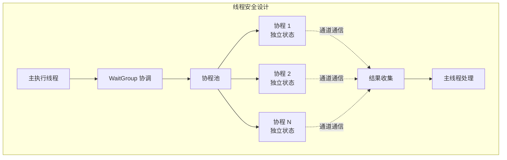

**图表来源**
- [graph/parallel.go](file://graph/parallel.go#L35-L64)

### 通道通信

系统使用带缓冲的通道来安全地传递结果和错误：

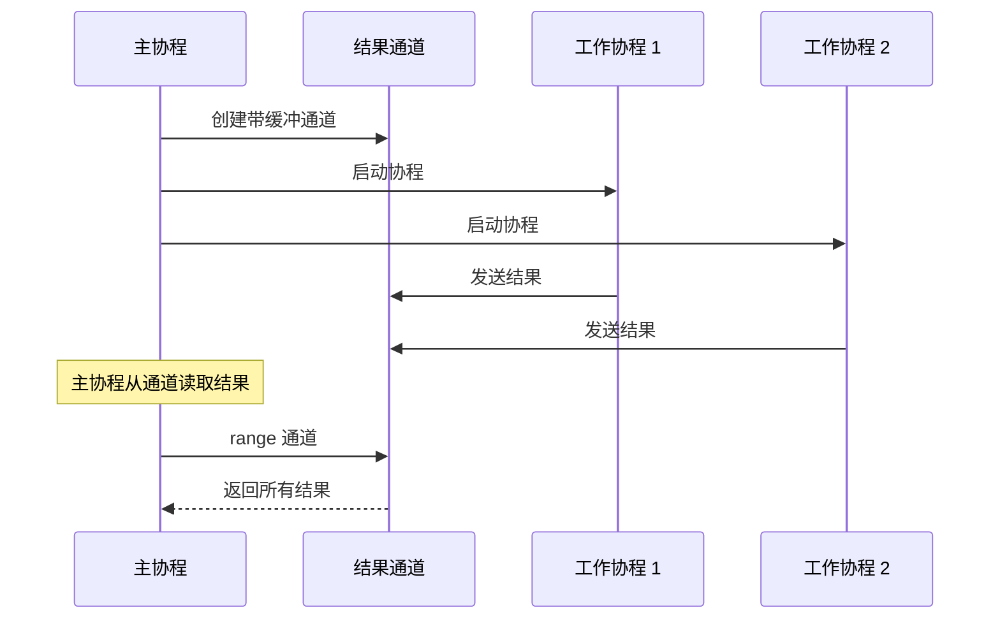

**图表来源**
- [graph/parallel.go](file://graph/parallel.go#L32-L33)

### 竞态条件防护

系统通过以下方式避免竞态条件：

1. **只读访问**: 大多数情况下，节点只读取状态，不修改
2. **通道隔离**: 结果通过通道传递，避免共享内存
3. **延迟写入**: 状态更新在所有协程完成后统一进行

**章节来源**
- [graph/parallel.go](file://graph/parallel.go#L32-L64)
- [graph/graph.go](file://graph/graph.go#L275-L276)

## 性能优化考虑

langgraphgo 的并发执行模型在设计时充分考虑了性能优化。

### 协程池管理

系统采用动态协程池，根据需要创建协程：

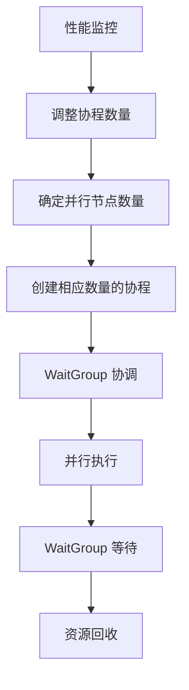

### 内存优化

1. **结果预分配**: 预先分配结果数组，减少内存分配开销
2. **通道缓冲**: 使用带缓冲的通道，减少阻塞等待
3. **及时清理**: 完成后立即释放协程资源

### 上下文传播

系统支持上下文传播，允许取消操作和超时控制：

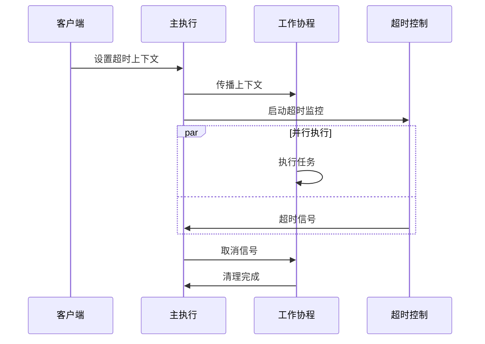

**图表来源**
- [graph/parallel_test.go](file://graph/parallel_test.go#L248-L253)

**章节来源**
- [graph/parallel.go](file://graph/parallel.go#L32-L64)
- [graph/parallel_test.go](file://graph/parallel_test.go#L248-L263)

## 最佳实践

基于对 langgraphgo 并发执行模型的深入分析，以下是推荐的最佳实践：

### 1. 合理设计扇出结构

- 使用 `AddParallelNodes` 创建明确的并行组
- 避免过深的嵌套扇出，保持执行路径清晰
- 考虑使用 `FanOutFanIn` 模式处理复杂的并行流程

### 2. 状态设计原则

- 对于可并行的状态更新，使用 `StateSchema` 定义合适的合并策略
- 对于简单的状态合并，可以使用 `StateMerger` 自定义合并逻辑
- 避免在并行节点中修改共享状态，使用只读访问

### 3. 错误处理策略

- 实现适当的错误恢复机制
- 使用 `panic` 恢复来防止协程崩溃
- 考虑使用重试策略处理临时性错误

### 4. 性能调优

- 监控协程数量，避免过多并发导致资源耗尽
- 使用上下文控制来支持取消和超时
- 考虑使用 `context.WithCancel` 来优雅地终止长时间运行的任务

### 5. 测试和验证

- 编写并行执行的单元测试
- 使用压力测试验证系统的并发性能
- 监控内存使用情况，确保没有内存泄漏

**章节来源**
- [examples/parallel_execution/main.go](file://examples/parallel_execution/main.go#L1-L97)
- [graph/parallel_execution_test.go](file://graph/parallel_execution_test.go#L1-L158)

## 总结

langgraphgo 的并发执行模型通过巧妙的设计实现了高效的并行处理能力。其核心特点包括：

1. **WaitGroup 协调**: 确保所有并行节点完成后再进行状态合并
2. **通道通信**: 安全地收集执行结果和错误信息
3. **扇出结构**: 支持灵活的并行执行模式
4. **状态合并**: 提供多种合并策略适应不同需求
5. **线程安全**: 通过协程隔离和通道通信保证并发安全
6. **性能优化**: 动态协程管理和上下文传播支持

这种设计使得 langgraphgo 能够高效地处理复杂的图状工作流，同时保持代码的简洁性和可维护性。开发者可以基于这些机制构建强大的并发应用程序，充分利用现代多核处理器的计算能力。