# 基于 StateSchema 的状态合并

<cite>
**本文档引用的文件**
- [examples/state_schema/main.go](file://examples/state_schema/main.go)
- [examples/state_schema/README.md](file://examples/state_schema/README.md)
- [graph/schema.go](file://graph/schema.go)
- [graph/schema_test.go](file://graph/schema_test.go)
- [graph/update_state_test.go](file://graph/update_state_test.go)
- [graph/state_graph.go](file://graph/state_graph.go)
- [graph/parallel.go](file://graph/parallel.go)
- [graph/parallel_execution_test.go](file://graph/parallel_execution_test.go)
- [graph/builtin_listeners.go](file://graph/builtin_listeners.go)
</cite>

## 目录
1. [简介](#简介)
2. [StateSchema 架构概述](#stateschema-架构概述)
3. [核心接口与实现](#核心接口与实现)
4. [MapSchema 实现机制](#mapschema-实现机制)
5. [归约器类型详解](#归约器类型详解)
6. [并行节点结果合并](#并行节点结果合并)
7. [线程安全机制](#线程安全机制)
8. [实际应用场景](#实际应用场景)
9. [最佳实践与注意事项](#最佳实践与注意事项)
10. [总结](#总结)

## 简介

LangGraphGo 中的 StateSchema 是一个强大的状态管理机制，它定义了如何处理复杂的状态更新场景。当存在 StateSchema 时，系统能够智能地合并并行节点的结果，确保状态更新既符合业务逻辑又保持线程安全。

StateSchema 的核心价值在于：
- **类型化状态管理**：为不同状态字段定义不同的更新行为
- **并行安全**：在多节点并发执行时保证状态一致性
- **业务逻辑适配**：支持消息累积、数值累加、状态覆盖等多种场景
- **可扩展性**：允许自定义归约器满足特殊需求

## StateSchema 架构概述

StateSchema 架构采用接口驱动的设计模式，提供了灵活而强大的状态管理能力。

```mermaid
classDiagram
class StateSchema {
<<interface>>
+Init() interface{}
+Update(current, new interface{}) (interface{}, error)
}
class CleaningStateSchema {
<<interface>>
+Cleanup(state interface{}) interface{}
}
class MapSchema {
+Reducers map[string]Reducer
+EphemeralKeys map[string]bool
+RegisterReducer(key string, reducer Reducer)
+RegisterChannel(key string, reducer Reducer, isEphemeral bool)
+Init() interface{}
+Update(current, new interface{}) (interface{}, error)
+Cleanup(state interface{}) interface{}
}
class Reducer {
<<function>>
+func(current, new interface{}) (interface{}, error)
}
StateSchema <|-- CleaningStateSchema
StateSchema <|.. MapSchema
MapSchema --> Reducer : uses
```

**图表来源**
- [graph/schema.go](file://graph/schema.go#L12-L27)
- [graph/schema.go](file://graph/schema.go#L29-L34)

**章节来源**
- [graph/schema.go](file://graph/schema.go#L1-L27)

## 核心接口与实现

### StateSchema 接口职责

StateSchema 接口定义了状态管理的核心契约：

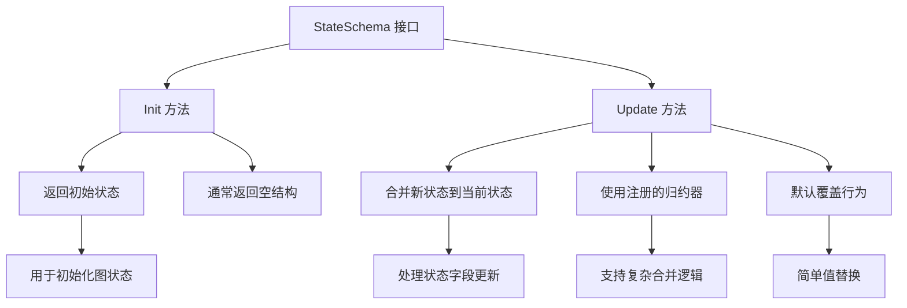

**图表来源**
- [graph/schema.go](file://graph/schema.go#L13-L19)

### MapSchema 具体实现

MapSchema 是 StateSchema 接口的主要实现，专门处理键值对形式的状态：

| 组件 | 类型 | 职责 | 默认行为 |
|------|------|------|----------|
| Reducers | map[string]Reducer | 为特定键注册归约器 | 默认覆盖 |
| EphemeralKeys | map[string]bool | 标记临时键 | 不参与持久化 |
| RegisterReducer | 方法 | 注册键的归约器 | 支持自定义逻辑 |
| RegisterChannel | 方法 | 注册通道（含临时标记） | 扩展功能 |

**章节来源**
- [graph/schema.go](file://graph/schema.go#L29-L55)

## MapSchema 实现机制

### 更新流程详解

MapSchema 的 Update 方法实现了智能的状态合并逻辑：

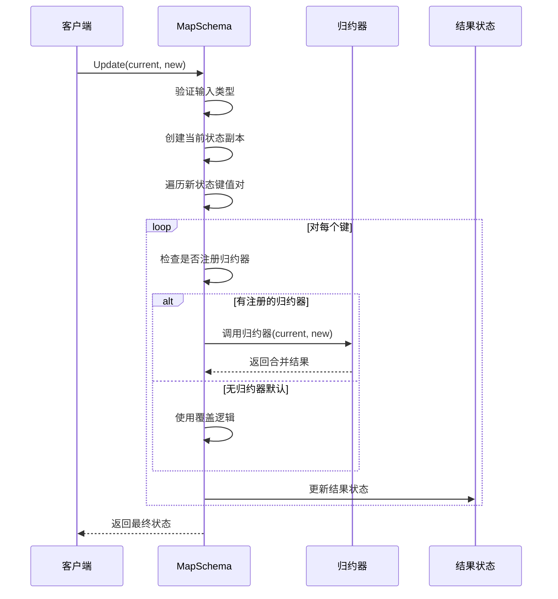

**图表来源**
- [graph/schema.go](file://graph/schema.go#L63-L99)

### 键值处理策略

MapSchema 采用分层处理策略：

1. **类型验证**：确保输入是 map[string]interface{} 类型
2. **状态复制**：创建当前状态的副本避免直接修改
3. **逐键处理**：对每个键分别应用相应的归约器或默认逻辑
4. **错误处理**：提供详细的错误信息便于调试

**章节来源**
- [graph/schema.go](file://graph/schema.go#L63-L99)

## 归约器类型详解

### OverwriteReducer - 覆盖归约器

最简单的归约器，直接用新值替换旧值：

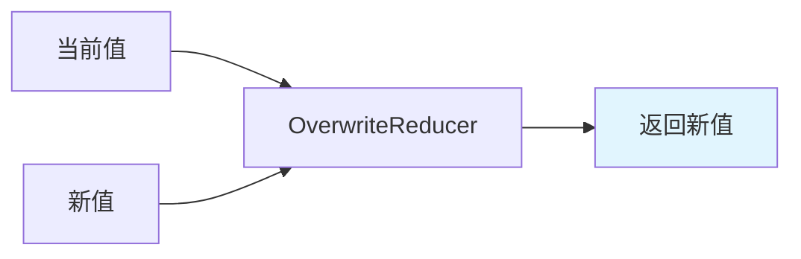

**图表来源**
- [graph/schema.go](file://graph/schema.go#L141-L144)

### AppendReducer - 追加归约器

智能的追加归约器，支持多种数据类型的追加操作：

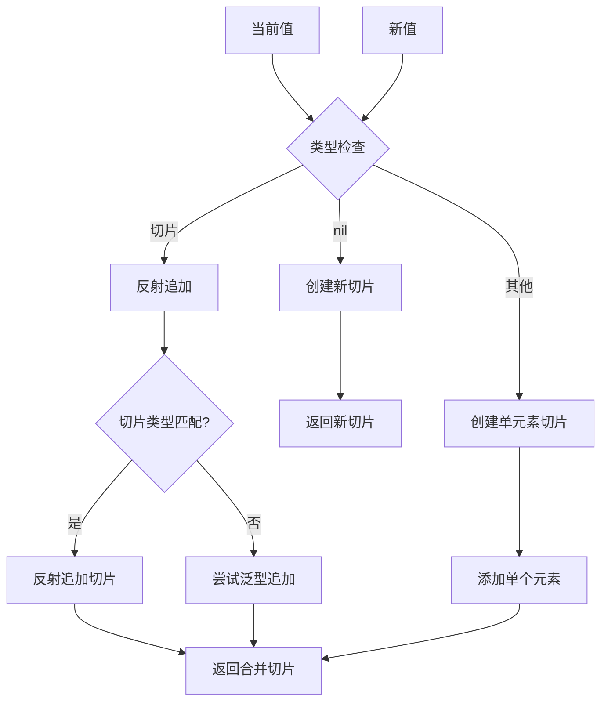

**图表来源**
- [graph/schema.go](file://graph/schema.go#L146-L185)

### SumReducer - 求和归约器

自定义归约器示例，实现整数累加：

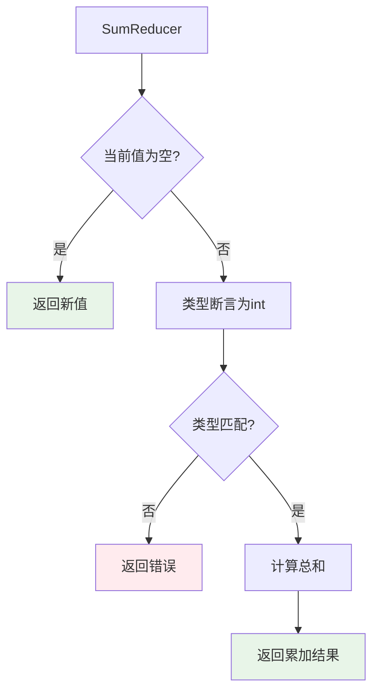

**图表来源**
- [examples/state_schema/main.go](file://examples/state_schema/main.go#L11-L22)

### 归约器行为对比表

| 归约器类型 | 输入格式 | 合并逻辑 | 输出格式 | 应用场景 |
|------------|----------|----------|----------|----------|
| OverwriteReducer | 任意 | 直接替换 | 新值 | 状态标志、配置项 |
| AppendReducer | 切片/元素 | 追加到列表 | 合并后的切片 | 日志记录、消息队列 |
| SumReducer | 整数 | 数值相加 | 累计值 | 计数器、统计指标 |
| 自定义归约器 | 特定类型 | 业务逻辑 | 自定义 | 复杂聚合场景 |

**章节来源**
- [graph/schema.go](file://graph/schema.go#L141-L185)
- [examples/state_schema/main.go](file://examples/state_schema/main.go#L11-L22)

## 并行节点结果合并

### 并行执行架构

LangGraphGo 支持多节点并行执行，状态合并在执行过程中完成：

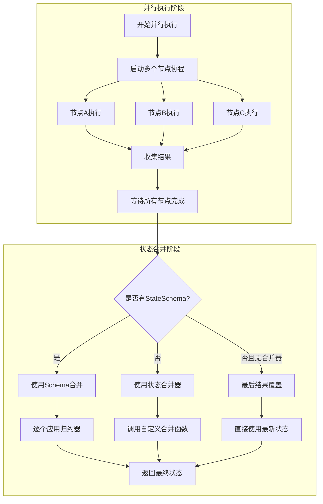

**图表来源**
- [graph/state_graph.go](file://graph/state_graph.go#L143-L209)

### 并行状态合并流程

在并行执行完成后，系统按照以下流程合并状态：

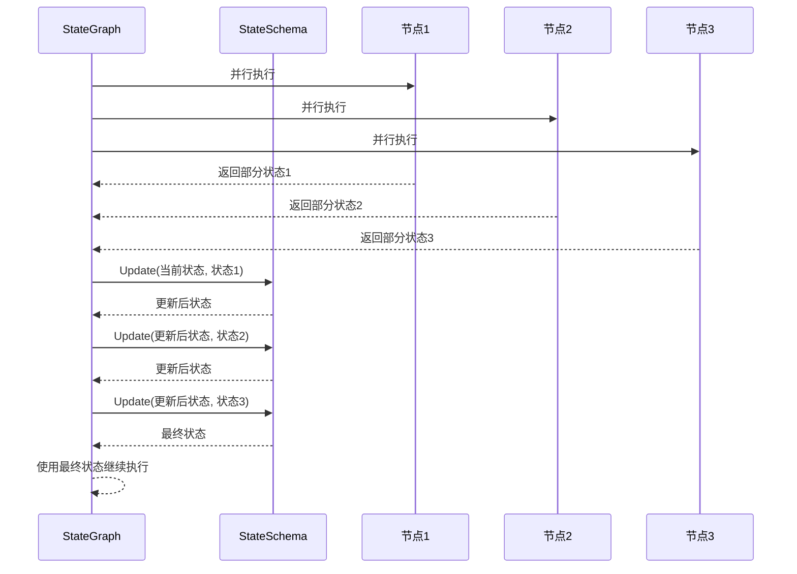

**图表来源**
- [graph/state_graph.go](file://graph/state_graph.go#L201-L209)

**章节来源**
- [graph/state_graph.go](file://graph/state_graph.go#L143-L209)

## 线程安全机制

### 内置同步原语

LangGraphGo 在多个组件中使用互斥锁确保线程安全：

```mermaid
classDiagram
class ProgressListener {
-mutex sync.RWMutex
+SetNodeStep(nodeName, step)
+OnNodeEvent(event, nodeName, state, err)
}
class LoggingListener {
-mutex sync.RWMutex
+OnNodeEvent(event, nodeName, state, err)
}
class MapSchema {
+Reducers map[string]Reducer
+EphemeralKeys map[string]bool
+RegisterReducer(key, reducer)
+Update(current, new) interface{}
}
ProgressListener --> sync.RWMutex : uses
LoggingListener --> sync.RWMutex : uses
MapSchema --> sync.RWMutex : potential usage
```

**图表来源**
- [graph/builtin_listeners.go](file://graph/builtin_listeners.go#L16-L17)
- [graph/builtin_listeners.go](file://graph/builtin_listeners.go#L203-L204)

### 竞态条件防护

MapSchema 通过以下机制防止竞态条件：

1. **状态副本创建**：每次更新都创建当前状态的副本
2. **不可变设计**：避免直接修改原始状态
3. **原子操作**：归约器函数作为独立单元执行
4. **错误隔离**：单个键的错误不影响其他键的处理

### 并发安全保障

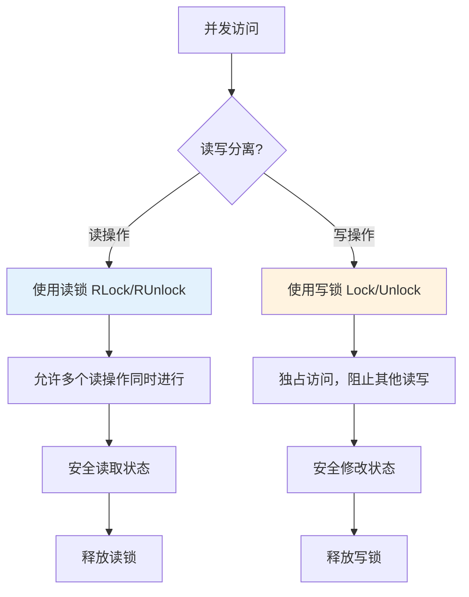

**章节来源**
- [graph/builtin_listeners.go](file://graph/builtin_listeners.go#L64-L73)
- [graph/builtin_listeners.go](file://graph/builtin_listeners.go#L223-L224)

## 实际应用场景

### 消息累积场景

使用 AppendReducer 累积消息日志：

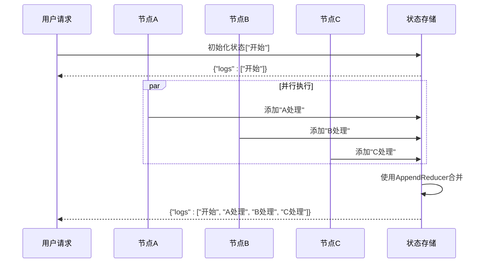

**图表来源**
- [examples/state_schema/main.go](file://examples/state_schema/main.go#L44-L69)

### 数值累加场景

使用 SumReducer 累积计数器：

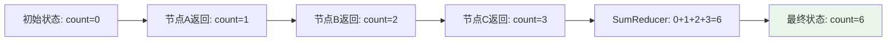

**图表来源**
- [examples/state_schema/main.go](file://examples/state_schema/main.go#L11-L22)

### 状态覆盖场景

使用默认覆盖行为更新状态标志：

```mermaid
flowchart TD
A[初始状态: status='Init'] --> B[节点A: status='In Progress (A)']
B --> C[节点B: status='In Progress (B)']
C --> D[节点C: status='Completed']
D --> E[默认覆盖: 只保留最后一次更新]
E --> F[最终状态: status='Completed']
style F fill:#e3f2fd
```

**图表来源**
- [examples/state_schema/main.go](file://examples/state_schema/main.go#L44-L69)

**章节来源**
- [examples/state_schema/main.go](file://examples/state_schema/main.go#L1-L105)

## 最佳实践与注意事项

### 归约器注册策略

1. **明确性原则**：为每个状态字段明确指定归约器
2. **性能考虑**：避免在归约器中执行耗时操作
3. **类型安全**：确保归约器处理正确的数据类型
4. **错误处理**：在归约器中提供适当的错误处理

### 状态设计建议

| 设计原则 | 说明 | 示例 |
|----------|------|------|
| 单一职责 | 每个字段只负责一种状态信息 | `count` 只计数，`logs` 只记录 |
| 类型一致 | 归约器处理的数据类型要统一 | 整数计数器使用 SumReducer |
| 清晰语义 | 字段命名反映其用途 | `status` 表示状态，`logs` 表示日志 |
| 最小化复杂度 | 避免过度复杂的归约逻辑 | 简单的加法、追加优于复杂算法 |

### 性能优化技巧

1. **批量处理**：利用 StateSchema 的批量更新能力
2. **缓存归约器**：避免重复创建相同的归约器实例
3. **延迟清理**：合理使用 EphemeralKeys 减少内存占用
4. **监控状态大小**：注意状态增长可能导致的性能问题

### 常见陷阱避免

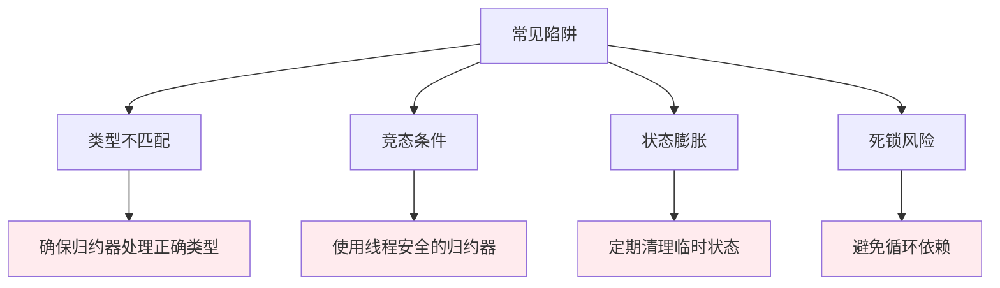

### 调试和监控

1. **状态快照**：定期保存状态快照用于调试
2. **归约器日志**：在关键归约器中添加日志输出
3. **性能监控**：监控状态更新的性能指标
4. **错误追踪**：建立完善的错误处理和追踪机制

## 总结

LangGraphGo 的 StateSchema 机制提供了一个强大而灵活的状态管理系统。通过 `Update` 方法和归约器的组合，系统能够在并行执行环境中安全地合并状态，同时保持业务逻辑的正确性。

### 核心优势

1. **类型安全**：通过接口定义确保类型一致性
2. **并发友好**：内置线程安全机制防止竞态条件
3. **业务适配**：丰富的归约器类型满足各种业务需求
4. **可扩展性**：支持自定义归约器扩展功能
5. **性能优化**：智能的状态合并减少不必要的计算

### 技术亮点

- **MapSchema 实现**：优雅的键值对状态管理
- **归约器模式**：灵活的状态合并策略
- **并行安全**：完善的并发控制机制
- **错误处理**：详细的错误信息和恢复机制

StateSchema 机制不仅解决了并行执行中的状态合并问题，更为构建复杂的状态驱动应用提供了坚实的基础。通过合理使用这一机制，开发者可以构建出既高效又可靠的并发应用程序。