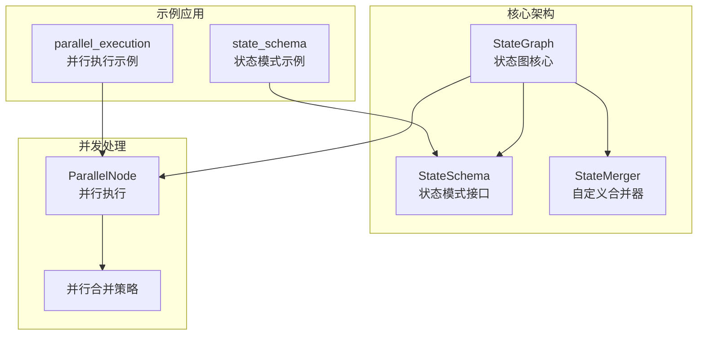
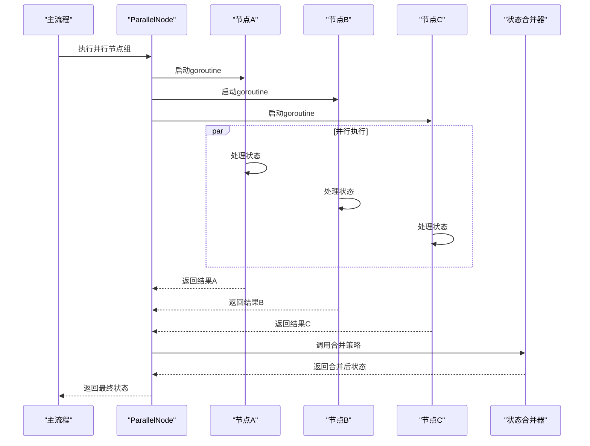
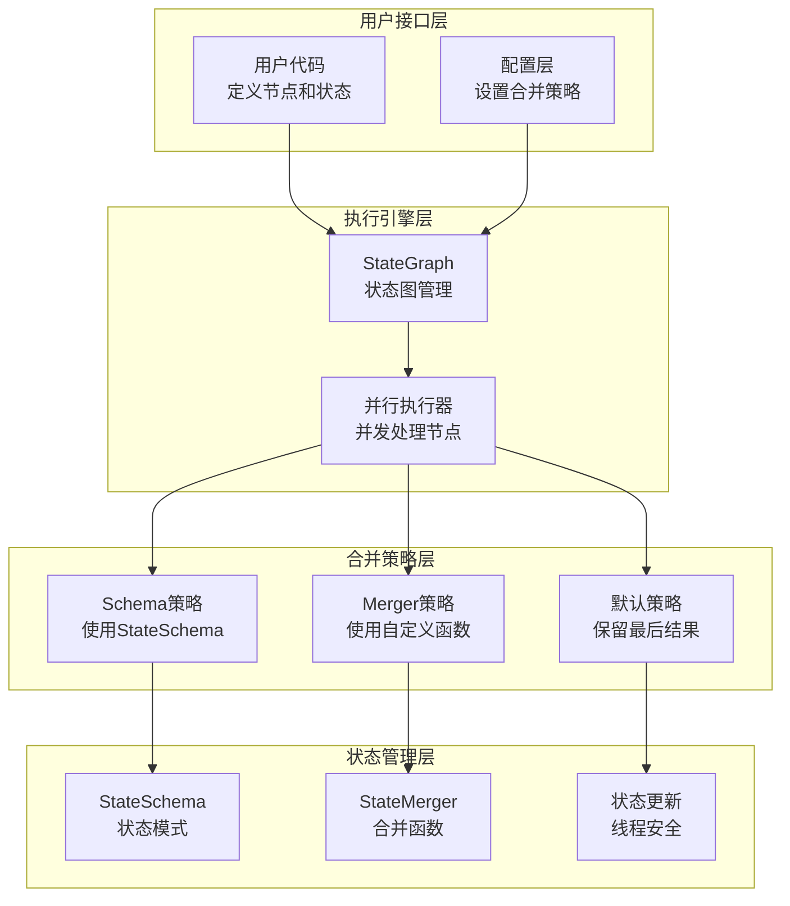
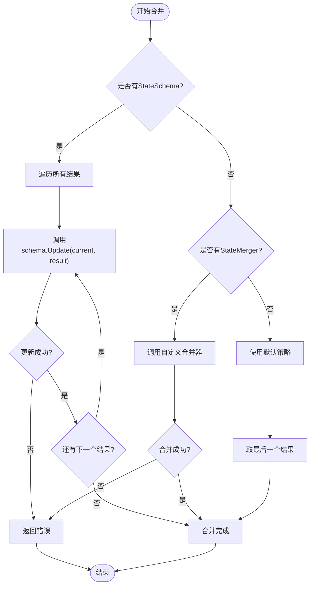
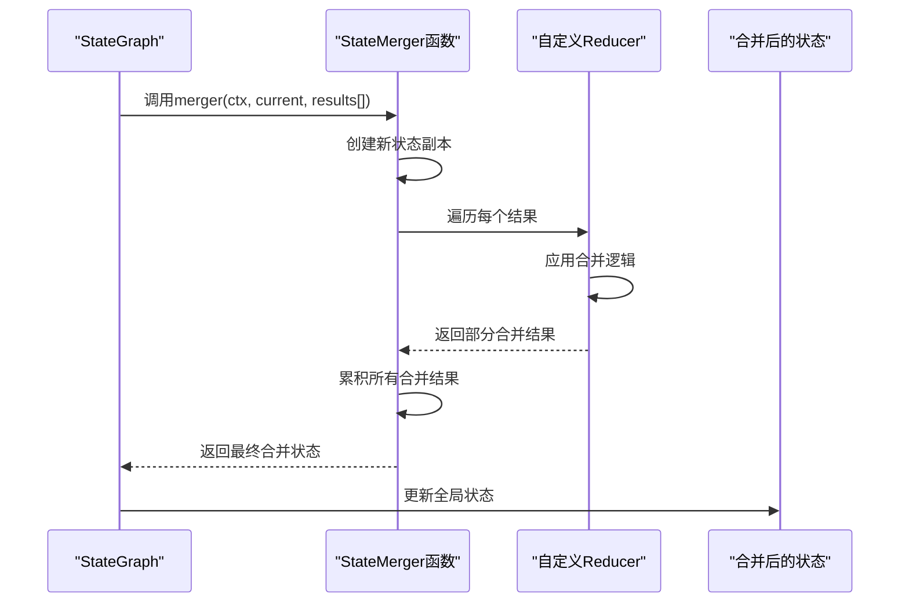
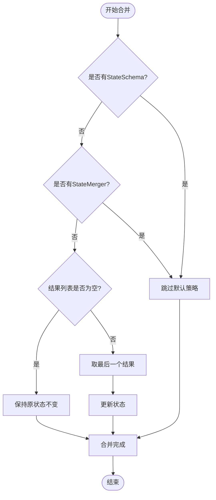
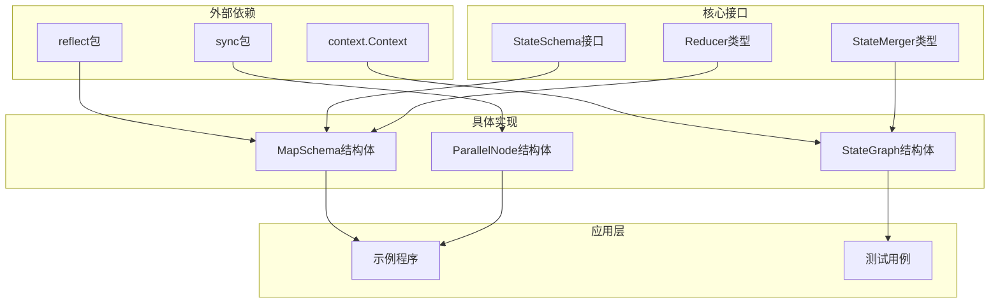
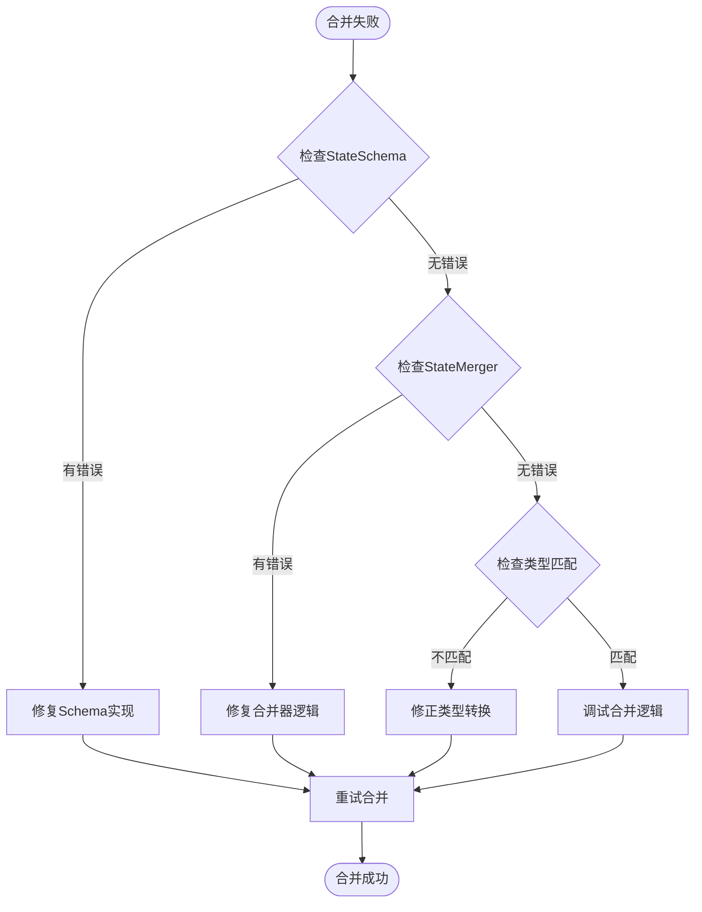

# 状态合并策略

<cite>
**本文档中引用的文件**
- [state_graph.go](file://graph/state_graph.go)
- [schema.go](file://graph/schema.go)
- [parallel.go](file://graph/parallel.go)
- [main.go](file://examples/state_schema/main.go)
- [main.go](file://examples/parallel_execution/main.go)
- [parallel_execution_test.go](file://graph/parallel_execution_test.go)
- [checkpointing.go](file://graph/checkpointing.go)
- [errors.go](file://graph/errors.go)
</cite>

## 目录
1. [简介](#简介)
2. [项目结构概览](#项目结构概览)
3. [核心组件分析](#核心组件分析)
4. [架构概览](#架构概览)
5. [详细组件分析](#详细组件分析)
6. [依赖关系分析](#依赖关系分析)
7. [性能考虑](#性能考虑)
8. [故障排除指南](#故障排除指南)
9. [结论](#结论)

## 简介

langgraphgo 是一个基于 Go 语言的状态图框架，专门设计用于处理复杂的并发状态管理场景。本文档深入探讨了框架的并发状态合并策略，详细解释了当并行节点执行完毕后，框架如何将多个结果合并到全局状态中。通过对比分析三种主要的合并策略，结合具体的代码示例，阐述了如何实现线程安全的状态更新，从而避免竞态条件。

框架提供了三种不同的状态合并策略：
1. **StateSchema 模式**：当 `StateSchema` 存在时，遍历所有结果并调用其 `Update` 方法进行合并
2. **自定义 StateMerger 函数模式**：当自定义 `StateMerger` 函数存在时，将所有结果作为一个切片传入该函数进行聚合
3. **默认策略**：仅保留最后一个节点的结果

## 项目结构概览

langgraphgo 采用模块化架构设计，核心功能分布在以下关键目录中：



**图表来源**
- [state_graph.go](file://graph/state_graph.go#L10-L32)
- [schema.go](file://graph/schema.go#L12-L19)
- [parallel.go](file://graph/parallel.go#L9-L21)

**章节来源**
- [state_graph.go](file://graph/state_graph.go#L1-L458)
- [schema.go](file://graph/schema.go#L1-L186)

## 核心组件分析

### StateGraph 结构体

StateGraph 是整个框架的核心数据结构，负责管理状态图的所有组件：

```mermaid
classDiagram
class StateGraph {
+map~string,Node~ nodes
+[]Edge edges
+map~string,func~ conditionalEdges
+string entryPoint
+*RetryPolicy retryPolicy
+StateMerger stateMerger
+StateSchema Schema
+AddNode(name, fn) void
+AddEdge(from, to) void
+SetEntryPoint(name) void
+SetStateMerger(merger) void
+SetSchema(schema) void
}
class StateRunnable {
+*StateGraph graph
+Invoke(ctx, state) interface{}
+InvokeWithConfig(ctx, state, config) interface{}
}
class StateSchema {
<<interface>>
+Init() interface{}
+Update(current, new) interface{}
}
class StateMerger {
<<function>>
+func(ctx, current, newStates) interface{}
}
StateGraph --> StateRunnable : "编译为"
StateGraph --> StateSchema : "使用"
StateGraph --> StateMerger : "使用"
```

**图表来源**
- [state_graph.go](file://graph/state_graph.go#L10-L32)
- [state_graph.go](file://graph/state_graph.go#L99-L102)
- [schema.go](file://graph/schema.go#L12-L19)

### 并行执行机制

框架支持高效的并行节点执行，通过 goroutine 实现真正的并发处理：



**图表来源**
- [parallel.go](file://graph/parallel.go#L24-L82)
- [state_graph.go](file://graph/state_graph.go#L143-L220)

**章节来源**
- [state_graph.go](file://graph/state_graph.go#L143-L220)
- [parallel.go](file://graph/parallel.go#L24-L82)

## 架构概览

langgraphgo 的状态合并架构采用了分层设计，确保了灵活性和可扩展性：



**图表来源**
- [state_graph.go](file://graph/state_graph.go#L10-L32)
- [state_graph.go](file://graph/state_graph.go#L200-L220)

## 详细组件分析

### StateSchema 模式的合并策略

当 `StateSchema` 存在时，框架采用遍历所有结果并调用其 `Update` 方法进行合并的策略：



**图表来源**
- [state_graph.go](file://graph/state_graph.go#L200-L219)

#### AppendReducer 示例分析

在 `examples/state_schema` 中，`AppendReducer` 展示了如何实现线程安全的状态更新：

```mermaid
classDiagram
class AppendReducer {
+func(current, new) interface{}
-reflect.Value current
-reflect.Value new
+handleNilCurrent() slice
+handleSliceToSlice() slice
+handleElementToSlice() slice
}
class SumReducer {
+func(current, new) interface{}
+checkTypes() bool
+performAddition() int
}
class MapSchema {
+map~string,Reducer~ Reducers
+RegisterReducer(key, reducer) void
+Update(current, new) interface{}
}
AppendReducer --> MapSchema : "注册为Reducer"
SumReducer --> MapSchema : "注册为Reducer"
```

**图表来源**
- [schema.go](file://graph/schema.go#L146-L185)
- [main.go](file://examples/state_schema/main.go#L11-L22)

**章节来源**
- [state_graph.go](file://graph/state_graph.go#L200-L209)
- [schema.go](file://graph/schema.go#L146-L185)

### 自定义 StateMerger 函数模式

当自定义 `StateMerger` 函数存在时，框架将所有结果作为一个切片传入该函数进行聚合：



**图表来源**
- [state_graph.go](file://graph/state_graph.go#L210-L215)
- [parallel_execution_test.go](file://graph/parallel_execution_test.go#L116-L131)

#### 并行执行测试示例

测试用例展示了如何实现自定义合并器来处理并行执行的结果：

```mermaid
flowchart LR
subgraph "并行节点"
NodeA["节点A<br/>{\"A\": 1}"]
NodeB["节点B<br/>{\"B\": 1}"]
NodeC["节点C<br/>{\"C\": 1}"]
end
subgraph "合并器"
Merger["自定义合并器"]
CopyCurrent["复制当前状态"]
MergeStates["合并所有状态"]
ReturnMerged["返回合并结果"]
end
NodeA --> Merger
NodeB --> Merger
NodeC --> Merger
Merger --> CopyCurrent
CopyCurrent --> MergeStates
MergeStates --> ReturnMerged
```

**图表来源**
- [parallel_execution_test.go](file://graph/parallel_execution_test.go#L116-L131)

**章节来源**
- [state_graph.go](file://graph/state_graph.go#L210-L215)
- [parallel_execution_test.go](file://graph/parallel_execution_test.go#L116-L131)

### 默认策略

当既没有 `StateSchema` 也没有自定义 `StateMerger` 时，框架采用简单的默认策略，仅保留最后一个节点的结果：



**图表来源**
- [state_graph.go](file://graph/state_graph.go#L216-L219)

**章节来源**
- [state_graph.go](file://graph/state_graph.go#L216-L219)

### 线程安全的状态更新

框架通过多种机制确保状态更新的线程安全性：

#### MapSchema 的线程安全实现

```mermaid
classDiagram
class MapSchema {
+map~string,Reducer~ Reducers
+map~string,bool~ EphemeralKeys
+Update(current, new) interface{}
+Cleanup(state) interface{}
-copyMap(original) map
-mergeValues(key, current, new) interface{}
}
class ThreadSafety {
<<concept>>
+immutableOperations() void
+copyBeforeModify() void
+safeReducerCalls() void
}
MapSchema --> ThreadSafety : "实现"
```

**图表来源**
- [schema.go](file://graph/schema.go#L29-L100)

#### 竞态条件防护机制

框架在多个层面实现了竞态条件防护：

1. **状态复制**：在修改前创建状态的副本
2. **原子操作**：使用互斥锁保护共享资源
3. **不可变性**：优先使用不可变数据结构
4. **顺序一致性**：确保状态更新的顺序性

**章节来源**
- [schema.go](file://graph/schema.go#L62-L99)
- [checkpointing.go](file://graph/checkpointing.go#L481-L533)

## 依赖关系分析

框架的依赖关系体现了清晰的分层架构：



**图表来源**
- [state_graph.go](file://graph/state_graph.go#L1-L10)
- [schema.go](file://graph/schema.go#L1-L10)
- [parallel.go](file://graph/parallel.go#L1-L10)

**章节来源**
- [state_graph.go](file://graph/state_graph.go#L1-L10)
- [schema.go](file://graph/schema.go#L1-L10)
- [parallel.go](file://graph/parallel.go#L1-L10)

## 性能考虑

### 并发执行优化

框架通过以下方式优化并发性能：

1. **goroutine 池化**：使用 waitgroup 管理并发执行
2. **结果收集**：通过通道收集并行执行结果
3. **错误处理**：快速失败机制减少不必要的计算
4. **内存管理**：及时释放不再需要的资源

### 内存使用优化

- **状态复制**：只在必要时复制状态数据
- **引用传递**：对于大型对象使用引用而非值传递
- **垃圾回收友好**：避免创建过多临时对象

### 合并策略选择建议

根据不同的使用场景选择合适的合并策略：

| 场景 | 推荐策略 | 原因 |
|------|----------|------|
| 复杂状态管理 | StateSchema | 提供细粒度控制和线程安全 |
| 简单聚合需求 | StateMerger | 自定义灵活的合并逻辑 |
| 快速原型开发 | 默认策略 | 最简单直接的实现方式 |

## 故障排除指南

### 常见问题及解决方案

#### 状态合并失败

**问题描述**：状态合并过程中出现错误

**可能原因**：
1. `StateSchema.Update` 方法返回错误
2. 自定义 `StateMerger` 函数处理不当
3. 类型转换失败

**解决方案**：


#### 并发竞态条件

**问题描述**：多 goroutine 并发访问导致数据不一致

**预防措施**：
1. 使用 `StateSchema` 提供的线程安全机制
2. 在自定义合并器中正确处理并发访问
3. 避免在合并过程中修改共享状态

**章节来源**
- [state_graph.go](file://graph/state_graph.go#L200-L219)
- [errors.go](file://graph/errors.go#L1-L16)

### 调试技巧

1. **启用详细日志**：记录每个节点的执行状态
2. **状态快照**：定期保存状态快照用于回溯
3. **并发监控**：使用 Go 的 pprof 工具分析并发性能

## 结论

langgraphgo 的并发状态合并策略提供了一个强大而灵活的框架，能够满足各种复杂的状态管理需求。通过三种不同的合并策略，开发者可以根据具体的应用场景选择最适合的方案：

1. **StateSchema 模式**适用于需要细粒度状态控制和线程安全的场景
2. **自定义 StateMerger 函数模式**提供了最大的灵活性，适合特殊的业务逻辑
3. **默认策略**为简单的应用场景提供了最简化的解决方案

框架的设计充分考虑了并发安全性、性能优化和易用性，通过合理的抽象和封装，使得复杂的并发状态管理变得简单而可靠。无论是构建简单的状态机还是复杂的分布式系统，langgraphgo 都能提供强有力的支持。

未来的改进方向包括：
- 更丰富的内置合并策略
- 更好的并发性能监控工具
- 更完善的错误恢复机制
- 更灵活的插件系统

这些改进将进一步提升框架的实用性和可扩展性，使其成为 Go 生态系统中状态管理的重要工具。