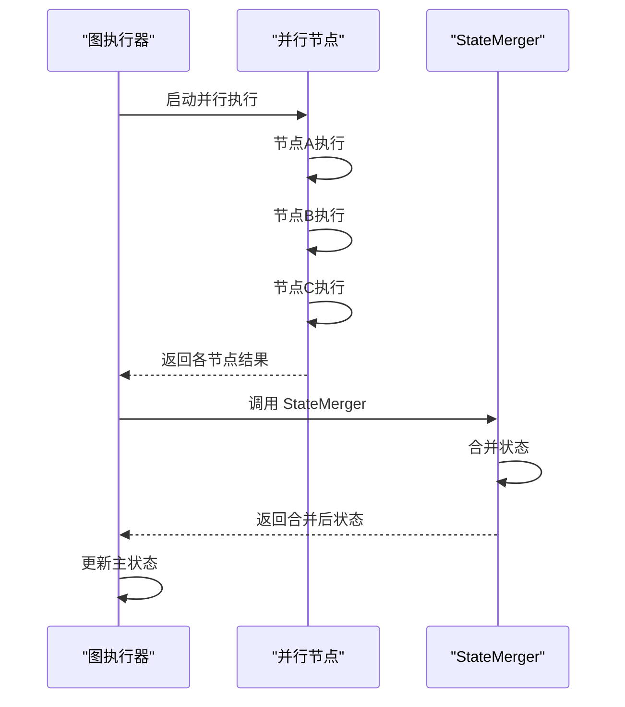
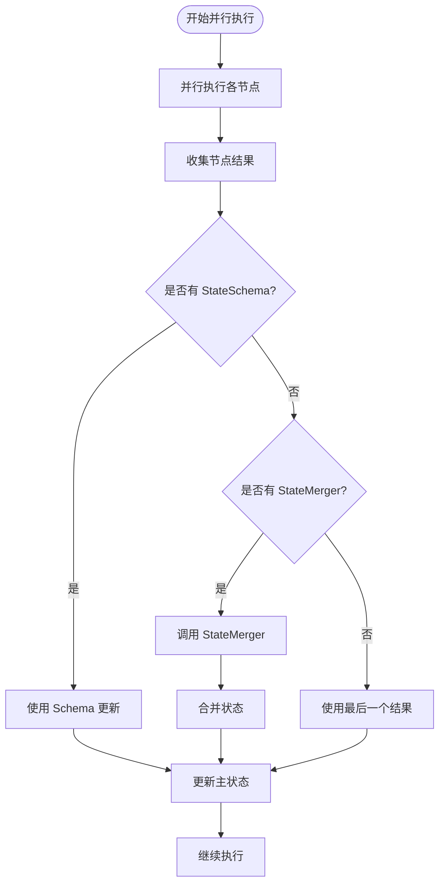

# 自定义 StateMerger 函数

<cite>
**本文档中引用的文件**
- [graph/parallel_execution_test.go](file://graph/parallel_execution_test.go)
- [graph/parallel.go](file://graph/parallel.go)
- [graph/schema.go](file://graph/schema.go)
- [graph/state_graph.go](file://graph/state_graph.go)
- [graph/graph.go](file://graph/graph.go)
- [examples/parallel_execution/main.go](file://examples/parallel_execution/main.go)
- [examples/custom_reducer/main.go](file://examples/custom_reducer/main.go)
</cite>

## 目录
1. [简介](#简介)
2. [StateMerger 函数概述](#statemerger-函数概述)
3. [函数签名和调用机制](#函数签名和调用机制)
4. [并行执行中的状态合并流程](#并行执行中的状态合并流程)
5. [自定义 Merger 函数示例](#自定义-merger-函数示例)
6. [与 StateSchema 方案的对比](#与-stateschema-方案的对比)
7. [复杂合并逻辑的应用场景](#复杂合并逻辑的应用场景)
8. [最佳实践和注意事项](#最佳实践和注意事项)
9. [总结](#总结)

## 简介

在 LangGraphGo 框架中，当开发者未使用 `StateSchema` 而提供自定义 `StateMerger` 函数时，框架会自动将所有并行节点的输出结果作为切片传递给该函数进行聚合。这种设计为开发者提供了极大的灵活性，允许实现复杂的合并逻辑，如取最大值、加权平均、条件选择等。

本文档将深入探讨 `StateMerger` 函数的工作原理、调用时机以及在实际应用中的使用方法。

## StateMerger 函数概述

`StateMerger` 是 LangGraphGo 框架中的核心组件之一，用于处理并行执行后多个状态更新的合并问题。当图中存在多个并行执行的节点时，每个节点都会产生自己的状态更新，这些更新需要被正确地合并到主状态中。

```mermaid
classDiagram
class StateMerger {
<<interface>>
+func(ctx Context, currentState interface{}, newStates []interface{}) (interface{}, error)
}
class StateGraph {
+stateMerger StateMerger
+SetStateMerger(merger StateMerger)
+InvokeWithConfig(ctx Context, initialState interface{}, config *Config) (interface{}, error)
}
class MessageGraph {
+stateMerger StateMerger
+SetStateMerger(merger StateMerger)
+InvokeWithConfig(ctx Context, initialState interface{}, config *Config) (interface{}, error)
}
StateGraph --> StateMerger : "使用"
MessageGraph --> StateMerger : "使用"
```

**图表来源**
- [graph/state_graph.go](file://graph/state_graph.go#L27-L28)
- [graph/graph.go](file://graph/graph.go#L70-L71)

**章节来源**
- [graph/state_graph.go](file://graph/state_graph.go#L88-L90)
- [graph/graph.go](file://graph/graph.go#L129-L131)

## 函数签名和调用机制

### 函数签名

`StateMerger` 函数具有以下标准签名：

```go
type StateMerger func(ctx context.Context, currentState interface{}, newStates []interface{}) (interface{}, error)
```

### 参数说明

1. **ctx Context**: 上下文对象，用于控制超时和取消操作
2. **currentState interface{}**: 当前的主状态，即在并行执行开始前的状态
3. **newStates []interface{}**: 并行执行过程中各个节点产生的状态更新切片

### 返回值

- **interface{}**: 合并后的最终状态
- **error**: 如果合并过程中发生错误，则返回相应的错误

### 调用时机

`StateMerger` 函数在以下情况下被调用：

1. **并行执行完成后**: 所有并行节点都已完成执行
2. **无 StateSchema 时**: 当图中没有设置 `StateSchema` 时
3. **状态合并阶段**: 在确定了所有并行路径的结果后



**图表来源**
- [graph/state_graph.go](file://graph/state_graph.go#L201-L215)
- [graph/graph.go](file://graph/graph.go#L318-L330)

**章节来源**
- [graph/graph.go](file://graph/graph.go#L70-L71)
- [graph/state_graph.go](file://graph/state_graph.go#L88-L90)

## 并行执行中的状态合并流程

当框架检测到存在并行执行路径时，会按照以下流程处理状态合并：

### 流程图



**图表来源**
- [graph/state_graph.go](file://graph/state_graph.go#L200-L220)

### 具体步骤

1. **并行执行**: 多个节点同时执行，每个节点产生独立的状态更新
2. **结果收集**: 将所有节点的执行结果收集到一个切片中
3. **决策流程**:
   - 如果设置了 `StateSchema`，使用 Schema 的更新逻辑
   - 如果设置了 `StateMerger`，调用自定义合并函数
   - 否则，默认使用最后一个节点的结果

**章节来源**
- [graph/state_graph.go](file://graph/state_graph.go#L200-L220)

## 自定义 Merger 函数示例

### 基本合并示例

参考测试用例中的实现：

```go
// 定义状态类型
type State map[string]int

// 自定义合并函数
merger := func(ctx context.Context, current interface{}, newStates []interface{}) (interface{}, error) {
    merged := make(State)
    // 复制当前状态
    for k, v := range current.(State) {
        merged[k] = v
    }
    // 合并新状态
    for _, s := range newStates {
        ns := s.(State)
        for k, v := range ns {
            merged[k] = v
        }
    }
    return merged, nil
}

// 设置合并函数
g.SetStateMerger(merger)
```

### 复杂合并逻辑示例

#### 最大值合并

```go
maxMerger := func(ctx context.Context, current interface{}, newStates []interface{}) (interface{}, error) {
    merged := make(map[string]int)
    
    // 复制当前状态
    for k, v := range current.(map[string]int) {
        merged[k] = v
    }
    
    // 合并最大值
    for _, s := range newStates {
        state := s.(map[string]int)
        for k, v := range state {
            if currentValue, exists := merged[k]; !exists || v > currentValue {
                merged[k] = v
            }
        }
    }
    
    return merged, nil
}
```

#### 加权平均合并

```go
weightedAverageMerger := func(ctx context.Context, current interface{}, newStates []interface{}) (interface{}, error) {
    merged := make(map[string]float64)
    weights := make(map[string]float64)
    
    // 初始化权重
    for k := range current.(map[string]float64) {
        weights[k] = 0.0
    }
    
    // 收集所有状态和权重
    states := []map[string]float64{current.(map[string]float64)}
    for _, s := range newStates {
        states = append(states, s.(map[string]float64))
    }
    
    // 计算加权平均
    for _, state := range states {
        for k, v := range state {
            merged[k] = merged[k]*weights[k] + v*(1.0-weights[k])
            weights[k] = 1.0
        }
    }
    
    return merged, nil
}
```

#### 条件选择合并

```go
conditionalMerger := func(ctx context.Context, current interface{}, newStates []interface{}) (interface{}, error) {
    merged := make(map[string]string)
    
    // 复制当前状态
    for k, v := range current.(map[string]string) {
        merged[k] = v
    }
    
    // 条件选择：只保留非空值
    for _, s := range newStates {
        state := s.(map[string]string)
        for k, v := range state {
            if v != "" {
                merged[k] = v
            }
        }
    }
    
    return merged, nil
}
```

**章节来源**
- [graph/parallel_execution_test.go](file://graph/parallel_execution_test.go#L116-L131)

## 与 StateSchema 方案的对比

### StateSchema 方案

```mermaid
classDiagram
class StateSchema {
<<interface>>
+Init() interface{}
+Update(current, new interface{}) (interface{}, error)
}
class MapSchema {
+Reducers map[string]Reducer
+EphemeralKeys map[string]bool
+RegisterReducer(key string, reducer Reducer)
+Update(current, new interface{}) (interface{}, error)
}
class Reducer {
<<function>>
+func(current, new interface{}) (interface{}, error)
}
StateSchema <|-- MapSchema
MapSchema --> Reducer : "使用"
```

**图表来源**
- [graph/schema.go](file://graph/schema.go#L12-L27)
- [graph/schema.go](file://graph/schema.go#L29-L34)

### 对比表

| 特性 | StateMerger | StateSchema |
|------|-------------|-------------|
| **适用场景** | 自定义复杂合并逻辑 | 结构化状态管理 |
| **灵活性** | 极高，完全自定义合并逻辑 | 中等，基于预定义的 Reducer |
| **性能** | 可能较慢，因为需要遍历所有状态 | 较快，基于键值对的直接更新 |
| **内存使用** | 需要维护整个状态切片 | 只维护当前状态 |
| **并发安全性** | 需要手动处理并发问题 | 通常内置并发安全 |
| **调试难度** | 较高，需要理解合并逻辑 | 较低，基于标准模式 |

### 使用场景建议

#### 选择 StateMerger 的场景：
- 需要实现复杂的业务逻辑合并
- 状态结构不规则或动态变化
- 需要跨节点的复杂数据处理
- 实现特定的算法逻辑（如机器学习模型集成）

#### 选择 StateSchema 的场景：
- 状态结构相对固定且规则
- 需要高效的增量更新
- 大量使用标准的集合操作（如追加、覆盖）
- 需要内置的并发安全保障

**章节来源**
- [graph/schema.go](file://graph/schema.go#L12-L100)
- [graph/state_graph.go](file://graph/state_graph.go#L200-L220)

## 复杂合并逻辑的应用场景

### 1. 数据聚合场景

```go
// 多源数据聚合
aggregateMerger := func(ctx context.Context, current interface{}, newStates []interface{}) (interface{}, error) {
    aggregated := make(map[string]interface{})
    
    // 复制现有聚合结果
    for k, v := range current.(map[string]interface{}) {
        aggregated[k] = v
    }
    
    // 合并新的数据源
    for _, s := range newStates {
        source := s.(map[string]interface{})
        for k, v := range source {
            switch existing := aggregated[k].(type) {
            case []interface{}:
                // 追加到数组
                aggregated[k] = append(existing, v)
            case float64:
                // 数值累加
                if newValue, ok := v.(float64); ok {
                    aggregated[k] = existing + newValue
                }
            case map[string]interface{}:
                // 嵌套对象合并
                if newValue, ok := v.(map[string]interface{}); ok {
                    merged := make(map[string]interface{})
                    for kk, vv := range existing {
                        merged[kk] = vv
                    }
                    for kk, vv := range newValue {
                        merged[kk] = vv
                    }
                    aggregated[k] = merged
                }
            default:
                // 默认覆盖
                aggregated[k] = v
            }
        }
    }
    
    return aggregated, nil
}
```

### 2. 权重评分系统

```go
// 权重评分合并
weightedScoreMerger := func(ctx context.Context, current interface{}, newStates []interface{}) (interface{}, error) {
    scores := make(map[string]float64)
    weights := make(map[string]float64)
    
    // 初始化当前分数
    for k, v := range current.(map[string]float64) {
        scores[k] = v
        weights[k] = 0.0
    }
    
    // 处理新状态
    for _, s := range newStates {
        state := s.(map[string]float64)
        for k, v := range state {
            scores[k] = scores[k]*weights[k] + v*(1.0-weights[k])
            weights[k] = 1.0
        }
    }
    
    return scores, nil
}
```

### 3. 条件过滤合并

```go
// 条件过滤合并
filterMerger := func(ctx context.Context, current interface{}, newStates []interface{}) (interface{}, error) {
    filtered := make(map[string]interface{})
    
    // 复制有效数据
    for k, v := range current.(map[string]interface{}) {
        if isValid(v) {
            filtered[k] = v
        }
    }
    
    // 合并新数据，应用过滤条件
    for _, s := range newStates {
        state := s.(map[string]interface{})
        for k, v := range state {
            if isValid(v) {
                filtered[k] = v
            }
        }
    }
    
    return filtered, nil
}
```

## 最佳实践和注意事项

### 1. 错误处理

```go
safeMerger := func(ctx context.Context, current interface{}, newStates []interface{}) (interface{}, error) {
    // 输入验证
    if current == nil {
        return nil, fmt.Errorf("current state is nil")
    }
    
    if len(newStates) == 0 {
        return current, nil
    }
    
    // 类型断言检查
    currentState, ok := current.(map[string]interface{})
    if !ok {
        return nil, fmt.Errorf("current state is not a map")
    }
    
    // 创建副本以避免修改原始状态
    merged := make(map[string]interface{})
    for k, v := range currentState {
        merged[k] = v
    }
    
    // 合并逻辑
    for _, s := range newStates {
        state, ok := s.(map[string]interface{})
        if !ok {
            continue // 跳过无效状态
        }
        
        for k, v := range state {
            merged[k] = v // 简单覆盖
        }
    }
    
    return merged, nil
}
```

### 2. 性能优化

```go
optimizedMerger := func(ctx context.Context, current interface{}, newStates []interface{}) (interface{}, error) {
    // 快速路径：如果没有新状态，直接返回当前状态
    if len(newStates) == 0 {
        return current, nil
    }
    
    // 预分配容量
    merged := make(map[string]interface{}, len(current.(map[string]interface{}))+len(newStates))
    
    // 复制当前状态
    for k, v := range current.(map[string]interface{}) {
        merged[k] = v
    }
    
    // 合并新状态
    for _, s := range newStates {
        state := s.(map[string]interface{})
        for k, v := range state {
            merged[k] = v
        }
    }
    
    return merged, nil
}
```

### 3. 并发安全考虑

```go
concurrentSafeMerger := func(ctx context.Context, current interface{}, newStates []interface{}) (interface{}, error) {
    // 使用互斥锁保护共享状态
    var mu sync.Mutex
    merged := make(map[string]interface{})
    
    // 并发安全地复制当前状态
    mu.Lock()
    for k, v := range current.(map[string]interface{}) {
        merged[k] = v
    }
    mu.Unlock()
    
    // 并发安全地合并新状态
    var wg sync.WaitGroup
    for _, s := range newStates {
        wg.Add(1)
        go func(state interface{}) {
            defer wg.Done()
            
            // 类型断言
            newState, ok := state.(map[string]interface{})
            if !ok {
                return
            }
            
            // 并发安全地合并
            mu.Lock()
            for k, v := range newState {
                merged[k] = v
            }
            mu.Unlock()
        }(s)
    }
    
    wg.Wait()
    return merged, nil
}
```

### 4. 内存管理

```go
memoryEfficientMerger := func(ctx context.Context, current interface{}, newStates []interface{}) (interface{}, error) {
    // 避免不必要的内存分配
    if len(newStates) == 0 {
        return current, nil
    }
    
    // 使用流式处理大型数据集
    var result map[string]interface{}
    isFirst := true
    
    processState := func(state interface{}) error {
        newState, ok := state.(map[string]interface{})
        if !ok {
            return fmt.Errorf("invalid state type")
        }
        
        if isFirst {
            result = make(map[string]interface{})
            for k, v := range newState {
                result[k] = v
            }
            isFirst = false
        } else {
            for k, v := range newState {
                result[k] = v
            }
        }
        
        return nil
    }
    
    // 处理当前状态
    if err := processState(current); err != nil {
        return nil, err
    }
    
    // 处理新状态
    for _, s := range newStates {
        if err := processState(s); err != nil {
            return nil, err
        }
    }
    
    return result, nil
}
```

### 5. 日志和监控

```go
monitoredMerger := func(ctx context.Context, current interface{}, newStates []interface{}) (interface{}, error) {
    start := time.Now()
    
    // 记录输入状态大小
    currentSize := len(current.(map[string]interface{}))
    newStateSizes := make([]int, len(newStates))
    for i, s := range newStates {
        newStateSizes[i] = len(s.(map[string]interface{}))
    }
    
    // 执行合并
    result, err := baseMerger(ctx, current, newStates)
    if err != nil {
        log.Printf("Merge failed: %v", err)
        return nil, err
    }
    
    // 记录性能指标
    duration := time.Since(start)
    resultSize := len(result.(map[string]interface{}))
    
    log.Printf("Merge completed: duration=%v, input_size=%d+%v, output_size=%d",
        duration, currentSize, newStateSizes, resultSize)
    
    return result, nil
}
```

## 总结

`StateMerger` 函数为 LangGraphGo 框架提供了强大的状态合并能力，特别适用于需要复杂业务逻辑的场景。通过自定义 `StateMerger`，开发者可以：

1. **实现复杂的合并逻辑**: 如最大值、加权平均、条件选择等
2. **处理异构数据**: 合并不同类型的数据源
3. **优化性能**: 根据具体需求定制合并策略
4. **增强灵活性**: 应用特定领域的算法和规则

在选择使用 `StateMerger` 时，需要权衡灵活性与性能、复杂性与可维护性。对于简单的状态更新，推荐使用 `StateSchema`；对于复杂的业务逻辑合并，`StateMerger` 提供了必要的灵活性。

通过遵循最佳实践，合理处理错误、性能和并发安全问题，可以充分发挥 `StateMerger` 的优势，构建高效、可靠的并行处理系统。