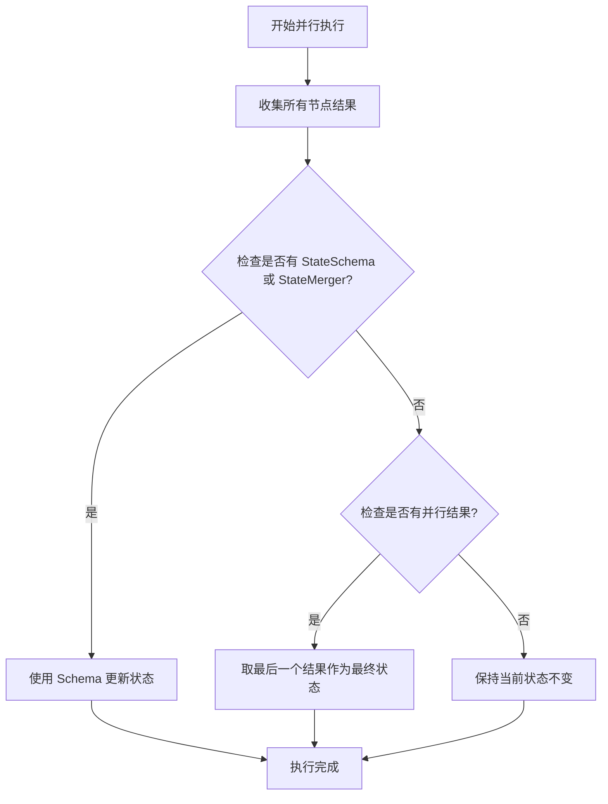
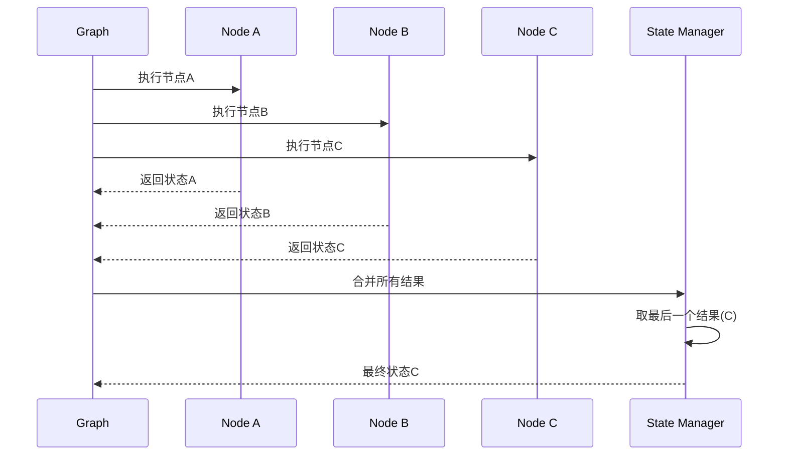
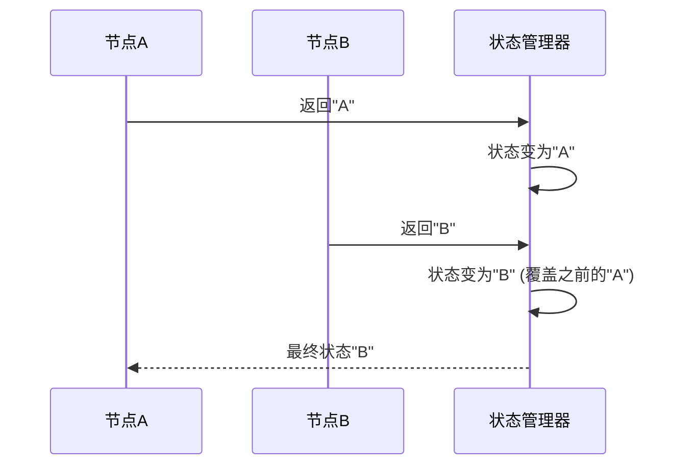
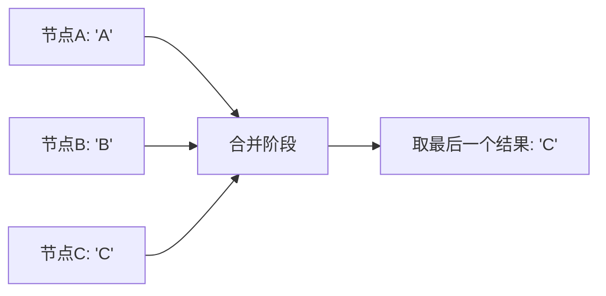

# 默认最后写入获胜策略

<cite>
**本文档引用的文件**
- [state_graph.go](file://graph/state_graph.go)
- [streaming_test.go](file://graph/streaming_test.go)
- [schema.go](file://graph/schema.go)
- [parallel.go](file://graph/parallel.go)
- [checkpointing.go](file://graph/checkpointing.go)
- [schema_test.go](file://graph/schema_test.go)
- [parallel_execution_test.go](file://graph/parallel_execution_test.go)
- [main.go](file://examples/state_schema/main.go)
</cite>

## 目录
1. [概述](#概述)
2. [默认合并策略原理](#默认合并策略原理)
3. [实现机制分析](#实现机制分析)
4. [测试用例验证](#测试用例验证)
5. [局限性分析](#局限性分析)
6. [最佳实践建议](#最佳实践建议)
7. [总结](#总结)

## 概述

在 langgraphgo 框架中，当既未定义 `StateSchema` 也未设置 `StateMerger` 函数时，默认采用"最后写入获胜"（Last Write Wins）合并策略。这种策略在并行执行场景下表现为：框架仅保留并行执行中最后一个完成的节点所返回的状态，而忽略其他节点的状态更新。

## 默认合并策略原理

### 核心机制

默认合并策略的实现位于状态图的执行流程中，具体体现在以下关键代码段：



**图表来源**
- [state_graph.go](file://graph/state_graph.go#L200-L220)

### 策略特点

1. **简单性**：无需复杂的合并逻辑，直接采用最后的结果
2. **确定性**：在相同条件下总是产生相同的结果
3. **性能优势**：避免了复杂的状态合并计算开销
4. **数据覆盖**：后续节点的结果会完全覆盖之前节点的结果

**章节来源**
- [state_graph.go](file://graph/state_graph.go#L200-L220)

## 实现机制分析

### 并行执行中的状态处理

在并行执行过程中，框架通过以下步骤处理状态合并：



**图表来源**
- [state_graph.go](file://graph/state_graph.go#L148-L166)

### 关键代码路径

默认合并策略的具体实现在状态合并逻辑中：

```mermaid
classDiagram
class StateGraph {
+Schema StateSchema
+stateMerger StateMerger
+InvokeWithConfig() interface{}
}
class StateMerger {
<<interface>>
+Merge(ctx, current, results) interface{}
}
class StateSchema {
<<interface>>
+Update(current, new) interface{}
}
StateGraph --> StateMerger : "使用"
StateGraph --> StateSchema : "使用"
```

**图表来源**
- [state_graph.go](file://graph/state_graph.go#L27-L32)

**章节来源**
- [state_graph.go](file://graph/state_graph.go#L200-L220)

## 测试用例验证

### 顺序执行测试

根据测试用例显示，在顺序执行场景下，后一个节点的状态会直接覆盖前一个节点的状态：



**图表来源**
- [streaming_test.go](file://graph/streaming_test.go#L48-L52)

### 并行执行测试

测试用例验证了在并行执行中，确实采用了最后写入获胜策略：



**图表来源**
- [parallel_execution_test.go](file://graph/parallel_execution_test.go#L98-L108)

**章节来源**
- [streaming_test.go](file://graph/streaming_test.go#L48-L66)
- [parallel_execution_test.go](file://graph/parallel_execution_test.go#L98-L158)

## 局限性分析

### 数据丢失风险

默认的最后写入获胜策略存在以下主要问题：

1. **信息丢失**：多个节点产生的有用信息可能被后面的节点覆盖
2. **不可预测性**：由于并行执行的不确定性，哪个节点的结果会被保留无法保证
3. **状态不完整**：无法累积多个节点的贡献，导致状态信息不完整

### 不适用场景

该策略不适合以下应用场景：

- **累积计算**：需要累加多个节点结果的场景
- **信息聚合**：需要汇总多个来源信息的场景  
- **状态追踪**：需要记录每个节点执行历史的场景
- **多源数据融合**：需要整合多个数据源的场景

### 性能影响

虽然默认策略在性能上具有优势，但在某些场景下可能导致：

- **重复计算**：需要重新计算被覆盖的信息
- **调试困难**：状态变化难以追溯和分析
- **维护成本**：状态管理变得复杂且容易出错

## 最佳实践建议

### 生产环境推荐方案

为了获得更好的状态管理和数据完整性，建议采用以下替代方案：

#### 使用 StateSchema

```mermaid
classDiagram
class MapSchema {
+Reducers map[string]Reducer
+Update(current, new) interface{}
+RegisterReducer(key, reducer)
}
class Reducer {
<<interface>>
+Reduce(current, new) interface{}
}
MapSchema --> Reducer : "使用"
```

**图表来源**
- [schema.go](file://graph/schema.go#L29-L100)

#### 使用 StateMerger

```mermaid
classDiagram
class StateMerger {
<<interface>>
+Merge(ctx, current, results) interface{}
}
class CustomMerger {
+Merge(ctx, current, results) interface{}
}
StateMerger <|.. CustomMerger
```

**图表来源**
- [state_graph.go](file://graph/state_graph.go#L27-L28)

### 推荐的合并策略

1. **累积策略**：使用自定义合并函数累积多个节点的结果
2. **优先级策略**：基于节点优先级选择最终状态
3. **条件合并**：根据特定条件决定如何合并状态
4. **版本控制**：引入版本号机制避免状态覆盖

### 实施建议

1. **评估需求**：根据应用需求选择合适的合并策略
2. **渐进迁移**：从默认策略逐步迁移到更精确的控制
3. **监控验证**：建立监控机制确保状态合并正确性
4. **文档记录**：详细记录状态结构和合并逻辑

**章节来源**
- [schema.go](file://graph/schema.go#L12-L19)
- [main.go](file://examples/state_schema/main.go#L28-L42)

## 总结

默认的最后写入获胜策略为 langgraphgo 提供了一个简单、高效的默认行为，特别适合对状态合并要求不高的简单应用场景。然而，在需要精确状态控制、信息累积或数据完整性的重要场景中，这种策略存在明显的局限性。

开发者应该根据具体的应用需求，考虑使用 `StateSchema` 或 `StateMerger` 来实现更精确的状态管理。这些高级功能提供了丰富的合并策略选项，能够满足复杂业务场景的需求，同时确保数据的完整性和可追溯性。

在生产环境中，建议始终显式地配置状态合并策略，而不是依赖默认的最后写入获胜策略，以避免潜在的数据丢失和状态不一致问题。