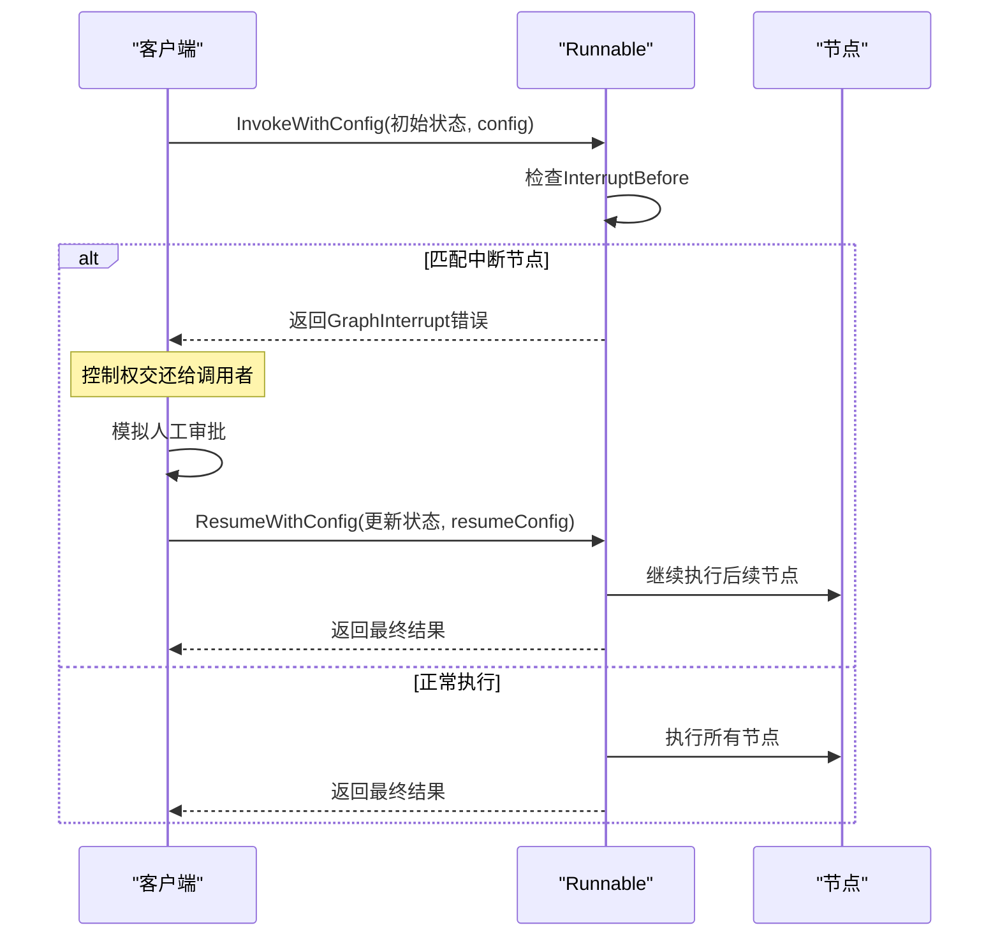
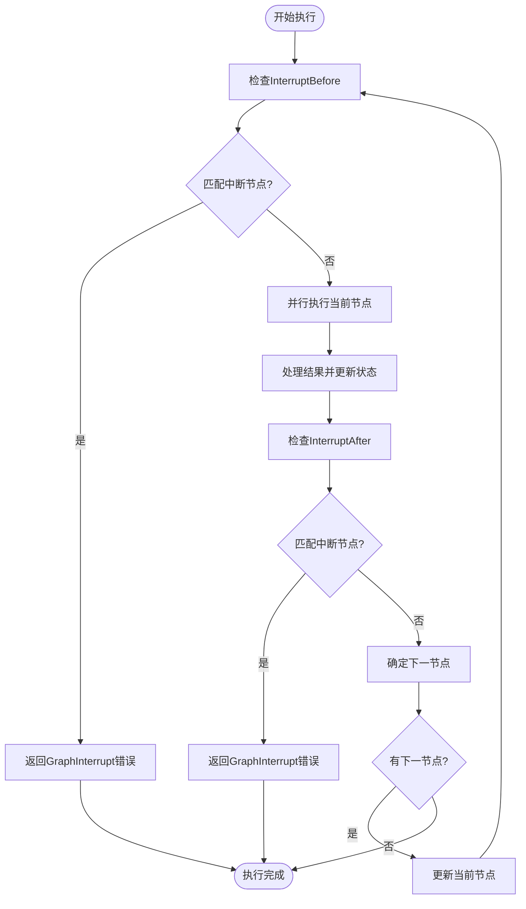

# 中断配置

<cite>
**本文档中引用的文件**  
- [main.go](file://examples/human_in_the_loop/main.go)
- [callbacks.go](file://graph/callbacks.go)
- [graph.go](file://graph/graph.go)
- [interrupt_test.go](file://graph/interrupt_test.go)
- [resume_test.go](file://graph/resume_test.go)
</cite>

## 目录
1. [简介](#简介)
2. [核心组件](#核心组件)
3. [中断配置机制](#中断配置机制)
4. [人在回路（HITL）实现](#人在回路hitl实现)
5. [执行流程分析](#执行流程分析)
6. [配置最佳实践](#配置最佳实践)
7. [常见使用场景](#常见使用场景)
8. [结论](#结论)

## 简介
本文档详细阐述了 langgraphgo 框架中基于配置的执行中断机制。重点分析 `Config` 结构体中的 `InterruptBefore` 和 `InterruptAfter` 字段如何在指定节点前或后自动暂停图的执行流程。通过 `examples/human_in_the_loop` 示例，说明如何实现人在回路（HITL）的审批流程，并描述 `InvokeWithConfig` 方法如何在执行循环中检查这些配置项并在匹配节点时立即返回 `GraphInterrupt` 错误，从而将控制权交还给调用者。

## 核心组件

**Section sources**
- [callbacks.go](file://graph/callbacks.go#L40-L70)
- [graph.go](file://graph/graph.go#L181-L490)

## 中断配置机制

`Config` 结构体定义了图执行过程中的各种配置选项，其中 `InterruptBefore` 和 `InterruptAfter` 是实现执行中断的核心字段。

```mermaid
classDiagram
class Config {
+Callbacks []CallbackHandler
+Metadata map[string]interface{}
+Tags []string
+Configurable map[string]interface{}
+RunName string
+Timeout *time.Duration
+InterruptBefore []string
+InterruptAfter []string
+ResumeFrom []string
+ResumeValue interface{}
}
class GraphInterrupt {
+Node string
+State interface{}
+InterruptValue interface{}
+NextNodes []string
}
class Runnable {
+InvokeWithConfig(ctx context.Context, initialState interface{}, config *Config) (interface{}, error)
}
Runnable --> Config : "使用"
Runnable --> GraphInterrupt : "返回"
Config --> GraphInterrupt : "触发"
```

**Diagram sources**
- [callbacks.go](file://graph/callbacks.go#L40-L70)
- [graph.go](file://graph/graph.go#L24-L37)

**Section sources**
- [callbacks.go](file://graph/callbacks.go#L40-L70)
- [graph.go](file://graph/graph.go#L181-L490)

## 人在回路HITL实现

通过 `examples/human_in_the_loop` 示例展示了如何使用 `InterruptBefore` 实现人在回路的审批流程。当设置 `InterruptBefore: []string{"human_approval"}` 时，图会在执行到 "human_approval" 节点前自动中断，等待人工审批。



**Diagram sources**
- [main.go](file://examples/human_in_the_loop/main.go#L67-L117)
- [graph.go](file://graph/graph.go#L237-L246)

**Section sources**
- [main.go](file://examples/human_in_the_loop/main.go#L67-L117)

## 执行流程分析

`InvokeWithConfig` 方法在执行循环中会检查当前节点是否匹配 `InterruptBefore` 或 `InterruptAfter` 配置。如果匹配，则立即返回 `GraphInterrupt` 错误，包含当前节点名、状态和可能的后续节点信息。



**Diagram sources**
- [graph.go](file://graph/graph.go#L237-L451)
- [interrupt_test.go](file://graph/interrupt_test.go#L31-L45)

**Section sources**
- [graph.go](file://graph/graph.go#L237-L451)

## 配置最佳实践

1. **明确中断点**：在配置 `InterruptBefore` 或 `InterruptAfter` 时，确保指定的节点名称准确无误。
2. **状态管理**：中断后应妥善保存当前状态，以便在恢复执行时使用。
3. **错误处理**：正确处理 `GraphInterrupt` 错误，提取必要的中断信息。
4. **恢复配置**：使用 `ResumeFrom` 字段指定恢复执行的起始节点。

**Section sources**
- [callbacks.go](file://graph/callbacks.go#L59-L66)
- [resume_test.go](file://graph/resume_test.go#L31-L81)

## 常见使用场景

- **审批流程**：在关键操作前插入人工审批节点
- **数据验证**：在数据处理流程中插入人工验证点
- **动态决策**：根据运行时条件动态决定是否中断
- **调试和测试**：在开发过程中暂停执行以检查状态

**Section sources**
- [main.go](file://examples/human_in_the_loop/main.go)
- [dynamic_interrupt/main.go](file://examples/dynamic_interrupt/main.go)

## 结论
langgraphgo 的中断配置机制为图执行提供了强大的控制能力。通过 `InterruptBefore` 和 `InterruptAfter` 配置，可以灵活地在指定节点前或后暂停执行流程，实现复杂的人机协作场景。结合 `ResumeFrom` 和 `ResumeValue` 配置，能够构建完整的中断-恢复工作流，满足各种实际应用需求。