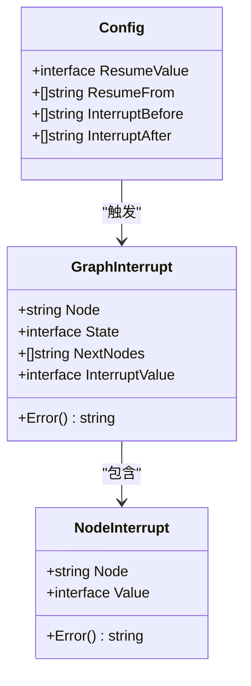
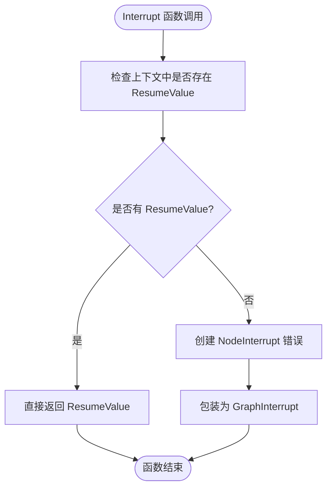
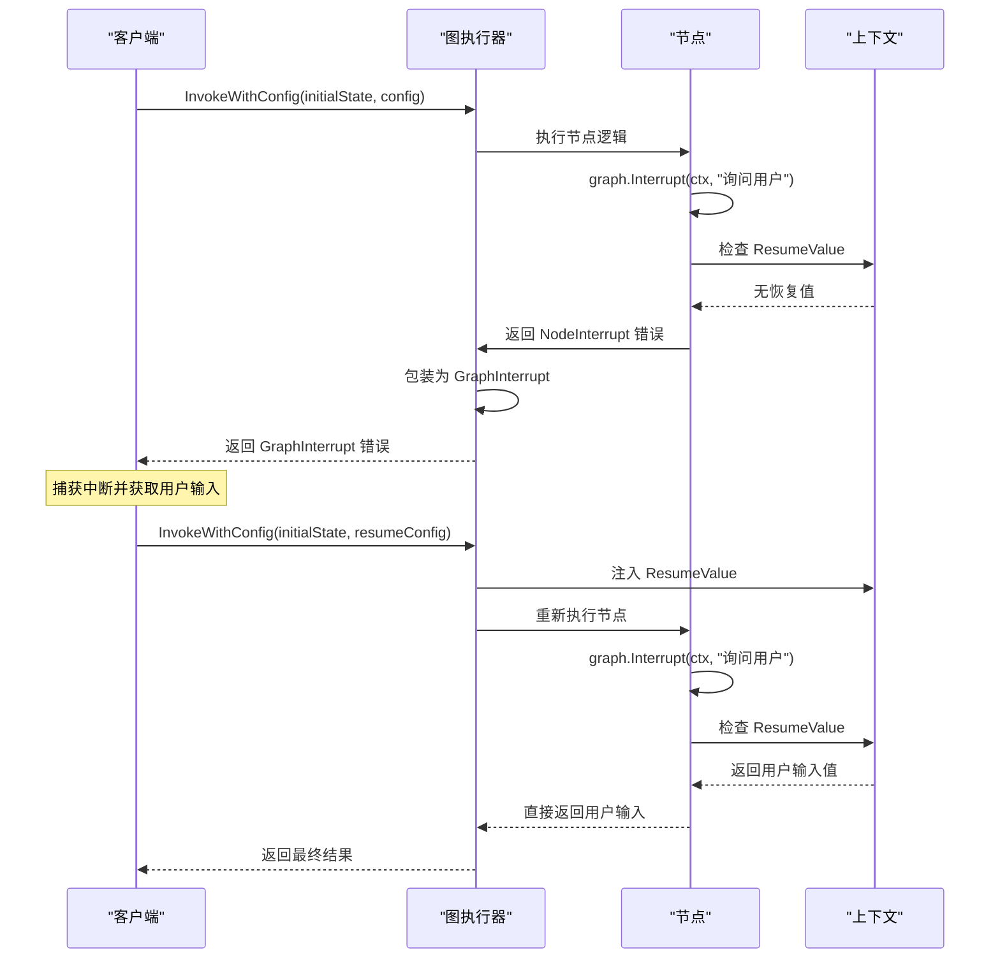
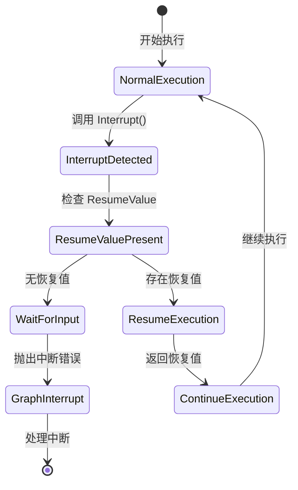
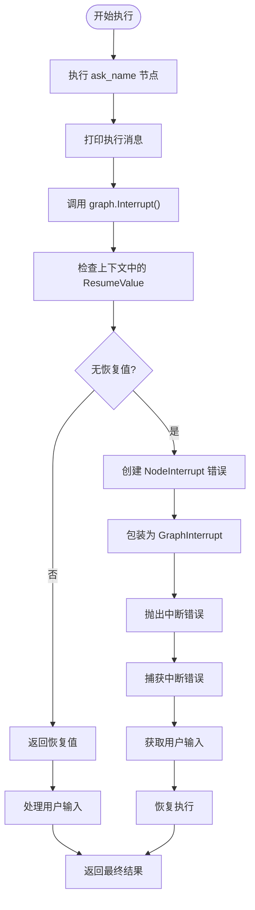
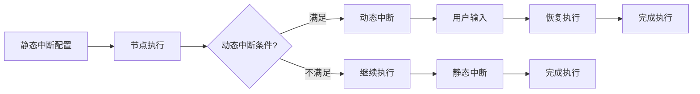
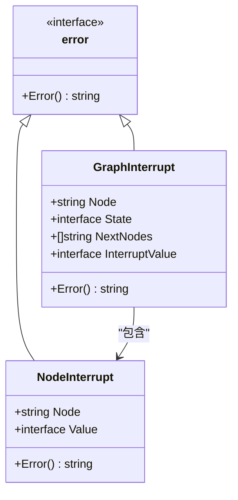

# 动态中断

<cite>
**本文档中引用的文件**
- [examples/dynamic_interrupt/main.go](file://examples/dynamic_interrupt/main.go)
- [examples/dynamic_interrupt/README.md](file://examples/dynamic_interrupt/README.md)
- [graph/graph.go](file://graph/graph.go)
- [graph/context.go](file://graph/context.go)
- [graph/errors.go](file://graph/errors.go)
- [graph/interrupt_test.go](file://graph/interrupt_test.go)
- [graph/resume_test.go](file://graph/resume_test.go)
- [graph/config.go](file://graph/config.go)
- [graph/state_graph.go](file://graph/state_graph.go)
</cite>

## 目录
1. [简介](#简介)
2. [核心概念](#核心概念)
3. [函数实现详解](#函数实现详解)
4. [工作流程分析](#工作流程分析)
5. [代码示例解析](#代码示例解析)
6. [与静态中断的对比](#与静态中断的对比)
7. [错误处理机制](#错误处理机制)
8. [最佳实践](#最佳实践)
9. [故障排除指南](#故障排除指南)
10. [总结](#总结)

## 简介

动态中断（Dynamic Interrupt）是 LangGraphGo 中的一项强大功能，允许节点在运行时暂停执行并等待外部输入。与传统的静态中断配置不同，动态中断的决策可以在节点逻辑内部做出，为构建交互式工作流提供了更大的灵活性。

动态中断的核心价值在于：
- **运行时决策能力**：节点可以根据当前状态或条件决定是否需要中断
- **灵活的交互模式**：支持与人类用户或其他外部系统的实时交互
- **无缝的恢复机制**：提供完整的中断-恢复循环支持

## 核心概念

### graph.Interrupt 函数

`graph.Interrupt(ctx, value)` 是动态中断功能的核心函数，具有以下双重行为：

1. **首次调用**：当 `ctx` 中不存在 `ResumeValue` 时，函数会返回一个 `NodeInterrupt` 错误
2. **恢复调用**：当 `ctx` 中存在 `ResumeValue` 时，函数会直接返回该值并继续执行

### 关键数据结构



**图表来源**
- [graph/graph.go](file://graph/graph.go#L24-L41)
- [graph/errors.go](file://graph/errors.go#L5-L15)
- [graph/config.go](file://graph/config.go#L40-L70)

### 上下文管理

动态中断依赖于特殊的上下文键来存储恢复值：

```mermaid
classDiagram
class resumeValueKey {
<<struct>>
}
class ContextFunctions {
+WithResumeValue(ctx, value) context.Context
+GetResumeValue(ctx) interface{}
}
ContextFunctions --> resumeValueKey : "使用"
```

**图表来源**
- [graph/context.go](file://graph/context.go#L5-L16)

**章节来源**
- [examples/dynamic_interrupt/README.md](file://examples/dynamic_interrupt/README.md#L1-L15)
- [graph/graph.go](file://graph/graph.go#L43-L50)

## 函数实现详解

### graph.Interrupt 实现

`graph.Interrupt` 函数的实现非常简洁但功能强大：



**图表来源**
- [graph/graph.go](file://graph/graph.go#L45-L49)

### 内部执行机制

当节点调用 `graph.Interrupt(ctx, value)` 时，系统会经历以下步骤：

1. **上下文检查**：通过 `GetResumeValue(ctx)` 检查是否存在恢复值
2. **条件判断**：根据是否存在恢复值决定执行路径
3. **错误包装**：如果需要中断，将 `NodeInterrupt` 包装成 `GraphInterrupt`

**章节来源**
- [graph/graph.go](file://graph/graph.go#L43-L50)

## 工作流程分析

### 完整的中断-恢复流程



**图表来源**
- [examples/dynamic_interrupt/main.go](file://examples/dynamic_interrupt/main.go#L40-L76)
- [graph/graph.go](file://graph/graph.go#L180-L202)

### 执行状态转换



**章节来源**
- [graph/graph.go](file://graph/graph.go#L240-L342)

## 代码示例解析

### 基本使用模式

在节点内部使用动态中断的标准模式：

```go
// 节点函数中的典型中断使用
func nodeFunction(ctx context.Context, state interface{}) (interface{}, error) {
    // 业务逻辑处理
    
    // 请求用户输入
    userInput, err := graph.Interrupt(ctx, "请输入您的姓名：")
    if err != nil {
        return nil, err // 传播中断错误
    }
    
    // 使用用户输入继续处理
    return processWithInput(userInput), nil
}
```

### 完整示例分析

以 `examples/dynamic_interrupt` 中的示例为例：



**图表来源**
- [examples/dynamic_interrupt/main.go](file://examples/dynamic_interrupt/main.go#L17-L30)

### 配置和恢复

动态中断的配置主要通过 `Config` 结构体中的 `ResumeValue` 字段：

```go
// 初始执行配置
config := &graph.Config{
    ResumeValue: nil, // 第一次执行时为空
}

// 恢复执行配置
resumeConfig := &graph.Config{
    ResumeValue: "Alice", // 用户提供的输入值
    ResumeFrom:  []string{"ask_name"}, // 从指定节点恢复
}
```

**章节来源**
- [examples/dynamic_interrupt/main.go](file://examples/dynamic_interrupt/main.go#L1-L78)

## 与静态中断的对比

### 静态中断 vs 动态中断

| 特性 | 静态中断 (InterruptBefore/After) | 动态中断 (graph.Interrupt) |
|------|----------------------------------|---------------------------|
| **决策时机** | 配置时确定 | 运行时动态决定 |
| **灵活性** | 固定的节点列表 | 基于节点逻辑的条件判断 |
| **使用场景** | 预设的检查点 | 条件性的用户交互 |
| **实现复杂度** | 配置简单 | 需要在节点逻辑中添加判断 |
| **控制粒度** | 节点级别 | 节点内任意位置 |

### 互补关系

动态中断与静态中断可以协同工作：



**章节来源**
- [graph/interrupt_test.go](file://graph/interrupt_test.go#L1-L51)
- [graph/resume_test.go](file://graph/resume_test.go#L1-L81)

## 错误处理机制

### 错误类型层次



**图表来源**
- [graph/graph.go](file://graph/graph.go#L24-L41)
- [graph/errors.go](file://graph/errors.go#L5-L15)

### 错误处理流程

系统在处理中断错误时遵循以下流程：

1. **节点级中断**：单个节点触发中断时，创建 `NodeInterrupt`
2. **错误包装**：将 `NodeInterrupt` 包装成 `GraphInterrupt`，包含更多上下文信息
3. **错误传播**：通过错误链向上传播，最终由执行器处理

**章节来源**
- [graph/graph.go](file://graph/graph.go#L292-L332)
- [graph/errors.go](file://graph/errors.go#L1-L15)

## 最佳实践

### 1. 中断条件设计

```go
// 推荐：基于业务逻辑的条件判断
func conditionalNode(ctx context.Context, state interface{}) (interface{}, error) {
    // 分析当前状态
    if needsUserInput(state) {
        input, err := graph.Interrupt(ctx, "请提供必要的信息：")
        if err != nil {
            return nil, err
        }
        return processWithInput(input), nil
    }
    
    // 正常业务逻辑
    return normalProcessing(state), nil
}
```

### 2. 错误处理策略

```go
// 推荐：适当的错误处理
func robustNode(ctx context.Context, state interface{}) (interface{}, error) {
    result, err := graph.Interrupt(ctx, "操作确认")
    if err != nil {
        var nodeInterrupt *graph.NodeInterrupt
        if errors.As(err, &nodeInterrupt) {
            // 处理中断情况
            return handleInterrupt(nodeInterrupt), nil
        }
        // 其他错误处理
        return nil, fmt.Errorf("节点执行失败: %w", err)
    }
    
    return result, nil
}
```

### 3. 配置管理

```go
// 推荐：清晰的配置结构
type ExecutionConfig struct {
    InitialState interface{}
    UserInput    string
    ResumeFrom   []string
}

func executeWithConfig(cfg ExecutionConfig) (interface{}, error) {
    config := &graph.Config{
        ResumeValue: cfg.UserInput,
        ResumeFrom:  cfg.ResumeFrom,
    }
    
    return runnable.InvokeWithConfig(context.Background(), cfg.InitialState, config)
}
```

## 故障排除指南

### 常见问题及解决方案

#### 1. 中断未生效

**问题**：调用了 `graph.Interrupt()` 但程序没有中断

**原因**：
- 在恢复执行时没有正确设置 `ResumeValue`
- 节点逻辑中没有正确处理中断错误

**解决方案**：
```go
// 确保正确处理中断错误
result, err := graph.Interrupt(ctx, "提示信息")
if err != nil {
    // 检查是否是中断错误
    var interrupt *graph.NodeInterrupt
    if errors.As(err, &interrupt) {
        // 处理中断情况
        return handleInterrupt(interrupt), nil
    }
    return nil, err
}
```

#### 2. 恢复值不匹配

**问题**：设置了 `ResumeValue` 但节点没有使用

**原因**：
- `ResumeValue` 设置在错误的配置中
- 节点名称不匹配

**解决方案**：
```go
// 确保配置正确
config := &graph.Config{
    ResumeValue: "期望的值",
    ResumeFrom:  []string{"正确的节点名"}, // 必须匹配
}
```

#### 3. 类型转换错误

**问题**：恢复值类型不匹配

**原因**：`ResumeValue` 的类型与预期不符

**解决方案**：
```go
// 明确类型转换
result, err := graph.Interrupt(ctx, "提示信息")
if err == nil {
    // 确保类型安全
    typedResult, ok := result.(string)
    if !ok {
        return nil, fmt.Errorf("恢复值类型不匹配: %T", result)
    }
    return processString(typedResult), nil
}
```

### 调试技巧

1. **启用跟踪日志**：使用 `SetTracer` 记录执行过程
2. **检查上下文**：验证 `ResumeValue` 是否正确注入
3. **验证节点名称**：确保恢复时使用的节点名称正确

**章节来源**
- [graph/graph.go](file://graph/graph.go#L180-L202)

## 总结

动态中断功能为 LangGraphGo 提供了强大的运行时交互能力。通过 `graph.Interrupt(ctx, value)` 函数，开发者可以在节点逻辑内部实现灵活的中断决策，支持复杂的交互式工作流。

### 核心优势

1. **运行时灵活性**：基于节点状态和业务逻辑的动态决策
2. **无缝集成**：与现有执行模型完美兼容
3. **类型安全**：完整的错误处理和类型检查机制
4. **可扩展性**：支持复杂的恢复和重试逻辑

### 应用场景

- **用户交互**：需要用户输入或确认的工作流
- **条件检查**：基于业务规则的决策点
- **调试支持**：开发和测试阶段的交互式调试
- **人工审核**：需要人工干预的关键决策点

动态中断功能与静态中断配置形成互补，共同构成了 LangGraphGo 强大的中断处理体系，为构建复杂的、交互式的自动化工作流提供了坚实的基础。