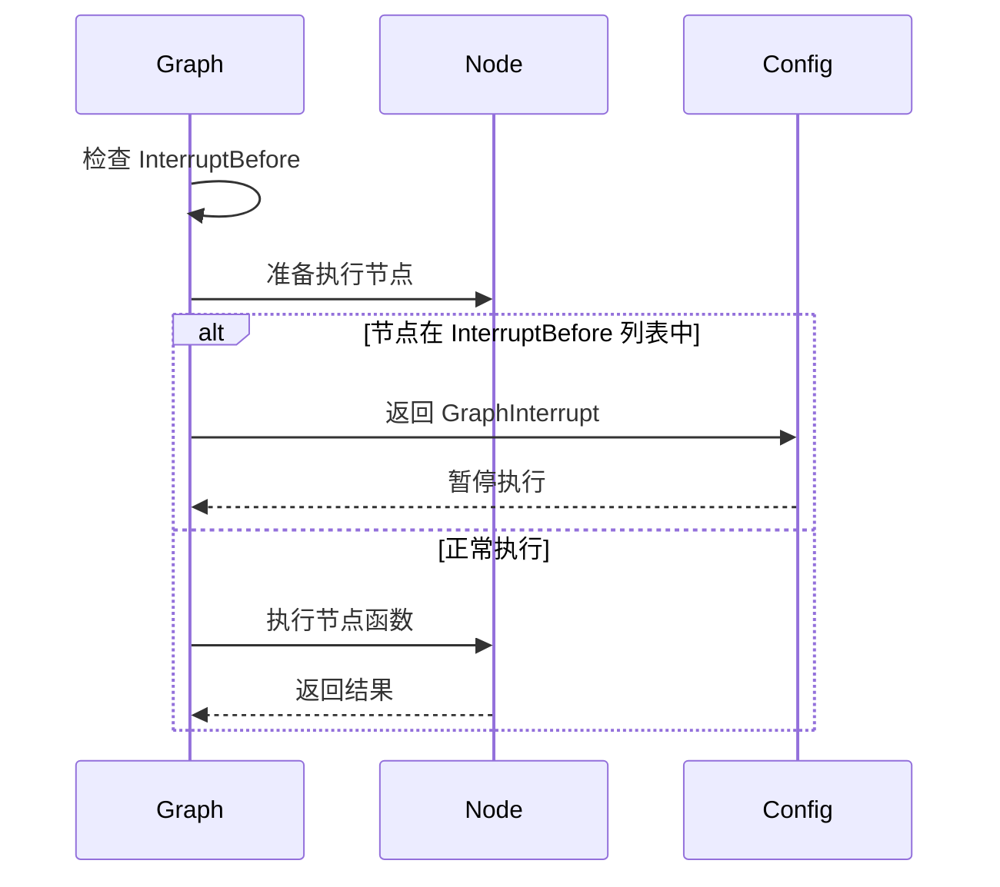
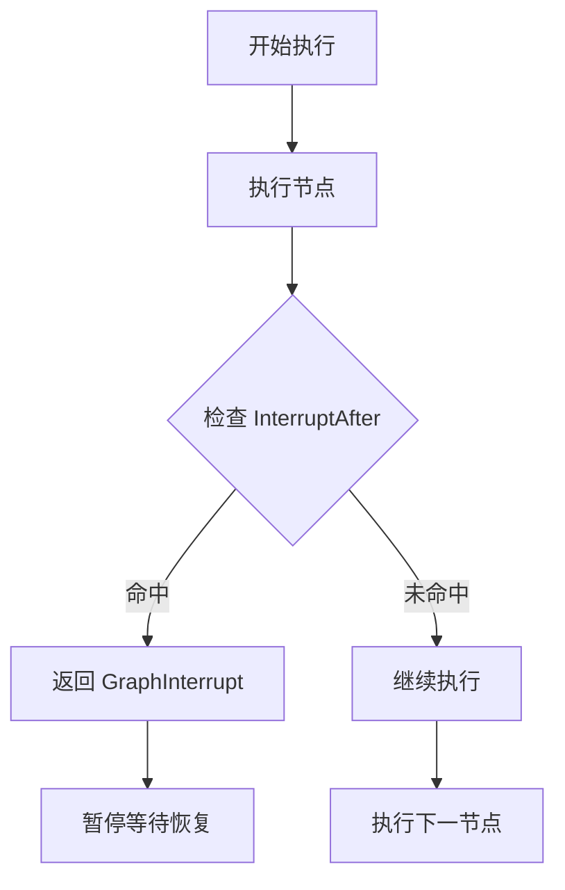
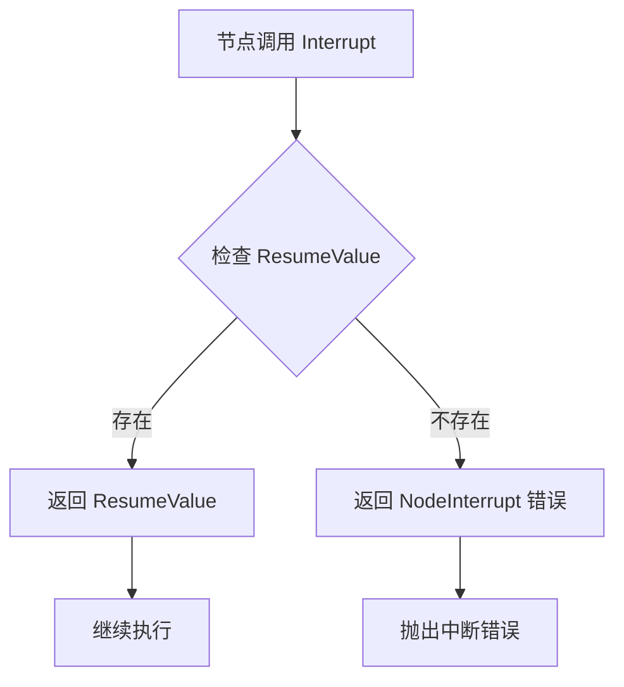
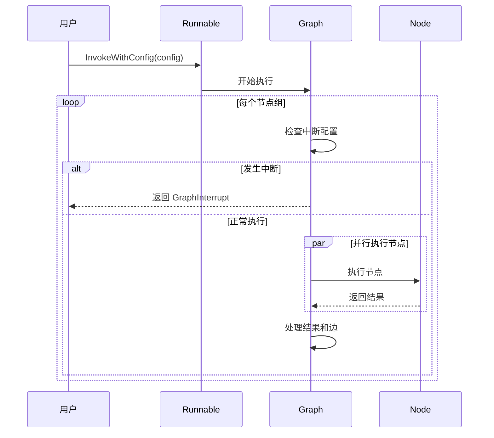
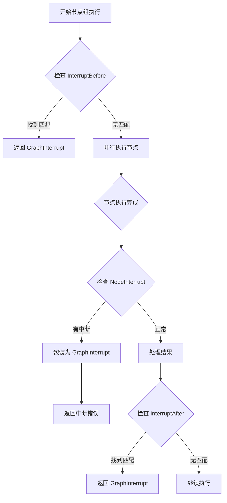
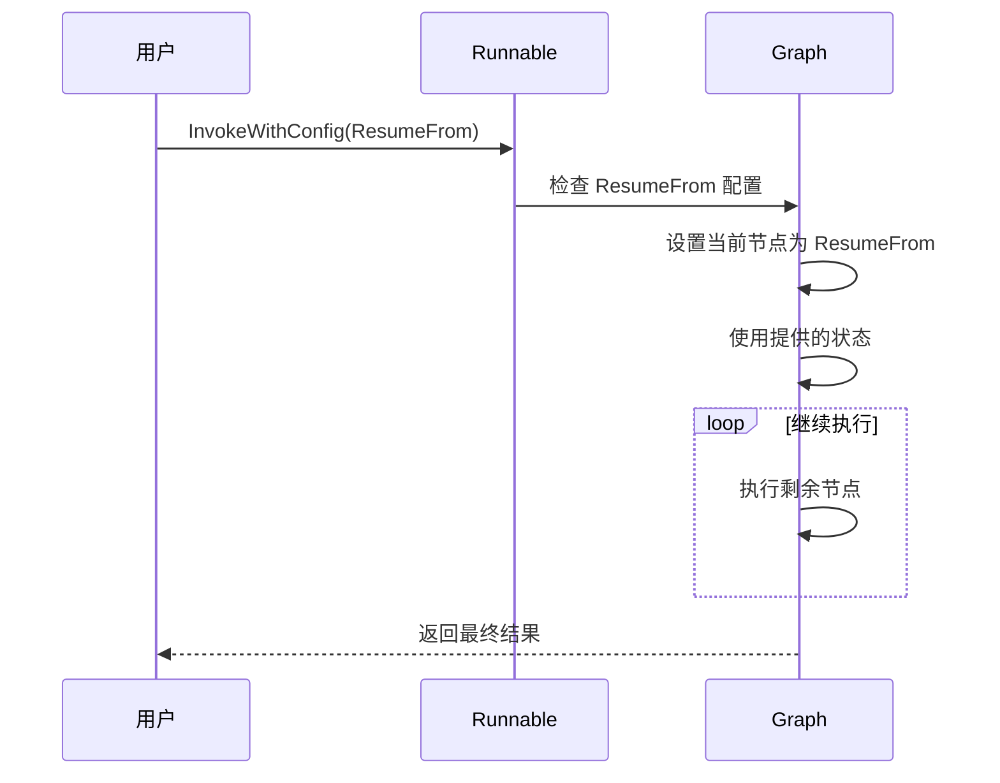
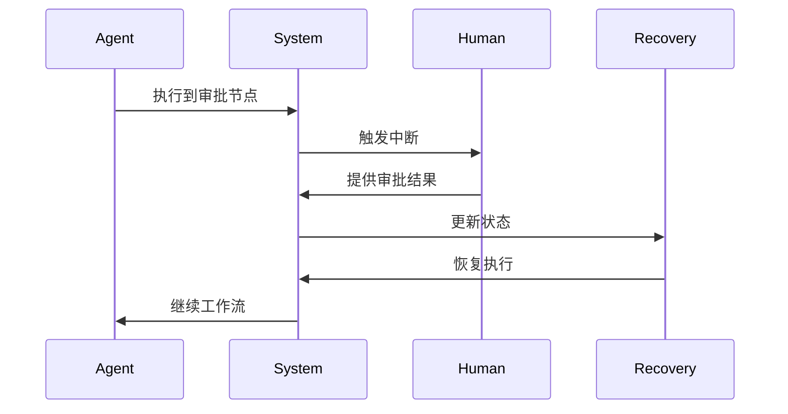
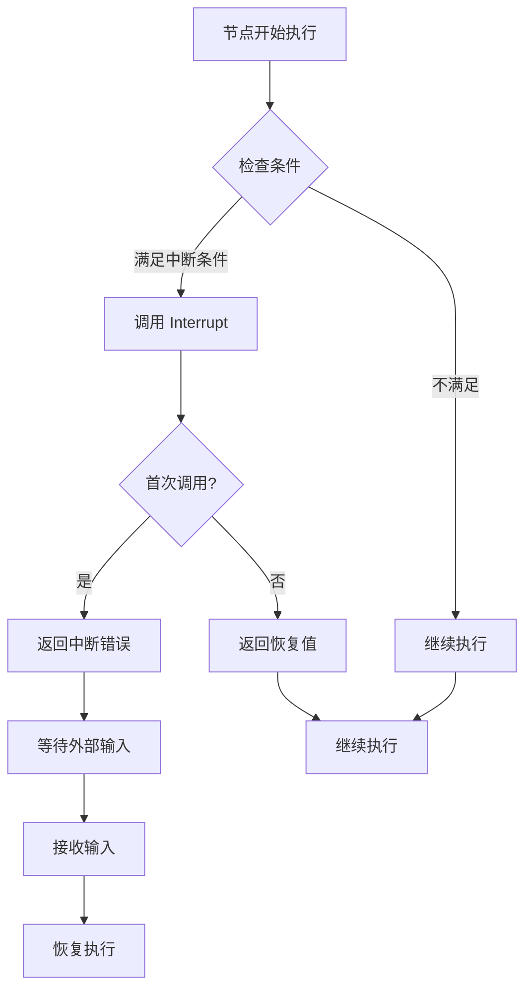
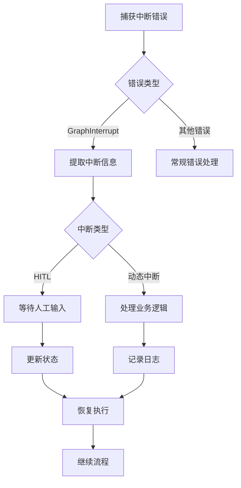

# 执行中断

<cite>
**本文档中引用的文件**
- [graph.go](file://graph/graph.go)
- [errors.go](file://graph/errors.go)
- [config.go](file://graph/config.go)
- [context.go](file://graph/context.go)
- [main.go](file://examples/dynamic_interrupt/main.go)
- [main.go](file://examples/human_in_the_loop/main.go)
- [interrupt_test.go](file://graph/interrupt_test.go)
- [resume_test.go](file://graph/resume_test.go)
- [schema.go](file://graph/schema.go)
</cite>

## 目录
1. [简介](#简介)
2. [核心错误类型](#核心错误类型)
3. [中断配置机制](#中断配置机制)
4. [动态中断机制](#动态中断机制)
5. [执行流程控制](#执行流程控制)
6. [恢复机制](#恢复机制)
7. [应用场景](#应用场景)
8. [最佳实践](#最佳实践)
9. [总结](#总结)

## 简介

LangGraphGo 的执行中断机制是一个强大的工作流控制特性，允许在图执行过程中暂停和恢复执行。这种机制支持人在回路（Human-in-the-Loop, HITL）工作流、动态决策点和交互式应用开发。通过 `GraphInterrupt` 错误类型和相关的配置选项，开发者可以精确控制执行流程，在关键节点暂停以等待外部输入或进行人工干预。

## 核心错误类型

### GraphInterrupt 错误类型

`GraphInterrupt` 是 LangGraphGo 中表示执行中断状态的核心错误类型。它包含了中断发生时的完整上下文信息。

```mermaid
classDiagram
class GraphInterrupt {
+string Node
+interface{} State
+[]string NextNodes
+interface{} InterruptValue
+Error() string
}
class NodeInterrupt {
+string Node
+interface{} Value
+Error() string
}
GraphInterrupt --> NodeInterrupt : "包含"
```

**图表来源**
- [graph.go](file://graph/graph.go#L24-L41)
- [errors.go](file://graph/errors.go#L5-L15)

#### 字段详解

| 字段 | 类型 | 描述 |
|------|------|------|
| `Node` | `string` | 引发中断的节点名称 |
| `State` | `interface{}` | 中断发生时的完整状态 |
| `NextNodes` | `[]string` | 如果是 `InterruptAfter`，包含下一个要执行的节点列表 |
| `InterruptValue` | `interface{}` | 动态中断时提供的值 |

**章节来源**
- [graph.go](file://graph/graph.go#L24-L41)

### NodeInterrupt 错误类型

`NodeInterrupt` 表示节点级别的中断请求，通常用于动态中断场景。

**章节来源**
- [errors.go](file://graph/errors.go#L5-L15)

## 中断配置机制

### InterruptBefore 配置

`InterruptBefore` 允许在特定节点执行之前暂停执行，实现预检查机制。



**图表来源**
- [graph.go](file://graph/graph.go#L238-L246)

#### 使用示例

```go
config := &Config{
    InterruptBefore: []string{"human_approval"},
}
res, err := runnable.InvokeWithConfig(ctx, state, config)
```

**章节来源**
- [main.go](file://examples/human_in_the_loop/main.go#L69-L71)

### InterruptAfter 配置

`InterruptAfter` 在节点执行完成后暂停，允许检查节点输出后再决定是否继续。



**图表来源**
- [graph.go](file://graph/graph.go#L439-L451)

**章节来源**
- [resume_test.go](file://graph/resume_test.go#L33-L35)

## 动态中断机制

### Interrupt 函数

`Interrupt` 函数是节点内部实现动态中断的核心工具，允许节点在运行时决定是否暂停执行。



**图表来源**
- [graph.go](file://graph/graph.go#L45-L49)
- [context.go](file://graph/context.go#L8-L16)

#### 实现机制

动态中断通过以下步骤实现：

1. **检查恢复值**：首先检查上下文中是否存在 `ResumeValue`
2. **条件判断**：如果存在恢复值，直接返回该值
3. **错误生成**：否则返回 `NodeInterrupt` 错误

**章节来源**
- [graph.go](file://graph/graph.go#L45-L49)

### 动态中断示例

```go
func nodeWithInterrupt(ctx context.Context, state interface{}) (interface{}, error) {
    // 节点逻辑
    name, err := graph.Interrupt(ctx, "What is your name?")
    if err != nil {
        return nil, err // 传播中断
    }
    // 使用输入继续执行
    return fmt.Sprintf("Hello, %v!", name), nil
}
```

**章节来源**
- [main.go](file://examples/dynamic_interrupt/main.go#L17-L30)

## 执行流程控制

### InvokeWithConfig 方法

`InvokeWithConfig` 是处理中断的核心方法，负责协调整个执行流程。



**图表来源**
- [graph.go](file://graph/graph.go#L182-L491)

### 中断检测流程



**图表来源**
- [graph.go](file://graph/graph.go#L238-L246)
- [graph.go](file://graph/graph.go#L292-L332)
- [graph.go](file://graph/graph.go#L439-L451)

**章节来源**
- [graph.go](file://graph/graph.go#L182-L491)

## 恢复机制

### ResumeFrom 配置

`ResumeFrom` 配置允许从特定节点重新开始执行，支持复杂的恢复场景。

```mermaid
classDiagram
class Config {
+[]string ResumeFrom
+interface{} ResumeValue
+[]string InterruptBefore
+[]string InterruptAfter
+[]CallbackHandler Callbacks
+[]string Tags
+map[string]interface{} Metadata
}
class ResumeMechanism {
+checkResumeFrom() bool
+prepareResumeState() interface{}
+restoreExecution() error
}
Config --> ResumeMechanism : "使用"
```

**图表来源**
- [config.go](file://graph/config.go)
- [context.go](file://graph/context.go#L8-L16)

### 恢复流程



**图表来源**
- [graph.go](file://graph/graph.go#L186-L189)
- [resume_test.go](file://graph/resume_test.go#L49-L51)

### 状态恢复策略

| 恢复类型 | 策略 | 适用场景 |
|----------|------|----------|
| 完整状态恢复 | 使用中断时的完整状态 | 保持执行上下文连续性 |
| 部分状态更新 | 只更新特定字段 | 优化内存使用 |
| 状态验证 | 检查状态完整性 | 确保数据一致性 |

**章节来源**
- [resume_test.go](file://graph/resume_test.go#L46-L55)

## 应用场景

### 人在回路 (HITL) 工作流

HITL 是执行中断机制最重要的应用场景之一。



**图表来源**
- [main.go](file://examples/human_in_the_loop/main.go#L68-L118)

#### HITL 实现模式

1. **预检查模式**：在关键操作前暂停，等待人工确认
2. **后检查模式**：在操作完成后检查结果，决定是否继续
3. **混合模式**：结合预检查和后检查的优势

**章节来源**
- [main.go](file://examples/human_in_the_loop/main.go#L68-L118)

### 动态决策点

动态中断允许节点根据运行时条件决定是否暂停。



**图表来源**
- [main.go](file://examples/dynamic_interrupt/main.go#L17-L30)

**章节来源**
- [main.go](file://examples/dynamic_interrupt/main.go#L17-L50)

### 交互式应用

执行中断机制支持构建高度交互式的 AI 应用。

| 应用类型 | 中断策略 | 用户体验特点 |
|----------|----------|--------------|
| 对话系统 | 动态中断 | 实时响应用户输入 |
| 内容审核 | 预检查中断 | 人工审核关键内容 |
| 自动化流程 | 分阶段中断 | 渐进式权限授予 |
| 数据处理 | 后检查中断 | 结果验证和修正 |

## 最佳实践

### 中断设计原则

1. **最小化中断频率**：只在必要时中断，避免过度打断执行流程
2. **清晰的中断原因**：提供明确的中断信息，便于理解和处理
3. **优雅的恢复机制**：确保中断后能正确恢复执行
4. **状态完整性保护**：维护中断前后状态的一致性

### 错误处理策略



### 性能优化建议

1. **合理使用并发**：在中断检测前避免不必要的并发操作
2. **状态序列化**：对于复杂状态，考虑序列化存储以减少内存占用
3. **中断点选择**：选择合适的中断点，平衡灵活性和性能

**章节来源**
- [interrupt_test.go](file://graph/interrupt_test.go#L10-L63)

## 总结

LangGraphGo 的执行中断机制提供了一个强大而灵活的工作流控制框架。通过 `GraphInterrupt` 错误类型、`InterruptBefore`/`InterruptAfter` 配置和动态中断函数 `Interrupt`，开发者可以构建复杂的交互式和可调试的应用程序。

### 核心优势

1. **精确控制**：支持在任意节点精确暂停执行
2. **灵活恢复**：提供多种恢复策略和配置选项
3. **人机协作**：天然支持人在回路工作流
4. **动态决策**：允许节点根据运行时条件做出中断决策

### 技术特点

- **类型安全**：通过专门的错误类型区分不同类型的中断
- **状态保持**：完整保存中断时的执行状态
- **并发友好**：支持并行执行中的中断处理
- **扩展性强**：可与其他 LangGraphGo 特性无缝集成

执行中断机制是 LangGraphGo 架构中的重要组成部分，为构建智能、灵活和可交互的 AI 应用提供了坚实的基础。