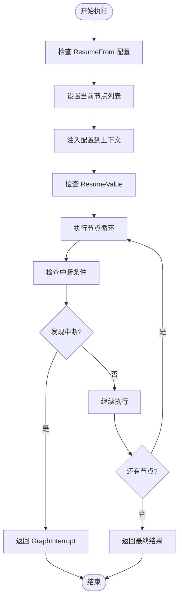
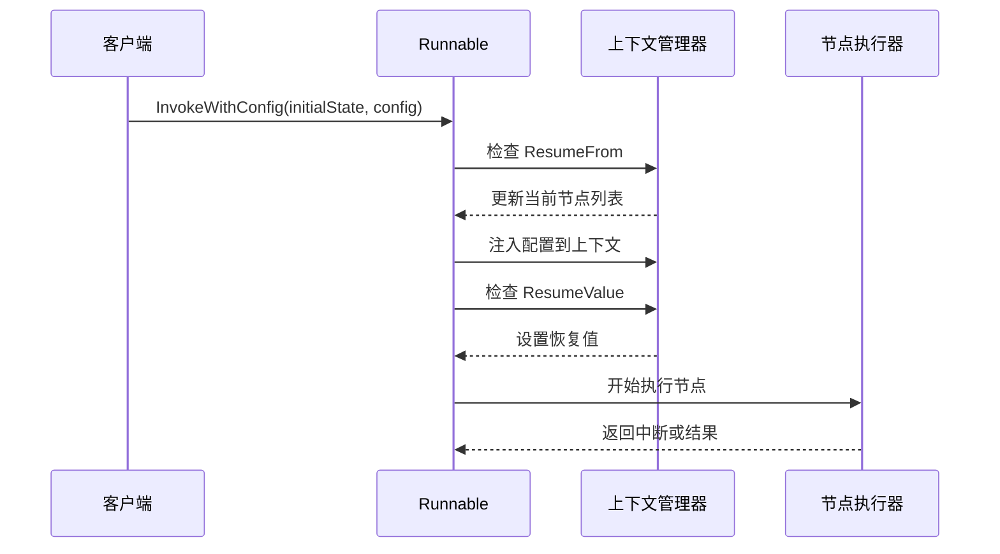
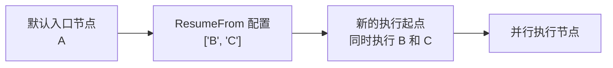
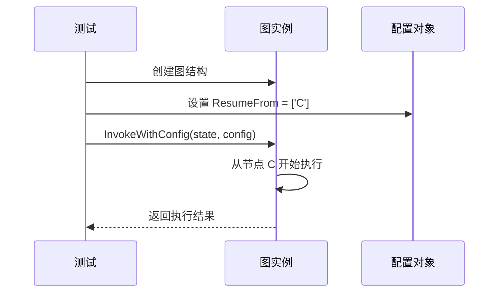
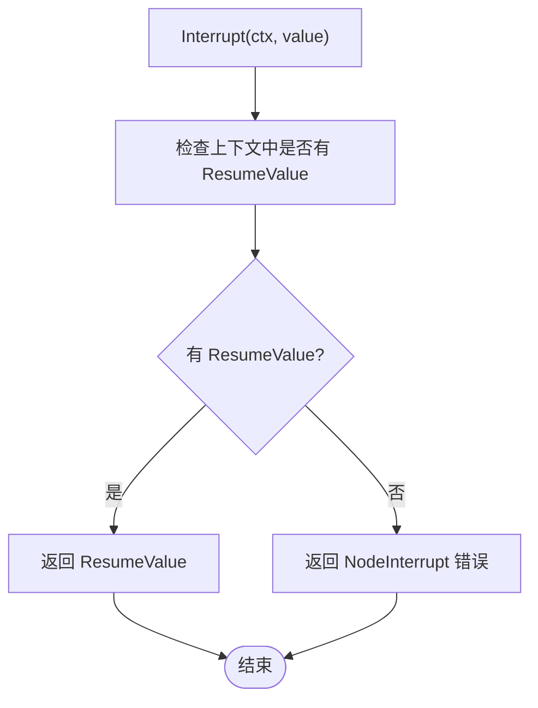
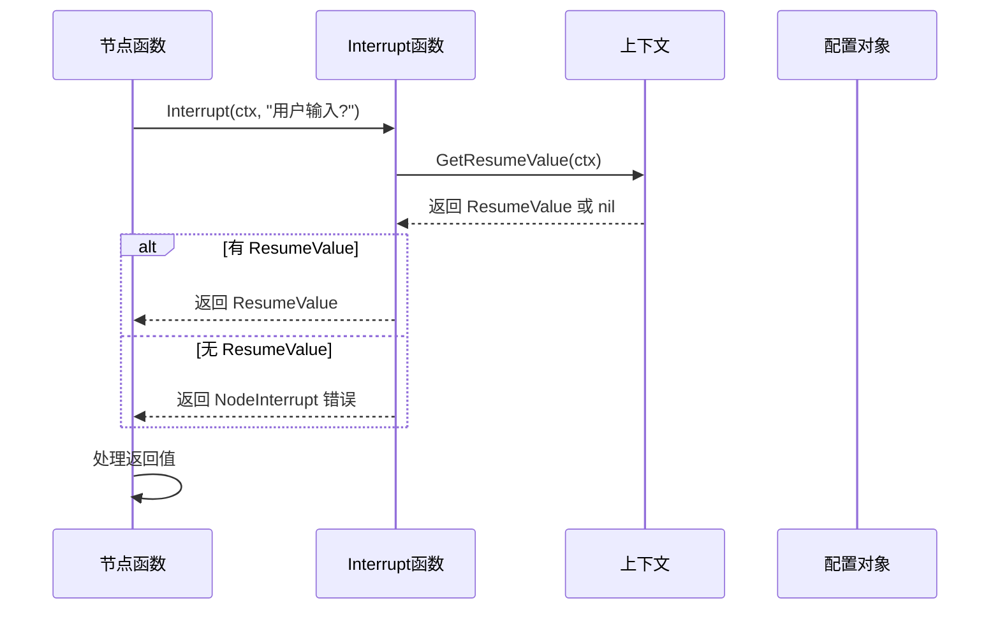
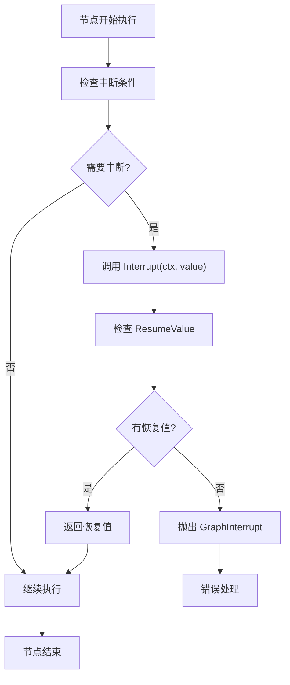
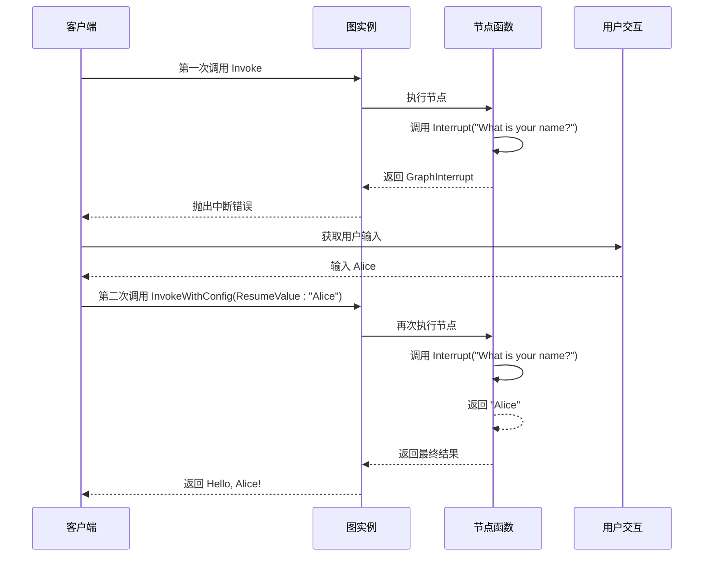
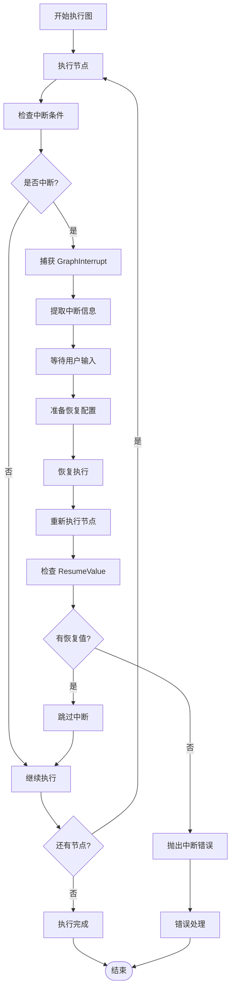
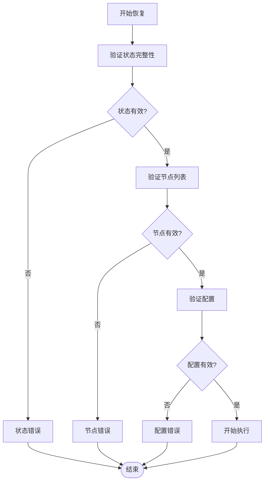

# 状态恢复

<cite>
**本文档中引用的文件**
- [graph.go](file://graph/graph.go)
- [context.go](file://graph/context.go)
- [errors.go](file://graph/errors.go)
- [interrupt_test.go](file://graph/interrupt_test.go)
- [resume_test.go](file://graph/resume_test.go)
- [config_test.go](file://graph/config_test.go)
- [main.go](file://examples/dynamic_interrupt/main.go)
- [state_graph.go](file://graph/state_graph.go)
- [checkpointing.go](file://graph/checkpointing.go)
</cite>

## 目录
1. [简介](#简介)
2. [核心概念](#核心概念)
3. [InvokeWithConfig 方法详解](#invokewithconfig-方法详解)
4. [ResumeFrom 字段机制](#resumefrom-字段机制)
5. [ResumeValue 字段机制](#resumevalue-字段机制)
6. [动态中断与恢复](#动态中断与恢复)
7. [完整工作流程](#完整工作流程)
8. [错误处理与恢复](#错误处理与恢复)
9. [最佳实践](#最佳实践)
10. [总结](#总结)

## 简介

langgraphgo 的状态恢复机制是一个强大的功能，允许在图执行过程中中断并恢复执行。这种机制通过 `InvokeWithConfig` 方法实现，支持两种主要的恢复方式：基于节点列表的恢复（ResumeFrom）和基于上下文注入的恢复（ResumeValue）。该机制为构建可中断、可恢复的复杂工作流提供了基础。

## 核心概念

### GraphInterrupt 错误类型

状态恢复的核心是 `GraphInterrupt` 错误类型，它包含了执行中断时的所有必要信息：

```mermaid
classDiagram
class GraphInterrupt {
+string Node
+interface{} State
+[]string NextNodes
+interface{} InterruptValue
+Error() string
}
class NodeInterrupt {
+string Node
+interface{} Value
+Error() string
}
GraphInterrupt --> NodeInterrupt : "继承"
```

**图表来源**
- [graph.go](file://graph/graph.go#L24-L41)
- [errors.go](file://graph/errors.go#L5-L15)

### 配置结构

恢复机制依赖于 `Config` 结构体中的两个关键字段：

| 字段名 | 类型 | 描述 | 用途 |
|--------|------|------|------|
| `ResumeFrom` | `[]string` | 指定恢复执行的起始节点列表 | 控制从哪些节点开始重新执行 |
| `ResumeValue` | `interface{}` | 提供给中断函数的恢复值 | 实现动态中断的续传 |

**节来源**
- [graph.go](file://graph/graph.go#L40-L70)

## InvokeWithConfig 方法详解

`InvokeWithConfig` 是状态恢复机制的核心方法，它扩展了基本的 `Invoke` 方法，增加了对恢复功能的支持。

### 方法签名

```go
func (r *Runnable) InvokeWithConfig(ctx context.Context, initialState interface{}, config *Config) (interface{}, error)
```

### 恢复流程的关键步骤



**图表来源**
- [graph.go](file://graph/graph.go#L180-L491)

### 恢复上下文的建立

在方法开始时，系统会根据配置建立恢复上下文：



**图表来源**
- [graph.go](file://graph/graph.go#L182-L202)

**节来源**
- [graph.go](file://graph/graph.go#L180-L202)

## ResumeFrom 字段机制

`ResumeFrom` 字段指定了恢复执行的起始节点列表，这是状态恢复的核心机制之一。

### 基本工作原理

当 `ResumeFrom` 字段不为空时，系统会使用该字段指定的节点列表替换默认的入口节点：



**图表来源**
- [graph.go](file://graph/graph.go#L186-L189)

### 使用场景

1. **部分失败恢复**：从失败的节点重新开始执行
2. **条件分支恢复**：跳过某些不需要的分支
3. **性能优化**：避免重复执行已完成的节点

### 实际应用示例

参考测试代码中的使用模式：



**图表来源**
- [resume_test.go](file://graph/resume_test.go#L49-L51)

**节来源**
- [resume_test.go](file://graph/resume_test.go#L49-L51)

## ResumeValue 字段机制

`ResumeValue` 字段通过上下文注入的方式，为动态中断提供恢复数据。

### 上下文管理机制

```mermaid
classDiagram
class resumeValueKey {
<<struct>>
}
class WithResumeValue {
+func(ctx Context, value interface{}) Context
}
class GetResumeValue {
+func(ctx Context) interface{}
}
resumeValueKey --> WithResumeValue : "作为键值"
resumeValueKey --> GetResumeValue : "作为键值"
```

**图表来源**
- [context.go](file://graph/context.go#L5-L16)

### 中断函数的工作流程



**图表来源**
- [context.go](file://graph/context.go#L43-L50)

### 动态中断的实现

动态中断允许节点在运行时决定是否中断执行：



**图表来源**
- [graph.go](file://graph/graph.go#L43-L50)

**节来源**
- [context.go](file://graph/context.go#L43-L50)

## 动态中断与恢复

动态中断是 langgraphgo 状态恢复机制中最灵活的功能，它允许节点在运行时决定是否中断执行。

### 中断函数的使用

在节点内部，可以通过 `graph.Interrupt` 函数实现动态中断：



**图表来源**
- [main.go](file://examples/dynamic_interrupt/main.go#L17-L30)

### 完整的恢复流程



**图表来源**
- [main.go](file://examples/dynamic_interrupt/main.go#L40-L77)

**节来源**
- [main.go](file://examples/dynamic_interrupt/main.go#L17-L30)

## 完整工作流程

### 从捕获 GraphInterrupt 到成功恢复的完整流程



**图表来源**
- [graph.go](file://graph/graph.go#L180-L491)
- [main.go](file://examples/dynamic_interrupt/main.go#L40-L77)

### 错误处理机制

系统提供了完善的错误处理机制来处理各种中断情况：

```mermaid
classDiagram
class GraphInterrupt {
+string Node
+interface{} State
+[]string NextNodes
+interface{} InterruptValue
+Error() string
}
class NodeInterrupt {
+string Node
+interface{} Value
+Error() string
}
class ErrorHandling {
+handleGraphInterrupt(err)
+handleNodeInterrupt(err)
+propagateError(err)
}
GraphInterrupt --> ErrorHandling : "处理"
NodeInterrupt --> ErrorHandling : "处理"
```

**图表来源**
- [graph.go](file://graph/graph.go#L24-L41)
- [errors.go](file://graph/errors.go#L5-L15)

**节来源**
- [graph.go](file://graph/graph.go#L24-L41)
- [errors.go](file://graph/errors.go#L5-L15)

## 错误处理与恢复

### 中断类型的分类处理

系统对不同类型的中断采用不同的处理策略：

| 中断类型 | 处理方式 | 恢复机制 |
|----------|----------|----------|
| `GraphInterrupt` | 捕获并分析中断信息 | 使用 ResumeFrom 和 ResumeValue |
| `NodeInterrupt` | 转换为 GraphInterrupt | 继续使用相同的恢复机制 |
| 其他错误 | 直接传播 | 不支持恢复 |

### 恢复验证机制

在恢复过程中，系统会验证各种状态的一致性：



**节来源**
- [graph.go](file://graph/graph.go#L24-L41)

## 最佳实践

### 配置设计原则

1. **明确的恢复点**：确保每个可能的中断点都有明确的恢复路径
2. **状态一致性**：恢复后的状态应该与中断前保持一致
3. **渐进式恢复**：优先恢复关键节点，再逐步恢复其他节点

### 错误处理建议

1. **优雅降级**：在无法恢复时提供合理的默认行为
2. **日志记录**：详细记录中断和恢复过程以便调试
3. **超时控制**：为长时间运行的恢复操作设置超时限制

### 性能优化

1. **选择性恢复**：只恢复必要的节点，避免不必要的计算
2. **状态缓存**：合理使用检查点机制减少重复计算
3. **并发控制**：在恢复过程中合理控制并发度

## 总结

langgraphgo 的状态恢复机制通过 `InvokeWithConfig` 方法实现了灵活而强大的执行恢复功能。该机制的核心包括：

1. **ResumeFrom 字段**：精确控制恢复执行的起始节点
2. **ResumeValue 字段**：通过上下文注入实现动态中断的续传
3. **GraphInterrupt 错误类型**：提供完整的中断信息和恢复指导
4. **Interrupt 函数**：支持节点级别的动态中断决策

这种设计使得开发者能够构建健壮、可恢复的复杂工作流，为生产环境中的可靠性需求提供了坚实的基础。通过合理使用这些机制，可以实现从简单的节点中断到复杂的分布式系统恢复的各种应用场景。