# 执行循环

<cite>
**本文档中引用的文件**
- [graph.go](file://graph/graph.go)
- [state_graph.go](file://graph/state_graph.go)
- [command.go](file://graph/command.go)
- [context.go](file://graph/context.go)
- [schema.go](file://graph/schema.go)
- [config.go](file://graph/config.go)
- [errors.go](file://graph/errors.go)
- [main.go](file://examples/basic_example/main.go)
- [main.go](file://examples/conditional_edges_example/main.go)
- [main.go](file://examples/command_api/main.go)
- [main.go](file://examples/parallel_execution/main.go)
</cite>

## 目录
1. [简介](#简介)
2. [核心架构概览](#核心架构概览)
3. [执行循环机制](#执行循环机制)
4. [节点调度与边触发](#节点调度与边触发)
5. [状态更新流程](#状态更新流程)
6. [Command 结构体详解](#command-结构体详解)
7. [中断处理机制](#中断处理机制)
8. [并发执行模型](#并发执行模型)
9. [实际应用示例](#实际应用示例)
10. [性能优化考虑](#性能优化考虑)
11. [总结](#总结)

## 简介

langgraphgo 的核心引擎执行循环是整个框架的基石，它实现了基于图结构的状态机执行模型。该执行循环负责协调节点的调度、边的触发条件评估、状态的更新传播，以及动态控制流的管理。本文档将深入解析 Pregel 模型的实现细节，重点阐述 `Invoke` 和 `InvokeWithConfig` 方法如何驱动整个执行过程。

## 核心架构概览

langgraphgo 的执行引擎基于消息传递和状态图的概念，主要包含以下核心组件：

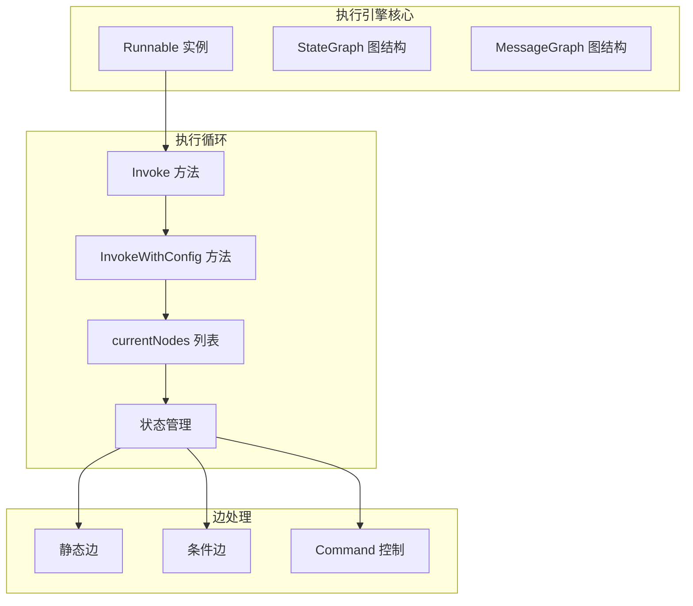

**图表来源**
- [graph.go](file://graph/graph.go#L140-L180)
- [state_graph.go](file://graph/state_graph.go#L99-L120)

**章节来源**
- [graph.go](file://graph/graph.go#L74-L140)
- [state_graph.go](file://graph/state_graph.go#L10-L60)

## 执行循环机制

### 基本执行流程

执行循环的核心逻辑围绕 `currentNodes` 列表展开，该列表维护了当前需要执行的所有节点。执行循环的主要步骤如下：

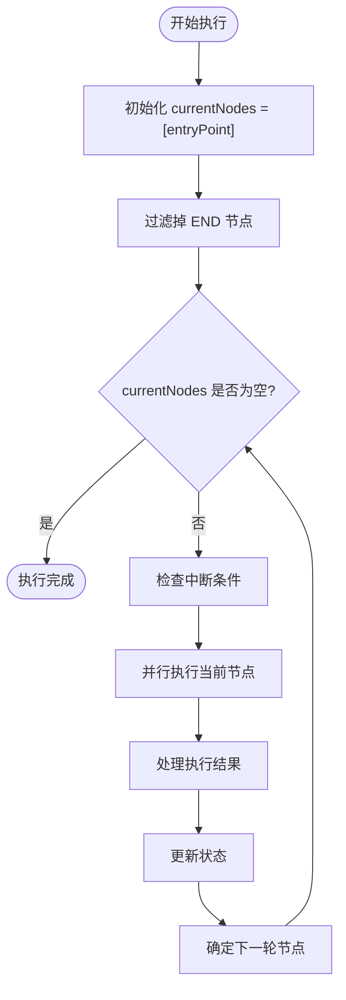

**图表来源**
- [graph.go](file://graph/graph.go#L183-L491)
- [state_graph.go](file://graph/state_graph.go#L126-L296)

### Invoke 方法的工作原理

`Invoke` 方法是执行循环的入口点，它提供了最基本的执行能力：

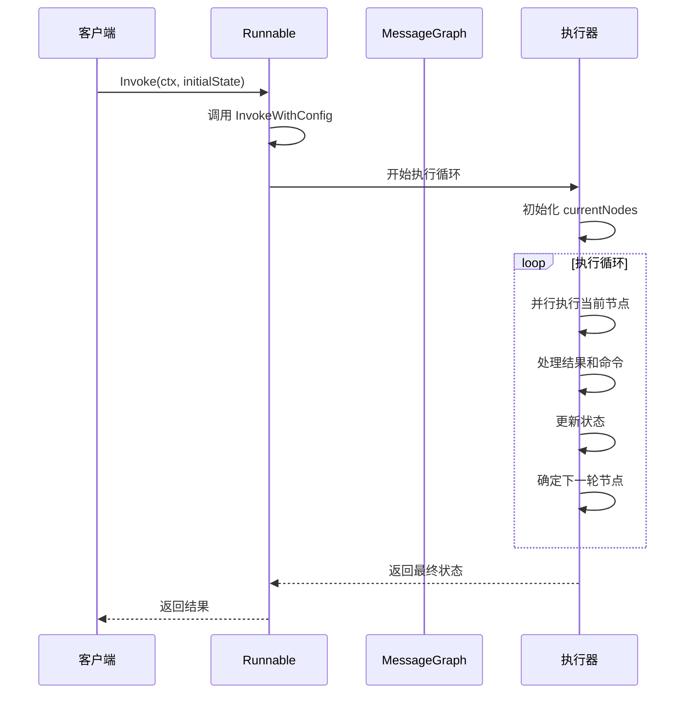

**图表来源**
- [graph.go](file://graph/graph.go#L174-L178)

### InvokeWithConfig 方法的增强功能

`InvokeWithConfig` 方法提供了更丰富的配置选项，支持中断控制、回调处理和追踪功能：

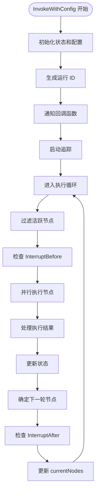

**图表来源**
- [graph.go](file://graph/graph.go#L182-L215)

**章节来源**
- [graph.go](file://graph/graph.go#L174-L215)

## 节点调度与边触发

### 边类型分类

langgraphgo 支持两种类型的边：静态边和条件边，它们决定了节点之间的触发关系：

```mermaid
classDiagram
class Edge {
+string From
+string To
}
class ConditionalEdge {
+string From
+func(ctx, state) string
}
class Node {
+string Name
+func(ctx, state) (interface{}, error)
}
Edge --> Node : "指向目标节点"
ConditionalEdge --> Node : "动态选择目标节点"
```

**图表来源**
- [graph.go](file://graph/graph.go#L62-L89)

### 静态边处理流程

静态边是最简单的边类型，定义了固定的节点连接关系：

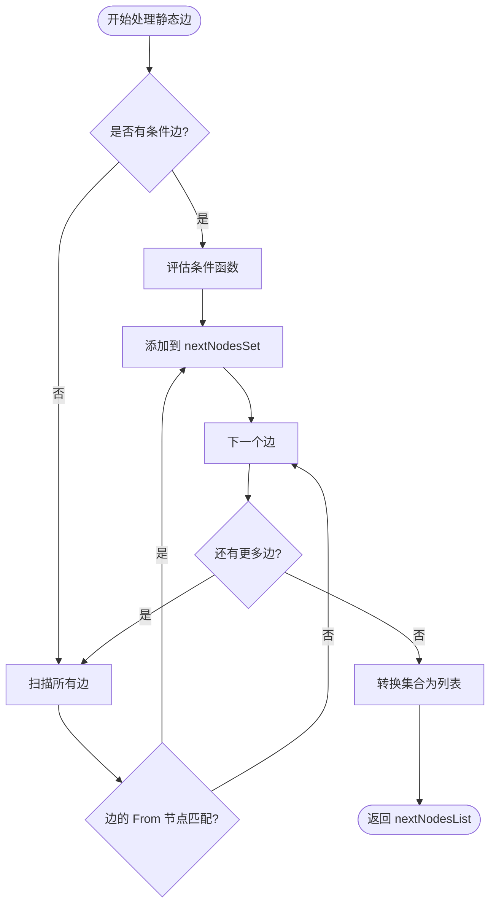

**图表来源**
- [graph.go](file://graph/graph.go#L407-L436)

### 条件边处理机制

条件边允许根据当前状态动态决定下一个执行节点：

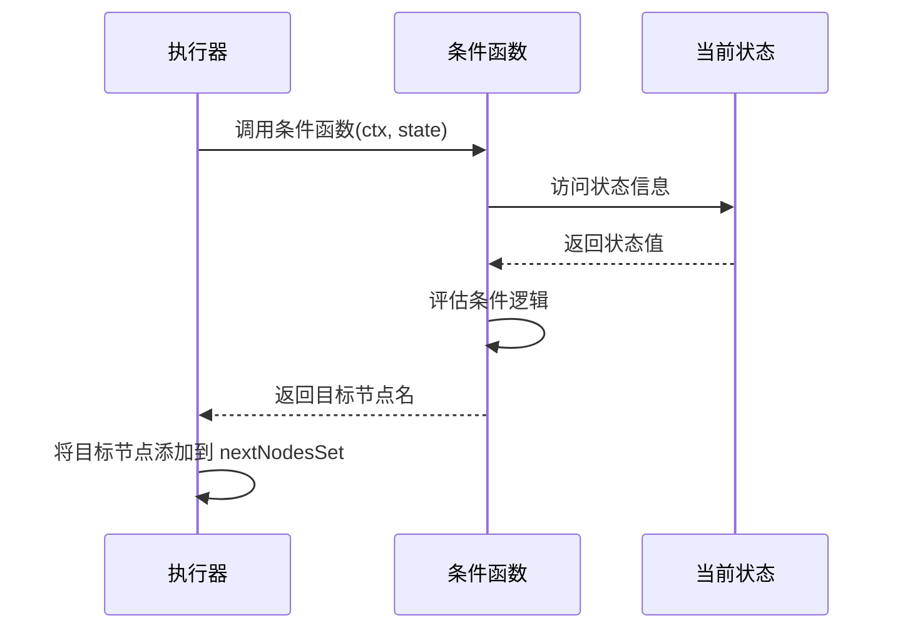

**图表来源**
- [graph.go](file://graph/graph.go#L409-L415)

**章节来源**
- [graph.go](file://graph/graph.go#L407-L436)
- [state_graph.go](file://graph/state_graph.go#L239-L268)

## 状态更新流程

### 状态合并策略

langgraphgo 提供了多种状态更新策略，支持灵活的状态管理：

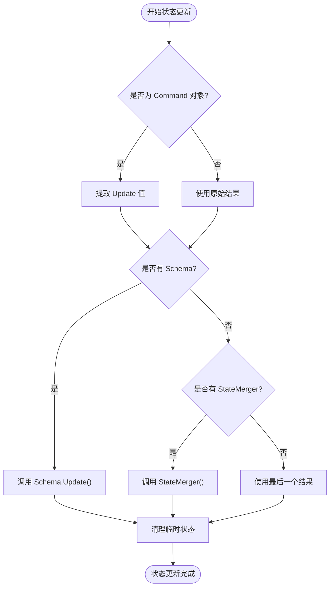

**图表来源**
- [graph.go](file://graph/graph.go#L367-L388)

### Schema 状态管理

StateSchema 接口提供了类型安全的状态更新机制：

```mermaid
classDiagram
class StateSchema {
<<interface>>
+Init() interface{}
+Update(current, new) (interface{}, error)
}
class MapSchema {
+map[string]Reducer Reducers
+map[string]bool EphemeralKeys
+RegisterReducer(key, reducer)
+RegisterChannel(key, reducer, isEphemeral)
+Update(current, new) (interface{}, error)
+Cleanup(state) interface{}
}
class Reducer {
<<function>>
+func(current, new) (interface{}, error)
}
StateSchema <|-- MapSchema
MapSchema --> Reducer : "使用"
```

**图表来源**
- [schema.go](file://graph/schema.go#L12-L27)

**章节来源**
- [graph.go](file://graph/graph.go#L367-L388)
- [schema.go](file://graph/schema.go#L62-L100)

## Command 结构体详解

### Command 的设计目的

Command 结构体是 langgraphgo 动态控制流的核心，它允许节点在执行过程中修改执行路径和状态：

```mermaid
classDiagram
class Command {
+interface{} Update
+interface{} Goto
+返回给执行循环
}
class GotoTypes {
<<enumeration>>
StringNode
ArrayNodes
}
Command --> GotoTypes : "Goto 可以是"
Command --> StateUpdate : "Update 用于状态更新"
```

**图表来源**
- [command.go](file://graph/command.go#L5-L14)

### Command 处理流程

当节点返回 Command 对象时，执行循环会优先处理 Command 中的指令：

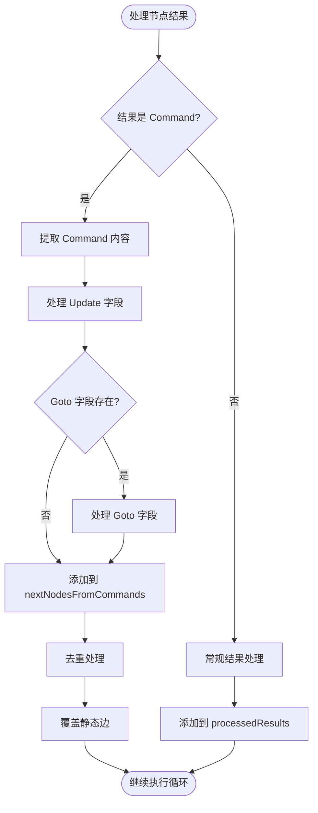

**图表来源**
- [graph.go](file://graph/graph.go#L344-L366)

### Goto 字段的类型处理

Command 的 Goto 字段支持多种类型，提供了灵活的控制流管理：

| Goto 类型 | 描述 | 示例 |
|-----------|------|------|
| string | 单个节点名称 | `"next_node"` |
| []string | 多个节点名称列表 | `[]string{"node1", "node2"}` |
| nil | 继续使用静态边 | 默认行为 |

**章节来源**
- [command.go](file://graph/command.go#L5-L14)
- [graph.go](file://graph/graph.go#L344-L366)

## 中断处理机制

### 中断类型

langgraphgo 支持两种类型的中断：`InterruptBefore` 和 `InterruptAfter`，分别在节点执行前后触发：

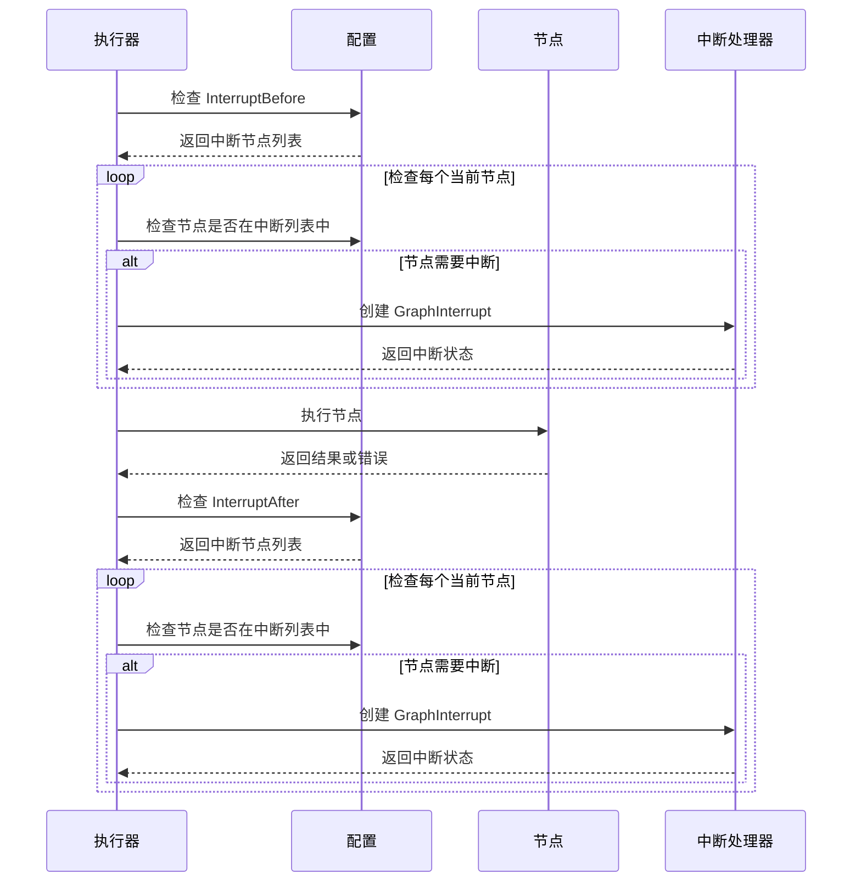

**图表来源**
- [graph.go](file://graph/graph.go#L238-L247)
- [graph.go](file://graph/graph.go#L439-L449)

### GraphInterrupt 错误类型

GraphInterrupt 是一个特殊的错误类型，包含了中断发生时的完整上下文信息：

```mermaid
classDiagram
class GraphInterrupt {
+string Node
+interface{} State
+[]string NextNodes
+interface{} InterruptValue
+Error() string
}
class NodeInterrupt {
+string Node
+interface{} Value
+Error() string
}
GraphInterrupt --|> error
NodeInterrupt --|> error
GraphInterrupt --> NodeInterrupt : "可能包含"
```

**图表来源**
- [errors.go](file://graph/errors.go#L5-L15)

**章节来源**
- [graph.go](file://graph/graph.go#L238-L247)
- [graph.go](file://graph/graph.go#L439-L449)
- [errors.go](file://graph/errors.go#L5-L15)

## 并发执行模型

### 并行节点执行

langgraphgo 使用 goroutine 和 sync.WaitGroup 实现节点的并行执行：

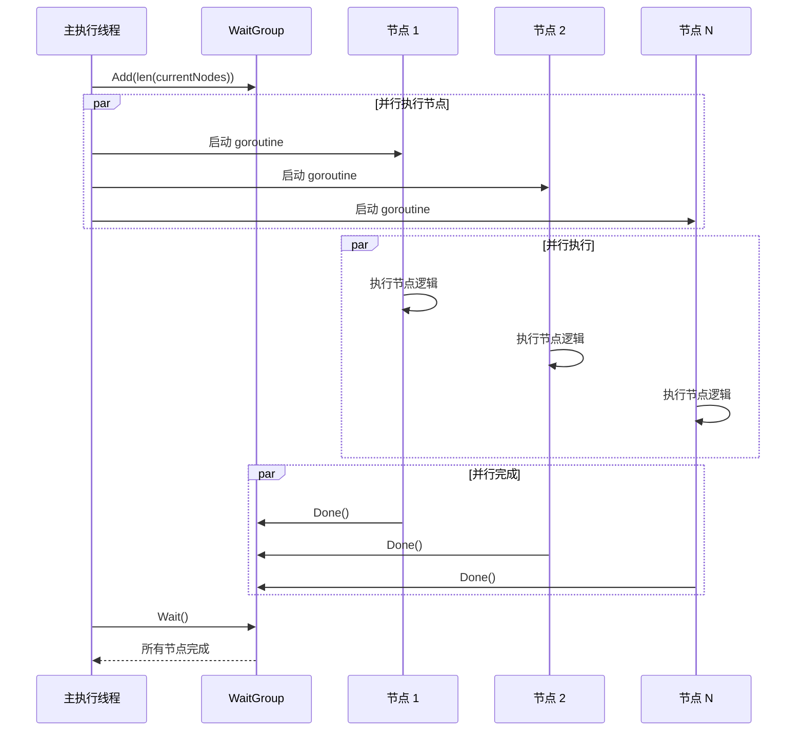

**图表来源**
- [graph.go](file://graph/graph.go#L249-L317)

### 错误处理与恢复

并行执行中的错误处理确保了系统的健壮性：

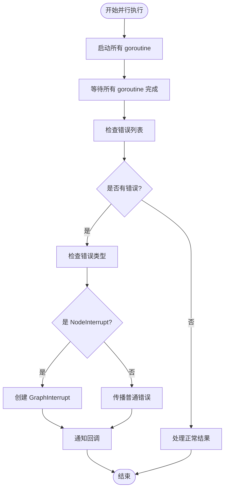

**图表来源**
- [graph.go](file://graph/graph.go#L320-L341)

**章节来源**
- [graph.go](file://graph/graph.go#L249-L341)

## 实际应用示例

### 基础执行循环示例

以下是一个简单的执行循环示例，展示了从入口节点开始的执行流程：

```mermaid
graph LR
A[Entry Point] --> B[Node A]
B --> C[Node B]
C --> D[Node C]
D --> E[END]
subgraph "执行序列"
F[初始化 currentNodes = [Entry Point]]
G[执行 Node A]
H[更新 currentNodes = [Node B]]
I[执行 Node B]
J[更新 currentNodes = [Node C]]
K[执行 Node C]
L[更新 currentNodes = [END]]
end
```

**图表来源**
- [main.go](file://examples/basic_example/main.go#L25-L35)

### 条件边路由示例

条件边展示了如何根据状态动态选择执行路径：

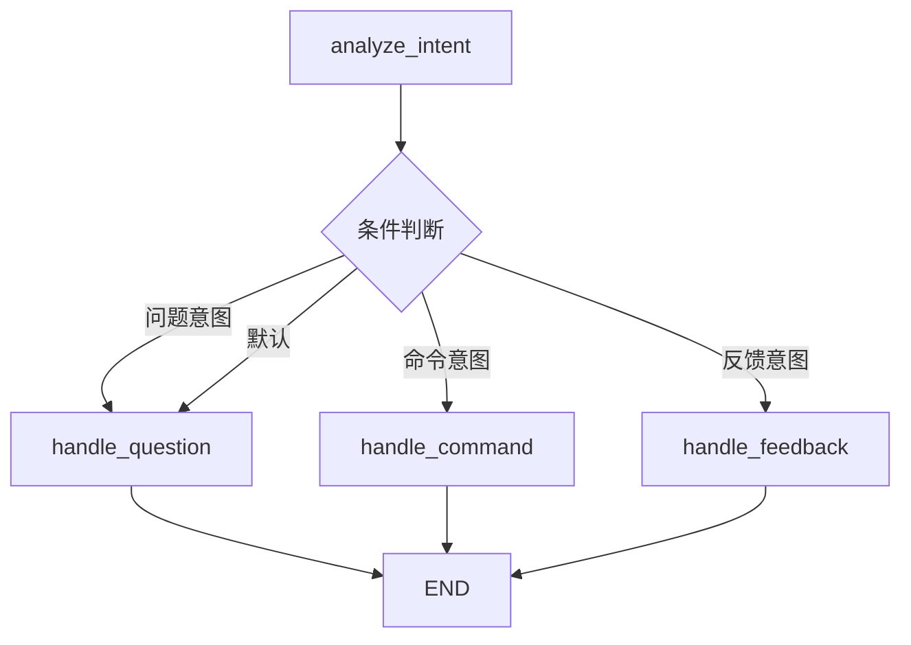

**图表来源**
- [main.go](file://examples/conditional_edges_example/main.go#L66-L88)

### Command 动态控制示例

Command 展示了如何动态改变执行流程：

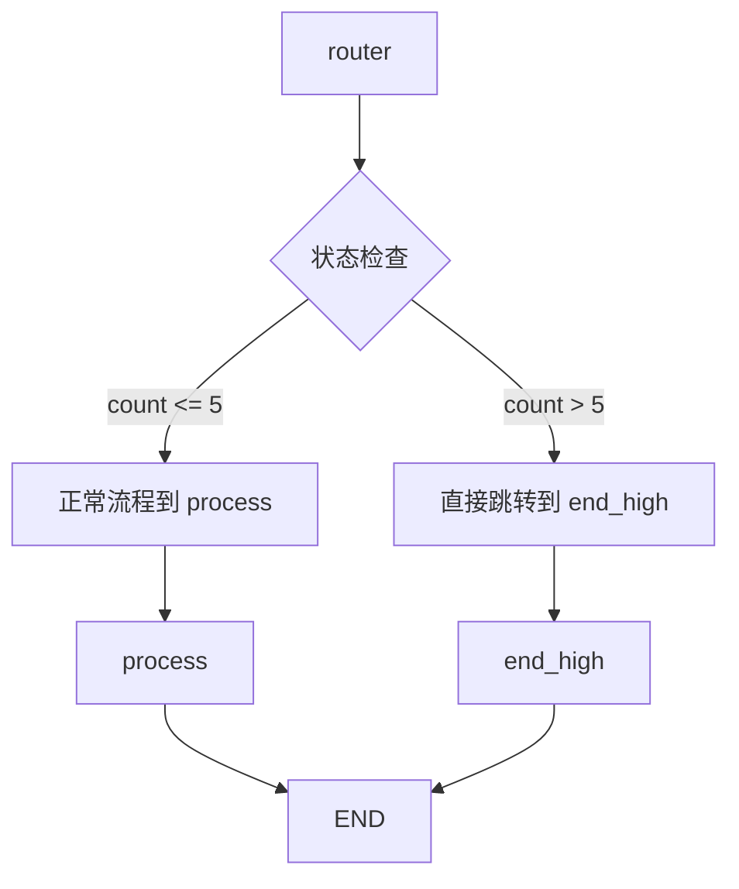

**图表来源**
- [main.go](file://examples/command_api/main.go#L27-L39)

### 并行执行示例

并行执行展示了如何同时执行多个独立的节点：

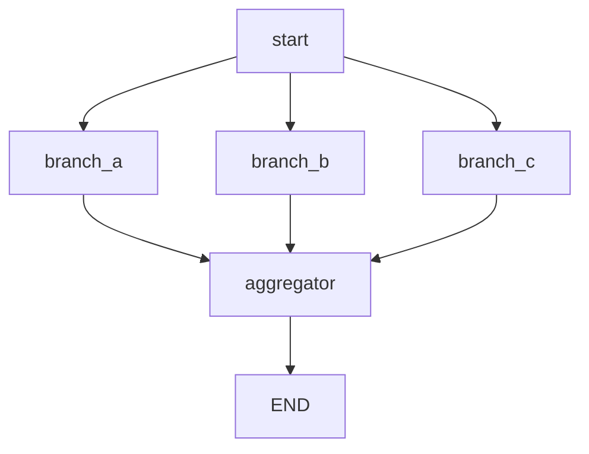

**图表来源**
- [main.go](file://examples/parallel_execution/main.go#L66-L76)

**章节来源**
- [main.go](file://examples/basic_example/main.go#L25-L35)
- [main.go](file://examples/conditional_edges_example/main.go#L66-L88)
- [main.go](file://examples/command_api/main.go#L27-L39)
- [main.go](file://examples/parallel_execution/main.go#L66-L76)

## 性能优化考虑

### 内存管理

执行循环在处理大量节点时需要注意内存管理：

- **状态共享**：避免在并行节点间共享可变状态
- **临时对象清理**：及时清理中间计算结果
- **状态压缩**：对于大型状态对象，考虑使用压缩存储

### 并发控制

合理的并发控制可以提高执行效率：

- **goroutine 数量限制**：根据系统资源调整并发度
- **死锁预防**：确保节点间的依赖关系不会导致死锁
- **资源竞争**：避免多个节点竞争同一资源

### 执行优化

执行循环的性能优化策略：

- **节点分组**：将相关节点组合执行
- **状态缓存**：缓存频繁访问的状态信息
- **边预计算**：预先计算静态边的可达性

## 总结

langgraphgo 的执行循环机制是一个精心设计的状态机执行引擎，它通过以下关键特性实现了强大的图结构执行能力：

1. **统一的执行模型**：无论是静态边还是条件边，都遵循相同的执行模式
2. **动态控制流**：通过 Command 结构体实现灵活的执行路径控制
3. **并发执行**：支持节点级别的并行执行，提高执行效率
4. **完善的错误处理**：提供多层次的错误处理和中断机制
5. **灵活的状态管理**：支持多种状态更新策略和 Schema 接口

执行循环的核心在于 `currentNodes` 列表的管理和状态的迭代更新，通过这种设计，langgraphgo 能够优雅地处理复杂的图结构执行场景，从简单的线性流程到复杂的分支合并、并行执行等高级模式。

理解这个执行循环机制对于正确使用 langgraphgo 构建复杂的应用程序至关重要，它不仅影响程序的逻辑正确性，也直接影响执行性能和资源利用率。