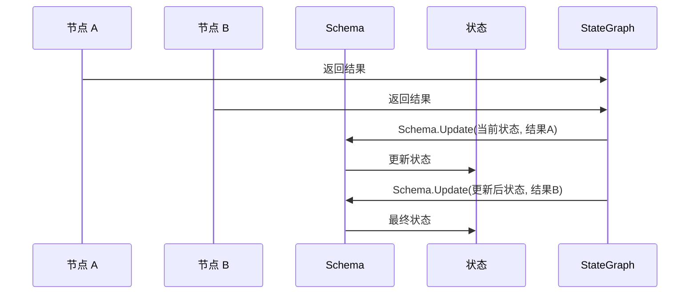
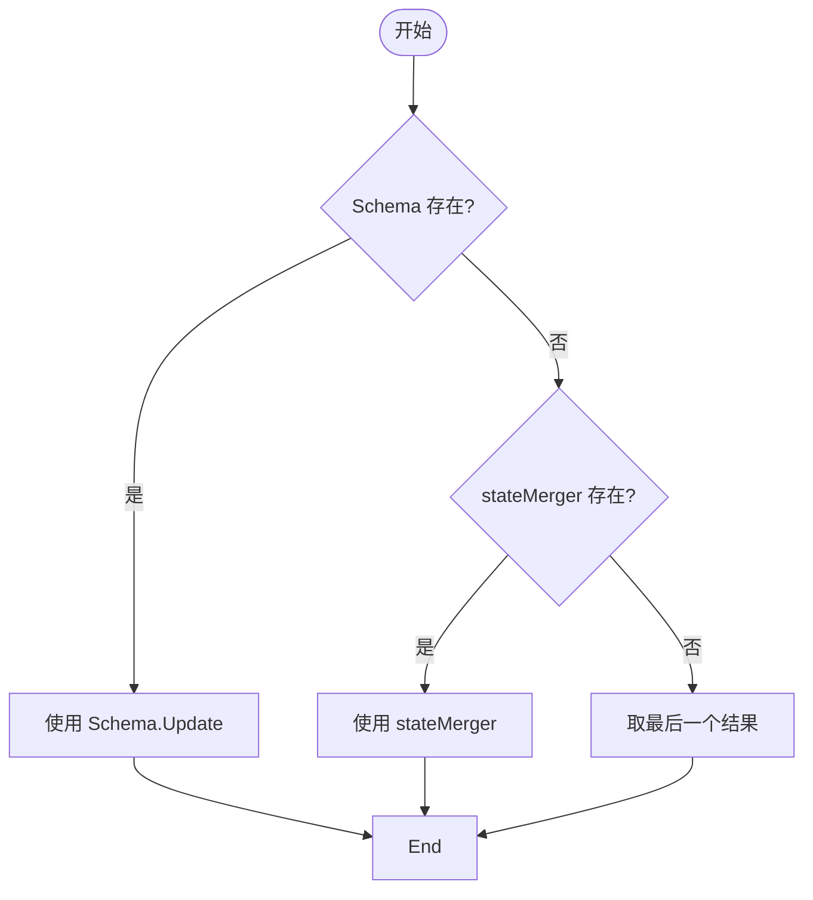
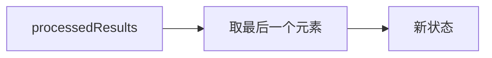
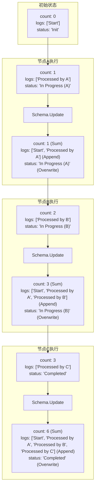

# 状态更新流程

<cite>
**本文档引用的文件**
- [command.go](file://graph/command.go)
- [schema.go](file://graph/schema.go)
- [state_graph.go](file://graph/state_graph.go)
- [update_state_test.go](file://graph/update_state_test.go)
- [main.go](file://examples/state_schema/main.go)
- [main.go](file://examples/command_api/main.go)
</cite>

## 目录
1. [核心状态更新机制](#核心状态更新机制)
2. [Command 结构体与状态变更](#command-结构体与状态变更)
3. [Schema 驱动的状态合并](#schema-驱动的状态合并)
4. [无 Schema 时的状态合并](#无-schema-时的状态合并)
5. [默认状态更新策略](#默认状态更新策略)
6. [临时状态清理机制](#临时状态清理机制)
7. [多轮迭代中的状态演化](#多轮迭代中的状态演化)

## 核心状态更新机制

langgraphgo 的状态更新流程是其核心功能之一，它定义了图中各个节点如何协同工作来更新和维护应用程序的状态。该流程主要在 `StateRunnable.InvokeWithConfig` 方法中实现，通过一系列步骤处理节点执行结果并更新全局状态。

**Section sources**
- [state_graph.go](file://graph/state_graph.go#L115-L297)

## Command 结构体与状态变更

`Command` 结构体是节点与图执行引擎之间通信的关键机制，它允许节点动态地更新状态并控制执行流程。

```mermaid
classDiagram
class Command {
+interface{} Update
+interface{} Goto
}
Command --> "1" StateGraph : 触发
StateGraph --> "0..*" Command : 处理
```

**Diagram sources**
- [command.go](file://graph/command.go#L5-L14)
- [state_graph.go](file://graph/state_graph.go#L177-L198)

当节点返回一个 `Command` 实例时，其 `Update` 字段携带了需要应用到当前状态的变更。在执行完所有节点后，系统会遍历结果集，将 `Command` 中的 `Update` 字段提取出来，放入 `processedResults` 切片中，以便后续的状态合并。

**Section sources**
- [state_graph.go](file://graph/state_graph.go#L181-L198)
- [command.go](file://graph/command.go#L3-L14)

## Schema 驱动的状态合并

当图配置了 `Schema` 时，状态更新流程会使用 `Schema.Update` 方法来合并多个节点的结果。`MapSchema` 实现了 `StateSchema` 接口，它为状态中的每个键定义了特定的 `Reducer` 函数。



**Diagram sources**
- [state_graph.go](file://graph/state_graph.go#L201-L209)
- [schema.go](file://graph/schema.go#L62-L97)

`Schema.Update` 方法会依次调用，将每个节点的结果逐一合并到当前状态中。对于每个键，如果注册了 `Reducer`，则使用该 `Reducer` 进行合并；否则，默认行为是覆盖。

**Section sources**
- [schema.go](file://graph/schema.go#L62-L97)
- [state_graph.go](file://graph/state_graph.go#L201-L209)

## 无 Schema 时的状态合并

当图没有配置 `Schema` 但设置了 `stateMerger` 函数时，该函数将负责合并并行执行节点的结果。



**Diagram sources**
- [state_graph.go](file://graph/state_graph.go#L201-L216)

`stateMerger` 函数接收当前状态和所有新状态的切片，返回合并后的单一状态。这为自定义复杂的合并逻辑提供了灵活性。

**Section sources**
- [state_graph.go](file://graph/state_graph.go#L210-L215)
- [parallel_execution_test.go](file://graph/parallel_execution_test.go#L117-L131)

## 默认状态更新策略

在既没有 `Schema` 也没有 `stateMerger` 的情况下，系统采用默认策略：取 `processedResults` 切片中的最后一个结果作为新的状态。



**Diagram sources**
- [state_graph.go](file://graph/state_graph.go#L217-L219)

这种策略简单直接，适用于线性执行流程或当后续节点的结果自然覆盖前序节点结果的场景。

**Section sources**
- [state_graph.go](file://graph/state_graph.go#L217-L219)

## 临时状态清理机制

`CleaningStateSchema` 接口扩展了 `StateSchema`，提供了在每轮循环结束时清理临时状态的能力。

```mermaid
classDiagram
class StateSchema {
<<interface>>
+Init() interface{}
+Update(current, new interface{}) (interface{}, error)
}
class CleaningStateSchema {
<<interface>>
+Cleanup(state interface{}) interface{}
}
class MapSchema {
+Reducers map[string]Reducer
+EphemeralKeys map[string]bool
+Cleanup(state interface{}) interface{}
}
StateSchema <|-- CleaningStateSchema
CleaningStateSchema <|.. MapSchema
StateSchema <|.. MapSchema
```

**Diagram sources**
- [schema.go](file://graph/schema.go#L21-L27)
- [schema.go](file://graph/schema.go#L102-L136)

`MapSchema` 通过 `EphemeralKeys` 映射来跟踪标记为临时的键。在每轮执行结束后，`Cleanup` 方法会被调用，移除所有临时键，确保它们不会污染下一轮的状态。

**Section sources**
- [schema.go](file://graph/schema.go#L102-L136)
- [state_graph.go](file://graph/state_graph.go#L277-L280)

## 多轮迭代中的状态演化

结合 `examples/state_schema/main.go` 中的示例，可以清晰地看到状态如何在多轮迭代中逐步演化。



**Diagram sources**
- [main.go](file://examples/state_schema/main.go#L44-L70)
- [schema.go](file://graph/schema.go#L141-L185)

在这个流程中，初始状态被传递给第一个节点。每个节点返回一个部分状态更新，`Schema` 根据预定义的 `Reducer`（`SumReducer`、`AppendReducer`、`OverwriteReducer`）将这些更新合并到当前状态中。最终，状态经过多轮迭代，`count` 被累加，`logs` 被追加，`status` 被覆盖，形成了最终的聚合状态。

**Section sources**
- [main.go](file://examples/state_schema/main.go#L24-L104)
- [schema.go](file://graph/schema.go#L11-L20)
- [schema.go](file://graph/schema.go#L141-L185)