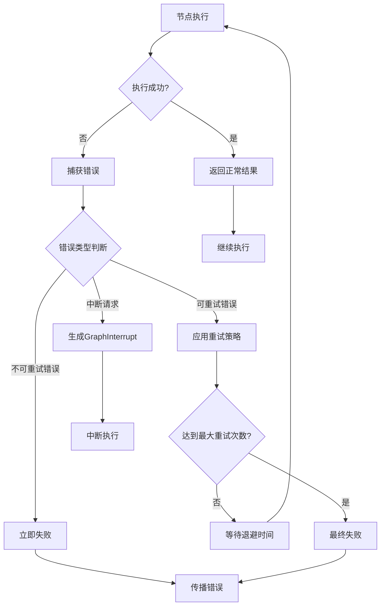

# 核心引擎设计

<cite>
**本文档中引用的文件**
- [graph.go](file://graph/graph.go)
- [state_graph.go](file://graph/state_graph.go)
- [parallel.go](file://graph/parallel.go)
- [retry.go](file://graph/retry.go)
- [schema.go](file://graph/schema.go)
- [context.go](file://graph/context.go)
- [command.go](file://graph/command.go)
- [errors.go](file://graph/errors.go)
- [main.go](file://examples/basic_example/main.go)
- [main.go](file://examples/parallel_execution/main.go)
- [main.go](file://examples/conditional_edges_example/main.go)
- [main.go](file://examples/memory_basic/main.go)
</cite>

## 目录
1. [简介](#简介)
2. [项目结构概览](#项目结构概览)
3. [核心组件架构](#核心组件架构)
4. [图执行循环（Pregel模型）](#图执行循环pregel模型)
5. [Graph与StateGraph设计差异](#graph与stategraph设计差异)
6. [并发执行机制](#并发执行机制)
7. [错误处理与重试机制](#错误处理与重试机制)
8. [状态管理与Schema系统](#状态管理与schema系统)
9. [执行时序与状态转换](#执行时序与状态转换)
10. [最佳实践与使用指南](#最佳实践与使用指南)
11. [总结](#总结)

## 简介

LangGraphGo 是一个基于 Pregel 模型的图执行引擎，提供了强大的状态管理和并发执行能力。该引擎的核心设计理念是通过有向无环图（DAG）来组织和执行复杂的业务逻辑流程，支持动态路由、并发执行、状态持久化等高级特性。

本文档将深入分析 LangGraphGo 的核心引擎设计，包括其架构模式、执行机制、并发控制、错误处理等关键技术要素。

## 项目结构概览

LangGraphGo 的核心功能集中在 `graph` 包中，主要包含以下关键模块：


**图表来源**
- [graph.go](file://graph/graph.go#L1-L50)
- [state_graph.go](file://graph/state_graph.go#L1-L50)
- [parallel.go](file://graph/parallel.go#L1-L50)

## 核心组件架构

### 基础数据结构

LangGraphGo 的核心数据结构围绕节点（Node）、边（Edge）和状态（State）构建：

```mermaid
classDiagram
class Node {
+string Name
+func Function
+Execute(ctx, state) (interface{}, error)
}
class Edge {
+string From
+string To
}
class MessageGraph {
+map[string]Node nodes
+[]Edge edges
+map[string]func Condition
+string entryPoint
+StateMerger stateMerger
+StateSchema Schema
+AddNode(name, fn)
+AddEdge(from, to)
+AddConditionalEdge(from, condition)
+Compile() Runnable
}
class StateGraph {
+map[string]Node nodes
+[]Edge edges
+map[string]func Condition
+string entryPoint
+RetryPolicy retryPolicy
+StateSchema Schema
+AddNode(name, fn)
+AddEdge(from, to)
+SetRetryPolicy(policy)
+Compile() StateRunnable
}
class Runnable {
+MessageGraph graph
+Tracer tracer
+Invoke(ctx, state) (interface{}, error)
+InvokeWithConfig(ctx, state, config) (interface{}, error)
}
class StateRunnable {
+StateGraph graph
+Invoke(ctx, state) (interface{}, error)
+InvokeWithConfig(ctx, state, config) (interface{}, error)
}
MessageGraph --> Node
MessageGraph --> Edge
StateGraph --> Node
StateGraph --> Edge
MessageGraph --> Runnable
StateGraph --> StateRunnable
```

**图表来源**
- [graph.go](file://graph/graph.go#L52-L93)
- [state_graph.go](file://graph/state_graph.go#L10-L32)

**章节来源**
- [graph.go](file://graph/graph.go#L52-L93)
- [state_graph.go](file://graph/state_graph.go#L10-L32)

### 执行引擎接口

两个核心执行引擎都实现了统一的接口，但具有不同的行为特征：

| 特性 | MessageGraph | StateGraph |
|------|--------------|------------|
| 并发执行 | 支持 | 支持 |
| 错误重试 | 不支持 | 内置重试机制 |
| 状态合并 | 可配置 | Schema驱动 |
| 条件路由 | 动态条件 | 静态+动态组合 |
| 中断处理 | 基础支持 | 完整中断机制 |

## 图执行循环（Pregel模型）

### 执行循环核心算法

LangGraphGo 的执行循环基于 Pregel 模型，实现了高效的图遍历和状态传播：


**图表来源**
- [graph.go](file://graph/graph.go#L175-L491)

### 节点调度机制

节点调度是执行循环的核心，支持多种调度策略：

1. **静态调度**：基于预定义的边关系
2. **条件调度**：基于运行时状态的条件判断
3. **命令调度**：通过 Command 对象动态控制流程


**图表来源**
- [graph.go](file://graph/graph.go#L249-L438)

**章节来源**
- [graph.go](file://graph/graph.go#L175-L491)

## Graph与StateGraph设计差异

### 设计理念对比

| 方面 | MessageGraph | StateGraph |
|------|--------------|------------|
| **适用场景** | 简单流程控制 | 复杂状态管理 |
| **错误处理** | 基础错误传播 | 内置重试机制 |
| **状态模型** | 自定义状态合并 | Schema驱动 |
| **并发控制** | 基础并发 | 完整并发支持 |
| **扩展性** | 易于定制 | 功能丰富 |

### 实现细节差异

```mermaid
classDiagram
class MessageGraph {
+map[string]Node nodes
+[]Edge edges
+map[string]func Condition
+StateMerger stateMerger
+StateSchema Schema
+Invoke(ctx, state) (interface{}, error)
-executeNodeParallel()
-mergeState()
}
class StateGraph {
+map[string]Node nodes
+[]Edge edges
+map[string]func Condition
+RetryPolicy retryPolicy
+StateSchema Schema
+Invoke(ctx, state) (interface{}, error)
-executeNodeWithRetry()
-handleRetryLogic()
}
class RetryPolicy {
+int MaxRetries
+BackoffStrategy BackoffStrategy
+[]string RetryableErrors
}
MessageGraph --|> StateGraph : 继承基础功能
StateGraph --> RetryPolicy : 使用
```

**图表来源**
- [graph.go](file://graph/graph.go#L74-L93)
- [state_graph.go](file://graph/state_graph.go#L10-L32)

### 使用场景建议

- **MessageGraph**：适用于简单的线性流程或条件分支
- **StateGraph**：适用于需要复杂状态管理、错误恢复的场景

**章节来源**
- [graph.go](file://graph/graph.go#L74-L93)
- [state_graph.go](file://graph/state_graph.go#L10-L32)

## 并发执行机制

### 并发执行架构

LangGraphGo 的并发执行基于 Go 协程和 WaitGroup 实现，提供了高效的任务并行处理能力：


**图表来源**
- [parallel.go](file://graph/parallel.go#L23-L82)

### 并行节点类型

LangGraphGo 提供了多种并行执行模式：

1. **ParallelNode**：简单并行执行多个节点
2. **MapReduceNode**：支持映射-归约模式
3. **FanOutFanIn**：扇出-扇入模式


**图表来源**
- [parallel.go](file://graph/parallel.go#L36-L66)

### 线程安全与状态合并

并发执行中的线程安全通过以下机制保证：

1. **状态隔离**：每个节点接收独立的状态副本
2. **结果聚合**：通过 Schema 或自定义合并器处理结果
3. **错误传播**：及时捕获和传播执行错误

**章节来源**
- [parallel.go](file://graph/parallel.go#L23-L82)

## 错误处理与重试机制

### 错误处理层次

LangGraphGo 实现了多层次的错误处理机制：



**图表来源**
- [retry.go](file://graph/retry.go#L51-L94)
- [state_graph.go](file://graph/state_graph.go#L299-L338)

### 重试策略配置

LangGraphGo 提供了灵活的重试配置选项：

| 策略类型 | 描述 | 适用场景 |
|----------|------|----------|
| **固定延迟** | 每次重试间隔相同时间 | 网络抖动 |
| **指数退避** | 延迟时间呈指数增长 | 服务过载 |
| **线性退避** | 延迟时间线性增长 | 渐进式恢复 |

### 错误恢复机制


**图表来源**
- [retry.go](file://graph/retry.go#L51-L94)

**章节来源**
- [retry.go](file://graph/retry.go#L11-L94)
- [state_graph.go](file://graph/state_graph.go#L299-L338)

## 状态管理与Schema系统

### Schema设计模式

LangGraphGo 的状态管理系统基于 Schema 模式，提供了类型安全的状态操作：

```mermaid
classDiagram
class StateSchema {
<<interface>>
+Init() interface{}
+Update(current, new) (interface{}, error)
}
class CleaningStateSchema {
<<interface>>
+Cleanup(state) interface{}
}
class MapSchema {
+map[string]Reducer Reducers
+map[string]bool EphemeralKeys
+RegisterReducer(key, reducer)
+RegisterChannel(key, reducer, isEphemeral)
+Init() interface{}
+Update(current, new) (interface{}, error)
+Cleanup(state) interface{}
}
class Reducer {
<<function>>
+Reduce(current, new) (interface{}, error)
}
StateSchema <|-- CleaningStateSchema
StateSchema <|.. MapSchema
MapSchema --> Reducer
```

**图表来源**
- [schema.go](file://graph/schema.go#L12-L27)

### 常用Reducer类型

| Reducer类型 | 功能描述 | 使用场景 |
|-------------|----------|----------|
| **OverwriteReducer** | 直接覆盖旧值 | 简单状态更新 |
| **AppendReducer** | 追加到切片 | 列表累积 |
| **自定义Reducer** | 复杂状态合并逻辑 | 业务特定需求 |

### 临时通道（Ephemeral Channels）

临时通道允许在执行过程中临时存储数据，执行完成后自动清理：


**图表来源**
- [schema.go](file://graph/schema.go#L102-L136)

**章节来源**
- [schema.go](file://graph/schema.go#L12-L186)

## 执行时序与状态转换

### 基本执行时序

以下是典型的图执行时序图：


**图表来源**
- [graph.go](file://graph/graph.go#L175-L491)

### 状态转换图

状态转换遵循严格的图论规则，确保执行的确定性和可预测性：


**图表来源**
- [graph.go](file://graph/graph.go#L224-L475)

## 最佳实践与使用指南

### 图构建最佳实践

1. **明确入口点**：始终设置清晰的入口节点
2. **合理使用条件边**：避免过度复杂的条件逻辑
3. **状态设计原则**：保持状态结构简洁和类型安全

### 并发执行优化

1. **节点粒度**：平衡并发度和资源消耗
2. **状态共享**：谨慎处理可变状态的并发访问
3. **错误隔离**：确保单个节点失败不影响整体执行

### 错误处理策略

1. **重试配置**：根据业务特点调整重试参数
2. **超时控制**：为长时间运行的节点设置合理的超时
3. **熔断保护**：在不稳定的服务调用中使用熔断器

### 性能监控


**章节来源**
- [main.go](file://examples/basic_example/main.go#L25-L36)
- [main.go](file://examples/parallel_execution/main.go#L23-L61)
- [main.go](file://examples/conditional_edges_example/main.go#L36-L89)

## 总结

LangGraphGo 的核心引擎设计体现了现代并发编程的最佳实践，通过以下关键特性实现了强大的图执行能力：

### 核心优势

1. **Pregel模型实现**：提供了标准的图执行语义
2. **灵活的并发控制**：支持多种并发模式和调度策略
3. **完善的错误处理**：内置重试、超时、熔断等机制
4. **类型安全的状态管理**：通过 Schema 系统确保状态操作的安全性
5. **可扩展的架构设计**：模块化设计便于功能扩展

### 技术创新

- **命令模式集成**：通过 Command 对象实现动态流程控制
- **Schema驱动的状态合并**：提供类型安全的状态操作
- **多层次的错误恢复**：从节点级到图级的完整错误处理链
- **并发安全的状态管理**：通过不可变状态和原子操作保证线程安全

### 应用价值

LangGraphGo 的核心引擎设计为构建复杂的业务流程系统提供了坚实的基础，特别适合需要：
- 复杂工作流编排的应用
- 高并发的数据处理管道
- 可靠性要求高的生产环境
- 动态路由和条件执行的场景

通过深入理解和正确使用这些核心概念，开发者可以构建出既高效又可靠的图执行应用程序。