# 临时状态管理

<cite>
**本文档中引用的文件**
- [graph/schema.go](file://graph/schema.go)
- [graph/state_graph.go](file://graph/state_graph.go)
- [examples/ephemeral_channels/main.go](file://examples/ephemeral_channels/main.go)
- [examples/ephemeral_channels/README.md](file://examples/ephemeral_channels/README.md)
- [examples/ephemeral_channels/README_CN.md](file://examples/ephemeral_channels/README_CN.md)
- [graph/channel_test.go](file://graph/channel_test.go)
- [graph/schema_test.go](file://graph/schema_test.go)
</cite>

## 目录
1. [简介](#简介)
2. [核心接口设计](#核心接口设计)
3. [MapSchema 实现机制](#mapschema-实现机制)
4. [执行循环中的清理流程](#执行循环中的清理流程)
5. [临时通道配置与使用](#临时通道配置与使用)
6. [实际应用场景](#实际应用场景)
7. [性能优化考虑](#性能优化考虑)
8. [最佳实践指南](#最佳实践指南)
9. [故障排除](#故障排除)
10. [总结](#总结)

## 简介

临时状态管理是 LangGraphGo 中一个重要的状态控制机制，它通过 `CleaningStateSchema` 接口和 `MapSchema` 实现，为开发者提供了自动清理临时数据的能力。这种机制确保了状态空间的整洁性，防止临时数据污染后续的执行步骤。

在有状态的应用程序中，并非所有数据都需要在整个对话历史中持久保存。有些数据是"临时的"——它仅对紧接的下一步或特定的超步（并行执行块）有效，之后应被丢弃。例如临时的搜索结果、中间推理步骤，或触发立即动作但不应混淆未来轮次的标志。

## 核心接口设计

### CleaningStateSchema 接口

`CleaningStateSchema` 是扩展自 `StateSchema` 的接口，专门用于处理需要自动清理的状态管理需求。

```mermaid
classDiagram
class StateSchema {
<<interface>>
+Init() interface{}
+Update(current, new) (interface{}, error)
}
class CleaningStateSchema {
<<interface>>
+Init() interface{}
+Update(current, new) (interface{}, error)
+Cleanup(state) interface{}
}
class MapSchema {
+Reducers map[string]Reducer
+EphemeralKeys map[string]bool
+Init() interface{}
+Update(current, new) (interface{}, error)
+Cleanup(state) interface{}
+RegisterReducer(key, reducer)
+RegisterChannel(key, reducer, isEphemeral)
}
StateSchema <|-- CleaningStateSchema : extends
CleaningStateSchema <|.. MapSchema : implements
```

**图表来源**
- [graph/schema.go](file://graph/schema.go#L12-L26)

### 接口方法详解

#### StateSchema 基础功能
- **Init()**: 返回初始状态，通常是一个空的 map
- **Update(current, new)**: 合并新的状态到当前状态，支持自定义的合并逻辑

#### CleaningStateSchema 扩展功能
- **Cleanup(state)**: 在每个步骤完成后清理临时状态，移除标记为临时的键

**章节来源**
- [graph/schema.go](file://graph/schema.go#L12-L26)

## MapSchema 实现机制

### 数据结构设计

`MapSchema` 通过两个关键字段实现临时状态管理：

```mermaid
classDiagram
class MapSchema {
+Reducers map[string]Reducer
+EphemeralKeys map[string]bool
+RegisterReducer(key, reducer)
+RegisterChannel(key, reducer, isEphemeral)
+Init() interface{}
+Update(current, new) (interface{}, error)
+Cleanup(state) interface{}
}
note for MapSchema "EphemeralKeys 存储标记为临时的键<br/>Reducers 存储各键的更新逻辑"
```

**图表来源**
- [graph/schema.go](file://graph/schema.go#L30-L33)

### RegisterChannel 方法

`RegisterChannel` 方法是配置临时通道的核心入口：

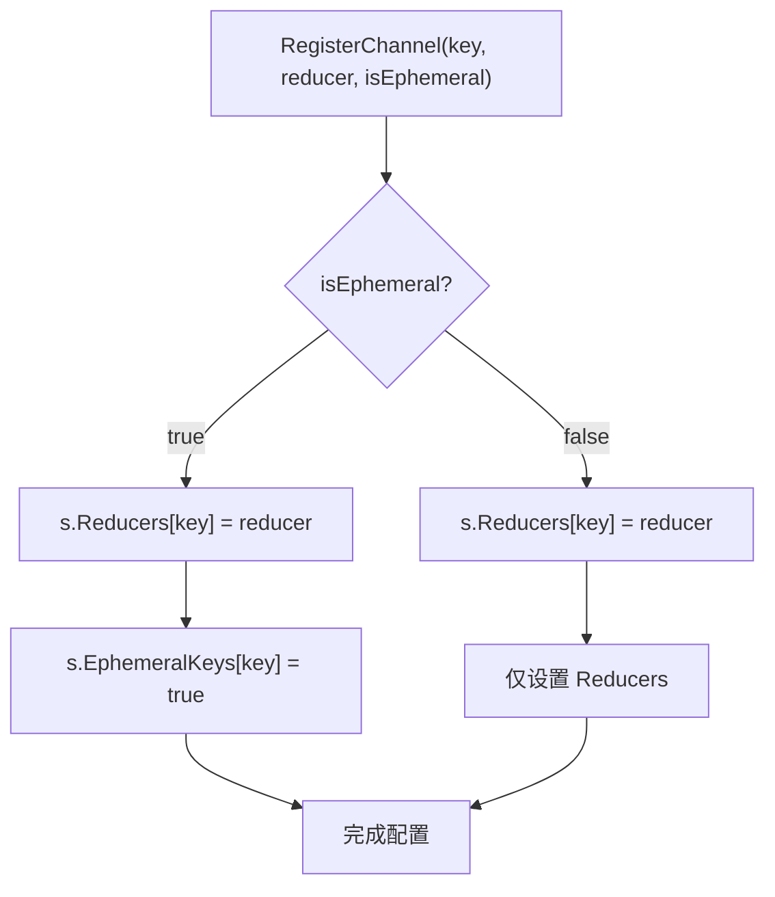

**图表来源**
- [graph/schema.go](file://graph/schema.go#L49-L54)

### Cleanup 方法实现

`Cleanup` 方法负责在每个步骤完成后移除临时状态：

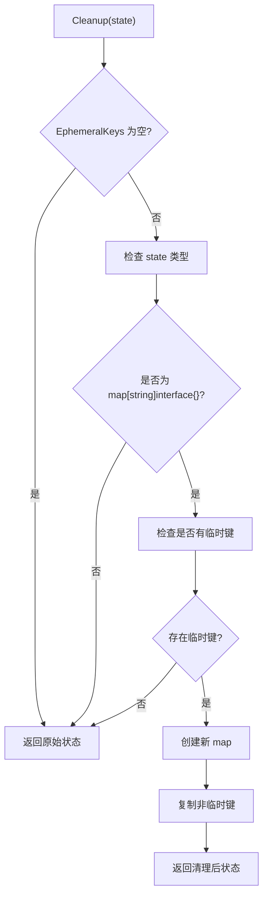

**图表来源**
- [graph/schema.go](file://graph/schema.go#L102-L136)

**章节来源**
- [graph/schema.go](file://graph/schema.go#L30-L136)

## 执行循环中的清理流程

### StateRunnable.InvokeWithConfig 流程

在图执行循环中，`Cleanup` 方法的调用时机至关重要：

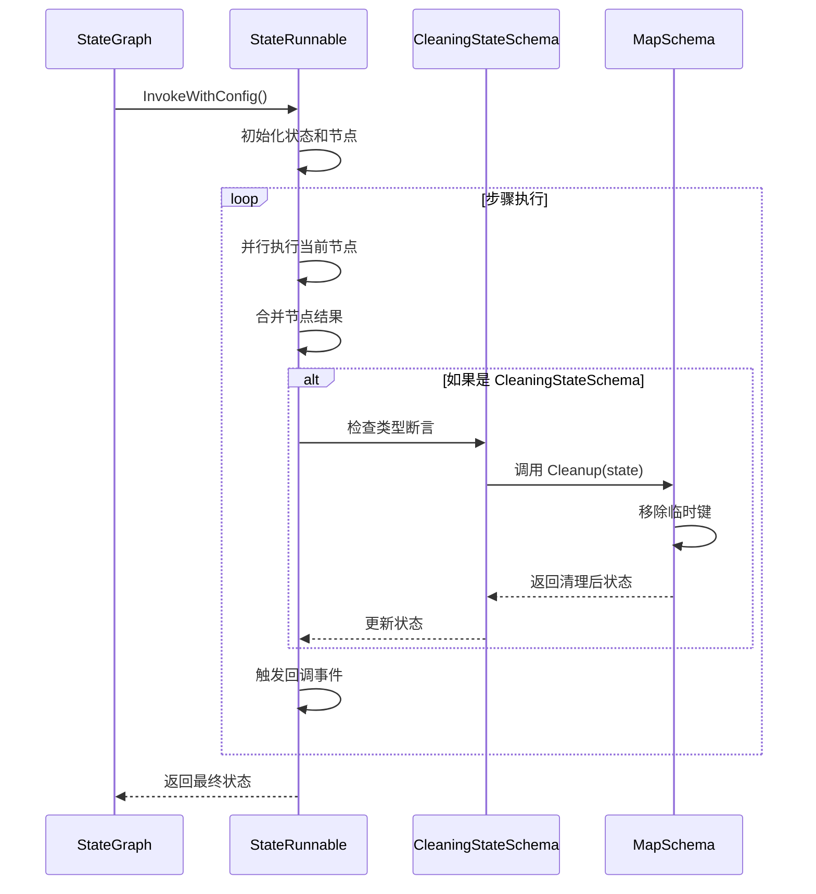

**图表来源**
- [graph/state_graph.go](file://graph/state_graph.go#L115-L296)

### 关键代码位置

清理逻辑在以下位置执行：

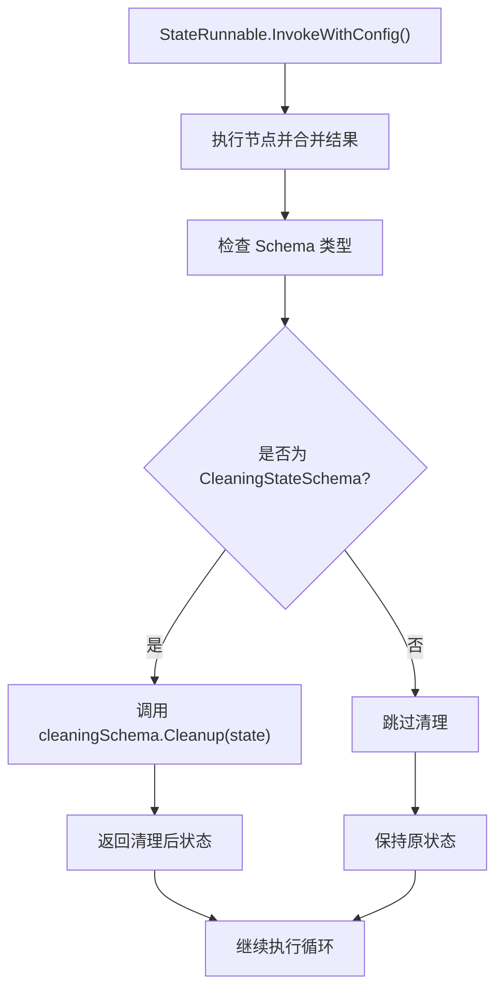

**图表来源**
- [graph/state_graph.go](file://graph/state_graph.go#L277-L280)

**章节来源**
- [graph/state_graph.go](file://graph/state_graph.go#L115-L296)

## 临时通道配置与使用

### 基本配置模式

开发者可以通过以下方式配置临时通道：

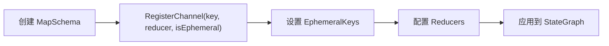

**图表来源**
- [examples/ephemeral_channels/main.go](file://examples/ephemeral_channels/main.go#L17-L22)

### 典型使用场景

#### 生产者-消费者模式

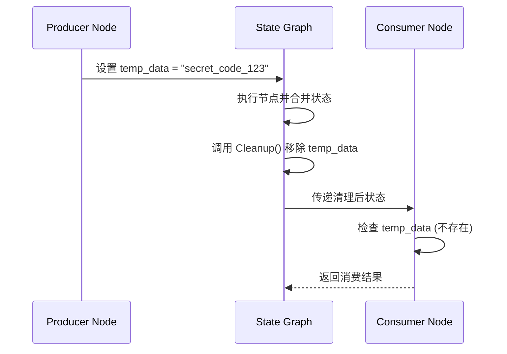

**图表来源**
- [examples/ephemeral_channels/main.go](file://examples/ephemeral_channels/main.go#L24-L51)

### 验证机制

临时通道的有效性可以通过以下方式进行验证：

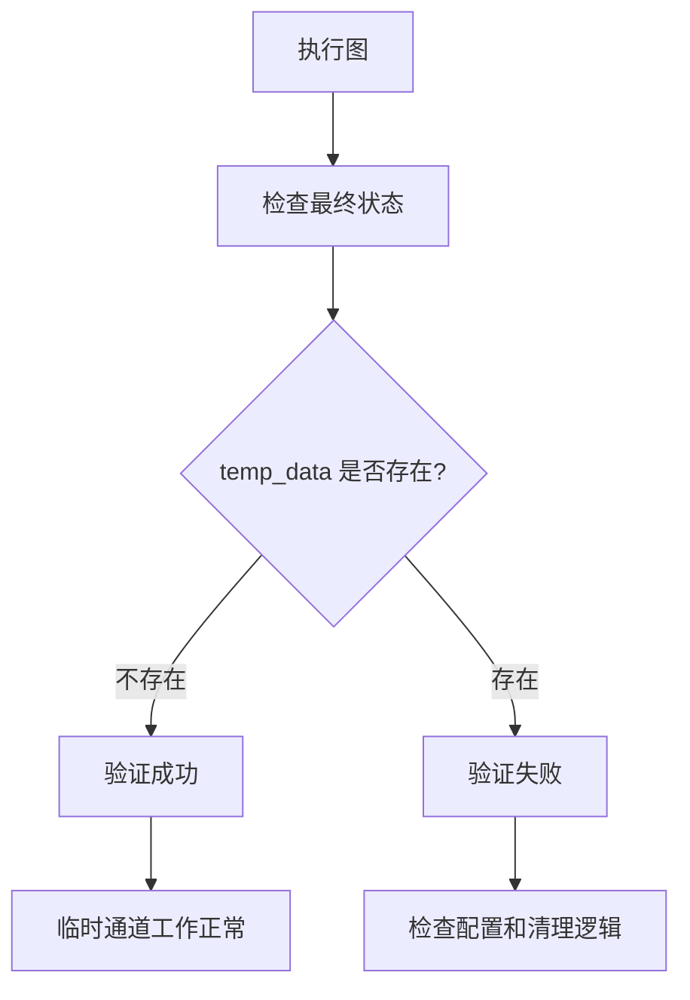

**章节来源**
- [examples/ephemeral_channels/main.go](file://examples/ephemeral_channels/main.go#L1-L75)
- [examples/ephemeral_channels/README_CN.md](file://examples/ephemeral_channels/README_CN.md#L1-L48)

## 实际应用场景

### 临时搜索结果管理

在多步骤的搜索流程中，临时搜索结果可以在后续步骤中被清理：

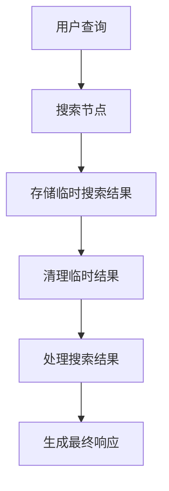

### 中间推理步骤

在复杂的推理过程中，中间步骤的结果可以作为临时状态：

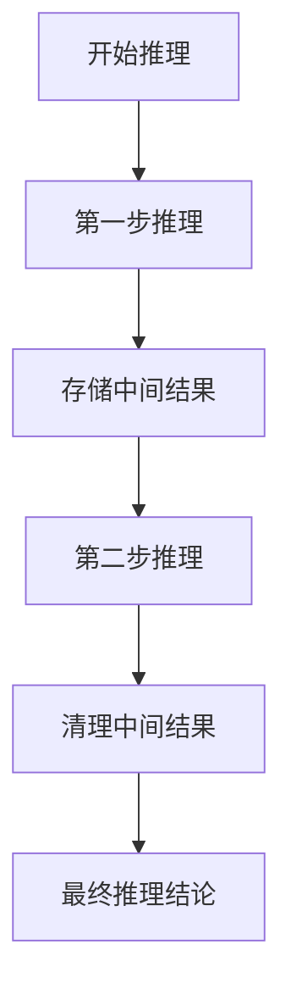

### 立即动作触发器

某些动作触发器只需要在当前步骤中生效：

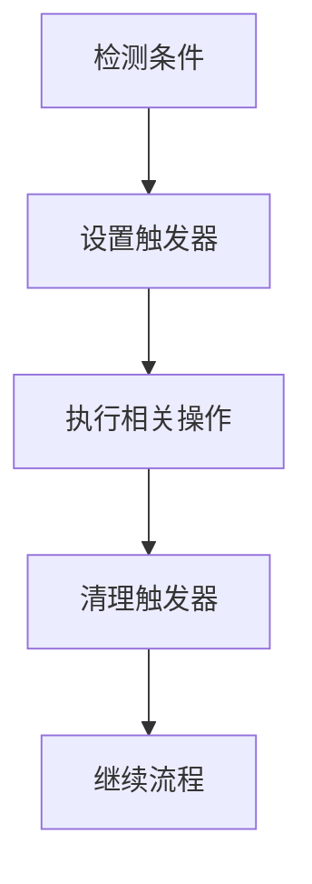

## 性能优化考虑

### 内存管理策略

临时状态管理在内存使用方面具有以下优化特点：

| 优化策略 | 描述 | 性能影响 |
|---------|------|----------|
| 延迟分配 | 仅在需要时创建新状态映射 | 减少不必要的内存分配 |
| 快速路径 | 当没有临时键时直接返回原状态 | 避免不必要的遍历操作 |
| 原地修改 | 对于只读状态尝试原地修改 | 减少内存拷贝开销 |

### 清理算法复杂度

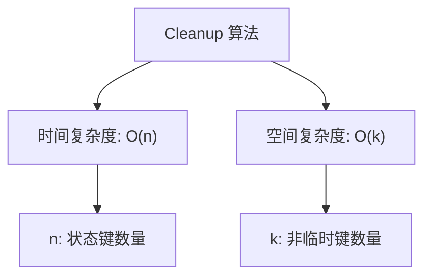

### 性能监控指标

建议监控以下指标来评估临时状态管理的性能：

- **清理频率**: 每个步骤平均执行清理的次数
- **内存回收率**: 清理后释放的内存比例
- **清理耗时**: Cleanup 方法的平均执行时间

## 最佳实践指南

### 配置最佳实践

1. **明确标识临时数据**: 始终为临时数据显式设置 `isEphemeral = true`
2. **合理选择 Reducer**: 根据数据特性选择合适的合并逻辑
3. **避免过度使用**: 只对真正需要临时性的数据使用此机制

### 开发建议

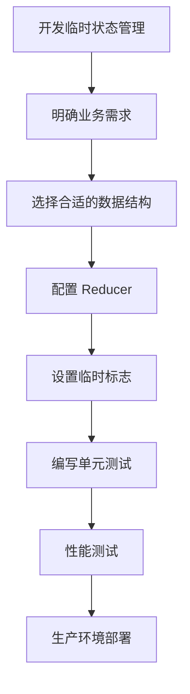

### 常见陷阱避免

| 陷阱 | 描述 | 解决方案 |
|------|------|----------|
| 忘记设置 isEphemeral | 将临时数据误配置为持久数据 | 显式设置 isEphemeral = true |
| 错误的 Reducer 选择 | 使用不合适的合并逻辑 | 根据数据特性选择合适的 Reducer |
| 忽略清理效果 | 不验证临时数据是否被正确清理 | 添加清理验证测试 |

## 故障排除

### 常见问题诊断

#### 临时数据未被清理

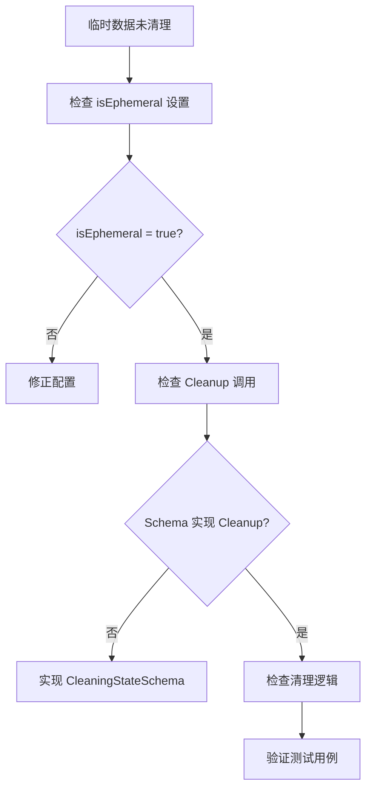

#### 清理性能问题

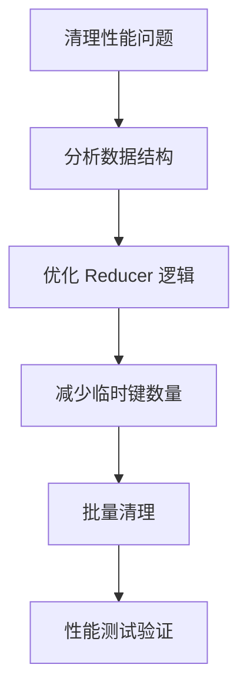

### 调试技巧

1. **启用详细日志**: 在清理前后记录状态变化
2. **单元测试验证**: 编写针对临时状态管理的测试用例
3. **性能分析**: 使用 Go 的 pprof 工具分析清理性能

**章节来源**
- [graph/channel_test.go](file://graph/channel_test.go#L1-L75)

## 总结

临时状态管理是 LangGraphGo 中一个精心设计的功能，它通过 `CleaningStateSchema` 接口和 `MapSchema` 实现，为开发者提供了强大而灵活的状态控制能力。该机制的核心优势包括：

1. **自动化清理**: 无需手动干预，系统自动处理临时数据的生命周期
2. **类型安全**: 通过接口设计确保类型安全和一致性
3. **高性能**: 优化的清理算法确保最小的性能开销
4. **易于使用**: 简洁的 API 设计降低了学习成本

通过合理使用临时状态管理功能，开发者可以构建更加健壮和高效的有状态应用程序，同时避免常见的状态污染问题。这种设计不仅体现了 LangGraphGo 的工程智慧，也为复杂业务场景的状态管理提供了标准化的解决方案。