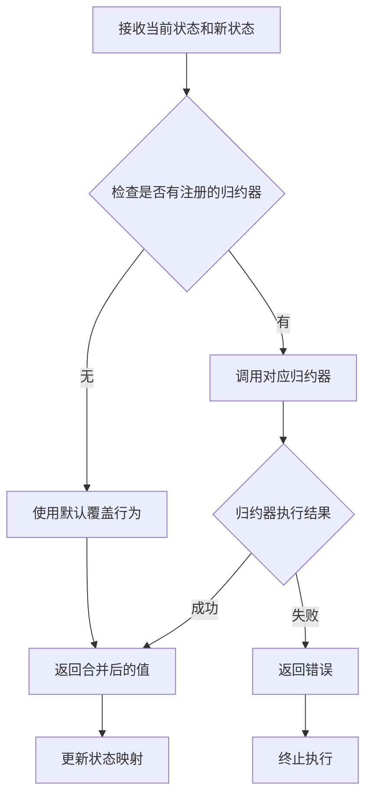
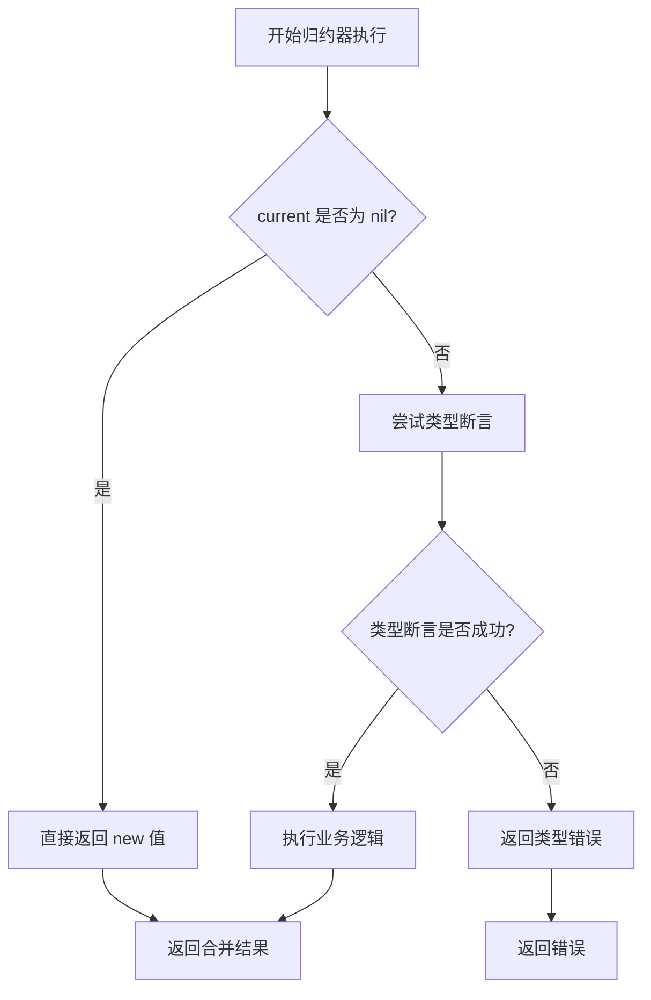
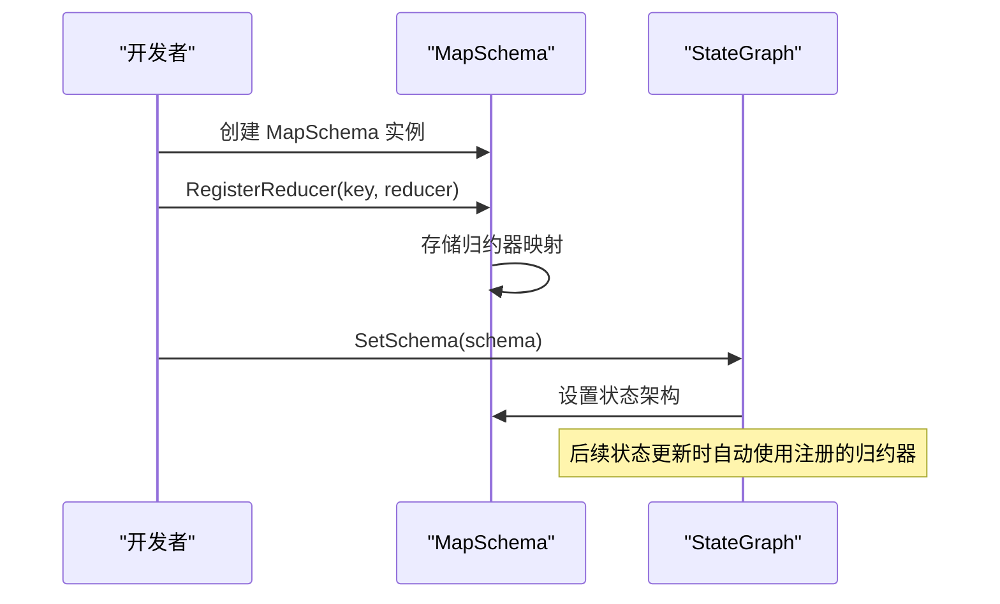
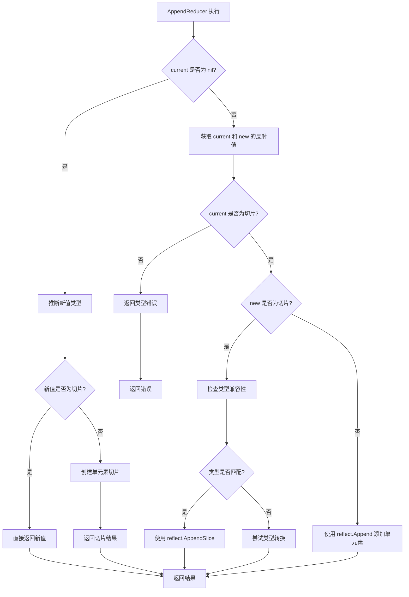
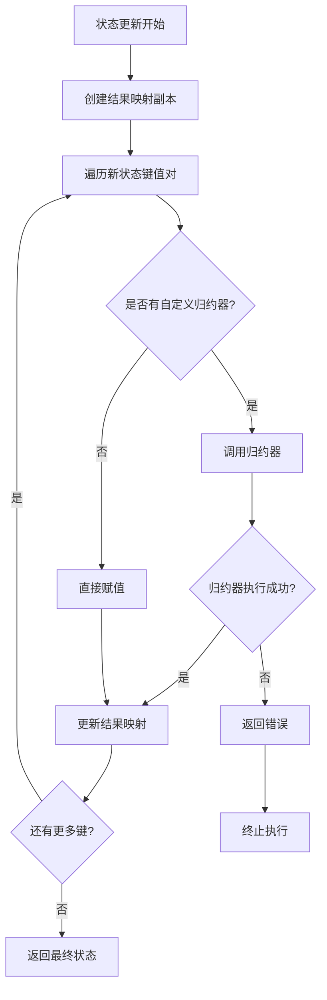

# 归约器类型

<cite>
**本文档中引用的文件**
- [schema.go](file://graph/schema.go)
- [schema_test.go](file://graph/schema_test.go)
- [state_schema/main.go](file://examples/state_schema/main.go)
- [state_schema/README.md](file://examples/state_schema/README.md)
- [custom_reducer/main.go](file://examples/custom_reducer/main.go)
- [custom_reducer/README.md](file://examples/custom_reducer/README.md)
</cite>

## 目录
1. [简介](#简介)
2. [归约器基础概念](#归约器基础概念)
3. [内置归约器类型](#内置归约器类型)
4. [自定义归约器开发](#自定义归约器开发)
5. [AppendReducer深度分析](#appendreducer深度分析)
6. [性能优化与最佳实践](#性能优化与最佳实践)
7. [常见陷阱与解决方案](#常见陷阱与解决方案)
8. [总结](#总结)

## 简介

在 langgraphgo 中，归约器（Reducer）是状态管理系统的核心组件，负责定义如何将新状态值合并到现有状态中。归约器机制使得复杂的状态更新逻辑变得灵活且可配置，支持从简单的覆盖操作到复杂的聚合计算等多种场景。

## 归约器基础概念

### 归约器接口定义

归约器是一个核心函数类型，定义了状态更新的基本契约：

```mermaid
classDiagram
class Reducer {
<<interface>>
+func(current, new interface{}) (interface{}, error)
}
class MapSchema {
+map[string]Reducer Reducers
+map[string]bool EphemeralKeys
+RegisterReducer(key string, reducer Reducer)
+RegisterChannel(key string, reducer Reducer, isEphemeral bool)
+Update(current, new interface{}) (interface{}, error)
+Cleanup(state interface{}) interface{}
}
class StateSchema {
<<interface>>
+Init() interface{}
+Update(current, new interface{}) (interface{}, error)
}
class CleaningStateSchema {
<<interface>>
+Cleanup(state interface{}) interface{}
}
MapSchema ..|> StateSchema
MapSchema ..|> CleaningStateSchema
MapSchema --> Reducer : "uses"
```

**图表来源**
- [schema.go](file://graph/schema.go#L7-L27)

### 核心工作原理

归约器的工作流程遵循以下模式：



**图表来源**
- [schema.go](file://graph/schema.go#L62-L97)

**章节来源**
- [schema.go](file://graph/schema.go#L7-L27)

## 内置归约器类型

### OverwriteReducer

**功能描述**：最简单的归约器实现，直接用新值替换旧值。

**实现特点**：
- 无条件覆盖现有值
- 不进行任何类型检查
- 性能最优的归约器

**使用场景**：
- 状态标志位更新
- 配置参数修改
- 临时状态清理

### AppendReducer

**功能描述**：智能的切片追加归约器，支持多种输入类型的灵活处理。

**核心特性**：
- 支持单元素和切片两种输入格式
- 使用反射机制确保类型安全
- 自动推断目标切片类型

**章节来源**
- [schema.go](file://graph/schema.go#L141-L185)

## 自定义归约器开发

### 函数签名要求

自定义归约器必须严格遵循以下函数签名：

```go
func CustomReducer(current, new interface{}) (interface{}, error)
```

**参数说明**：
- `current`：当前状态值，可能为nil
- `new`：新传入的状态值
- 返回值：合并后的状态值或错误

### 实现模式

#### 1. 类型安全验证模式



**图表来源**
- [state_schema/main.go](file://examples/state_schema/main.go#L11-L22)

#### 2. 错误处理规范

自定义归约器应遵循统一的错误处理模式：

| 错误类型 | 处理方式 | 示例 |
|---------|---------|------|
| 类型不匹配 | 明确返回类型转换错误 | `fmt.Errorf("expected int, got %T", current)` |
| 数据验证失败 | 返回验证错误信息 | `fmt.Errorf("invalid input: %v", value)` |
| 业务逻辑异常 | 包装原始错误 | `fmt.Errorf("failed to process: %w", err)` |

### 开发示例：SumReducer

基于 state_schema 示例的实现展示了标准的自定义归约器开发模式：

**实现要点**：
- 空值检查处理
- 类型安全断言
- 清晰的错误信息
- 优雅的类型转换

**章节来源**
- [state_schema/main.go](file://examples/state_schema/main.go#L11-L22)

### 注册到MapSchema流程

完整的归约器注册流程包括以下步骤：



**图表来源**
- [state_schema/main.go](file://examples/state_schema/main.go#L30-L42)

**章节来源**
- [state_schema/main.go](file://examples/state_schema/main.go#L30-L42)

## AppendReducer深度分析

### 反射机制实现

AppendReducer 是 langgraphgo 中最具技术含量的内置归约器，其实现展示了 Go 语言反射的强大能力。

#### 核心算法流程



**图表来源**
- [schema.go](file://graph/schema.go#L147-L185)

#### 类型兼容性处理逻辑

AppendReducer 的类型处理遵循严格的兼容性规则：

| 当前类型 | 新值类型 | 处理方式 | 结果 |
|---------|---------|---------|------|
| nil | 单元素 | 创建新切片 | `[newElement]` |
| nil | 切片 | 直接使用 | `newSlice` |
| 切片 | 切片 | 类型检查后合并 | `concatenatedSlice` |
| 切片 | 单元素 | 类型检查后追加 | `appendedSlice` |
| 其他 | 其他 | 类型错误 | `error` |

#### 反射操作的安全性考虑

AppendReducer 在使用反射时采取了多重安全保障措施：

1. **类型检查**：确保 current 必须是切片类型
2. **边界验证**：检查新值的类型兼容性
3. **错误恢复**：避免反射操作导致的程序崩溃
4. **性能优化**：在类型匹配时使用高效的 reflect.AppendSlice

**章节来源**
- [schema.go](file://graph/schema.go#L147-L185)

## 性能优化与最佳实践

### 性能考量因素

#### 1. 归约器选择策略

不同归约器的性能特征对比：

| 归约器类型 | 时间复杂度 | 空间复杂度 | 适用场景 |
|-----------|-----------|-----------|----------|
| OverwriteReducer | O(1) | O(1) | 频繁覆盖操作 |
| AppendReducer | O(n) | O(n+m) | 列表累积 |
| 自定义归约器 | 取决于实现 | 取决于实现 | 特殊业务逻辑 |

#### 2. 内存管理优化



**图表来源**
- [schema.go](file://graph/schema.go#L62-L97)

### 最佳实践指南

#### 1. 归约器设计原则

- **单一职责**：每个归约器只处理一种特定的合并逻辑
- **幂等性**：相同的输入总是产生相同的结果
- **不可变性**：避免直接修改输入参数
- **错误优先**：清晰的错误信息便于调试

#### 2. 类型安全保证

```go
// 推荐的类型检查模式
func SafeReducer(current, new interface{}) (interface{}, error) {
    if current == nil {
        return new, nil
    }
    
    // 类型断言检查
    currentVal, ok1 := current.(ExpectedType)
    newVal, ok2 := new.(ExpectedType)
    
    if !ok1 || !ok2 {
        return nil, fmt.Errorf("type mismatch: expected %T, got %T", current, new)
    }
    
    // 执行业务逻辑
    return combineValues(currentVal, newVal), nil
}
```

#### 3. 性能监控指标

关键性能指标包括：
- 归约器执行时间
- 内存分配量
- 错误发生率
- 并发安全性

**章节来源**
- [schema.go](file://graph/schema.go#L62-L97)

## 常见陷阱与解决方案

### 1. 类型断言风险

**问题描述**：不当的类型断言可能导致运行时panic

**解决方案**：
```go
// 错误做法
value := current.(int)  // 如果类型不匹配会panic

// 正确做法
value, ok := current.(int)
if !ok {
    return nil, fmt.Errorf("expected int, got %T", current)
}
```

### 2. 空值处理不当

**问题描述**：未正确处理nil值导致的错误

**解决方案**：
```go
// 统一的空值处理模式
func robustReducer(current, new interface{}) (interface{}, error) {
    if current == nil {
        return new, nil
    }
    // 继续处理非空情况
}
```

### 3. 反射性能开销

**问题描述**：过度使用反射影响性能

**解决方案**：
- 尽量避免在热路径中使用反射
- 对于已知类型，使用具体类型而非interface{}
- 考虑缓存反射操作结果

### 4. 并发安全问题

**问题描述**：在并发环境中使用共享资源

**解决方案**：
```go
// 使用互斥锁保护共享资源
var mu sync.Mutex
var sharedState map[string]interface{}

func concurrentSafeReducer(current, new interface{}) (interface{}, error) {
    mu.Lock()
    defer mu.Unlock()
    
    // 安全地访问和修改共享状态
    return processState(current, new)
}
```

### 5. 错误信息不清晰

**问题描述**：错误信息缺乏上下文，难以调试

**解决方案**：
```go
// 提供详细的错误信息
return nil, fmt.Errorf("failed to reduce key '%s': %w", key, originalError)
```

**章节来源**
- [state_schema/main.go](file://examples/state_schema/main.go#L15-L20)
- [custom_reducer/main.go](file://examples/custom_reducer/main.go#L15-L20)

## 总结

langgraphgo 的归约器系统提供了强大而灵活的状态管理机制。通过内置的 OverwriteReducer 和 AppendReducer，以及自定义归约器的扩展能力，开发者可以构建满足各种业务需求的状态更新逻辑。

### 关键要点回顾

1. **归约器接口**：统一的函数签名确保了归约器的一致性和可组合性
2. **内置归约器**：OverwriteReducer 提供简单高效的覆盖操作，AppendReducer 展示了反射技术的巧妙应用
3. **自定义开发**：遵循标准模式可以轻松创建符合业务需求的归约器
4. **性能优化**：合理选择归约器类型和优化实现细节可以显著提升系统性能
5. **最佳实践**：类型安全、错误处理、并发安全是开发高质量归约器的关键要素

### 发展方向

随着 langgraphgo 的持续发展，归约器系统可能会在以下方面得到增强：
- 更多内置归约器类型
- 性能优化和内存管理改进
- 类型安全性的进一步加强
- 并发处理能力的提升

通过深入理解和正确使用归约器机制，开发者可以构建出既高效又可靠的复杂状态管理系统。