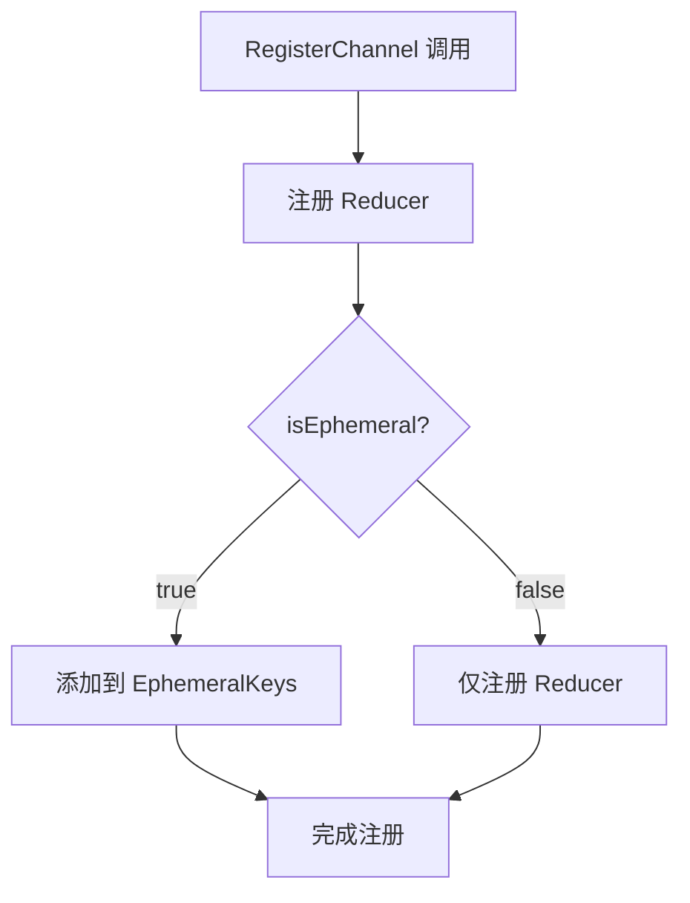
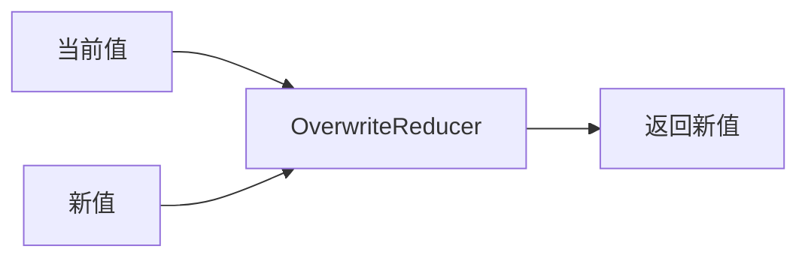
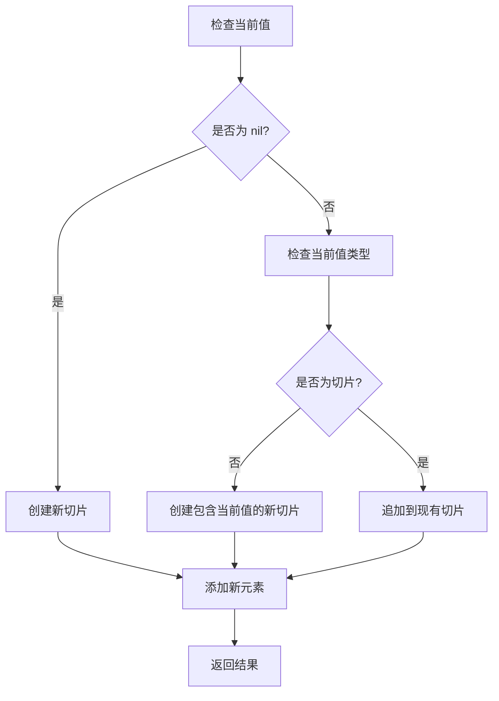
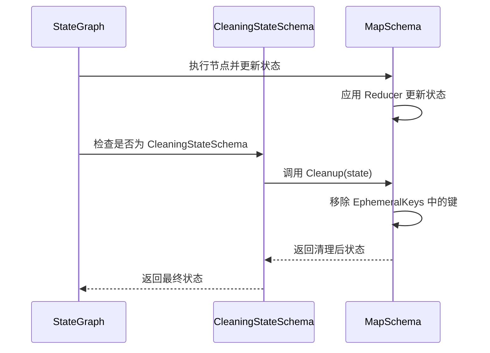
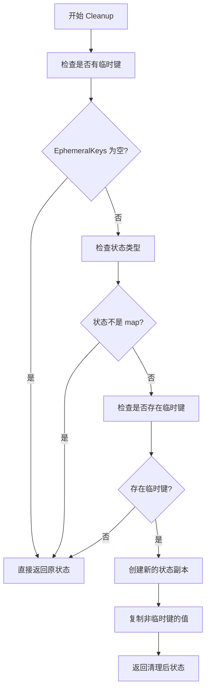
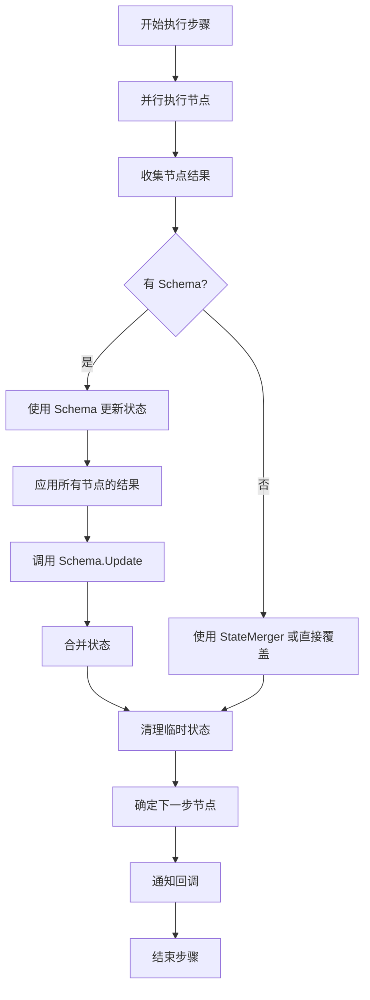
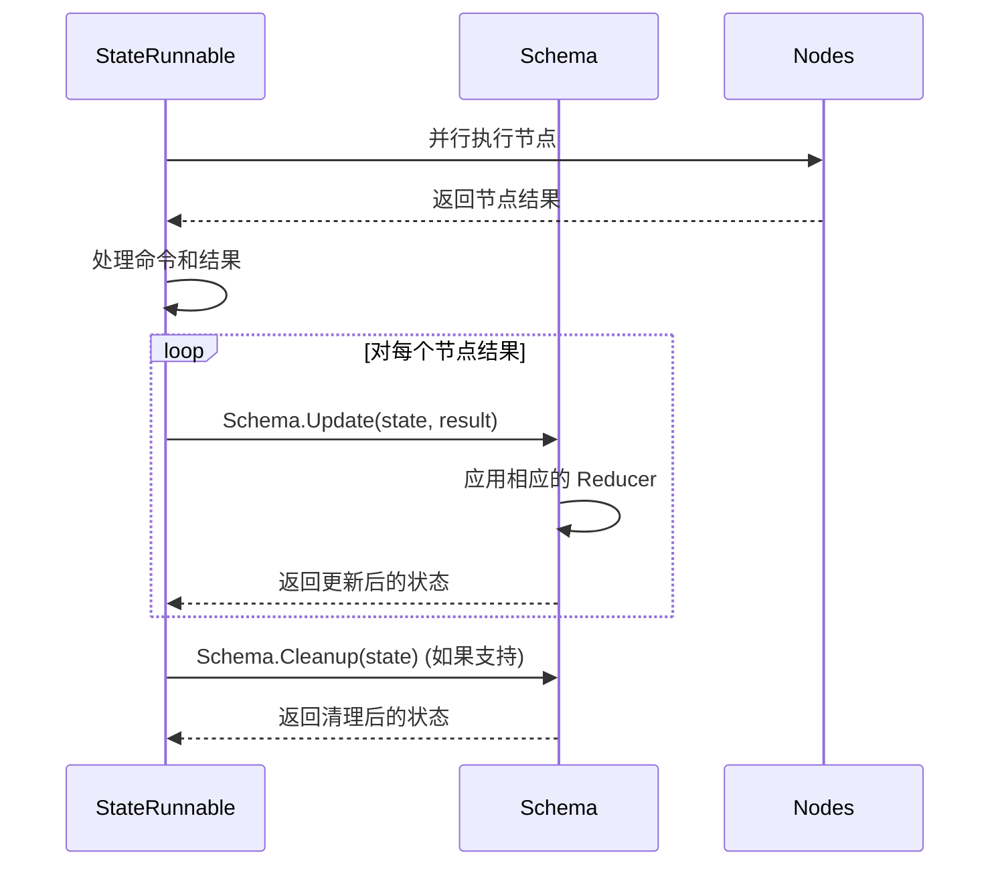
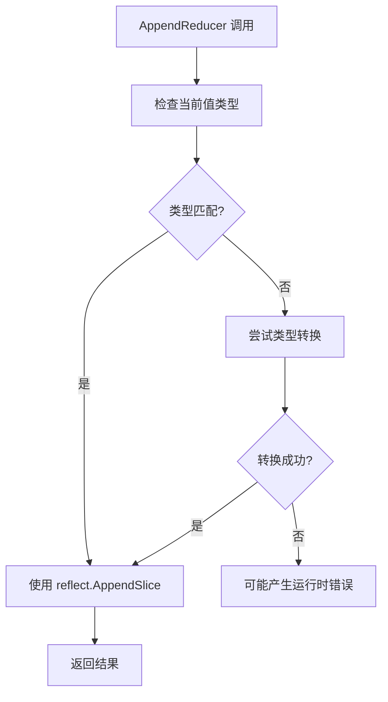

# 状态更新机制

<cite>
**本文档中引用的文件**
- [schema.go](file://graph/schema.go)
- [state_graph.go](file://graph/state_graph.go)
- [channel_test.go](file://graph/channel_test.go)
- [schema_test.go](file://graph/schema_test.go)
- [main.go](file://examples/ephemeral_channels/main.go)
- [main.go](file://examples/state_schema/main.go)
- [checkpointing.go](file://graph/checkpointing.go)
</cite>

## 目录
1. [简介](#简介)
2. [核心接口架构](#核心接口架构)
3. [StateSchema 接口详解](#stateschema-接口详解)
4. [MapSchema 实现机制](#mapschema-实现机制)
5. [Reducer 函数系统](#reducer-函数系统)
6. [CleaningStateSchema 与临时通道](#cleaningstateschema-与临时通道)
7. [状态更新流程](#状态更新流程)
8. [实际应用示例](#实际应用示例)
9. [性能优化考虑](#性能优化考虑)
10. [总结](#总结)

## 简介

langgraphgo 的状态更新机制是其核心功能之一，它提供了一套完整的状态管理框架，支持细粒度的状态控制、临时通道管理和复杂的更新策略。该机制通过 `StateSchema` 接口定义状态结构和更新逻辑，通过 `MapSchema` 实现具体的状态管理，并通过 `Reducer` 函数提供灵活的状态合并能力。

## 核心接口架构

```mermaid
classDiagram
class StateSchema {
<<interface>>
+Init() interface{}
+Update(current, new) (interface{}, error)
}
class CleaningStateSchema {
<<interface>>
+Cleanup(state) interface{}
}
class MapSchema {
+Reducers map[string]Reducer
+EphemeralKeys map[string]bool
+RegisterReducer(key, reducer)
+RegisterChannel(key, reducer, isEphemeral)
+Init() interface{}
+Update(current, new) (interface{}, error)
+Cleanup(state) interface{}
}
class Reducer {
<<function>>
+func(current, new interface{}) (interface{}, error)
}
StateSchema <|-- CleaningStateSchema
CleaningStateSchema <|.. MapSchema
MapSchema --> Reducer : uses
```

**图表来源**
- [schema.go](file://graph/schema.go#L12-L27)
- [schema.go](file://graph/schema.go#L29-L34)

**章节来源**
- [schema.go](file://graph/schema.go#L1-L27)

## StateSchema 接口详解

`StateSchema` 是状态更新机制的核心抽象接口，定义了状态的基本操作规范：

### 接口定义

```mermaid
classDiagram
class StateSchema {
<<interface>>
+Init() interface{}
+Update(current, new interface{}) (interface{}, error)
}
note for StateSchema "StateSchema 定义了状态的基本操作 : <br/>- Init() : 返回初始状态<br/>- Update() : 合并新状态到当前状态"
```

**图表来源**
- [schema.go](file://graph/schema.go#L12-L19)

### 核心方法说明

1. **Init() interface{}**: 初始化状态，返回空状态对象
2. **Update(current, new interface{}) (interface{}, error)**: 将新状态合并到当前状态中

这个接口的设计允许不同的状态管理策略，从简单的值替换到复杂的数据结构合并。

**章节来源**
- [schema.go](file://graph/schema.go#L12-L19)

## MapSchema 实现机制

`MapSchema` 是 `StateSchema` 接口的具体实现，专门用于处理键值对形式的状态映射：

### 数据结构设计

```mermaid
classDiagram
class MapSchema {
+Reducers map[string]Reducer
+EphemeralKeys map[string]bool
+RegisterReducer(key string, reducer Reducer)
+RegisterChannel(key string, reducer Reducer, isEphemeral bool)
+Init() interface{}
+Update(current, new interface{}) (interface{}, error)
+Cleanup(state interface{}) interface{}
}
note for MapSchema "MapSchema 使用两个映射表 : <br/>- Reducers : 存储每个键对应的更新函数<br/>- EphemeralKeys : 标记临时键"
```

**图表来源**
- [schema.go](file://graph/schema.go#L31-L34)

### 注册机制

`MapSchema` 提供了两种注册方式：

1. **RegisterReducer**: 为特定键注册更新函数
2. **RegisterChannel**: 同时注册更新函数和临时标志



**图表来源**
- [schema.go](file://graph/schema.go#L49-L54)

**章节来源**
- [schema.go](file://graph/schema.go#L29-L54)

## Reducer 函数系统

Reducer 函数是状态更新的核心逻辑单元，定义了如何将新值合并到当前值中：

### Reducer 类型定义

```mermaid
classDiagram
class Reducer {
<<function>>
+func(current, new interface{}) (interface{}, error)
}
note for Reducer "Reducer 函数签名 : <br/>func(current, new interface{}) (interface{}, error)<br/>- current : 当前状态值<br/>- new : 新状态值<br/>- 返回 : 合并后的状态值或错误"
```

**图表来源**
- [schema.go](file://graph/schema.go#L8-L10)

### 内置 Reducer 实现

#### OverwriteReducer
最简单的 Reducer，直接用新值替换旧值：



**图表来源**
- [schema.go](file://graph/schema.go#L141-L144)

#### AppendReducer
智能追加函数，支持切片和单个元素的追加：



**图表来源**
- [schema.go](file://graph/schema.go#L146-L185)

**章节来源**
- [schema.go](file://graph/schema.go#L140-L185)

## CleaningStateSchema 与临时通道

`CleaningStateSchema` 扩展了基本的 `StateSchema`，增加了清理功能，实现了临时通道（Ephemeral Channels）的概念：

### 接口扩展

```mermaid
classDiagram
class StateSchema {
+Init() interface{}
+Update(current, new interface{}) (interface{}, error)
}
class CleaningStateSchema {
+Cleanup(state interface{}) interface{}
}
StateSchema <|-- CleaningStateSchema
note for CleaningStateSchema "CleaningStateSchema 增加了 : <br/>- Cleanup() : 清理临时状态<br/>支持临时通道功能"
```

**图表来源**
- [schema.go](file://graph/schema.go#L21-L27)

### 临时通道工作原理

临时通道在每个步骤结束后自动被清理，确保不会影响后续步骤的状态：



**图表来源**
- [state_graph.go](file://graph/state_graph.go#L277-L279)
- [schema.go](file://graph/schema.go#L102-L137)

### Cleanup 方法实现

`Cleanup` 方法的优化策略：



**图表来源**
- [schema.go](file://graph/schema.go#L102-L137)

**章节来源**
- [schema.go](file://graph/schema.go#L21-L27)
- [schema.go](file://graph/schema.go#L102-L137)

## 状态更新流程

状态更新在整个执行流程中的位置和作用：

### 执行循环中的状态更新



**图表来源**
- [state_graph.go](file://graph/state_graph.go#L190-L220)
- [state_graph.go](file://graph/state_graph.go#L277-L280)

### 状态合并过程



**图表来源**
- [state_graph.go](file://graph/state_graph.go#L200-L209)
- [state_graph.go](file://graph/state_graph.go#L277-L279)

**章节来源**
- [state_graph.go](file://graph/state_graph.go#L190-L220)
- [state_graph.go](file://graph/state_graph.go#L277-L280)

## 实际应用示例

### 基本状态模式

基础的状态更新示例展示了如何使用自定义 Reducer：

**章节来源**
- [main.go](file://examples/state_schema/main.go#L1-L105)

### 临时通道示例

临时通道的实际应用场景：

**章节来源**
- [main.go](file://examples/ephemeral_channels/main.go#L1-L75)

### 测试验证

通过测试用例验证各种状态更新场景：

**章节来源**
- [schema_test.go](file://graph/schema_test.go#L1-L91)
- [channel_test.go](file://graph/channel_test.go#L1-L75)

## 性能优化考虑

### 内存管理优化

1. **状态副本策略**: `MapSchema.Update` 创建状态副本以避免直接修改
2. **临时键检查优化**: `Cleanup` 方法先检查是否存在临时键再进行复制
3. **并发安全**: 状态更新在单线程上下文中进行，避免锁竞争

### 类型反射优化

`AppendReducer` 使用反射处理不同类型的数据，但需要注意性能开销：



**图表来源**
- [schema.go](file://graph/schema.go#L170-L181)

### 批量更新优化

对于大量状态更新，可以考虑批量处理策略，减少 Schema 接口调用次数。

## 总结

langgraphgo 的状态更新机制提供了强大而灵活的状态管理能力：

1. **模块化设计**: 通过接口分离关注点，使状态管理可插拔
2. **类型安全**: 使用泛型接口确保类型安全性
3. **性能优化**: 通过懒加载和条件检查优化性能
4. **扩展性强**: 支持自定义 Reducer 和清理策略
5. **并发友好**: 设计上支持并行执行和状态隔离

这种设计使得开发者可以根据具体需求定制状态更新行为，同时保持系统的整体一致性和可靠性。无论是简单的状态跟踪还是复杂的工作流编排，都能通过这套机制得到有效支持。