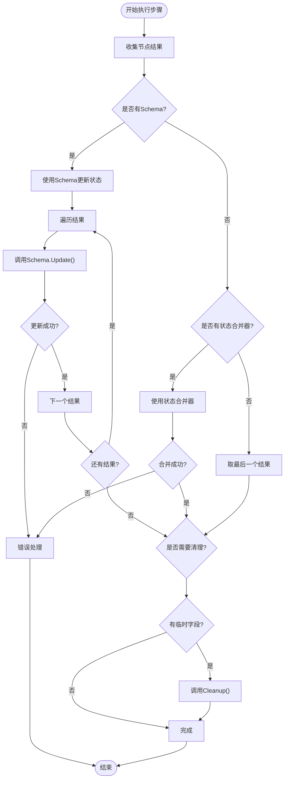
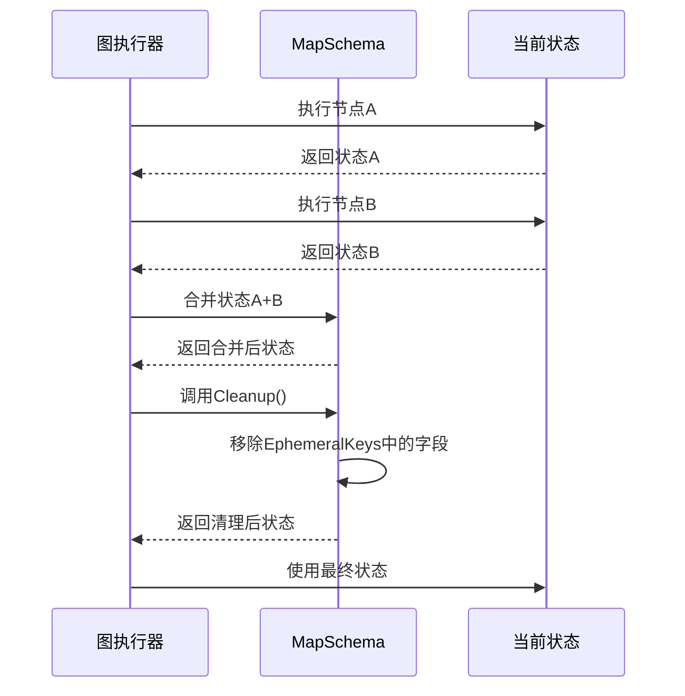

# 状态模式

<cite>
**本文档中引用的文件**
- [graph/schema.go](file://graph/schema.go)
- [graph/state_graph.go](file://graph/state_graph.go)
- [examples/state_schema/main.go](file://examples/state_schema/main.go)
- [examples/custom_reducer/main.go](file://examples/custom_reducer/main.go)
- [examples/ephemeral_channels/main.go](file://examples/ephemeral_channels/main.go)
- [graph/schema_test.go](file://graph/schema_test.go)
- [graph/update_state_test.go](file://graph/update_state_test.go)
- [graph/checkpointing.go](file://graph/checkpointing.go)
</cite>

## 目录
1. [简介](#简介)
2. [StateSchema 接口设计](#stateschema-接口设计)
3. [MapSchema 结构体实现](#mapschema-结构体实现)
4. [Reducer 函数系统](#reducer-函数系统)
5. [状态更新流程](#状态更新流程)
6. [Ephemeral 通道机制](#ephemeral-通道机制)
7. [实际应用示例](#实际应用示例)
8. [性能考虑](#性能考虑)
9. [故障排除指南](#故障排除指南)
10. [总结](#总结)

## 简介

Langgraphgo 的状态模式是一个精心设计的状态管理系统，它通过 `StateSchema` 接口和 `MapSchema` 结构体提供了灵活而强大的状态管理能力。该系统的核心思想是将状态视为可组合的、可定制的数据结构，每个字段都可以通过专门的归约器（Reducer）来控制其更新逻辑。

状态模式的主要优势包括：
- **字段级控制**：每个状态字段可以使用不同的更新策略
- **类型安全**：通过接口约束确保类型安全性
- **扩展性**：支持自定义归约器和特殊状态处理
- **生命周期管理**：内置临时数据清理机制

## StateSchema 接口设计

`StateSchema` 接口是整个状态管理系统的核心契约，定义了状态的基本操作规范。

### 接口定义

```mermaid
classDiagram
class StateSchema {
<<interface>>
+Init() interface{}
+Update(current, new interface{}) (interface{}, error)
}
class CleaningStateSchema {
<<interface>>
+Cleanup(state interface{}) interface{}
}
class MapSchema {
+Reducers map[string]Reducer
+EphemeralKeys map[string]bool
+Init() interface{}
+Update(current, new interface{}) (interface{}, error)
+Cleanup(state interface{}) interface{}
+RegisterReducer(key string, reducer Reducer)
+RegisterChannel(key string, reducer Reducer, isEphemeral bool)
}
StateSchema <|-- CleaningStateSchema : extends
StateSchema <|.. MapSchema : implements
CleaningStateSchema <|.. MapSchema : implements
```

**图表来源**
- [graph/schema.go](file://graph/schema.go#L12-L27)

### 核心方法

#### Init() 方法
`Init()` 方法负责初始化状态，返回一个空的状态对象。对于 `MapSchema` 来说，这通常是一个空的 `map[string]interface{}`。

#### Update() 方法
`Update()` 方法是状态管理的核心，它接受当前状态和新状态，返回合并后的状态。这个方法支持两种主要的更新策略：
- **使用注册的归约器**：对特定字段应用自定义的合并逻辑
- **默认覆盖**：对未注册字段直接替换

**章节来源**
- [graph/schema.go](file://graph/schema.go#L12-L19)

## MapSchema 结构体实现

`MapSchema` 是 `StateSchema` 接口的具体实现，专门为基于映射的状态管理而设计。

### 数据结构设计

```mermaid
classDiagram
class MapSchema {
+Reducers map[string]Reducer
+EphemeralKeys map[string]bool
+RegisterReducer(key string, reducer Reducer)
+RegisterChannel(key string, reducer Reducer, isEphemeral bool)
+Init() interface{}
+Update(current, new interface{}) (interface{}, error)
+Cleanup(state interface{}) interface{}
}
class Reducer {
<<function>>
+func(current, new interface{}) (interface{}, error)
}
MapSchema --> Reducer : uses
```

**图表来源**
- [graph/schema.go](file://graph/schema.go#L29-L34)

### 创建和配置

`MapSchema` 通过 `NewMapSchema()` 函数创建，内部维护两个关键映射：

1. **Reducers 映射**：存储字段名到归约器函数的映射
2. **EphemeralKeys 映射**：标记哪些字段是临时的

### 字段注册机制

#### RegisterReducer 方法
用于为特定字段注册归约器，实现字段级别的更新控制。

#### RegisterChannel 方法
这是更高级的注册方法，除了注册归约器外，还可以指定字段是否为临时的。

**章节来源**
- [graph/schema.go](file://graph/schema.go#L36-L55)

## Reducer 函数系统

Reducer 是状态更新的核心机制，它定义了如何将新值合并到现有状态中。

### Reducer 类型定义

```mermaid
classDiagram
class Reducer {
<<function>>
+func(current, new interface{}) (interface{}, error)
}
class OverwriteReducer {
+func(current, new interface{}) (interface{}, error)
}
class AppendReducer {
+func(current, new interface{}) (interface{}, error)
}
class CustomReducer {
+func(current, new interface{}) (interface{}, error)
}
Reducer <|.. OverwriteReducer
Reducer <|.. AppendReducer
Reducer <|.. CustomReducer
```

**图表来源**
- [graph/schema.go](file://graph/schema.go#L8-L10)
- [graph/schema.go](file://graph/schema.go#L141-L185)

### 内置归约器

#### OverwriteReducer
最简单的归约器，直接用新值替换旧值。

#### AppendReducer
智能的追加归约器，支持：
- 向现有切片追加元素
- 将单个元素添加到切片
- 自动创建新的切片类型

### 自定义归约器

开发者可以创建自定义归约器来实现复杂的合并逻辑。例如，在自定义归约器示例中展示了集合去重的实现。

**章节来源**
- [graph/schema.go](file://graph/schema.go#L141-L185)

## 状态更新流程

状态更新是图执行过程中的核心环节，涉及多个组件的协调工作。

### 执行流程图



**图表来源**
- [graph/state_graph.go](file://graph/state_graph.go#L177-L220)

### 关键执行点

#### Schema 更新调用
在 `StateRunnable.InvokeWithConfig` 方法中，状态更新发生在以下位置：

1. **结果处理阶段**：处理节点返回的结果
2. **命令处理阶段**：处理包含状态更新的命令
3. **状态合并阶段**：将所有结果合并到当前状态

#### 错误处理
状态更新失败时会返回详细的错误信息，包括失败的字段名和具体错误原因。

**章节来源**
- [graph/state_graph.go](file://graph/state_graph.go#L200-L209)

## Ephemeral 通道机制

Ephemeral 通道是一种特殊的字段类型，它在步骤完成后会被自动清理，防止临时数据泄漏到后续步骤中。

### 生命周期管理



**图表来源**
- [graph/state_graph.go](file://graph/state_graph.go#L277-L279)
- [graph/schema.go](file://graph/schema.go#L102-L137)

### 实现细节

#### EphemeralKeys 映射
`MapSchema` 维护一个布尔映射，记录哪些字段应该在清理时被移除。

#### 清理算法优化
清理过程包含性能优化：
- **存在性检查**：在清理前检查是否有需要清理的字段
- **按需复制**：只有在需要时才创建状态副本

**章节来源**
- [graph/schema.go](file://graph/schema.go#L102-L137)

## 实际应用示例

### 基础状态模式示例

基础示例展示了如何使用不同的归约器来管理不同类型的状态字段：

#### 配置示例
- **计数器字段**：使用自定义求和归约器
- **日志字段**：使用追加归约器
- **状态字段**：使用默认覆盖归约器

#### 执行效果
- 计数器字段：累加所有节点的值
- 日志字段：保留所有节点的日志条目
- 状态字段：只保留最后节点的状态

**章节来源**
- [examples/state_schema/main.go](file://examples/state_schema/main.go#L28-L40)

### 自定义归约器示例

展示了如何实现复杂的集合去重逻辑：

#### 归约器实现
- 处理现有集合和新元素
- 自动去重
- 支持多种输入格式

#### 应用场景
- 标签管理
- 去重的事件列表
- 唯一标识符集合

**章节来源**
- [examples/custom_reducer/main.go](file://examples/custom_reducer/main.go#L11-L42)

### Ephemeral 通道示例

演示了临时数据的生命周期管理：

#### 配置方式
- 显式标记字段为临时
- 在清理过程中自动移除

#### 验证机制
- 生产者设置临时数据
- 消费者无法访问已清理的数据
- 最终状态不包含临时字段

**章节来源**
- [examples/ephemeral_channels/main.go](file://examples/ephemeral_channels/main.go#L17-L22)

## 性能考虑

### 内存管理

#### 状态复制策略
- **按需复制**：只有在需要修改时才创建状态副本
- **就地更新**：对于只读操作避免不必要的复制
- **垃圾回收友好**：及时释放不需要的对象引用

### 执行效率

#### 归约器选择
- **简单归约器**：如覆盖归约器具有 O(1) 时间复杂度
- **复杂归约器**：如集合归约器可能达到 O(n) 复杂度
- **批量操作**：尽量减少单独的字段更新次数

#### 缓存机制
- **归约器缓存**：避免重复查找字段的归约器
- **类型检查缓存**：减少反射操作的开销

### 并发安全

虽然当前实现不是并发安全的，但在图执行过程中：
- 每个步骤的状态更新是串行的
- 不同步骤之间的状态是独立的
- 清理操作在步骤边界进行

## 故障排除指南

### 常见问题

#### 状态更新失败
**症状**：`schema update failed` 错误
**原因**：归约器返回错误或类型不匹配
**解决方案**：
- 检查归约器的输入类型
- 验证归约器的错误处理逻辑
- 确保字段类型一致性

#### 临时数据泄漏
**症状**：最终状态包含不应该存在的临时字段
**原因**：EphemeralKeys 配置错误或清理逻辑失效
**解决方案**：
- 验证 `RegisterChannel` 的 `isEphemeral` 参数
- 检查清理调用的位置和时机

#### 性能问题
**症状**：状态更新变得缓慢
**原因**：复杂的归约器或大量字段更新
**解决方案**：
- 优化归约器算法
- 减少不必要的字段更新
- 考虑使用状态合并器替代细粒度更新

### 调试技巧

#### 状态跟踪
- 在归约器中添加日志记录
- 使用中间状态检查点
- 监控内存使用情况

#### 单元测试
- 为自定义归约器编写测试
- 测试边界条件和错误情况
- 验证临时字段的清理行为

**章节来源**
- [graph/schema_test.go](file://graph/schema_test.go#L10-L91)

## 总结

Langgraphgo 的状态模式提供了一个强大而灵活的状态管理系统，通过以下核心特性实现了高效的状态管理：

### 设计优势

1. **模块化架构**：清晰的接口分离和职责划分
2. **类型安全**：强类型的接口约束确保运行时安全
3. **可扩展性**：支持自定义归约器和特殊状态处理
4. **生命周期管理**：内置的临时数据清理机制

### 应用价值

- **复杂状态管理**：支持多字段、异构状态结构
- **性能优化**：针对不同字段采用最优的更新策略
- **开发便利**：提供丰富的内置归约器和配置选项
- **调试友好**：清晰的错误信息和执行流程

### 最佳实践

1. **合理选择归约器**：根据业务需求选择合适的更新策略
2. **谨慎使用临时字段**：只在确实需要时使用 Ephemeral 通道
3. **性能监控**：关注状态更新的性能影响
4. **错误处理**：为自定义归约器提供完善的错误处理

通过深入理解和正确使用状态模式，开发者可以构建出既高效又可靠的有状态应用程序，充分利用 Langgraphgo 强大的状态管理能力。