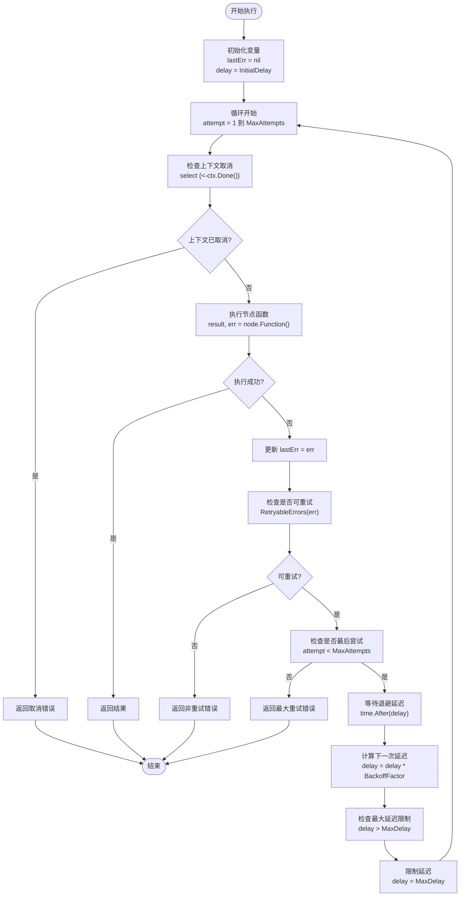
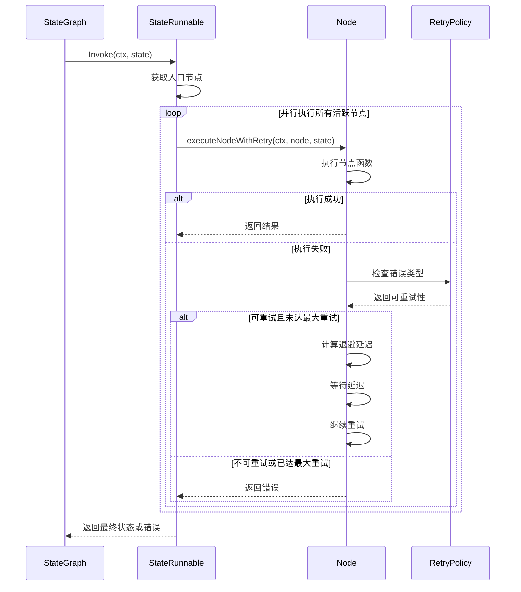
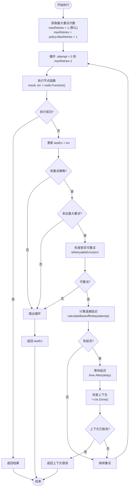
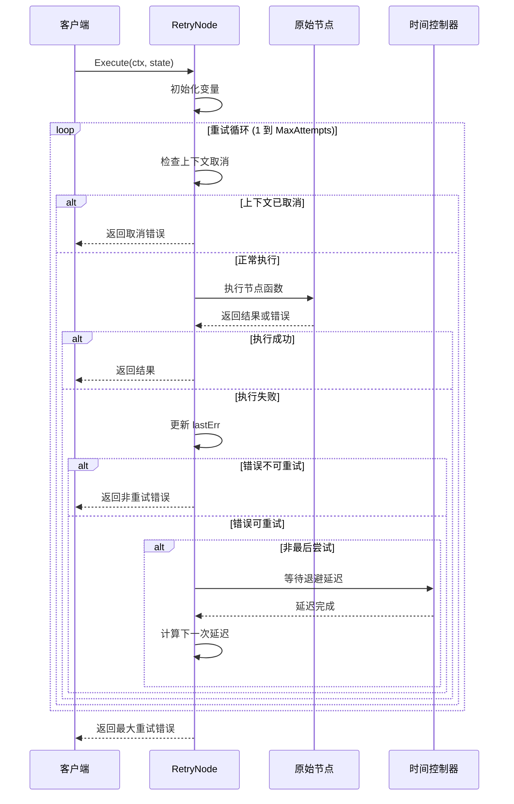
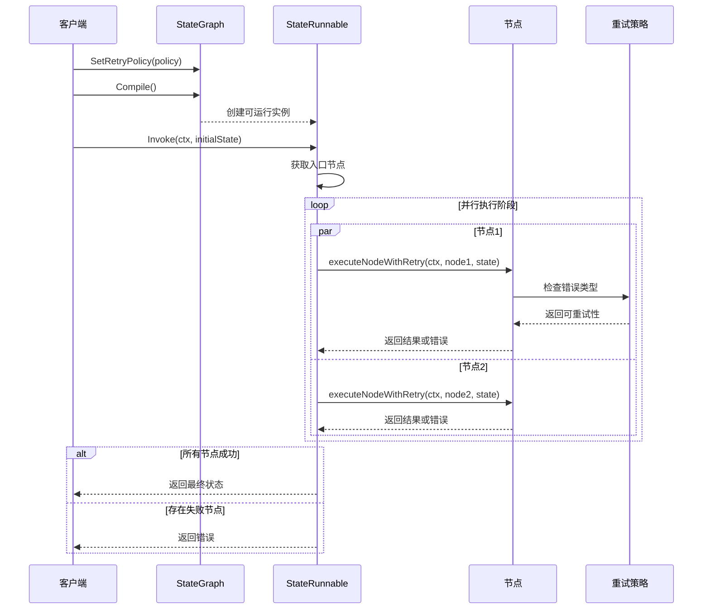
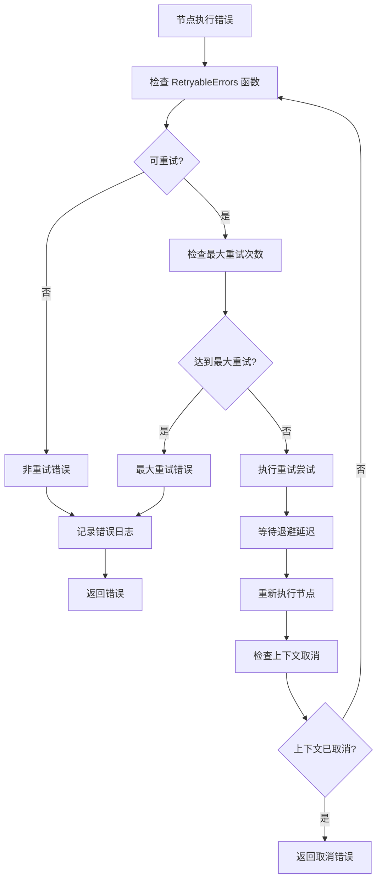

# 重试执行流程

<cite>
**本文档中引用的文件**
- [retry.go](file://graph/retry.go)
- [retry_test.go](file://graph/retry_test.go)
- [state_graph.go](file://graph/state_graph.go)
</cite>

## 目录
1. [简介](#简介)
2. [核心组件架构](#核心组件架构)
3. [RetryNode 结构体详解](#retrynode-结构体详解)
4. [StateRunnable 执行机制](#staterunnable-执行机制)
5. [重试策略配置](#重试策略配置)
6. [执行流程时序图](#执行流程时序图)
7. [错误处理与恢复](#错误处理与恢复)
8. [性能考虑](#性能考虑)
9. [最佳实践](#最佳实践)
10. [总结](#总结)

## 简介

langgraphgo 提供了强大的重试机制，确保图执行过程中的节点操作能够应对临时性故障。该系统通过两个主要组件实现：`RetryNode` 结构体用于包装单个节点的重试逻辑，以及 `StateRunnable` 中的 `executeNodeWithRetry` 方法用于图级别的重试控制。

重试机制的核心特点包括：
- 支持指数退避、线性退避和固定间隔三种退避策略
- 可配置的最大重试次数和初始延迟时间
- 基于错误类型的可插拔重试决策机制
- 完整的上下文取消支持
- 图级别和节点级别的双重重试控制

## 核心组件架构

```mermaid
classDiagram
class RetryNode {
+Node node
+RetryConfig config
+Execute(ctx, state) (interface{}, error)
}
class RetryConfig {
+int MaxAttempts
+time.Duration InitialDelay
+time.Duration MaxDelay
+float64 BackoffFactor
+func(error) bool RetryableErrors
}
class StateRunnable {
+StateGraph graph
+executeNodeWithRetry(ctx, node, state) (interface{}, error)
+isRetryableError(err) bool
+calculateBackoffDelay(attempt) time.Duration
}
class RetryPolicy {
+int MaxRetries
+BackoffStrategy BackoffStrategy
+[]string RetryableErrors
}
class Node {
+string Name
+func(ctx, state) (interface{}, error) Function
}
RetryNode --> RetryConfig : "使用"
RetryNode --> Node : "包装"
StateRunnable --> RetryPolicy : "应用"
StateRunnable --> Node : "执行"
StateGraph --> RetryPolicy : "配置"
```

**图表来源**
- [retry.go](file://graph/retry.go#L34-L38)
- [state_graph.go](file://graph/state_graph.go#L99-L101)
- [state_graph.go](file://graph/state_graph.go#L33-L39)

## RetryNode 结构体详解

### 结构定义

`RetryNode` 是一个轻量级的包装器，负责为单个节点添加重试功能：

```mermaid
classDiagram
class RetryNode {
-Node node
-RetryConfig config
+Execute(ctx, state) (interface{}, error)
}
class RetryConfig {
+int MaxAttempts
+time.Duration InitialDelay
+time.Duration MaxDelay
+float64 BackoffFactor
+func(error) bool RetryableErrors
}
RetryNode --> RetryConfig : "包含"
```

**图表来源**
- [retry.go](file://graph/retry.go#L34-L38)

### Execute 方法实现

`Execute` 方法是重试逻辑的核心，实现了完整的重试循环：



**图表来源**
- [retry.go](file://graph/retry.go#L51-L94)

**节来源**
- [retry.go](file://graph/retry.go#L51-L94)

### 关键特性

1. **上下文感知**：在每次重试前检查 `ctx.Done()`，确保及时响应取消信号
2. **指数退避**：支持可配置的退避因子，实现指数增长的延迟
3. **延迟限制**：防止延迟无限增长，设置最大延迟上限
4. **可插拔错误判断**：允许用户自定义哪些错误应该触发重试
5. **优雅降级**：当达到最大重试次数时提供详细的错误信息

## StateRunnable 执行机制

### 图级别重试控制

`StateRunnable` 实现了图级别的重试策略，与 `RetryNode` 形成互补：



**图表来源**
- [state_graph.go](file://graph/state_graph.go#L116-L232)
- [state_graph.go](file://graph/state_graph.go#L299-L338)

### executeNodeWithRetry 方法

该方法实现了图级别的重试逻辑：



**图表来源**
- [state_graph.go](file://graph/state_graph.go#L299-L338)

**节来源**
- [state_graph.go](file://graph/state_graph.go#L299-L338)

### Backoff 策略实现

`StateRunnable` 支持三种退避策略：

| 策略类型 | 计算公式 | 特点 |
|---------|---------|------|
| FixedBackoff | `baseDelay` | 固定间隔，简单可靠 |
| ExponentialBackoff | `baseDelay * 2^attempt` | 指数增长，适合网络故障 |
| LinearBackoff | `baseDelay * (attempt + 1)` | 线性增长，平衡性能 |

**节来源**
- [state_graph.go](file://graph/state_graph.go#L375-L394)

## 重试策略配置

### RetryConfig 配置选项

`RetryConfig` 提供了细粒度的重试行为控制：

| 字段 | 类型 | 默认值 | 描述 |
|------|------|--------|------|
| MaxAttempts | int | 3 | 最大重试次数 |
| InitialDelay | time.Duration | 100ms | 初始延迟时间 |
| MaxDelay | time.Duration | 5s | 最大延迟时间 |
| BackoffFactor | float64 | 2.0 | 退避因子 |
| RetryableErrors | func(error) bool | 全部重试 | 错误过滤函数 |

### RetryPolicy 图级别配置

`RetryPolicy` 提供图级别的重试策略：

| 字段 | 类型 | 描述 |
|------|------|------|
| MaxRetries | int | 最大重试次数 |
| BackoffStrategy | BackoffStrategy | 退避策略类型 |
| RetryableErrors | []string | 可重试错误模式列表 |

**节来源**
- [retry.go](file://graph/retry.go#L11-L18)
- [state_graph.go](file://graph/state_graph.go#L33-L39)

## 执行流程时序图

### 节点级重试流程



**图表来源**
- [retry.go](file://graph/retry.go#L51-L94)

### 图级别重试流程



**图表来源**
- [state_graph.go](file://graph/state_graph.go#L116-L232)

## 错误处理与恢复

### 错误分类机制

系统实现了多层次的错误处理：



**图表来源**
- [retry.go](file://graph/retry.go#L71-L94)
- [state_graph.go](file://graph/state_graph.go#L315-L335)

### 上下文取消处理

系统提供了完整的上下文取消支持：

1. **实时检查**：在每个重试循环中检查 `ctx.Done()`
2. **优雅退出**：检测到取消后立即停止重试
3. **错误传播**：正确传播取消原因和上下文信息
4. **资源清理**：确保取消时进行必要的资源清理

**节来源**
- [retry.go](file://graph/retry.go#L57-L61)
- [state_graph.go](file://graph/state_graph.go#L325-L327)

## 性能考虑

### 退避策略优化

不同的退避策略对性能的影响：

| 策略 | 延迟增长 | CPU 使用 | 网络负载 | 适用场景 |
|------|----------|----------|----------|----------|
| Fixed | 线性 | 低 | 稳定 | 硬件故障 |
| Exponential | 指数 | 中等 | 波动 | 网络拥塞 |
| Linear | 线性 | 中等 | 渐进 | 平衡需求 |

### 内存使用优化

1. **延迟队列管理**：及时清理过期的调用记录
2. **错误信息缓存**：避免重复创建相同的错误消息
3. **上下文传递**：最小化上下文数据的复制

### 并发控制

系统通过以下方式优化并发性能：

1. **并行节点执行**：支持多个节点同时重试
2. **选择器模式**：使用 `select` 实现非阻塞上下文检查
3. **goroutine 管理**：合理控制并发 goroutine 数量

## 最佳实践

### 配置建议

1. **初始延迟**：根据服务响应时间设置，通常为几百毫秒
2. **最大重试次数**：根据业务容忍度设置，一般不超过 5 次
3. **退避因子**：指数退避因子通常设置为 2.0
4. **最大延迟**：设置合理的上限，避免无限等待

### 错误处理策略

1. **区分错误类型**：只对临时性错误启用重试
2. **自定义重试条件**：根据具体业务场景定义重试规则
3. **监控和告警**：跟踪重试频率和成功率
4. **降级策略**：重试失败时提供备选方案

### 测试建议

1. **单元测试**：验证各种错误场景下的重试行为
2. **集成测试**：测试整个图的重试流程
3. **压力测试**：评估高并发情况下的重试性能
4. **故障注入**：模拟各种故障场景

**节来源**
- [retry_test.go](file://graph/retry_test.go#L18-L171)

## 总结

langgraphgo 的重试机制通过 `RetryNode` 和 `StateRunnable` 的协同工作，提供了强大而灵活的错误恢复能力。该系统的主要优势包括：

1. **双层重试控制**：节点级和图级的重试策略相互补充
2. **灵活的配置选项**：支持多种退避策略和错误过滤机制
3. **完善的上下文支持**：确保重试过程中的取消和超时处理
4. **高性能设计**：通过并行执行和优化算法保证系统性能

通过合理配置和使用这些重试机制，开发者可以构建更加健壮和可靠的图执行系统，有效应对各种临时性故障和异常情况。