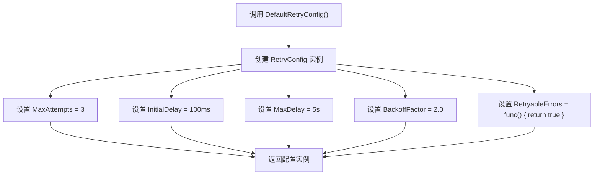
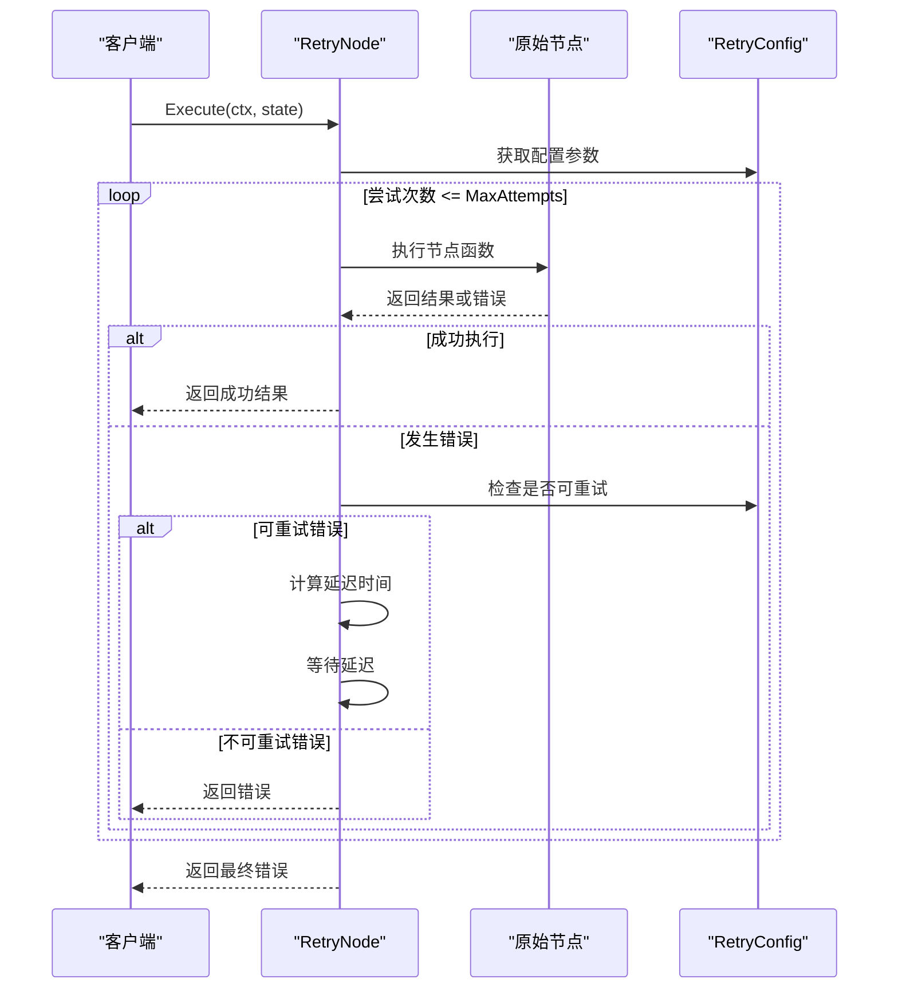
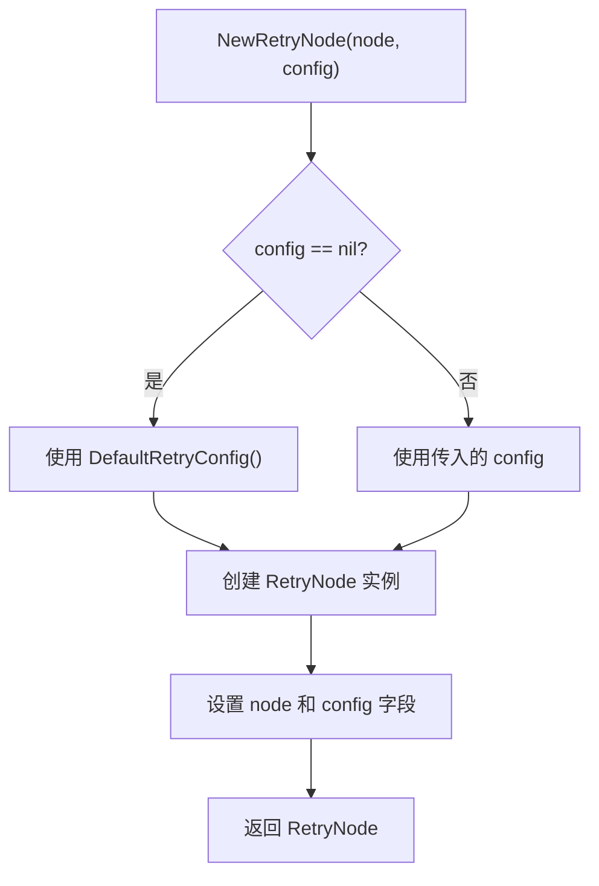
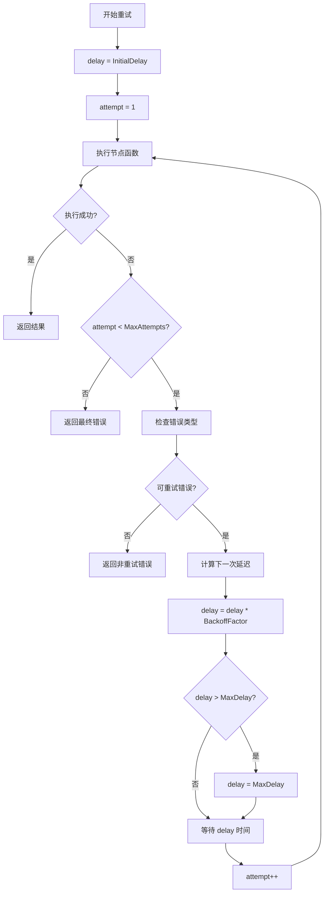
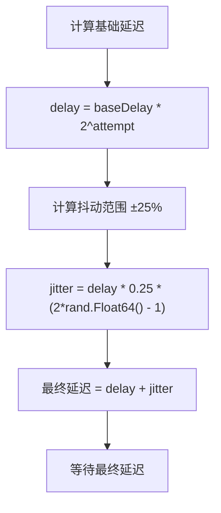
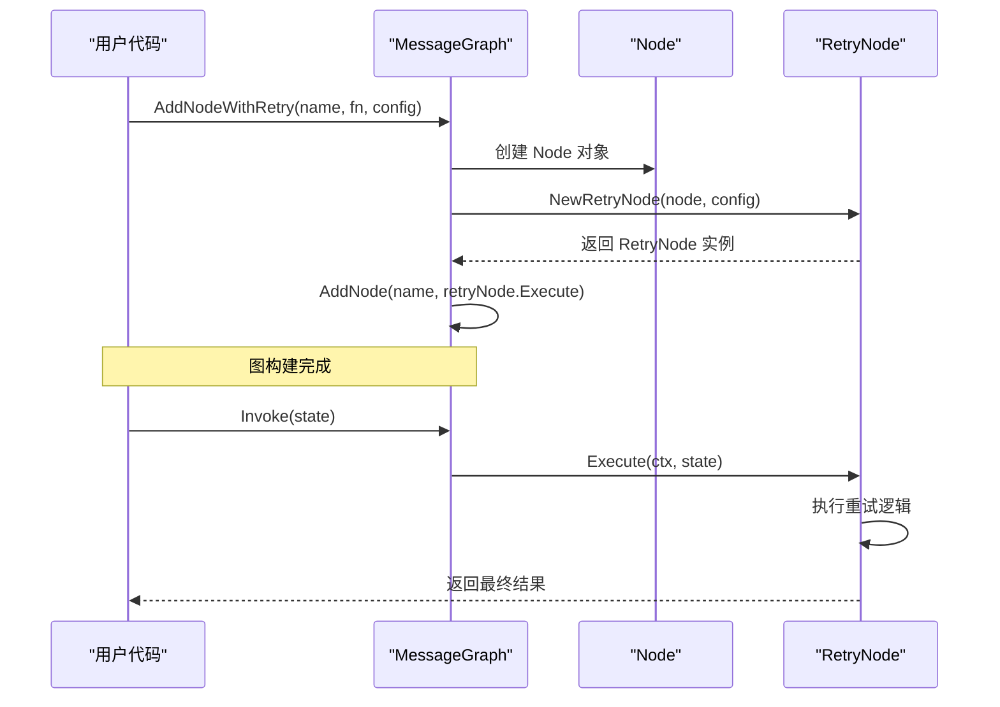
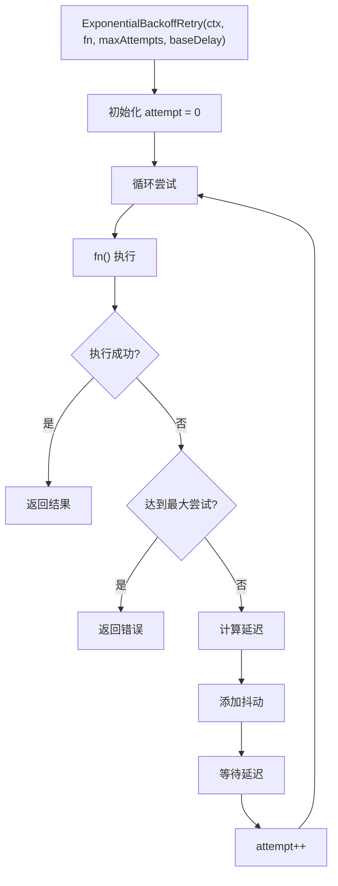
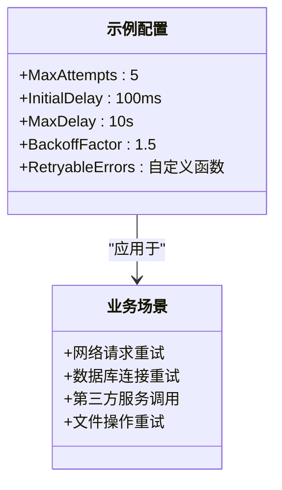

# 重试策略配置

<cite>
**本文档中引用的文件**
- [retry.go](file://graph/retry.go)
- [retry_test.go](file://graph/retry_test.go)
- [graph.go](file://graph/graph.go)
- [main.go](file://examples/basic_example/main.go)
</cite>

## 目录
1. [简介](#简介)
2. [核心数据结构](#核心数据结构)
3. [默认重试配置](#默认重试配置)
4. [重试节点架构](#重试节点架构)
5. [指数退避算法](#指数退避算法)
6. [节点级重试机制](#节点级重试机制)
7. [辅助函数 ExponentialBackoffRetry](#辅助函数-exponentialbackoffretry)
8. [实际应用场景](#实际应用场景)
9. [性能考虑](#性能考虑)
10. [故障排除指南](#故障排除指南)
11. [总结](#总结)

## 简介

langgraphgo 提供了一套完整的重试策略配置机制，用于处理分布式系统中的临时性故障和网络异常。该机制通过 `RetryConfig` 结构体定义重试行为，支持指数退避算法、随机抖动（jitter）以及可自定义的错误过滤器，确保系统的可靠性和稳定性。

## 核心数据结构

### RetryConfig 结构体

`RetryConfig` 是重试策略的核心配置结构，定义了重试行为的所有关键参数：

```mermaid
classDiagram
class RetryConfig {
+int MaxAttempts
+time.Duration InitialDelay
+time.Duration MaxDelay
+float64 BackoffFactor
+func(error) bool RetryableErrors
}
class RetryNode {
-Node node
-RetryConfig config
+Execute(ctx, state) (interface{}, error)
}
class MessageGraph {
+AddNodeWithRetry(name, fn, config)
+AddNode(name, fn)
}
RetryNode --> RetryConfig : "使用"
MessageGraph --> RetryNode : "创建"
```

**图表来源**
- [retry.go](file://graph/retry.go#L12-L17)
- [retry.go](file://graph/retry.go#L35-L38)

#### 字段详解

| 字段名 | 类型 | 默认值 | 描述 |
|--------|------|--------|------|
| MaxAttempts | int | 3 | 最大重试次数，防止无限重试 |
| InitialDelay | time.Duration | 100ms | 初始延迟时间，首次重试前等待时间 |
| MaxDelay | time.Duration | 5s | 最大延迟时间，防止延迟无限增长 |
| BackoffFactor | float64 | 2.0 | 退避因子，每次重试延迟时间的倍数增长 |
| RetryableErrors | func(error) bool | 返回 true | 可重试错误判定函数 |

**章节来源**
- [retry.go](file://graph/retry.go#L12-L17)

## 默认重试配置

### DefaultRetryConfig 函数

系统提供了 `DefaultRetryConfig` 函数来创建标准的重试配置：



**图表来源**
- [retry.go](file://graph/retry.go#L20-L31)

#### 默认配置特点

- **最大重试次数**：3次，平衡可靠性与响应时间
- **初始延迟**：100毫秒，快速响应但避免立即重试
- **最大延迟**：5秒，防止长时间阻塞
- **退避因子**：2.0，采用指数增长策略
- **错误处理**：默认重试所有错误，提供灵活性

**章节来源**
- [retry.go](file://graph/retry.go#L20-L31)

## 重试节点架构

### RetryNode 设计模式

`RetryNode` 采用了装饰器模式，为现有节点添加重试功能：



**图表来源**
- [retry.go](file://graph/retry.go#L51-L95)

### NewRetryNode 构造函数

构造函数负责创建重试节点并处理配置参数：



**图表来源**
- [retry.go](file://graph/retry.go#L40-L49)

**章节来源**
- [retry.go](file://graph/retry.go#L35-L49)

## 指数退避算法

### 延迟时间计算

指数退避算法的核心是延迟时间的动态计算：



**图表来源**
- [retry.go](file://graph/retry.go#L56-L91)

### 随机抖动（Jitter）机制

为了防止多个服务同时重试导致的雪崩效应，系统实现了随机抖动：



**图表来源**
- [retry.go](file://graph/retry.go#L346-L352)

#### 抖动公式解析

- **基础延迟**：`baseDelay * 2^attempt`（指数增长）
- **抖动范围**：±25% 的随机偏差
- **随机数生成**：`2*rand.Float64() - 1` 产生 [-1, 1] 范围的随机数
- **抖动效果**：避免多个请求同时重试

**章节来源**
- [retry.go](file://graph/retry.go#L346-L352)

## 节点级重试机制

### AddNodeWithRetry 方法

`AddNodeWithRetry` 是 MessageGraph 的扩展方法，用于添加带有重试功能的节点：



**图表来源**
- [retry.go](file://graph/retry.go#L97-L109)

### 执行流程详解

1. **节点包装**：将普通节点包装为 RetryNode
2. **配置应用**：应用 RetryConfig 参数
3. **重试循环**：执行节点函数并处理错误
4. **上下文检查**：实时监控取消信号
5. **延迟管理**：动态计算和应用延迟

**章节来源**
- [retry.go](file://graph/retry.go#L97-L109)

## 辅助函数 ExponentialBackoffRetry

### 函数签名与用途

`ExponentialBackoffRetry` 是一个独立的辅助函数，适用于需要指数退避的通用场景：



**图表来源**
- [retry.go](file://graph/retry.go#L329-L363)

### 与节点级重试的异同

| 特性 | ExponentialBackoffRetry | AddNodeWithRetry |
|------|-------------------------|------------------|
| 应用范围 | 通用函数调用 | 图节点执行 |
| 上下文支持 | 完整上下文控制 | 图执行上下文 |
| 错误处理 | 简单错误返回 | 节点级错误处理 |
| 配置方式 | 参数传递 | RetryConfig 结构 |
| 使用场景 | 任意函数重试 | 图节点重试 |

**章节来源**
- [retry.go](file://graph/retry.go#L329-L363)

## 实际应用场景

### 基本重试配置示例

以下展示了如何在实际项目中配置和使用重试策略：



### 测试用例分析

系统提供了全面的测试用例来验证重试机制：

| 测试场景 | 验证要点 | 预期结果 |
|----------|----------|----------|
| SuccessOnFirstAttempt | 正常执行不重试 | 1次调用 |
| RetryOnTransientFailure | 临时错误自动重试 | 3次调用后成功 |
| MaxAttemptsExceeded | 达到最大重试次数 | 返回最终错误 |
| NonRetryableError | 不可重试错误直接返回 | 1次调用 |
| ContextCancellation | 上下文取消时停止重试 | 提前终止 |

**章节来源**
- [retry_test.go](file://graph/retry_test.go#L18-L171)

## 性能考虑

### 资源消耗优化

1. **内存使用**：重试配置占用少量内存
2. **CPU开销**：指数退避算法计算简单
3. **网络资源**：避免频繁重试造成网络压力
4. **存储空间**：不保存重试历史记录

### 并发安全

- **线程安全**：RetryConfig 是不可变结构
- **并发执行**：每个重试节点独立运行
- **上下文传播**：正确传递取消信号

## 故障排除指南

### 常见问题及解决方案

| 问题类型 | 症状 | 解决方案 |
|----------|------|----------|
| 重试次数过多 | 系统响应缓慢 | 调整 MaxAttempts 或 BackoffFactor |
| 延迟过大 | 用户体验差 | 设置合理的 MaxDelay 值 |
| 错误被意外重试 | 业务逻辑错误 | 实现自定义 RetryableErrors 函数 |
| 内存泄漏 | 长时间运行后内存增加 | 检查上下文取消处理 |

### 调试技巧

1. **启用日志记录**：监控重试次数和延迟时间
2. **性能分析**：使用 pprof 分析重试对性能的影响
3. **错误分类**：实现详细的错误类型判断
4. **配置验证**：确保配置参数在合理范围内

## 总结

langgraphgo 的重试策略配置机制提供了强大而灵活的容错能力：

### 核心优势

1. **配置灵活**：通过 RetryConfig 结构体支持各种重试策略
2. **算法先进**：指数退避配合随机抖动，有效避免雪崩效应
3. **易于使用**：提供简洁的 API 和默认配置
4. **性能优化**：智能的延迟管理和资源控制
5. **全面测试**：完善的单元测试覆盖各种边界情况

### 最佳实践建议

1. **合理配置参数**：根据业务需求调整重试次数和延迟
2. **错误分类处理**：实现精确的错误类型判断
3. **监控和告警**：建立重试成功率的监控体系
4. **渐进式重试**：从保守配置开始，逐步优化参数
5. **文档化配置**：记录不同场景下的推荐配置

通过合理使用这套重试策略配置机制，可以显著提高系统的可靠性和用户体验，同时保持良好的性能表现。