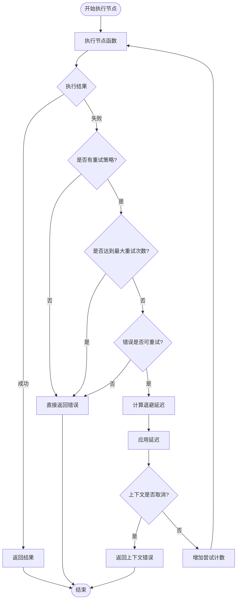
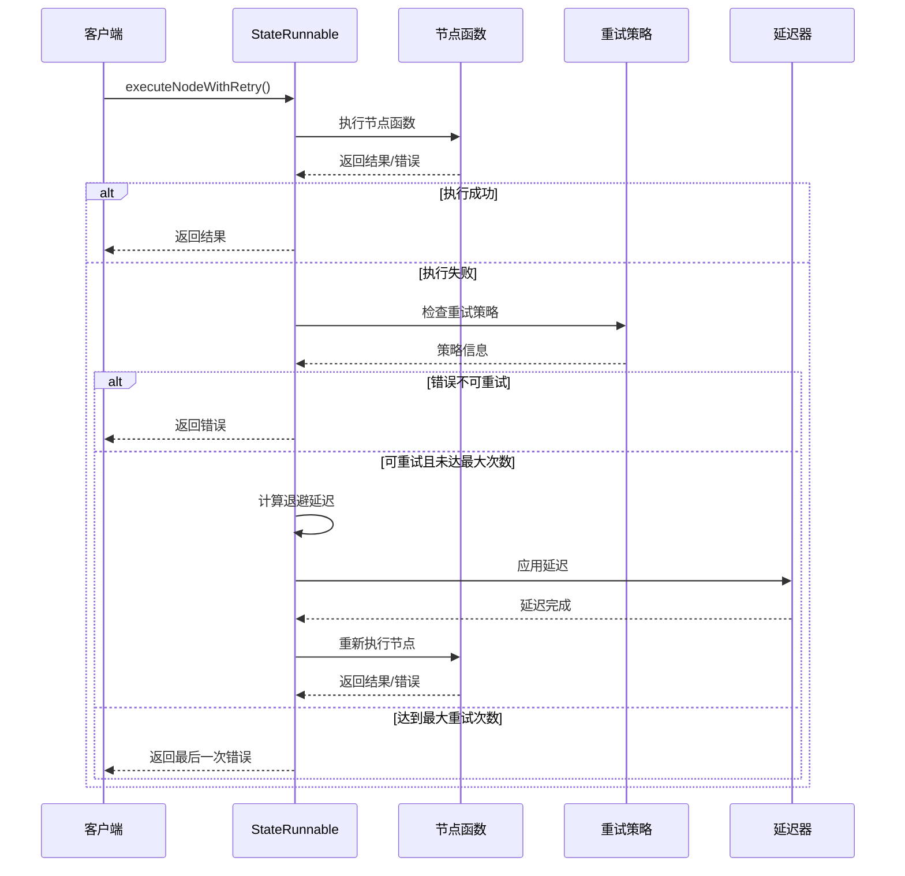
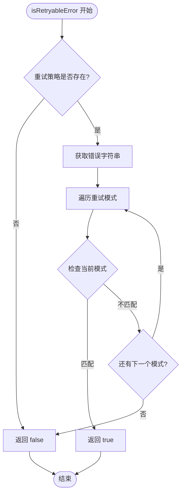
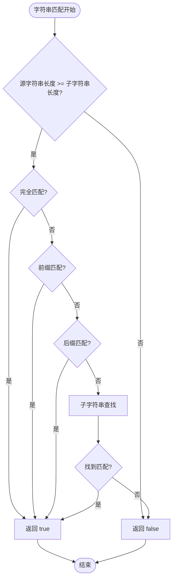
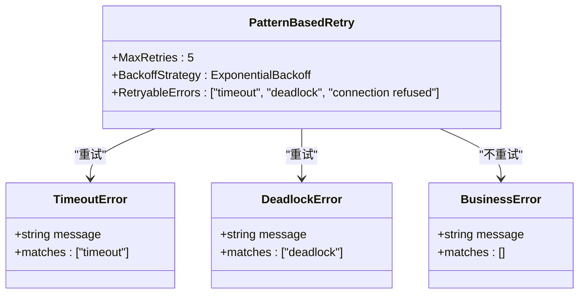

# 错误判定机制

<cite>
**本文档中引用的文件**
- [graph/retry.go](file://graph/retry.go)
- [graph/state_graph.go](file://graph/state_graph.go)
- [graph/retry_test.go](file://graph/retry_test.go)
- [examples/basic_example/main.go](file://examples/basic_example/main.go)
</cite>

## 目录
1. [简介](#简介)
2. [核心架构概述](#核心架构概述)
3. [RetryConfig 配置机制](#retryconfig-配置机制)
4. [StateGraph 错误判定流程](#stategraph-错误判定流程)
5. [isRetryableError 方法详解](#isretryableerror-方法详解)
6. [实际应用示例](#实际应用示例)
7. [最佳实践与优化建议](#最佳实践与优化建议)
8. [总结](#总结)

## 简介

langgraphgo 提供了一套完善的错误判定和重试机制，允许开发者精确控制哪些错误应该被重试，哪些应该立即失败。该机制的核心在于 `RetryConfig` 和 `RetryPolicy` 结构体，它们提供了灵活的错误过滤和重试策略配置能力。

本文档将深入探讨这些机制的工作原理，重点分析 `RetryableErrors` 字段如何实现精细化的错误控制，并展示如何配置系统以区分不同类型的错误（如网络超时、数据库死锁等临时性错误与业务逻辑错误）。

## 核心架构概述

langgraphgo 的错误判定机制采用分层设计，主要包含以下组件：

```mermaid
classDiagram
class RetryConfig {
+int MaxAttempts
+time.Duration InitialDelay
+time.Duration MaxDelay
+float64 BackoffFactor
+func(error) bool RetryableErrors
}
class RetryPolicy {
+int MaxRetries
+BackoffStrategy BackoffStrategy
+[]string RetryableErrors
}
class StateGraph {
+map[string]Node nodes
+*RetryPolicy retryPolicy
+SetRetryPolicy(policy *RetryPolicy)
}
class StateRunnable {
+*StateGraph graph
+executeNodeWithRetry(ctx, node, state) (interface{}, error)
+isRetryableError(err error) bool
+calculateBackoffDelay(attempt int) time.Duration
}
class RetryNode {
+Node node
+*RetryConfig config
+Execute(ctx, state) (interface{}, error)
}
RetryConfig --> RetryNode : "配置"
RetryPolicy --> StateGraph : "设置"
StateGraph --> StateRunnable : "编译为"
StateRunnable --> RetryPolicy : "使用"
StateRunnable --> RetryConfig : "使用"
```

**图表来源**
- [graph/retry.go](file://graph/retry.go#L11-L18)
- [graph/state_graph.go](file://graph/state_graph.go#L34-L39)
- [graph/state_graph.go](file://graph/state_graph.go#L99-L102)

## RetryConfig 配置机制

### 基本配置结构

`RetryConfig` 是用于配置单个节点重试行为的核心结构体，它包含了所有必要的重试参数：

```mermaid
classDiagram
class RetryConfig {
+int MaxAttempts
+time.Duration InitialDelay
+time.Duration MaxDelay
+float64 BackoffFactor
+func(error) bool RetryableErrors
+DefaultRetryConfig() *RetryConfig
}
class DefaultRetryConfig {
+MaxAttempts : 3
+InitialDelay : 100ms
+MaxDelay : 5s
+BackoffFactor : 2.0
+RetryableErrors : func(err error) bool { return true }
}
RetryConfig --> DefaultRetryConfig : "默认值"
```

**图表来源**
- [graph/retry.go](file://graph/retry.go#L11-L18)
- [graph/retry.go](file://graph/retry.go#L21-L31)

### RetryableErrors 函数字段

`RetryableErrors` 是一个关键的函数字段，它决定了某个错误是否应该触发重试。这个字段可以是两种类型：

1. **函数式配置**：使用 `func(error) bool` 类型，提供动态的错误过滤逻辑
2. **模式匹配配置**：使用 `[]string` 类型，在 `RetryPolicy` 中定义静态的错误模式

**节来源**
- [graph/retry.go](file://graph/retry.go#L17-L18)
- [graph/state_graph.go](file://graph/state_graph.go#L38-L39)

## StateGraph 错误判定流程

### 整体执行流程

当在 `StateGraph` 中执行节点时，系统会按照以下流程处理错误：



**图表来源**
- [graph/state_graph.go](file://graph/state_graph.go#L299-L339)

### 节点执行与重试逻辑

在 `StateRunnable` 的 `executeNodeWithRetry` 方法中，实现了完整的重试逻辑：



**图表来源**
- [graph/state_graph.go](file://graph/state_graph.go#L299-L339)

**节来源**
- [graph/state_graph.go](file://graph/state_graph.go#L299-L339)

## isRetryableError 方法详解

### 方法实现原理

`isRetryableError` 方法是错误判定的核心，它根据不同的配置方式执行相应的检查逻辑：



**图表来源**
- [graph/state_graph.go](file://graph/state_graph.go#L341-L355)

### 字符串匹配算法

该方法使用高效的字符串匹配算法来检查错误信息是否包含指定的模式：



**图表来源**
- [graph/state_graph.go](file://graph/state_graph.go#L357-L373)

**节来源**
- [graph/state_graph.go](file://graph/state_graph.go#L341-L355)
- [graph/state_graph.go](file://graph/state_graph.go#L357-L373)

## 实际应用示例

### 示例 1：基础重试配置

最基本的重试配置，适用于所有类型的临时性错误：

```mermaid
classDiagram
class BasicRetryExample {
+MaxAttempts : 3
+InitialDelay : 100ms
+BackoffFactor : 2.0
+RetryableErrors : func(err error) bool { return true }
}
class NetworkError {
+string message
+bool retryable
}
class BusinessLogicError {
+string message
+bool retryable
}
BasicRetryExample --> NetworkError : "重试"
BasicRetryExample --> BusinessLogicError : "重试"
```

**图表来源**
- [graph/retry.go](file://graph/retry.go#L27-L30)

### 示例 2：条件性重试配置

只对特定类型的错误进行重试：

```mermaid
classDiagram
class ConditionalRetryExample {
+MaxAttempts : 3
+InitialDelay : 500ms
+BackoffFactor : 1.5
+RetryableErrors : func(err error) bool {
return err != nil && strings.Contains(err.Error(), "transient")
}
}
class TransientError {
+string message
+bool retryable
}
class CriticalError {
+string message
+bool retryable
}
ConditionalRetryExample --> TransientError : "重试"
ConditionalRetryExample --> CriticalError : "不重试"
```

**图表来源**
- [graph/retry_test.go](file://graph/retry_test.go#L147-L150)

### 示例 3：基于模式的重试配置

使用字符串模式匹配来识别可重试的错误：



**图表来源**
- [graph/state_graph.go](file://graph/state_graph.go#L38-L39)

**节来源**
- [graph/retry_test.go](file://graph/retry_test.go#L134-L171)

## 最佳实践与优化建议

### 错误分类策略

1. **临时性错误**：网络超时、连接断开、资源竞争等
   ```go
   // 示例：网络超时错误重试
   RetryableErrors: []string{"timeout", "connection", "unreachable"}
   ```

2. **永久性错误**：数据格式错误、权限不足、业务规则违反等
   ```go
   // 示例：业务逻辑错误不重试
   RetryableErrors: func(err error) bool {
       msg := err.Error()
       return !(strings.Contains(msg, "invalid") || 
                strings.Contains(msg, "permission") ||
                strings.Contains(msg, "not found"))
   }
   ```

3. **混合策略**：结合函数和模式匹配
   ```go
   // 示例：复杂重试策略
   RetryableErrors: func(err error) bool {
       msg := err.Error()
       // 数据库死锁重试
       if strings.Contains(msg, "deadlock") {
           return true
       }
       // 网络错误重试
       if strings.Contains(msg, "timeout") || strings.Contains(msg, "connection") {
           return true
       }
       // 其他错误不重试
       return false
   }
   ```

### 性能优化建议

1. **合理的重试次数**：避免无限重试导致资源浪费
2. **指数退避策略**：使用适当的退避因子平衡响应速度和系统负载
3. **上下文取消检测**：及时响应外部取消信号
4. **错误日志记录**：记录重试过程以便问题诊断

### 监控和调试

1. **重试统计**：跟踪重试次数和成功率
2. **错误分类**：按错误类型统计重试效果
3. **性能指标**：监控重试对系统性能的影响
4. **告警机制**：设置重试失败的告警阈值

## 总结

langgraphgo 的错误判定机制提供了强大而灵活的错误处理能力。通过 `RetryConfig` 和 `RetryPolicy` 的组合使用，开发者可以：

1. **精确控制重试行为**：通过 `RetryableErrors` 字段实现细粒度的错误过滤
2. **支持多种配置方式**：既支持函数式动态过滤，也支持静态模式匹配
3. **集成多种重试策略**：包括固定延迟、指数退避和线性退避
4. **保证系统稳定性**：通过智能的错误判定避免不必要的重试

这种设计使得 langgraphgo 能够优雅地处理各种复杂的分布式系统场景，提高系统的可靠性和用户体验。开发者可以根据具体的应用需求，灵活配置重试策略，实现最优的错误处理效果。