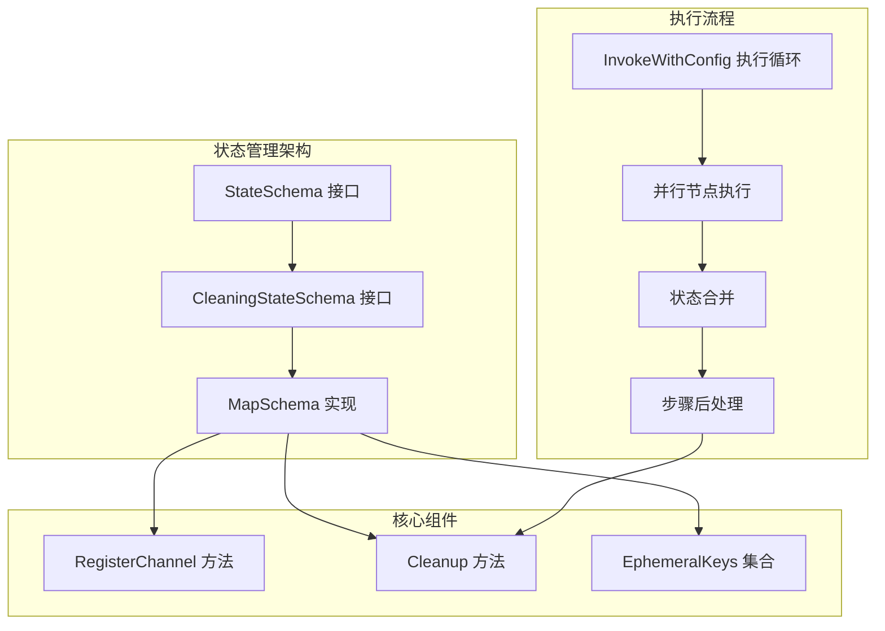
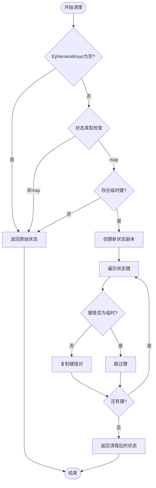
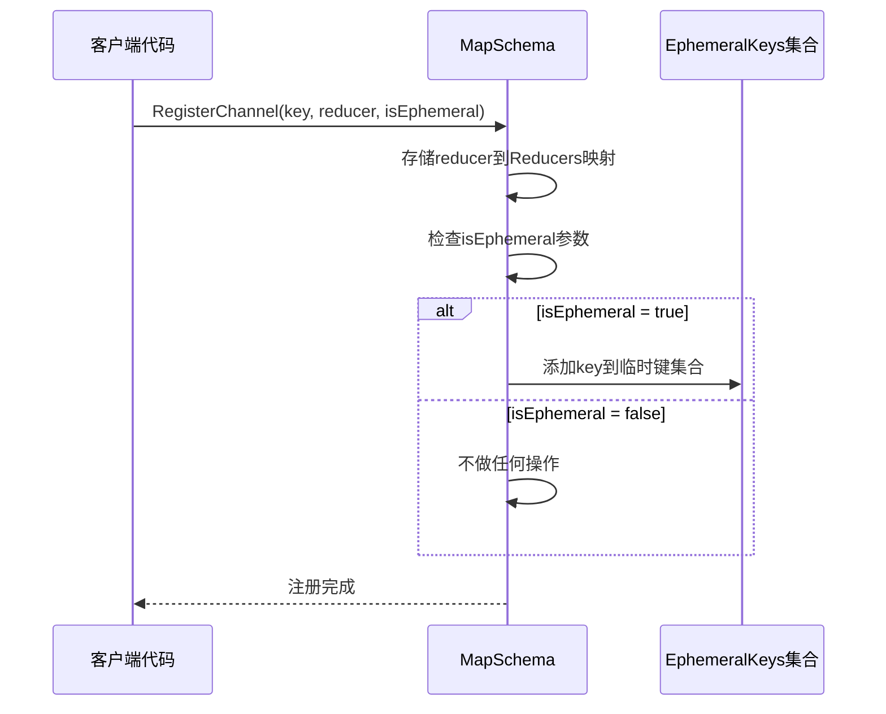
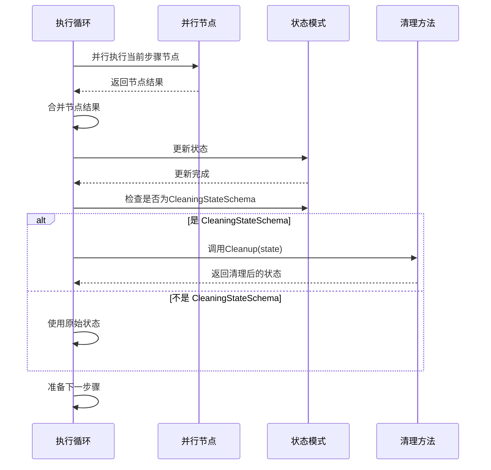
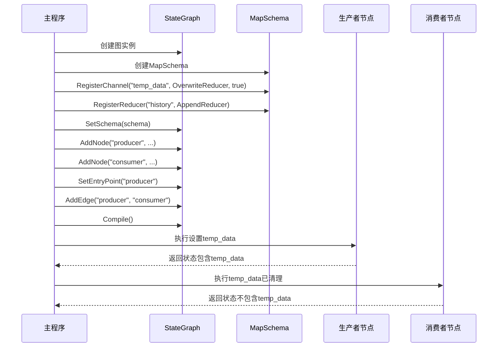
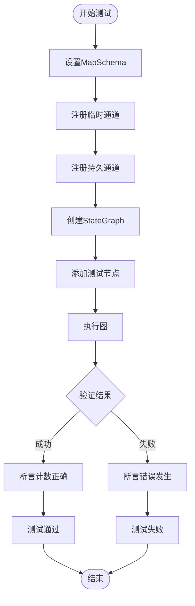

# 临时通道

<cite>
**本文档中引用的文件**
- [examples/ephemeral_channels/main.go](file://examples/ephemeral_channels/main.go)
- [examples/ephemeral_channels/README.md](file://examples/ephemeral_channels/README.md)
- [examples/ephemeral_channels/README_CN.md](file://examples/ephemeral_channels/README_CN.md)
- [graph/schema.go](file://graph/schema.go)
- [graph/state_graph.go](file://graph/state_graph.go)
- [graph/channel_test.go](file://graph/channel_test.go)
- [graph/schema_test.go](file://graph/schema_test.go)
- [graph/graph.go](file://graph/graph.go)
- [graph/listeners.go](file://graph/listeners.go)
- [graph/checkpointing.go](file://graph/checkpointing.go)
</cite>

## 目录
1. [简介](#简介)
2. [核心概念](#核心概念)
3. [架构概览](#架构概览)
4. [详细组件分析](#详细组件分析)
5. [技术实现](#技术实现)
6. [使用示例](#使用示例)
7. [测试验证](#测试验证)
8. [性能考虑](#性能考虑)
9. [故障排除指南](#故障排除指南)
10. [总结](#总结)

## 简介

临时通道（Ephemeral Channels）是 langgraphgo 中的一项重要功能，专门用于管理生命周期短暂的数据。这些数据仅在当前执行步骤内有效，步骤完成后应被自动清除，以防止上下文污染。临时通道的设计目的是解决有状态应用中不需要在整个对话历史中持久保存的数据管理问题。

临时通道的核心价值在于：
- **自动清理机制**：在步骤完成后自动移除临时数据
- **作用域隔离**：防止临时数据泄漏到未来的执行步骤
- **配置灵活性**：通过 `RegisterChannel` 方法的 `isEphemeral` 标志进行精确控制

## 核心概念

### 临时数据 vs 持久数据

在状态化应用中，数据可以分为两类：

1. **持久数据（Persistent Data）**：需要在整个对话历史中保持的数据
2. **临时数据（Ephemeral Data）**：仅在当前步骤或特定超步中有效的数据

临时数据的例子包括：
- 临时搜索结果
- 中间推理步骤
- 触发立即动作的标志
- 临时计算结果

### 步骤概念

在 langgraphgo 中，"步骤"（Step）通常对应于超步（Super-step），即并行执行的节点组。临时数据在步骤结束时被清理，而不是在每个节点执行后立即清理。

## 架构概览

临时通道功能的整体架构如下：



**图表来源**
- [graph/schema.go](file://graph/schema.go#L12-L26)
- [graph/state_graph.go](file://graph/state_graph.go#L120-L296)

## 详细组件分析

### CleaningStateSchema 接口

`CleaningStateSchema` 接口扩展了基础的 `StateSchema` 接口，添加了清理能力：

```mermaid
classDiagram
class StateSchema {
<<interface>>
+Init() interface{}
+Update(current, new) (interface{}, error)
}
class CleaningStateSchema {
<<interface>>
+Init() interface{}
+Update(current, new) (interface{}, error)
+Cleanup(state) interface{}
}
class MapSchema {
+Reducers map[string]Reducer
+EphemeralKeys map[string]bool
+RegisterChannel(key, reducer, isEphemeral)
+Cleanup(state) interface{}
+Update(current, new) (interface{}, error)
+Init() interface{}
}
StateSchema <|-- CleaningStateSchema
CleaningStateSchema <|.. MapSchema
```

**图表来源**
- [graph/schema.go](file://graph/schema.go#L12-L26)
- [graph/schema.go](file://graph/schema.go#L30-L33)

**章节来源**
- [graph/schema.go](file://graph/schema.go#L12-L26)

### MapSchema 实现

`MapSchema` 是 `CleaningStateSchema` 的主要实现，包含以下关键组件：

#### Reducers 字段
存储特定键的更新逻辑函数，支持自定义数据合并策略。

#### EphemeralKeys 字段  
维护一个布尔映射，标识哪些键应该被视为临时数据。

#### RegisterChannel 方法
负责注册通道定义，同时根据 `isEphemeral` 参数决定是否将键添加到临时键集合中。

**章节来源**
- [graph/schema.go](file://graph/schema.go#L30-L54)

### Cleanup 方法

`Cleanup` 方法是临时通道功能的核心，其实现逻辑如下：



**图表来源**
- [graph/schema.go](file://graph/schema.go#L102-L136)

**章节来源**
- [graph/schema.go](file://graph/schema.go#L102-L136)

## 技术实现

### RegisterChannel 方法详解

`RegisterChannel` 方法是设置临时通道的关键入口：



**图表来源**
- [graph/schema.go](file://graph/schema.go#L49-L54)

### 图执行循环中的清理机制

在图执行过程中，清理机制在以下位置被触发：



**图表来源**
- [graph/state_graph.go](file://graph/state_graph.go#L276-L279)
- [graph/graph.go](file://graph/graph.go#L460-L463)

**章节来源**
- [graph/state_graph.go](file://graph/state_graph.go#L276-L279)
- [graph/graph.go](file://graph/graph.go#L460-L463)

## 使用示例

### 基本使用模式

以下是临时通道的基本使用模式：



**图表来源**
- [examples/ephemeral_channels/main.go](file://examples/ephemeral_channels/main.go#L15-L74)

### 具体实现细节

在示例中，临时通道的设置和使用遵循以下模式：

1. **Schema 定义阶段**：明确指定哪些键应该是临时的
2. **节点执行阶段**：生产者节点设置临时数据
3. **清理阶段**：在步骤转换前自动清理临时数据
4. **消费阶段**：消费者节点无法访问已清理的临时数据

**章节来源**
- [examples/ephemeral_channels/main.go](file://examples/ephemeral_channels/main.go#L15-L74)

## 测试验证

### 单元测试验证

项目提供了完整的单元测试来验证临时通道功能：



**图表来源**
- [graph/channel_test.go](file://graph/channel_test.go#L10-L74)

### 测试场景覆盖

测试涵盖了以下关键场景：
- 临时数据在步骤间的隔离
- 持久数据的正常传播
- 多个临时数据的独立管理
- 边界情况的处理（如空状态、类型不匹配等）

**章节来源**
- [graph/channel_test.go](file://graph/channel_test.go#L10-L74)

## 性能考虑

### 内存优化

临时通道的实现采用了多项内存优化策略：

1. **惰性清理**：只有在存在临时键时才进行清理操作
2. **就地修改**：对于只读状态，直接修改避免不必要的拷贝
3. **类型检查优化**：快速路径处理常见类型组合

### 时间复杂度分析

- **RegisterChannel**：O(1) - 哈希表插入操作
- **Cleanup**：O(n) - 其中 n 是状态中的键数量
- **Update**：O(m) - 其中 m 是新状态中的键数量

### 空间复杂度

- **MapSchema**：O(k) - k 是注册的键总数
- **EphemeralKeys**：O(e) - e 是临时键的数量
- **状态存储**：O(s) - s 是实际状态大小

## 故障排除指南

### 常见问题及解决方案

#### 问题1：临时数据仍然可见
**症状**：消费者节点能够访问到生产者设置的临时数据
**原因**：可能未正确设置 `isEphemeral` 标志或未使用 `CleaningStateSchema`
**解决方案**：确保调用 `RegisterChannel` 时 `isEphemeral` 参数为 true

#### 问题2：清理效率低下
**症状**：大量临时数据导致清理性能下降
**原因**：临时键集合过大或状态结构过于复杂
**解决方案**：合理设计临时数据的粒度，避免过度使用临时通道

#### 问题3：类型不匹配错误
**症状**：在清理过程中出现类型断言失败
**原因**：状态类型与预期不符
**解决方案**：确保状态模式的一致性，使用适当的类型检查

### 调试技巧

1. **启用日志记录**：监控清理过程的执行
2. **状态快照**：在关键节点保存状态快照
3. **单元测试**：编写针对性的测试用例

## 总结

临时通道功能是 langgraphgo 中一个精心设计的特性，它解决了状态管理中的一个重要痛点。通过 `CleaningStateSchema` 接口和 `MapSchema` 的实现，系统提供了一个既灵活又高效的临时数据管理方案。

### 主要优势

1. **自动化程度高**：无需手动干预即可实现临时数据的生命周期管理
2. **性能优化**：采用惰性清理和就地修改等优化策略
3. **易于使用**：通过简单的 `RegisterChannel` 调用即可启用功能
4. **类型安全**：强类型接口确保编译时错误检测

### 最佳实践建议

1. **合理规划临时数据**：只对真正需要短期存在的数据使用临时通道
2. **避免过度使用**：过多的临时通道可能影响性能和可维护性
3. **充分测试**：在复杂场景下验证临时通道的行为
4. **文档化约定**：建立团队内部的临时数据使用规范

临时通道功能不仅展示了 langgraphgo 在状态管理方面的深度思考，也为构建复杂的有状态应用提供了强有力的支持。通过理解其设计原理和实现细节，开发者可以更好地利用这一功能来构建高质量的应用程序。