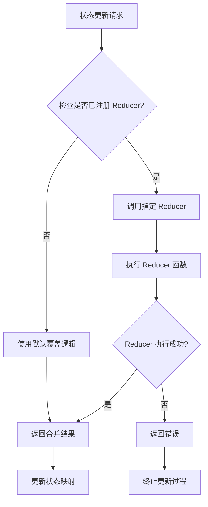
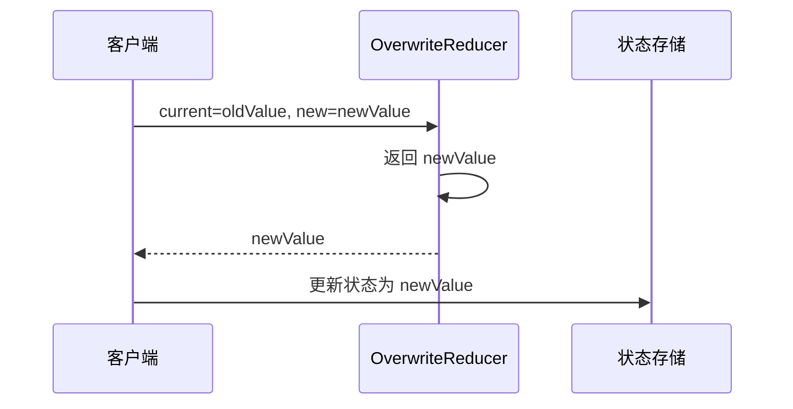
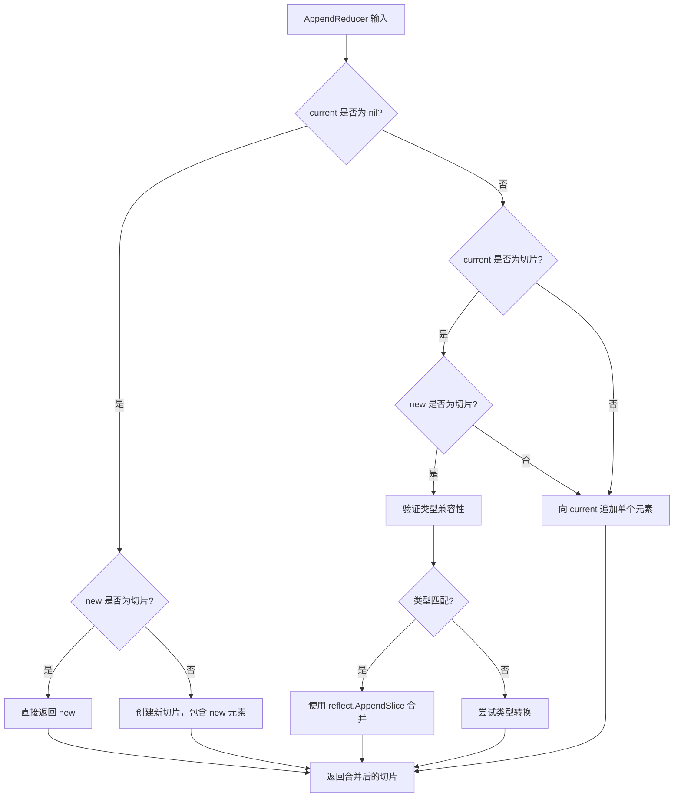
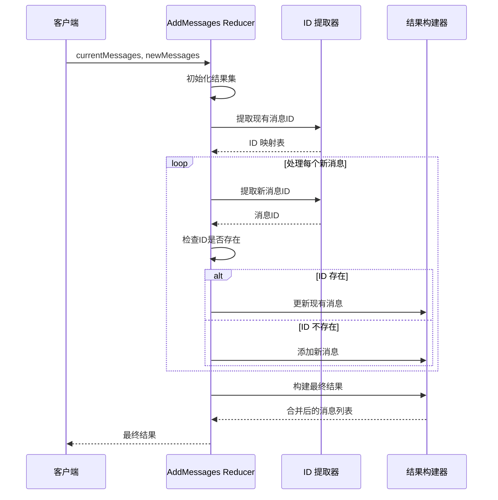
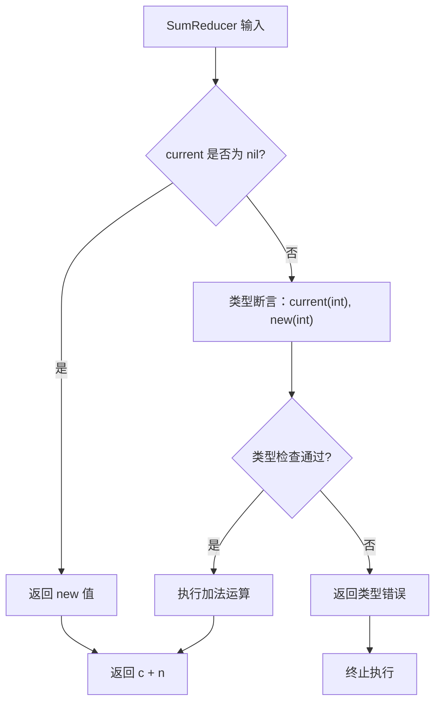
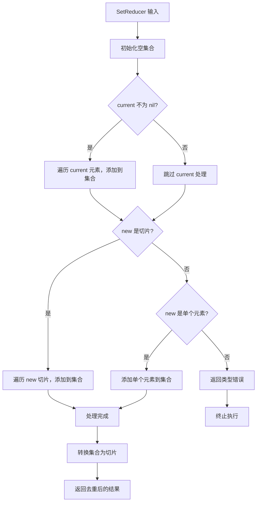
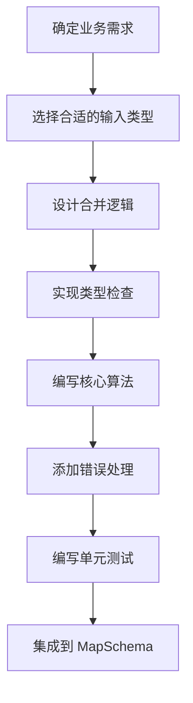
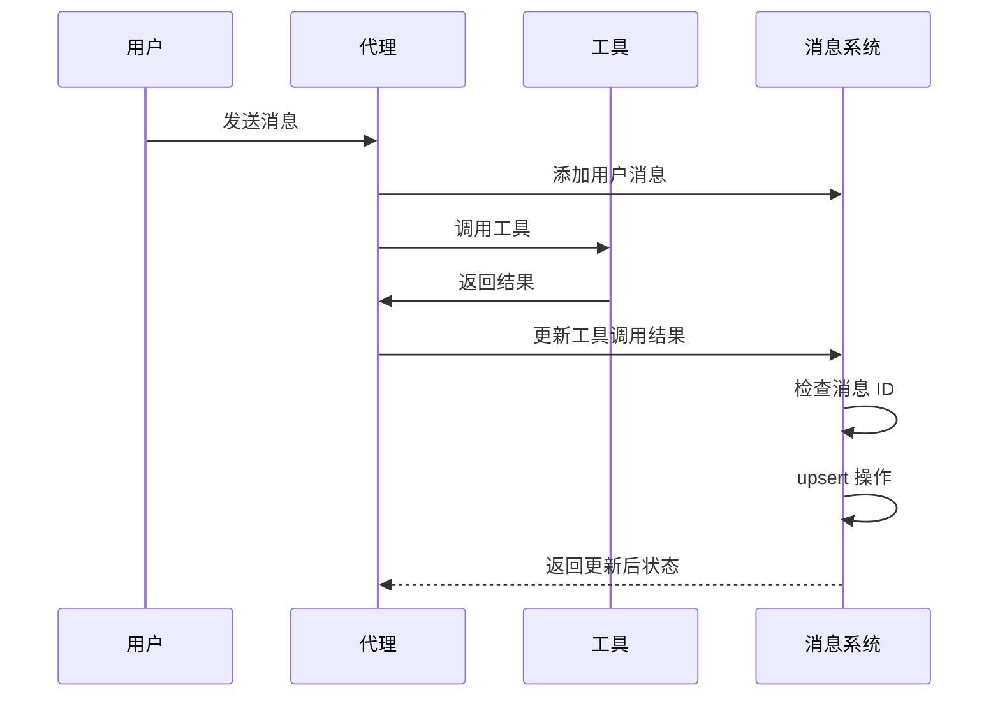
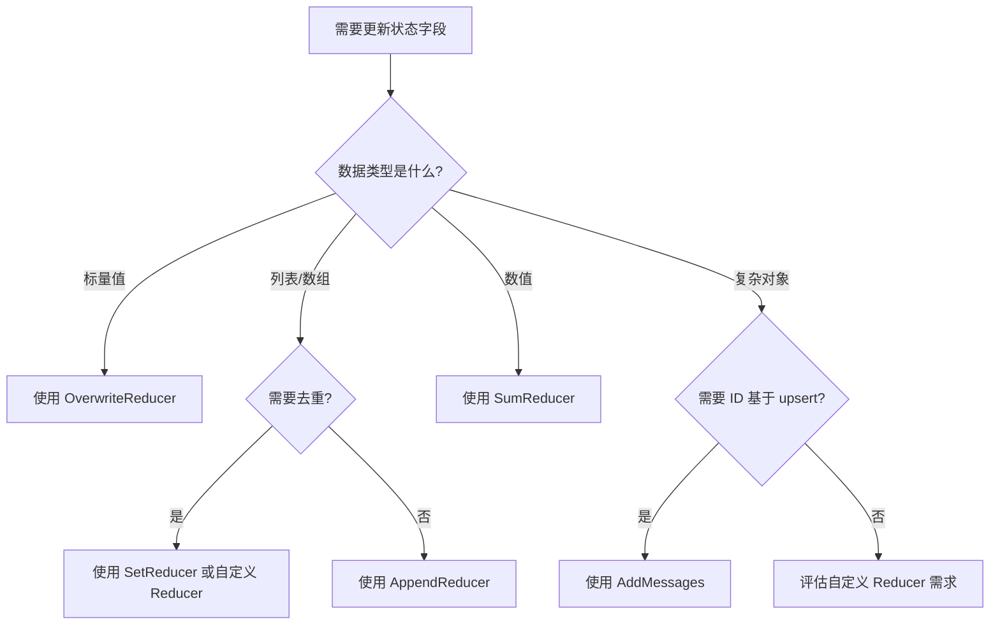
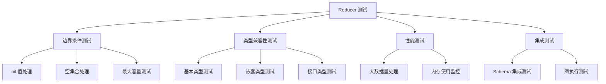

# 归约器

<cite>
**本文档中引用的文件**
- [graph/schema.go](file://graph/schema.go)
- [graph/add_messages.go](file://graph/add_messages.go)
- [examples/state_schema/main.go](file://examples/state_schema/main.go)
- [examples/custom_reducer/main.go](file://examples/custom_reducer/main.go)
- [examples/smart_messages/main.go](file://examples/smart_messages/main.go)
- [graph/messages_graph.go](file://graph/messages_graph.go)
- [graph/schema_test.go](file://graph/schema_test.go)
- [graph/add_messages_test.go](file://graph/add_messages_test.go)
- [graph/utils.go](file://graph/utils.go)
</cite>

## 目录
1. [简介](#简介)
2. [Reducer 概念](#reducer-概念)
3. [核心架构](#核心架构)
4. [内置 Reducer 分析](#内置-reducer-分析)
5. [自定义 Reducer 开发](#自定义-reducer-开发)
6. [高级应用场景](#高级应用场景)
7. [最佳实践](#最佳实践)
8. [总结](#总结)

## 简介

在 langgraphgo 中，Reducer 是一个核心概念，它定义了状态字段的更新语义。Reducer 作为函数式组件，接收当前值和新值作为输入参数，并返回合并后的结果。这种设计使得开发者能够精确控制不同状态字段的行为，从简单的覆盖操作到复杂的集合合并逻辑。

Reducer 的设计理念体现了函数式编程的思想：纯函数、不可变性以及可组合性。通过将状态更新逻辑抽象为独立的函数，langgraphgo 提供了灵活且可扩展的状态管理机制。

## Reducer 概念

### 基本定义

Reducer 在 langgraphgo 中被定义为一个函数类型，其签名如下：

```go
type Reducer func(current, new interface{}) (interface{}, error)
```

这个简洁的定义包含了三个关键要素：
- **输入参数**：当前值（current）和新值（new）
- **输出结果**：合并后的值和可能的错误
- **泛型处理**：使用 `interface{}` 类型支持任意数据类型

### 函数式组件特性

Reducer 具备以下函数式组件的重要特征：

1. **纯函数性质**：相同的输入总是产生相同的结果
2. **无副作用**：不修改输入参数，而是返回新的值
3. **可组合性**：多个 Reducer 可以组合使用
4. **类型安全**：通过错误处理提供类型检查

### 更新语义定义

Reducer 定义了状态字段的更新语义，即当接收到新的状态更新时，应该如何处理现有状态。这种语义可以是：

- **覆盖（Overwrite）**：直接用新值替换旧值
- **追加（Append）**：将新值添加到现有值的末尾
- **合并（Merge）**：根据特定规则合并两个值
- **计算（Compute）**：基于数学运算或其他逻辑计算新值

## 核心架构

### StateSchema 接口体系

langgraphgo 的 Reducer 架构建立在清晰的接口体系之上：

```mermaid
classDiagram
class StateSchema {
<<interface>>
+Init() interface{}
+Update(current, new interface{}) (interface{}, error)
}
class CleaningStateSchema {
<<interface>>
+Cleanup(state interface{}) interface{}
}
class MapSchema {
+Reducers map[string]Reducer
+EphemeralKeys map[string]bool
+RegisterReducer(key string, reducer Reducer)
+RegisterChannel(key string, reducer Reducer, isEphemeral bool)
+Init() interface{}
+Update(current, new interface{}) (interface{}, error)
+Cleanup(state interface{}) interface{}
}
StateSchema <|-- CleaningStateSchema
StateSchema <|.. MapSchema
CleaningStateSchema <|.. MapSchema
```

**图表来源**
- [graph/schema.go](file://graph/schema.go#L12-L27)
- [graph/schema.go](file://graph/schema.go#L29-L34)

### MapSchema 的工作机制

MapSchema 是 StateSchema 最常用的实现，它允许为特定键注册不同的 Reducer：



**图表来源**
- [graph/schema.go](file://graph/schema.go#L62-L99)

**章节来源**
- [graph/schema.go](file://graph/schema.go#L12-L100)

## 内置 Reducer 分析

### OverwriteReducer（覆盖）

OverwriteReducer 是最简单的 Reducer 实现，它直接用新值替换旧值：



**图表来源**
- [graph/schema.go](file://graph/schema.go#L141-L144)

**特点**：
- 默认行为：任何未注册 Reducer 的键都使用覆盖逻辑
- 简单高效：O(1) 时间复杂度
- 不保留历史：完全替换旧值

**适用场景**：
- 状态标志位
- 配置参数
- 临时计算结果

### AppendReducer（追加）

AppendReducer 是最复杂的内置 Reducer，它支持多种追加模式：



**图表来源**
- [graph/schema.go](file://graph/schema.go#L146-L185)

**反射处理机制**：

AppendReducer 利用 Go 的反射机制处理不同类型的数据：

1. **类型推断**：从新值推断目标切片类型
2. **动态创建**：使用 `reflect.MakeSlice` 创建适当类型的切片
3. **安全追加**：使用 `reflect.Append` 和 `reflect.AppendSlice` 确保类型安全

**适用场景**：
- 消息历史记录
- 操作日志
- 事件序列
- 数据流处理

### AddMessages（智能消息合并）

AddMessages 是专门为聊天应用设计的高级 Reducer：



**图表来源**
- [graph/add_messages.go](file://graph/add_messages.go#L18-L104)

**ID 提取策略**：

AddMessages 支持三种 ID 提取方式：

1. **MessageWithID 接口**：实现 `GetID()` 方法
2. **Map 结构**：包含 `"id"` 键的 map
3. **结构体字段**：名为 `ID` 的字符串字段

**upsert 行为**：

基于 ID 的 upsert（更新或插入）确保：
- 相同 ID 的消息会被替换
- 新消息会被追加到列表末尾
- 保持原始消息的顺序

**章节来源**
- [graph/schema.go](file://graph/schema.go#L141-L185)
- [graph/add_messages.go](file://graph/add_messages.go#L18-L135)

## 自定义 Reducer 开发

### SumReducer 示例

SumReducer 展示了如何创建基于计算逻辑的 Reducer：



**图表来源**
- [examples/state_schema/main.go](file://examples/state_schema/main.go#L11-L22)

### SetReducer 示例

SetReducer 展示了如何创建去重逻辑的 Reducer：



**图表来源**
- [examples/custom_reducer/main.go](file://examples/custom_reducer/main.go#L11-L42)

### 自定义 Reducer 开发指南

#### 1. 设计原则

- **单一职责**：每个 Reducer 只负责一种特定的更新逻辑
- **类型安全**：进行适当的类型检查和转换
- **错误处理**：提供有意义的错误信息
- **性能考虑**：避免不必要的内存分配

#### 2. 实现步骤



#### 3. 注册流程

```go
// 创建 Schema
schema := graph.NewMapSchema()

// 注册自定义 Reducer
schema.RegisterReducer("key_name", MyCustomReducer)

// 设置 Schema 到图中
g.SetSchema(schema)
```

**章节来源**
- [examples/state_schema/main.go](file://examples/state_schema/main.go#L11-L22)
- [examples/custom_reducer/main.go](file://examples/custom_reducer/main.go#L11-L42)

## 高级应用场景

### 智能消息系统

AddMessages Reducer 特别适用于现代 LLM 应用中的消息管理：



**图表来源**
- [examples/smart_messages/main.go](file://examples/smart_messages/main.go#L16-L91)

### 多态 Reducer 策略

在复杂应用中，可以结合多种 Reducer 实现多态更新策略：

| 字段名 | Reducer 类型 | 更新语义 | 适用场景 |
|--------|-------------|----------|----------|
| `messages` | AddMessages | ID 基于 upsert | 聊天历史 |
| `logs` | AppendReducer | 顺序追加 | 操作日志 |
| `counters` | SumReducer | 数值累加 | 统计计数 |
| `flags` | OverwriteReducer | 直接覆盖 | 状态标志 |

### 性能优化策略

1. **类型缓存**：对于频繁使用的切片类型，可以缓存反射类型信息
2. **批量处理**：对大量数据的追加操作进行批量处理
3. **惰性求值**：对于复杂的合并逻辑，采用惰性求值策略

**章节来源**
- [examples/smart_messages/main.go](file://examples/smart_messages/main.go#L16-L91)
- [graph/add_messages.go](file://graph/add_messages.go#L18-L135)

## 最佳实践

### Reducer 选择指南

#### 基于数据类型的决策树



### 错误处理最佳实践

1. **明确的错误类型**：区分类型错误、格式错误和业务逻辑错误
2. **详细的错误信息**：包含上下文信息帮助调试
3. **优雅降级**：在错误情况下提供合理的默认行为

### 测试策略



### 性能优化建议

1. **避免过度设计**：简单的场景使用内置 Reducer
2. **合理使用反射**：在必要时使用反射，但注意性能开销
3. **缓存计算结果**：对于重复的计算逻辑进行缓存
4. **批量操作**：减少 Reducer 调用次数

## 总结

langgraphgo 的 Reducer 系统提供了一个强大而灵活的状态管理框架。通过将状态更新逻辑抽象为独立的函数，开发者可以：

1. **精确控制更新语义**：从简单的覆盖到复杂的集合操作
2. **构建可组合的系统**：不同字段使用不同的更新策略
3. **实现类型安全的操作**：通过错误处理确保数据完整性
4. **扩展系统功能**：轻松添加自定义的更新逻辑

Reducer 的设计体现了函数式编程的核心思想：纯函数、不可变性和可组合性。这种设计不仅提高了代码的可维护性，还为复杂的分布式系统提供了可靠的状态管理基础。

随着应用复杂度的增加，Reducer 的优势会更加明显。通过合理选择和组合不同的 Reducer，开发者可以构建出既高效又易于理解的状态管理系统。