# MapSchema 实现深度分析

<cite>
**本文档引用的文件**
- [graph/schema.go](file://graph/schema.go)
- [graph/schema_test.go](file://graph/schema_test.go)
- [graph/channel_test.go](file://graph/channel_test.go)
- [examples/state_schema/main.go](file://examples/state_schema/main.go)
- [examples/ephemeral_channels/main.go](file://examples/ephemeral_channels/main.go)
</cite>

## 目录
1. [简介](#简介)
2. [核心架构概览](#核心架构概览)
3. [MapSchema 结构体详解](#mapschema-结构体详解)
4. [初始化与配置](#初始化与配置)
5. [状态更新机制](#状态更新机制)
6. [归约器系统](#归约器系统)
7. [临时通道功能](#临时通道功能)
8. [实际应用示例](#实际应用示例)
9. [测试验证](#测试验证)
10. [性能考虑](#性能考虑)
11. [总结](#总结)

## 简介

`MapSchema` 是 LangGraphGo 中用于管理状态图状态的核心组件，它提供了一个灵活的状态更新框架，支持为不同状态键配置特定的更新逻辑。通过归约器（Reducers）系统，`MapSchema` 能够实现复杂的状态合并策略，同时支持临时通道（Ephemeral Channels）功能，确保某些数据只在特定的执行步骤中存在。

## 核心架构概览

`MapSchema` 的设计遵循了接口驱动的架构模式，主要包含以下核心组件：

```mermaid
classDiagram
class StateSchema {
<<interface>>
+Init() interface{}
+Update(current, new) (interface{}, error)
}
class CleaningStateSchema {
<<interface>>
+Cleanup(state) interface{}
}
class MapSchema {
+Reducers map[string]Reducer
+EphemeralKeys map[string]bool
+NewMapSchema() *MapSchema
+RegisterReducer(key, reducer)
+RegisterChannel(key, reducer, isEphemeral)
+Init() interface{}
+Update(current, new) (interface{}, error)
+Cleanup(state) interface{}
}
class Reducer {
<<function>>
+func(current, new interface{}) (interface{}, error)
}
StateSchema <|-- MapSchema
CleaningStateSchema <|-- MapSchema
MapSchema --> Reducer : "uses"
```

**图表来源**
- [graph/schema.go](file://graph/schema.go#L12-L27)
- [graph/schema.go](file://graph/schema.go#L29-L34)

**章节来源**
- [graph/schema.go](file://graph/schema.go#L1-L27)

## MapSchema 结构体详解

### 数据结构设计

`MapSchema` 采用简洁而高效的数据结构设计：

```mermaid
classDiagram
class MapSchema {
+map[string]Reducer Reducers
+map[string]bool EphemeralKeys
+RegisterReducer(key string, reducer Reducer)
+RegisterChannel(key string, reducer Reducer, isEphemeral bool)
+Update(current, new interface{}) (interface{}, error)
+Cleanup(state interface{}) interface{}
}
note for MapSchema "Reducers : 为每个状态键配置特定的更新逻辑\nEphemeralKeys : 标记需要临时处理的键"
```

**图表来源**
- [graph/schema.go](file://graph/schema.go#L31-L33)

### 字段说明

| 字段名 | 类型 | 描述 | 默认值 |
|--------|------|------|--------|
| `Reducers` | `map[string]Reducer` | 存储各个状态键对应的归约器函数 | 空映射 |
| `EphemeralKeys` | `map[string]bool` | 标记临时通道的键集合 | 空映射 |

**章节来源**
- [graph/schema.go](file://graph/schema.go#L31-L33)

## 初始化与配置

### NewMapSchema() 函数

`NewMapSchema()` 是 `MapSchema` 的构造函数，负责创建一个全新的实例：

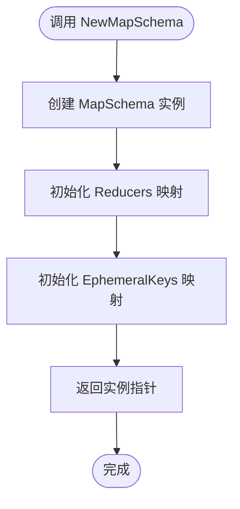

**图表来源**
- [graph/schema.go](file://graph/schema.go#L36-L41)

### 初始化过程

初始化过程中，两个关键映射都会被创建为空映射，这确保了：

1. **内存效率**：只有在需要时才分配内存
2. **类型安全**：明确的映射类型声明
3. **可扩展性**：支持动态添加新的状态键

**章节来源**
- [graph/schema.go](file://graph/schema.go#L36-L41)

## 状态更新机制

### Update() 方法执行流程

`Update()` 方法是 `MapSchema` 的核心功能，实现了智能的状态合并：

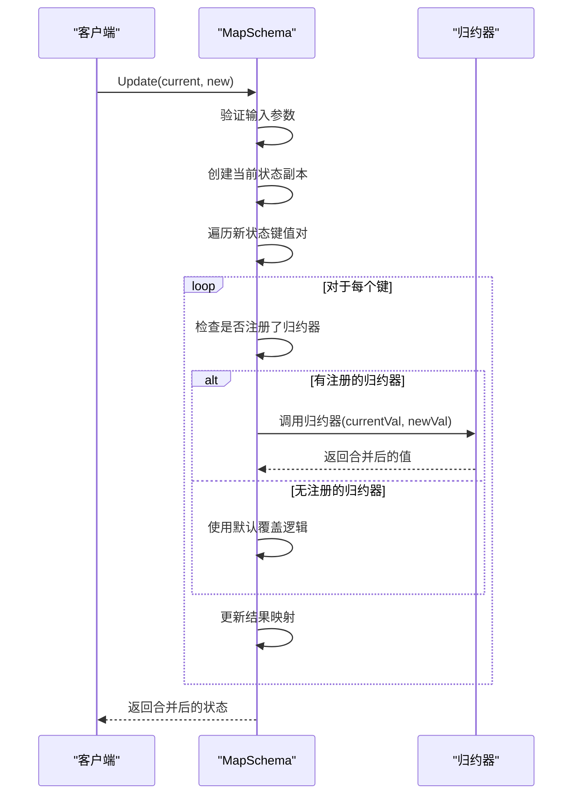

**图表来源**
- [graph/schema.go](file://graph/schema.go#L62-L99)

### 更新算法详解

更新过程遵循以下步骤：

1. **输入验证**：确保当前状态和新状态都是有效的映射
2. **状态复制**：创建当前状态的深拷贝以避免直接修改
3. **增量处理**：遍历新状态中的每个键值对
4. **归约器选择**：根据键查找对应的归约器
5. **值合并**：使用归约器或默认覆盖逻辑合并值
6. **错误处理**：捕获并报告归约器执行中的错误

### 默认覆盖行为

对于未注册归约器的键，`MapSchema` 采用简单的覆盖策略：

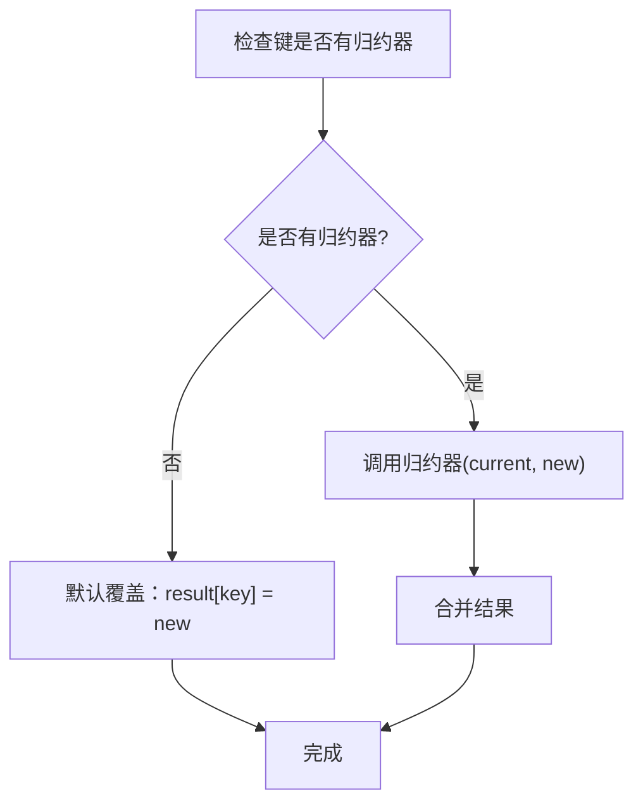

**图表来源**
- [graph/schema.go](file://graph/schema.go#L85-L95)

**章节来源**
- [graph/schema.go](file://graph/schema.go#L62-L99)

## 归约器系统

### Reducer 接口定义

归约器是一个核心概念，它定义了如何将新值合并到现有状态中：

```mermaid
classDiagram
class Reducer {
<<function>>
+func(current, new interface{}) (interface{}, error)
}
note for Reducer "current : 当前状态值\nnew : 新状态值\n返回 : 合并后的值\n错误 : 执行失败时返回"
```

**图表来源**
- [graph/schema.go](file://graph/schema.go#L8-L10)

### 内置归约器

#### OverwriteReducer

最简单的归约器，直接用新值替换旧值：

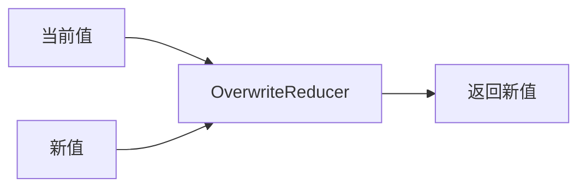

**图表来源**
- [graph/schema.go](file://graph/schema.go#L141-L144)

#### AppendReducer

支持向现有切片追加元素的归约器：

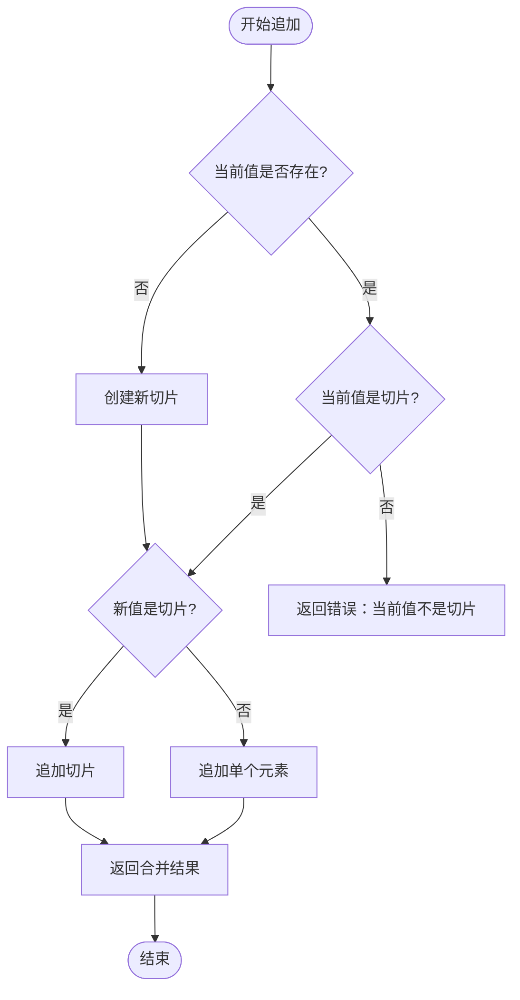

**图表来源**
- [graph/schema.go](file://graph/schema.go#L146-L185)

### 自定义归约器

用户可以创建自定义归约器来实现特定的合并逻辑：

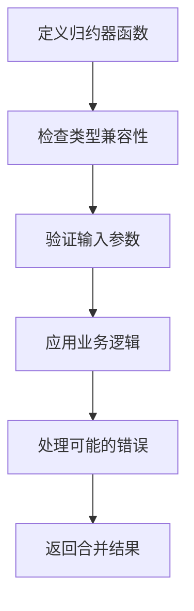

**章节来源**
- [graph/schema.go](file://graph/schema.go#L8-L185)

## 临时通道功能

### EphemeralKeys 机制

临时通道允许某些状态值只在特定的执行步骤中存在：

```mermaid
classDiagram
class EphemeralChannels {
+EphemeralKeys map[string]bool
+Cleanup(state) interface{}
+RegisterChannel(key, reducer, isEphemeral)
}
note for EphemeralChannels "isEphemeral=true 时：<br/>1. 添加到 EphemeralKeys<br/>2. 在 Cleanup 时移除<br/>isEphemeral=false 时：<br/>1. 不添加到 EphemeralKeys<br/>2. 保持持久状态"
```

**图表来源**
- [graph/schema.go](file://graph/schema.go#L50-L54)

### Cleanup() 方法实现

`Cleanup()` 方法负责在步骤结束后清理临时数据：

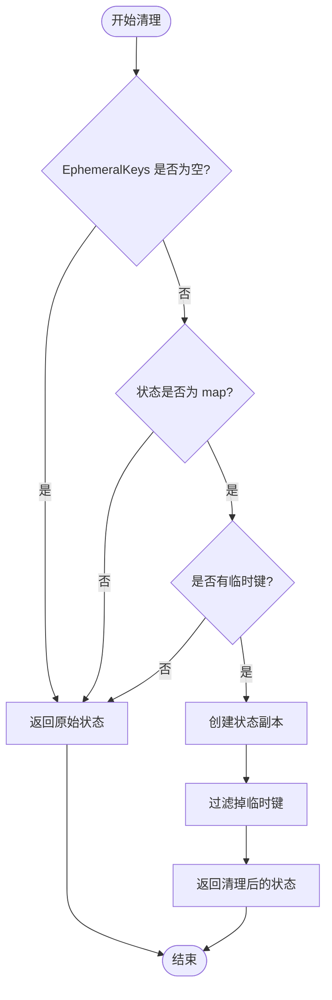

**图表来源**
- [graph/schema.go](file://graph/schema.go#L102-L136)

### 临时通道生命周期

临时通道遵循严格的生命周期管理：

1. **注册阶段**：通过 `RegisterChannel` 标记键为临时
2. **执行阶段**：在当前步骤中可用
3. **清理阶段**：步骤结束时自动移除
4. **后续阶段**：不再存在于状态中

**章节来源**
- [graph/schema.go](file://graph/schema.go#L102-L136)

## 实际应用示例

### 基础状态管理示例

参考 `examples/state_schema/main.go` 中的实现：

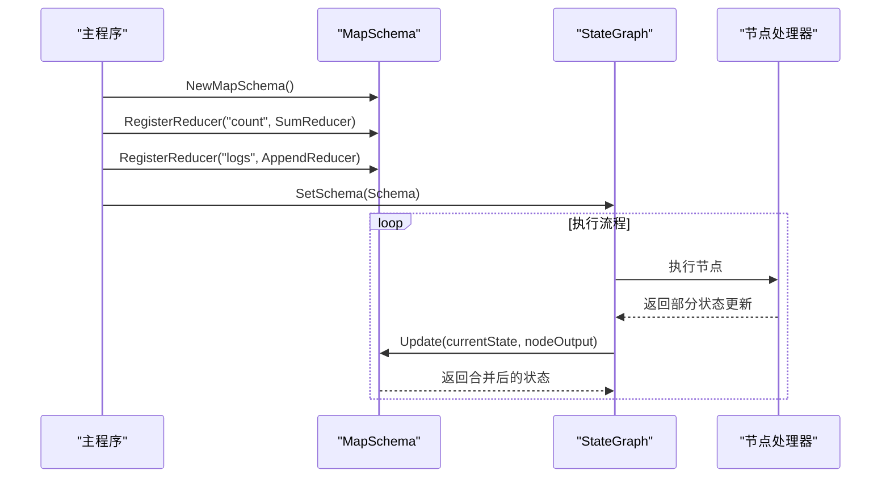

**图表来源**
- [examples/state_schema/main.go](file://examples/state_schema/main.go#L30-L40)

### 临时通道示例

参考 `examples/ephemeral_channels/main.go` 中的实现：

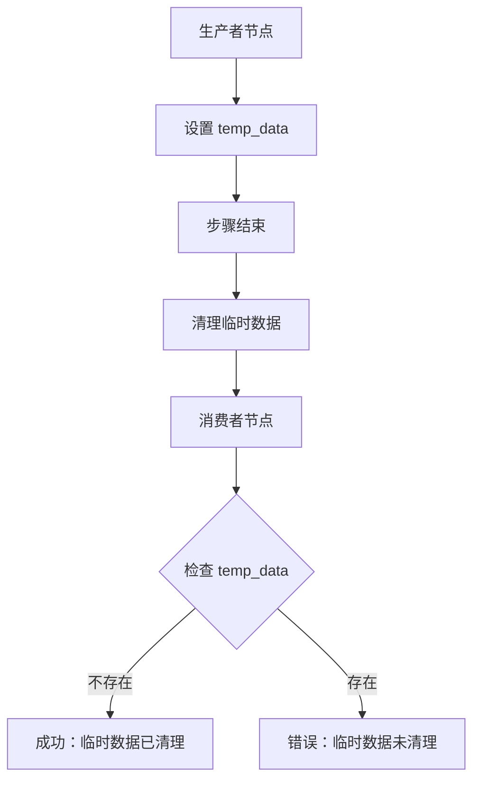

**图表来源**
- [examples/ephemeral_channels/main.go](file://examples/ephemeral_channels/main.go#L17-L21)

**章节来源**
- [examples/state_schema/main.go](file://examples/state_schema/main.go#L1-L105)
- [examples/ephemeral_channels/main.go](file://examples/ephemeral_channels/main.go#L1-L74)

## 测试验证

### Update 方法测试

`TestMapSchema_Update` 验证了基本的状态合并功能：

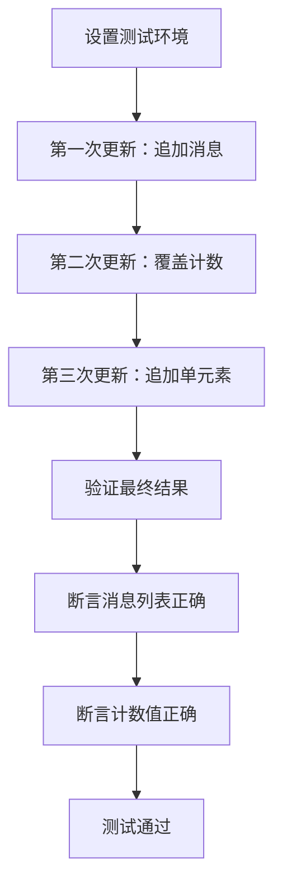

**图表来源**
- [graph/schema_test.go](file://graph/schema_test.go#L10-L54)

### 临时通道测试

`TestEphemeralChannel` 验证了临时通道的清理功能：

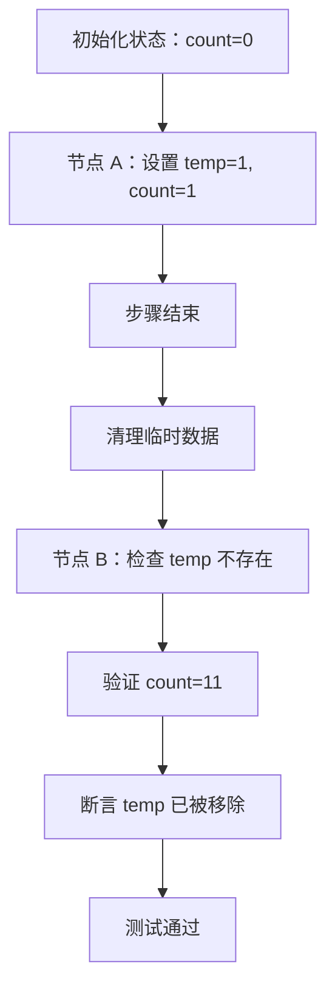

**图表来源**
- [graph/channel_test.go](file://graph/channel_test.go#L10-L74)

**章节来源**
- [graph/schema_test.go](file://graph/schema_test.go#L10-L92)
- [graph/channel_test.go](file://graph/channel_test.go#L10-L75)

## 性能考虑

### 内存优化策略

1. **延迟初始化**：归约器映射按需创建
2. **状态复制**：避免直接修改原始状态
3. **键检查优化**：使用 `hasEphemeral` 标志减少不必要的遍历

### 时间复杂度分析

| 操作 | 时间复杂度 | 说明 |
|------|------------|------|
| 初始化 | O(1) | 创建空映射 |
| 注册归约器 | O(1) | 直接映射赋值 |
| 状态更新 | O(n) | n 为新状态键数量 |
| 清理操作 | O(n+m) | n 为状态键数量，m 为临时键数量 |

### 并发安全性

`MapSchema` 本身不是并发安全的，建议在单线程环境中使用或配合适当的同步机制。

## 总结

`MapSchema` 是 LangGraphGo 中一个精心设计的状态管理组件，它通过以下特性提供了强大的状态控制能力：

1. **灵活的归约器系统**：支持为不同状态键配置特定的更新逻辑
2. **智能状态合并**：通过归约器实现复杂的值合并策略
3. **临时通道支持**：自动管理临时数据的生命周期
4. **类型安全**：强类型的接口设计确保运行时安全
5. **高性能**：优化的算法和数据结构保证良好的性能表现

通过合理使用 `MapSchema`，开发者可以构建出既灵活又可靠的状态管理系统，满足各种复杂应用场景的需求。其模块化的设计也为未来的功能扩展提供了良好的基础。