# Reducers 管理机制

<cite>
**本文档中引用的文件**
- [schema.go](file://graph/schema.go)
- [state_graph.go](file://graph/state_graph.go)
- [main.go](file://examples/state_schema/main.go)
- [main.go](file://examples/custom_reducer/main.go)
- [main.go](file://examples/ephemeral_channels/main.go)
- [schema_test.go](file://graph/schema_test.go)
</cite>

## 目录
1. [简介](#简介)
2. [核心架构概述](#核心架构概述)
3. [Reducers 映射表管理](#reducers-映射表管理)
4. [归约器函数签名与作用](#归约器函数签名与作用)
5. [状态更新流程分析](#状态更新流程分析)
6. [自定义归约器实现](#自定义归约器实现)
7. [默认覆盖行为](#默认覆盖行为)
8. [Ephemeral Channels 机制](#ephemeral-channels-机制)
9. [实际应用示例](#实际应用示例)
10. [性能考虑与最佳实践](#性能考虑与最佳实践)
11. [总结](#总结)

## 简介

`MapSchema` 是 LangGraphGo 中用于管理状态结构和更新逻辑的核心组件。它通过 `Reducers` 映射表提供了一种灵活的状态合并机制，允许开发者为不同的状态键定义特定的归约逻辑。这种设计使得状态更新既可定制又保持了良好的扩展性。

## 核心架构概述

```mermaid
classDiagram
class StateSchema {
<<interface>>
+Init() interface{}
+Update(current, new) (interface{}, error)
}
class CleaningStateSchema {
<<interface>>
+Cleanup(state) interface{}
}
class MapSchema {
+Reducers map[string]Reducer
+EphemeralKeys map[string]bool
+RegisterReducer(key, reducer)
+RegisterChannel(key, reducer, isEphemeral)
+Init() interface{}
+Update(current, new) (interface{}, error)
+Cleanup(state) interface{}
}
class Reducer {
<<function>>
+func(current, new interface{}) (interface{}, error)
}
StateSchema <|-- MapSchema
CleaningStateSchema <|-- MapSchema
MapSchema --> Reducer : "uses"
```

**图表来源**
- [schema.go](file://graph/schema.go#L12-L27)
- [schema.go](file://graph/schema.go#L30-L33)

**章节来源**
- [schema.go](file://graph/schema.go#L12-L27)
- [schema.go](file://graph/schema.go#L30-L33)

## Reducers 映射表管理

### MapSchema 结构体设计

`MapSchema` 采用双映射表设计来管理状态更新逻辑：

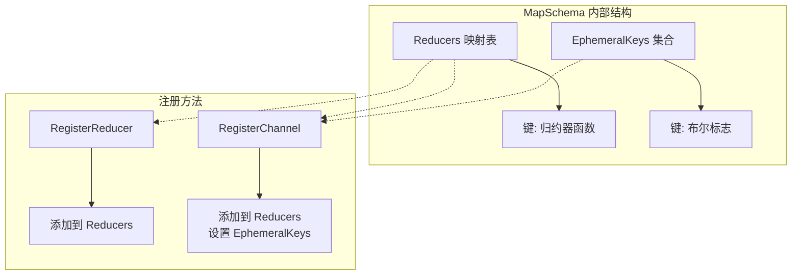

**图表来源**
- [schema.go](file://graph/schema.go#L30-L33)
- [schema.go](file://graph/schema.go#L44-L54)

### RegisterReducer 方法详解

`RegisterReducer` 方法负责为特定状态键注册归约器：

| 参数 | 类型 | 描述 |
|------|------|------|
| key | string | 要注册的键名 |
| reducer | Reducer | 归约器函数 |

该方法直接将归约器函数存储到 `Reducers` 映射表中，键名为指定的状态键。

### RegisterChannel 方法详解

`RegisterChannel` 方法提供了更高级的功能，支持同时注册归约器和设置临时通道标志：

| 参数 | 类型 | 描述 |
|------|------|------|
| key | string | 要注册的键名 |
| reducer | Reducer | 归约器函数 |
| isEphemeral | bool | 是否为临时通道 |

该方法的工作流程：
1. 将归约器函数添加到 `Reducers` 映射表
2. 如果是临时通道，则将键名添加到 `EphemeralKeys` 集合

**章节来源**
- [schema.go](file://graph/schema.go#L44-L54)

## 归约器函数签名与作用

### Reducer 函数签名

归约器函数具有统一的签名：`func(current, new interface{}) (interface{}, error)`

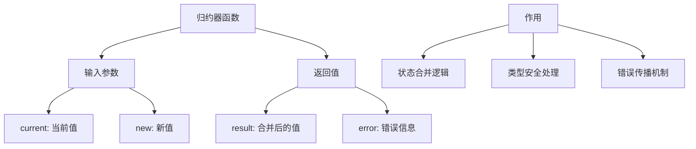

**图表来源**
- [schema.go](file://graph/schema.go#L8-L10)

### 归约器在状态合并中的作用

归约器的核心职责是在状态更新过程中决定如何合并新旧值：

1. **类型检查与转换**：确保输入值符合预期类型
2. **业务逻辑执行**：根据具体需求实现合并逻辑
3. **错误处理**：提供详细的错误信息以便调试
4. **结果验证**：确保返回值符合预期格式

**章节来源**
- [schema.go](file://graph/schema.go#L8-L10)

## 状态更新流程分析

### Update 方法调用流程

`Update` 方法是状态合并的核心入口，其执行流程如下：

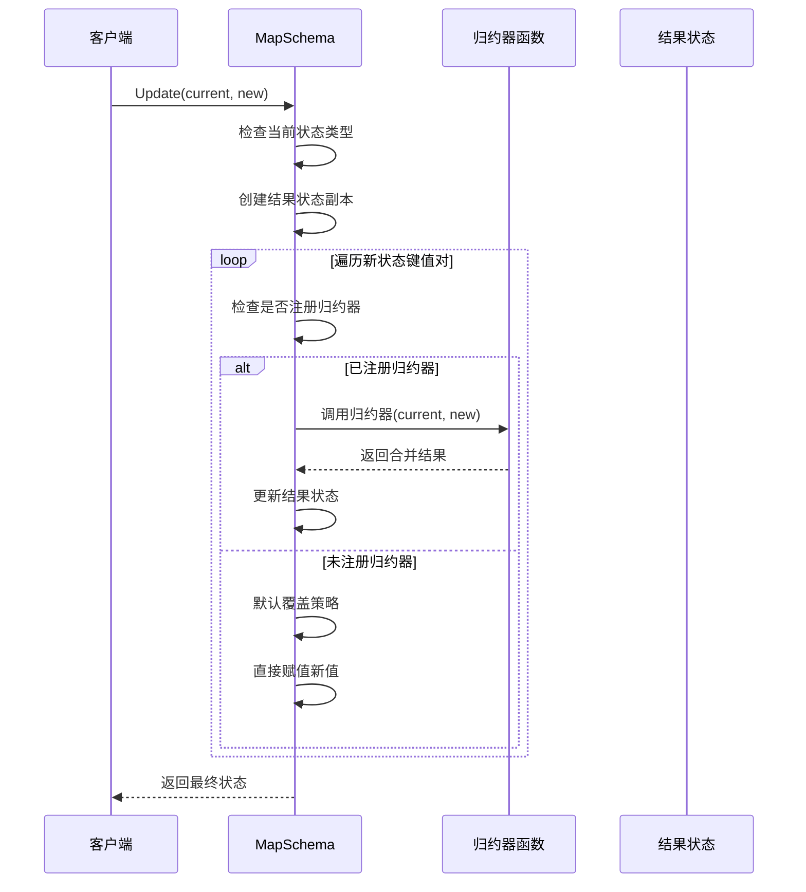

**图表来源**
- [schema.go](file://graph/schema.go#L62-L99)

### 状态合并的具体步骤

1. **初始化检查**：验证输入状态的类型和完整性
2. **状态复制**：创建当前状态的副本以避免直接修改
3. **键值遍历**：逐个处理新状态中的键值对
4. **归约器查找**：检查是否存在针对该键的归约器
5. **归约器调用**：如果存在归约器，则调用执行合并逻辑
6. **错误处理**：捕获并报告归约过程中的任何错误
7. **默认覆盖**：如果没有归约器，则使用简单覆盖策略

**章节来源**
- [schema.go](file://graph/schema.go#L62-L99)

## 自定义归约器实现

### SumReducer 实现示例

基于 `examples/state_schema/main.go` 中的 `SumReducer`，我们可以看到一个典型的整数累加归约器实现：

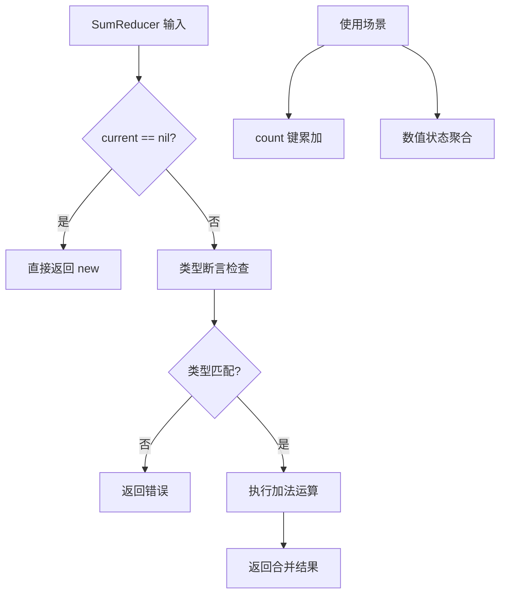

**图表来源**
- [main.go](file://examples/state_schema/main.go#L11-L22)

### 自定义归约器的设计原则

1. **类型安全**：使用类型断言确保输入值的正确性
2. **错误处理**：提供清晰的错误信息
3. **幂等性**：相同的输入应产生相同的结果
4. **性能优化**：避免不必要的计算和内存分配

### 其他常见归约器模式

| 归约器类型 | 用途 | 实现特点 |
|------------|------|----------|
| OverwriteReducer | 默认覆盖 | 直接返回新值 |
| AppendReducer | 列表追加 | 支持单元素和切片追加 |
| SetReducer | 集合去重 | 使用 map 实现去重 |
| CustomReducer | 特定业务逻辑 | 根据业务需求定制 |

**章节来源**
- [main.go](file://examples/state_schema/main.go#L11-L22)
- [main.go](file://examples/custom_reducer/main.go#L11-L42)

## 默认覆盖行为

### 未注册键的处理机制

当状态更新遇到未注册归约器的键时，系统采用默认的覆盖策略：

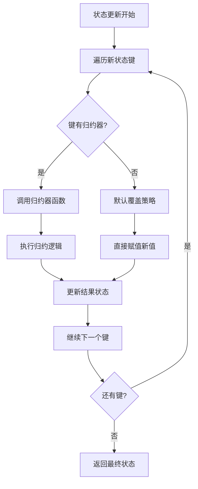

**图表来源**
- [schema.go](file://graph/schema.go#L84-L96)

### OverwriteReducer 的实现

`OverwriteReducer` 是默认的归约器实现，其行为极其简单：

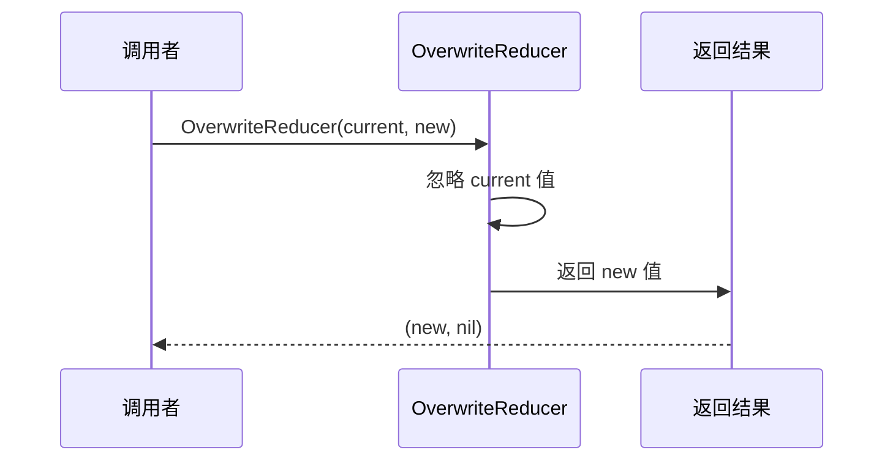

**图表来源**
- [schema.go](file://graph/schema.go#L141-L144)

### 与显式注册 OverwriteReducer 的关系

虽然系统提供了默认的覆盖行为，但显式注册 `OverwriteReducer` 有以下优势：

1. **明确性**：代码意图更加清晰
2. **一致性**：与其他键的处理方式保持一致
3. **可维护性**：便于后续修改和扩展

**章节来源**
- [schema.go](file://graph/schema.go#L84-L96)
- [schema.go](file://graph/schema.go#L141-L144)

## Ephemeral Channels 机制

### 临时通道的概念

Ephemeral Channels 是一种特殊的状态键，其值只在当前执行步骤内有效，在步骤完成后会被自动清理。

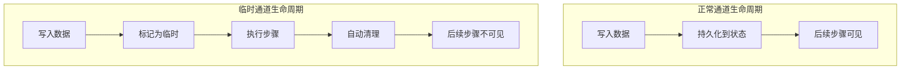

**图表来源**
- [examples/ephemeral_channels/main.go](file://examples/ephemeral_channels/main.go#L11-L13)

### Ephemeral 清理机制

`MapSchema` 的 `Cleanup` 方法实现了自动清理功能：

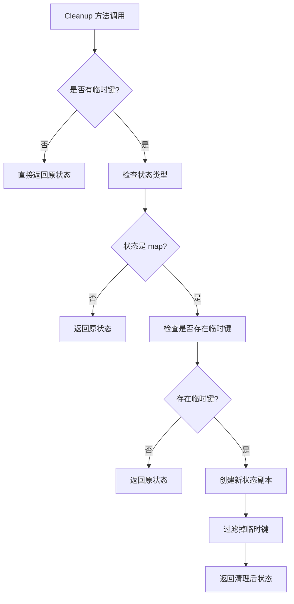

**图表来源**
- [schema.go](file://graph/schema.go#L102-L137)

### RegisterChannel 中的 Ephemeral 处理

`RegisterChannel` 方法在注册临时通道时的处理逻辑：

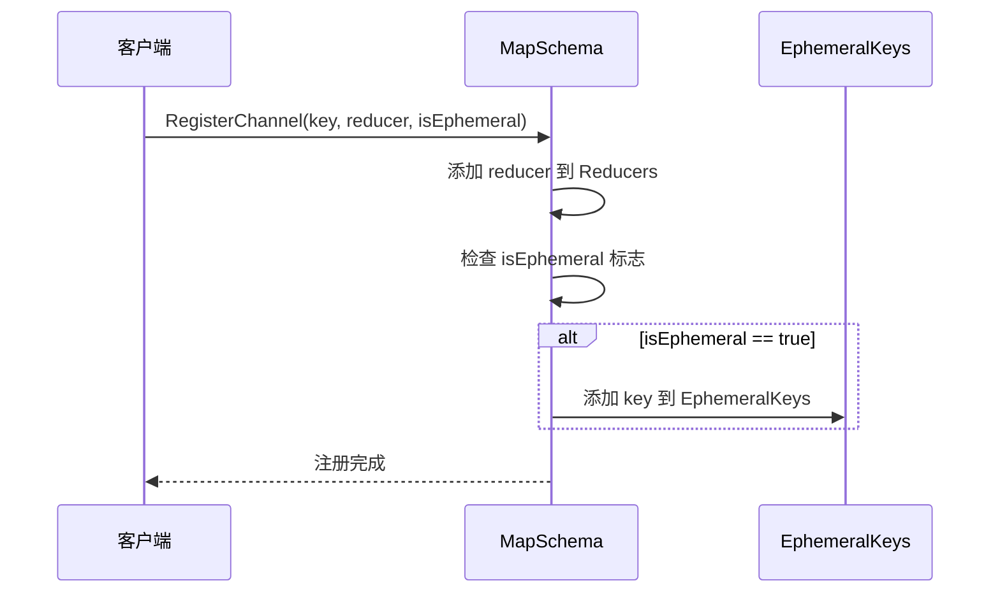

**图表来源**
- [schema.go](file://graph/schema.go#L49-L54)

**章节来源**
- [schema.go](file://graph/schema.go#L102-L137)
- [examples/ephemeral_channels/main.go](file://examples/ephemeral_channels/main.go#L11-L13)

## 实际应用示例

### 基础状态 Schema 示例

基于 `examples/state_schema/main.go` 的完整应用场景：

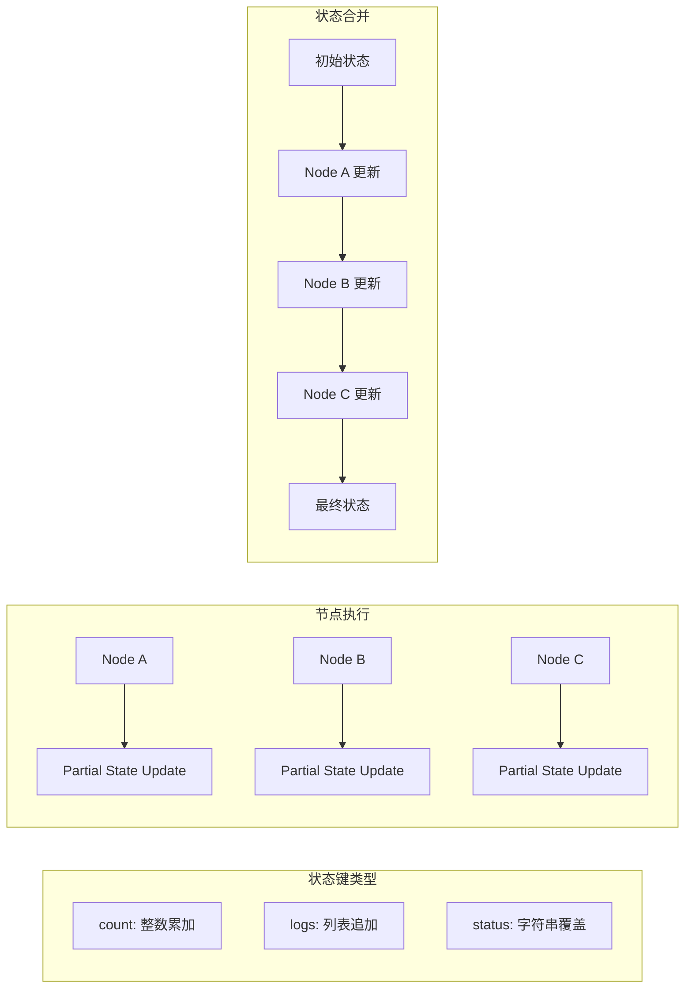

**图表来源**
- [main.go](file://examples/state_schema/main.go#L24-L70)

### 自定义集合归约器示例

`examples/custom_reducer/main.go` 展示了集合去重的实现：

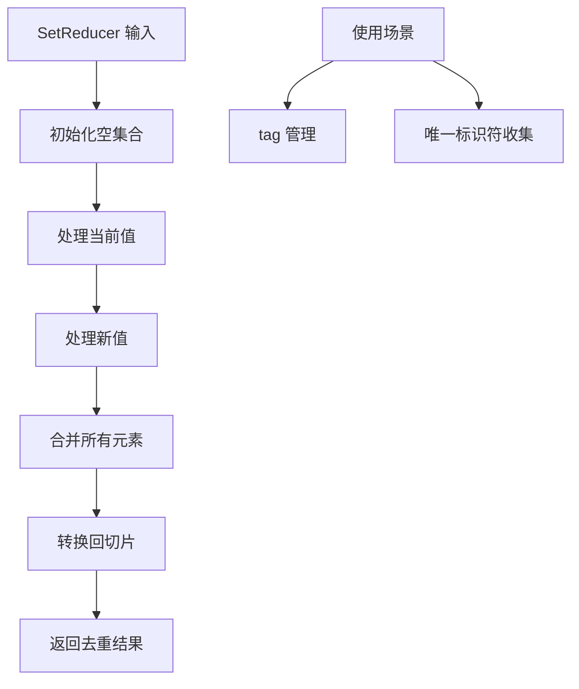

**图表来源**
- [main.go](file://examples/custom_reducer/main.go#L11-L42)

### 临时数据管理示例

`examples/ephemeral_channels/main.go` 展示了临时通道的应用：

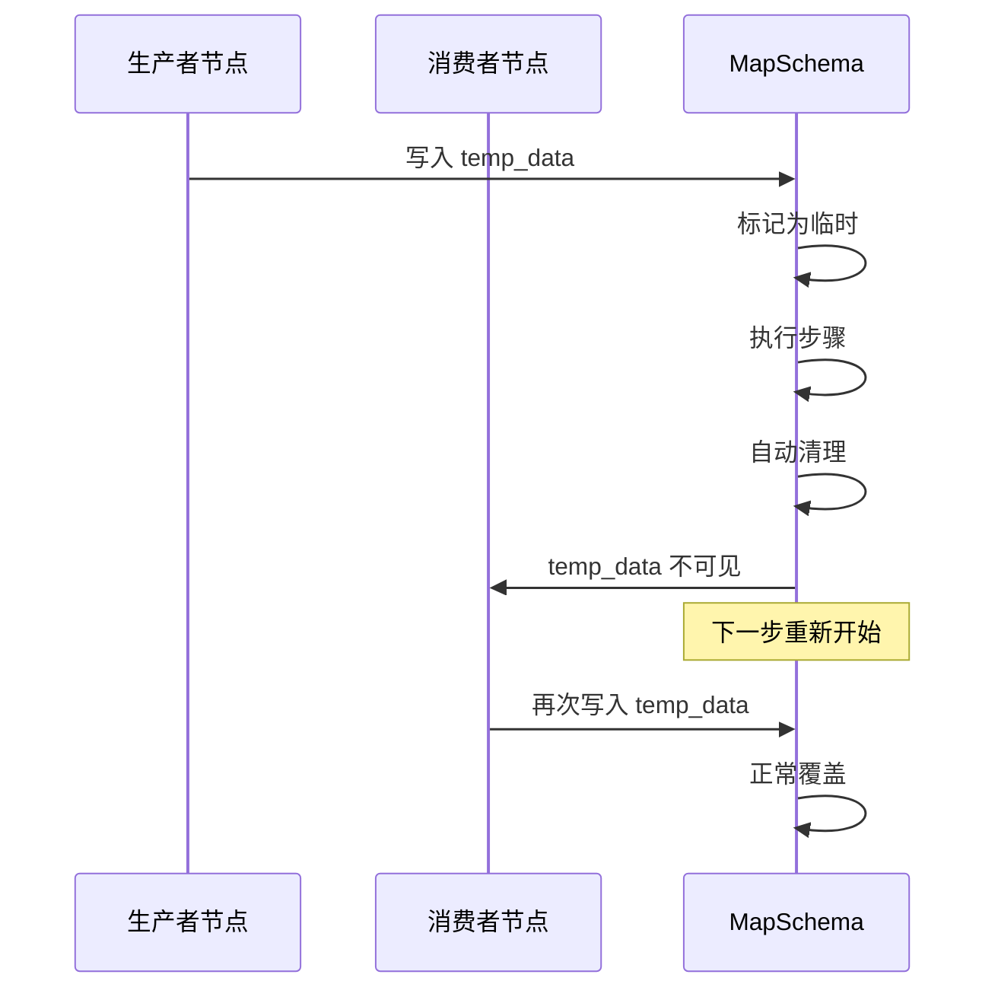

**图表来源**
- [main.go](file://examples/ephemeral_channels/main.go#L24-L49)

**章节来源**
- [main.go](file://examples/state_schema/main.go#L24-L70)
- [main.go](file://examples/custom_reducer/main.go#L11-L42)
- [main.go](file://examples/ephemeral_channels/main.go#L24-L49)

## 性能考虑与最佳实践

### 性能优化策略

1. **归约器选择**：
   - 对于频繁更新的键，选择高效的归约器实现
   - 避免在归约器中进行复杂的计算或 I/O 操作

2. **内存管理**：
   - `Update` 方法创建状态副本以避免副作用
   - `Cleanup` 方法优化了临时键的检查逻辑

3. **类型检查优化**：
   - 在归约器内部进行一次性类型断言
   - 避免重复的类型检查操作

### 最佳实践建议

| 实践领域 | 建议 | 原因 |
|----------|------|------|
| 归约器设计 | 保持简单和高效 | 减少状态更新的开销 |
| 错误处理 | 提供详细的错误信息 | 便于调试和问题定位 |
| 类型安全 | 使用类型断言而非反射 | 提高性能和可读性 |
| 测试覆盖 | 编写全面的单元测试 | 确保归约器的正确性 |

### 常见陷阱与解决方案

1. **类型不匹配**：确保归约器能够处理预期的所有类型
2. **并发安全**：避免在归约器中使用共享状态
3. **循环依赖**：注意归约器之间的相互影响

## 总结

`MapSchema` 的 `Reducers` 映射表管理机制为 LangGraphGo 提供了强大而灵活的状态更新能力。通过 `RegisterReducer` 和 `RegisterChannel` 方法，开发者可以为不同的状态键定义特定的归约逻辑，包括：

1. **灵活的归约器注册**：支持多种归约策略的组合使用
2. **类型安全的归约器函数**：统一的函数签名确保了类型安全
3. **默认覆盖机制**：为未注册键提供合理的默认行为
4. **临时通道支持**：自动清理机制简化了临时数据管理
5. **性能优化**：通过智能的清理算法减少不必要的计算

这种设计不仅满足了复杂状态管理的需求，还保持了代码的简洁性和可维护性。通过合理使用这些机制，开发者可以构建出既强大又高效的流式处理应用程序。