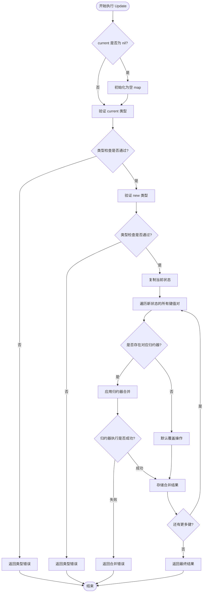
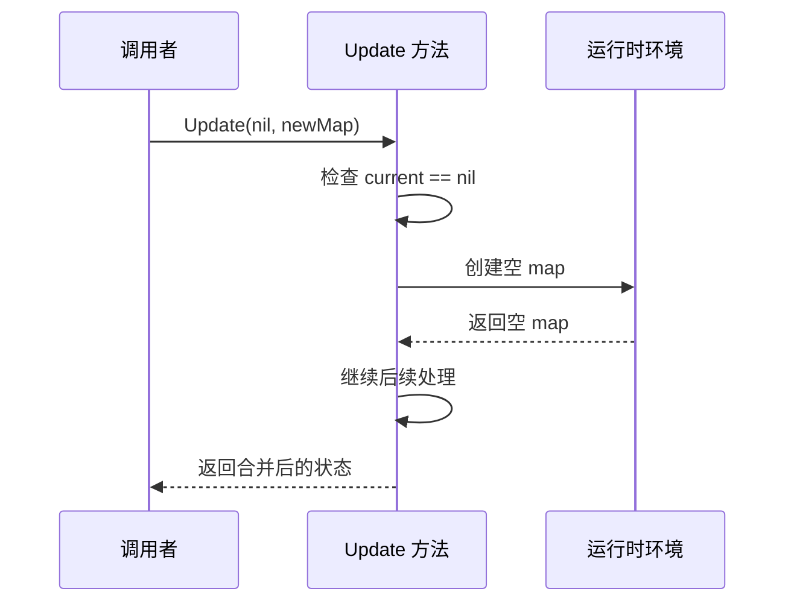
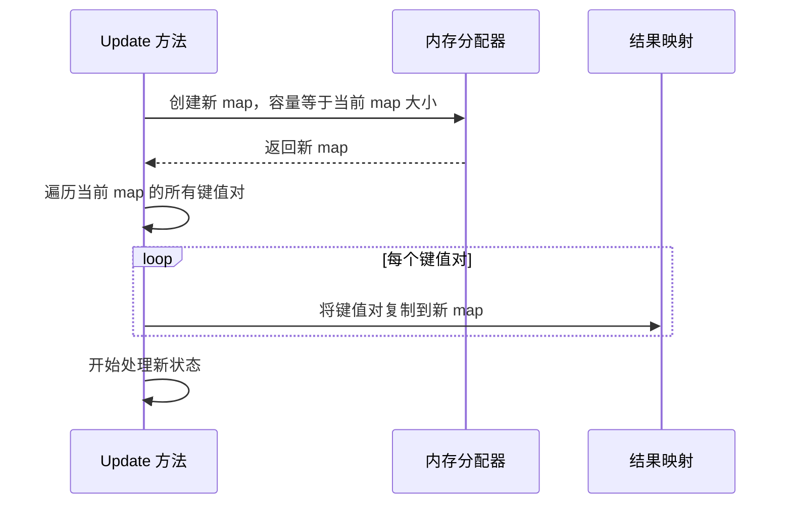
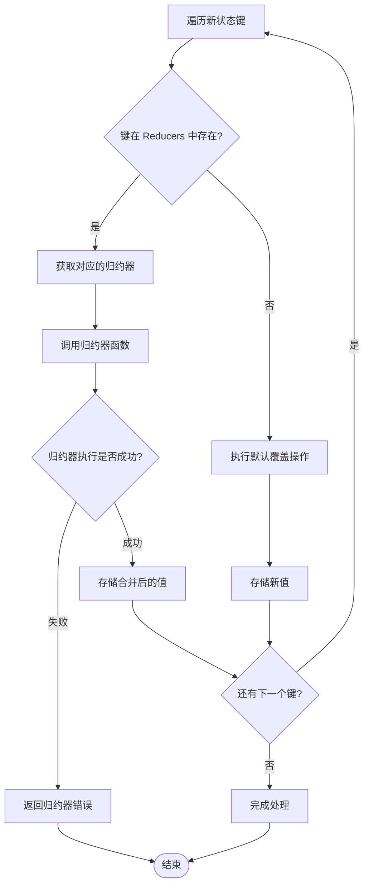
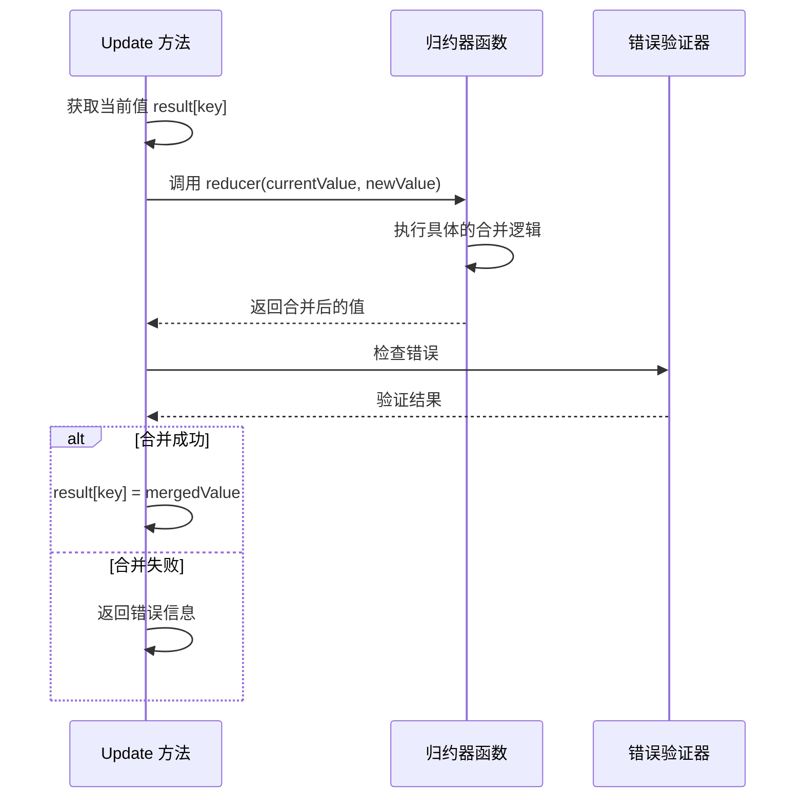
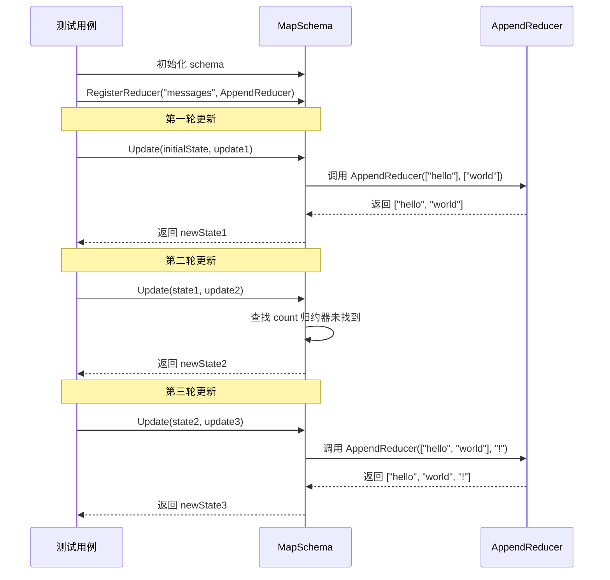

# MapSchema.Update() 方法执行流程详解

<cite>
**本文档中引用的文件**
- [schema.go](file://graph/schema.go)
- [schema_test.go](file://graph/schema_test.go)
- [custom_reducer/main.go](file://examples/custom_reducer/main.go)
- [memory_chatbot/main.go](file://examples/memory_chatbot/main.go)
</cite>

## 目录
1. [简介](#简介)
2. [方法签名与接口定义](#方法签名与接口定义)
3. [核心执行流程](#核心执行流程)
4. [边界情况处理](#边界情况处理)
5. [类型验证机制](#类型验证机制)
6. [状态复制策略](#状态复制策略)
7. [归约器查找与应用](#归约器查找与应用)
8. [测试用例分析](#测试用例分析)
9. [性能考虑](#性能考虑)
10. [总结](#总结)

## 简介

`MapSchema.Update()` 方法是 LangGraphGo 框架中状态管理的核心组件，负责将新的状态更新合并到当前状态中。该方法实现了灵活的状态合并策略，支持通过归约器（Reducer）自定义特定键的合并逻辑，同时提供默认的覆盖操作作为后备方案。

## 方法签名与接口定义

`MapSchema.Update()` 方法实现了 `StateSchema` 接口的 `Update` 方法：

```mermaid
classDiagram
class StateSchema {
<<interface>>
+Init() interface{}
+Update(current, new interface{}) (interface{}, error)
}
class MapSchema {
+map[string]Reducer Reducers
+map[string]bool EphemeralKeys
+Init() interface{}
+Update(current, new interface{}) (interface{}, error)
+RegisterReducer(key string, reducer Reducer)
+RegisterChannel(key string, reducer Reducer, isEphemeral bool)
+Cleanup(state interface{}) interface{}
}
class Reducer {
<<function>>
+func(current, new interface{}) (interface{}, error)
}
StateSchema <|-- MapSchema : 实现
MapSchema --> Reducer : 使用
```

**图表来源**
- [schema.go](file://graph/schema.go#L12-L19)
- [schema.go](file://graph/schema.go#L29-L34)

**章节来源**
- [schema.go](file://graph/schema.go#L12-L19)
- [schema.go](file://graph/schema.go#L29-L34)

## 核心执行流程

`MapSchema.Update()` 方法的执行遵循以下核心流程：



**图表来源**
- [schema.go](file://graph/schema.go#L62-L99)

**章节来源**
- [schema.go](file://graph/schema.go#L62-L99)

## 边界情况处理

### 当前状态为 nil 的处理

当 `current` 参数为 `nil` 时，方法会自动将其初始化为一个空的 `map[string]interface{}`：



**图表来源**
- [schema.go](file://graph/schema.go#L64-L66)

### 类型验证失败的处理

方法严格验证输入参数的类型，确保它们都是 `map[string]interface{}` 类型：

```mermaid
flowchart TD
TypeValidation[类型验证] --> ValidateCurrent{current 类型检查}
ValidateCurrent --> |失败| CurrentTypeError[返回 "current state is not a map[string]interface{}" 错误]
ValidateCurrent --> |成功| ValidateNew{new 类型检查}
ValidateNew --> |失败| NewTypeError[返回 "new state is not a map[string]interface{}" 错误]
ValidateNew --> |成功| ContinueProcessing[继续处理]
CurrentTypeError --> End([结束])
NewTypeError --> End
ContinueProcessing --> End
```

**图表来源**
- [schema.go](file://graph/schema.go#L67-L75)

**章节来源**
- [schema.go](file://graph/schema.go#L64-L75)

## 类型验证机制

方法使用 Go 的类型断言来验证输入参数的类型：

```mermaid
classDiagram
class TypeValidation {
+current interface{}
+new interface{}
+currMap map[string]interface{}
+newMap map[string]interface{}
+validateTypes() error
}
class TypeAssertion {
+assertCurrent() bool
+assertNew() bool
+generateError() error
}
TypeValidation --> TypeAssertion : 使用
```

**图表来源**
- [schema.go](file://graph/schema.go#L67-L75)

**章节来源**
- [schema.go](file://graph/schema.go#L67-L75)

## 状态复制策略

为了避免直接修改原始状态，方法采用深拷贝策略创建当前状态的副本：



**图表来源**
- [schema.go](file://graph/schema.go#L78-L82)

这种方法的优势：
- **安全性**：防止意外修改原始状态
- **性能**：预分配内存减少动态扩容开销
- **一致性**：确保返回的是全新的状态对象

**章节来源**
- [schema.go](file://graph/schema.go#L78-L82)

## 归约器查找与应用

### 归约器查找逻辑

方法首先检查目标键是否有注册的归约器：



**图表来源**
- [schema.go](file://graph/schema.go#L84-L96)

### 归约器执行过程

当找到合适的归约器时，方法按照以下步骤执行：



**图表来源**
- [schema.go](file://graph/schema.go#L86-L96)

### 默认覆盖操作

如果没有找到对应的归约器，方法执行简单的值覆盖：

```mermaid
flowchart TD
NoReducer[未找到归约器] --> DirectAssignment[直接赋值操作]
DirectAssignment --> StoreValue[result[key] = newValue]
StoreValue --> NextKey{还有下一个键?}
NextKey --> |是| KeyIteration[继续处理下一个键]
NextKey --> |否| Complete[完成处理]
```

**图表来源**
- [schema.go](file://graph/schema.go#L94-L96)

**章节来源**
- [schema.go](file://graph/schema.go#L84-L96)

## 测试用例分析

基于 `TestMapSchema_Update` 测试用例，我们可以深入分析多轮状态更新的具体数据流：

### 初始状态设置

测试用例首先创建了一个包含两个键的初始状态：

| 键名 | 值类型 | 值内容 |
|------|--------|--------|
| messages | []string | ["hello"] |
| count | int | 1 |

### 第一轮更新：追加消息

第一轮更新只包含一个键值对：

| 键名 | 值类型 | 值内容 |
|------|--------|--------|
| messages | []string | ["world"] |

**执行流程**：
1. 注册了 `AppendReducer` 用于 `messages` 键
2. 查找 `messages` 键的归约器
3. 应用 `AppendReducer` 将 `"world"` 追加到现有数组
4. 结果：`["hello", "world"]`

### 第二轮更新：覆盖计数器

第二轮更新只包含一个键值对：

| 键名 | 值类型 | 值内容 |
|------|--------|--------|
| count | int | 2 |

**执行流程**：
1. 查找 `count` 键的归约器
2. 未找到归约器，执行默认覆盖操作
3. 结果：`count` 被更新为 2

### 第三轮更新：追加单个元素

第三轮更新尝试追加单个字符串元素：

| 键名 | 值类型 | 值内容 |
|------|--------|--------|
| messages | string | "!" |

**执行流程**：
1. 查找 `messages` 键的归约器
2. 应用 `AppendReducer` 将 `"!"` 追加到现有数组
3. 结果：`["hello", "world", "!"]`



**图表来源**
- [schema_test.go](file://graph/schema_test.go#L10-L54)

**章节来源**
- [schema_test.go](file://graph/schema_test.go#L10-L54)

## 性能考虑

### 时间复杂度分析

- **最佳情况**：O(n)，其中 n 是新状态的键数量
- **最坏情况**：O(n × m)，其中 m 是归约器的复杂度
- **平均情况**：O(n)

### 空间复杂度分析

- **空间复杂度**：O(k)，其中 k 是当前状态的键数量
- **内存分配**：一次性分配结果 map，避免多次扩容

### 优化策略

1. **预分配内存**：根据当前状态大小预分配结果 map
2. **类型检查缓存**：避免重复的类型断言操作
3. **归约器查找优化**：使用 map 查找而非线性搜索

## 总结

`MapSchema.Update()` 方法是一个精心设计的状态合并引擎，具有以下特点：

### 核心优势

1. **灵活性**：支持自定义归约器实现复杂的合并逻辑
2. **安全性**：通过深拷贝避免状态污染
3. **健壮性**：严格的类型验证和错误处理
4. **性能**：优化的内存管理和查找算法

### 设计模式

- **策略模式**：通过归约器实现可插拔的合并策略
- **工厂模式**：通过 `NewMapSchema` 创建配置化的状态管理器
- **观察者模式**：支持对特定键的特殊处理

### 应用场景

该方法适用于需要状态持久化和增量更新的各种场景，包括但不限于：
- 对话系统中的消息历史管理
- 工作流中的状态跟踪
- 多智能体系统中的状态同步
- 游戏中的玩家状态管理

通过深入理解 `MapSchema.Update()` 方法的执行流程，开发者可以更好地利用 LangGraphGo 框架构建复杂的状态管理系统，实现灵活且高效的状态更新机制。