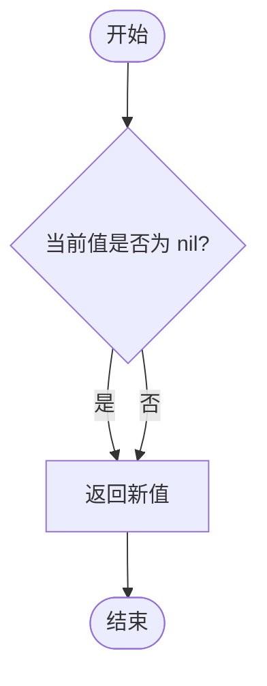
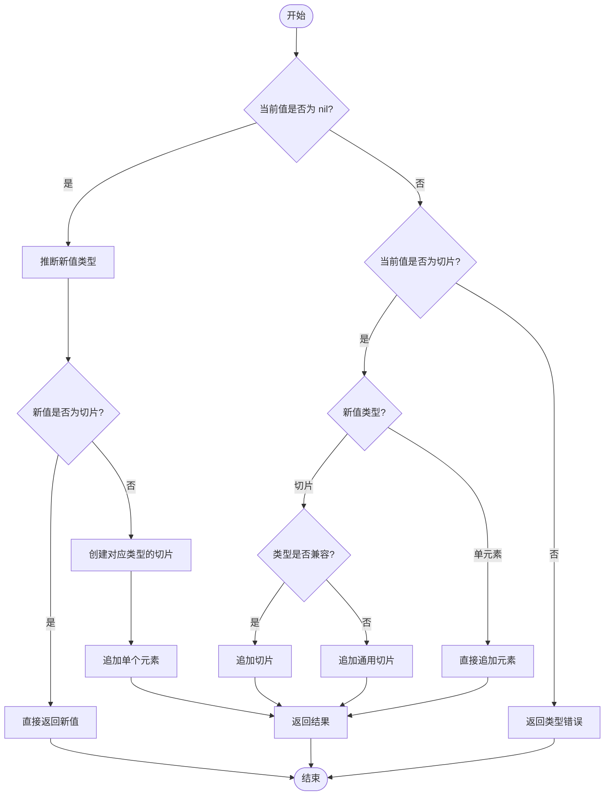
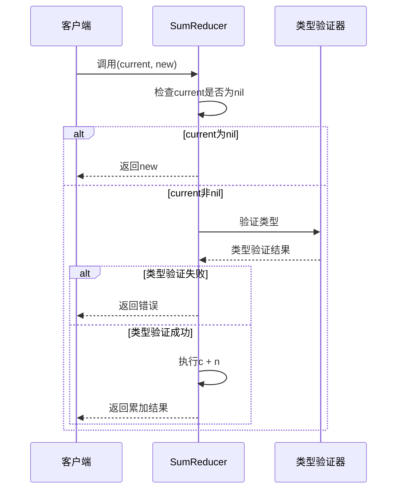
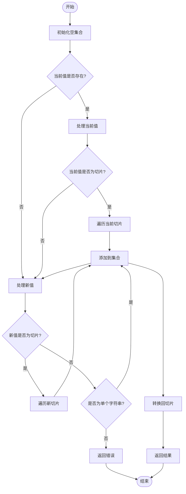
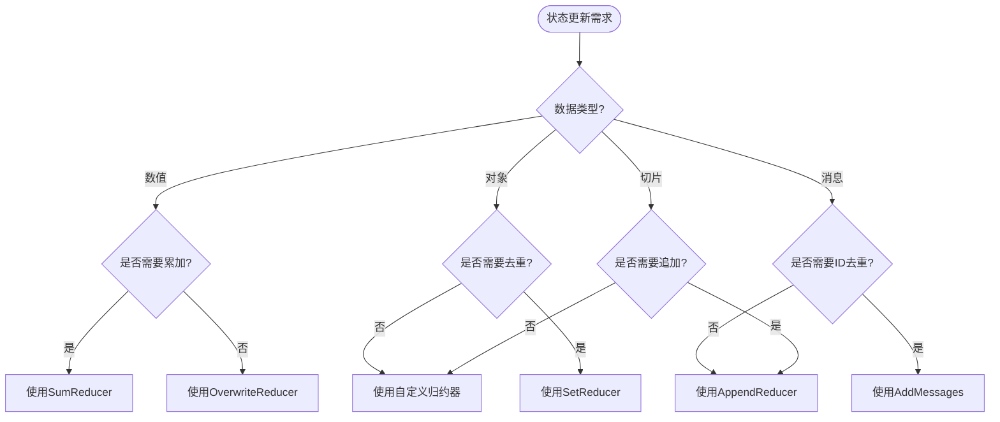

# 内置归约器实现

<cite>
**本文档中引用的文件**
- [graph/schema.go](file://graph/schema.go)
- [examples/state_schema/main.go](file://examples/state_schema/main.go)
- [examples/custom_reducer/main.go](file://examples/custom_reducer/main.go)
- [graph/add_messages.go](file://graph/add_messages.go)
- [graph/schema_test.go](file://graph/schema_test.go)
- [examples/memory_chatbot/main.go](file://examples/memory_chatbot/main.go)
</cite>

## 目录
1. [简介](#简介)
2. [归约器架构概述](#归约器架构概述)
3. [内置归约器详解](#内置归约器详解)
4. [自定义归约器示例](#自定义归约器示例)
5. [应用场景分析](#应用场景分析)
6. [性能考虑](#性能考虑)
7. [最佳实践](#最佳实践)
8. [总结](#总结)

## 简介

`langgraphgo` 框架提供了一套强大的内置归约器（Reducers），用于管理状态图中的状态更新逻辑。归约器是框架的核心组件之一，负责定义如何将新的状态值合并到现有状态中。本文档将深入分析框架提供的三种主要内置归约器：`OverwriteReducer`、`AppendReducer` 和 `SumReducer`，并探讨它们在实际应用中的使用场景。

## 归约器架构概述

归约器在 `langgraphgo` 中扮演着状态管理的关键角色。它们遵循统一的接口设计，接受当前状态值和新状态值作为输入，返回合并后的状态值。

```mermaid
classDiagram
class Reducer {
<<interface>>
+func(current, new interface{}) (interface{}, error)
}
class StateSchema {
<<interface>>
+Init() interface{}
+Update(current, new interface{}) (interface{}, error)
+Cleanup(state interface{}) interface{}
}
class MapSchema {
+Reducers map[string]Reducer
+EphemeralKeys map[string]bool
+RegisterReducer(key string, reducer Reducer)
+RegisterChannel(key string, reducer Reducer, isEphemeral bool)
+Update(current, new interface{}) (interface{}, error)
+Cleanup(state interface{}) interface{}
}
class OverwriteReducer {
+func(current, new interface{}) (interface{}, error)
}
class AppendReducer {
+func(current, new interface{}) (interface{}, error)
}
class SumReducer {
+func(current, new interface{}) (interface{}, error)
}
Reducer <|.. OverwriteReducer
Reducer <|.. AppendReducer
Reducer <|.. SumReducer
StateSchema <|-- MapSchema
MapSchema --> Reducer : "uses"
```

**图表来源**
- [graph/schema.go](file://graph/schema.go#L8-L10)
- [graph/schema.go](file://graph/schema.go#L12-L19)
- [graph/schema.go](file://graph/schema.go#L29-L34)

**章节来源**
- [graph/schema.go](file://graph/schema.go#L1-L100)

## 内置归约器详解

### OverwriteReducer：极简实现

`OverwriteReducer` 是最简单的归约器实现，体现了"替换"语义的直接性。

#### 核心实现特点

- **零逻辑设计**：直接返回新值，不进行任何状态检查
- **类型安全**：利用 Go 的类型系统确保类型一致性
- **高性能**：无条件覆盖，避免额外计算开销

#### 实现原理



**图表来源**
- [graph/schema.go](file://graph/schema.go#L142-L144)

#### 使用场景

- **状态标志**：如任务完成状态、错误标志
- **配置参数**：如运行时配置、环境变量
- **临时状态**：需要被后续更新完全覆盖的状态

**章节来源**
- [graph/schema.go](file://graph/schema.go#L142-L144)

### AppendReducer：复杂反射逻辑

`AppendReducer` 展示了框架处理复杂状态合并逻辑的能力，特别是在处理动态类型和边界情况时的优雅实现。

#### 核心功能特性

- **类型推断**：自动识别目标切片类型
- **多态支持**：同时支持切片追加和单元素追加
- **类型安全**：通过反射确保类型兼容性
- **空值处理**：优雅处理初始状态为 `nil` 的情况

#### 实现流程分析



**图表来源**
- [graph/schema.go](file://graph/schema.go#L148-L185)

#### 反射机制详解

`AppendReducer` 利用 Go 的反射包实现类型安全的动态操作：

1. **类型推断**：通过 `reflect.TypeOf()` 获取目标类型
2. **切片创建**：使用 `reflect.MakeSlice()` 创建指定类型的切片
3. **元素追加**：通过 `reflect.Append()` 和 `reflect.AppendSlice()` 进行追加操作
4. **类型验证**：确保追加操作不会导致类型不匹配

#### 边界情况处理

- **空切片初始化**：当当前状态为 `nil` 时，自动创建相应类型的切片
- **类型兼容性检查**：确保新元素与现有切片元素类型一致
- **错误处理**：对非法操作返回明确的错误信息

**章节来源**
- [graph/schema.go](file://graph/schema.go#L148-L185)

### SumReducer：数值累加归约器

`SumReducer` 展示了如何为特定数据类型（整数）实现专门的状态合并逻辑。

#### 实现特点

- **类型特化**：专门为整数累加设计
- **边界检查**：验证输入类型正确性
- **错误处理**：提供详细的类型错误信息

#### 使用模式



**图表来源**
- [examples/state_schema/main.go](file://examples/state_schema/main.go#L11-L22)

**章节来源**
- [examples/state_schema/main.go](file://examples/state_schema/main.go#L11-L22)

## 自定义归约器示例

### SetReducer：集合合并归约器

`SetReducer` 展示了如何实现更复杂的业务逻辑，如去重合并。

#### 核心算法



**图表来源**
- [examples/custom_reducer/main.go](file://examples/custom_reducer/main.go#L11-L42)

### AddMessages：智能消息合并

`AddMessages` 归约器是最复杂的内置归约器，实现了基于 ID 的消息去重和智能合并。

#### 消息 ID 提取机制

```mermaid
flowchart TD
Start([开始]) --> CheckInterface{"消息是否实现MessageWithID接口?"}
CheckInterface --> |是| CallGetID[调用GetID方法]
CheckInterface --> |否| CheckMap{"消息是否为map?"}
CallGetID --> ReturnID[返回ID]
CheckMap --> |是| CheckIDKey{"map中是否有'id'键?"}
CheckMap --> |否| CheckStruct{"消息是否为结构体?"}
CheckIDKey --> |是| ReturnMapID[返回map['id']值]
CheckIDKey --> |否| CheckStruct
CheckStruct --> |是| CheckField{"结构体是否有ID字段?"}
CheckStruct --> |否| ReturnEmpty[返回空字符串]
CheckField --> |是| ReturnStructID[返回ID字段值]
CheckField --> |否| ReturnEmpty
ReturnID --> End([结束])
ReturnMapID --> End
ReturnStructID --> End
ReturnEmpty --> End
```

**图表来源**
- [graph/add_messages.go](file://graph/add_messages.go#L107-L134)

**章节来源**
- [examples/custom_reducer/main.go](file://examples/custom_reducer/main.go#L11-L42)
- [graph/add_messages.go](file://graph/add_messages.go#L18-L135)

## 应用场景分析

### 累加计数器模式

在 `examples/state_schema/main.go` 中，`SumReducer` 被用于实现累加计数器：

| 场景 | 归约器选择 | 原因 |
|------|------------|------|
| 访问次数统计 | `SumReducer` | 数值累加，简单高效 |
| 错误计数 | `SumReducer` | 累计错误发生次数 |
| 用户行为追踪 | `SumReducer` | 统计用户操作频率 |

### 消息历史记录

`AppendReducer` 在聊天应用中发挥重要作用：

| 应用场景 | 实现方式 | 优势 |
|----------|----------|------|
| 对话历史 | `AppendReducer` | 保持消息顺序，支持无限历史 |
| 日志记录 | `AppendReducer` | 结构化日志存储 |
| 操作序列 | `AppendReducer` | 记录用户操作轨迹 |

### 状态累积模式

不同归约器在状态累积中的典型应用：

```mermaid
graph TB
subgraph "状态累积模式"
A[初始状态] --> B[节点A输出]
B --> C[节点B输出]
C --> D[节点C输出]
D --> E[最终状态]
end
subgraph "归约器策略"
F[SumReducer<br/>累加计数]
G[AppendReducer<br/>追加历史]
H[OverwriteReducer<br/>状态覆盖]
end
F --> I[count: 6]
G --> J[logs: ["Start", "A", "B", "C"]]
H --> K[status: "Completed"]
```

**图表来源**
- [examples/state_schema/main.go](file://examples/state_schema/main.go#L85-L104)

**章节来源**
- [examples/state_schema/main.go](file://examples/state_schema/main.go#L85-L104)

## 性能考虑

### 时间复杂度分析

| 归约器 | 时间复杂度 | 空间复杂度 | 主要开销 |
|--------|------------|------------|----------|
| `OverwriteReducer` | O(1) | O(1) | 无 |
| `AppendReducer` | O(n+m) | O(n+m) | 切片复制和反射操作 |
| `SumReducer` | O(1) | O(1) | 类型断言 |
| `SetReducer` | O(n+m) | O(n+m) | 集合操作和去重 |

### 内存优化策略

1. **切片预分配**：在 `AppendReducer` 中合理预估容量
2. **类型缓存**：避免重复的反射类型查询
3. **零拷贝优化**：对于简单覆盖场景优先使用 `OverwriteReducer`

### 并发安全性

- **只读归约器**：`OverwriteReducer` 和 `SumReducer` 天然线程安全
- **写时复制**：`AppendReducer` 使用写时复制避免竞态条件
- **原子操作**：对于简单状态更新建议使用原子类型

## 最佳实践

### 归约器选择指南



### 错误处理最佳实践

1. **类型检查**：始终验证输入类型
2. **边界条件**：处理 `nil` 值和空切片
3. **错误传播**：提供有意义的错误信息
4. **恢复机制**：实现优雅的降级策略

### 测试策略

针对不同归约器的测试重点：

- **边界测试**：空值、类型不匹配、边界情况
- **性能测试**：大数据量处理能力
- **并发测试**：多线程环境下的正确性
- **集成测试**：与其他组件的协作

## 总结

`langgraphgo` 框架提供的内置归约器展现了状态管理的多样性和灵活性。从极简的 `OverwriteReducer` 到复杂的 `AppendReducer` 和 `AddMessages`，每种归约器都针对特定的业务场景进行了优化。

### 核心价值

1. **类型安全**：通过 Go 的类型系统确保编译时安全
2. **性能优化**：针对不同场景的算法优化
3. **扩展性**：支持自定义归约器满足特殊需求
4. **易用性**：简洁的 API 设计降低学习成本

### 发展方向

随着框架的发展，归约器系统可能会向以下方向演进：

- **更多内置归约器**：针对特定领域的需求
- **性能优化**：更高效的内存管理和算法
- **类型推断增强**：减少显式类型声明
- **并发优化**：更好的多核处理器支持

通过深入理解这些内置归约器的实现原理和应用场景，开发者可以更好地利用 `langgraphgo` 构建高效、可靠的状态管理系统。