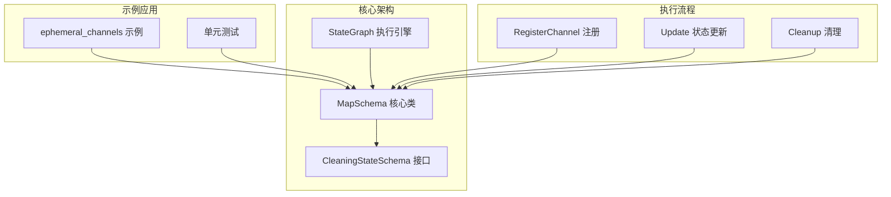
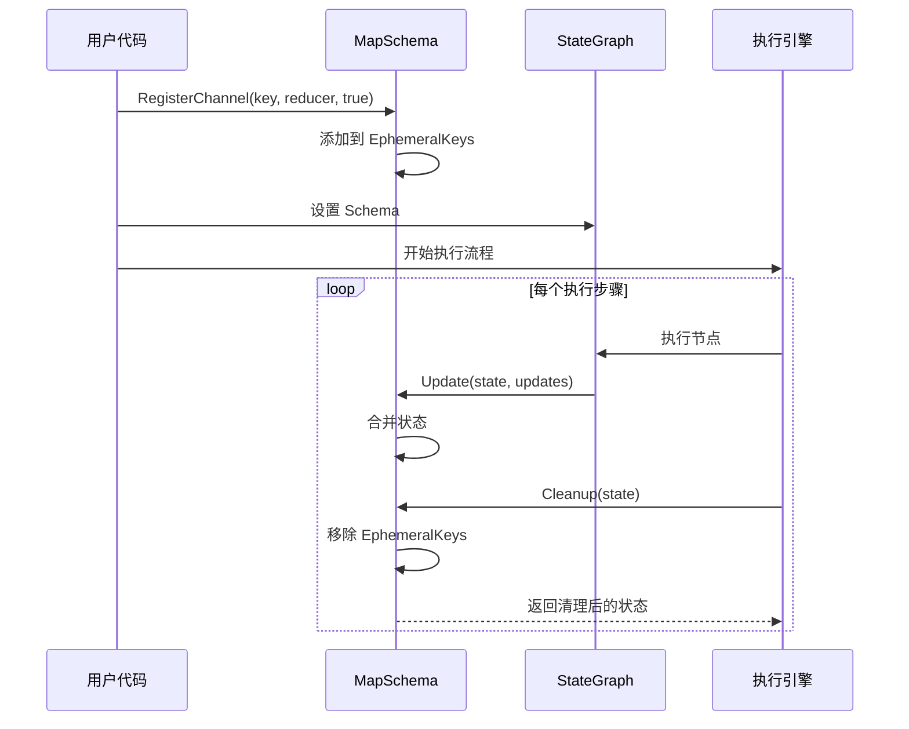
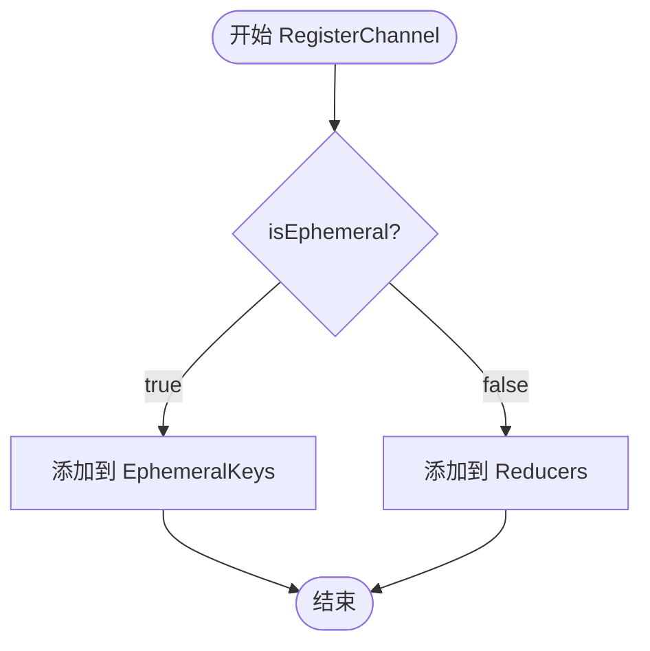
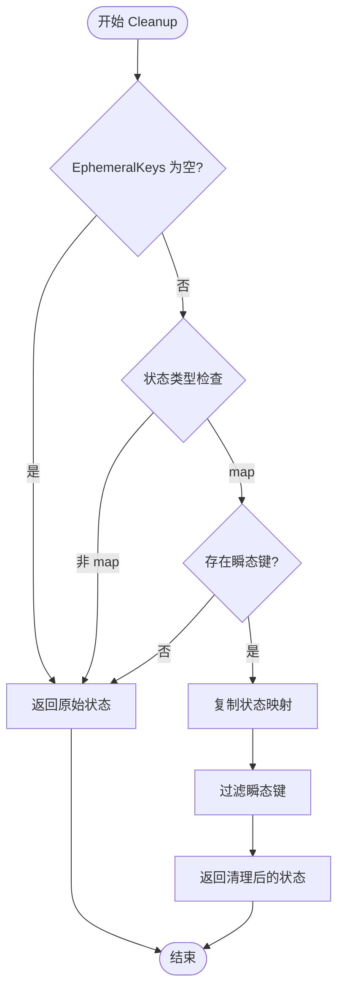
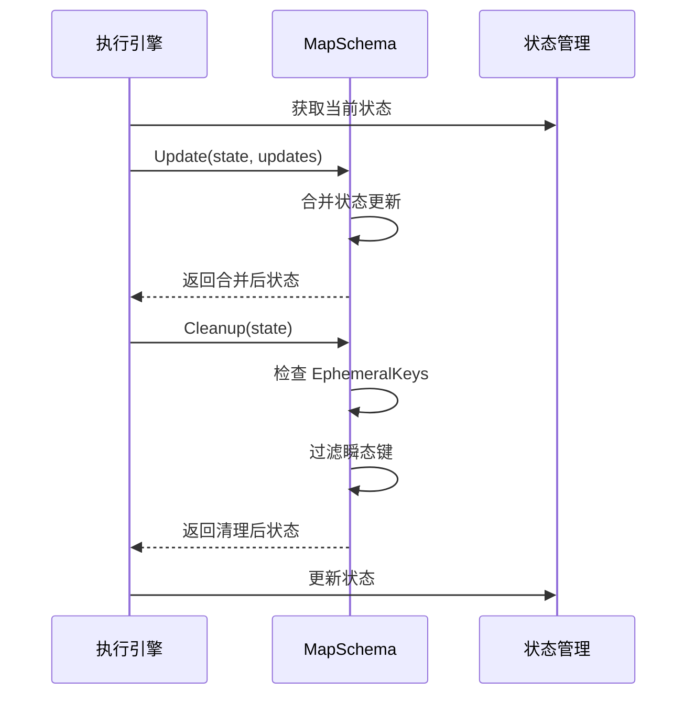
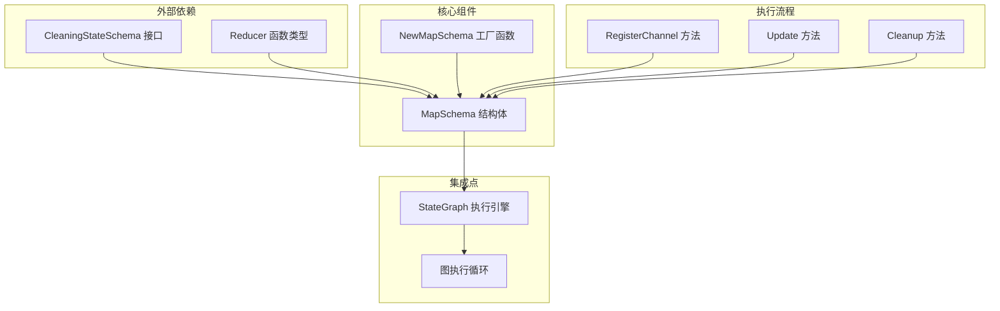

# 瞬态键（Ephemeral Keys）处理

<cite>
**本文档中引用的文件**
- [schema.go](file://graph/schema.go)
- [main.go](file://examples/ephemeral_channels/main.go)
- [schema_test.go](file://graph/schema_test.go)
- [graph.go](file://graph/graph.go)
- [state_graph.go](file://graph/state_graph.go)
- [channel_test.go](file://graph/channel_test.go)
- [README.md](file://examples/ephemeral_channels/README.md)
</cite>

## 目录
1. [简介](#简介)
2. [项目结构概述](#项目结构概述)
3. [核心组件分析](#核心组件分析)
4. [架构概览](#架构概览)
5. [详细组件分析](#详细组件分析)
6. [依赖关系分析](#依赖关系分析)
7. [性能考虑](#性能考虑)
8. [故障排除指南](#故障排除指南)
9. [结论](#结论)

## 简介

瞬态键（Ephemeral Keys）处理是 LangGraphGo 框架中的一个重要特性，它允许开发者在状态图中管理临时数据。瞬态键是指那些只在特定执行步骤内有效的数据，这些数据在步骤完成后会被自动清理，防止不必要的上下文污染。

该功能通过 `MapSchema` 结构体中的 `EphemeralKeys` 映射表来实现，配合 `RegisterChannel` 方法设置瞬态标志，以及 `Cleanup` 方法进行自动清理。这种设计特别适用于人机协作场景、临时数据传递和中间计算结果的管理。

## 项目结构概述

LangGraphGo 项目采用模块化架构，瞬态键处理功能主要分布在以下模块中：



**图表来源**
- [schema.go](file://graph/schema.go#L21-L27)
- [graph.go](file://graph/graph.go#L460-L464)
- [state_graph.go](file://graph/state_graph.go#L276-L280)

**章节来源**
- [schema.go](file://graph/schema.go#L1-L186)
- [main.go](file://examples/ephemeral_channels/main.go#L1-L75)

## 核心组件分析

### MapSchema 结构体

`MapSchema` 是瞬态键处理的核心数据结构，它维护了两个关键映射表：

- **Reducers 映射表**：存储每个键对应的更新函数
- **EphemeralKeys 映射表**：标记哪些键应该在每次步骤后被清理

```mermaid
classDiagram
class MapSchema {
+map[string]Reducer Reducers
+map[string]bool EphemeralKeys
+NewMapSchema() *MapSchema
+RegisterReducer(key string, reducer Reducer)
+RegisterChannel(key string, reducer Reducer, isEphemeral bool)
+Init() interface{}
+Update(current, new interface{}) (interface{}, error)
+Cleanup(state interface{}) interface{}
}
class CleaningStateSchema {
<<interface>>
+Cleanup(state interface{}) interface{}
}
class StateSchema {
<<interface>>
+Init() interface{}
+Update(current, new interface{}) (interface{}, error)
}
MapSchema ..|> StateSchema
MapSchema ..|> CleaningStateSchema
```

**图表来源**
- [schema.go](file://graph/schema.go#L29-L34)
- [schema.go](file://graph/schema.go#L21-L27)

### CleaningStateSchema 接口

该接口扩展了基础的 `StateSchema` 接口，增加了清理能力：

```mermaid
classDiagram
class StateSchema {
<<interface>>
+Init() interface{}
+Update(current, new interface{}) (interface{}, error)
}
class CleaningStateSchema {
<<interface>>
+Cleanup(state interface{}) interface{}
}
CleaningStateSchema --|> StateSchema
```

**图表来源**
- [schema.go](file://graph/schema.go#L21-L27)

**章节来源**
- [schema.go](file://graph/schema.go#L29-L137)

## 架构概览

瞬态键处理在 LangGraphGo 架构中的位置和工作流程如下：



**图表来源**
- [schema.go](file://graph/schema.go#L49-L55)
- [graph.go](file://graph/graph.go#L460-L464)
- [state_graph.go](file://graph/state_graph.go#L276-L280)

## 详细组件分析

### RegisterChannel 方法详解

`RegisterChannel` 方法是设置瞬态键的关键入口：



**图表来源**
- [schema.go](file://graph/schema.go#L49-L55)

该方法的工作机制：
1. **注册更新器**：无论是否为瞬态，都会将 reducer 添加到 `Reducers` 映射表
2. **设置瞬态标志**：当 `isEphemeral` 为 true 时，将键添加到 `EphemeralKeys` 映射表
3. **内存初始化**：确保两个映射表都已初始化为空映射

### Cleanup 方法深度分析

`Cleanup` 方法实现了瞬态键的自动清理逻辑：



**图表来源**
- [schema.go](file://graph/schema.go#L102-L137)

#### 性能优化策略

`Cleanup` 方法采用了多项性能优化策略：

1. **空检查优化**：首先检查 `EphemeralKeys` 是否为空，避免不必要的处理
2. **存在性检查**：在创建新映射之前，先检查是否有任何瞬态键存在于状态中
3. **就地修改**：如果状态映射可以安全地就地修改，则直接操作原映射
4. **最小化内存分配**：只为目标映射分配必要的空间

### 执行引擎集成

瞬态键清理在执行引擎中的集成点：



**图表来源**
- [graph.go](file://graph/graph.go#L460-L464)
- [state_graph.go](file://graph/state_graph.go#L276-L280)

**章节来源**
- [schema.go](file://graph/schema.go#L49-L137)
- [graph.go](file://graph/graph.go#L460-L464)
- [state_graph.go](file://graph/state_graph.go#L276-L280)

## 依赖关系分析

瞬态键处理功能的依赖关系图：



**图表来源**
- [schema.go](file://graph/schema.go#L29-L34)
- [graph.go](file://graph/graph.go#L460-L464)

**章节来源**
- [schema.go](file://graph/schema.go#L1-L186)
- [graph.go](file://graph/graph.go#L450-L492)

## 性能考虑

### 内存优化策略

1. **延迟分配**：只有在确实需要时才分配新的映射空间
2. **就地操作**：对于可变状态，尽可能进行就地修改而非创建副本
3. **早期退出**：通过多层检查快速确定是否需要执行清理操作

### 时间复杂度分析

- **RegisterChannel**：O(1) - 哈希表插入操作
- **Cleanup**：O(n + m)，其中 n 是状态映射大小，m 是瞬态键数量
- **Update**：O(k)，其中 k 是新更新的键数量

### 最佳实践建议

1. **合理使用瞬态键**：只对真正需要临时性的数据使用瞬态键
2. **批量操作**：尽量在单次更新中包含多个相关键的更新
3. **监控性能**：对于大规模状态图，监控清理操作的性能影响

## 故障排除指南

### 常见问题及解决方案

#### 问题1：瞬态键未被清理

**症状**：预期应该被清理的键仍然存在于最终状态中

**可能原因**：
- 键未正确标记为瞬态（`isEphemeral` 为 false）
- 状态类型不匹配（不是 map[string]interface{}）

**解决方案**：
- 检查 `RegisterChannel` 调用中的 `isEphemeral` 参数
- 确认状态确实是 map 类型

#### 问题2：性能问题

**症状**：清理操作导致明显的性能下降

**可能原因**：
- 状态映射过大
- 瞬态键数量过多

**解决方案**：
- 优化状态结构，减少不必要的键
- 使用更精确的键选择策略

**章节来源**
- [schema_test.go](file://graph/schema_test.go#L1-L92)
- [channel_test.go](file://graph/channel_test.go#L1-L44)

## 结论

瞬态键处理功能为 LangGraphGo 提供了强大的状态管理能力，通过 `MapSchema` 结构体中的 `EphemeralKeys` 映射表，开发者可以轻松地管理临时数据的生命周期。该功能具有以下优势：

1. **自动化清理**：无需手动干预即可自动清理临时数据
2. **性能优化**：通过多层检查和优化策略确保高效执行
3. **易于使用**：简洁的 API 设计使得功能易于理解和使用
4. **灵活配置**：支持细粒度的键级别控制

在实际应用中，瞬态键特别适用于：
- 人机协作场景中的临时输入
- 中间计算结果的暂存
- 临时标志和状态指示器
- 临时数据的跨步骤传递

通过合理的使用和优化，瞬态键处理功能能够显著提升状态图应用的性能和可维护性。