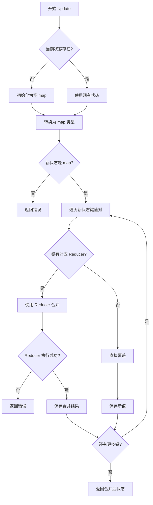
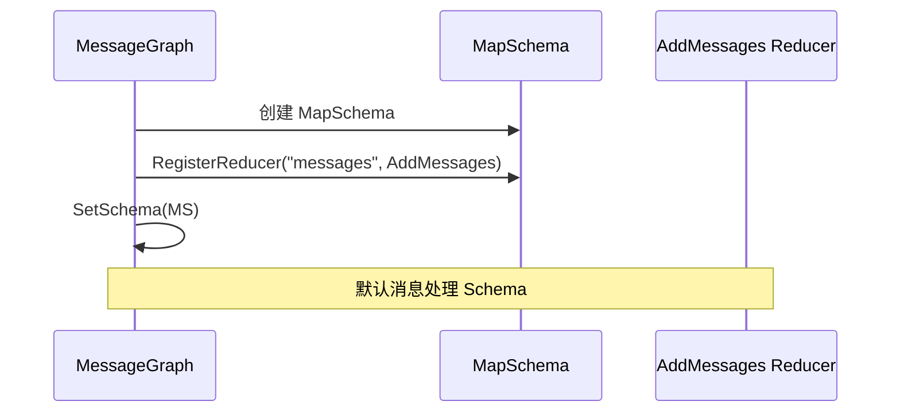
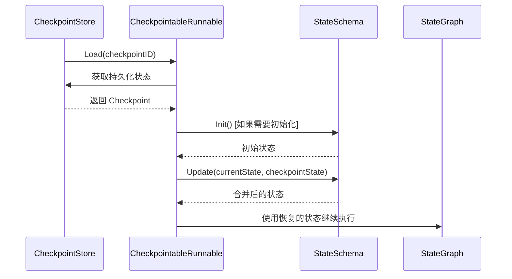
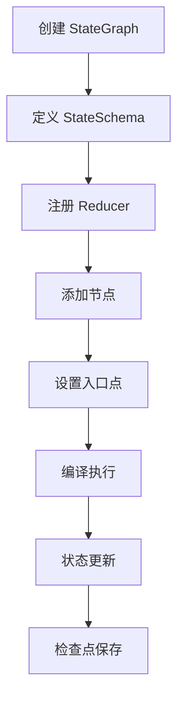
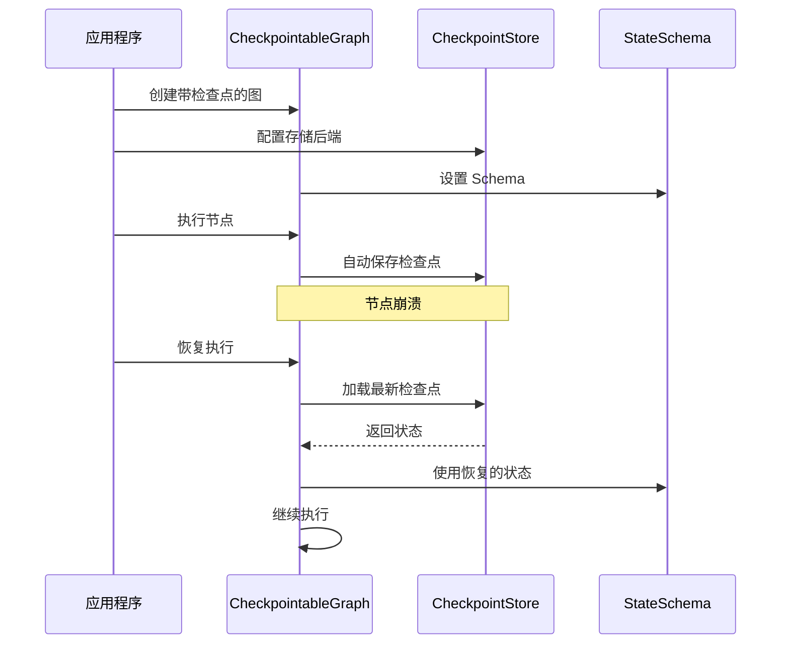

# StateSchema 接口

<cite>
**本文档中引用的文件**
- [schema.go](file://graph/schema.go)
- [state_graph.go](file://graph/state_graph.go)
- [messages_graph.go](file://graph/messages_graph.go)
- [checkpointing.go](file://graph/checkpointing.go)
- [main.go](file://examples/state_schema/main.go)
- [main.go](file://examples/durable_execution/main.go)
- [main.go](file://examples/memory_basic/main.go)
- [schema_test.go](file://graph/schema_test.go)
</cite>

## 目录
1. [简介](#简介)
2. [StateSchema 接口设计](#stateschema-接口设计)
3. [MapSchema 实现](#mapschema-实现)
4. [接口方法详解](#接口方法详解)
5. [在 StateGraph 和 MessageGraph 中的应用](#在-stategraph-和-messagegraph-中的应用)
6. [检查点恢复机制](#检查点恢复机制)
7. [自定义 Reducer 实现](#自定义-reducer-实现)
8. [使用示例和最佳实践](#使用示例和最佳实践)
9. [总结](#总结)

## 简介

StateSchema 接口是 langgraphgo 中状态结构定义的核心契约，它定义了图状态的结构和更新逻辑。该接口为状态管理提供了统一的抽象层，支持灵活的状态合并策略和持久化机制。通过 StateSchema，开发者可以精确控制状态的初始化、更新和清理过程，实现复杂的状态管理模式。

## StateSchema 接口设计

StateSchema 接口采用简洁而强大的设计，只包含两个核心方法：

```mermaid
classDiagram
class StateSchema {
<<interface>>
+Init() interface{}
+Update(current, new interface{}) (interface{}, error)
}
class CleaningStateSchema {
<<interface>>
+Cleanup(state interface{}) interface{}
}
class MapSchema {
+Reducers map[string]Reducer
+EphemeralKeys map[string]bool
+Init() interface{}
+Update(current, new interface{}) (interface{}, error)
+Cleanup(state interface{}) interface{}
+RegisterReducer(key string, reducer Reducer)
+RegisterChannel(key string, reducer Reducer, isEphemeral bool)
}
StateSchema <|-- CleaningStateSchema : extends
StateSchema <|.. MapSchema : implements
CleaningStateSchema <|.. MapSchema : implements
```

**图表来源**
- [schema.go](file://graph/schema.go#L12-L27)
- [schema.go](file://graph/schema.go#L30-L34)

### 核心特性

1. **类型安全**: 返回值为 `interface{}` 类型，提供最大的灵活性
2. **错误处理**: 明确的错误返回机制
3. **扩展性**: 支持通过 CleaningStateSchema 添加清理功能
4. **组合性**: 可以与其他组件无缝集成

**章节来源**
- [schema.go](file://graph/schema.go#L12-L27)

## MapSchema 实现

MapSchema 是 StateSchema 接口的主要实现，专门用于处理 `map[string]interface{}` 类型的状态。它提供了丰富的功能来管理不同键值的更新策略。

### 数据结构设计

```mermaid
classDiagram
class MapSchema {
+Reducers map[string]Reducer
+EphemeralKeys map[string]bool
+NewMapSchema() *MapSchema
+RegisterReducer(key string, reducer Reducer)
+RegisterChannel(key string, reducer Reducer, isEphemeral bool)
+Init() interface{}
+Update(current, new interface{}) (interface{}, error)
+Cleanup(state interface{}) interface{}
}
class Reducer {
<<function>>
+func(current, new interface{}) (interface{}, error)
}
MapSchema --> Reducer : uses
```

**图表来源**
- [schema.go](file://graph/schema.go#L30-L34)
- [schema.go](file://graph/schema.go#L8-L10)

### 核心功能

1. **Reducer 注册**: 为特定键注册不同的更新策略
2. **临时键支持**: 通过 EphemeralKeys 实现临时状态清理
3. **默认行为**: 未注册键使用覆盖策略
4. **类型安全**: 运行时类型检查确保数据一致性

**章节来源**
- [schema.go](file://graph/schema.go#L36-L55)

## 接口方法详解

### Init() 方法

Init() 方法负责返回状态的初始值，这是整个状态生命周期的起点。

#### 实现特点

- **空状态**: 返回空的 `map[string]interface{}`
- **一致性**: 每次调用都返回新的实例
- **可扩展**: 可以重写为更复杂的初始化逻辑

```mermaid
flowchart TD
A[调用 Init()] --> B{检查当前状态}
B --> |nil| C[创建空 map]
B --> |非 nil| D[使用现有状态]
C --> E[返回初始状态]
D --> E
```

**图表来源**
- [schema.go](file://graph/schema.go#L57-L60)

#### 使用场景

1. **新执行**: 开始新的流程时提供初始状态
2. **状态重置**: 需要重置到初始状态时
3. **检查点恢复**: 恢复到某个检查点时重新初始化

**章节来源**
- [schema.go](file://graph/schema.go#L57-L60)

### Update() 方法

Update() 方法是状态合并的核心逻辑，它将新状态合并到当前状态中。

#### 更新策略



**图表来源**
- [schema.go](file://graph/schema.go#L62-L99)

#### 错误处理

Update() 方法提供了完善的错误处理机制：

1. **类型验证**: 确保输入参数是正确的 map 类型
2. **Reducer 错误**: 捕获并传播 Reducer 执行中的错误
3. **一致性保证**: 确保返回的状态始终有效

**章节来源**
- [schema.go](file://graph/schema.go#L62-L99)

## 在 StateGraph 和 MessageGraph 中的应用

### StateGraph 集成

StateGraph 通过 Schema 字段集成 StateSchema 接口：

```mermaid
classDiagram
class StateGraph {
+Schema StateSchema
+SetSchema(schema StateSchema)
+AddNode(name string, fn func)
+Compile() (*StateRunnable, error)
}
class StateRunnable {
+graph *StateGraph
+Invoke(ctx, state) (interface{}, error)
+InvokeWithConfig(ctx, state, config) (interface{}, error)
}
StateGraph --> StateSchema : uses
StateGraph --> StateRunnable : creates
```

**图表来源**
- [state_graph.go](file://graph/state_graph.go#L30)
- [state_graph.go](file://graph/state_graph.go#L94-L96)

#### 设置 Schema

```go
// 设置自定义 Schema
schema := NewMapSchema()
schema.RegisterReducer("messages", AppendReducer)
g.SetSchema(schema)

// 设置默认 Schema（消息处理）
g := NewMessagesStateGraph()
```

**章节来源**
- [state_graph.go](file://graph/state_graph.go#L94-L96)
- [messages_graph.go](file://graph/messages_graph.go#L6-L12)

### MessageGraph 特化

MessageGraph 提供了针对消息处理优化的默认 Schema：



**图表来源**
- [messages_graph.go](file://graph/messages_graph.go#L8-L10)

**章节来源**
- [messages_graph.go](file://graph/messages_graph.go#L6-L12)

## 检查点恢复机制

StateSchema 在检查点系统中扮演关键角色，特别是在状态恢复过程中。

### 检查点恢复流程



**图表来源**
- [checkpointing.go](file://graph/checkpointing.go#L481-L514)

### 恢复逻辑细节

在检查点恢复过程中，StateSchema 的 Init() 方法与持久化状态协同工作：

1. **状态加载**: 从存储中加载持久化状态
2. **初始化检查**: 如果没有现有状态，则调用 Init()
3. **状态合并**: 使用 Update() 方法合并持久化状态和当前状态
4. **版本管理**: 维护状态版本信息

**章节来源**
- [checkpointing.go](file://graph/checkpointing.go#L481-L514)

## 自定义 Reducer 实现

StateSchema 支持自定义 Reducer 来实现特定的状态更新逻辑。

### 常见 Reducer 模式

```mermaid
classDiagram
class Reducer {
<<function>>
+func(current, new interface{}) (interface{}, error)
}
class SumReducer {
+SumReducer(current, new) (interface{}, error)
}
class AppendReducer {
+AppendReducer(current, new) (interface{}, error)
}
class OverwriteReducer {
+OverwriteReducer(current, new) (interface{}, error)
}
Reducer <|.. SumReducer
Reducer <|.. AppendReducer
Reducer <|.. OverwriteReducer
```

**图表来源**
- [schema.go](file://graph/schema.go#L141-L143)
- [schema.go](file://graph/schema.go#L146-L185)

### 自定义 Reducer 示例

以下是一个计数器 Reducer 的实现：

```go
// SumReducer 实现累加逻辑
func SumReducer(current, new interface{}) (interface{}, error) {
    if current == nil {
        return new, nil
    }
    c, ok1 := current.(int)
    n, ok2 := new.(int)
    if !ok1 || !ok2 {
        return nil, fmt.Errorf("expected int, got %T and %T", current, new)
    }
    return c + n, nil
}
```

**章节来源**
- [main.go](file://examples/state_schema/main.go#L11-L22)

## 使用示例和最佳实践

### 基本状态管理示例



**图表来源**
- [main.go](file://examples/state_schema/main.go#L24-L104)

### 持久化执行示例

在持久化执行场景中，StateSchema 与检查点系统深度集成：



**图表来源**
- [main.go](file://examples/durable_execution/main.go#L92-L241)

### 最佳实践建议

1. **明确的 Reducer 策略**: 为每个状态键选择合适的更新策略
2. **类型安全**: 在自定义 Reducer 中进行充分的类型检查
3. **错误处理**: 提供清晰的错误信息和恢复机制
4. **性能考虑**: 对于大型状态，考虑内存使用和序列化开销
5. **测试覆盖**: 编写全面的单元测试验证状态更新逻辑

**章节来源**
- [main.go](file://examples/state_schema/main.go#L24-L104)
- [main.go](file://examples/durable_execution/main.go#L92-L241)

## 总结

StateSchema 接口为 langgraphgo 提供了强大而灵活的状态管理能力。通过 Init() 和 Update() 方法的组合，它实现了：

1. **统一的状态抽象**: 为不同类型的状态提供一致的接口
2. **灵活的更新策略**: 支持多种状态合并方式
3. **持久化支持**: 与检查点系统无缝集成
4. **扩展性**: 支持自定义 Reducer 和特殊需求

MapSchema 作为主要实现，提供了丰富的功能来满足常见的状态管理需求。通过合理使用 StateSchema 接口，开发者可以构建出健壮、可维护的图执行系统，支持复杂的工作流和状态管理场景。