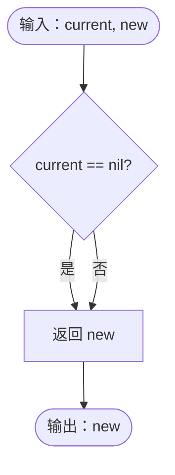
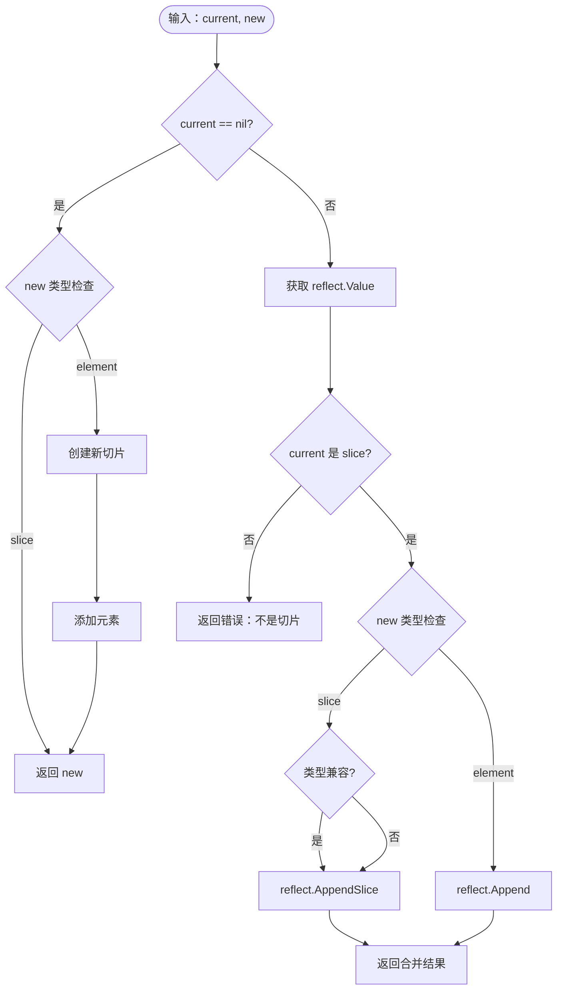
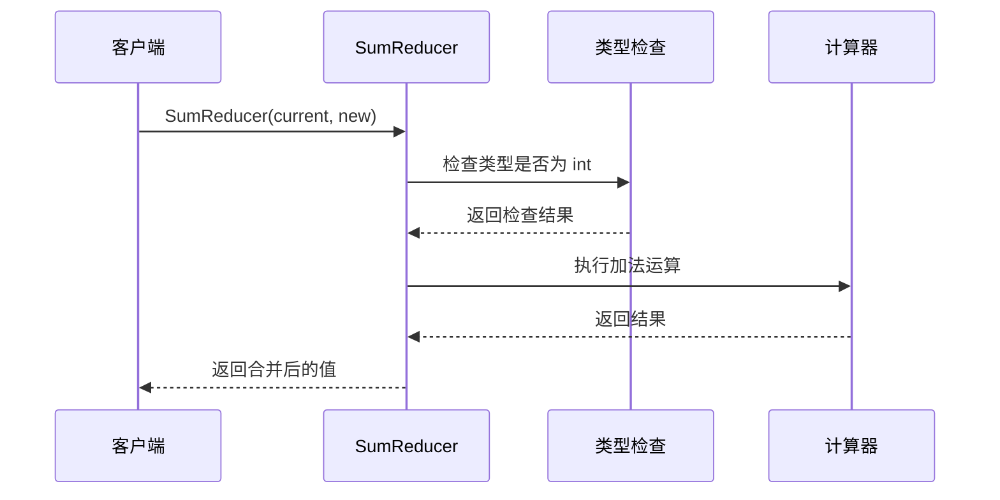
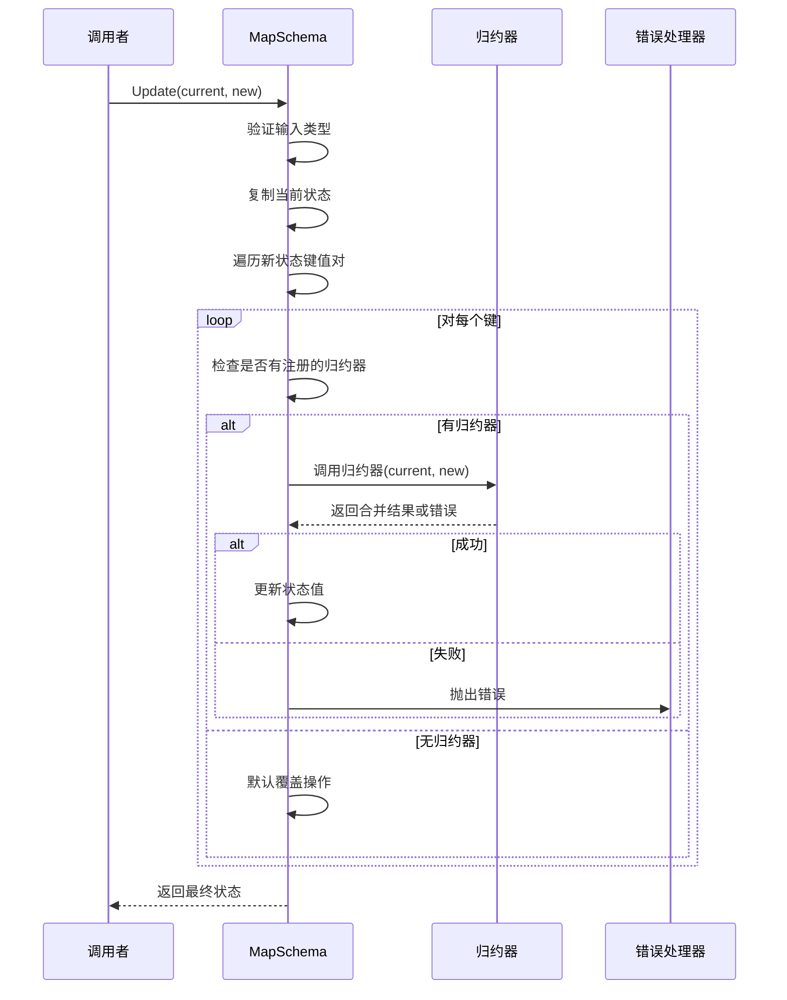
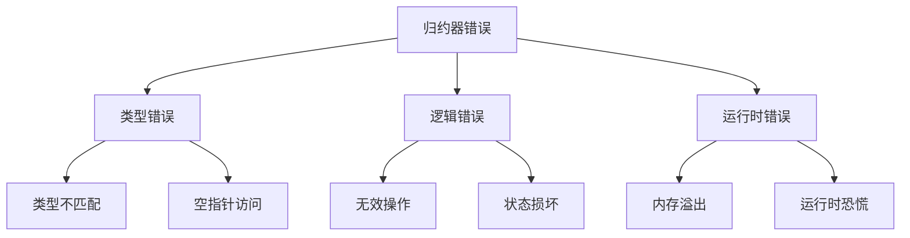
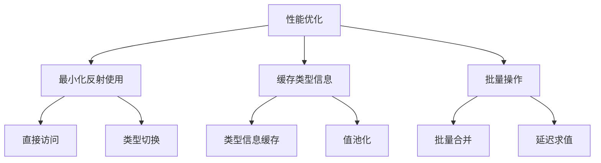

# 归约器（Reducer）函数

<cite>
**本文档中引用的文件**
- [schema.go](file://graph/schema.go)
- [schema_test.go](file://graph/schema_test.go)
- [update_state_test.go](file://graph/update_state_test.go)
- [main.go](file://examples/state_schema/main.go)
- [main.go](file://examples/custom_reducer/main.go)
- [WORKFLOW.md](file://showcases/open_deep_research/WORKFLOW.md)
</cite>

## 目录
1. [简介](#简介)
2. [归约器类型定义](#归约器类型定义)
3. [内置归约器](#内置归约器)
4. [AppendReducer 实现详解](#appendreducer-实现详解)
5. [自定义归约器](#自定义归约器)
6. [归约器在 MapSchema.Update() 中的调用](#归约器在-mapschemaupdate-中的调用)
7. [错误处理机制](#错误处理机制)
8. [性能优化建议](#性能优化建议)
9. [最佳实践](#最佳实践)
10. [总结](#总结)

## 简介

归约器（Reducer）是 langgraphgo 中用于定义状态值更新策略的核心组件。它们决定了当新状态值与当前状态值合并时的行为，提供了灵活的状态管理机制。归约器函数类型允许开发者为不同的状态字段定义特定的合并逻辑，支持从简单的覆盖操作到复杂的集合合并等各种场景。

## 归约器类型定义

归约器的基本类型定义简洁而强大：

```mermaid
classDiagram
class Reducer {
<<function>>
+func(current, new interface{}) (interface{}, error)
}
class StateSchema {
<<interface>>
+Init() interface{}
+Update(current, new interface{}) (interface{}, error)
}
class MapSchema {
+Reducers map[string]Reducer
+EphemeralKeys map[string]bool
+RegisterReducer(key string, reducer Reducer)
+RegisterChannel(key string, reducer Reducer, isEphemeral bool)
+Update(current, new interface{}) (interface{}, error)
+Cleanup(state interface{}) interface{}
}
StateSchema <|-- MapSchema : implements
MapSchema --> Reducer : uses
```

**图表来源**
- [schema.go](file://graph/schema.go#L9-L19)

**章节来源**
- [schema.go](file://graph/schema.go#L9-L19)

## 内置归约器

langgraphgo 提供了三种主要的内置归约器，每种都针对不同的使用场景进行了优化：

### OverwriteReducer

最简单的归约器，直接替换旧值为新值：



**图表来源**
- [schema.go](file://graph/schema.go#L142-L143)

### AppendReducer

功能最丰富的归约器，支持多种数据类型的追加操作：



**图表来源**
- [schema.go](file://graph/schema.go#L147-L185)

### SumReducer 示例

虽然不是内置函数，但作为参考展示了数值累加的实现模式：



**图表来源**
- [main.go](file://examples/state_schema/main.go#L11-L22)

**章节来源**
- [schema.go](file://graph/schema.go#L141-L185)
- [main.go](file://examples/state_schema/main.go#L11-L22)

## AppendReducer 实现详解

`AppendReducer` 是最复杂且功能最强大的内置归约器，它展示了如何处理不同类型的数据合并：

### 核心实现逻辑

```mermaid
classDiagram
class AppendReducerLogic {
+current interface{}
+new interface{}
+handleNilCurrent() interface{}
+handleExistingCurrent() interface{}
+appendSingleElement() interface{}
+appendSlice() interface{}
}
class ReflectionHandling {
+reflect.ValueOf(value) reflect.Value
+reflect.SliceOf(type) reflect.Type
+reflect.MakeSlice(type, len, cap) reflect.Value
+reflect.Append(slice, elem) reflect.Value
+reflect.AppendSlice(slice1, slice2) reflect.Value
}
AppendReducerLogic --> ReflectionHandling : uses
```

**图表来源**
- [schema.go](file://graph/schema.go#L147-L185)

### 类型安全保证

AppendReducer 通过反射实现了强类型安全：

1. **空值处理**：当当前值为 nil 时，根据新值类型创建相应类型的切片
2. **类型推断**：自动推断切片元素类型并创建匹配的切片
3. **类型检查**：在合并切片时验证类型兼容性
4. **运行时安全**：通过反射操作确保类型安全

### 支持的操作模式

| 当前值类型 | 新值类型 | 操作结果 | 描述 |
|------------|----------|----------|------|
| nil | 切片 | 创建新切片并包含所有元素 | 初始化切片 |
| nil | 单个元素 | 创建新切片并包含该元素 | 初始化切片 |
| 切片 | 切片 | 合并两个切片 | 追加切片内容 |
| 切片 | 单个元素 | 在切片末尾添加元素 | 追加单个元素 |

**章节来源**
- [schema.go](file://graph/schema.go#L147-L185)

## 自定义归约器

langgraphgo 支持创建完全自定义的归约器以满足特定业务需求：

### SetReducer 实现示例

```mermaid
classDiagram
class SetReducer {
+current interface{}
+new interface{}
+mergeSets() []string
+removeDuplicates() []string
}
class SetOperations {
+map[string]bool storage
+addElements(elements []string)
+addSingleElement(element string)
+convertToSlice() []string
}
SetReducer --> SetOperations : uses
```

**图表来源**
- [main.go](file://examples/custom_reducer/main.go#L12-L41)

### 自定义归约器的设计原则

1. **类型安全性**：始终进行适当的类型检查
2. **错误处理**：提供清晰的错误信息
3. **性能考虑**：避免不必要的内存分配
4. **可预测性**：确保归约行为的一致性

**章节来源**
- [main.go](file://examples/custom_reducer/main.go#L12-L41)

## 归约器在 MapSchema.Update() 中的调用

MapSchema 的 Update 方法是归约器发挥作用的核心位置：



**图表来源**
- [schema.go](file://graph/schema.go#L62-L99)

### 调用时机和流程

1. **初始化阶段**：创建 MapSchema 实例并注册归约器
2. **更新触发**：调用 Update 方法开始状态合并
3. **键遍历**：逐个处理新状态中的键值对
4. **归约器选择**：根据键查找对应的归约器
5. **执行归约**：调用选中的归约器函数
6. **结果应用**：将归约结果应用到最终状态

**章节来源**
- [schema.go](file://graph/schema.go#L62-L99)

## 错误处理机制

归约器的错误处理是确保系统稳定性的关键：

### 错误类型分类



### 错误处理策略

1. **早期验证**：在归约器开始执行前验证参数
2. **渐进式处理**：逐步处理复杂的数据结构
3. **错误传播**：将错误信息完整传递给调用者
4. **状态回滚**：在发生错误时保持状态一致性

**章节来源**
- [schema.go](file://graph/schema.go#L88-L91)

## 性能优化建议

为了获得最佳性能，归约器的使用需要注意以下几点：

### 反射性能优化



### 内存使用优化

1. **避免不必要的复制**：只在必要时创建新对象
2. **重用现有结构**：尽可能修改现有切片而非创建新切片
3. **及时释放资源**：对于大型数据结构，考虑及时清理

### 并发安全考虑

虽然当前实现不是并发安全的，但在高并发场景下需要考虑：

1. **读写分离**：区分只读操作和修改操作
2. **锁机制**：在必要时使用互斥锁保护共享状态
3. **无锁设计**：考虑使用原子操作或不可变数据结构

## 最佳实践

基于对代码库的分析，以下是使用归约器的最佳实践：

### 设计原则

1. **单一职责**：每个归约器应该只负责一种特定的合并策略
2. **幂等性**：相同的输入应该产生相同的结果
3. **可组合性**：归约器应该能够与其他组件良好配合
4. **可测试性**：归约器应该易于单元测试

### 常见陷阱

```mermaid
mindmap
root((常见陷阱))
类型安全
忘记类型检查
类型断言失败
泛型使用不当
性能问题
过度使用反射
内存泄漏
不必要的复制
错误处理
忽略错误返回
错误信息不清晰
异常情况未处理
并发安全
竞态条件
数据竞争
死锁风险
```

### 测试策略

1. **边界测试**：测试空值、nil 值、边界条件
2. **类型测试**：测试各种数据类型的组合
3. **错误测试**：验证错误处理路径
4. **性能测试**：测量大量数据的处理性能

**章节来源**
- [schema_test.go](file://graph/schema_test.go#L10-L54)
- [update_state_test.go](file://graph/update_state_test.go#L10-L59)

## 总结

langgraphgo 的归约器系统提供了一个强大而灵活的状态管理框架。通过内置的 `OverwriteReducer`、`AppendReducer` 和 `SumReducer`，以及支持自定义归约器的能力，开发者可以为不同的业务场景设计合适的合并策略。

核心优势包括：
- **类型安全**：通过反射实现强类型安全保障
- **灵活性**：支持多种数据类型的合并策略
- **可扩展性**：允许创建自定义归约器满足特殊需求
- **性能优化**：内置的性能优化措施确保高效执行

理解归约器的工作原理和最佳实践，对于构建高性能、可靠的语言模型图应用至关重要。通过合理使用归约器，开发者可以实现复杂的状态管理逻辑，同时保持代码的清晰性和可维护性。