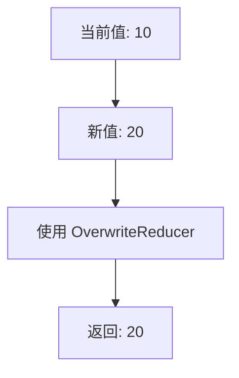
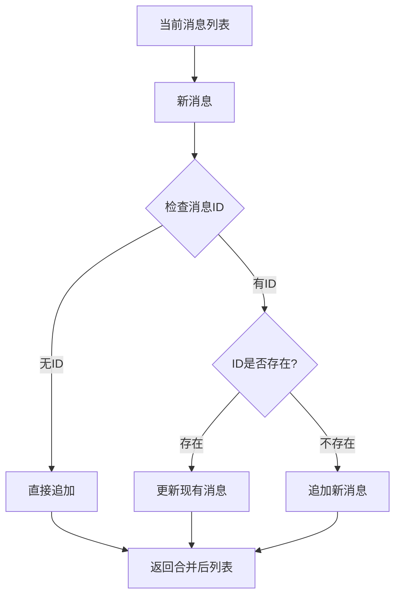
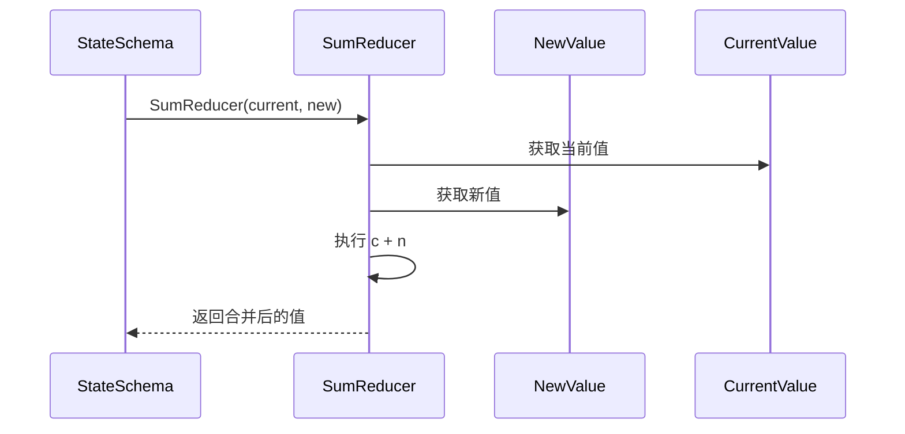
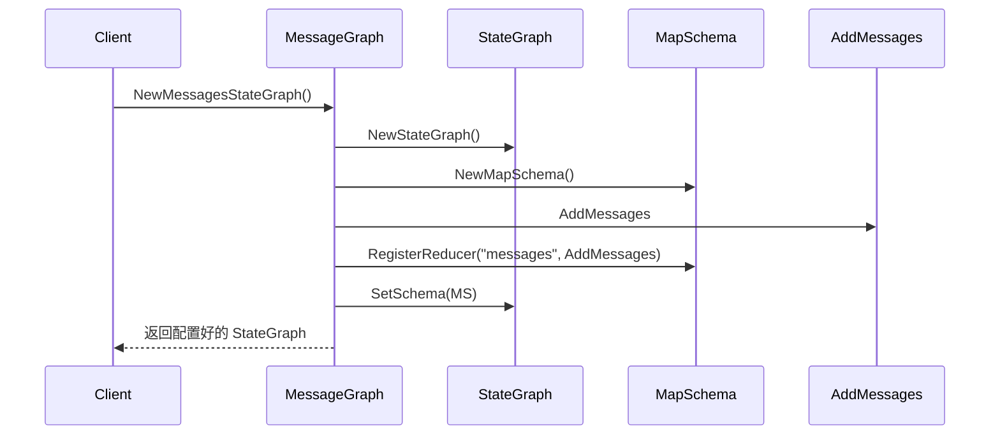
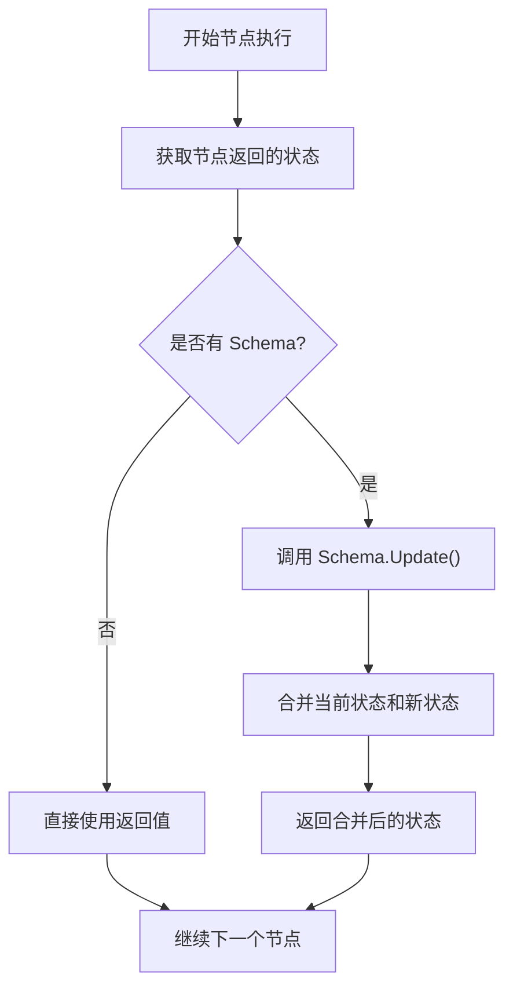
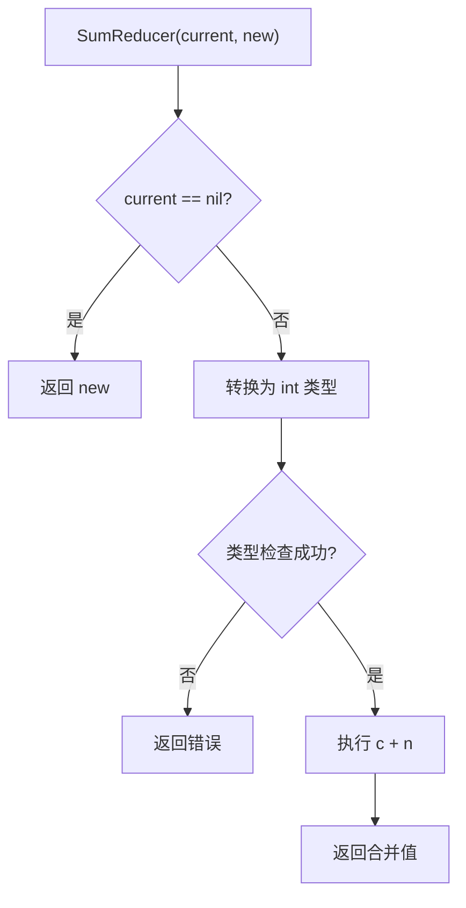
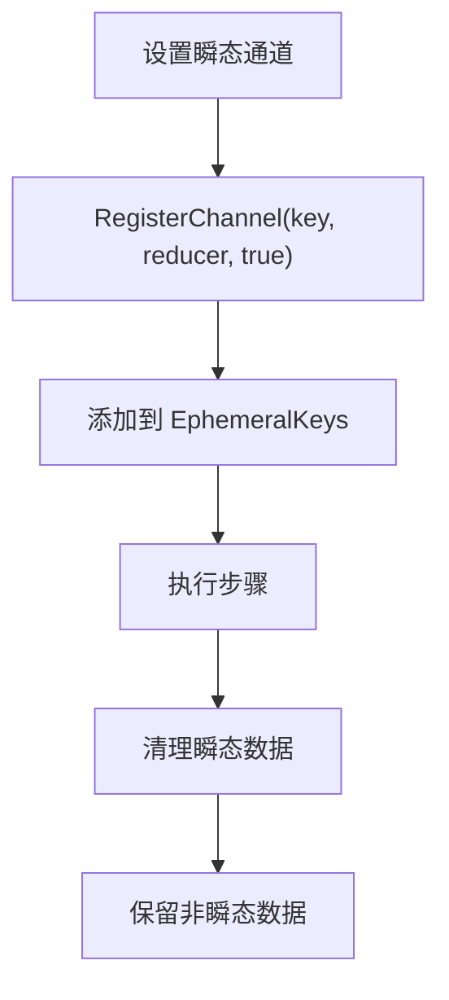
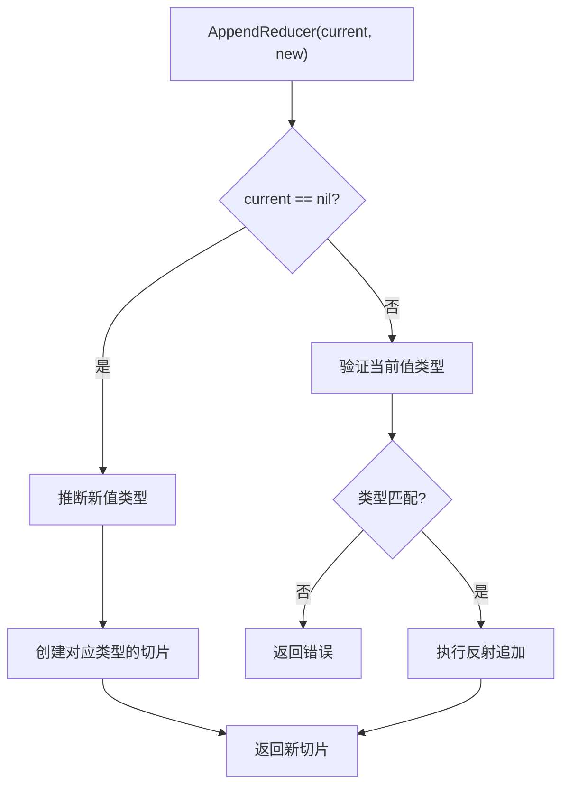
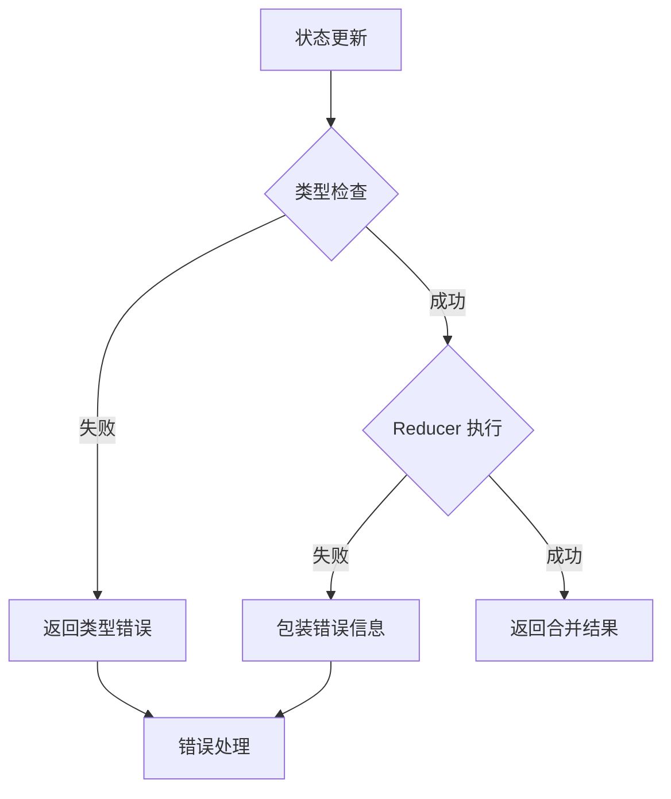

# 状态模式

<cite>
**本文档中引用的文件**
- [graph/schema.go](file://graph/schema.go)
- [examples/state_schema/main.go](file://examples/state_schema/main.go)
- [graph/state_graph.go](file://graph/state_graph.go)
- [graph/messages_graph.go](file://graph/messages_graph.go)
- [graph/add_messages.go](file://graph/add_messages.go)
- [graph/schema_test.go](file://graph/schema_test.go)
- [graph/checkpointing.go](file://graph/checkpointing.go)
</cite>

## 目录
1. [简介](#简介)
2. [StateSchema 接口设计](#stateschema-接口设计)
3. [MapSchema 核心实现](#mapschema-核心实现)
4. [Reducer 系统详解](#reducer-系统详解)
5. [StateGraph 和 MessageGraph 集成](#stategraph-和-messagegraph-集成)
6. [实际应用示例](#实际应用示例)
7. [高级特性](#高级特性)
8. [总结](#总结)

## 简介

StateSchema 是 langgraphgo 中状态结构定义的核心接口，它定义了图状态的结构和更新逻辑。通过 StateSchema，开发者可以精确控制状态值如何被初始化、更新和清理，从而构建出灵活且可预测的状态管理系统。

StateSchema 的设计理念是提供一个抽象层，允许不同的状态结构（如简单的键值对映射、复杂的嵌套对象等）都能以统一的方式进行管理。这种设计使得 langgraphgo 能够支持各种复杂的工作流场景，从简单的计数器到复杂的聊天机器人对话历史管理。

## StateSchema 接口设计

StateSchema 接口定义了状态管理的核心契约，包含两个关键方法：`Init()` 和 `Update()`。

```mermaid
classDiagram
class StateSchema {
<<interface>>
+Init() interface{}
+Update(current, new interface{}) (interface{}, error)
}
class CleaningStateSchema {
<<interface>>
+Cleanup(state interface{}) interface{}
}
class MapSchema {
+Reducers map[string]Reducer
+EphemeralKeys map[string]bool
+NewMapSchema() *MapSchema
+RegisterReducer(key string, reducer Reducer)
+RegisterChannel(key string, reducer Reducer, isEphemeral bool)
+Init() interface{}
+Update(current, new interface{}) (interface{}, error)
+Cleanup(state interface{}) interface{}
}
StateSchema <|-- CleaningStateSchema : extends
StateSchema <|-- MapSchema : implements
CleaningStateSchema <|-- MapSchema : implements
```

**图表来源**
- [graph/schema.go](file://graph/schema.go#L12-L27)
- [graph/schema.go](file://graph/schema.go#L29-L34)

### Init() 方法的作用

`Init()` 方法负责返回状态的初始值。对于 MapSchema 来说，这个初始值是一个空的 map[string]interface{}，确保每个新的执行流程都有一个干净的起点。

### Update() 方法的机制

`Update()` 方法是状态更新的核心逻辑，它接受当前状态和新状态，根据注册的 Reducer 规则合并两者。该方法遵循以下策略：

1. **默认覆盖策略**：如果某个键没有注册特定的 Reducer，则使用默认的覆盖行为
2. **Reducer 特定策略**：对于已注册的键，使用对应的 Reducer 进行合并
3. **类型安全检查**：确保输入参数是正确的 map 类型
4. **错误处理**：提供详细的错误信息，便于调试

**章节来源**
- [graph/schema.go](file://graph/schema.go#L12-L19)
- [graph/schema.go](file://graph/schema.go#L57-L60)
- [graph/schema.go](file://graph/schema.go#L62-L100)

## MapSchema 核心实现

MapSchema 是 StateSchema 接口的主要实现，专门用于处理 map[string]interface{} 类型的状态。它通过 Reducers 映射表为不同的状态键配置特定的更新逻辑。

### 数据结构设计

```mermaid
classDiagram
class MapSchema {
+Reducers map[string]Reducer
+EphemeralKeys map[string]bool
-registerReducer(key string, reducer Reducer)
-registerChannel(key string, reducer Reducer, isEphemeral bool)
-cleanup(state interface{}) interface{}
}
class Reducer {
<<function>>
+func(current, new interface{}) (interface{}, error)
}
MapSchema --> Reducer : uses
```

**图表来源**
- [graph/schema.go](file://graph/schema.go#L31-L34)

### Reducers 映射表

Reducers 字段维护了一个字符串到 Reducer 函数的映射关系。当 Update 方法处理状态合并时，它会查找每个键对应的 Reducer，如果没有找到，则使用默认的覆盖策略。

### RegisterReducer 方法

`RegisterReducer()` 方法允许开发者为特定的键注册自定义的更新逻辑。这个方法直接将 Reducer 添加到 Reducers 映射表中。

### RegisterChannel 方法

`RegisterChannel()` 方法提供了更高级的功能，除了注册 Reducer 外，还可以设置该通道是否为瞬态（ephemeral）。瞬态通道的特点是在每次步骤完成后会被自动清理。

**章节来源**
- [graph/schema.go](file://graph/schema.go#L36-L55)
- [graph/schema.go](file://graph/schema.go#L44-L55)

## Reducer 系统详解

Reducer 是 StateSchema 系统的核心组件，它定义了如何将新值合并到当前状态中。langgraphgo 提供了几种内置的 Reducer 实现。

### 内置 Reducers

#### OverwriteReducer

最基本的 Reducer 实现，直接用新值替换旧值：



**图表来源**
- [graph/schema.go](file://graph/schema.go#L141-L143)

#### AppendReducer

智能的追加 Reducer，支持多种数据类型的追加操作：

```mermaid
flowchart TD
A["当前值: []string{\"hello\"}"] --> B["新值: \"world\""]
B --> C{"检查新值类型"}
C --> |slice| D["追加切片"]
C --> |element| E["追加元素"]
D --> F["返回: []string{\"hello\", \"world\"}"]
E --> F
```

**图表来源**
- [graph/schema.go](file://graph/schema.go#L146-L185)

AppendReducer 的智能性体现在：
- 自动推断目标切片类型
- 支持切片到切片的追加
- 支持单个元素到切片的追加
- 类型安全的反射操作

#### AddMessages Reducer

专门为消息管理设计的智能 Reducer：



**图表来源**
- [graph/add_messages.go](file://graph/add_messages.go#L22-L80)

AddMessages Reducer 的特性：
- 基于 ID 的去重和更新
- 支持多种消息格式（标准 MessageContent、自定义结构体、Map）
- 类型安全的反射操作
- 灵活的消息合并策略

### 自定义 Reducer

开发者可以创建自定义的 Reducer 来满足特定的业务需求。例如，在示例中展示了如何实现 SumReducer 来累加整数值：



**图表来源**
- [examples/state_schema/main.go](file://examples/state_schema/main.go#L11-L22)

**章节来源**
- [graph/schema.go](file://graph/schema.go#L140-L185)
- [graph/add_messages.go](file://graph/add_messages.go#L18-L80)
- [examples/state_schema/main.go](file://examples/state_schema/main.go#L11-L22)

## StateGraph 和 MessageGraph 集成

StateSchema 与 StateGraph 和 MessageGraph 的集成是 langgraphgo 架构的关键部分。通过 SetSchema 方法，开发者可以为图配置特定的状态管理策略。

### StateGraph 集成

StateGraph 通过 Schema 字段持有 StateSchema 实例，这影响着整个图的状态管理行为：

```mermaid
classDiagram
class StateGraph {
+nodes map[string]Node
+edges []Edge
+entryPoint string
+Schema StateSchema
+SetSchema(schema StateSchema)
+Compile() (*StateRunnable, error)
}
class StateRunnable {
+graph *StateGraph
+Invoke(ctx context.Context, initialState interface{}) (interface{}, error)
}
class StateSchema {
<<interface>>
+Init() interface{}
+Update(current, new interface{}) (interface{}, error)
}
StateGraph --> StateSchema : uses
StateGraph --> StateRunnable : creates
```

**图表来源**
- [graph/state_graph.go](file://graph/state_graph.go#L11-L31)
- [graph/state_graph.go](file://graph/state_graph.go#L94-L97)

SetSchema 方法的实现非常简洁，它只是将传入的 StateSchema 实例赋值给 StateGraph 的 Schema 字段。这种设计使得 StateGraph 可以在运行时动态地改变其状态管理策略。

### MessageGraph 集成

MessageGraph 通过 NewMessagesStateGraph 工厂函数提供了一个预配置的 StateGraph 实例，它使用 MapSchema 并注册了 AddMessages Reducer：



**图表来源**
- [graph/messages_graph.go](file://graph/messages_graph.go#L3-L12)

### 状态合并流程

在 StateGraph 执行过程中，状态合并遵循以下流程：



**图表来源**
- [graph/checkpointing.go](file://graph/checkpointing.go#L481-L514)

**章节来源**
- [graph/state_graph.go](file://graph/state_graph.go#L94-L97)
- [graph/messages_graph.go](file://graph/messages_graph.go#L3-L12)
- [graph/checkpointing.go](file://graph/checkpointing.go#L481-L514)

## 实际应用示例

让我们深入分析 examples/state_schema/main.go 中的完整示例，展示 StateSchema 的实际应用场景。

### 示例架构

该示例演示了一个典型的计数器和日志记录系统：

```mermaid
graph LR
A["Node A<br/>count: 1<br/>logs: [\"Processed by A\"]<br/>status: \"In Progress (A)\"]"] --> B["Node B<br/>count: 2<br/>logs: [\"Processed by B\"]<br/>status: \"In Progress (B)\"]"]
B --> C["Node C<br/>count: 3<br/>logs: [\"Processed by C\"]<br/>status: \"Completed\""]
subgraph "Reducer 配置"
D["count: SumReducer<br/>logs: AppendReducer<br/>status: 默认覆盖"]
end
```

**图表来源**
- [examples/state_schema/main.go](file://examples/state_schema/main.go#L44-L69)

### Reducer 配置策略

示例中展示了三种不同的 Reducer 配置：

1. **SumReducer**：用于累加计数器
2. **AppendReducer**：用于累积日志消息
3. **默认覆盖**：用于状态标识

### 执行结果分析

通过示例代码，我们可以看到最终状态的聚合效果：

| 字段 | 初始值 | Node A | Node B | Node C | 最终值 |
|------|--------|---------|---------|---------|--------|
| count | 0 | 1 | 3 | 6 | 6 |
| logs | ["Start"] | ["Start", "Processed by A"] | ["Start", "Processed by A", "Processed by B"] | ["Start", "Processed by A", "Processed by B", "Processed by C"] | ["Start", "Processed by A", "Processed by B", "Processed by C"] |
| status | "Init" | "In Progress (A)" | "In Progress (B)" | "Completed" | "Completed" |

### 自定义 Reducer 实现

示例中的 SumReducer 展示了如何创建自定义的 Reducer：



**图表来源**
- [examples/state_schema/main.go](file://examples/state_schema/main.go#L11-L22)

**章节来源**
- [examples/state_schema/main.go](file://examples/state_schema/main.go#L24-L104)
- [examples/state_schema/main.go](file://examples/state_schema/main.go#L11-L22)

## 高级特性

### 瞬态通道（Ephemeral Channels）

MapSchema 支持瞬态通道的概念，这是一种特殊的通道类型，其内容会在每个步骤完成后自动清理：



**图表来源**
- [graph/schema.go](file://graph/schema.go#L102-L137)

### 类型安全的反射操作

AppendReducer 使用了高级的反射技术来处理不同类型的数据合并：



**图表来源**
- [graph/schema.go](file://graph/schema.go#L146-L185)

### 错误处理和调试

StateSchema 系统提供了完善的错误处理机制：



**图表来源**
- [graph/schema.go](file://graph/schema.go#L68-L76)
- [graph/schema.go](file://graph/schema.go#L88-L91)

**章节来源**
- [graph/schema.go](file://graph/schema.go#L102-L137)
- [graph/schema.go](file://graph/schema.go#L146-L185)

## 总结

StateSchema 是 langgraphgo 中状态管理的核心抽象，它通过以下关键特性提供了强大而灵活的状态控制能力：

### 主要优势

1. **抽象化**：StateSchema 接口将状态管理的细节抽象出来，使得上层逻辑可以专注于业务逻辑而非状态处理细节。

2. **可扩展性**：通过 Reducer 系统，开发者可以轻松地为不同的状态键配置特定的更新逻辑。

3. **类型安全**：内置的类型检查和反射机制确保了状态操作的安全性。

4. **性能优化**：Copy-on-Write 策略和惰性计算减少了不必要的内存分配。

5. **调试友好**：详细的错误信息和清晰的执行路径使得问题诊断更加容易。

### 设计哲学

StateSchema 的设计体现了以下哲学思想：

- **单一职责**：每个 Reducer 只负责一种特定的合并策略
- **开闭原则**：对扩展开放，对修改封闭（可以通过自定义 Reducer 扩展功能）
- **依赖倒置**：高层模块不依赖低层模块的具体实现
- **接口隔离**：StateSchema 接口只暴露必要的方法

### 应用场景

StateSchema 适用于各种需要状态管理的场景：

- **工作流引擎**：跟踪任务执行状态和进度
- **聊天机器人**：管理对话历史和用户上下文
- **事件驱动系统**：处理事件流和状态聚合
- **批处理系统**：管理作业状态和结果汇总

通过 StateSchema，langgraphgo 提供了一个既强大又易用的状态管理解决方案，为构建复杂的分布式系统奠定了坚实的基础。