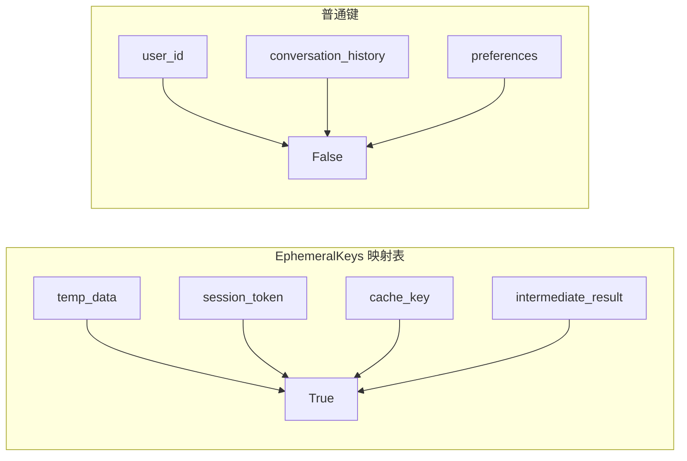
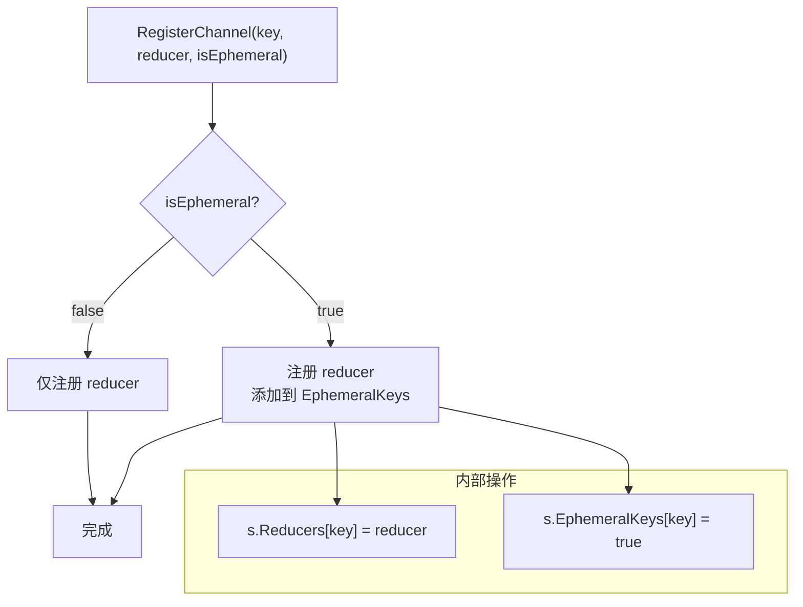
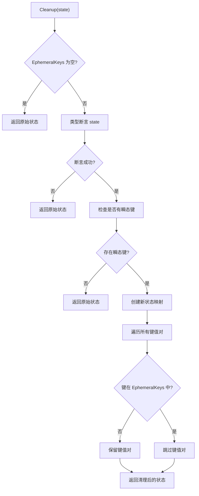
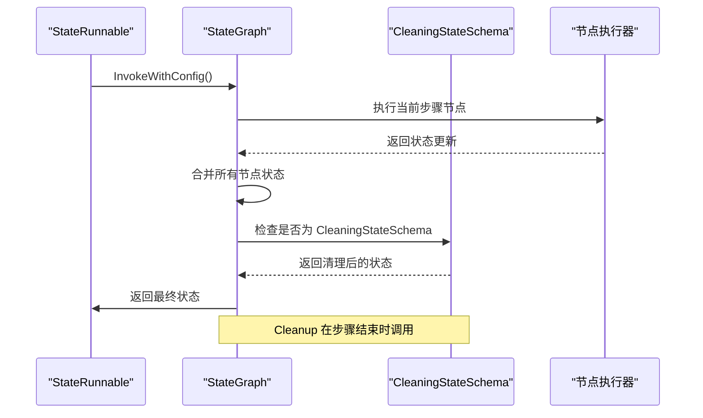
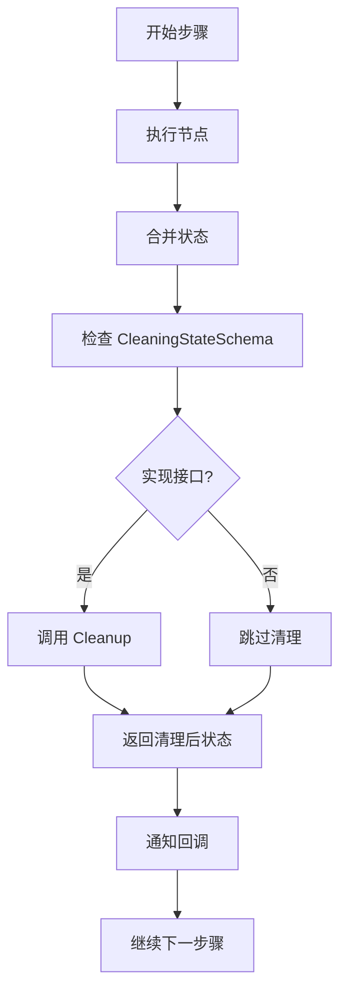
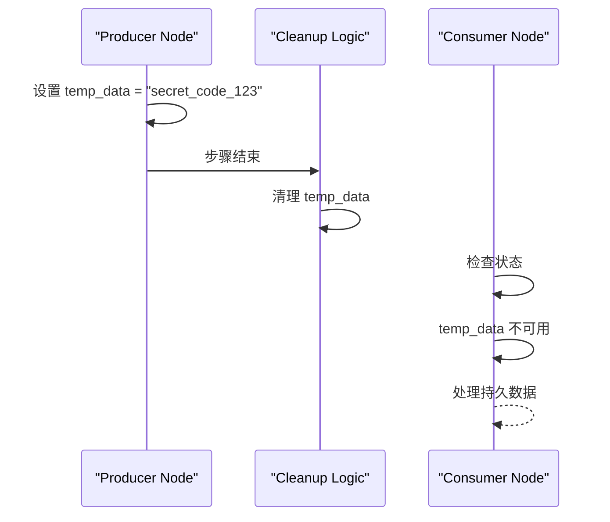
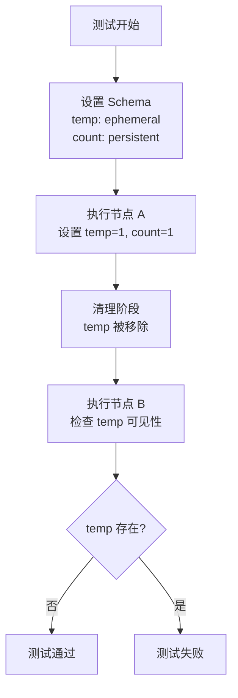
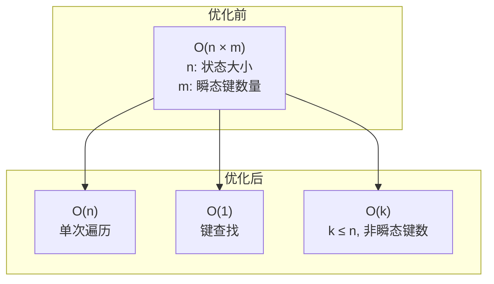

# 瞬态通道（Ephemeral Channels）

<cite>
**本文档中引用的文件**
- [schema.go](file://graph/schema.go)
- [main.go](file://examples/ephemeral_channels/main.go)
- [README.md](file://examples/ephemeral_channels/README.md)
- [README_CN.md](file://examples/ephemeral_channels/README_CN.md)
- [channel_test.go](file://graph/channel_test.go)
- [graph.go](file://graph/graph.go)
- [state_graph.go](file://graph/state_graph.go)
</cite>

## 目录
1. [简介](#简介)
2. [核心接口与结构](#核心接口与结构)
3. [EphemeralKeys 映射表详解](#ephemeralkeys-映射表详解)
4. [RegisterChannel 方法的工作原理](#registerchannel-方法的工作原理)
5. [Cleanup 方法的自动清理机制](#cleanup-方法的自动清理机制)
6. [图执行流程中的清理时机](#图执行流程中的清理时机)
7. [实际应用场景](#实际应用场景)
8. [性能优化考虑](#性能优化考虑)
9. [最佳实践](#最佳实践)
10. [总结](#总结)

## 简介

瞬态通道（Ephemeral Channels）是 LangGraphGo 中的一项重要功能，用于管理那些仅在特定执行步骤内有效的临时数据。这些数据不需要在整个对话历史中持久化，而是在完成当前步骤后自动清除，从而避免上下文污染和内存浪费。

瞬态通道的核心价值在于：
- **自动生命周期管理**：无需手动清理临时数据
- **作用域隔离**：防止临时数据泄漏到后续步骤
- **性能优化**：减少不必要的状态存储开销
- **语义清晰**：明确区分持久性和临时性数据

## 核心接口与结构

### CleaningStateSchema 接口

`CleaningStateSchema` 接口扩展了基础的 `StateSchema` 接口，增加了清理能力：

```mermaid
classDiagram
class StateSchema {
<<interface>>
+Init() interface{}
+Update(current, new) interface{}
}
class CleaningStateSchema {
<<interface>>
+Cleanup(state) interface{}
}
class MapSchema {
+Reducers map[string]Reducer
+EphemeralKeys map[string]bool
+Init() interface{}
+Update(current, new) interface{}
+Cleanup(state) interface{}
+RegisterChannel(key, reducer, isEphemeral)
+RegisterReducer(key, reducer)
}
StateSchema <|-- CleaningStateSchema : extends
CleaningStateSchema <|.. MapSchema : implements
```

**图表来源**
- [schema.go](file://graph/schema.go#L12-L27)
- [schema.go](file://graph/schema.go#L30-L34)

### MapSchema 结构体

`MapSchema` 是 `CleaningStateSchema` 的主要实现，包含两个关键字段：

| 字段 | 类型 | 描述 |
|------|------|------|
| `Reducers` | `map[string]Reducer` | 存储每个键对应的更新函数 |
| `EphemeralKeys` | `map[string]bool` | 标记哪些键是瞬态的 |

**节来源**
- [schema.go](file://graph/schema.go#L30-L34)

## EphemeralKeys 映射表详解

`EphemeralKeys` 是一个布尔映射表，用于跟踪哪些状态键应该被视为瞬态：



**图表来源**
- [schema.go](file://graph/schema.go#L32-L33)

### 映射表的工作机制

1. **键的存在性检查**：使用 `key in EphemeralKeys` 来判断是否为瞬态
2. **布尔值存储**：所有瞬态键都映射到 `true` 值
3. **内存效率**：使用映射表而非数组，提供 O(1) 查找性能

**节来源**
- [schema.go](file://graph/schema.go#L103-L136)

## RegisterChannel 方法的工作原理

`RegisterChannel` 方法是设置瞬态通道的核心入口：



**图表来源**
- [schema.go](file://graph/schema.go#L49-L54)

### 方法签名与参数

| 参数 | 类型 | 描述 |
|------|------|------|
| `key` | `string` | 状态键名 |
| `reducer` | `Reducer` | 更新函数 |
| `isEphemeral` | `bool` | 是否为瞬态 |

### 内部实现细节

1. **Reducer 注册**：无论是否为瞬态，都会注册对应的更新函数
2. **瞬态标记**：只有当 `isEphemeral` 为 `true` 时才添加到 `EphemeralKeys`
3. **幂等性**：重复调用同一键不会产生副作用

**节来源**
- [schema.go](file://graph/schema.go#L49-L54)

## Cleanup 方法的自动清理机制

`Cleanup` 方法实现了瞬态数据的自动清理逻辑：



**图表来源**
- [schema.go](file://graph/schema.go#L102-L136)

### 性能优化策略

1. **早期退出**：空的 `EphemeralKeys` 直接返回
2. **存在性检查**：预先检查是否存在瞬态键
3. **惰性复制**：仅在需要时创建新的映射
4. **容量预分配**：根据原映射大小预分配新映射容量

### 清理算法复杂度

| 操作 | 时间复杂度 | 空间复杂度 |
|------|------------|------------|
| 存在性检查 | O(1) | O(1) |
| 映射复制 | O(n) | O(n) |
| 键过滤 | O(n) | O(k)，k ≤ n |

其中 n 是状态映射的大小，k 是非瞬态键的数量。

**节来源**
- [schema.go](file://graph/schema.go#L102-L136)

## 图执行流程中的清理时机

在 LangGraphGo 的图执行过程中，`Cleanup` 方法在特定时机被调用：



**图表来源**
- [state_graph.go](file://graph/state_graph.go#L277-L280)
- [graph.go](file://graph/graph.go#L461-L464)

### 清理时机的关键点

1. **步骤边界**：在当前步骤的所有节点执行完成后
2. **状态合并后**：在所有节点的状态更新被合并之后
3. **回调之前**：在通知回调之前执行清理
4. **条件调用**：仅当 Schema 实现 `CleaningStateSchema` 接口时才调用

### 执行循环中的位置



**图表来源**
- [state_graph.go](file://graph/state_graph.go#L277-L294)

**节来源**
- [state_graph.go](file://graph/state_graph.go#L277-L294)
- [graph.go](file://graph/graph.go#L461-L491)

## 实际应用场景

### 示例：临时指令处理

在 `examples/ephemeral_channels/main.go` 中展示了典型的瞬态通道应用场景：



**图表来源**
- [main.go](file://examples/ephemeral_channels/main.go#L25-L49)

### 典型使用场景

| 场景 | 瞬态键 | 清理时机 | 业务价值 |
|------|--------|----------|----------|
| 临时搜索结果 | `search_results` | 查询完成后 | 避免缓存污染 |
| 中间计算结果 | `intermediate_calc` | 计算步骤后 | 减少内存占用 |
| 一次性消息 | `message_buffer` | 发送后 | 防止重复发送 |
| 临时令牌 | `session_token` | 使用后 | 增强安全性 |
| 临时配置 | `temp_config` | 应用后 | 避免配置泄露 |

### 测试验证

通过单元测试验证了瞬态通道的行为：



**图表来源**
- [channel_test.go](file://graph/channel_test.go#L10-L74)

**节来源**
- [main.go](file://examples/ephemeral_channels/main.go#L1-L75)
- [channel_test.go](file://graph/channel_test.go#L10-L74)

## 性能优化考虑

### 内存管理优化

1. **零拷贝策略**：当状态映射只被当前线程拥有时，允许就地修改
2. **容量预分配**：根据原映射大小预分配新映射，减少内存重分配
3. **懒惰清理**：仅在存在瞬态键时才进行清理操作

### 计算复杂度优化



### 并发安全考虑

- **无锁设计**：`EphemeralKeys` 映射表的读操作是并发安全的
- **不可变性**：清理操作返回新的映射，保持原有状态不变
- **原子性**：整个清理过程是一个原子操作

## 最佳实践

### 设计原则

1. **明确区分**：清晰定义哪些数据应该是瞬态的
2. **最小化影响**：仅标记真正需要自动清理的数据
3. **语义一致性**：确保瞬态数据的生命周期与业务逻辑一致

### 使用建议

| 建议 | 说明 | 示例 |
|------|------|------|
| 避免过度使用 | 仅对确实需要自动清理的数据使用瞬态 | 配置项通常应持久化 |
| 合理命名 | 使用描述性的键名 | `temp_search_results` 而不是 `tmp` |
| 文档化 | 在代码中注明瞬态数据的用途 | 注释说明为什么某个键是瞬态的 |
| 测试覆盖 | 编写测试验证清理行为 | 单元测试检查瞬态键是否被正确移除 |

### 常见陷阱

1. **误标持久性**：将本应持久化的数据标记为瞬态
2. **清理时机误解**：认为瞬态数据在同一步骤内不可见
3. **性能忽视**：忽略大量瞬态数据对清理性能的影响
4. **调试困难**：由于自动清理导致难以追踪临时状态

## 总结

瞬态通道功能通过 `CleaningStateSchema` 接口和 `MapSchema.Cleanup()` 方法的协同工作，提供了优雅的临时数据管理解决方案：

### 核心优势

1. **自动化**：无需手动干预即可管理临时数据生命周期
2. **透明性**：对开发者来说，瞬态通道的使用与普通通道无异
3. **高效性**：经过优化的清理算法确保良好的性能表现
4. **可靠性**：严格的类型检查和错误处理保证系统稳定性

### 技术特点

- **接口设计**：清晰的 `CleaningStateSchema` 接口分离关注点
- **数据结构**：高效的 `EphemeralKeys` 映射表支持快速查找
- **执行时机**：在图执行的适当位置自动触发清理
- **性能优化**：多层次的优化策略确保最佳性能

### 应用价值

瞬态通道功能显著提升了 LangGraphGo 在处理临时数据场景下的能力和便利性，为构建更高效、更清洁的有状态应用程序提供了重要支撑。

通过合理使用瞬态通道，开发者可以：
- 减少内存占用和上下文污染
- 简化状态管理逻辑
- 提高系统的可维护性和可测试性
- 构建更加健壮和高效的AI工作流