# 状态管理架构

<cite>
**本文档引用的文件**
- [schema.go](file://graph/schema.go)
- [add_messages.go](file://graph/add_messages.go)
- [state_graph.go](file://graph/state_graph.go)
- [checkpointing.go](file://graph/checkpointing.go)
- [channel_test.go](file://graph/channel_test.go)
- [listeners.go](file://graph/listeners.go)
- [main.go](file://examples/ephemeral_channels/main.go)
- [README.md](file://examples/ephemeral_channels/README.md)
- [README_CN.md](file://examples/ephemeral_channels/README_CN.md)
</cite>

## 目录
1. [引言](#引言)
2. [基础架构概览](#基础架构概览)
3. [StateSchema 接口设计](#stateschema-接口设计)
4. [Reducer 系统详解](#reducer-系统详解)
5. [AddMessages 智能合并机制](#addmessages-智能合并机制)
6. [通道架构演进](#通道架构演进)
7. [临时通道机制](#临时通道机制)
8. [状态管理与检查点协同](#状态管理与检查点协同)
9. [执行流程分析](#执行流程分析)
10. [最佳实践与优化建议](#最佳实践与优化建议)
11. [总结](#总结)

## 引言

langgraphgo 的状态管理系统是一个高度模块化和可扩展的架构，从基础的 `StateSchema` 接口开始，逐步演进到支持复杂通道概念的高级架构。该系统的核心设计理念是提供灵活的状态更新机制，同时确保状态的一致性和可预测性。

## 基础架构概览

langgraphgo 的状态管理架构采用分层设计，主要包含以下核心组件：

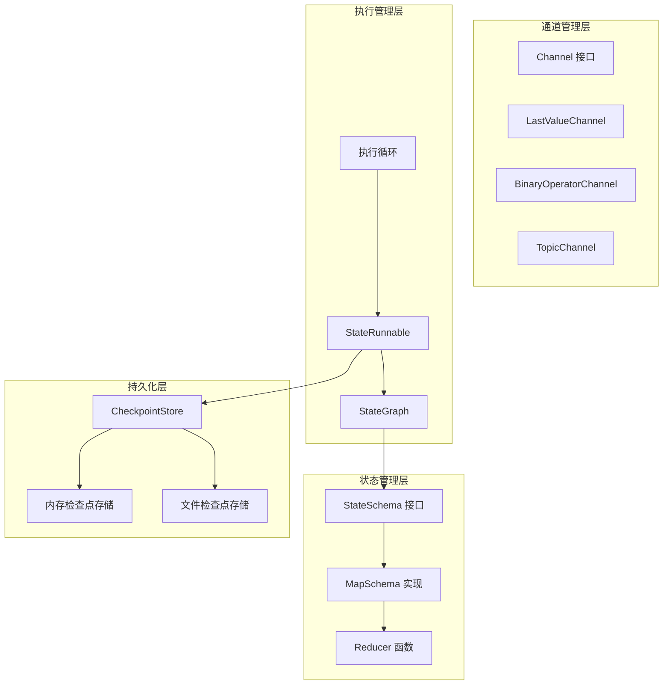

**图表来源**
- [schema.go](file://graph/schema.go#L12-L27)
- [state_graph.go](file://graph/state_graph.go#L11-L32)
- [checkpointing.go](file://graph/checkpointing.go#L22-L38)

## StateSchema 接口设计

`StateSchema` 是整个状态管理系统的核心抽象，定义了状态结构和更新逻辑的基本契约。

### 接口定义

```mermaid
classDiagram
class StateSchema {
<<interface>>
+Init() interface{}
+Update(current, new) (interface{}, error)
}
class CleaningStateSchema {
<<interface>>
+Cleanup(state) interface{}
}
class MapSchema {
+Reducers map[string]Reducer
+EphemeralKeys map[string]bool
+RegisterReducer(key, reducer)
+RegisterChannel(key, reducer, isEphemeral)
+Init() interface{}
+Update(current, new) (interface{}, error)
+Cleanup(state) interface{}
}
StateSchema <|-- CleaningStateSchema
CleaningStateSchema <|.. MapSchema
StateSchema <|.. MapSchema
```

**图表来源**
- [schema.go](file://graph/schema.go#L12-L27)
- [schema.go](file://graph/schema.go#L29-L137)

### 核心方法解析

1. **Init() 方法**：返回状态的初始值，通常是一个空的映射结构
2. **Update() 方法**：将新状态合并到当前状态中，使用注册的 reducer 函数
3. **Cleanup() 方法**（可选）：清理临时状态，用于实现临时通道功能

**章节来源**
- [schema.go](file://graph/schema.go#L12-L27)

## Reducer 系统详解

Reducer 是状态更新的核心机制，负责定义如何将新值合并到现有状态中。

### Reducer 接口定义

Reducer 是一个函数类型，接受当前值和新值作为输入，返回合并后的值和错误信息：

```go
type Reducer func(current, new interface{}) (interface{}, error)
```

### 内置 Reducer 类型

#### OverwriteReducer
最简单的 reducer，直接用新值替换旧值：

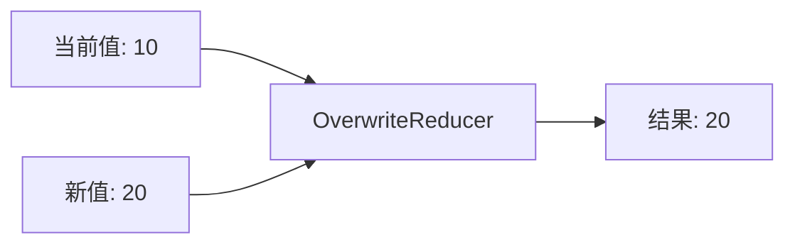

**图表来源**
- [schema.go](file://graph/schema.go#L141-L144)

#### AppendReducer
智能追加 reducer，支持多种数据类型的追加操作：

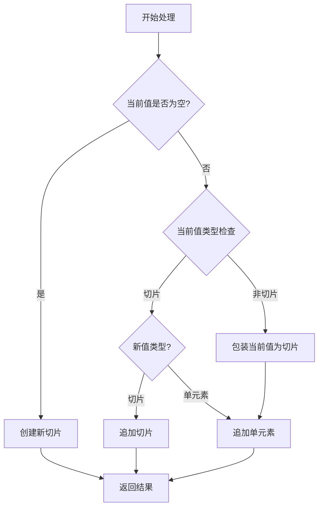

**图表来源**
- [schema.go](file://graph/schema.go#L146-L185)

### Reducer 使用模式

MapSchema 支持为每个状态键注册特定的 reducer：

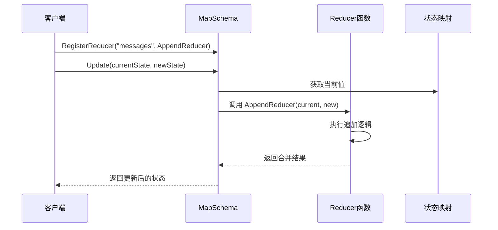

**图表来源**
- [schema.go](file://graph/schema.go#L44-L55)
- [schema.go](file://graph/schema.go#L62-L99)

**章节来源**
- [schema.go](file://graph/schema.go#L8-L19)
- [schema.go](file://graph/schema.go#L141-L185)

## AddMessages 智能合并机制

`AddMessages` 函数实现了针对消息列表的智能合并逻辑，特别支持基于 ID 的 upsert 行为。

### 消息 ID 提取机制

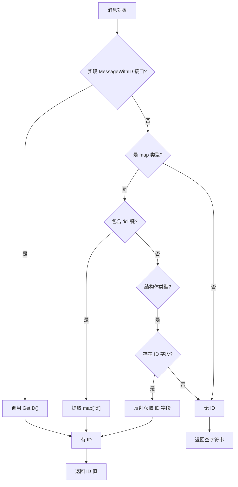

**图表来源**
- [add_messages.go](file://graph/add_messages.go#L107-L134)

### 消息合并算法

AddMessages 函数实现了复杂的消息合并逻辑：

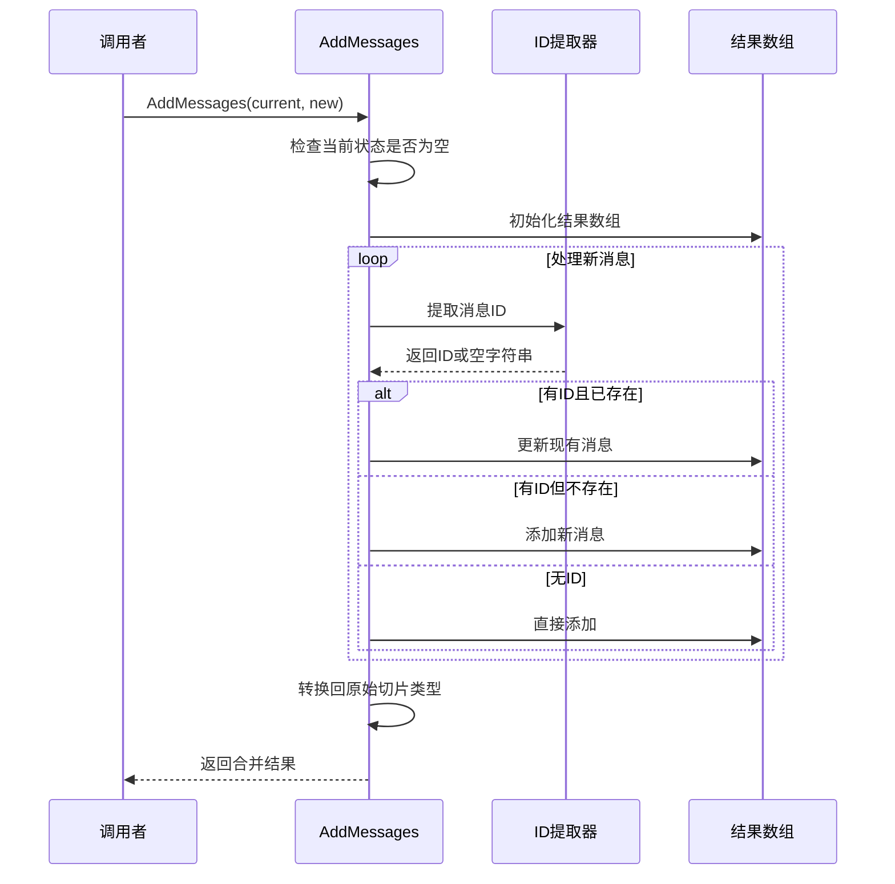

**图表来源**
- [add_messages.go](file://graph/add_messages.go#L22-L104)

### upsert 行为特点

1. **ID 基于匹配**：使用消息 ID 进行唯一性判断
2. **智能更新**：相同 ID 的消息会被新消息替换
3. **保持顺序**：不改变原有消息的相对顺序
4. **类型兼容**：支持多种消息类型的 ID 提取

**章节来源**
- [add_messages.go](file://graph/add_messages.go#L18-L135)

## 通道架构演进

langgraphgo 的通道架构经历了从简单状态映射到复杂通道系统的演进过程。

### 通道接口设计

虽然当前代码库中没有明确的 `Channel` 接口定义，但从设计意图和测试用例可以看出通道系统的核心概念：

```mermaid
classDiagram
class Channel {
<<interface>>
+GetValue() interface{}
+SetValue(value interface{})
+Merge(values []interface{}) interface{}
}
class LastValueChannel {
-value interface{}
+GetValue() interface{}
+SetValue(value interface{})
+Merge(values []interface{}) interface{}
}
class BinaryOperatorChannel {
-value interface{}
-operator func(a, b interface{}) interface{}
+GetValue() interface{}
+SetValue(value interface{})
+Merge(values []interface{}) interface{}
}
class TopicChannel {
-messages []interface{}
+GetValue() interface{}
+SetValue(value interface{})
+Merge(values []interface{}) interface{}
}
Channel <|.. LastValueChannel
Channel <|.. BinaryOperatorChannel
Channel <|.. TopicChannel
```

### 不同通道类型的语义

| 通道类型 | 语义 | 使用场景 | 合并行为 |
|---------|------|----------|----------|
| LastValueChannel | 最新值覆盖 | 单一状态更新 | 取最新值 |
| BinaryOperatorChannel | 二元运算 | 数值累加/聚合 | 自定义运算 |
| TopicChannel | 消息队列 | 多消息收集 | 保留所有消息 |

### 通道系统的优势

1. **语义清晰**：每种通道类型对应特定的业务语义
2. **性能优化**：针对不同场景优化合并算法
3. **类型安全**：编译时保证通道类型的正确使用
4. **可扩展性**：易于添加新的通道类型

## 临时通道机制

临时通道（Ephemeral Channels）是 langgraphgo 状态管理的重要特性，用于处理需要短暂存在的状态数据。

### 实现原理

临时通道通过 `CleaningStateSchema` 接口实现：

```mermaid
classDiagram
class CleaningStateSchema {
<<interface>>
+Init() interface{}
+Update(current, new) (interface{}, error)
+Cleanup(state) interface{}
}
class MapSchema {
+EphemeralKeys map[string]bool
+Cleanup(state) interface{}
}
CleaningStateSchema <|.. MapSchema
```

**图表来源**
- [schema.go](file://graph/schema.go#L21-L27)
- [schema.go](file://graph/schema.go#L31-L34)

### 清理时机

临时通道的清理发生在每个执行步骤结束后：

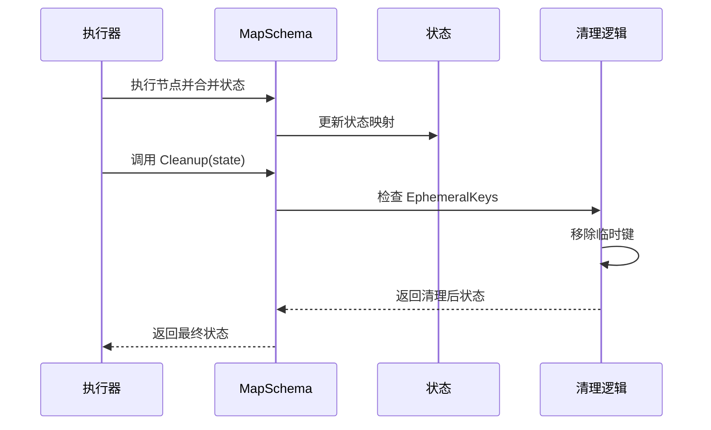

**图表来源**
- [state_graph.go](file://graph/state_graph.go#L277-L280)

### 使用示例分析

以 `examples/ephemeral_channels` 为例：

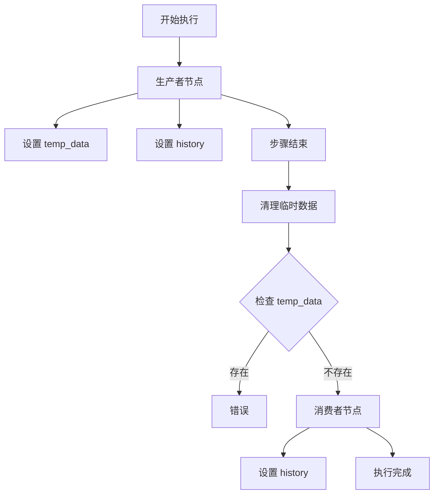

**图表来源**
- [main.go](file://examples/ephemeral_channels/main.go#L15-L75)

**章节来源**
- [schema.go](file://graph/schema.go#L21-L27)
- [channel_test.go](file://graph/channel_test.go#L10-L75)
- [main.go](file://examples/ephemeral_channels/main.go#L15-L75)

## 状态管理与检查点协同

langgraphgo 的状态管理系统与检查点持久化紧密集成，提供了完整的状态恢复和时间旅行能力。

### 检查点架构

```mermaid
classDiagram
class Checkpoint {
+ID string
+NodeName string
+State interface{}
+Metadata map[string]interface{}
+Timestamp time.Time
+Version int
}
class CheckpointStore {
<<interface>>
+Save(ctx, checkpoint) error
+Load(ctx, checkpointID) (*Checkpoint, error)
+List(ctx, executionID) ([]*Checkpoint, error)
+Delete(ctx, checkpointID) error
+Clear(ctx, executionID) error
}
class MemoryCheckpointStore {
+checkpoints map[string]*Checkpoint
+mutex sync.RWMutex
}
class FileCheckpointStore {
+writer io.Writer
+reader io.Reader
+mutex sync.RWMutex
}
CheckpointStore <|.. MemoryCheckpointStore
CheckpointStore <|.. FileCheckpointStore
Checkpoint --> CheckpointStore
```

**图表来源**
- [checkpointing.go](file://graph/checkpointing.go#L12-L38)
- [checkpointing.go](file://graph/checkpointing.go#L40-L111)

### 状态快照机制

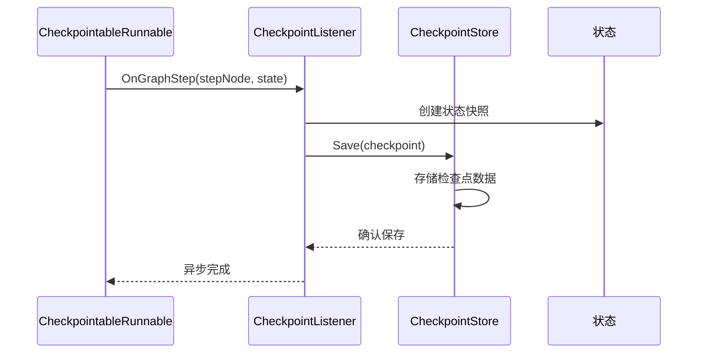

**图表来源**
- [checkpointing.go](file://graph/checkpointing.go#L297-L330)

### 时间旅行支持

检查点系统支持状态的保存、加载和恢复：

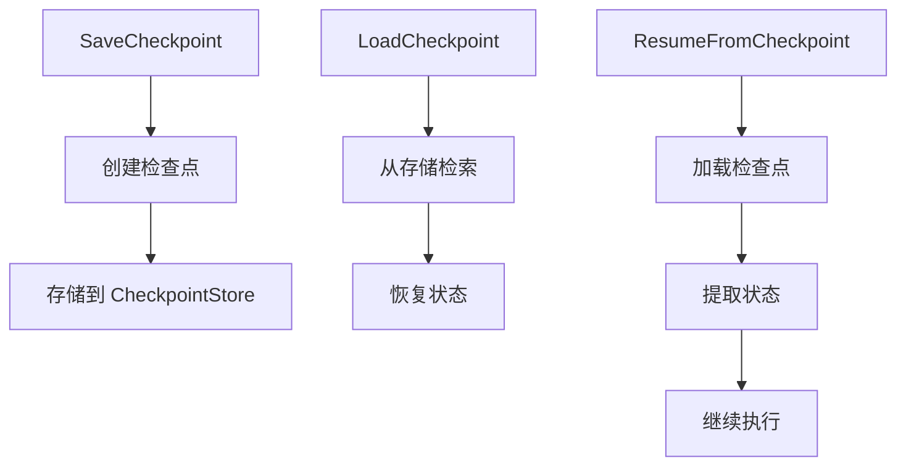

**图表来源**
- [checkpointing.go](file://graph/checkpointing.go#L269-L290)

**章节来源**
- [checkpointing.go](file://graph/checkpointing.go#L12-L560)

## 执行流程分析

langgraphgo 的状态管理贯穿整个执行流程，从状态初始化到最终结果输出。

### 主要执行阶段

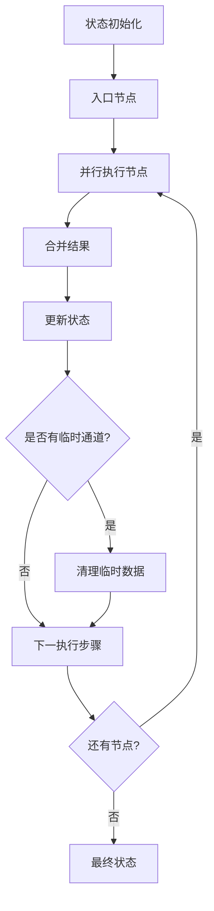

**图表来源**
- [state_graph.go](file://graph/state_graph.go#L129-L296)

### 并行执行与状态合并

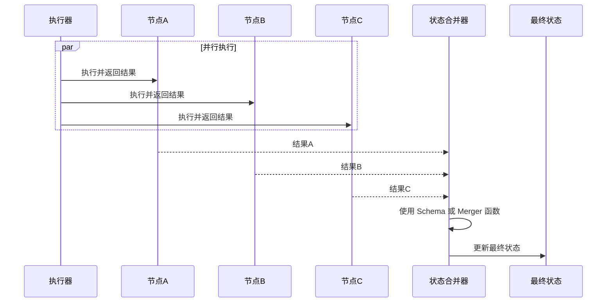

**图表来源**
- [state_graph.go](file://graph/state_graph.go#L143-L209)

### 错误处理与重试机制

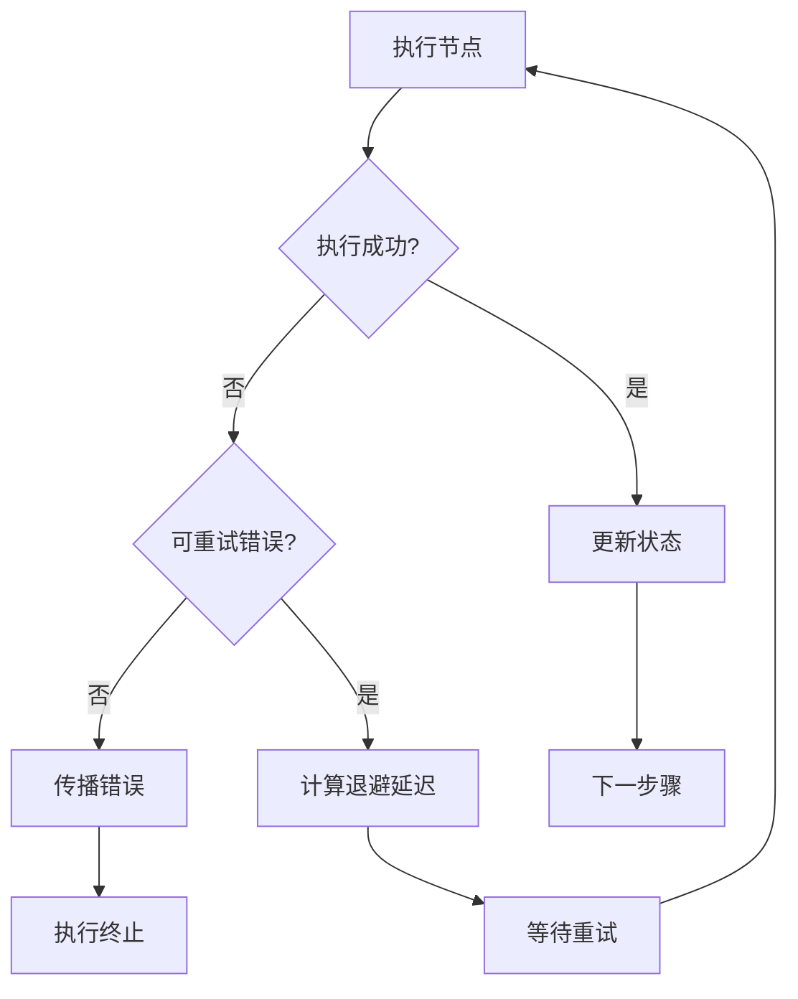

**图表来源**
- [state_graph.go](file://graph/state_graph.go#L299-L338)

**章节来源**
- [state_graph.go](file://graph/state_graph.go#L129-L296)

## 最佳实践与优化建议

### Reducer 选择指南

1. **简单覆盖**：使用 `OverwriteReducer` 处理单一值更新
2. **列表追加**：使用 `AppendReducer` 处理消息或事件列表
3. **自定义逻辑**：实现自定义 reducer 处理复杂业务逻辑

### 性能优化策略

1. **避免频繁的临时通道清理**：合理设计临时数据的生命周期
2. **批量状态更新**：减少不必要的状态序列化开销
3. **检查点频率控制**：平衡持久化开销和恢复能力

### 错误处理建议

1. **验证 reducer 返回值**：确保 reducer 不返回无效状态
2. **处理类型断言失败**：在状态转换时进行充分的类型检查
3. **优雅处理并发冲突**：在并行执行环境中考虑状态一致性

### 监控与调试

1. **状态变更追踪**：使用监听器监控状态变化
2. **性能指标收集**：跟踪状态更新和清理的性能
3. **检查点健康检查**：定期验证检查点存储的可靠性

## 总结

langgraphgo 的状态管理系统展现了现代状态机架构的最佳实践：

1. **模块化设计**：从基础接口到具体实现的清晰层次
2. **灵活扩展**：支持自定义 reducer 和通道类型
3. **性能优化**：针对不同场景的专门优化
4. **可靠性保障**：完善的检查点和错误处理机制
5. **开发体验**：丰富的监听器和调试工具

该架构不仅满足了当前的功能需求，还为未来的扩展预留了充足的空间，是构建复杂状态驱动应用的理想选择。