# BinaryOperatorChannel 实现机制与核心作用深度解析

<cite>
**本文档引用的文件**
- [add_messages.go](file://graph/add_messages.go)
- [add_messages_test.go](file://graph/add_messages_test.go)
- [schema.go](file://graph/schema.go)
- [channel_test.go](file://graph/channel_test.go)
- [schema_test.go](file://graph/schema_test.go)
- [custom_reducer/main.go](file://examples/custom_reducer/main.go)
- [checkpointing/main.go](file://examples/checkpointing/main.go)
- [state_graph.go](file://graph/state_graph.go)
- [context.go](file://graph/context.go)
</cite>

## 目录
1. [引言](#引言)
2. [项目结构概览](#项目结构概览)
3. [BinaryOperatorChannel 核心概念](#binaryoperatorchannel-核心概念)
4. [架构设计与实现原理](#架构设计与实现原理)
5. [详细组件分析](#详细组件分析)
6. [核心方法实现机制](#核心方法实现机制)
7. [状态管理与持久化](#状态管理与持久化)
8. [应用场景与最佳实践](#应用场景与最佳实践)
9. [性能考虑与优化建议](#性能考虑与优化建议)
10. [故障排除指南](#故障排除指南)
11. [总结](#总结)

## 引言

BinaryOperatorChannel 是 LangGraphGo 框架中的核心状态管理机制，它通过二元操作函数（如 append、add）将更新序列归约为一个累积值。这种模式本质上等效于传统的 Reducer 模式，在消息累加、状态累积等场景中发挥着关键作用。

BinaryOperatorChannel 的设计哲学体现了函数式编程的核心思想：通过纯函数组合来构建复杂的状态管理系统。它不仅提供了强大的状态累积能力，还确保了系统的幂等性和并发安全性。

## 项目结构概览

LangGraphGo 项目采用模块化架构，BinaryOperatorChannel 相关功能分布在以下关键模块中：

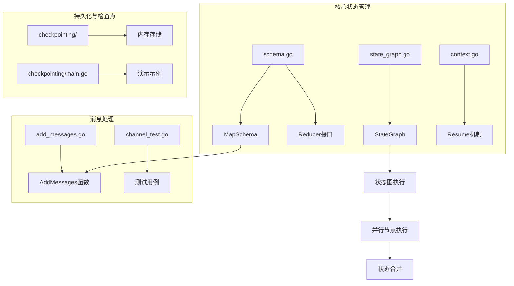

**图表来源**
- [schema.go](file://graph/schema.go#L1-L186)
- [state_graph.go](file://graph/state_graph.go#L1-L200)
- [add_messages.go](file://graph/add_messages.go#L1-L135)

## BinaryOperatorChannel 核心概念

### Reducer 模式基础

BinaryOperatorChannel 基于 Reducer 模式构建，该模式定义了如何将新的状态值合并到现有状态中：

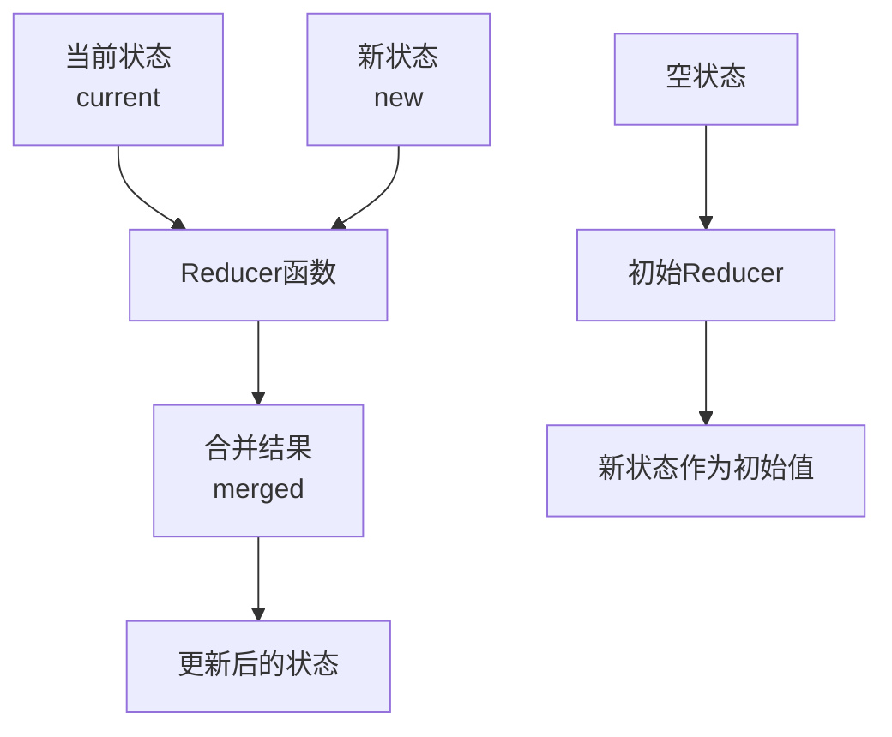

**图表来源**
- [schema.go](file://graph/schema.go#L8-L10)

### 二元操作函数类型

BinaryOperatorChannel 支持多种类型的二元操作函数：

| 操作类型 | 函数名称 | 用途描述 | 数据结构 |
|---------|---------|----------|----------|
| 追加操作 | AppendReducer | 将新元素添加到集合末尾 | 切片类型 |
| 覆盖操作 | OverwriteReducer | 替换旧值为新值 | 任意类型 |
| 智能合并 | AddMessages | 基于ID的消息合并 | 结构体/Map |
| 自定义聚合 | SetReducer | 去重集合合并 | 字符串切片 |

**节来源**
- [schema.go](file://graph/schema.go#L141-L184)
- [add_messages.go](file://graph/add_messages.go#L18-L22)

## 架构设计与实现原理

### 整体架构图

```mermaid
classDiagram
class StateSchema {
<<interface>>
+Init() interface{}
+Update(current, new) (interface{}, error)
}
class CleaningStateSchema {
<<interface>>
+Cleanup(state) interface{}
}
class MapSchema {
+Reducers map[string]Reducer
+EphemeralKeys map[string]bool
+RegisterReducer(key, reducer)
+RegisterChannel(key, reducer, isEphemeral)
+Update(current, new) (interface{}, error)
+Cleanup(state) interface{}
}
class Reducer {
<<function>>
+(current, new) (interface{}, error)
}
class StateGraph {
+nodes map[string]Node
+Schema StateSchema
+AddNode(name, fn)
+SetSchema(schema)
+Compile() (*StateRunnable, error)
}
class StateRunnable {
+graph *StateGraph
+Invoke(ctx, initialState) (interface{}, error)
+InvokeWithConfig(ctx, initialState, config) (interface{}, error)
}
StateSchema <|-- CleaningStateSchema
StateSchema <|.. MapSchema
CleaningStateSchema <|.. MapSchema
MapSchema --> Reducer
StateGraph --> StateSchema
StateGraph --> StateRunnable
```

**图表来源**
- [schema.go](file://graph/schema.go#L12-L27)
- [state_graph.go](file://graph/state_graph.go#L11-L32)

### 状态更新流程

BinaryOperatorChannel 的状态更新遵循严格的流程控制：

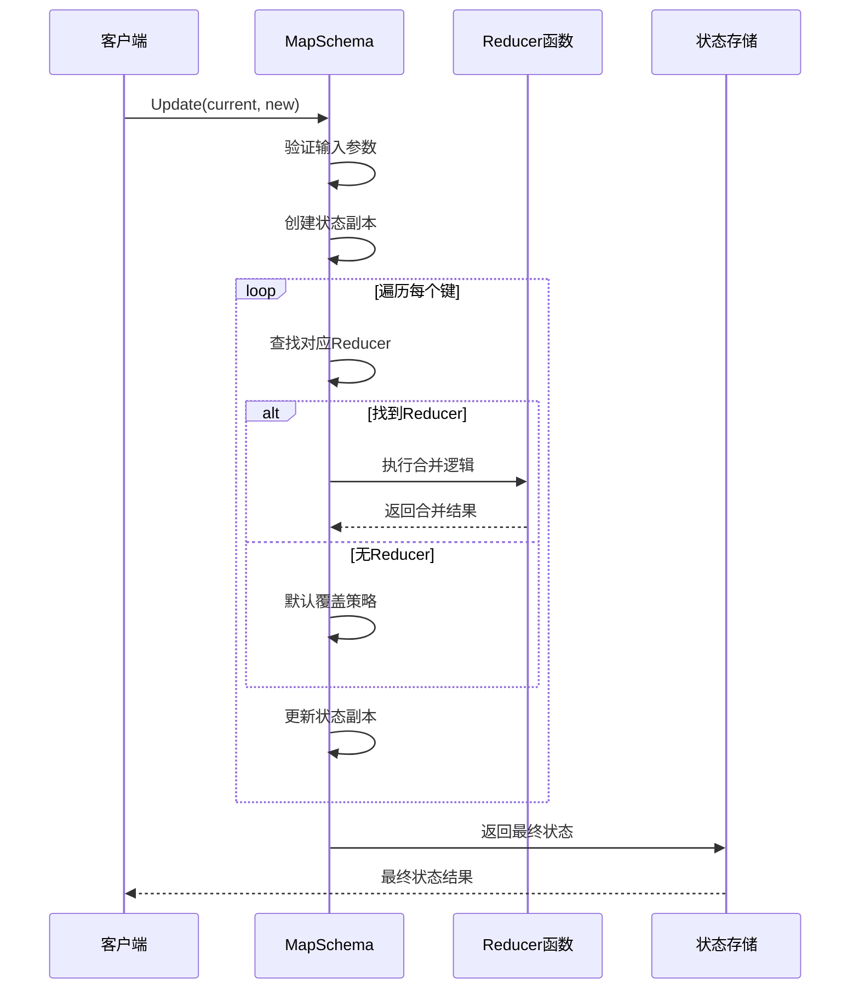

**图表来源**
- [schema.go](file://graph/schema.go#L62-L99)

## 详细组件分析

### MapSchema 核心实现

MapSchema 是 BinaryOperatorChannel 的核心实现类，负责管理状态结构和更新逻辑：

```mermaid
classDiagram
class MapSchema {
+Reducers map[string]Reducer
+EphemeralKeys map[string]bool
+NewMapSchema() *MapSchema
+RegisterReducer(key, reducer)
+RegisterChannel(key, reducer, isEphemeral)
+Init() interface{}
+Update(current, new) (interface{}, error)
+Cleanup(state) interface{}
}
class Reducer {
<<function>>
+(current, new) (interface{}, error)
}
MapSchema --> Reducer : 使用多个
```

**图表来源**
- [schema.go](file://graph/schema.go#L29-L55)

### Reducer 函数族

框架提供了多种预定义的 Reducer 函数：

#### AppendReducer 实现机制

AppendReducer 负责将新元素追加到现有集合中：

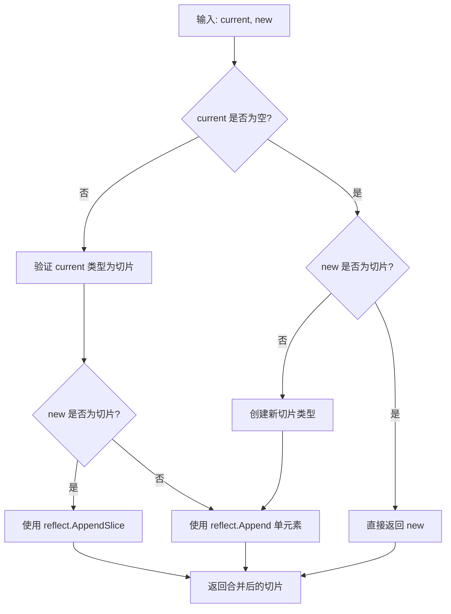

**图表来源**
- [schema.go](file://graph/schema.go#L147-L184)

#### AddMessages 智能合并算法

AddMessages 实现了基于 ID 的智能消息合并逻辑：

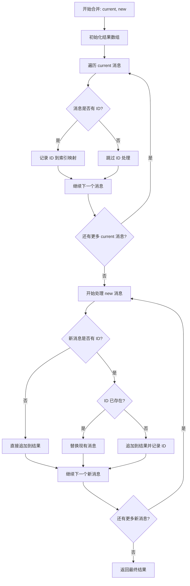

**图表来源**
- [add_messages.go](file://graph/add_messages.go#L22-L83)

**节来源**
- [add_messages.go](file://graph/add_messages.go#L1-L135)

## 核心方法实现机制

### Update 方法详解

Update 方法是 BinaryOperatorChannel 的核心状态更新入口，其实现包含以下关键步骤：

#### 参数验证与初始化

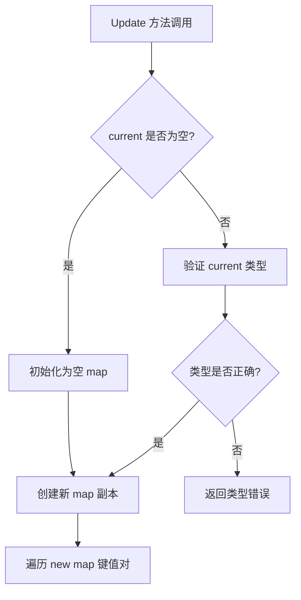

#### Reducer 查找与应用

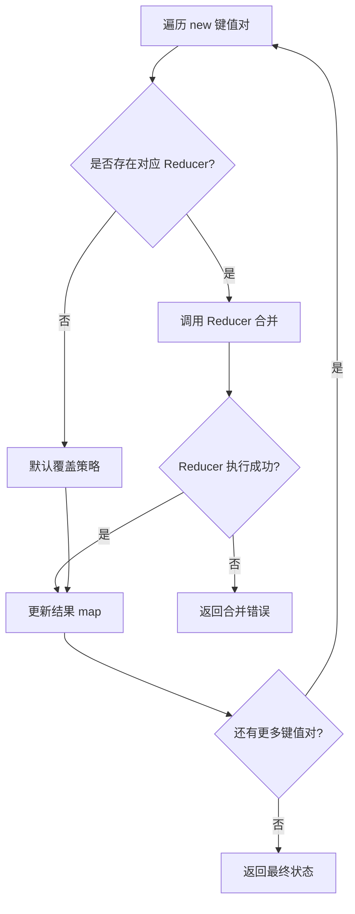

**图表来源**
- [schema.go](file://graph/schema.go#L62-L99)

### Get 方法实现

虽然 BinaryOperatorChannel 本身不直接提供 Get 方法，但通过状态查询机制可以访问累积结果：

#### 状态查询流程

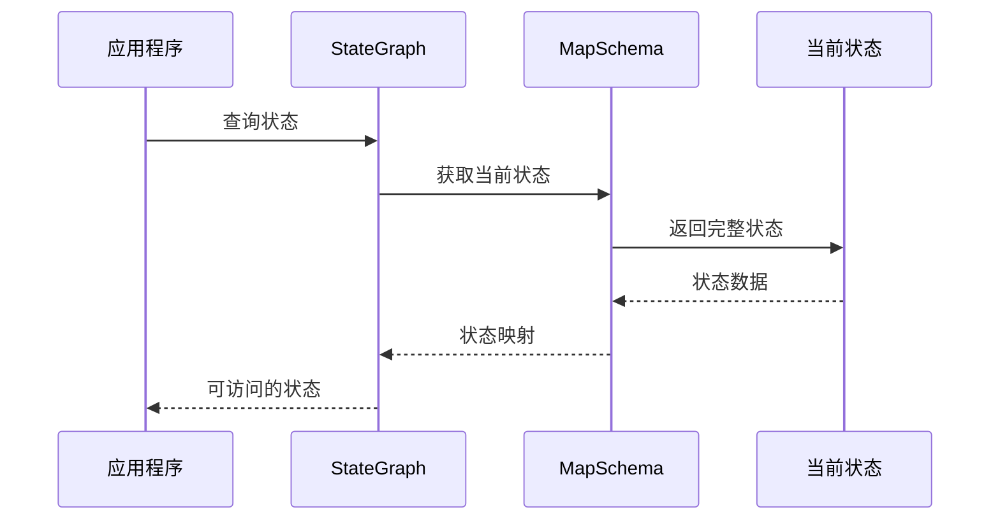

### Checkpoint 和 Restore 机制

BinaryOperatorChannel 通过检查点系统实现状态的持久化和恢复：

#### 检查点存储结构

```mermaid
classDiagram
class Checkpoint {
+ID string
+NodeName string
+State interface{}
+Timestamp time.Time
+Version int
+Metadata map[string]interface{}
}
class CheckpointStore {
<<interface>>
+Save(ctx, checkpoint) error
+Load(ctx, id) (*Checkpoint, error)
+List(ctx, executionID) ([]*Checkpoint, error)
+Delete(ctx, id) error
+Clear(ctx) error
}
class MemoryCheckpointStore {
+checkpoints map[string]*Checkpoint
+mutex sync.RWMutex
+Save(ctx, checkpoint) error
+Load(ctx, id) (*Checkpoint, error)
+List(ctx, executionID) ([]*Checkpoint, error)
+Delete(ctx, id) error
+Clear(ctx) error
}
CheckpointStore <|.. MemoryCheckpointStore
MemoryCheckpointStore --> Checkpoint
```

**图表来源**
- [checkpointing.go](file://examples/checkpointing/main.go#L1-L119)

**节来源**
- [checkpointing.go](file://examples/checkpointing/main.go#L1-L119)

## 状态管理与持久化

### 并发安全机制

BinaryOperatorChannel 通过以下机制确保并发安全性：

#### 状态副本机制

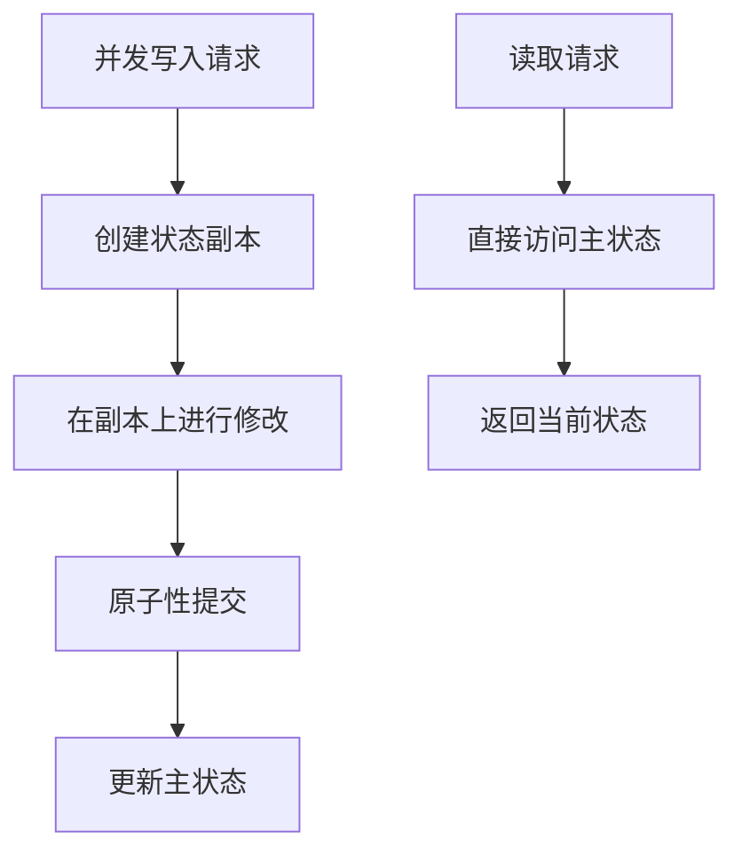

#### 锁机制实现

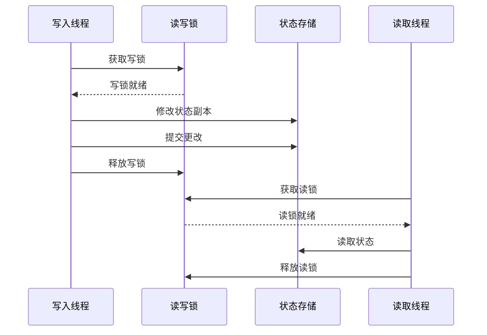

### 幂等性保证

BinaryOperatorChannel 通过以下方式保证操作的幂等性：

#### 唯一标识符机制

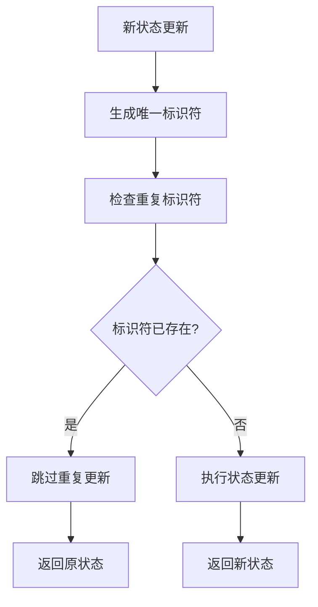

#### 版本控制策略

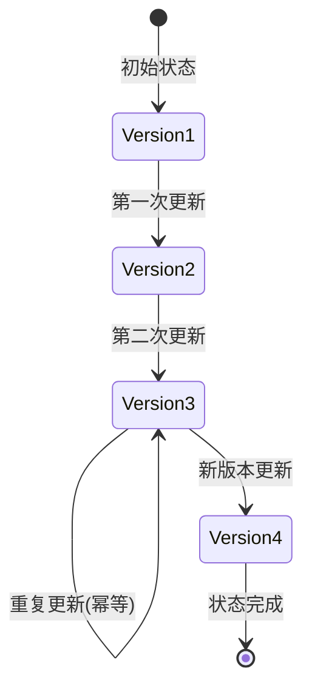

**节来源**
- [state_graph.go](file://graph/state_graph.go#L115-L200)

## 应用场景与最佳实践

### 消息累加场景

BinaryOperatorChannel 在消息累加场景中表现出色：

#### 基础消息追加

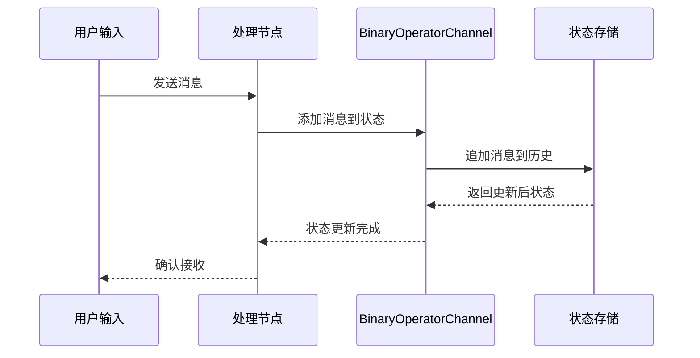

#### 智能消息合并

AddMessages 函数在处理工具调用和响应时特别有用：

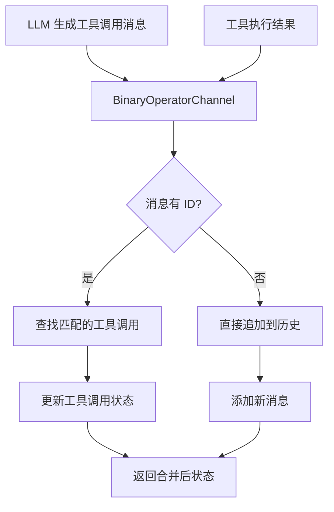

**图表来源**
- [add_messages.go](file://graph/add_messages.go#L22-L83)

### 自定义 Reducer 实现

框架支持用户定义自己的 Reducer 函数：

#### 集合去重合并

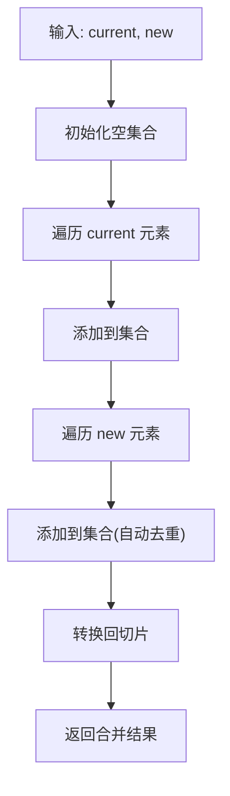

**图表来源**
- [custom_reducer/main.go](file://examples/custom_reducer/main.go#L11-L42)

### 临时通道管理

BinaryOperatorChannel 支持临时通道，用于管理短暂存在的状态：

#### 生命周期管理

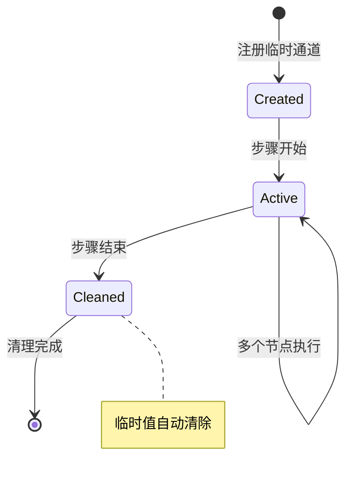

**图表来源**
- [channel_test.go](file://graph/channel_test.go#L10-L75)

**节来源**
- [custom_reducer/main.go](file://examples/custom_reducer/main.go#L1-L93)
- [channel_test.go](file://graph/channel_test.go#L1-L75)

## 性能考虑与优化建议

### 内存管理优化

BinaryOperatorChannel 在处理大规模状态时需要考虑内存优化：

#### 延迟加载策略

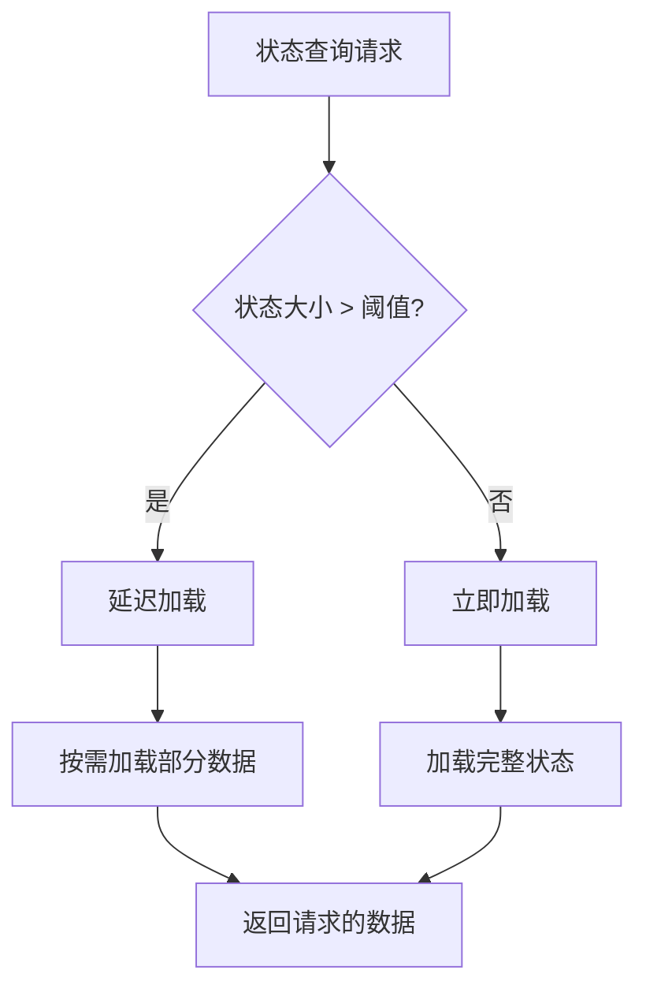

#### 缓存机制

```mermaid
graph LR
A[查询请求] --> B{缓存命中?}
B --> |是| C[返回缓存数据]
B --> |否| D[计算并缓存]
D --> E[返回计算结果]
C --> F[更新访问时间]
E --> G[设置缓存]
```

### 并发性能优化

#### 无锁数据结构

```mermaid
flowchart TD
A["并发写入"] --> B["CAS 操作"]
B --> C{"CAS 成功?"}
C --> |是| D["更新成功"]
C --> |否| E["重试操作"]
E --> B
D --> F["通知观察者"]
```

#### 分区策略

```mermaid
graph TB
A[全局状态] --> B[分区1]
A --> C[分区2]
A --> D[分区N]
B --> E[独立 Reducer]
C --> F[独立 Reducer]
D --> G[独立 Reducer]
E --> H[合并结果]
F --> H
G --> H
```

### 检查点优化

#### 增量检查点

```mermaid
sequenceDiagram
participant App as 应用程序
participant CP as 检查点系统
participant Store as 存储层
App->>CP : 状态变更
CP->>CP : 计算增量差异
CP->>Store : 保存增量检查点
Store-->>CP : 确认保存
CP-->>App : 检查点创建完成
```

## 故障排除指南

### 常见问题诊断

#### 状态不一致问题

```mermaid
flowchart TD
A["状态不一致"] --> B["检查 Reducer 实现"]
B --> C{"Reducer 是否幂等?"}
C --> |否| D["修复 Reducer 逻辑"]
C --> |是| E["检查并发控制"]
E --> F{"存在竞态条件?"}
F --> |是| G["添加同步机制"]
F --> |否| H["检查网络分区"]
D --> I["重新测试"]
G --> I
H --> J["实施容错策略"]
```

#### 性能瓶颈识别

```mermaid
flowchart TD
A["性能问题"] --> B["CPU 使用率高?"]
B --> |是| C["优化 Reducer 算法"]
B --> |否| D["内存使用率高?"]
D --> |是| E["实施内存压缩"]
D --> |否| F["I/O 延迟高?"]
F --> |是| G["优化存储策略"]
F --> |否| H["网络延迟高?"]
C --> I["监控改进效果"]
E --> I
G --> I
H --> J["实施缓存策略"]
```

### 调试技巧

#### 状态追踪

```mermaid
sequenceDiagram
participant Debug as 调试器
participant Schema as 状态模式
participant Log as 日志系统
Debug->>Schema : 设置断点
Schema->>Log : 记录状态变更
Log-->>Debug : 状态变更日志
Debug->>Debug : 分析变更路径
```

#### 检查点验证

```mermaid
flowchart TD
A["恢复检查点"] --> B["验证状态完整性"]
B --> C{"状态是否一致?"}
C --> |否| D["检查数据损坏"]
C --> |是| E["验证 Reducer 执行"]
E --> F{"Reducer 是否正确?"}
F --> |否| G["修复 Reducer"]
F --> |是| H["性能基准测试"]
D --> I["数据恢复"]
G --> J["重新测试"]
H --> K["优化建议"]
```

**节来源**
- [checkpointing_test.go](file://examples/checkpointing/main.go#L1-L119)

## 总结

BinaryOperatorChannel 作为 LangGraphGo 框架的核心状态管理机制，通过二元操作函数提供了强大而灵活的状态累积能力。其设计充分体现了函数式编程的优势，通过纯函数组合实现了复杂的业务逻辑。

### 核心优势

1. **类型安全**: 通过接口定义确保 Reducer 函数的一致性
2. **并发安全**: 内置的副本机制和锁策略保证多线程环境下的数据一致性
3. **扩展性强**: 支持自定义 Reducer 函数，适应各种业务场景
4. **持久化支持**: 完整的检查点机制确保状态的可靠存储和恢复

### 最佳实践建议

1. **合理选择 Reducer**: 根据业务需求选择合适的聚合策略
2. **优化状态结构**: 避免过大的状态对象，实施适当的分层策略
3. **监控性能指标**: 定期检查内存使用和执行效率
4. **实施备份策略**: 建立完善的检查点和恢复机制

BinaryOperatorChannel 不仅是一个技术实现，更是函数式编程思想在实际项目中的成功应用。它为构建可扩展、可维护的状态管理系统提供了坚实的基础，是现代分布式应用开发的重要工具。