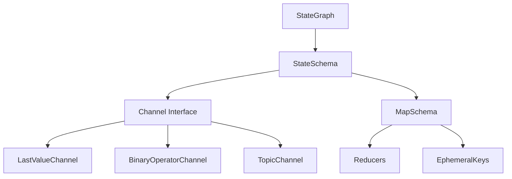
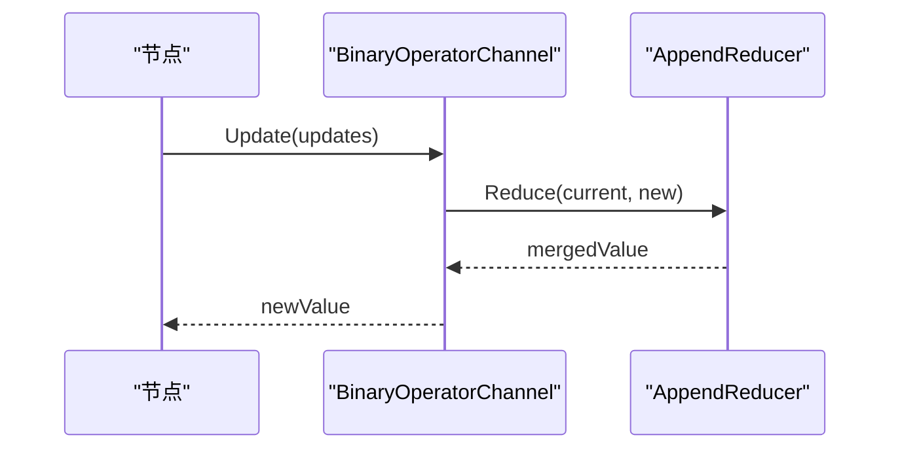
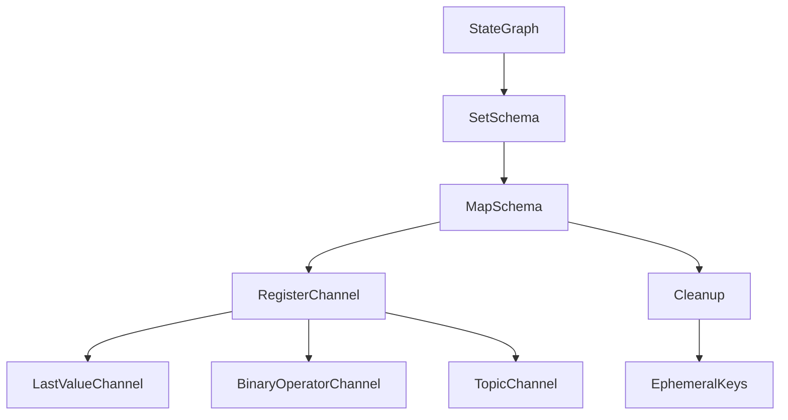
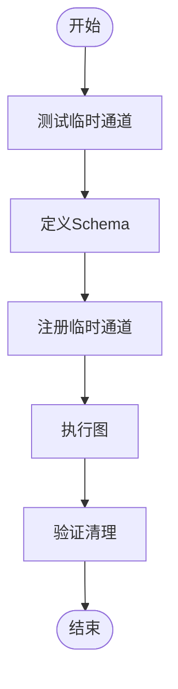

# 通道架构

<cite>
**本文档引用的文件**
- [RFC_CHANNELS.md](file://docs/RFC_CHANNELS.md)
- [schema.go](file://graph/schema.go)
- [state_graph.go](file://graph/state_graph.go)
- [channel_test.go](file://graph/channel_test.go)
- [ephemeral_channels/main.go](file://examples/ephemeral_channels/main.go)
- [ephemeral_channels/README_CN.md](file://examples/ephemeral_channels/README_CN.md)
</cite>

## 目录
1. [引言](#引言)
2. [通道架构概述](#通道架构概述)
3. [核心组件分析](#核心组件分析)
4. [标准通道实现](#标准通道实现)
5. [依赖关系分析](#依赖关系分析)
6. [性能考量](#性能考量)
7. [故障排除指南](#故障排除指南)
8. [结论](#结论)

## 引言
本文档基于 `docs/RFC_CHANNELS.md` 中的设计提案，全面阐述了在 langgraphgo 中引入 `Channel` 接口的动机、优势及其对系统灵活性的提升。`Channel` 架构为状态管理提供了比传统 `Reducer` 更强大和灵活的范式，支持去重、主题广播、历史窗口等高级功能，并为未来实现如 Swarm 架构等复杂智能体模式奠定了基础。

## 通道架构概述
`Channel` 架构是 langgraphgo 状态管理的核心演进，旨在提供一种更灵活、可扩展的方式来处理图节点间的状态更新和数据流。该架构通过定义一个正式的 `Channel` 接口，取代或增强现有的 `Reducer` 模型，从而实现更丰富的状态行为。



**图示来源**
- [RFC_CHANNELS.md](file://docs/RFC_CHANNELS.md#L20-L36)
- [schema.go](file://graph/schema.go#L8-L34)

**本节来源**
- [RFC_CHANNELS.md](file://docs/RFC_CHANNELS.md#L1-L77)

## 核心组件分析
`Channel` 架构的核心在于其接口定义和与 `StateGraph` 的集成。`Channel` 接口定义了四个核心方法：`Update`、`Get`、`Checkpoint` 和 `Restore`，这些方法共同构成了状态管理的基础。

### Channel 接口
`Channel` 接口是所有通道实现的基础，它定义了状态更新、获取、检查点和恢复的契约。

```mermaid
classDiagram
class Channel {
<<interface>>
+Update(ctx context.Context, updates []interface{}) (interface{}, error)
+Get(ctx context.Context) (interface{}, error)
+Checkpoint() (interface{}, error)
+Restore(checkpoint interface{}) error
}
```

**图示来源**
- [RFC_CHANNELS.md](file://docs/RFC_CHANNELS.md#L23-L36)

**本节来源**
- [RFC_CHANNELS.md](file://docs/RFC_CHANNELS.md#L20-L36)

### StateSchema 集成
`StateGraph` 通过 `StateSchema` 接口与 `Channel` 架构集成。`MapSchema` 是 `StateSchema` 的具体实现，它内部使用 `Channel` 来管理状态。

```mermaid
classDiagram
class StateSchema {
<<interface>>
+Init() interface{}
+Update(current, new interface{}) (interface{}, error)
}
class CleaningStateSchema {
<<interface>>
+Cleanup(state interface{}) interface{}
}
class MapSchema {
+Reducers map[string]Reducer
+EphemeralKeys map[string]bool
+RegisterReducer(key string, reducer Reducer)
+RegisterChannel(key string, reducer Reducer, isEphemeral bool)
+Init() interface{}
+Update(current, new interface{}) (interface{}, error)
+Cleanup(state interface{}) interface{}
}
StateSchema <|-- MapSchema
StateSchema <|-- CleaningStateSchema
CleaningStateSchema <|-- MapSchema
```

**图示来源**
- [schema.go](file://graph/schema.go#L8-L34)
- [state_graph.go](file://graph/state_graph.go#L30-L31)

**本节来源**
- [schema.go](file://graph/schema.go#L8-L137)
- [state_graph.go](file://graph/state_graph.go#L94-L97)

## 标准通道实现
提案中定义了三种标准通道实现：`LastValueChannel`、`BinaryOperatorChannel` 和 `TopicChannel`，每种实现都针对特定的状态管理需求。

### LastValueChannel
`LastValueChannel` 存储最新的值，是大多数状态键的默认行为。它等效于直接覆盖（overwrite）操作。

**本节来源**
- [RFC_CHANNELS.md](file://docs/RFC_CHANNELS.md#L41)

### BinaryOperatorChannel
`BinaryOperatorChannel` 应用一个二元操作符（reducer）来更新状态，等效于当前的 `Reducer` 逻辑。例如，`AppendReducer` 用于将新消息追加到消息列表中。



**图示来源**
- [RFC_CHANNELS.md](file://docs/RFC_CHANNELS.md#L42)
- [schema.go](file://graph/schema.go#L146-L185)

**本节来源**
- [schema.go](file://graph/schema.go#L146-L185)

### TopicChannel
`TopicChannel` 实现了发布/订阅模式，适用于消息收件箱等场景。更新被视为消息列表，可以被多个监听器消费。

**本节来源**
- [RFC_CHANNELS.md](file://docs/RFC_CHANNELS.md#L43)

## 依赖关系分析
`Channel` 架构的引入对现有代码库产生了深远影响，主要体现在 `StateGraph`、`MapSchema` 和各种示例的重构上。



**图示来源**
- [state_graph.go](file://graph/state_graph.go#L94-L97)
- [schema.go](file://graph/schema.go#L49-L55)

**本节来源**
- [state_graph.go](file://graph/state_graph.go#L94-L97)
- [schema.go](file://graph/schema.go#L49-L55)

## 性能考量
虽然 `Channel` 架构引入了额外的抽象层，可能带来轻微的接口开销，但这种开销在实际应用中通常是可忽略的。架构的主要优势在于其灵活性和可扩展性，能够支持更复杂的智能体模式，从而在高层次上提升系统性能。

## 故障排除指南
在使用 `Channel` 架构时，常见的问题包括状态更新不一致和临时通道清理不及时。通过单元测试可以验证这些行为的正确性。



**图示来源**
- [channel_test.go](file://graph/channel_test.go#L10-L74)

**本节来源**
- [channel_test.go](file://graph/channel_test.go#L10-L74)
- [ephemeral_channels/README_CN.md](file://examples/ephemeral_channels/README_CN.md#L1-L48)

## 结论
采用 `Channel` 架构是 langgraphgo 支持高级智能体工作流的自然演进。它提供了必要的基元，用于在复杂图中进行稳健的状态管理。通过引入 `Channel` 接口，langgraphgo 不仅与 Python 实现保持一致，还为用户提供了实现自定义通道以满足独特需求的灵活性，同时明确了每个状态部分的行为。