# 内存管理策略

<cite>
**本文引用的文件**
- [memory/doc.go](file://memory/doc.go)
- [memory/strategy.go](file://memory/strategy.go)
- [memory/sequential.go](file://memory/sequential.go)
- [memory/sliding_window.go](file://memory/sliding_window.go)
- [memory/buffer.go](file://memory/buffer.go)
- [memory/summarization.go](file://memory/summarization.go)
- [memory/retrieval.go](file://memory/retrieval.go)
- [memory/hierarchical.go](file://memory/hierarchical.go)
- [memory/graph_based.go](file://memory/graph_based.go)
- [memory/compression.go](file://memory/compression.go)
- [memory/os_like.go](file://memory/os_like.go)
- [examples/memory/memory_examples.go](file://examples/memory/memory_examples.go)
- [memory/README_CN.md](file://memory/README_CN.md)
</cite>

## 目录
1. [引言](#引言)
2. [项目结构](#项目结构)
3. [核心组件](#核心组件)
4. [架构总览](#架构总览)
5. [详细组件分析](#详细组件分析)
6. [依赖分析](#依赖分析)
7. [性能考量](#性能考量)
8. [故障排查指南](#故障排查指南)
9. [结论](#结论)
10. [附录](#附录)

## 引言
本文件系统性梳理 LangGraphGo 仓库中的“内存管理策略”子系统，覆盖从基础线性存储到高级分层/图谱/压缩/类操作系统式内存的多种实现，帮助读者理解不同策略的适用场景、权衡取舍与最佳实践。文档同时提供可视化架构图与流程图，便于快速把握各策略的数据流与处理逻辑。

## 项目结构
memory 包提供统一的 Memory 接口与多种实现；examples/memory 提供端到端演示与性能对比；README 文档给出策略概览与使用建议。

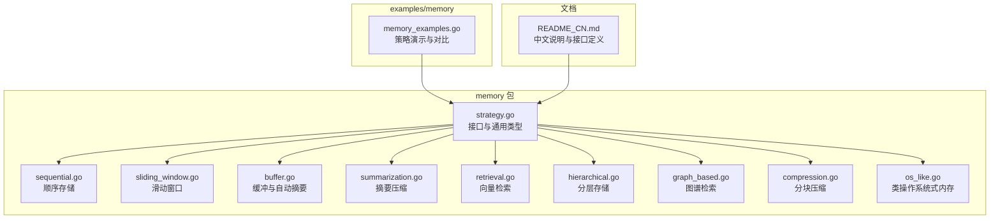

图表来源
- [memory/strategy.go](file://memory/strategy.go#L1-L73)
- [memory/sequential.go](file://memory/sequential.go#L1-L72)
- [memory/sliding_window.go](file://memory/sliding_window.go#L1-L109)
- [memory/buffer.go](file://memory/buffer.go#L1-L163)
- [memory/summarization.go](file://memory/summarization.go#L1-L196)
- [memory/retrieval.go](file://memory/retrieval.go#L1-L232)
- [memory/hierarchical.go](file://memory/hierarchical.go#L1-L265)
- [memory/graph_based.go](file://memory/graph_based.go#L1-L273)
- [memory/compression.go](file://memory/compression.go#L1-L350)
- [memory/os_like.go](file://memory/os_like.go#L1-L315)
- [examples/memory/memory_examples.go](file://examples/memory/memory_examples.go#L1-L446)
- [memory/README_CN.md](file://memory/README_CN.md#L259-L313)

章节来源
- [memory/doc.go](file://memory/doc.go#L1-L241)
- [memory/README_CN.md](file://memory/README_CN.md#L259-L313)

## 核心组件
- 统一接口与通用类型
  - Memory 接口：AddMessage、GetContext、Clear、GetStats
  - Message 结构体：包含角色、内容、时间戳、元数据、近似 token 计数
  - Stats 结构体：统计总数、活跃数、token 数、压缩率
  - NewMessage、estimateTokens、generateID 工具函数
- 线程安全：多数实现通过互斥锁保护内部状态

章节来源
- [memory/strategy.go](file://memory/strategy.go#L1-L73)

## 架构总览
以下类图展示 Memory 接口与各实现的关系，以及关键字段与方法。

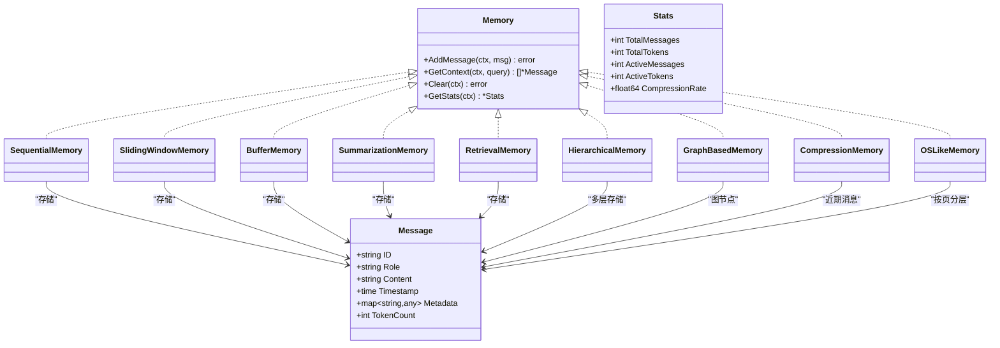

图表来源
- [memory/strategy.go](file://memory/strategy.go#L1-L73)
- [memory/sequential.go](file://memory/sequential.go#L1-L72)
- [memory/sliding_window.go](file://memory/sliding_window.go#L1-L109)
- [memory/buffer.go](file://memory/buffer.go#L1-L163)
- [memory/summarization.go](file://memory/summarization.go#L1-L196)
- [memory/retrieval.go](file://memory/retrieval.go#L1-L232)
- [memory/hierarchical.go](file://memory/hierarchical.go#L1-L265)
- [memory/graph_based.go](file://memory/graph_based.go#L1-L273)
- [memory/compression.go](file://memory/compression.go#L1-L350)
- [memory/os_like.go](file://memory/os_like.go#L1-L315)

## 详细组件分析

### 顺序存储（Sequential Memory）
- 设计要点
  - 保持完整历史，不做裁剪或压缩
  - 适合需要“完美回放”的场景
- 数据流与处理逻辑
  - AddMessage：追加至末尾
  - GetContext：返回全部消息副本
  - Clear：清空
  - GetStats：统计全部消息与 token
- 复杂度与性能
  - 时间复杂度：AddO(1)，GetContextO(n)
  - 空间复杂度：O(n)
  - 令牌成本随对话长度线性增长
- 适用场景
  - 短对话、审计/复盘需求、低延迟检索

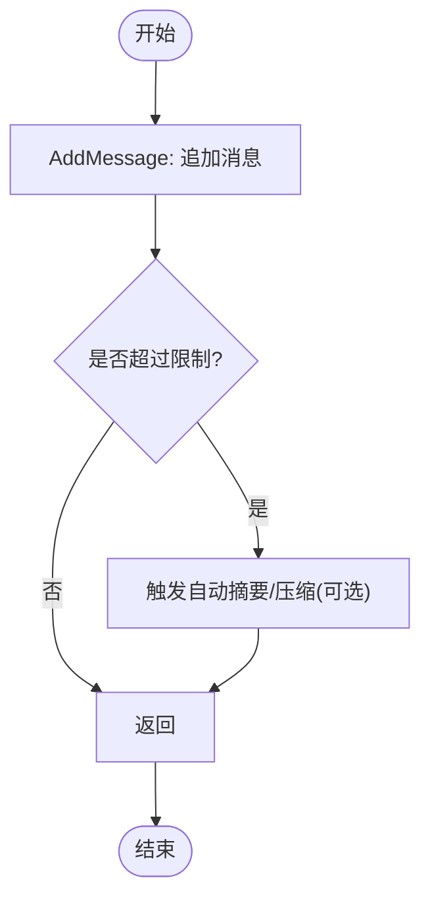

图表来源
- [memory/sequential.go](file://memory/sequential.go#L1-L72)

章节来源
- [memory/sequential.go](file://memory/sequential.go#L1-L72)

### 滑动窗口（Sliding Window Memory）
- 设计要点
  - 固定窗口大小，超出则丢弃最老消息
  - 适合强调“最新上下文”的场景
- 数据流与处理逻辑
  - AddMessage：追加后若超限，丢弃最早条目
  - GetContext：返回当前窗口内全部消息
  - Clear：重置为容量上限的切片
  - GetStats：统计当前窗口 token
- 复杂度与性能
  - 时间复杂度：AddO(1)，GetContextO(n)
  - 空间复杂度：O(w)，w 为窗口大小
- 适用场景
  - 对历史依赖较弱、追求稳定上下文长度的任务

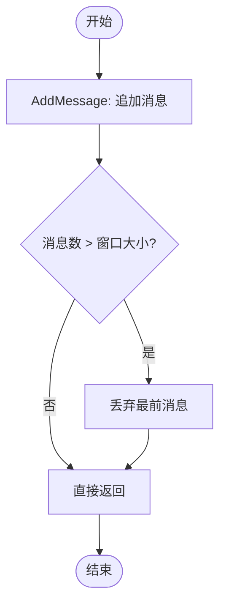

图表来源
- [memory/sliding_window.go](file://memory/sliding_window.go#L1-L109)

章节来源
- [memory/sliding_window.go](file://memory/sliding_window.go#L1-L109)

### 缓冲与自动摘要（Buffer Memory）
- 设计要点
  - 支持消息数量与 token 双重上限
  - 超限时可自动摘要，或直接裁剪
  - 适合需要灵活控制上下文规模的场景
- 数据流与处理逻辑
  - AddMessage：先追加，再检查 MaxMessages 与 MaxTokens，必要时触发摘要或裁剪
  - GetContext：返回全部消息副本
  - Clear/GetStats：常规操作
- 复杂度与性能
  - 时间复杂度：Add 最坏 O(n^2)（需多次扫描与摘要），GetContextO(n)
  - 空间复杂度：O(n)
- 适用场景
  - 需要在固定 token 预算内尽可能保留上下文

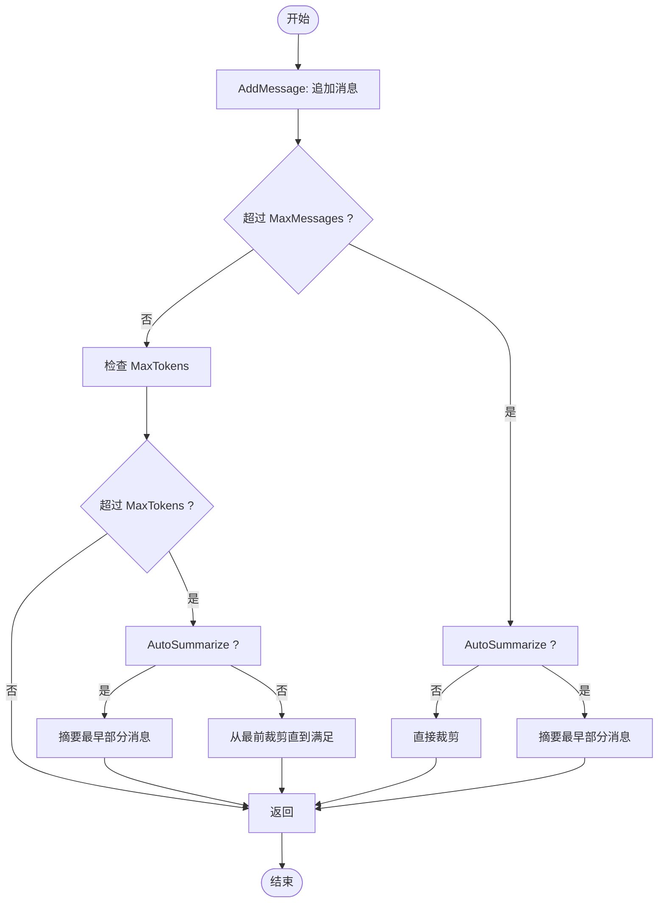

图表来源
- [memory/buffer.go](file://memory/buffer.go#L1-L163)

章节来源
- [memory/buffer.go](file://memory/buffer.go#L1-L163)

### 摘要压缩（Summarization Memory）
- 设计要点
  - 保留最近若干条完整消息，其余定期摘要
  - 适合长对话且希望保留关键片段
- 数据流与处理逻辑
  - AddMessage：追加到 recentMessages，超过阈值触发摘要
  - triggerSummarization：调用 Summarizer 生成摘要，保存并仅保留 recentWindowSize 条
  - GetContext：先返回摘要消息（system 角色），再返回 recentMessages
  - Clear/GetStats：常规操作
- 复杂度与性能
  - 时间复杂度：Add 最坏 O(n^2)（摘要与复制），GetContextO(n)
  - 空间复杂度：O(n)
- 适用场景
  - 长期对话、需要平衡历史完整性与 token 成本

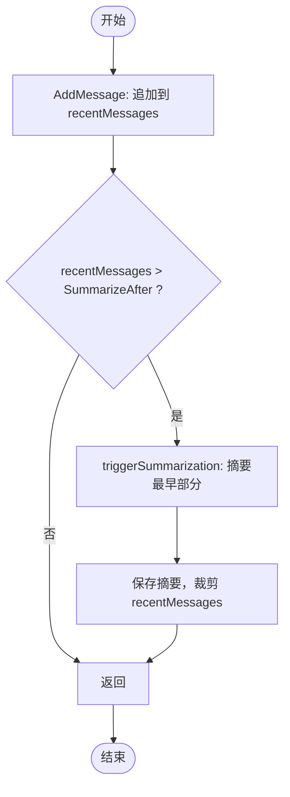

图表来源
- [memory/summarization.go](file://memory/summarization.go#L1-L196)

章节来源
- [memory/summarization.go](file://memory/summarization.go#L1-L196)

### 向量检索（Retrieval Memory）
- 设计要点
  - 为每条消息生成向量嵌入，查询时计算相似度，返回 TopK
  - 适合语义相关性强但时间顺序不重要的任务
- 数据流与处理逻辑
  - AddMessage：生成嵌入并保存
  - GetContext：生成查询向量，计算余弦相似度，排序取 TopK
  - Clear/GetStats/SetTopK：常规操作
- 复杂度与性能
  - 时间复杂度：AddO(1)，GetContextO(n log n)
  - 空间复杂度：O(n)
- 适用场景
  - 需要语义召回而非严格时间顺序的任务

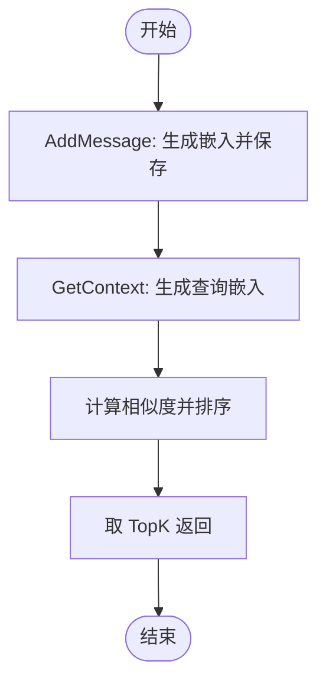

图表来源
- [memory/retrieval.go](file://memory/retrieval.go#L1-L232)

章节来源
- [memory/retrieval.go](file://memory/retrieval.go#L1-L232)

### 分层存储（Hierarchical Memory）
- 设计要点
  - 三层：recent（总是包含）、important（高优先级）、archive（低频）
  - 通过 ImportanceScorer 或显式元数据标记重要性
- 数据流与处理逻辑
  - AddMessage：始终加入 recent；根据评分加入 important；recent 超限时移入 archive（避免重复）
  - GetContext：先返回 important，再返回 recent（去重）
  - Clear/GetStats：统计三层总量与活跃 token
- 复杂度与性能
  - 时间复杂度：AddO(n)，GetContextO(n)
  - 空间复杂度：O(n)
- 适用场景
  - 需要区分“重要历史 vs 新鲜上下文”的复杂应用

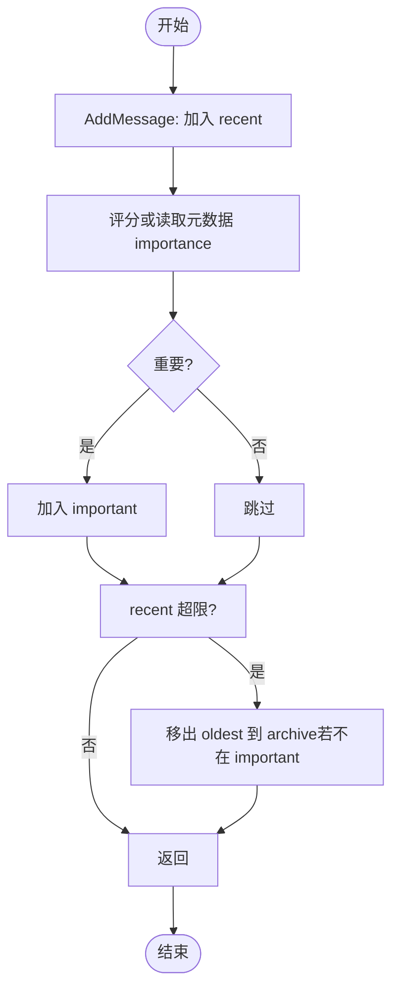

图表来源
- [memory/hierarchical.go](file://memory/hierarchical.go#L1-L265)

章节来源
- [memory/hierarchical.go](file://memory/hierarchical.go#L1-L265)

### 图谱检索（Graph-Based Memory）
- 设计要点
  - 将消息建模为图节点，基于主题/实体建立连接
  - 查询时以查询主题为种子，广度优先遍历 TopK
- 数据流与处理逻辑
  - AddMessage：提取主题，建立双向连接，维护 topic->ids 索引
  - GetContext：提取查询主题，收集种子，BFS 遍历，返回 TopK
  - Clear/GetStats：常规操作
- 复杂度与性能
  - 时间复杂度：AddO(n)，GetContextO(n + E)，E 为边数
  - 空间复杂度：O(n + E)
- 适用场景
  - 主题关联强、需要跨段落语义关联的任务

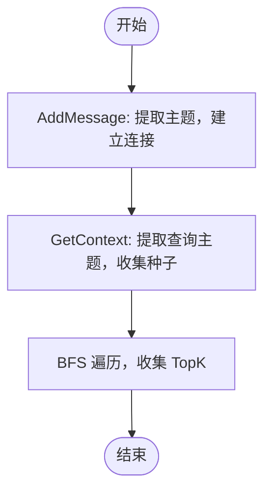

图表来源
- [memory/graph_based.go](file://memory/graph_based.go#L1-L273)

章节来源
- [memory/graph_based.go](file://memory/graph_based.go#L1-L273)

### 分块压缩（Compression Memory）
- 设计要点
  - 当消息达到阈值时压缩为 CompressedBlock，并周期性合并多个块
  - 上下文返回：压缩块（system 角色）+ 最近未压缩消息
- 数据流与处理逻辑
  - AddMessage：追加消息，达到阈值触发 compress；周期性触发 consolidate
  - GetContext：拼接压缩块与近期消息
  - Clear/GetStats/ForceCompression/ForceConsolidation：管理与调试
- 复杂度与性能
  - 时间复杂度：AddO(1)，GetContextO(b + r)
  - 空间复杂度：O(b + r)
- 适用场景
  - 长对话、需要显著降低 token 占用

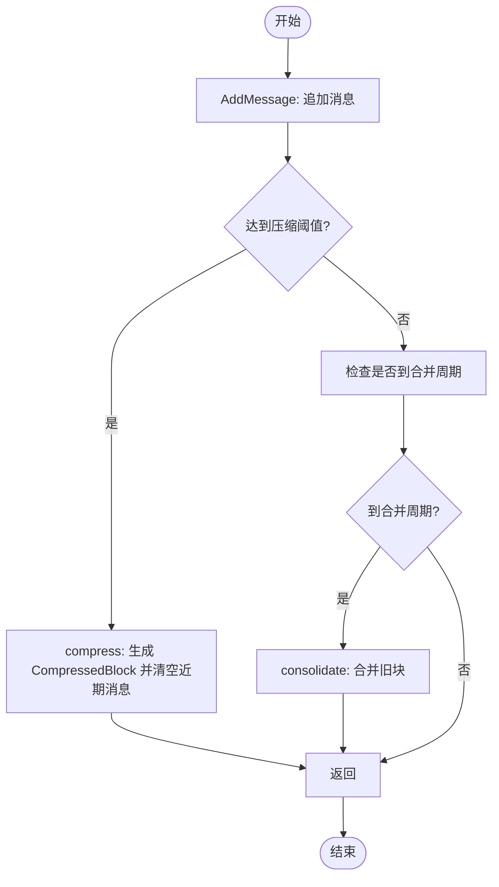

图表来源
- [memory/compression.go](file://memory/compression.go#L1-L350)

章节来源
- [memory/compression.go](file://memory/compression.go#L1-L350)

### 类操作系统式内存（OS-Like Memory）
- 设计要点
  - 三段式生命周期：active（活跃）、cache（缓存）、archive（归档）
  - 基于时间窗口分页（默认 5 分钟），LRU 淘汰
  - GetContext 优先从 active 提取，不足时从 cache 提升
- 数据流与处理逻辑
  - AddMessage：按时间窗口分页，加入 active；超限时逐级淘汰
  - GetContext：从 active 提取；不足时从 cache 提升至 active
  - Clear/GetStats/GetMemoryInfo：管理与监控
- 复杂度与性能
  - 时间复杂度：AddO(1)，GetContextO(p)，p 为页数
  - 空间复杂度：O(p)
- 适用场景
  - 高并发、访问模式明显的时间分层任务

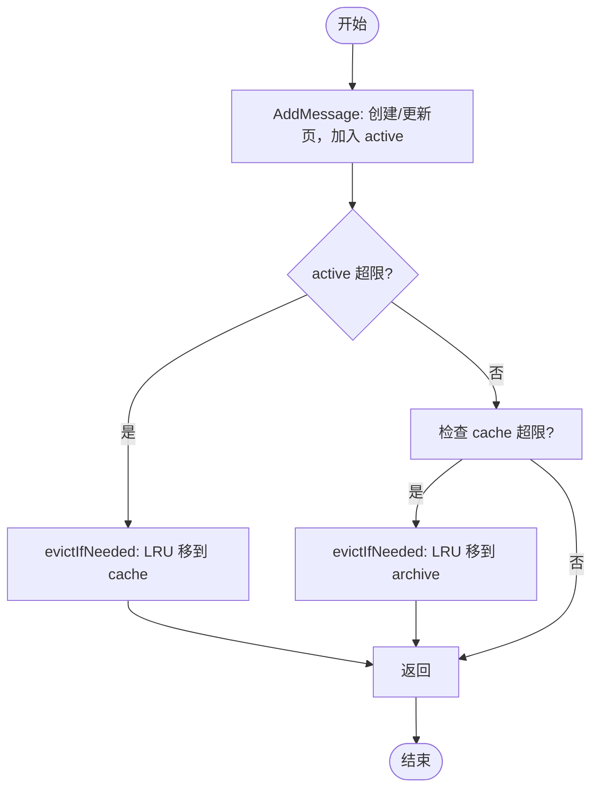

图表来源
- [memory/os_like.go](file://memory/os_like.go#L1-L315)

章节来源
- [memory/os_like.go](file://memory/os_like.go#L1-L315)

## 依赖分析
- 组件耦合
  - 所有实现均依赖 Memory 接口与 Message/Stats 类型，保证统一行为
  - Retrieval/Graph/Compression/OS-Like 等实现引入额外依赖（嵌入、相似度、堆、LRU）
- 并发与同步
  - 多数实现使用 RWMutex 保护内部状态，确保线程安全
- 外部集成点
  - Summarization/Compression/Retrieval 的外部回调（Summarizer/Compressor/EmbeddingFunc）可替换
  - OS-Like 的 LRU 堆用于淘汰策略

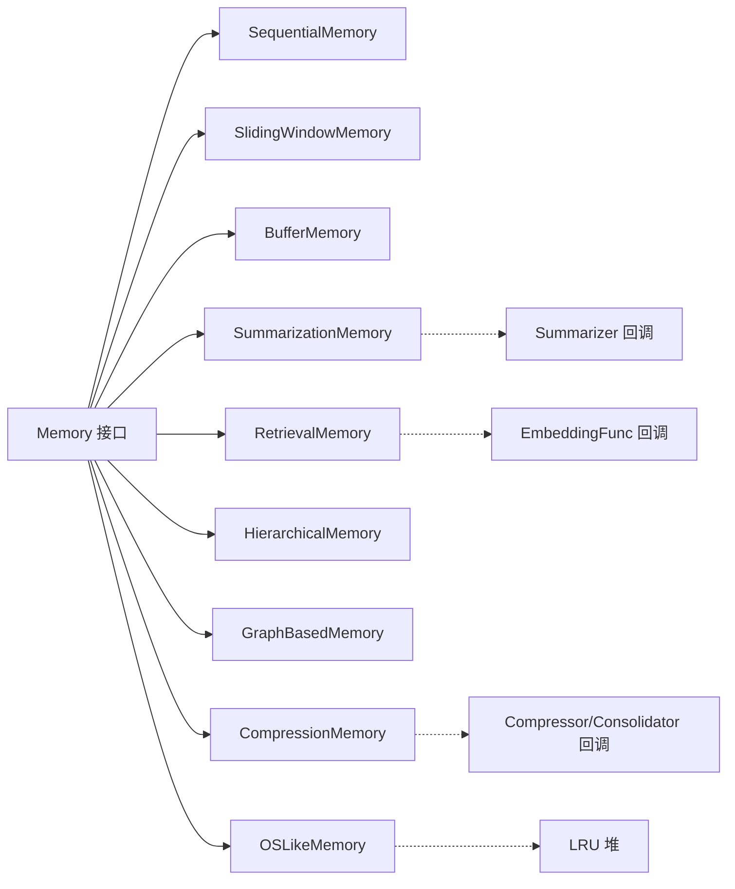

图表来源
- [memory/strategy.go](file://memory/strategy.go#L1-L73)
- [memory/summarization.go](file://memory/summarization.go#L1-L196)
- [memory/compression.go](file://memory/compression.go#L1-L350)
- [memory/retrieval.go](file://memory/retrieval.go#L1-L232)
- [memory/os_like.go](file://memory/os_like.go#L1-L315)

章节来源
- [memory/strategy.go](file://memory/strategy.go#L1-L73)
- [memory/os_like.go](file://memory/os_like.go#L1-L315)

## 性能考量
- 令牌估算
  - 采用字符数粗略估算 token 数，生产环境建议使用更精确的分词器
- 访问模式与淘汰
  - OS-Like 的分页与 LRU 有效降低热点以外的内存占用
- 计算开销
  - Retrieval 的相似度计算、Graph 的 BFS、Compression 的摘要/合并均为 CPU 密集
- 内存占用
  - Sequential/SlidingWindow：线性增长
  - Buffer/Summarization：受阈值控制
  - Retrieval/Graph：索引与图结构带来额外空间
  - Compression/OS-Like：分块/分页减少总体 token

[本节为通用指导，无需列出具体文件来源]

## 故障排查指南
- 常见问题
  - 上下文为空：确认 AddMessage 是否被正确调用，或阈值设置是否过于严格
  - token 超限：调整 MaxMessages/MaxTokens、启用 AutoSummarize 或切换到 Retrieval/Compression
  - 性能下降：检查 Retrieval/Graph 的相似度/图规模，考虑降低 TopK 或合并策略
  - OS-Like 内存信息异常：检查 active/cache 限额与访问窗口配置
- 排查步骤
  - 使用 GetStats 查看 TotalMessages/ActiveTokens/CompressionRate
  - 使用 GetMemoryInfo（OS-Like）查看分层页数
  - 在 examples/memory/memory_examples.go 中运行演示，观察不同策略的行为差异

章节来源
- [examples/memory/memory_examples.go](file://examples/memory/memory_examples.go#L1-L446)
- [memory/os_like.go](file://memory/os_like.go#L1-L315)

## 结论
- 选择策略的原则
  - 简单对话：Sequential 或 SlidingWindow
  - 需要固定上下文长度：SlidingWindow
  - 需要兼顾历史与成本：Buffer/Summarization
  - 语义召回优先：Retrieval
  - 复杂应用与多层保留：Hierarchical/Graph
  - 长对话与显著降本：Compression
  - 高并发与访问模式明显：OS-Like
- 最佳实践
  - 明确 token 预算与查询目标
  - 使用 GetStats 监控内存与压缩效果
  - 为外部回调（摘要/压缩/嵌入）准备合适的实现
  - 在真实负载下测试与调参

[本节为总结性内容，无需列出具体文件来源]

## 附录
- 接口与类型参考
  - Memory 接口与 Message/Stats 定义
  - 各策略的构造函数与配置项
- 示例与对比
  - examples/memory/memory_examples.go 提供九种策略的演示与性能对比

章节来源
- [memory/strategy.go](file://memory/strategy.go#L1-L73)
- [examples/memory/memory_examples.go](file://examples/memory/memory_examples.go#L1-L446)
- [memory/README_CN.md](file://memory/README_CN.md#L259-L313)