# 图结构工作流

<cite>
**本文档中引用的文件**
- [graph.go](file://graph/graph.go)
- [state_graph.go](file://graph/state_graph.go)
- [parallel.go](file://graph/parallel.go)
- [subgraph.go](file://graph/subgraph.go)
- [schema.go](file://graph/schema.go)
- [context.go](file://graph/context.go)
- [main.go](file://examples/basic_example/main.go)
- [main.go](file://examples/parallel_execution/main.go)
- [main.go](file://examples/subgraph/main.go)
- [main.go](file://examples/conditional_edges_example/main.go)
- [main.go](file://examples/configuration/main.go)
</cite>

## 目录
1. [简介](#简介)
2. [图结构基本概念](#图结构基本概念)
3. [核心组件架构](#核心组件架构)
4. [节点（Node）详解](#节点node详解)
5. [边（Edge）与条件边（Conditional Edge）](#边edge与条件边conditional-edge)
6. [图的编译与执行](#图的编译与执行)
7. [并行执行机制](#并行执行机制)
8. [子图嵌套与复合图](#子图嵌套与复合图)
9. [状态管理与模式](#状态管理与模式)
10. [配置与流程控制](#配置与流程控制)
11. [错误处理与中断机制](#错误处理与中断机制)
12. [实际应用案例](#实际应用案例)
13. [总结](#总结)

## 简介

langgraphgo 是一个强大的图结构工作流引擎，它提供了构建复杂应用程序流程的理论基础和实践工具。该框架的核心思想是将业务逻辑抽象为有向无环图（DAG），其中节点表示可执行的操作单元，边定义节点间的执行顺序，条件边则允许基于运行时状态动态决定执行路径。

图结构工作流的优势在于：
- **模块化设计**：每个节点都是独立的功能单元
- **灵活路由**：支持条件分支和动态路径选择
- **并行执行**：充分利用多核处理器性能
- **状态管理**：统一的状态更新和持久化机制
- **可观测性**：内置的追踪和回调系统

## 图结构基本概念

### 图的基本组成单元

在 langgraphgo 中，图结构由以下基本单元构成：

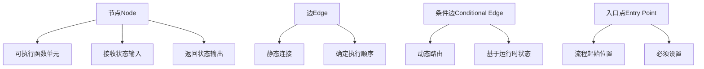

**图表来源**
- [graph.go](file://graph/graph.go#L52-L89)
- [state_graph.go](file://graph/state_graph.go#L10-L32)

### 核心数据结构

框架定义了几个关键的数据结构来表示图的各个组成部分：

| 组件 | 类型 | 描述 | 作用 |
|------|------|------|------|
| Node | struct | 节点对象 | 包含名称和执行函数 |
| Edge | struct | 边对象 | 定义节点间的连接关系 |
| MessageGraph | struct | 消息图 | 基础图结构，支持消息传递 |
| StateGraph | struct | 状态图 | 基于状态管理的图结构 |

**段落来源**
- [graph.go](file://graph/graph.go#L52-L89)
- [state_graph.go](file://graph/state_graph.go#L10-L32)

## 核心组件架构

### MessageGraph 架构

MessageGraph 是框架的基础图结构，提供了完整的图操作功能：

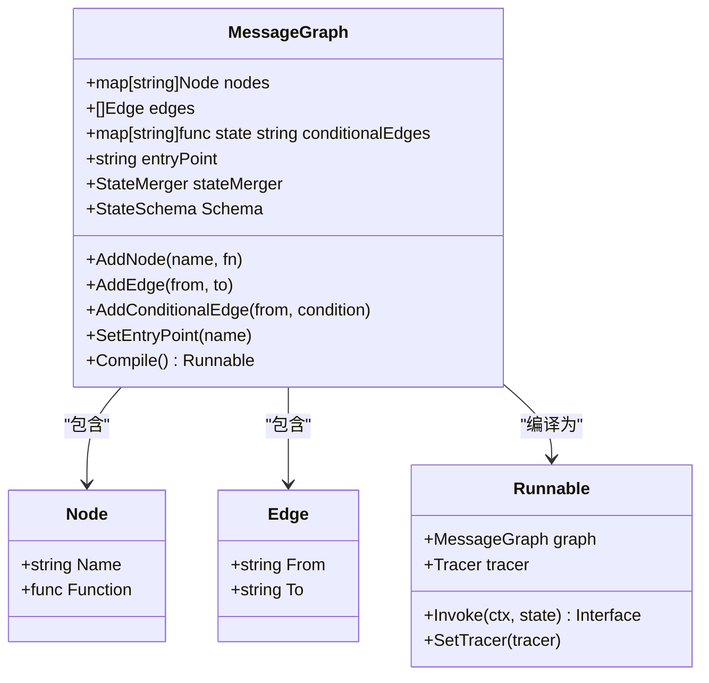

**图表来源**
- [graph.go](file://graph/graph.go#L74-L93)
- [graph.go](file://graph/graph.go#L140-L146)

### StateGraph 扩展功能

StateGraph 在 MessageGraph 的基础上增加了状态管理和重试机制：

```mermaid
classDiagram
    class StateGraph {
        +map[string]Node nodes
        +[]Edge edges
        +map[string]func state string conditionalEdges
        +string entryPoint
        +RetryPolicy retryPolicy
        +StateMerger stateMerger
        +StateSchema Schema
        +SetRetryPolicy(policy)
        +Compile() StateRunnable
    }
    class RetryPolicy {
        +int MaxRetries
        +BackoffStrategy BackoffStrategy
        +[]string RetryableErrors
    }
    class StateRunnable {
        +StateGraph graph
        +Invoke(ctx, state) interface{}
        +executeNodeWithRetry(node, state)
    }
    StateGraph --> RetryPolicy : "配置"
    StateGraph --> StateRunnable : "编译为"
```

**图表来源**
- [state_graph.go](file://graph/state_graph.go#L10-L32)
- [state_graph.go](file://graph/state_graph.go#L34-L49)

**段落来源**
- [graph.go](file://graph/graph.go#L74-L93)
- [state_graph.go](file://graph/state_graph.go#L10-L32)

## 节点（Node）详解

### 节点定义与特性

节点是图结构中的基本执行单元，每个节点都包含一个可执行的函数：

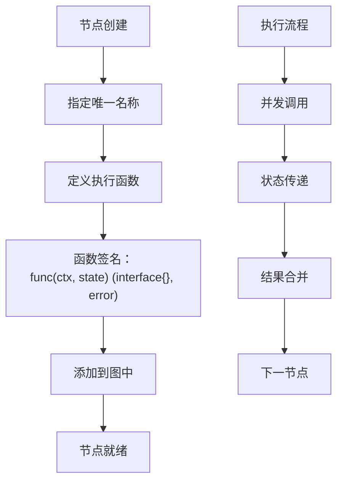

**图表来源**
- [graph.go](file://graph/graph.go#L52-L60)
- [graph.go](file://graph/graph.go#L103-L109)

### 节点执行机制

节点的执行遵循严格的生命周期管理：

| 阶段 | 描述 | 处理方式 |
|------|------|----------|
| 初始化 | 创建节点实例 | 通过 AddNode 方法 |
| 并发执行 | 多个节点同时运行 | 使用 goroutine 并发 |
| 状态传递 | 将当前状态传递给节点 | 作为函数参数 |
| 结果处理 | 收集节点执行结果 | 合并到主状态 |
| 错误处理 | 处理节点执行错误 | 返回 GraphInterrupt |

**段落来源**
- [graph.go](file://graph/graph.go#L174-L492)

## 边（Edge）与条件边（Conditional Edge）

### 静态边（Edge）

静态边定义了图的固定执行路径：

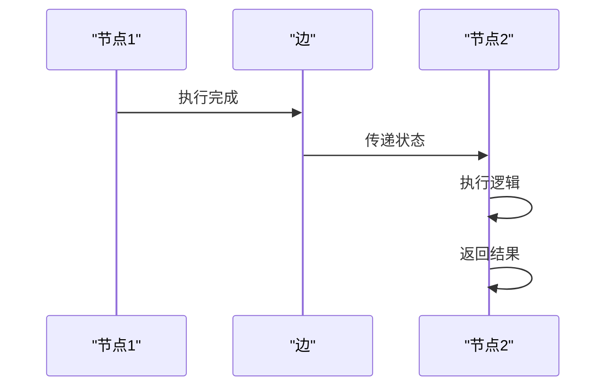

**图表来源**
- [graph.go](file://graph/graph.go#L111-L117)

### 条件边（Conditional Edge）

条件边允许基于运行时状态动态决定执行路径：

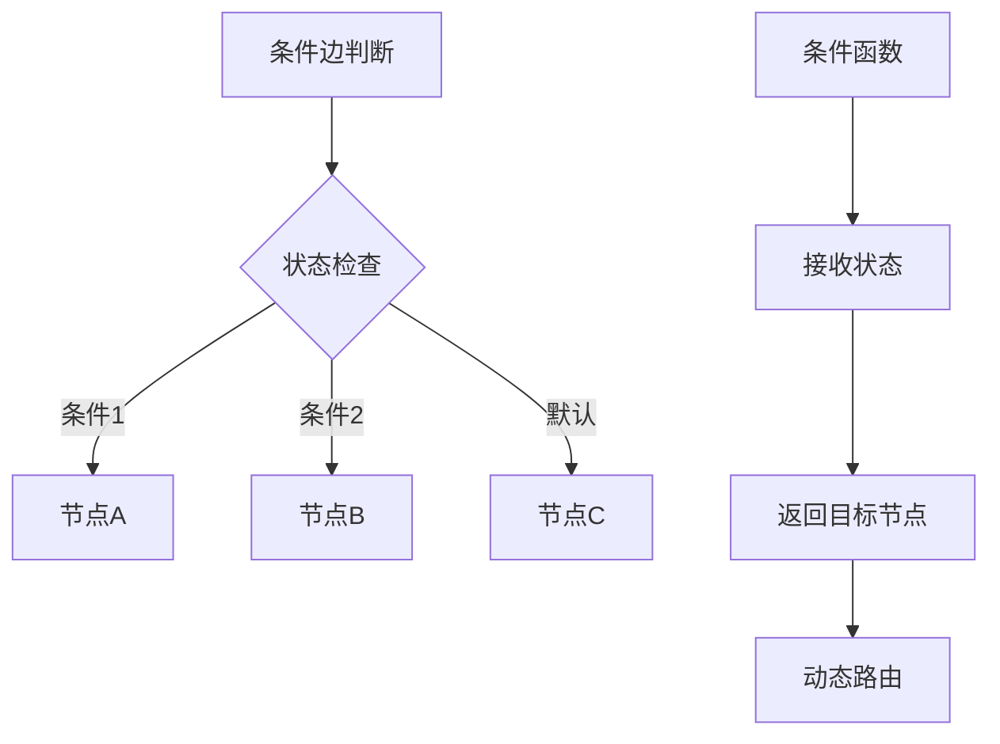

**图表来源**
- [graph.go](file://graph/graph.go#L119-L123)
- [examples/conditional_edges_example/main.go](file://examples/conditional_edges_example/main.go#L66-L88)

### 边的类型对比

| 特性 | 静态边 | 条件边 |
|------|--------|--------|
| 定义时机 | 编译时确定 | 运行时计算 |
| 路径数量 | 固定一条 | 可能多条 |
| 性能开销 | 低 | 中等 |
| 灵活性 | 低 | 高 |
| 使用场景 | 简单线性流程 | 复杂决策流程 |

**段落来源**
- [graph.go](file://graph/graph.go#L111-L123)

## 图的编译与执行

### 编译过程

图的编译是一个关键步骤，它将图结构转换为可执行的 Runnable 实例：

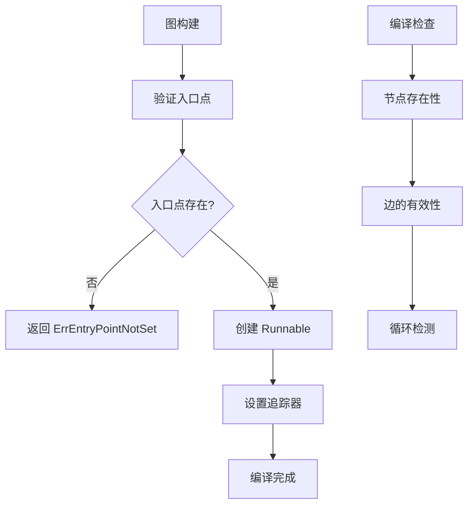

**图表来源**
- [graph.go](file://graph/graph.go#L148-L159)

### 执行流程

Invoke 方法驱动整个图的执行过程：

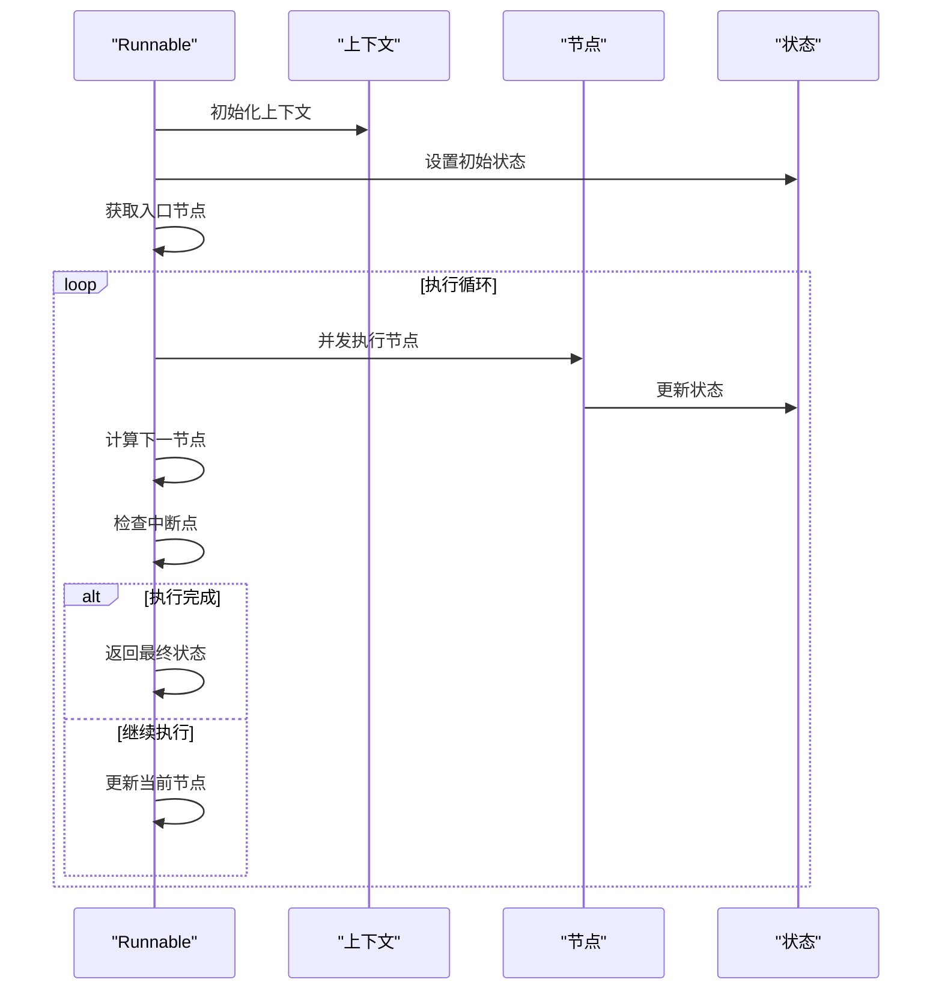

**图表来源**
- [graph.go](file://graph/graph.go#L174-L492)

### 执行配置

框架支持丰富的执行配置选项：

| 配置项 | 类型 | 描述 | 用途 |
|--------|------|------|------|
| Configurable | map | 可配置参数 | 线程ID、用户ID等 |
| Metadata | map | 元数据信息 | 请求ID、标签等 |
| Callbacks | []Callback | 回调函数列表 | 监听执行事件 |
| InterruptBefore | []string | 中断前节点 | 暂停执行 |
| InterruptAfter | []string | 中断后节点 | 暂停执行 |

**段落来源**
- [graph.go](file://graph/graph.go#L174-L492)
- [examples/configuration/main.go](file://examples/configuration/main.go#L53-L62)

## 并行执行机制

### 并行节点架构

框架提供了多种并行执行模式来提高性能：

```mermaid
classDiagram
class ParallelNode {
+[]Node nodes
+string name
+Execute(ctx, state) interface{}
}
class MapReduceNode {
+[]Node mapNodes
+func reducer
+string name
+Execute(ctx, state) interface{}
}
class ParallelNode {
+Execute() []interface{}
+collectResults()
}
ParallelNode --> Node : "包含多个"
MapReduceNode --> ParallelNode : "扩展"
```

**图表来源**
- [parallel.go](file://graph/parallel.go#L9-L21)
- [parallel.go](file://graph/parallel.go#L101-L116)

### 并行执行流程

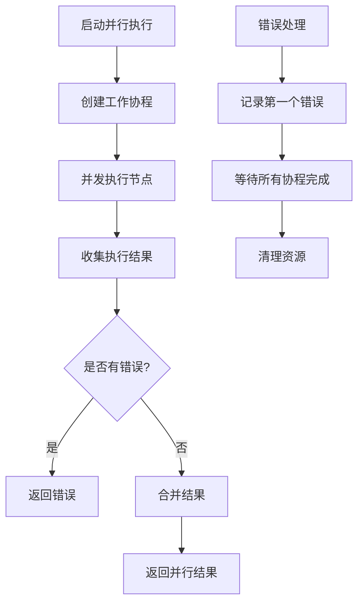

**图表来源**
- [parallel.go](file://graph/parallel.go#L23-L83)

### MapReduce 模式

MapReduce 是一种特殊的并行模式，先并行处理再聚合结果：

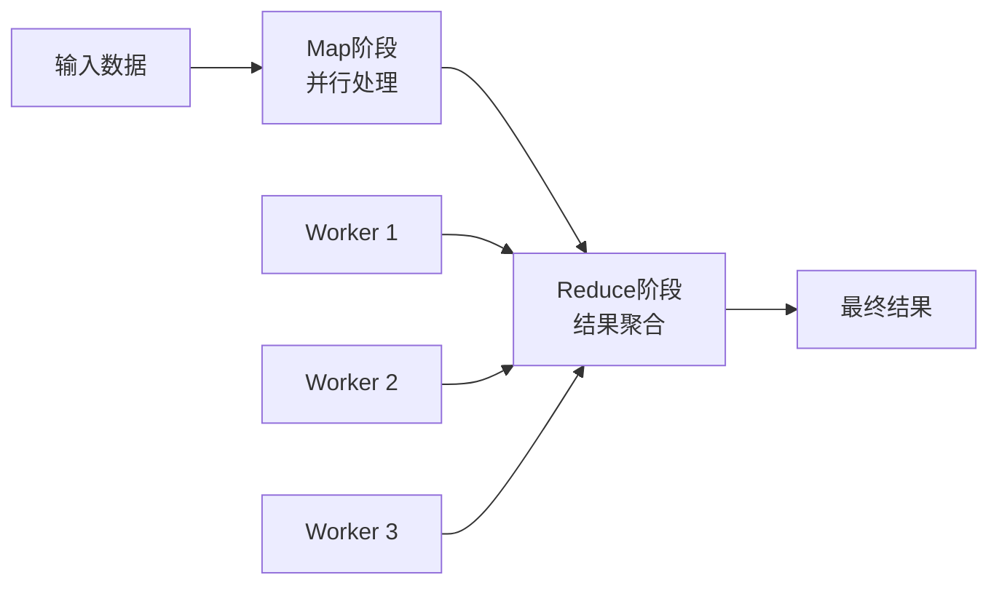

**图表来源**
- [parallel.go](file://graph/parallel.go#L101-L132)

**段落来源**
- [parallel.go](file://graph/parallel.go#L23-L83)
- [parallel.go](file://graph/parallel.go#L101-L132)

## 子图嵌套与复合图

### 子图概念

子图允许将复杂的流程分解为更小的、可重用的组件：

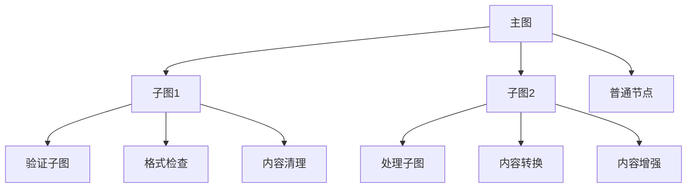

**图表来源**
- [subgraph.go](file://graph/subgraph.go#L8-L27)

### 子图实现机制

```mermaid
classDiagram
class Subgraph {
+string name
+MessageGraph graph
+Runnable runnable
+Execute(ctx, state) interface{}
}
class RecursiveSubgraph {
+string name
+MessageGraph graph
+int maxDepth
+func condition
+Execute(ctx, state) interface{}
+executeRecursive(ctx, state, depth)
}
class CompositeGraph {
+map[string]MessageGraph graphs
+MessageGraph main
+AddGraph(name, graph)
+Connect(from, to, transform)
+Compile() Runnable
}
Subgraph --> MessageGraph : "包装"
RecursiveSubgraph --> MessageGraph : "递归执行"
CompositeGraph --> MessageGraph : "组合多个"
```

**图表来源**
- [subgraph.go](file://graph/subgraph.go#L8-L27)
- [subgraph.go](file://graph/subgraph.go#L108-L140)
- [subgraph.go](file://graph/subgraph.go#L56-L96)

### 嵌套深度控制

递归子图提供了深度控制机制，防止无限递归：

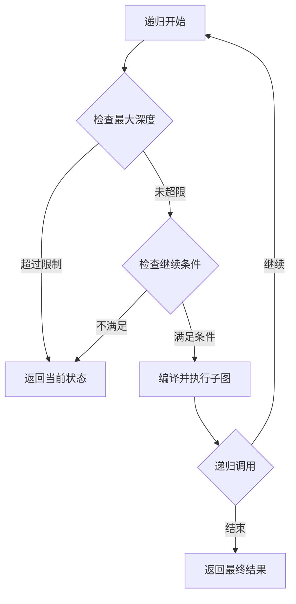

**图表来源**
- [subgraph.go](file://graph/subgraph.go#L130-L159)

**段落来源**
- [subgraph.go](file://graph/subgraph.go#L8-L27)
- [subgraph.go](file://graph/subgraph.go#L108-L140)
- [subgraph.go](file://graph/subgraph.go#L56-L96)

## 状态管理与模式

### 状态模式架构

框架提供了灵活的状态管理模式，支持多种数据结构和更新策略：

```mermaid
classDiagram
class StateSchema {
<<interface>>
+Init() interface{}
+Update(current, new) interface{}
}
class CleaningStateSchema {
<<interface>>
+Cleanup(state) interface{}
}
class MapSchema {
+map[string]Reducer Reducers
+map[string]bool EphemeralKeys
+Init() interface{}
+Update(current, new) interface{}
+Cleanup(state) interface{}
+RegisterReducer(key, reducer)
+RegisterChannel(key, reducer, isEphemeral)
}
class Reducer {
<<function>>
+call(current, new) interface{}
}
StateSchema <|-- CleaningStateSchema
StateSchema <|-- MapSchema
MapSchema --> Reducer : "使用"
```

**图表来源**
- [schema.go](file://graph/schema.go#L12-L27)
- [schema.go](file://graph/schema.go#L29-L55)

### 常用状态模式

| 模式 | 描述 | 使用场景 | 示例 |
|------|------|----------|------|
| 覆盖模式 | 直接替换旧值 | 简单状态更新 | 用户信息更新 |
| 追加模式 | 添加到现有集合 | 列表累积 | 日志记录、任务队列 |
| 自定义模式 | 复杂状态合并 | 业务特定逻辑 | 分数计算、计数器 |

### 状态更新流程

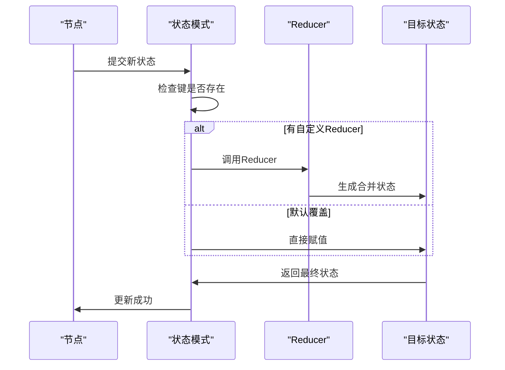

**图表来源**
- [schema.go](file://graph/schema.go#L62-L99)

**段落来源**
- [schema.go](file://graph/schema.go#L12-L27)
- [schema.go](file://graph/schema.go#L29-L55)
- [schema.go](file://graph/schema.go#L62-L99)

## 配置与流程控制

### 配置系统架构

框架提供了分层的配置系统，支持运行时动态调整：

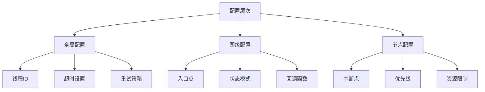

**图表来源**
- [examples/configuration/main.go](file://examples/configuration/main.go#L53-L62)

### 流程控制机制

| 控制类型 | 实现方式 | 用途 | 示例 |
|----------|----------|------|------|
| 中断控制 | InterruptBefore/After | 暂停执行 | 人工审核、调试 |
| 条件跳转 | 条件边 | 动态路由 | 错误处理、功能开关 |
| 循环控制 | 递归子图 | 重复执行 | 数据处理、批处理 |
| 并行控制 | 并行节点 | 性能优化 | 多任务处理 |

### 配置传递机制

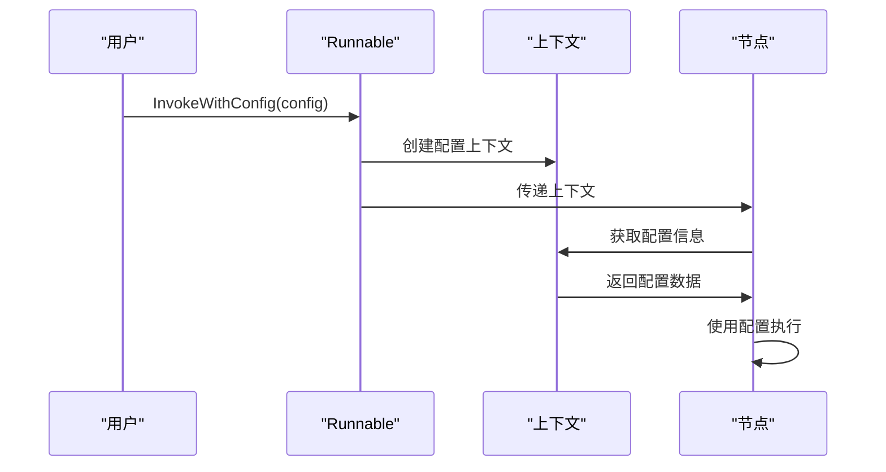

**图表来源**
- [examples/configuration/main.go](file://examples/configuration/main.go#L23-L41)

**段落来源**
- [examples/configuration/main.go](file://examples/configuration/main.go#L53-L62)

## 错误处理与中断机制

### 错误处理架构

框架提供了多层次的错误处理机制：

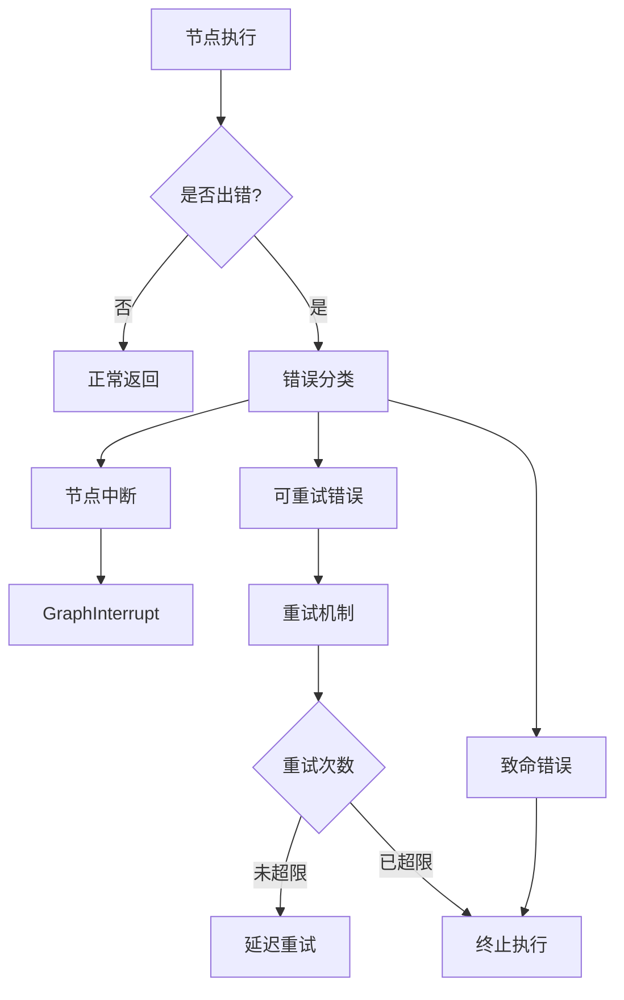

**图表来源**
- [graph.go](file://graph/graph.go#L24-L41)

### 中断机制

中断机制允许在执行过程中暂停和恢复：

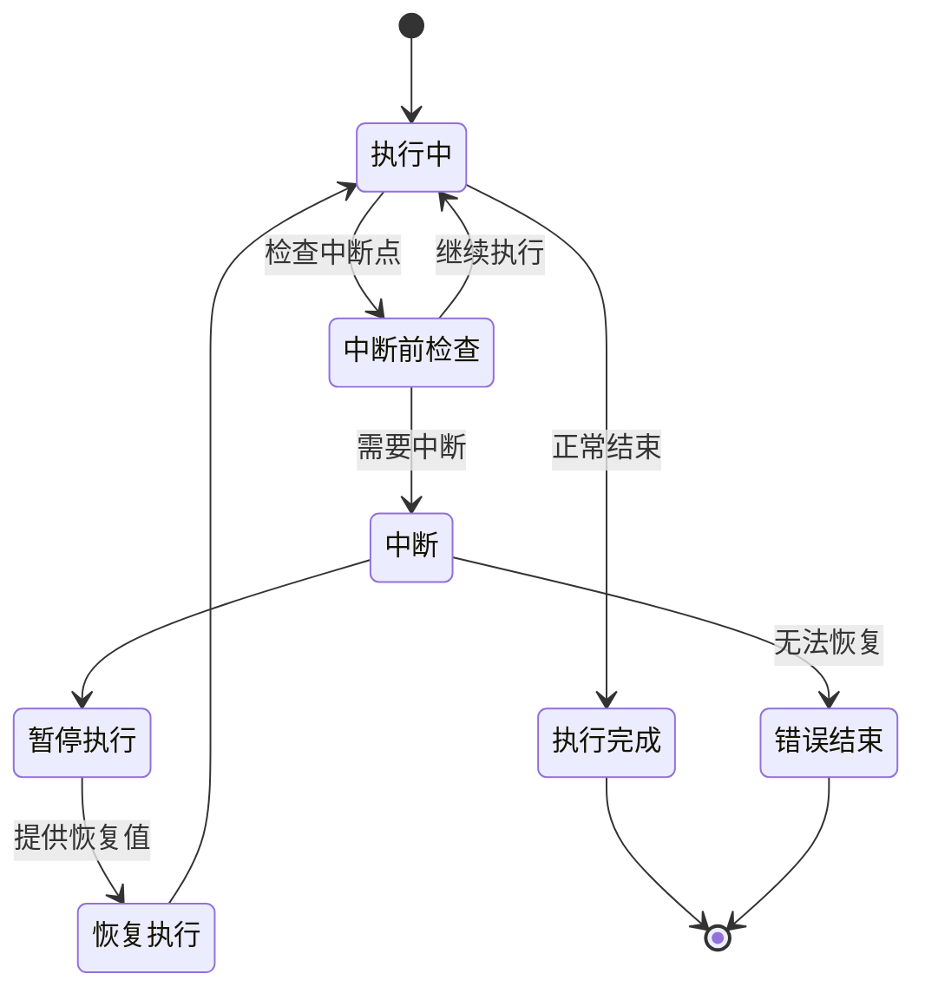

**图表来源**
- [graph.go](file://graph/graph.go#L24-L41)
- [context.go](file://graph/context.go#L7-L16)

### 重试策略

StateGraph 提供了完善的重试机制：

| 策略类型 | 描述 | 适用场景 | 示例 |
|----------|------|----------|------|
| 固定间隔 | 每次重试间隔相同 | 网络请求、数据库查询 | HTTP API调用 |
| 指数退避 | 间隔逐渐增加 | 网络不稳定环境 | 文件上传 |
| 线性退避 | 间隔线性增长 | 渐进式降级 | 负载均衡 |

**段落来源**
- [state_graph.go](file://graph/state_graph.go#L299-L396)
- [graph.go](file://graph/graph.go#L24-L41)

## 实际应用案例

### 基础工作流示例

基础示例展示了图结构的基本使用方法：

```mermaid
graph LR
A["开始"] --> B["处理节点"]
B --> C["结束"]
D["节点函数"] --> E["接收输入"]
E --> F["处理逻辑"]
F --> G["返回结果"]
```

**图表来源**
- [main.go](file://examples/basic_example/main.go#L25-L35)

### 并行执行案例

并行执行展示了如何利用多核处理器：

```mermaid
graph TD
A["开始"] --> B["分支A"]
A --> C["分支B"]
A --> D["分支C"]
B --> E["聚合器"]
C --> E
D --> E
E --> F["结束"]
style B fill:#e1f5fe
style C fill:#e8f5e8
style D fill:#fff3e0
```

**图表来源**
- [main.go](file://examples/parallel_execution/main.go#L63-L77)

### 条件路由案例

条件边展示了动态路由的能力：

```mermaid
flowchart TD
A["分析意图"] --> B{"关键词匹配"}
B --> |问句| C["问题处理"]
B --> |命令| D["命令处理"]
B --> |反馈| E["反馈处理"]
B --> |默认| C
C --> F["结束"]
D --> F
E --> F
```

**图表来源**
- [main.go](file://examples/conditional_edges_example/main.go#L66-L88)

### 子图嵌套案例

子图展示了模块化设计的优势：

```mermaid
graph TD
A["接收文档"] --> B["验证子图"]
B --> C["处理子图"]
C --> D["结束"]
subgraph "验证子图"
B1["格式检查"]
B2["内容清理"]
B1 --> B2
B2 --> B3["验证完成"]
end
subgraph "处理子图"
C1["内容转换"]
C2["内容增强"]
C1 --> C2
C2 --> C3["处理完成"]
end
```

**图表来源**
- [main.go](file://examples/subgraph/main.go#L21-L60)

**段落来源**
- [main.go](file://examples/basic_example/main.go#L25-L35)
- [main.go](file://examples/parallel_execution/main.go#L63-L77)
- [main.go](file://examples/conditional_edges_example/main.go#L66-L88)
- [main.go](file://examples/subgraph/main.go#L21-L60)

## 总结

langgraphgo 的图结构工作流机制为开发者提供了一个强大而灵活的框架来构建复杂的业务流程。通过节点、边、条件边等基本组件，可以构建从简单线性流程到复杂并行和嵌套流程的各种应用场景。

### 核心优势

1. **模块化设计**：每个节点都是独立的功能单元，便于开发和维护
2. **灵活路由**：支持静态边和条件边，能够处理复杂的业务逻辑分支
3. **高性能执行**：内置并行执行机制，充分利用现代硬件资源
4. **状态管理**：提供多种状态模式，适应不同的数据处理需求
5. **可观测性**：完整的追踪和回调系统，便于监控和调试

### 最佳实践建议

1. **合理划分节点**：保持节点功能单一，避免过于复杂的逻辑
2. **谨慎使用条件边**：过多的条件判断会影响可读性和性能
3. **充分利用并行**：对于独立的任务，优先考虑并行执行
4. **设计良好的状态模式**：根据业务需求选择合适的更新策略
5. **适当的错误处理**：为关键节点配置重试机制和错误恢复策略

### 发展方向

langgraphgo 的图结构工作流机制为未来的扩展奠定了坚实的基础，包括但不限于：

- 更丰富的可视化工具
- 更智能的自动优化
- 更强大的分布式执行能力
- 更完善的监控和调试功能

通过深入理解和掌握这些概念和机制，开发者可以构建出更加高效、可靠和可维护的应用程序流程。